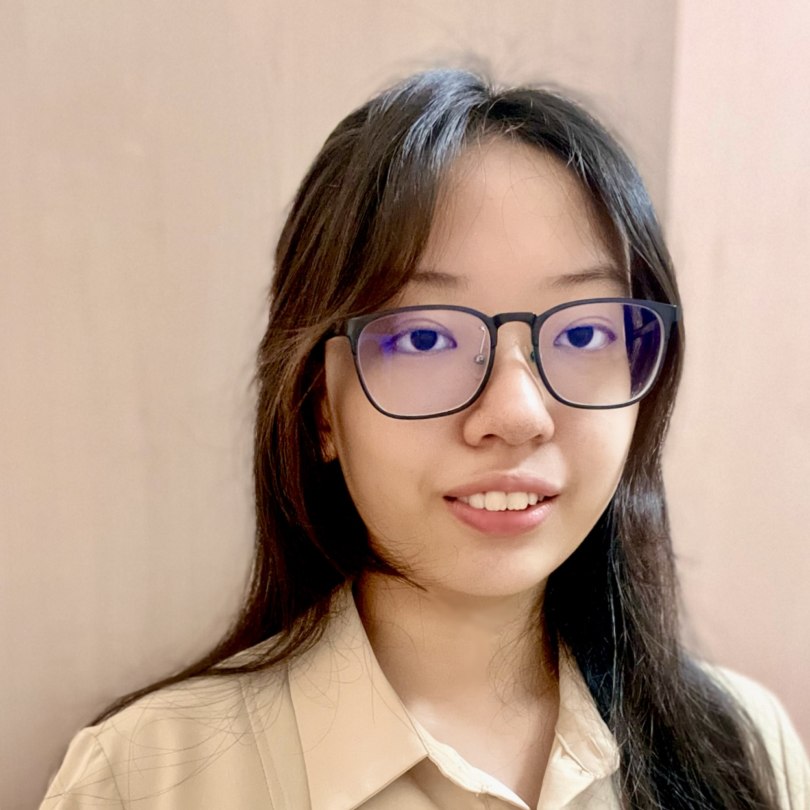
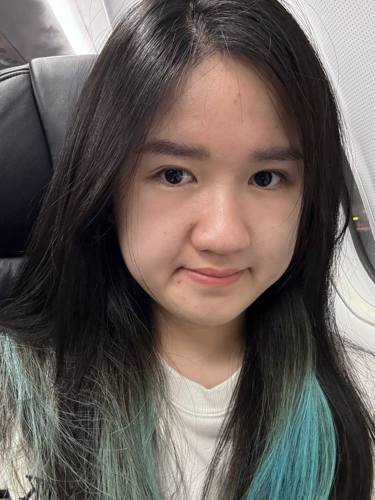

We are a team based in the [School of Computing, National University of Singapore](https://www.comp.nus.edu.sg).

You can reach us at the email `e0969203[at]u.nus.edu`

## Project team

### Zen Koh

[[github](https://github.com/Zenkoh1)]

* Role: Team Lead
* Responsibilities: Logic

### Linette Goh

[[github](http://github.com/linette-g)]

* Role: Developer
* Responsibilities: UI

### Brendan Ng

[[github](http://github.com/brendanng7)]

* Role: Developer
* Responsibilities: DevOps

### Ziying

[[github](http://github.com/zyng233)]

* Role: Developer
* Responsibilities: Dev Ops + Threading

### Gabriel Chang

[[github](http://github.com/gabrielcwt)]

* Role: Developer
* Responsibilities: Testing
