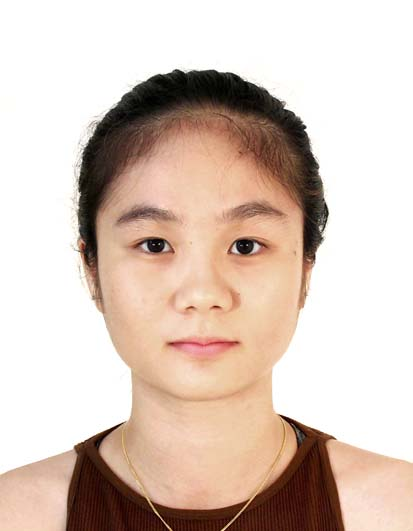

# About Us

We are a team based in the [School of Computing, National University of Singapore](http://www.comp.nus.edu.sg).

You can reach us at the email `cs2103t-w13-3@outlook.com`

## MindMap [W13-3]

### Toh Leong Chuan

[[github](https://github.com/t-leongchuan)]
[[portfolio](team/johndoe.md)]

* Role: Developer
* Responsibilities: UI

### Ze Rui

[[github](https://github.com/slidings)]
[[portfolio](team/johndoe.md)]

* Role: Developer
* Responsibilities: Data

### Lee Zhi Yi

[[github](http://github.com/zhiyi12345)]
[[portfolio](team/johndoe.md)]

* Role: Developer
* Responsibilities: Data

### Tan Jean Yang

[[github](http://github.com/jeanyang04)]
[[portfolio](team/johndoe.md)]

* Role: Developer
* Responsibilities: Dev Ops + Threading

### Ler Jun Yi

[[github](http://github.com/junyi73)]
[[portfolio](team/johndoe.md)]

* Role: Developer
* Responsibilities: UI
