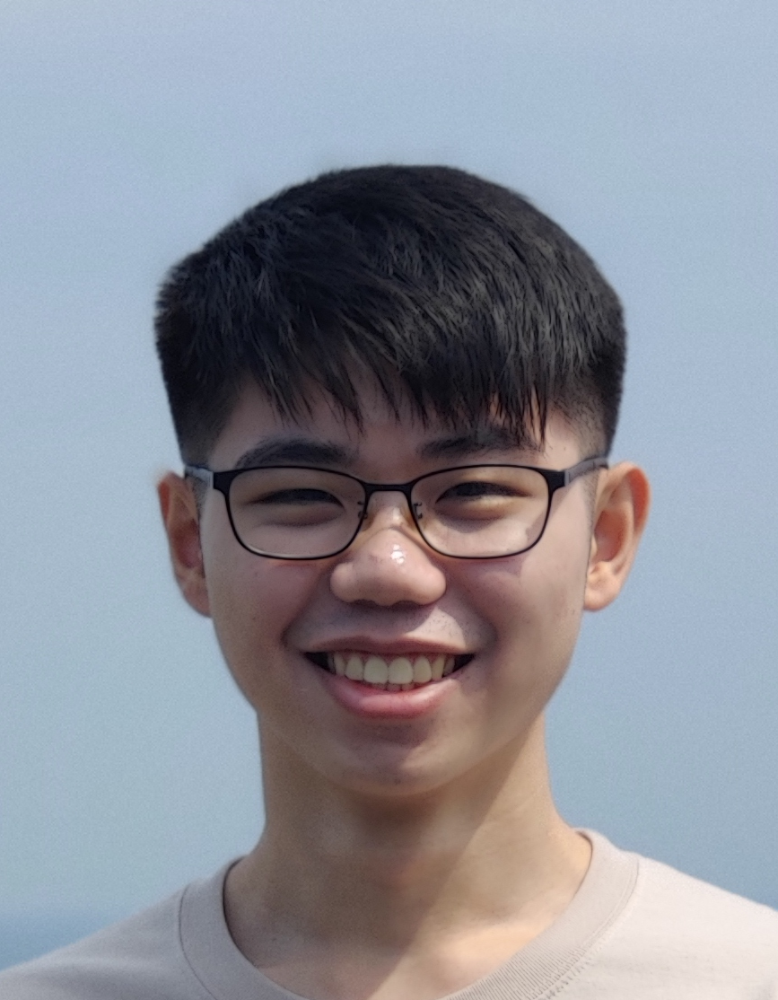

We are a team based in the [School of Computing, National University of Singapore](https://www.comp.nus.edu.sg).

You can reach us at the email `seer[at]comp.nus.edu.sg`

## Project team

### Nicholas Cheng De Fei

[[github](https://github.com/Nicholas-Cheng-De-Fei)]
[[Linkdin](www.linkedin.com/in/nicholas-cheng-)]

* Role: Team Lead
* Responsibilities: VScode expert

### Joel Tio

[[website](https://joelt.io)]
[[github](https://github.com/joeltio)]
[[linkedin](https://www.linkedin.com/in/joel-tio)]

### Lim Jia Wei

[[github](http://github.com/johndoe)]
[[linkedin](https://sg.linkedin.com/in/jiawei88)]

* Role: Developer
* Responsibilities: Testing, IntelliJ Expert

### Sheen

[[github](http://github.com/sheenkerr)]
[[portfolio](https://www.linkedin.com/in/sheenkerr/)]

* Role: Developer
* Responsibilities: Documentation

