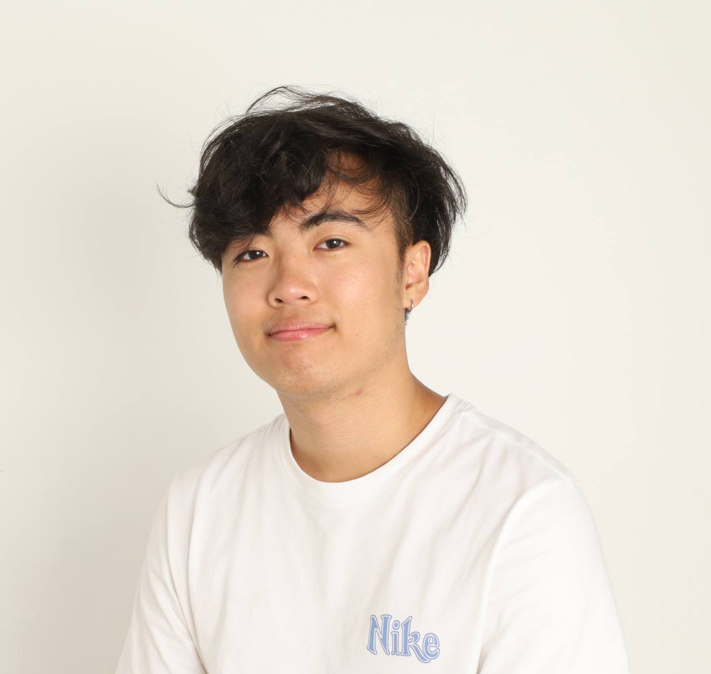

# About Us

We are a team based in the [School of Computing, National University of Singapore](http://www.comp.nus.edu.sg).

You can reach us at the email `seer[at]comp.nus.edu.sg`

## Project team
AY2425S1-CS2103T-F14a-4

### Nguyen Tien Hoang

[[github](https://github.com/blackpanther9229)]
[[portfolio](team/blackpanther9229.md)]

* Role: Team Lead
* Responsibilities: UI

### Justin Jiang

[[github](http://github.com/yooplo)]
[[portfolio](team/justin.md)]

* Role: Developer
* Responsibilities: UI

### Zheng Jie

[[github](https://github.com/KrashKart)] [[portfolio](team/krashkart.md)]

* Role: Developer
* Responsibilities: Data

### Chen Yixun

[[github](http://github.com/cyx22222003)]
[[portfolio](team/cyx22222003.md)]

* Role: Developer
* Responsibilities: Dev Ops + Threading

### Christopher Tan

[[github](http://github.com/chrisjohntan)]
[[portfolio](team/chrisjohntan.md)]

* Role: Developer
* Responsibilities: Integration
