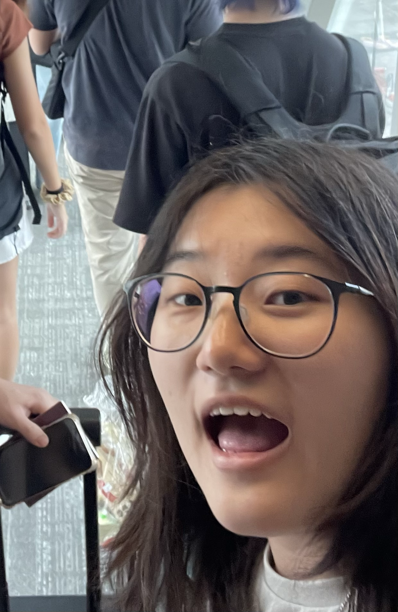

# About Us

We are a team based in the [School of Computing, National University of Singapore](http://www.comp.nus.edu.sg).

You can reach us at the email `seer[at]comp.nus.edu.sg`

## Project team

### Cheng Lui Leng

[[github](https://github.com/luileng)]
[[portfolio](team/luileng.md)]

* Role: Code quality

### Wang Jingjing

[[github](http://github.com/potaotototo)]
[[portfolio](team/potaotototo.md)]

* Role: Developer
* Responsibilities: UI

### Wong Wei Jian

[[github](http://github.com/weijianwong)] [[portfolio](team/weijianwong.md)]

* Role: Developer
* Responsibilities: Documentation + IntelliJ expert

### Curtis Chang

[[github](https://github.com/curtischang2510)]
[[portfolio](team/curtischang2510.md)]

* Role: Developer
* Responsibilities: Scheduling and Tracking

### Quah Kai Kiat

[[github](http://github.com/kaikquah)]
[[portfolio](team/kaikquah.md)]

* Role: Developer
* Responsibilities: Integration and Testing
