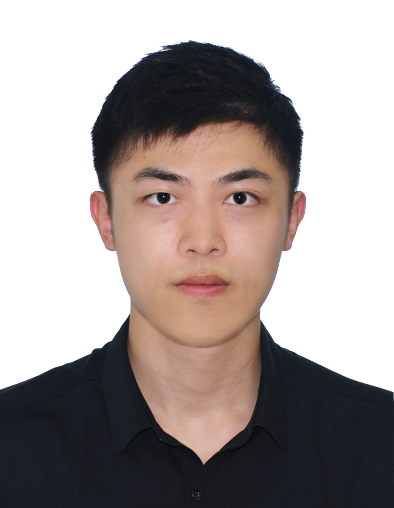

We are a team based in the [School of Computing, National University of Singapore](https://www.comp.nus.edu.sg).

You can reach us at the email `seer@comp.nus.edu.sg`

## Project team

### Tung Yan Zuo

[[Github](http://github.com/darren-tung)]

* Role: Team Lead
* Responsibilities: Oversee CS2101 & CS2103T's task & responsibilities

### Dominic Lei Zeyuan

[[Github](https://github.com/dominic2412)]
- Role: User Guide Coordinator
- Responsibilities: Oversee the User Guide and delegate responsibilities for others to work on it

### Stanley Tang Zhiheng

[[Github](http://github.com/stanleytangzh)]

* Role: QA Tester
* Responsibilities: Main person in charge of finding bugs, categorising the bugs in a QA document and adding test cases

### Rithani Saravanakumar

[[Github](http://github.com/rithanisk)]

* Role: Developer Guide Coordinator
* Responsibilities: Oversee the Developer Guide and delegate responsibilities for others to work on it

### Aditya Joshi

[[Github](http://github.com/thisisaditya17)]

* Role: UI developer & QA Tester
* Responsibilities: Create a new UI and fix any issue regarding it

