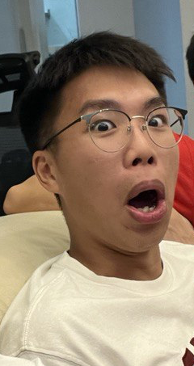

We are a team based in the [School of Computing, National University of Singapore](https://www.comp.nus.edu.sg).

You can reach us at the email `seer[at]comp.nus.edu.sg`

## Project team

### Tania Thng

[[github](http://github.com/taniathng)] [[portfolio](team/taniathng.md)]
* Role: Team Leader
* Responsibilities: Organize team tasks.

### Chiang Qin Kang

[[github](http://github.com/chiangqinkang)]
[[portfolio](team/chiangqinkang.md)]

* Role: Deliverables and deadlines
* Responsibilities: Ensure project deliverables are done on time and in the right format.

### Samuel Lee

[[github](https://github.com/sam-theman88)]
[[portfolio](team/sam-theman88.md)]

* Role: Developer
* Responsibilities: Documentation, Team Morale

### Brian Ma

[[github](http://github.com/bmanara)] [[portfolio](team/bmanara.md)]

* Role: Developer
* Responsibilities: Testing + Integration

### MiloTruck

[[github](http://github.com/milotruck)]
[[portfolio](team/milotruck.md)]

* Role: Developer
* Responsibilities: Code quality
