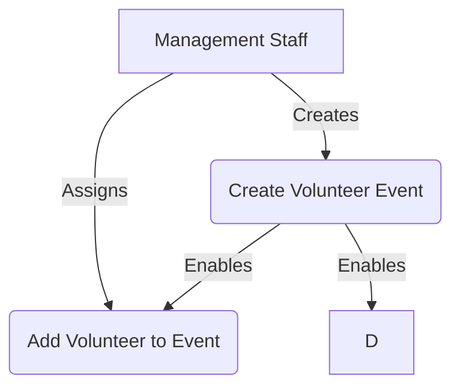

* Table of Contents
{:toc}

--------------------------------------------------------------------------------------------------------------------

## **Acknowledgements**

* {list here sources of all reused/adapted ideas, code, documentation, and third-party libraries -- include links to the original source as well}

--------------------------------------------------------------------------------------------------------------------

## **Setting up, getting started**

Refer to the guide [_Setting up and getting started_](SettingUp.md).

--------------------------------------------------------------------------------------------------------------------

## **Design**

:bulb: **Tip:** The `.puml` files used to create diagrams in this document `docs/diagrams` folder. Refer to the [_PlantUML Tutorial_ at se-edu/guides](https://se-education.org/guides/tutorials/plantUml.html) to learn how to create and edit diagrams.

### Architecture

The ***Architecture Diagram*** given above explains the high-level design of the App.

Given below is a quick overview of main components and how they interact with each other.

**Main components of the architecture**

**`Main`** (consisting of classes [`Main`](https://github.com/se-edu/addressbook-level3/tree/master/src/main/java/seedu/address/Main.java) and [`MainApp`](https://github.com/se-edu/addressbook-level3/tree/master/src/main/java/seedu/address/MainApp.java)) is in charge of the app launch and shut down.
* At app launch, it initializes the other components in the correct sequence, and connects them up with each other.
* At shut down, it shuts down the other components and invokes cleanup methods where necessary.

The bulk of the app's work is done by the following four components:

* [**`UI`**](#ui-component): The UI of the App.
* [**`Logic`**](#logic-component): The command executor.
* [**`Model`**](#model-component): Holds the data of the App in memory.
* [**`Storage`**](#storage-component): Reads data from, and writes data to, the hard disk.

[**`Commons`**](#common-classes) represents a collection of classes used by multiple other components.

**How the architecture components interact with each other**

The *Sequence Diagram* below shows how the components interact with each other for the scenario where the user issues the command `delete 1`.

Each of the four main components (also shown in the diagram above),

* defines its *API* in an `interface` with the same name as the Component.
* implements its functionality using a concrete `{Component Name}Manager` class (which follows the corresponding API `interface` mentioned in the previous point.

For example, the `Logic` component defines its API in the `Logic.java` interface and implements its functionality using the `LogicManager.java` class which follows the `Logic` interface. Other components interact with a given component through its interface rather than the concrete class (reason: to prevent outside component's being coupled to the implementation of a component), as illustrated in the (partial) class diagram below.

The sections below give more details of each component.

### UI component

The **API** of this component is specified in [`Ui.java`](https://github.com/se-edu/addressbook-level3/tree/master/src/main/java/seedu/address/ui/Ui.java)

The UI consists of a `MainWindow` that is made up of parts e.g.`CommandBox`, `ResultDisplay`, `PersonListPanel`, `StatusBarFooter` etc. All these, including the `MainWindow`, inherit from the abstract `UiPart` class which captures the commonalities between classes that represent parts of the visible GUI.

The `UI` component uses the JavaFx UI framework. The layout of these UI parts are defined in matching `.fxml` files that are in the `src/main/resources/view` folder. For example, the layout of the [`MainWindow`](https://github.com/se-edu/addressbook-level3/tree/master/src/main/java/seedu/address/ui/MainWindow.java) is specified in [`MainWindow.fxml`](https://github.com/se-edu/addressbook-level3/tree/master/src/main/resources/view/MainWindow.fxml)

The `UI` component,

* executes user commands using the `Logic` component.
* listens for changes to `Model` data so that the UI can be updated with the modified data.
* keeps a reference to the `Logic` component, because the `UI` relies on the `Logic` to execute commands.
* depends on some classes in the `Model` component, as it displays `Person` object residing in the `Model`.

### Logic component

**API** : [`Logic.java`](https://github.com/se-edu/addressbook-level3/tree/master/src/main/java/seedu/address/logic/Logic.java)

Here's a (partial) class diagram of the `Logic` component:

The sequence diagram below illustrates the interactions within the `Logic` component, taking `execute("delete 1")` API call as an example.

:information_source: **Note:** The lifeline for `DeleteCommandParser` should end at the destroy marker (X) but due to a limitation of PlantUML, the lifeline continues till the end of diagram.

How the `Logic` component works:

1. When `Logic` is called upon to execute a command, it is passed to an `AddressBookParser` object which in turn creates a parser that matches the command (e.g., `DeleteCommandParser`) and uses it to parse the command.
2. This results in a `Command` object (more precisely, an object of one of its subclasses e.g., `DeleteCommand`) which is executed by the `LogicManager`.
3. The command can communicate with the `Model` when it is executed (e.g. to delete a person). 
   Note that although this is shown as a single step in the diagram above (for simplicity), in the code it can take several interactions (between the command object and the `Model`) to achieve.
4. The result of the command execution is encapsulated as a `CommandResult` object which is returned back from `Logic`.

Here are the other classes in `Logic` (omitted from the class diagram above) that are used for parsing a user command:

How the parsing works:
* When called upon to parse a user command, the `AddressBookParser` class creates an `XYZCommandParser` (`XYZ` is a placeholder for the specific command name e.g., `AddCommandParser`) which uses the other classes shown above to parse the user command and create a `XYZCommand` object (e.g., `AddCommand`) which the `AddressBookParser` returns back as a `Command` object.
* All `XYZCommandParser` classes (e.g., `AddCommandParser`, `DeleteCommandParser`, ...) inherit from the `Parser` interface so that they can be treated similarly where possible e.g, during testing.

### Model component
**API** : [`Model.java`](https://github.com/se-edu/addressbook-level3/tree/master/src/main/java/seedu/address/model/Model.java)

The `Model` component,

* stores the address book data i.e., all `Person` objects (which are contained in a `UniquePersonList` object).
* stores the currently 'selected' `Person` objects (e.g., results of a search query) as a separate _filtered_ list which is exposed to outsiders as an unmodifiable `ObservableList<Person>` that can be 'observed' e.g. the UI can be bound to this list so that the UI automatically updates when the data in the list change.
* stores a `UserPref` object that represents the user’s preferences. This is exposed to the outside as a `ReadOnlyUserPref` objects.
* does not depend on any of the other three components (as the `Model` represents data entities of the domain, they should make sense on their own without depending on other components)

:information_source: **Note:** An alternative (arguably, a more OOP) model is given below. It has a `Tag` list in the `AddressBook`, which `Person` references. This allows `AddressBook` to only require one `Tag` object per unique tag, instead of each `Person` needing their own `Tag` objects. 

### Storage component

**API** : [`Storage.java`](https://github.com/se-edu/addressbook-level3/tree/master/src/main/java/seedu/address/storage/Storage.java)

The `Storage` component,
* can save both address book data and user preference data in JSON format, and read them back into corresponding objects.
* inherits from both `AddressBookStorage` and `UserPrefStorage`, which means it can be treated as either one (if only the functionality of only one is needed).
* depends on some classes in the `Model` component (because the `Storage` component's job is to save/retrieve objects that belong to the `Model`)

### Common classes

Classes used by multiple components are in the `seedu.address.commons` package.

--------------------------------------------------------------------------------------------------------------------

## **Implementation**

This section describes some noteworthy details on how certain features are implemented.

### \[Proposed\] Undo/redo feature

#### Proposed Implementation

The proposed undo/redo mechanism is facilitated by `VersionedAddressBook`. It extends `AddressBook` with an undo/redo history, stored internally as an `addressBookStateList` and `currentStatePointer`. Additionally, it implements the following operations:

* `VersionedAddressBook#commit()` — Saves the current address book state in its history.
* `VersionedAddressBook#undo()` — Restores the previous address book state from its history.
* `VersionedAddressBook#redo()` — Restores a previously undone address book state from its history.

These operations are exposed in the `Model` interface as `Model#commitAddressBook()`, `Model#undoAddressBook()` and `Model#redoAddressBook()` respectively.

Given below is an example usage scenario and how the undo/redo mechanism behaves at each step.

Step 1. The user launches the application for the first time. The `VersionedAddressBook` will be initialized with the initial address book state, and the `currentStatePointer` pointing to that single address book state.

Step 2. The user executes `delete 5` command to delete the 5th person in the address book. The `delete` command calls `Model#commitAddressBook()`, causing the modified state of the address book after the `delete 5` command executes to be saved in the `addressBookStateList`, and the `currentStatePointer` is shifted to the newly inserted address book state.

Step 3. The user executes `add n/David …​` to add a new person. The `add` command also calls `Model#commitAddressBook()`, causing another modified address book state to be saved into the `addressBookStateList`.

:information_source: **Note:** If a command fails its execution, it will not call `Model#commitAddressBook()`, so the address book state will not be saved into the `addressBookStateList`.

Step 4. The user now decides that adding the person was a mistake, and decides to undo that action by executing the `undo` command. The `undo` command will call `Model#undoAddressBook()`, which will shift the `currentStatePointer` once to the left, pointing it to the previous address book state, and restores the address book to that state.

:information_source: **Note:** If the `currentStatePointer` is at index 0, pointing to the initial AddressBook state, then there are no previous AddressBook states to restore. The `undo` command uses `Model#canUndoAddressBook()` to check if this is the case. If so, it will return an error to the user rather
than attempting to perform the undo.

The following sequence diagram shows how an undo operation goes through the `Logic` component:

:information_source: **Note:** The lifeline for `UndoCommand` should end at the destroy marker (X) but due to a limitation of PlantUML, the lifeline reaches the end of diagram.

Similarly, how an undo operation goes through the `Model` component is shown below:

The `redo` command does the opposite — it calls `Model#redoAddressBook()`, which shifts the `currentStatePointer` once to the right, pointing to the previously undone state, and restores the address book to that state.

:information_source: **Note:** If the `currentStatePointer` is at index `addressBookStateList.size() - 1`, pointing to the latest address book state, then there are no undone AddressBook states to restore. The `redo` command uses `Model#canRedoAddressBook()` to check if this is the case. If so, it will return an error to the user rather than attempting to perform the redo.

Step 5. The user then decides to execute the command `list`. Commands that do not modify the address book, such as `list`, will usually not call `Model#commitAddressBook()`, `Model#undoAddressBook()` or `Model#redoAddressBook()`. Thus, the `addressBookStateList` remains unchanged.

Step 6. The user executes `clear`, which calls `Model#commitAddressBook()`. Since the `currentStatePointer` is not pointing at the end of the `addressBookStateList`, all address book states after the `currentStatePointer` will be purged. Reason: It no longer makes sense to redo the `add n/David …​` command. This is the behavior that most modern desktop applications follow.

The following activity diagram summarizes what happens when a user executes a new command:

#### Design considerations:

**Aspect: How undo & redo executes:**

* **Alternative 1 (current choice):** Saves the entire address book.
  * Pros: Easy to implement.
  * Cons: May have performance issues in terms of memory usage.

* **Alternative 2:** Individual command knows how to undo/redo by
  itself.
  * Pros: Will use less memory (e.g. for `delete`, just save the person being deleted).
  * Cons: We must ensure that the implementation of each individual command are correct.

_{more aspects and alternatives to be added}_

### \[Proposed\] Data archiving

_{Explain here how the data archiving feature will be implemented}_

--------------------------------------------------------------------------------------------------------------------

## **Documentation, logging, testing, configuration, dev-ops**

* [Documentation guide](Documentation.md)
* [Testing guide](Testing.md)
* [Logging guide](Logging.md)
* [Configuration guide](Configuration.md)
* [DevOps guide](DevOps.md)

--------------------------------------------------------------------------------------------------------------------

## **Appendix: Requirements**

### Product scope

**Target user profile**:

* requires efficient management of extensive databases for volunteers and events.
* prefer desktop apps over other types
* can type fast
* prefers typing to mouse interactions
* is reasonably comfortable using CLI apps

**Value proposition**: This application serves to streamline volunteer and for volunteer organisations.
It provides essential tools to track volunteers and events efficiently, enabling organisations to
maintain accurate records and enhance their operational capabilities.

### User stories

Priorities: High (must have) - `* * *`, Medium (nice to have) - `* *`, Low (unlikely to have) - `*`

| Priority | As a …​                                  | I want to …​                           | So that I can…​                                                                      |
|----------|------------------------------------------|----------------------------------------|--------------------------------------------------------------------------------------|
| `* * *`  | HR department employee                   | Remove volunteers                      | Keep volunteer records up to date                                                    |
| `* * *`  | HR department employee                   | View volunteers                        | Quickly access and review the list of all volunteers                                 |
| `* * *`  | HR department employee                   | Export volunteer information           | Generate reports for internal use                                                    |
| `* * *`  | Events director                          | Create events                          | Organize new events to engage volunteers                                             |
| `* * *`  | Events director                          | Remove events                          | Keep the events list clean and up to date                                            |
| `* * *`  | Events director                          | View events                            | Get an overview of upcoming and past events                                          |
| `* * *`  | Events director                          | Add volunteer to event                 | Assign volunteers to specific events                                                 |
| `* * *`  | HR department employee                   | Add event to volunteer                 | Track the events a volunteer has participated in                                     |
| `* * *`  | Events director                          | Remove volunteer from event            | Keep the list of volunteers attending the event updated                              |
| `* * *`  | HR department employee                   | Remove event from volunteer            | Keep the events list for the volunteer clean and up to date                          |
| `* *`    | HR department employee                   | Edit volunteer information             | Update volunteer details such as availability, hours, etc.                           |
| `* *`    | Events director                          | Filter volunteers by availability      | Find available volunteers for a particular event                                     |
| `* *`    | Events director, HR department employee  | Search/filter event by name            | Locate specific events quickly                                                       |
| `* *`    | Events director                          | View volunteers for a particular event | Find out how many volunteers have signed up for the event                            |
| `* *`    | Events director, HR department employee  | Search volunteers by name              | Find a specific volunteer by their name                                              |
| `* *`    | HR department employee                   | Track volunteer hours                  | Monitor and log the hours each volunteer has worked                                  |
| `*`      | General user                             | View event details per volunteer       | See which events a volunteer participated in                                         |
| `*`      | HR department employee                   | View volunteer participation history   | Track volunteer engagement with past events                                          |
| `*`      | General user                             | Toggle view options for events         | Customize how events are displayed in the app                                        |
| `*`      | General user                             | Dark mode                              | Enhance the app's user experience for those who prefer a darker interface            |
| `*`      | General user                             | Accessibility features                 | Improve usability for visually impaired users through larger fonts and color changes |

*{More to be added}*

### Use cases

# UML Use Cases: Contact Management Application for Volunteer Organizations

## Actors
- Management Staff

## Use Cases

### 1. Create Volunteer Event

**Actor**: Management Staff

**Description**: Create a new volunteer event in the system.

**Preconditions**:
- User is logged in with management privileges

**Main Flow**:
1. User selects "Create New Event" option
2. System displays event creation form
3. User enters event details (eventName, date, time, location, required roles)
4. User submits the form
5. System validates the information
6. System creates the new event and confirms creation to the user

**Alternative Flows**:
- 5a. If information is invalid, system displays error and returns to step 3
- 6a. If event creation fails, system notifies user and provides option to try again

**Postconditions**:
- New event is stored in the system

### 2. Add Volunteer to Event

**Actor**: Management Staff

**Description**: Assign a volunteer to a specific event.

**Preconditions**:
- Volunteer event exists in the system
- Volunteer is registered in the system

**Main Flow**:
1. User navigates to the event details page
2. User selects "Add Volunteer" option
3. System displays list of available volunteers
4. User selects a volunteer
5. System prompts for role assignment and availability
6. User provides role and availability information
7. System adds the volunteer to the event and confirms addition

**Extensions**:
- 4a. If desired volunteer is not in the list, user can add a new volunteer
- 7a. If addition fails, system notifies user and provides option to try again

**Postconditions**:
- Volunteer is associated with the event in the system

## UML Use Case Diagram

This diagram shows the main actor (Management Staff) and their interactions with the three primary use cases we've defined. The arrows indicate the relationships between the actor and the use cases, as well as dependencies between use cases.

### Non-Functional Requirements

1. The system should work on any mainstream OS with Java 17 or above.
2. The system should be able to handle up to 1000 volunteers, events, and donors without noticeable performance degradation.
3. A user should be able to perform common tasks (add, delete, view) within 5 seconds for typical usage.
4. The system should have a simple and intuitive command-line interface that minimizes the learning curve for new users.
5. System response time for any action should be less than 1 second for all operations.
6. The system should be able to support concurrent users without data corruption or errors.
7. A user with above average typing speed for regular English text (i.e. not code, not system admin commands) should be able to accomplish most of the tasks faster using commands than using the mouse.
8. The system must comply with Personal Data Protection Act (PDPA) to protect volunteer information.
9. The application must include comprehensive logging and error handling to facilitate debugging and system maintenance.
10. The system should be capable of running efficiently on devices with limited resources (e.g., 8GB RAM, 4-core CPU).

11. *{More to be added}*

### Glossary

* **Volunteer**: An individual who participates in a community event without monetary compensation.
* **Event**: A planned activity organised by a community or non-profit organisation, requiring volunteer coordination.
* **Donor**: An individual or organization that contributes funds or resources to support community events.
* **Recurring Events**: Events that occur repeatedly on a set schedule.
* **CLI (Command-Line Interface)**: A text-based interface where users input commands to interact with the application.
* **NFR (Non-Functional Requirement)**: System attributes like performance, scalability, and usability that don’t affect specific functional behaviors.
* **Duplicate Handling**: A system feature that prevents the creation of identical entries.
--------------------------------------------------------------------------------------------------------------------

## **Appendix: Instructions for manual testing**

Given below are instructions to test the app manually.

:information_source: **Note:** These instructions only provide a starting point for testers to work on;
testers are expected to do more *exploratory* testing.

### Launch and shutdown

1. Initial launch

   1. Download the jar file and copy into an empty folder

   2. Double-click the jar file Expected: Shows the GUI with a set of sample contacts. The window size may not be optimum.

2. Saving window preferences

   1. Resize the window to an optimum size. Move the window to a different location. Close the window.

   2. Re-launch the app by double-clicking the jar file. 
       Expected: The most recent window size and location is retained.

3. _{ more test cases …​ }_

### Deleting a person

1. Deleting a person while all persons are being shown

   1. Prerequisites: List all persons using the `list` command. Multiple persons in the list.

   2. Test case: `delete 1` 
      Expected: First contact is deleted from the list. Details of the deleted contact shown in the status message. Timestamp in the status bar is updated.

   3. Test case: `delete 0` 
      Expected: No person is deleted. Error details shown in the status message. Status bar remains the same.

   4. Other incorrect delete commands to try: `delete`, `delete x`, `...` (where x is larger than the list size) 
      Expected: Similar to previous.

2. _{ more test cases …​ }_

### Saving data

1. Dealing with missing/corrupted data files

   1. _{explain how to simulate a missing/corrupted file, and the expected behavior}_

2. _{ more test cases …​ }_

## Appendix: Effort

### Project Scope and Difficulty
This project was significantly more challenging than the Address Book 3 (AB3) reference project due to its broader scope and the complexity of managing multiple entity types. While AB3 focuses on a single entity type (Persons), our project, **VolunSync**, had to manage and integrate multiple entities such as **Volunteers** and **Events**. This increased the difficulty of implementing features such as assignment, scheduling, and cross-entity dependencies, requiring a robust data model and additional logic.

### Challenges Faced
- **Entity Relationships**: Implementing relationships between entities (e.g., assigning volunteers to events, tracking event participants) posed significant challenges, especially when ensuring data consistency and avoiding duplication.
- **User Experience**: Developing a command-line interface that is both intuitive and efficient for users with varying technical skills was a considerable effort.
- **Testing and Coverage**: Achieving high test coverage for a complex system with multiple interdependent features added to the project workload.

### Effort Required
The project involved **approximately 1.5x the effort required for AB3**, primarily due to the increased complexity of handling multiple entities and implementing advanced features such as:
- Filtering of volunteers based on availability
- Volunteer assignment with overlap checks.
- Listing information of volunteers involved in events and vice versa.
- Restructuring of UI to handle dynamic updating of information and new commands.

### Achievements
Despite the challenges, the team successfully:
- Developed a scalable and efficient system that meets the needs of nonprofit organizations.
- Achieved high test coverage for core functionalities.
- Implemented a user-friendly interface while maintaining fast response times for all operations.
- Added additional features like volunteer tracking and reporting, going beyond the base functionality of AB3.

### Reuse and Libraries
To save effort, the project reused several libraries, which provided critical functionality:
1. **JavaFX**: For building the graphical user interface. This significantly reduced the time required to implement the UI from scratch.
2. **Jackson**: For handling JSON serialization and deserialization, enabling faster development of the storage module.
3. **JUnit 5**: For unit testing, which streamlined the testing process and improved overall code quality.

For example, the **storage module** leverages Jackson for JSON parsing. Our work involved adapting Jackson to our specific data model (e.g., custom serializers/deserializers), as seen in classes like `JsonAdaptedVolunteer` and `JsonAdaptedEvent`. This saved an estimated **10-15% of effort** compared to building a storage parser from scratch.

### Conclusion
The project demonstrated a high level of effort and collaboration, resulting in a feature-rich and robust application that addresses the real-world challenges faced by nonprofit organizations. It serves as a testament to the team’s ability to deliver a product that is both scalable and user-focused.

## Appendix: Planned Enhancements

**Team size: 5**

The following planned enhancements address known feature flaws identified during the PE-D phase. Each enhancement specifically describes the feature flaw and the proposed solution, providing details on how the feature will be improved. This section lists 3 planned enhancements, adhering to the team size x 2 limit.

1. **Enhance Event List Sorting**
    - **Feature Flaw**: Events are currently displayed in the order they were added, making it difficult to find upcoming events.
    - **Proposed Fix**: Add sorting options to the event list, such as sorting by date, time, or location. Command example: `/e list sort/date`.
    - **Expected Outcome**: Improved usability for managing events.

2. **Enhance Search Functionality**
    - **Feature Flaw**: The current search command does not support searching for email or phone number.
    - **Proposed Fix**: Update the search functionality to allow for searching email and phone number. For example, searching for `93456` will return `David Ng`.
    - **Expected Outcome**: More flexible search results.

These planned enhancements aim to address known issues and improve the overall usability, reliability, and user experience of **VolunSync**.
