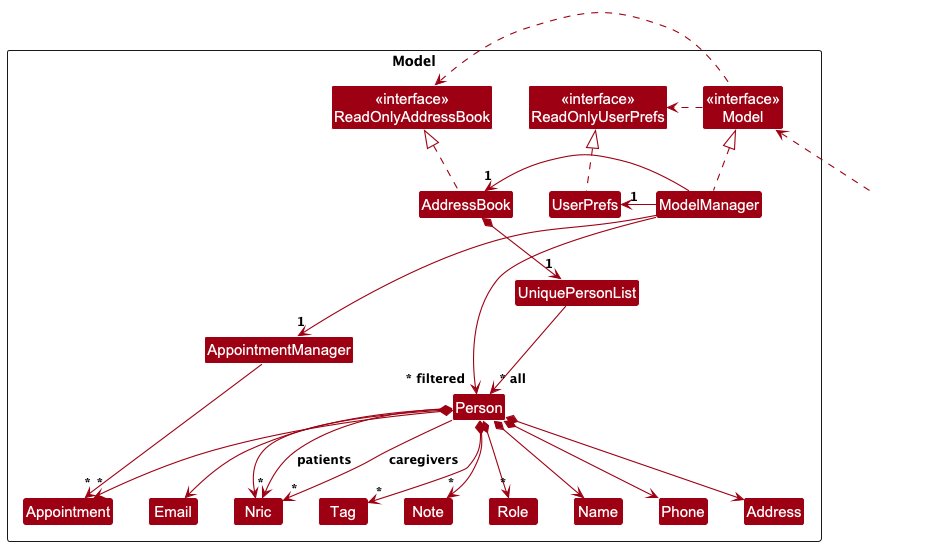

* Table of Contents
{:toc}

--------------------------------------------------------------------------------------------------------------------
## **Acknowledgements**

* {list here sources of all reused/adapted ideas, code, documentation, and third-party libraries -- include links to the original source as well}

--------------------------------------------------------------------------------------------------------------------

## **Setting up, getting started**

Refer to the guide [_Setting up and getting started_](SettingUp.md).

--------------------------------------------------------------------------------------------------------------------

## **Design**

:bulb: **Tip:** The `.puml` files used to create diagrams in this document `docs/diagrams` folder. Refer to the [_PlantUML Tutorial_ at se-edu/guides](https://se-education.org/guides/tutorials/plantUml.html) to learn how to create and edit diagrams.

### Architecture

The ***Architecture Diagram*** given above explains the high-level design of the App.

Given below is a quick overview of main components and how they interact with each other.

**Main components of the architecture**

**`Main`** (consisting of classes [`Main`](https://github.com/se-edu/addressbook-level3/tree/master/src/main/java/seedu/address/Main.java) and [`MainApp`](https://github.com/se-edu/addressbook-level3/tree/master/src/main/java/seedu/address/MainApp.java)) is in charge of the app launch and shut down.
* At app launch, it initializes the other components in the correct sequence, and connects them up with each other.
* At shut down, it shuts down the other components and invokes cleanup methods where necessary.

The bulk of the app's work is done by the following four components:

* [**`UI`**](#ui-component): The UI of the App.
* [**`Logic`**](#logic-component): The command executor.
* [**`Model`**](#model-component): Holds the data of the App in memory.
* [**`Storage`**](#storage-component): Reads data from, and writes data to, the hard disk.

[**`Commons`**](#common-classes) represents a collection of classes used by multiple other components.

**How the architecture components interact with each other**

The *Sequence Diagram* below shows how the components interact with each other for the scenario where the user issues the command `delete 1`.

Each of the four main components (also shown in the diagram above),

* defines its *API* in an `interface` with the same name as the Component.
* implements its functionality using a concrete `{Component Name}Manager` class (which follows the corresponding API `interface` mentioned in the previous point.

For example, the `Logic` component defines its API in the `Logic.java` interface and implements its functionality using the `LogicManager.java` class which follows the `Logic` interface. Other components interact with a given component through its interface rather than the concrete class (reason: to prevent outside component's being coupled to the implementation of a component), as illustrated in the (partial) class diagram below.

The sections below give more details of each component.

### UI component

The **API** of this component is specified in [`Ui.java`](https://github.com/se-edu/addressbook-level3/tree/master/src/main/java/seedu/address/ui/Ui.java)

The UI consists of a `MainWindow` that is made up of parts e.g.`CommandBox`, `ResultDisplay`, `PersonListPanel`, `StatusBarFooter` etc. All these, including the `MainWindow`, inherit from the abstract `UiPart` class which captures the commonalities between classes that represent parts of the visible GUI.

The `UI` component uses the JavaFx UI framework. The layout of these UI parts are defined in matching `.fxml` files that are in the `src/main/resources/view` folder. For example, the layout of the [`MainWindow`](https://github.com/se-edu/addressbook-level3/tree/master/src/main/java/seedu/address/ui/MainWindow.java) is specified in [`MainWindow.fxml`](https://github.com/se-edu/addressbook-level3/tree/master/src/main/resources/view/MainWindow.fxml)

The `UI` component,

* executes user commands using the `Logic` component.
* listens for changes to `Model` data so that the UI can be updated with the modified data.
* keeps a reference to the `Logic` component, because the `UI` relies on the `Logic` to execute commands.
* depends on some classes in the `Model` component, as it displays `Person` object residing in the `Model`.

### Logic component

**API** : [`Logic.java`](https://github.com/se-edu/addressbook-level3/tree/master/src/main/java/seedu/address/logic/Logic.java)

Here's a (partial) class diagram of the `Logic` component:

The sequence diagram below illustrates the interactions within the `Logic` component, taking `execute("delete 1")` API call as an example.

:information_source: **Note:** The lifeline for `DeleteCommandParser` should end at the destroy marker (X) but due to a limitation of PlantUML, the lifeline continues till the end of diagram.

How the `Logic` component works:

1. When `Logic` is called upon to execute a command, it is passed to an `AddressBookParser` object which in turn creates a parser that matches the command (e.g., `DeleteCommandParser`) and uses it to parse the command.
1. This results in a `Command` object (more precisely, an object of one of its subclasses e.g., `DeleteCommand`) which is executed by the `LogicManager`.
1. The command can communicate with the `Model` when it is executed (e.g. to delete a person). 
   Note that although this is shown as a single step in the diagram above (for simplicity), in the code it can take several interactions (between the command object and the `Model`) to achieve.
1. The result of the command execution is encapsulated as a `CommandResult` object which is returned back from `Logic`.

Here are the other classes in `Logic` (omitted from the class diagram above) that are used for parsing a user command:

How the parsing works:
* When called upon to parse a user command, the `AddressBookParser` class creates an `XYZCommandParser` (`XYZ` is a placeholder for the specific command name e.g., `AddCommandParser`) which uses the other classes shown above to parse the user command and create a `XYZCommand` object (e.g., `AddCommand`) which the `AddressBookParser` returns back as a `Command` object.
* All `XYZCommandParser` classes (e.g., `AddCommandParser`, `DeleteCommandParser`, ...) inherit from the `Parser` interface so that they can be treated similarly where possible e.g, during testing.

### Model component
**API** : [`Model.java`](https://github.com/se-edu/addressbook-level3/tree/master/src/main/java/seedu/address/model/Model.java)

The `Model` component,

* stores the address book data i.e., all `Person` objects (which include both `Patient` and `Caregiver` objects). These are contained in a `UniquePersonList` object.
* stores the currently 'selected' `Person` objects (e.g., results of a search query) as a separate _filtered_ list, which is exposed to outsiders as an unmodifiable `ObservableList<Person>`. The UI can be bound to this list so that it automatically updates when the data changes.
* stores a `UserPref` object that represents the user’s preferences. This is exposed to the outside as a `ReadOnlyUserPref` object.
* manages relationships between `Patient` and `Caregiver`. Each `Patient` can have one or more `Caregivers` linked to them through a `List<Caregiver>` in the `Patient` object. Caregivers are linked by a `patientID`.

The `Model` does not depend on any of the other three components (as the `Model` represents data entities of the domain, they should make sense on their own without depending on other components).

:information_source: **Note:** The updated model introduces a `Caregiver` class linked to a `Patient` object through a unique `patientID`. The system maintains this relationship and ensures that caregivers can only be associated with valid patients. 

### Storage component

**API** : [`Storage.java`](https://github.com/se-edu/addressbook-level3/tree/master/src/main/java/seedu/address/storage/Storage.java)

The `Storage` component,
* can save both address book data and user preference data in JSON format, and read them back into corresponding objects.
* inherits from both `AddressBookStorage` and `UserPrefStorage`, which means it can be treated as either one (if only the functionality of only one is needed).
* depends on some classes in the `Model` component (because the `Storage` component's job is to save/retrieve objects that belong to the `Model`)

### Common classes

Classes used by multiple components are in the `seedu.address.commons` package.

--------------------------------------------------------------------------------------------------------------------

## **Implementation**

This section describes some noteworthy details on how certain features are implemented.

### \[Proposed\] Undo/redo feature

#### Proposed Implementation

The proposed undo/redo mechanism is facilitated by `VersionedAddressBook`. It extends `AddressBook` with an undo/redo history, stored internally as an `addressBookStateList` and `currentStatePointer`. Additionally, it implements the following operations:

* `VersionedAddressBook#commit()` — Saves the current address book state in its history.
* `VersionedAddressBook#undo()` — Restores the previous address book state from its history.
* `VersionedAddressBook#redo()` — Restores a previously undone address book state from its history.

These operations are exposed in the `Model` interface as `Model#commitAddressBook()`, `Model#undoAddressBook()` and `Model#redoAddressBook()` respectively.

Given below is an example usage scenario and how the undo/redo mechanism behaves at each step.

Step 1. The user launches the application for the first time. The `VersionedAddressBook` will be initialized with the initial address book state, and the `currentStatePointer` pointing to that single address book state.

Step 2. The user executes `delete 5` command to delete the 5th person in the address book. The `delete` command calls `Model#commitAddressBook()`, causing the modified state of the address book after the `delete 5` command executes to be saved in the `addressBookStateList`, and the `currentStatePointer` is shifted to the newly inserted address book state.

Step 3. The user executes `add n/David …​` to add a new person. The `add` command also calls `Model#commitAddressBook()`, causing another modified address book state to be saved into the `addressBookStateList`.

:information_source: **Note:** If a command fails its execution, it will not call `Model#commitAddressBook()`, so the address book state will not be saved into the `addressBookStateList`.

Step 4. The user now decides that adding the person was a mistake, and decides to undo that action by executing the `undo` command. The `undo` command will call `Model#undoAddressBook()`, which will shift the `currentStatePointer` once to the left, pointing it to the previous address book state, and restores the address book to that state.

:information_source: **Note:** If the `currentStatePointer` is at index 0, pointing to the initial AddressBook state, then there are no previous AddressBook states to restore. The `undo` command uses `Model#canUndoAddressBook()` to check if this is the case. If so, it will return an error to the user rather
than attempting to perform the undo.

The following sequence diagram shows how an undo operation goes through the `Logic` component:

:information_source: **Note:** The lifeline for `UndoCommand` should end at the destroy marker (X) but due to a limitation of PlantUML, the lifeline reaches the end of diagram.

Similarly, how an undo operation goes through the `Model` component is shown below:

The `redo` command does the opposite — it calls `Model#redoAddressBook()`, which shifts the `currentStatePointer` once to the right, pointing to the previously undone state, and restores the address book to that state.

:information_source: **Note:** If the `currentStatePointer` is at index `addressBookStateList.size() - 1`, pointing to the latest address book state, then there are no undone AddressBook states to restore. The `redo` command uses `Model#canRedoAddressBook()` to check if this is the case. If so, it will return an error to the user rather than attempting to perform the redo.

Step 5. The user then decides to execute the command `list`. Commands that do not modify the address book, such as `list`, will usually not call `Model#commitAddressBook()`, `Model#undoAddressBook()` or `Model#redoAddressBook()`. Thus, the `addressBookStateList` remains unchanged.

Step 6. The user executes `clear`, which calls `Model#commitAddressBook()`. Since the `currentStatePointer` is not pointing at the end of the `addressBookStateList`, all address book states after the `currentStatePointer` will be purged. Reason: It no longer makes sense to redo the `add n/David …​` command. This is the behavior that most modern desktop applications follow.

The following activity diagram summarizes what happens when a user executes a new command:

#### Design considerations:

**Aspect: How undo & redo executes:**

* **Alternative 1 (current choice):** Saves the entire address book.
  * Pros: Easy to implement.
  * Cons: May have performance issues in terms of memory usage.

* **Alternative 2:** Individual command knows how to undo/redo by
  itself.
  * Pros: Will use less memory (e.g. for `delete`, just save the person being deleted).
  * Cons: We must ensure that the implementation of each individual command are correct.

_{more aspects and alternatives to be added}_

### \[Proposed\] Data archiving

_{Explain here how the data archiving feature will be implemented}_

--------------------------------------------------------------------------------------------------------------------

## **Documentation, logging, testing, configuration, dev-ops**

* [Documentation guide](Documentation.md)
* [Testing guide](Testing.md)
* [Logging guide](Logging.md)
* [Configuration guide](Configuration.md)
* [DevOps guide](DevOps.md)

--------------------------------------------------------------------------------------------------------------------

## **Appendix: Requirements**

### Product scope

**Target user profile**:

* Independent Geriatricians managing elderly patients
* Those patients have chronic conditions
* Geriatrician can type fast
* Prefers CLI over GUI
* Needs to manage several patients
**Value proposition**: We specifically target Geriatricians by tailoring to their requirements of managing elderly patients when it comes to tracking chronic conditions, coordinating care, and maintaining regular follow-ups.

### User Stories

Priorities: High (must have) - `* * *`, Medium (nice to have) - `* *`, Low (unlikely to have) - `*`

| Priority | As a...          | I want to...                                 | So that I can...                                                  |
| -------- | ---------------- | -------------------------------------------- | ----------------------------------------------------------------- |
| `* * *`  | new user         | use sample data to walk through features     | explore the app without inputting my own data                     |
| `* * *`  | new user         | remove sample data                           | start using the app for my own data                               |
| `* * *`  | new user         | set up a doctor profile                      | customize the system based on my professional needs               |
| `* * *`  | new user         | add patient details via CLI                  | efficiently manage a heavy patient load                           |
| `* * *`  | new user         | use the help command                         | refer to available commands and usage instructions                |
| `* * *`  | regular user     | store patient data                           | view patient details across multiple sessions without re-entering |
| `* * *`  | regular user     | distinguish between duplicate patients       | avoid confusion when patients have the same name                  |
| `* * *`  | regular user     | edit patient data                            | update patient information such as contact details                |
| `* * *`  | regular user     | delete patient data                          | remove patients who no longer need to be tracked                  |
| `* * *`  | regular user     | schedule follow-up appointments              | quickly update and track patient follow-ups                       |
| `* * *`  | novice user      | filter appointments by date                  | plan my day effectively by viewing scheduled appointments         |
| `* * *`  | novice user      | filter by condition                          | prioritize patients based on their medical conditions             |
| `* * *`  | novice user      | filter by patients                           | find patients with higher health risks to follow up with them     |
| `* *`    | novice user      | send email reminders to patients             | remind patients about upcoming appointments                       |
| `* *`    | experienced user | batch update patient contact records         | streamline updates after events like mass screenings              |
| `*`      | experienced user | batch delete patient contact records         | declutter the system by removing multiple patients at once        |
| `*`      | experienced user | retrieve patient medication history          | quickly find past medications in emergency situations             |
| `*`      | experienced user | retrieve caregiver information               | inform caregivers to enhance patient care                         |
| `*`      | experienced user | use aliases for commands                     | speed up command usage in the CLI app                             |
| `*`      | experienced user | remove inactive patients from default view   | declutter the app and focus on active patients                    |
| `*`      | experienced user | use fuzzy search to retrieve patient details | find patient information even with partial or incomplete data     |
| `*`      | experienced user | export patient data to a CSV file            | backup data and use it in other applications                      |
| `*`      | experienced user | import patient data from a CSV file          | restore backups or transfer data from other systems               |

*User stories for the MVP:* Stories 4, 6 and 9 are for the MVP
*User stories for the final version:* Stories 1 - 13 are for the final version.

### Use cases

(For all use cases below, the **System** is the `AddressBook` and the **Actor** is the `user`, unless specified otherwise)

**Use Case 1: Add a New Patient**

**System**: CareLink
**Use Case**: UC01 - Add New Patient
**Actor**: Geriatrician (Fred)

**Preconditions**
- Fred is logged into CareLink.
- Fred is at the patient details entry screen.

**Guarantees**
- Patient details are saved only if the input data is valid.
- Duplicates are not created (NRIC uniqueness is enforced).

**MSS**
1. Fred enters command to `add` a new patient.
2. CareLink requests patient details.
3. Fred enters the patient details.
4. CareLink validates the input data.
5. CareLink saves the patient details to the system.
6. CareLink displays a success message and shows the newly added patient in the system.
7. Use case ends.

**Extensions**
- **3a. Invalid patient data entered**:
    - CareLink displays an error message indicating which data is invalid.
    - Fred corrects the input, and the use case resumes from step 3.
    - Use case ends.

**Use Case 2: View Patient Details**

**System**: CareLink
**Use Case**: UC02 - View Patient Details
**Actor**: Geriatrician (Fred)

**Preconditions**
- Fred is logged into CareLink.

**Guarantees**
- The patient's details are successfully retrieved and displayed.
- The correct patient's information is displayed without errors.

**Main Success Scenario (MSS)**
1. Fred enters command to `view` a patient's details.
2. CareLink retrieves the patient’s details.
3. CareLink displays the patient's details to Fred.
4. Use case ends.

**Extensions**
- **3a. Invalid or nonexistent patient NRIC entered**:
    - CareLink displays an error message and prompts Fred to re-enter the correct NRIC.
    - Fred corrects the NRIC, and the use case resumes from step 3.
    - Use case ends.

**Use Case 3: Adding a Caregiver and Linking to an Existing Patient**

**System**: CareLink
**Use Case**: UC03 - Adding a Caregiver and Linking to an Existing Patient
**Actor**: Geriatrician (Fred)

### Preconditions
- Fred is logged into CareLink.

### Guarantees
- Caregiver details are saved only if the input data is valid.
- Duplicates are not created
- The caregiver is correctly linked to the specified patient.

### MSS
1. Fred enters command to `add caregiver` and enters the necessary details, including the patient ID.
2. CareLink validates all input details against criteria.
3. CareLink saves the caregiver's details and links them to the specified patient ID.
4. CareLink confirms the addition and linking with a success message.
5. Use case ends.

### Extensions
- **2a. Validation Fails**:
    - 2a.1: If any validation fails, CareLink displays an error message, and the caregiver is not added.
    - Use case ends.

- **2b. Specified Patient ID Does Not Exist**:
    - 2b.1: If the specified patient ID does not exist, CareLink displays an error message.
    - Use case ends.

**Use Case 4: Update Patient Details**

**System**: CareLink
**Use Case**: UC04 - Update Patient Details
**Actor**: Geriatrician (Fred)

### Preconditions
- Fred is logged into CareLink.

### Guarantees
- The patient’s details are successfully updated in the system.

### Main Success Scenario (MSS)
1. Fred enters command to `update` and provides the NRIC of patient and new details.
2. CareLink validates the new input.
3. CareLink updates the records and confirms the update with a success message.
4. Use case ends.

### Extensions
- **2a. Record Does Not Exist**:
    - 2a.1: If the record does not exist, CareLink informs Fred.
    - Use case ends.

- **2b. Input Validation Fails**:
    - 2b.1: If input validation fails, CareLink displays an error message and does not update the record.
    - Use case ends.

**Use Case 5: Delete Patient Details**

**System**: CareLink
**Use Case**: UC05 - Delete Patient Details
**Actor**: Geriatrician (Fred)

### Preconditions
- Fred is logged into CareLink.
- The patient exists in the system.

### Guarantees
- The patient's details are successfully removed from the system.

### Main Success Scenario (MSS)
1. Fred enters command to `delete` a patient’s details.
2. CareLink retrieves the patient's information.
3. CareLink deletes the patient's record.
4. Use case ends.

### Extensions
- **2a. Patient Does Not Exist**:
    - 2a.1: If no patient record matches the given details, CareLink displays an error message.
    - Use case ends.

**Use Case 6: Export All Patient Data to CSV**

**System**: CareLink
**Use Case**: UC06 - Export All Patient Data to CSV
**Actor**: Geriatrician (Fred)

### Preconditions
- Fred is logged into CareLink.

### Guarantees
- The CSV file is successfully exported and available for download.

### Main Success Scenario (MSS)
1. Fred enters command to export all patient data to CSV.
2. CareLink asks the destination for copying the file to.
3. Fred provides the destination address
4. CareLink makes a copy of the file at the specified location.
5. Use case ends.

### Extensions

- **3a. File Copy Error**:
    - 3a.1: If CareLink encounters an error during the copy process, an error message is displayed.
    - Use case ends.

**Use Case 7: Import Patient Data using CSV**

**System**: CareLink
**Use Case**: UC07 - Import Patient Data using CSV
**Actor**: Geriatrician (Fred)

### Preconditions
- Fred is logged into CareLink.
- A CSV file containing patient data is available for import, and the format is correct.

### Guarantees
- The patient data from the CSV file is successfully imported into CareLink.

### Main Success Scenario (MSS)
1. Fred selects the option to import patient data using a CSV file.
2. Fred provides the CSV file.
3. CareLink validates the contents of the CSV file.
4. CareLink imports the patient data from the CSV file into the system.
5. CareLink confirms the successful import of the data with a success message.
6. Use case ends.

### Extensions
- **3a. CSV Format Invalid**:
    - 3a.1: If the CSV file is incorrectly formatted, CareLink displays an error message and the data is not imported.
    - Use case ends.

**Use Case 8: Filter Data by Date**

**System**: CareLink
**Use Case**: UC08 - Filter Data by Date
**Actor**: Geriatrician (Fred)

### Preconditions
- Fred is logged into CareLink.

### Guarantees
- Data is successfully filtered by the specified date range and displayed.

### Main Success Scenario (MSS)
1. Fred enters command to filter patient data by date.
2. CareLink prompts Fred to input a date range.
3. Fred enters the desired start and end dates.
4. CareLink filters the patient data based on the specified date range.
5. CareLink displays the filtered data to Fred.
6. Use case ends.

### Extensions
- **3a. Invalid Date Format**:
    - 3a.1: If Fred enters an invalid date format, CareLink displays an error message and prompts Fred to re-enter the date range.
    - Use case resumes from step 3.

- **4a. No Data Found for Date Range**:
    - 4a.1: If no patient data exists for the specified date range, CareLink informs Fred that no records were found.
    - Use case ends.

**Use Case 9: Filter Data by Medical Condition**

**System**: CareLink
**Use Case**: UC09 - Filter Data by Medical Condition
**Actor**: Geriatrician (Fred)

### Preconditions
- Fred is logged into CareLink.

### Guarantees
- Data is successfully filtered by the specified condition and displayed.

### Main Success Scenario (MSS)
1. Fred enters command to `filter` patient data by medical condition.
2. CareLink prompts Fred to input the medical condition.
3. Fred enters the medical condition.
4. CareLink filters the patient data based on the specified medical condition.
5. CareLink displays the filtered data to Fred.
6. Use case ends.

### Extensions
- **3a. Invalid Condition**:
    - 3a.1: If Fred enters a medical condition that doesn't exist in the system, CareLink displays an error message and prompts Fred to re-enter the condition.
    - Use case resumes from step 3.

- **4a. No Data Found for Condition**:
    - 4a.1: If no patient data exists for the specified condition, CareLink informs Fred that no records were found.
    - Use case ends.

**Use Case 10: Filter Data by Patients**

**System**: CareLink
**Use Case**: UC10 - Filter Data by Patients
**Actor**: Geriatrician (Fred)

### Preconditions
- Fred is logged into CareLink.

### Guarantees
- Data is successfully filtered by the specified patient(s) and displayed.

### Main Success Scenario (MSS)
1. Fred enters the command to filter patient data by specific patients.
2. CareLink prompts Fred to input patient identifiers.
3. Fred enters the patient identifiers.
4. CareLink filters the patient data based on the specified patient identifiers.
5. CareLink displays the filtered data to Fred.
6. Use case ends.

### Extensions
- **3a. Invalid Patient Identifier**:
    - 3a.1: If Fred enters an invalid patient identifier, CareLink displays an error message and prompts Fred to re-enter the identifier.
    - Use case resumes from step 3.

- **4a. No Data Found for Patients**:
    - 4a.1: If no patient data exists for the specified patients, CareLink informs Fred that no records were found.
    - Use case ends.

**Use Case 11: Schedule Follow-up Appointments**

**System**: CareLink
**Use Case**: UC11 - Schedule Follow-up Appointments
**Actor**: Geriatrician (Fred)

### Preconditions
- Fred is logged into CareLink.
- The patient exists in the system.

### Guarantees
- A follow-up appointment is successfully scheduled and confirmed.

### Main Success Scenario (MSS)
1. Fred enters the command to schedule a follow-up appointment for a patient.
2. CareLink prompts Fred to input the patient’s details and select a date and time.
3. Fred enters the patient details and an available date and time for the appointment.
4. CareLink confirms the follow-up appointment and saves it in the system.
5. CareLink displays a confirmation message with the appointment details.
6. Use case ends.

### Extensions
- **2a. Patient Does Not Exist**:
    - 2a.1: If the entered patient identifier does not exist, CareLink displays an error message.
    - Use case ends.

**Use Case 12: Set Up Doctor Profile**

**System**: CareLink
**Use Case**: UC12 - Set Up Doctor Profile
**Actor**: Geriatrician (Fred)

### Preconditions
- Fred is logged into CareLink for the first time or his profile setup is incomplete.

### Guarantees
- Fred’s doctor profile is successfully created or updated.

### Main Success Scenario (MSS)
1. Fred enters command to set up his doctor profile.
2. CareLink prompts Fred to enter profile details.
3. Fred enters all required details.
4. CareLink saves Fred’s profile and confirms the setup with a success message.
5. Use case ends.

### Extensions

- **4a. Profile Save Error**:
    - 4a.1: If CareLink encounters an error while saving the profile, an error message is displayed, and the setup process is halted.
    - Use case ends.

### Use Case 13: Filter Patients by Risk Level

**System**: CareLink
**Use Case**: UC13 - Filter Patients by Risk Level
**Actor**: Geriatrician (Fred)

### Preconditions
Fred is logged into CareLink.
The system contains patient data with risk levels.
### Guarantees
The patients are successfully filtered by their risk level and displayed.
Main Success Scenario (MSS)
Fred enters a command to filter patients by risk level.
CareLink prompts Fred to input the risk level.
Fred enters the risk level (e.g., high).
CareLink filters the patients based on the specified risk level and displays the results.
Use case ends.
### Extensions
**3a.** Invalid Risk Level Entered:

**3a.1**: If Fred enters an invalid risk level, CareLink displays an error message and prompts Fred to re-enter the risk level.
Use case resumes from step 3.

**4a.** No Data Found for Risk Level:

**4a.1**: If no patients exist with the specified risk level, CareLink informs Fred that no records were found.
Use case ends.

*{More to be added}*

### Non-Functional Requirements

1. **Typing-Preferred**
   - **Category:** User Efficiency
   - **Requirement:** The product should be optimized for users who can type fast and prefer typing over other forms of input, with a command-line interface (CLI) that allows quick and efficient task completion.
   - **User Benefit:** This allows users who prefer typing to accomplish tasks faster without relying on slower point-and-click methods.

2. **Platform-Independent**
   - **Category:** Environment Requirements
   - **Requirement:** The software must work seamlessly on Windows, Linux, and OS-X platforms.
   - **User Benefit:** Users can run the application on any operating system they prefer, ensuring flexibility and convenience without worrying about compatibility issues.

3. **No-DBMS**
   - **Category:** Technical Requirements
   - **Requirement:** The system should not rely on a database management system (DBMS) for data storage.
   - **User Benefit:** Users don't need to set up complex database systems, making the software easier to install and maintain, with simple file-based data storage.

4. **Human-Editable File**
   - **Category:** Data Requirements
   - **Requirement:** The system's data should be stored locally in a human-readable and editable text file format.
   - **User Benefit:** Users can directly view and modify their data without needing specialized tools, providing more control and flexibility for advanced users.

5. **Single-User**
   - **Category:** User Constraints
   - **Requirement:** The product is designed for use by a single user, and data should not be shared between multiple users.
   - **User Benefit:** Users can have confidence that their data is secure and private, without interference from other users, ensuring data integrity and ease of use.

6. **Portability**
    - **Category:** System Constraints
    - **Requirement:** The product must support downloading CSV files that can be easily loaded and used on another system.
    - **User Benefit:** Users can seamlessly transfer and access their data across different systems, providing flexibility and ease of use.

7. **Readable Font Size**
    - **Category:** Usability
    - **Requirement:** The font size should be reasonably large to ensure readability, particularly for users who may have difficulty reading smaller text.
    - **User Benefit:** Ensures users can comfortably read information on the interface, improving accessibility and user experience.

8. **Simplicity**
    - **Category:** Usability
    - **Requirement:** The interface should be intuitive, with straightforward workflows that make it easy to navigate and use.
    - **User Benefit:** Reduces the learning curve for new users, allowing for efficient and hassle-free operation, improving overall user satisfaction.

### Glossary

- **Patient Record**: The complete set of data related to a patient, including their contact information, medical notes, medication history, appointment schedules, and caregiver details.

- **Caregiver**: A person associated with a patient who helps in managing the patient’s healthcare needs, often involved in emergency contacts or follow-ups.

- **Follow-up Appointment**: An appointment scheduled after an initial consultation or visit to monitor the patient's ongoing condition or treatment progress.

- **CLI (Command-Line Interface)**: A method of interacting with CareLink by typing commands, designed to optimize efficiency for users who prefer typing over using graphical interfaces.
- **API (Application Programming Interface)**: A set of functions and procedures allowing applications to access the features or data of another service, application, or system.
- **Sequence Diagram**: A type of diagram that shows how objects interact with each other over time, specifically highlighting the sequence of messages exchanged.
- **Model**: In software design, the component responsible for representing the application's data, including logic for accessing and modifying that data.
- **NRIC**: National Registration Identity Card, a unique identification number used in Singapore to identify individuals, and used in CareLink to uniquely identify patient records.

- **Batch Update**: A feature in CareLink that allows the user to make changes to multiple patient records at once, such as updating contact information for a group of patients.

- **Active Patient**: A patient who is currently being treated by the geriatrician and appears in the default view of CareLink.

- **Inactive Patient**: A patient who is no longer actively being treated but whose records are kept in the system for historical reference; they do not appear in the default view.

- **Fuzzy Search**: A search feature that allows users to find patient records using partial or approximate information, such as a part of the patient’s name or NRIC.

- **Alias**: A shortcut or simplified command that users can define to speed up repetitive tasks within the CLI, making CareLink more efficient to use for experienced users.

- **CSV (Comma-Separated Values)**: A simple file format used to store tabular data where each field is separated by a comma.

- **AB3 (Address Book 3)**: A contact management application that allows users to store, manage, and search contact details. It is designed for maintaining a digital address book, often used as a foundation for developing further CLI-based applications.

- **Geriatricians**: Doctors specializing in the healthcare of elderly patients, focusing on the prevention, diagnosis, and treatment of diseases and conditions that commonly affect older adults, often playing a key role in managing chronic illnesses and improving quality of life.

--------------------------------------------------------------------------------------------------------------------

## **Appendix: Instructions for manual testing**

Given below are instructions to test the app manually.

:information_source: **Note:** These instructions only provide a starting point for testers to work on;
testers are expected to do more *exploratory* testing.

### Launch and shutdown

1. Initial launch

   1. Download the jar file and copy into an empty folder

   1. Double-click the jar file Expected: Shows the GUI with a set of sample contacts. The window size may not be optimum.

1. Saving window preferences

   1. Resize the window to an optimum size. Move the window to a different location. Close the window.

   1. Re-launch the app by double-clicking the jar file. 
       Expected: The most recent window size and location is retained.

1. _{ more test cases …​ }_

### Deleting a person

1. Deleting a person while all persons are being shown

   1. Prerequisites: List all persons using the `list` command. Multiple persons in the list.

   1. Test case: `delete 1` 
      Expected: First contact is deleted from the list. Details of the deleted contact shown in the status message. Timestamp in the status bar is updated.

   1. Test case: `delete 0` 
      Expected: No person is deleted. Error details shown in the status message. Status bar remains the same.

   1. Other incorrect delete commands to try: `delete`, `delete x`, `...` (where x is larger than the list size) 
      Expected: Similar to previous.

1. _{ more test cases …​ }_

### Saving data

1. Dealing with missing/corrupted data files

   1. _{explain how to simulate a missing/corrupted file, and the expected behavior}_

1. _{ more test cases ...​ }_

