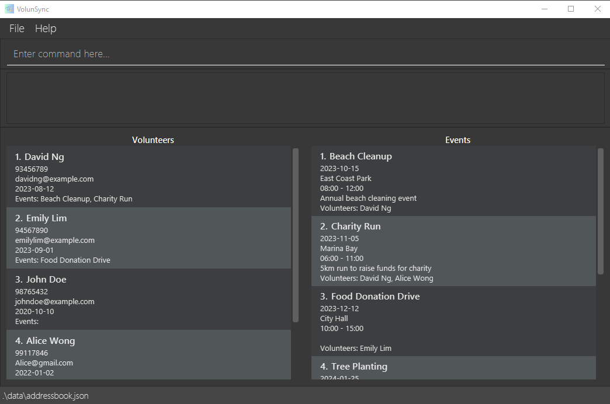
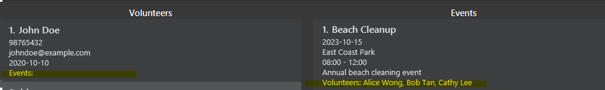
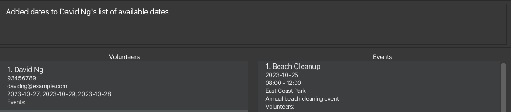
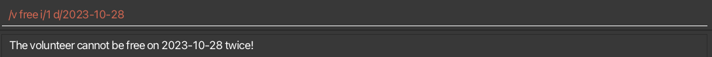
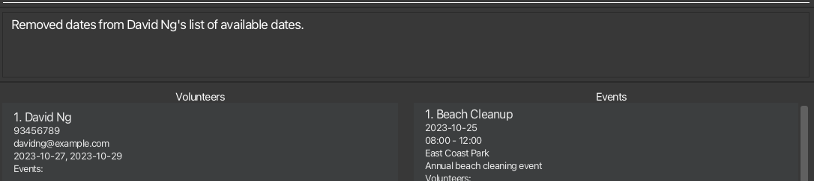
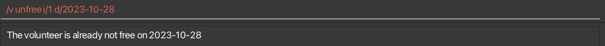

* Table of Contents
{:toc}

--------------------------------------------------------------------------------------------------------------------

## **Acknowledgements**

* Libraries used: [JavaFX](https://openjfx.io/), [Jackson](https://github.com/FasterXML/jackson), [JUnit5](https://junit.org/junit5/)

--------------------------------------------------------------------------------------------------------------------

## **Setting up, getting started**

Refer to the guide [Setting up and getting started](https://ay2425s1-cs2103t-w12-2.github.io/tp/SettingUp.html).

--------------------------------------------------------------------------------------------------------------------

## **Design**

:bulb: **Tip:** The `.puml` files used to create diagrams in this document `docs/diagrams` folder. Refer to the [_PlantUML Tutorial_ at se-edu/guides](https://se-education.org/guides/tutorials/plantUml.html) to learn how to create and edit diagrams.

### Architecture

The ***Architecture Diagram*** given above explains the high-level design of the App.

Given below is a quick overview of main components and how they interact with each other.

**Main components of the architecture**

**`Main`** (consisting of classes [`Main`](https://github.com/se-edu/addressbook-level3/tree/master/src/main/java/seedu/address/Main.java) and [`MainApp`](https://github.com/se-edu/addressbook-level3/tree/master/src/main/java/seedu/address/MainApp.java)) is in charge of the app launch and shut down.
* At app launch, it initializes the other components in the correct sequence, and connects them up with each other.
* At shut down, it shuts down the other components and invokes cleanup methods where necessary.

The bulk of the app's work is done by the following four components:

* [**`UI`**](#ui-component): The UI of the App.
* [**`Logic`**](#logic-component): The command executor.
* [**`Model`**](#model-component): Holds the data of the App in memory.
* [**`Storage`**](#storage-component): Reads data from, and writes data to, the hard disk.

[**`Commons`**](#common-classes) represents a collection of classes used by multiple other components.

**How the architecture components interact with each other**

The *Sequence Diagram* below shows how the components interact with each other for the scenario where the user issues the command `/e del 1`.

Each of the four main components (also shown in the diagram above),

* defines its *API* in an `interface` with the same name as the Component.
* implements its functionality using a concrete `{Component Name}Manager` class (which follows the corresponding API `interface` mentioned in the previous point.

For example, the `Logic` component defines its API in the `Logic.java` interface and implements its functionality using the `LogicManager.java` class which follows the `Logic` interface. Other components interact with a given component through its interface rather than the concrete class (reason: to prevent outside component's being coupled to the implementation of a component), as illustrated in the (partial) class diagram below.

The sections below give more details of each component.

### UI component

The **API** of this component is specified in [`Ui.java`](https://github.com/se-edu/addressbook-level3/tree/master/src/main/java/seedu/address/ui/Ui.java)

The UI consists of a `MainWindow` that is made up of parts e.g.`CommandBox`, `ResultDisplay`, `EventListPanel`, `VolunteerListPanel`, `StatusBarFooter` etc. All these, including the `MainWindow`, inherit from the abstract `UiPart` class which captures the commonalities between classes that represent parts of the visible GUI.

The `UI` component uses the JavaFx UI framework. The layout of these UI parts are defined in matching `.fxml` files that are in the `src/main/resources/view` folder. For example, the layout of the [`MainWindow`](https://github.com/se-edu/addressbook-level3/tree/master/src/main/java/seedu/address/ui/MainWindow.java) is specified in [`MainWindow.fxml`](https://github.com/se-edu/addressbook-level3/tree/master/src/main/resources/view/MainWindow.fxml)

The `UI` component,

* executes user commands using the `Logic` component.
* listens for changes to `Model` data so that the UI can be updated with the modified data.
* keeps a reference to the `Logic` component, because the `UI` relies on the `Logic` to execute commands.
* depends on some classes in the `Model` component, as it displays `Event` and `Volunteer` objects residing in the `Model`.

### Logic component

**API** : [`Logic.java`](https://github.com/se-edu/addressbook-level3/tree/master/src/main/java/seedu/address/logic/Logic.java)

Here's a (partial) class diagram of the `Logic` component:

The sequence diagram below illustrates the interactions within the `Logic` component, taking `execute("del 1")` API call as an example.

:information_source: **Note:** The lifeline for `VolunteerDeleteCommandParser` should end at the destroy marker (X) but due to a limitation of PlantUML, the lifeline continues till the end of diagram.

How the `Logic` component works:

1. When `Logic` is called upon to execute a command, it is passed to an `AddressBookParser` object which in turn creates a parser that matches the command (e.g., `EventNewCommandParser`) and uses it to parse the command.
    - For example, if it is a command that creates a new event (e.g. /e new), AddressBookParser creates an instance of `EventCommandParser`, which then creates the `EventNewCommandParser` to parse the command using other classes shown in the diagram below.
2. This results in a `Command` object (more precisely, an object of one of its subclasses e.g., `EventNewCommand`) which is executed by the `LogicManager`.
3. The command can communicate with the `Model` when it is executed (e.g. to create a new event). 
   Note that although this is shown as a single step in the diagram above (for simplicity), in the code it can take several interactions (between the command object, `Model` and other classes within the model package e.g `AddressBook`, `EventManager`) to achieve.
4. The result of the command execution is encapsulated as a `CommandResult` object which is returned back from `Logic`.

Here are the other classes in `Logic` (omitted from the class diagram above) that are used for parsing a user command:

How the parsing works:
* When called upon to parse a user command, the `AddressBookParser` class creates an `XYZCommandParser` (`XYZ` is a placeholder for the specific command name e.g., `EventCommandParser`) which uses the other classes shown above such as the EventParserUtil to parse the user command and create a `XYZCommand` object (e.g., `EventNewCommand`) which the `AddressBookParser` returns back as a `Command` object.
* All `XYZCommandParser` classes (e.g., `EventNewCommandParser`, `EventDeleteCommandParser`, ...) inherit from the `Parser` interface so that they can be treated similarly where possible e.g, during testing.

### Model component
**API** : [`Model.java`](https://github.com/se-edu/addressbook-level3/tree/master/src/main/java/seedu/address/model/Model.java)

The `Model` component,

* stores the address book data i.e., all `Event` and `Volunteer` objects (which are contained in a `UniqueEventList` and `UniqueVolunteerList` object respectively).
* stores the currently 'displayed' `Event` and `Volunteer` objects (e.g., results of a search query) as a separate _filtered_ list which is exposed to outsiders as an unmodifiable `ObservableList<Event>` and `ObservableList<Volunteer` respectively, that can be 'observed'. (The UI is bound to this list so that the UI automatically updates when the data in the list change e.g. due to additions or deletions.)
* stores a `UserPref` object that represents the user’s preferences. This is exposed to the outside as a `ReadOnlyUserPref` objects.
* does not depend on any of the other three components (as the `Model` represents data entities of the domain, they should make sense on their own without depending on other components)

### Storage component

**API** : [`Storage.java`](https://github.com/se-edu/addressbook-level3/tree/master/src/main/java/seedu/address/storage/Storage.java)

The `Storage` component,
* can save both address book data and user preference data in JSON format, and read them back into corresponding objects.
* inherits from both `AddressBookStorage` and `UserPrefStorage`, which means it can be treated as either one (if only the functionality of only one is needed).
* depends on some classes in the `Model` component (because the `Storage` component's job is to save/retrieve objects that belong to the `Model`)

### Common classes

Classes used by multiple components are in the [`seedu.address.commons`](https://github.com/AY2425S1-CS2103T-W12-2/tp/tree/master/src/main/java/seedu/address/commons) package.

--------------------------------------------------------------------------------------------------------------------

## **Documentation, logging, testing, configuration, dev-ops**

* [Documentation guide](Documentation.md)
* [Testing guide](Testing.md)
* [Logging guide](Logging.md)
* [Configuration guide](Configuration.md)
* [DevOps guide](DevOps.md)

--------------------------------------------------------------------------------------------------------------------

## **Appendix: Requirements**

### Product scope

**Target user profile**:

* requires efficient management of extensive databases for volunteers and events.
* prefer desktop apps over other types
* can type fast
* prefers typing to mouse interactions
* is reasonably comfortable using CLI apps

**Value proposition**: This application serves to streamline human resource management for volunteer organisations.
It provides essential tools to track volunteers and events efficiently, enabling organisations to
maintain accurate records and enhance their operational capabilities.

### User stories

Priorities: High (must have) - `* * *`, Medium (nice to have) - `* *`, Low (unlikely to have) - `*`

| Priority | As a …​                                 | I want to …​                                    | So that I can…​                                                                      |
|----------|-----------------------------------------|-------------------------------------------------|--------------------------------------------------------------------------------------|
| `* * *`  | General user                            | View help                                       | Access a quick guide to efficiently use the program                                  |
| `* * *`  | General user                            | Exit the program                                | Complete tasks and leave the program smoothly                                        |
| `* * *`  | Events director                         | Create events                                   | Store details of the events                                                          |
| `* * *`  | Events director                         | Remove events                                   | Keep the events list clean and up to date                                            |
| `* * *`  | HR department employee                  | Create volunteers                               | Store new volunteers information                                                     |
| `* * *`  | HR department employee                  | Remove volunteers                               | Keep volunteer records clean and up to date                                          |
| `* * *`  | HR department employee                  | List all volunteers and events                  | Quickly access and review records of all volunteers and events                       |
| `* * *`  | HR department employee                  | Export volunteers information                   | Generate reports from volunteer data for internal use                                |
| `* * *`  | HR department employee                  | Export events information                       | Generate reports from event data for internal use                                    |
| `* * *`  | Events director                         | Assign volunteer to event                       | Add specific volunteers to events as needed                                          |
| `* * *`  | Events director                         | Unassign volunteer from event                   | Keep the list of participating volunteers in an event up to date                     |
| `* * *`  | Events director                         | View involved events for a particular volunteer | See what events the volunteer is involved in                                         |
| `* * *`  | Events director                         | View volunteers for a particular event          | See who is participating in specific events                                          |
| `* *`    | Events director                         | Filter volunteers by availability               | Find available volunteers for a particular event                                     |
| `* *`    | HR department employee                  | Add available dates to volunteers               | Know when the volunteer is free and can be assigned to a specific event              |
| `* *`    | HR department employee                  | Remove available dates from volunteers          | Keep the list of available dates up to date                                          |
| `* *`    | Events director, HR department employee | Search/filter event by name                     | Locate specific events quickly                                                       |
| `* *`    | Events director, HR department employee | Search/filter volunteer by name                 | Locate specific volunteers quickly                                                   |
| `*`      | General user                            | View event details per volunteer                | See which events a volunteer participated in                                         |
| `*`      | HR department employee                  | View volunteer participation history            | Track volunteer engagement with past events                                          |
| `*`      | General user                            | Toggle view options for events                  | Customize how events are displayed in the app                                        |
| `*`      | General user                            | Dark mode                                       | Enhance the app's user experience for those who prefer a darker interface            |
| `*`      | General user                            | Accessibility features                          | Improve usability for visually impaired users through larger fonts and color changes |

### Use cases

 
For the following use cases, the `Actors` are defined as the Management Staff of Volunteer Organisations, and the `System` is defined as VolunSync, unless specified otherwise.

#### UC01. Create Volunteer

**Description**: Create a new Volunteer in the system.

**Preconditions**: NA

**MSS**:
1. User enters the volunteer's details.
2. User submits the information to the system.
3. System checks if all required information is present and valid, and that no existing volunteer has the same name as the new volunteer.
4. System creates the new event and confirms creation to the user.
   Use Case Ends.

**Extensions**:

- 3a. Information provided is invalid or incomplete.
    - 3ai. System notifies the user and prompts them to edit the provided details. 
      Use Case Ends.  

- 3b. Volunteer with the same name already exists.
    - 3bi. System notifies the user and prompts them to edit the provided details. 
      Use Case Ends.  

- 4a. Volunteer creation fails.
    - 4ai. System notifies the user and prompts them to edit the provided details. 
      Use Case Ends.  

**Guarantees**:
- New volunteer is stored in the system if all required information is present, valid and if no other volunteer with the same name already exists.

#### UC02. Find Volunteer by Name

**Description**: Search for a volunteer by their name.

**Preconditions**: At least one volunteer must exist in the system.

**MSS**:

1. User enters a keyword to search for.
2. User submits the information to the system.
3. System checks if all required information is present and valid.
4. System searches for all volunteers whose names contain the keyword.
5. System notifies the number of matches found and displays the list of volunteers whose names contains the keyword. 
   Use Case Ends.

**Extensions**:

- 3a. Information provided is invalid or incomplete.
    - 3ai. System notifies the user and prompts them to edit the provided details. 
      Use Case Ends.  

- 4a. No volunteers whose names contains the keyword are found.
    - 4ai. System notifies the user and displays all volunteers. 
      Use Case Ends.

#### UC03. Delete Volunteer

**Description**: Delete a volunteer from the system.

**Preconditions**: Volunteer must exist in the system.

**MSS**:
1. User queries all volunteers.
2. System displays list of all volunteers.
3. User selects the volunteer to delete. 
4. User submits the information to the system.
5. System checks if all required information is present and valid.
6. System checks for all events the volunteer is assigned to and unassigns them.
7. System deletes the volunteer and confirms deletion to the user. 
   Use Case Ends.

**Extensions**:
- 5a. Information provided is invalid or incomplete.
    - 5ai. System notifies the user and prompts them to edit the provided details. 
      Use Case Ends.  

#### UC04. Add a Free Day to a Volunteer

**Description**: Add free day(s) to a volunteer's schedule.

**Preconditions**: Volunteer must exist in the system.

**MSS**:
1. User queries all volunteers.
2. System displays list of all volunteers.
3. User selects the volunteer to add free day(s) to.
4. User selects the date(s) to add as a free day.
5. User submits the information to the system.
6. System checks if all required information is present and valid.
7. System checks if the volunteer is already available on the selected date(s).
8. System adds the free day to the volunteer's schedule and confirms addition. 
   Use Case Ends.

**Extensions**:

- 6a. Information provided is invalid or incomplete.
    - 6ai. System notifies the user and prompts them to edit the provided details. 
      Use Case Ends.  

- 7a. Volunteer is already available on one or more of the selected date(s).
    - 7ai. System notifies the user. Volunteer's available dates do not change.  
      Use Case Ends.  

- 8a. Free day addition fails.
    - 8ai. System notifies the user and prompts them to edit the provided details. 
      Use Case Ends.  

#### UC05. Remove a Free Day from a Volunteer

**Description**: Remove free day(s) from a volunteer's schedule.

**Preconditions**: Volunteer must exist in the system.

**MSS**:

1. User queries all volunteers.
2. System displays list of all volunteers.
3. User selects the volunteer to remove free day(s) from.
4. User selects the date(s) to remove as a free day.
5. User submits the information to the system.
6. System checks if all required information is present and valid.
7. System checks if the volunteer is available on the selected date(s).
8. System checks if the volunteer has any events assigned to them on the days that are no longer going to be free.
9. System removes the free day from the volunteer's schedule and confirms removal. 
   Use Case Ends.

**Extensions**:

- 6a. Information provided is invalid or incomplete.
    - 6ai. System notifies the user and prompts them to edit the provided details. 
      Use Case Ends.  

- 7a. Volunteer is not available on the selected date(s).
    - 7ai. System notifies the user and prompts them to edit the provided details. 
      Use Case Ends.  

- 8a. Volunteer is assigned to events on the days that the user is trying to remove as free.
  - 8ai. System notifies the user and prompts them to unassign the volunteer from the affected events first.  
    Use Case Ends.   

- 9a. Free day removal fails.
    - 9ai. System notifies the user and prompts them to edit the provided details. 
      Use Case Ends.  

#### UC06. Assign Volunteer to Event

**Description**: Assign a specific volunteer to a specific event.

**Preconditions**: Event and Volunteer exists in the system.

**MSS**:
1. User queries all volunteers and events.
2. System displays list of all volunteers and events.
3. User selects the desired volunteer and event to assign the volunteer to.
4. User submits the information to the system.
5. System checks if all required information is present and valid.
6. System checks if the volunteer is already assigned to the event, free on the day of the even and if they are already assigned to any other event with clashing timing.
7. System adds the volunteer to the event and confirms addition. 
   Use Case Ends.

**Extensions**:

- 5a. Information provided is invalid or incomplete.
    - 5ai. System notifies the user, prompts them to edit the provided details. 
      Use Case Ends.  

- 6a. Volunteer is already assigned to the event.
    - 6ai. System notifies user.
    - 6aii. Volunteer remains assigned to the event. 
      Use Case Ends.  

- 6b. Volunteer is not free on the day of the event.
    - 6bi. System notifies the user.
    - 6bii. Volunteer is not assigned to the event. 
      Use Case Ends.  

- 6c. Volunteer is assigned to another event that clashes with the timing of the event the user is attempting to assign.
    - 6ci. System notifies user of the clash.
    - 6cii. Volunteer is not assigned to the event. 
      Use Case Ends.

- 7a. Assignment fails.
    - 7ai. System notifies the user and prompts them to edit the provided details. 
      Use Case Ends.  

**Guarantees**:
- Volunteer is associated with the event in the system if the volunteer passes all the relevant system checks.

#### UC07. Un-assign Volunteer from Event

**Description**: Un-assign a specific volunteer from a specific event.

**Preconditions**: Event and Volunteer exists in the system.

**MSS**:

1. User queries all volunteers and events.
2. System displays list of all volunteers and events.
3. User selects the desired volunteer and event to un-assign the volunteer from.
4. User submits the information to the system.
5. System checks if all required information is present and valid.
6. System checks if the volunteer is assigned to the event.
7. System removes the volunteer from the event and confirms removal. 
   Use Case Ends.

**Extensions**:

- 5a. Information provided is invalid or incomplete.
    - 5ai. System notifies the user, prompts them to edit the provided details. 
      Use Case Ends.  

- 6a. Volunteer is not assigned to the event.
    - 6bi. System notifies user.
    - 6bii. Volunteer remains unassigned from the event. 
      Use Case Ends.

- 7a. Un-assignment fails.
    - 7ai. System notifies the user and prompts them to edit the provided details. 
      Use Case Ends.  

#### UC08. List All Events a Volunteer is Assigned to

**Description**: List all events a volunteer is assigned to.

**Preconditions**: Volunteer must exist in the system.

**MSS**:

1. User queries all volunteers.
2. System displays list of all volunteers.
3. User selects the volunteer to view assigned events.
4. User submits the information to the system.
5. System checks if all required information is present and valid.
6. System displays the list of events the volunteer is assigned to. 
   Use Case Ends.

**Extensions**:

- 5a. Information provided is invalid or incomplete.
    - 5ai. System notifies the user and prompts them to edit the provided details. 
      Use Case Ends.  

- 6a. Volunteer is not assigned to any events.
    - 6ai. System displays an empty list. 
      Use Case Ends.

#### UC09. Create Event

**Description**: Create a new event in the system.

**Preconditions**: NA

**MSS**:
1. User enters the event's details.
2. User submits the event's details to the system.
3. System checks if all required information is present, valid and if no other event with the same name already exists.
4. System creates the new event and confirms creation to the user.

**Extensions**:

- 3a. Information provided is incomplete or invalid.
    - 3ai. System displays error and prompts the user to edit the provided details. 
      Use Case Ends.  

- 3b. Event with the same name already exists.
    - 3bi. System notifies the user and prompts the user to edit the provided details. 
      Use Case Ends.  

- 4a. Event creation fails.
    - 4ai. System notifies user and the user can edit the event details, returning to step 2 afterward. 
      Use Case Ends.

#### UC10. Find Event by Name

**Description**: Search for an event by its name.

**Preconditions**: Some Events must exist in the system.

**MSS**:

1. User enters a keyword to search for.
2. User submits the information to the system.
3. System checks if all required information is present and valid.
4. System searches for all events with names containing the keyword.
5. System notifies the number of matches found and displays the list of events whose names contains the keyword. 
   Use Case Ends. 

**Extensions**:

- 3a. Information provided is incomplete or invalid.
    - 3ai. System displays error and prompts the user to edit the provided details. 
      Use Case Ends.  

- 4a. No events with names containing the keyword are found.
    - 4ai. System notifies user and displays all events. 
      Use Case Ends.

#### UC11. Delete Event

**Description**: Delete an event from the system.

**Preconditions**: Event must exist in the system.

**MSS**:

1. User selects the event to delete.
2. User submits the information to the system.
3. System checks if all required information is present and valid.
4. System deletes the event and confirms deletion to the user. 
   Use Case Ends.

**Extensions**:

- 3a. Information provided is incomplete or invalid.
    - 3ai. System displays error and prompts the user to edit the provided details. 
      Use Case Ends.  

- 4a. Event deletion fails.
    - 4ai. System notifies user and prompts the user to edit the event details. 
      Use Case Ends.

#### UC12. List All Volunteers Assigned to an Event

**Description**: List all volunteers assigned to a specific event.

**Preconditions**: Event must exist in the system.

**MSS**:

1. User selects the event to view assigned volunteers.
2. User submits the information to the system.
3. System checks if all required information is present and valid.
4. System displays the list of volunteers assigned to the event. 
   Use Case Ends.

**Extensions**:

- 3a. Information provided is incomplete or invalid.
    - 3ai. System displays error and prompts the user to edit the provided details. 
      Use Case Ends.  

- 4a. No volunteers are assigned to the event.
    - 4ai. System displays an empty list. 
      Use Case Ends.

#### UC13. List All Volunteers Available for an Event

**Description**: List all volunteers available for a specific event.

**Preconditions**: Event must exist in the system.

**MSS**:

1. User selects the event to view available volunteers.
2. User submits the information to the system.
3. System checks if all required information is present and valid.
4. System displays the list of volunteers available for the event. 
   Use Case Ends.

**Extensions**:

- 3a. Information provided is incomplete or invalid.
    - 3ai. System displays error and prompts the user to edit the provided details. 
      Use Case Ends.  

- 4a. No volunteers are available for the event.
    - 4ai. System displays an empty list. 
      Use Case Ends.

#### UC14. Find Help

**Description**: Navigate to the User Guide to find help.

**Preconditions**: NA

**MSS**:

1. User enters the help command.
2. System opens the User Guide webpage in a browser. 
   Use Case Ends.

#### UC15. List all Events and Volunteers

**Description**: List all events and volunteers in the system.

**Preconditions**: NA

**MSS**:

1. User queries all events and volunteers.
2. System displays the list of all events and volunteers. 
   Use Case Ends.

#### UC16. Export Volunteer and Event Information

**Description**: Export volunteer and event information to a CSV file.

**Preconditions**: NA

**MSS**:

1. User enters the export command.
2. System exports all volunteer and event information to a CSV file. 
   Use Case Ends.

#### UC17. Close Application

**Description**: Close the application.

**Preconditions**: NA

**MSS**:

1. User enters the exit command.
2. System closes the application. 
   Use Case Ends.

### Non-Functional Requirements

1. The system should work on any mainstream OS with Java 17 or above.
2. The system should be able to handle up to 1000 volunteers and events without noticeable performance degradation.
3. A user should be able to perform common tasks (add, delete, view) within 5 seconds for typical usage.
4. The system should have a simple and intuitive command-line interface that minimizes the learning curve for new users.
5. System response time for any action should be less than 1 second for all operations.
6. The system should be able to support concurrent users without data corruption or errors.
7. A user with above average typing speed for regular English text (i.e. not code, not system admin commands) should be able to accomplish most of the tasks faster using commands than using the mouse.
8. The system must comply with Personal Data Protection Act (PDPA) to protect volunteer information.
9. The application must include comprehensive logging and error handling to facilitate debugging and system maintenance.
10. The system should be capable of running efficiently on devices with limited resources (e.g., 8GB RAM, 4-core CPU).

### Glossary

* **Volunteer**: An individual who participates in a community event without monetary compensation.
* **Event**: A planned activity organised by a community or non-profit organisation, requiring volunteer coordination.
* **CLI (Command-Line Interface)**: A text-based interface where users input commands to interact with the application.
* **NFR (Non-Functional Requirement)**: System attributes like performance, scalability, and usability that don’t affect specific functional behaviors.
* **Duplicate Handling**: A system feature that prevents the creation of identical entries.
* **MSS**: Main Success Scenario, the primary flow of events in a use case.

--------------------------------------------------------------------------------------------------------------------

## **Appendix: Instructions for manual testing**

Given below are instructions to test the app manually.

:information_source: **Note:** These instructions only provide a starting point for testers to work on;
testers are expected to do more *exploratory* testing.

### Launch and shutdown

1. Initial launch

    1. Download the jar file and copy into an empty folder

    2. Double-click the jar file to launch VolunSync.  
       Expected: The GUI is displayed with a set of sample contacts as shown below. The window size may not be optimum.
        

    3. Should double-clicking the jar file not launch the application, you may wish to try [running the jar file from the command line](UserGuide.md#quick-start)

2. Saving window preferences

    1. Resize the window to an optimal size. Move the window to a different location. Close the window.

    2. Re-launch the app by double-clicking the jar file.  
       Expected: The most recent window size and location should be retained.

3. Exiting the app

    1. Click the close button in the top right corner of the window or using the `exit` command. 
       Expected: The application should close without any errors.

    2. Upon re-launching the application, the window should appear in the same size and location as when the app was last closed.

### Adding an event

1. Adding an event while all events are being shown

    1. Prerequisites: List all events using the `list` command. Multiple events should be shown in the list.

    2. Test case: `/e new n/ Sail the Seven Seas s/ 19:00 e/ 21:00 d/ 2024-12-12 l/ Changi Beach des/ on board Queen Anns Revenge` 
       Expected: The new event is added to the end of the list. The status message should reflect the successful creation of the event.

    3. Test case: `/e new` 
       Expected: No event is deleted. Error details shown in the status message. Status bar remains the same.

    4. Other incorrect add commands to try: `new`, `/e new [missing fields]`, `...`, where missing fields represents user inputs with some fields (e.g. `n/`, `d/`) missing or left empty. 
       Expected: Similar to previous.

### Adding a volunteer

1. Adding a volunteer while all events are being shown

    1. Prerequisites: List all volunteers using the `list` command. Multiple volunteers should be shown in the list.

    2. Test case: `/v new n/ Aramado Salazar p/ 91234567 em/ getjaggusbarrow@gmail.com d/ 2024-02-02 s/ 00:10 e/ 23:59` 
       Expected: The new volunteer is added to the end of the list. The status message should reflect the successful creation of the volunteer.

    3. Test case: `/v new` 
       Expected: No volunteer is deleted. Error details shown in the status message. Status bar remains the same.

    4. Other incorrect add commands to try: `new`, `/v new [missing fields]`, `...`, where missing fields represents user inputs with some fields (e.g. `n/`, `d/`) missing or left empty. 
       Expected: Similar to previous.

### Deleting an event

1. Deleting an event while all events are being shown

    1. Prerequisites: List all events using the `list` command. Multiple events should be shown in the list.

    2. Test case: `/e del 1` 
       Expected: First event is deleted from the list. The status message should reflect the successful deletion of the event.

    3. Test case: `/e del 0` 
       Expected: No event is deleted. Error details shown in the status message. Status bar remains the same.

    4. Other incorrect delete commands to try: `del 1`, `/e del x`, `...` (where x is larger than the list size) 
       Expected: Similar to previous.

### Deleting a volunteer

1. Deleting a volunteer while all volunteers are being shown

    1. Prerequisites: List all volunteers using the `list` command. Multiple volunteers should be shown in the list.

    2. Test case: `/v del 1` 
       Expected: First volunteer is deleted from the list. The status message should reflect the successful deletion of the volunteer.

    3. Test case: `/v del 0` 
       Expected: No volunteer is deleted. Error details shown in the status message. Status bar remains the same.

    4. Other incorrect delete commands to try: `del 1`, `/v del x`, `...` (where x is larger than the list size) 
       Expected: Similar to previous.

### Assigning a volunteer to an event

1. Assigning a volunteer to an event while all volunteers and events are being shown

    1. Prerequisites: List all volunteers and events using the `list` command. Multiple volunteers and events should be shown in the list.

    2. Test case: `assign e/ 1 v/ 1` 
       Expected: The volunteer is assigned to the event. The status message should reflect the successful assignment of the volunteer to the event. The event should be reflected in the list of events of the volunteer, and the volunteer should be reflected in the list of volunteers of the event as shown below. 
       

    3. Test case: `assign e/ 1 v/ 0` 
       Expected: The volunteer is not assigned to the event. Error details shown in the status message. The event should not be reflected in the list of events of the volunteer, and the volunteer should not be reflected in the list of volunteers of the event as shown below. 
       

    4. Other incorrect assign commands to try: `assign`, `assign e/ 1`, `...` 
       Expected: Similar to previous.

### Un-assigning a volunteer from an event

1. Un-assigning a volunteer from an event while all volunteers and events are being shown

    1. Prerequisites: List all volunteers and events using the `list` command. Multiple volunteers and events should be shown in the list.

    2. Test case: `unassign e/ 1 v/ 1` 
       Expected: The volunteer is unassigned from the event. The status message should reflect the successful un-assignment of the volunteer from the event. The event should be removed from the list of events of the volunteer, and the volunteer should be removed from the list of volunteers of the event as shown below. 
       

    3. Test case: `unassign e/ 1 v/ 0` 
       Expected: The volunteer remains assigned to the event. Error details shown in the status message. The event should be reflected in the list of events of the volunteer, and the volunteer should be reflected in the list of volunteers of the event as shown below. 
       

    4. Other incorrect unassign commands to try: `unassign`, `unassign e/ 1`, `...` 
       Expected: Similar to previous.

### Adding available dates to volunteer
1. Adding available date(s) to a volunteer
   1. Prerequisites: List all volunteers uing the `list` command. Multiple volunteers should be shown in the list.

   2. Test case: `/v free i/1 d/2023-10-28, 2023-10-29` 
      Expected: The dates get added to the volunteer and are shown on the display. The status message should reflect the successful adding of dates to the volunteer as shown below.
      
   3. Test case: `/v free i/1 d/[Available date already present]` 
      Expected: As long as one of the dates entered is already present in the volunteer, the dates will not get added. The status message should reflect the existing of the same date as shown below.
      
   4. Other incorrect free commands to try: `free`, `/v free d/`(missing index), `/v free i/[VALID_INDEX] d/[INVALID_DATE_FORMAT]`, `/v free i/[INVALID_INDEX] d/[VALID_DATE_FORMAT]`, `...`

### Removing available dates from volunteer
1. Removing available date(s) from a volunteer
   1. Prerequisites: List all volunteers using the `list` command. Ensure at least one volunteer has available dates listed.
   2. Test case: `/v unfree i/1 d/2023-10-28` 
      Expected: The dates get removed from the volunteer and are no longer shown on the display. The status message should reflect the successful adding of dates to the volunteer as shown below.
      
   3. Test case: `/v unfree i/1 d/[Available date not present]` 
      Expected: As long as one of the dates entered missing from the volunteer, the dates will not get removed. The status message should reflect the missing of date as shown below.
      
   4. Other incorrect free commands to try: `unfree`, `/v unfree d/`(missing index), `/v unfree i/[VALID_INDEX] d/[INVALID_DATE_FORMAT]`, `/v unfree i/[INVALID_INDEX] d/[VALID_DATE_FORMAT]`, `...`

### Finding an event by keyword

1. Finding event(s) with names containing a keyword

    1. Prerequisites: List all events using the `list` command. Multiple events should be shown in the list.

    2. Test case: `/e find Sail` 
       Expected: The event with the name containing the keyword "Sail" is shown in the list. The status message should reflect the successful search for the event.

    3. Test case: `/e find [non-existent keyword]` 
       Expected: No event is found. The status message should reflect the absence of any events with the keyword, and all events should be shown in the list.

    4. Other incorrect find commands to try: `find`, `/e find `, `...` 
       Expected: Similar to previous.

### Finding a volunteer by keyword

1. Finding volunteer(s) with names containing a keyword

    1. Prerequisites: List all volunteers using the `list` command. Multiple volunteers should be shown in the list.

    2. Test case: `/v find Aramado` 
       Expected: The volunteer with the name containing the keyword "Aramado" is shown in the list. The status message should reflect the successful search for the volunteer.

    3. Test case: `/v find [non-existent keyword]` 
       Expected: No volunteer is found. The status message should reflect the absence of any volunteers with the keyword, and all volunteers should be shown in the list.

    4. Other incorrect find commands to try: `find`, `/v find `, `...` 
       Expected: Similar to previous.

### Listing all Events And Volunteers

1. Test case: `list` 
   Expected: All events and volunteers are shown in the list. The status message should reflect the successful listing of all events and volunteers.

## **Appendix: Effort**

### Project Scope and Difficulty
This project was significantly more challenging than the Address Book 3 (AB3) reference project due to its broader scope and the complexity of managing multiple entity types. While AB3 focuses on a single entity type (Persons), our project, **VolunSync**, had to manage and integrate multiple entities such as **Volunteers** and **Events**. This increased the difficulty of implementing features such as assignment, scheduling, and cross-entity dependencies, requiring a robust data model and additional logic.

### Challenges Faced
- **Entity Relationships**: Implementing relationships between entities (e.g., assigning volunteers to events, tracking event participants) posed significant challenges, especially when ensuring data consistency and avoiding duplication.
- **User Experience**: Developing a command-line interface that is both intuitive and efficient for users with varying technical skills was a considerable effort.
- **Testing and Coverage**: Achieving high test coverage for a complex system with multiple interdependent features added to the project workload.

### Effort Required
The project involved **approximately 1.5x the effort required for AB3**, primarily due to the increased complexity of handling multiple entities and implementing advanced features such as:
- Filtering of volunteers based on availability
- Volunteer assignment with availability (ensuring event is on a free day and that they have no overlapping assignments) checks.
- Listing information of volunteers involved in events and vice versa.
- Restructuring of UI to handle dynamic updating of information and new commands.

### Achievements
Despite the challenges, the team successfully:
- Developed a scalable and efficient system that meets the needs of nonprofit organizations.
- Achieved high test coverage for core functionalities.
- Implemented a user-friendly interface while maintaining fast response times for all operations.
- Added additional features like volunteer tracking and reporting, going beyond the base functionality of AB3.

### Reuse and Libraries
To save effort, the project reused several libraries, which provided critical functionality:
1. **JavaFX**: For building the graphical user interface. This significantly reduced the time required to implement the UI from scratch.
2. **Jackson**: For handling JSON serialization and deserialization, enabling faster development of the storage module.
3. **JUnit 5**: For unit testing, which streamlined the testing process and improved overall code quality.

For example, the **storage module** leverages Jackson for JSON parsing. Our work involved adapting Jackson to our specific data model (e.g., custom serializers/deserializers), as seen in classes like `JsonAdaptedVolunteer` and `JsonAdaptedEvent`. This saved an estimated **10-15% of effort** compared to building a storage parser from scratch.

### Conclusion
The project demonstrated a high level of effort and collaboration, resulting in a feature-rich and robust application that addresses the real-world challenges faced by nonprofit organizations. It serves as a testament to the team’s ability to deliver a product that is both scalable and user-focused.

## **Appendix: Planned Enhancements**

**Team size: 5**

The following planned enhancements address known feature flaws identified during the PE-D phase. Each enhancement specifically describes the feature flaw and the proposed solution, providing details on how the feature will be improved. This section lists 3 planned enhancements, adhering to the team size x 2 limit.

1. **Allow Events To Span Multiple Days**
   - **Feature Flaw**: Currently events cannot span multiple days (e.g overnight events).
   - **Proposed Solution**: Events should be able to have multiple days with multiple start and end timings.
   - **Expected Outcome**: Users should be able to assign volunteers to all or some days of a multi-date event instead of and creating multiple events on each day and separately assign volunteers.

2. **Allow Volunteers To Only Be Free At Some Times Of Some Days**
   - **Feature Flaw**: Currently volunteers are assumed to be free for the whole day on their free days.
   - **Proposed Solution**: Volunteers should be able to have start and end timings for their free periods on free days. Event assignment should check for volunteer's free time as well as day.
   - **Expected Outcome**: Users should not need to manually check if the volunteer is free on a given event timing before assigning them to an event.

3. **Enhance Event List Sorting**
    - **Feature Flaw**: Events are currently displayed in the order they were added, making it difficult to find upcoming events.
    - **Proposed Fix**: Add sorting options to the event list, such as sorting by date, time, or location. Command example: `/e list sort/date`.
    - **Expected Outcome**: Improved usability for managing events.

4. **Enhance Find Command Input Flexibility**
    - **Feature Flaw**: Currently the find command does not support searching for email or phone number.
    - **Proposed Fix**: Update the search functionality to allow for searching email and phone number. For example, searching for `93456` will return `David Ng`.
    - **Expected Outcome**: More flexible search results.

5. **Dynamic UI Updates**
    - **Feature Flaw**: Unassign Volunteers from Events while viewing said event would still show volunteer is involved
    - **Proposed Fix**: UI would dynamically update the results it shows after every command is run.
    - **Expected Outcome**: UI would display accurate and the most updated information.

6. **Multiple Error Tracking**
    - **Feature Flaw**: Currently exceptions are thrown at the first error encountered from a user command. 
    - **Proposed Fix**: The error message should show all detectable errors with the command (e.g volunteer is assigned to multiple events on day User is trying to unfree, Volunteer has multiple clashing events for an assign command, etc).
    - **Expected Outcome**: Users would be able to as many issues as possible before re-entering the command without needing to check it one by one.

7. **Add Support For Leap Years**
    - **Feature Flaw**: Currently the date does not parse leap days accordingly
    - **Proposed Fix**: The program should output the specific error that the leap day is not valid.
    - **Expected Outcome**: Users would know that the invalid error is due to leap day.

8. **Enhance String Validation For Names**
   - **Feature Flaw**: Currently same names with different spacing between parts of names are accepted as different names.
   - **Proposed Solution**: The new volunteer and new event commands should automatically standardise all spaces in a volunteer's or an event's name.
   - **Expected Outcome**: Users should be prevented from accidentally adding duplicate volunteers or events with different number of spaces within names.

9. **Enhance Output Message Alignment**
   - **Feature Flaw**: Currently some success and error messages exceed the space available in one line and force the user to scroll the output box horizontally to read the full message.
   - **Proposed Solution**: The output message should wrap in the output text box.
   - **Expected Outcome**: Users should be able to read and understand error message with less trouble and confusion.

10. **Improve Error Message Specificity**
    - **Feature Flaw**: Currently errors messages are not specific.
    - **Proposed Solution**: Error message should indicate the specific reason the command (e.g. invalid index/assignment fails due to overlapping event assignment or fails due to the volunteer not being free on the day of the event).
    - **Expected Outcome**: Users should be able to read and instantly understand the reason their command failed so that they can rectify the error without needing to check the possible causes one by one.

   

These planned enhancements aim to address known issues and improve the overall usability, reliability, and user experience of **VolunSync**.

