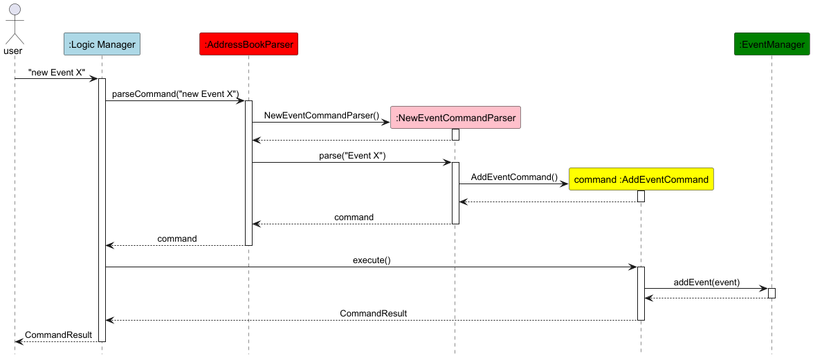

* Table of Contents
{:toc}

--------------------------------------------------------------------------------------------------------------------

## **Acknowledgements**

* {list here sources of all reused/adapted ideas, code, documentation, and third-party libraries -- include links to the original source as well}
* ChatGPT - These AI tools were used by Dhruv to automate the creation of similar test cases with slight changes. 

--------------------------------------------------------------------------------------------------------------------

## **Setting up, getting started**

Refer to the guide [_Setting up and getting started_](SettingUp.md).

--------------------------------------------------------------------------------------------------------------------

## **Design**

:bulb: **Tip:** The `.puml` files used to create diagrams in this document `docs/diagrams` folder. Refer to the [_PlantUML Tutorial_ at se-edu/guides](https://se-education.org/guides/tutorials/plantUml.html) to learn how to create and edit diagrams.

### Architecture

The ***Architecture Diagram*** given above explains the high-level design of the App.

Given below is a quick overview of main components and how they interact with each other.

**Main components of the architecture**

**`Main`** (consisting of classes [`Main`](https://github.com/se-edu/addressbook-level3/tree/master/src/main/java/seedu/address/Main.java) and [`MainApp`](https://github.com/se-edu/addressbook-level3/tree/master/src/main/java/seedu/address/MainApp.java)) is in charge of the app launch and shut down.
* At app launch, it initializes the other components in the correct sequence, and connects them up with each other.
* At shut down, it shuts down the other components and invokes cleanup methods where necessary.

The bulk of the app's work is done by the following four components:

* [**`UI`**](#ui-component): The UI of the App.
* [**`Logic`**](#logic-component): The command executor.
* [**`Model`**](#model-component): Holds the data of the App in memory.
* [**`Storage`**](#storage-component): Reads data from, and writes data to, the hard disk.

[**`Commons`**](#common-classes) represents a collection of classes used by multiple other components.

**How the architecture components interact with each other**

The *Sequence Diagram* below shows how the components interact with each other for the scenario where the user issues the command `delete 1`.

Each of the four main components (also shown in the diagram above),

* defines its *API* in an `interface` with the same name as the Component.
* implements its functionality using a concrete `{Component Name}Manager` class (which follows the corresponding API `interface` mentioned in the previous point.

For example, the `Logic` component defines its API in the `Logic.java` interface and implements its functionality using the `LogicManager.java` class which follows the `Logic` interface. Other components interact with a given component through its interface rather than the concrete class (reason: to prevent outside component's being coupled to the implementation of a component), as illustrated in the (partial) class diagram below.

The sections below give more details of each component.

### UI component

The **API** of this component is specified in [`Ui.java`](https://github.com/se-edu/addressbook-level3/tree/master/src/main/java/seedu/address/ui/Ui.java)

The UI consists of a `MainWindow` that is made up of parts e.g.`CommandBox`, `ResultDisplay`, `PersonListPanel`, `StatusBarFooter` etc. All these, including the `MainWindow`, inherit from the abstract `UiPart` class which captures the commonalities between classes that represent parts of the visible GUI.

The `UI` component uses the JavaFx UI framework. The layout of these UI parts are defined in matching `.fxml` files that are in the `src/main/resources/view` folder. For example, the layout of the [`MainWindow`](https://github.com/se-edu/addressbook-level3/tree/master/src/main/java/seedu/address/ui/MainWindow.java) is specified in [`MainWindow.fxml`](https://github.com/se-edu/addressbook-level3/tree/master/src/main/resources/view/MainWindow.fxml)

The `UI` component,

* executes user commands using the `Logic` component.
* listens for changes to `Model` data so that the UI can be updated with the modified data.
* keeps a reference to the `Logic` component, because the `UI` relies on the `Logic` to execute commands.
* depends on some classes in the `Model` component, as it displays `Person` object residing in the `Model`.

### Logic component

**API** : [`Logic.java`](https://github.com/se-edu/addressbook-level3/tree/master/src/main/java/seedu/address/logic/Logic.java)

Here's a (partial) class diagram of the `Logic` component:

The sequence diagram below illustrates the interactions within the `Logic` component, taking `execute("delete 1")` API call as an example.

:information_source: **Note:** The lifeline for `DeleteCommandParser` should end at the destroy marker (X) but due to a limitation of PlantUML, the lifeline continues till the end of diagram.

How the `Logic` component works:

1. When `Logic` is called upon to execute a command, it is passed to an `AddressBookParser` object which in turn creates a parser that matches the command (e.g., `DeleteCommandParser`) and uses it to parse the command.
1. This results in a `Command` object (more precisely, an object of one of its subclasses e.g., `DeleteCommand`) which is executed by the `LogicManager`.
1. The command can communicate with the `Model` when it is executed (e.g. to delete a person). 
   Note that although this is shown as a single step in the diagram above (for simplicity), in the code it can take several interactions (between the command object and the `Model`) to achieve.
1. The result of the command execution is encapsulated as a `CommandResult` object which is returned back from `Logic`.

Here are the other classes in `Logic` (omitted from the class diagram above) that are used for parsing a user command:

How the parsing works:
* When called upon to parse a user command, the `AddressBookParser` class creates an `XYZCommandParser` (`XYZ` is a placeholder for the specific command name e.g., `AddCommandParser`) which uses the other classes shown above to parse the user command and create a `XYZCommand` object (e.g., `AddCommand`) which the `AddressBookParser` returns back as a `Command` object.
* All `XYZCommandParser` classes (e.g., `AddCommandParser`, `DeleteCommandParser`, ...) inherit from the `Parser` interface so that they can be treated similarly where possible e.g, during testing.

### Model component
**API** : [`Model.java`](https://github.com/se-edu/addressbook-level3/tree/master/src/main/java/seedu/address/model/Model.java)

The `Model` component,

* stores the address book data i.e., all `Person` objects (which are contained in a `UniquePersonList` object).
* stores the currently 'selected' `Person` objects (e.g., results of a search query) as a separate _filtered_ list which is exposed to outsiders as an unmodifiable `ObservableList<Person>` that can be 'observed' e.g. the UI can be bound to this list so that the UI automatically updates when the data in the list change.
* stores the event data in a `EventManager` object, which contains all `Event` objects (which are contained in a `EventList` object).
* stores a `UserPref` object that represents the user’s preferences. This is exposed to the outside as a `ReadOnlyUserPref` objects.
* does not depend on any of the other three components (as the `Model` represents data entities of the domain, they should make sense on their own without depending on other components)

:information_source: **Note:** An alternative (arguably, a more OOP) model is given below. It has a `Tag` list in the `AddressBook`, which `Person` references. This allows `AddressBook` to only require one `Tag` object per unique tag, instead of each `Person` needing their own `Tag` objects. 

### Storage component

**API** : [`Storage.java`](https://github.com/se-edu/addressbook-level3/tree/master/src/main/java/seedu/address/storage/Storage.java)

The `Storage` component,
* can save address book data, event manager data, and user preference data in JSON format, and read them back into corresponding objects.
* inherits from `AddressBookStorage`, `EventManagerStorage`, and `UserPrefsStorage`, meaning it can be treated as any of these (if only the functionality of one is needed).
* depends on some classes in the `Model` component (because the `Storage` component's job is to save/retrieve objects that belong to the `Model`)

### Common classes

Classes used by multiple components are in the `seedu.address.commons` package.

--------------------------------------------------------------------------------------------------------------------

## **Implementation**

This section describes some noteworthy details on how certain features are implemented.

### Events: Adding Event
](images/AddEventCommandSequenceDiagram.png)

Above shows the sequence diagram when a user wants to add an event.
1. The user types the command `new [EVENT NAME]`
2. Logic Manager receives the text input and passes it to addressBookParser
3. AddressBookParser creates a new NewEventCommandParser and calls its .parse method
4. NewEventCommandParser creates a new AddEventCommand object
5. AddEventCommand object calls ParserUtil.parseEvent method to parse the event name
6. ParserUtil creates and returns a new Event Object, which is then passed back to Logic Manager
7. Logic Manager calls the execute method of the AddEventCommand object
8. AddEventCommand object calls the addEvent method of eventManager
9. AddEventCommand object returns a CommandResult object to Logic Manager

### \[Proposed\] Undo/redo feature

#### Proposed Implementation

The proposed undo/redo mechanism is facilitated by `VersionedAddressBook`. It extends `AddressBook` with an undo/redo history, stored internally as an `addressBookStateList` and `currentStatePointer`. Additionally, it implements the following operations:

* `VersionedAddressBook#commit()` — Saves the current address book state in its history.
* `VersionedAddressBook#undo()` — Restores the previous address book state from its history.
* `VersionedAddressBook#redo()` — Restores a previously undone address book state from its history.

These operations are exposed in the `Model` interface as `Model#commitAddressBook()`, `Model#undoAddressBook()` and `Model#redoAddressBook()` respectively.

Given below is an example usage scenario and how the undo/redo mechanism behaves at each step.

Step 1. The user launches the application for the first time. The `VersionedAddressBook` will be initialized with the initial address book state, and the `currentStatePointer` pointing to that single address book state.

Step 2. The user executes `delete 5` command to delete the 5th person in the address book. The `delete` command calls `Model#commitAddressBook()`, causing the modified state of the address book after the `delete 5` command executes to be saved in the `addressBookStateList`, and the `currentStatePointer` is shifted to the newly inserted address book state.

Step 3. The user executes `add n/David …​` to add a new person. The `add` command also calls `Model#commitAddressBook()`, causing another modified address book state to be saved into the `addressBookStateList`.

:information_source: **Note:** If a command fails its execution, it will not call `Model#commitAddressBook()`, so the address book state will not be saved into the `addressBookStateList`.

Step 4. The user now decides that adding the person was a mistake, and decides to undo that action by executing the `undo` command. The `undo` command will call `Model#undoAddressBook()`, which will shift the `currentStatePointer` once to the left, pointing it to the previous address book state, and restores the address book to that state.

:information_source: **Note:** If the `currentStatePointer` is at index 0, pointing to the initial AddressBook state, then there are no previous AddressBook states to restore. The `undo` command uses `Model#canUndoAddressBook()` to check if this is the case. If so, it will return an error to the user rather
than attempting to perform the undo.

The following sequence diagram shows how an undo operation goes through the `Logic` component:

:information_source: **Note:** The lifeline for `UndoCommand` should end at the destroy marker (X) but due to a limitation of PlantUML, the lifeline reaches the end of diagram.

Similarly, how an undo operation goes through the `Model` component is shown below:

The `redo` command does the opposite — it calls `Model#redoAddressBook()`, which shifts the `currentStatePointer` once to the right, pointing to the previously undone state, and restores the address book to that state.

:information_source: **Note:** If the `currentStatePointer` is at index `addressBookStateList.size() - 1`, pointing to the latest address book state, then there are no undone AddressBook states to restore. The `redo` command uses `Model#canRedoAddressBook()` to check if this is the case. If so, it will return an error to the user rather than attempting to perform the redo.

Step 5. The user then decides to execute the command `list`. Commands that do not modify the address book, such as `list`, will usually not call `Model#commitAddressBook()`, `Model#undoAddressBook()` or `Model#redoAddressBook()`. Thus, the `addressBookStateList` remains unchanged.

Step 6. The user executes `clear`, which calls `Model#commitAddressBook()`. Since the `currentStatePointer` is not pointing at the end of the `addressBookStateList`, all address book states after the `currentStatePointer` will be purged. Reason: It no longer makes sense to redo the `add n/David …​` command. This is the behavior that most modern desktop applications follow.

The following activity diagram summarizes what happens when a user executes a new command:

#### Design considerations:

**Aspect: How undo & redo executes:**

* **Alternative 1 (current choice):** Saves the entire address book.
  * Pros: Easy to implement.
  * Cons: May have performance issues in terms of memory usage.

* **Alternative 2:** Individual command knows how to undo/redo by
  itself.
  * Pros: Will use less memory (e.g. for `delete`, just save the person being deleted).
  * Cons: We must ensure that the implementation of each individual command are correct.

_{more aspects and alternatives to be added}_

### \[Proposed\] Data archiving

_{Explain here how the data archiving feature will be implemented}_

--------------------------------------------------------------------------------------------------------------------

## **Documentation, logging, testing, configuration, dev-ops**

* [Documentation guide](Documentation.md)
* [Testing guide](Testing.md)
* [Logging guide](Logging.md)
* [Configuration guide](Configuration.md)
* [DevOps guide](DevOps.md)

--------------------------------------------------------------------------------------------------------------------

## **Appendix: Requirements**

### Product scope

**Target user profile**:
Student event planners at NUS who:
* need to manage contacts like attendees, vendors, sponsors and volunteers for their events.
* need a centralized platform to organize, track and access contact information and details of event
* prefer desktop apps over other types
* can type fast
* prefers typing to mouse interactions
* is reasonably comfortable using CLI apps

**Value proposition**: For student planners who need a seamless way to manage contacts, our address book provides a centralized platform to organize, track, and access the contact information and details of attendees, vendors, sponsors and volunteers, thus enabling effortless coordination of logistics and ensures smooth communication for every event

### User stories

Priorities: High (must have) - `* * *`, Medium (nice to have) - `* *`, Low (unlikely to have) - `*`

| Priority | As a …​                                                                                                | I want to …​                                                             | So that I can…​                                                                                                          |
|----------|--------------------------------------------------------------------------------------------------------|--------------------------------------------------------------------------|--------------------------------------------------------------------------------------------------------------------------|
| `* * *`  | Student Event Planner who handles contact information of many people                                   | Add contact details of event attendees, vendors, sponsors and volunteers | store their contact details and have a platform to view the contact information of the relevant parties all in one place |
| `* * *`  | Student event planner who can type fast and prefer typing over other means of input                    | Perform the functions of the app solely by typing                        | speed up the process of accessing and managing information                                                               |
| `* * *`  | Student Event Planner                                                                                  | delete a person                                                          | keep my contacts up-to-date                                                                                              |
| `* * *`  | Student Event Planner                                                                                  | View the list of all contacts and number of contacts                     | quickly get an overview of contact information of all attendees, vendors, sponsors and volunteer saved so far            |
| `* *`    | Student event planner who has to contact vendors, sponsors, attendees and volunteers via various means | Save their name, phone number, email address, telegram handle, address   | efficiently keep track of their contact details and reach out to them through the appropriate channels                   |
| `* *`    | Student event planner                                                                                  | Update contact details of attendees, vendors, sponsors and volunteers    | keep their most current information or rectify a mistake                                                                 |
| `* *`    | Student event planner who needs to contact different stakeholders of an event                          | View list of contacts by categories                                      | zoom in on contacts of a particular category that interest me                                                            |

*{More to be added}*

### Use cases

(For all use cases below, the **System** is `PlanPal` and the **Actor** is the `user`, unless specified otherwise)

**UC01: Add a contact**

**MSS**

1.  User specifies the command that they want to add a new user
2.  User specifies the information of the user they want to add
3.  PlanPal shows a success message
4.  PlanPal shows the new User Object that has been created

    Use case ends.

**Extensions**

* 2a. Tagging a contact with a role
  * 2a1. User specifies what role the contact belongs to
    Use case resumes from 3.

    Use case ends.

* 2b. Adding Telegram Contact
  * 2b1. User specifies the Telegram username that the contact belongs to

  * Use case resumes from 3.

**UC02: Listing Contacts**

**MSS**
1. User specifies a command to request to list persons
2. PlanPal shows the list of all contacts
   Use case ends.

**Extensions:**
* 2a PlanPal detects error in process to list user
  * 2a1 PlanPal shows an error message that the command was called wrongly.

    Use case ends.

**UC03: Delete a contact**

**MSS**

1.  User requests to list persons(UC02)
2.  User requests to delete a specific person in the list
3.  PlanPal deletes the person

    Use case ends.

**Extensions**

* 2a. The list is empty.

  Use case ends.

* 3a.  PlanPal detects that the command given is invalid

    * 3a1. PlanPal shows an error message.

      Use case resumes at step 2.

**UC04 List Contacts by Role**

**MSS**

1. User requests to filter contacts by role.
2. PlanPal displays a list of contacts matching the specified role.

   Use case ends.

**Extensions**

* 1a. PlanPal detects that the command given is invalid.
    * 1a1. PlanPal shows an error message indicating that the command syntax is incorrect.

      Use case resumes at step 1.

* 2a. No contacts are found for the specified role.
    * 2a1. PlanPal displays a message that no users were found. 

      Use case ends.

### Non-Functional Requirements

1. PlanPal must have a consistent command-line interface design adhering to standard CLI usability conventions
2. PlanPal should not have multiple users on a shared computer
3. PlanPal should only support a single user
4. PlanPal data should be stored locally
5. PlanPal should not rely on external database
6. PlanPal should work on Windows, Linux and OS-X systems
7. PlanPal should not depend on a remote server
8. Third party frameworks/libraries/services used must be free, open source and have permissive licence terms
10. Do not require installation by user
11. PlanPal should work well for standard screen resolutions 1920x1080 and higher and for screen scales 150%
12. PlanPal should be packaged into a single JAR file
13. JAR file should not be above 100MB

*{More to be added}*

### Glossary

* **Mainstream OS**: Windows, Linux, Unix, MacOS
* **Private contact detail**: A contact detail that is not meant to be shared with others
* **PlanPal**: A software system designed to manage contact information specifically for student event planners, supporting functions like adding, updating, and deleting contacts, with data stored locally.
* **CLI (Command Line Interface)**: A text-based user interface where the user interacts with the system by typing commands.
* **GUI (Graphical User Interface)**: A icon-based user interface where the user interacts with the system through visual indicators and graphical icons.
* **Contact**: An individual or entity whose information is stored in PlanPal, typically including name, phone number, email, address, role, and optionally a Telegram handle.
* **Role**: A category assigned to a contact to indicate their relationship to an event, such as "attendee," "vendor," "volunteer," or "sponsor".
* **Tag**: A label that is applied to a contact to categorize them (e.g., as an attendee, vendor, volunteer, or sponsor) for easy organization and filtering.
* **Telegram Handle**: A unique username used on the Telegram messaging platform, which can be optionally stored as part of a contact's information in PlanPal.
* **User Object**: The data structure in PlanPal that holds the information of a contact, including details like name, phone number, email, address, role, and Telegram handle.
* **Single User**: PlanPal is designed to support only one user per system. It is not intended for multiple users on the same computer.
* **Local Storage**: PlanPal stores all contact data on the user's local machine, without relying on external databases or cloud storage.
* **Standard Screen Resolution**: PlanPal is optimized for display on screens with a resolution of 1920x1080 or higher, and it supports screen scaling up to 150% for better visibility on high-resolution displays.
* **JAR File**: A Java Archive file that contains all the compiled code, libraries, and resources required for PlanPal to run.
* **Index**: A numerical identifier used to specify a contact in a list for actions like deletion or updating. The index corresponds to the contact's position in the displayed list.

--------------------------------------------------------------------------------------------------------------------

## **Appendix: Instructions for manual testing**

Given below are instructions to test the app manually.

:information_source: **Note:** These instructions only provide a starting point for testers to work on;
testers are expected to do more *exploratory* testing.

### **Launch and shutdown**

1. **Initial launch**
    1. Download the jar file and copy it into an empty folder.
    2. Open a command terminal, navigate to the folder containing the jar file, and run `java -jar planpal.jar`.
    3. Expected: The GUI opens with sample contacts preloaded. The window size may not be optimum.

2. **Saving window preferences**
    1. Resize the window to an optimum size. Move the window to a different location.
    2. Close the application by typing `exit`.
    3. Re-launch the app by running `java -jar planpal.jar` in the terminal.
    4. Expected: The most recent window size and location are retained.

3. **Closing the app**
    1. Type `exit` in the command box and press Enter.
    2. Expected: The application closes without errors.

---

### **Contact management**

1. **Adding a new contact**
    1. Test case: `add n/John Doe p/98765432 e/johndoe@example.com a/123 Clementi Rd, #04-01 t/johndoe r/vendor`
        - Expected: A new contact "John Doe" is added. Details of the added contact are displayed in the status message.
    2. Test case: `add n/John Doe`
        - Expected: Error message displayed indicating missing mandatory fields.

2. **Editing a contact**
    1. Prerequisite: At least one contact exists in the list.
    2. Test case: `edit 1 p/91234567 e/johndoe_new@example.com`
        - Expected: Updates the phone number and email of the first contact. The updated details are displayed in the contact list.
    3. Test case: `edit 1`
        - Expected: Error message indicating no fields were specified for updating.

3. **Finding contacts**
    1. Test case: `find-name John`
        - Expected: Displays all contacts whose name contains "John" (case-insensitive).
    2. Test case: `find-role vendor`
        - Expected: Displays all contacts with the "vendor" role.
    3. Test case: `find-role unknown`
        - Expected: Does not change the contacts displayed, instead prints out the available roles for search

4. **Deleting a contact**
    1. Prerequisite: At least two contacts exist in the list.
    2. Test case: `delete 2`
        - Expected: Deletes the second contact in the list. Status message displays the details of the deleted contact.
    3. Test case: `delete 0`
        - Expected: Error message indicating invalid command.

---

### **Event management**

1. **Adding a new event**
    1. Test case: `new Career Fair`
        - Expected: Adds a new event named "Career Fair" to the event list.
    2. Test case: `new`
        - Expected: Error message indicating invalid command.

2. **Adding a contact to an event**
    1. Prerequisite: An event and at least one contact exist.
    2. Test case: `event-add ei/1 a/1`
        - Expected: Adds the first contact to the first event with the "attendee" role. Status message confirms the addition.
    3. Test case: `event-add ei/1`
        - Expected: Error message indicating invalid command.

3. **Removing a contact from an event**
    1. Prerequisite: A contact has been added to an event.
    2. Test case: `remove ei/1 ci/1`
        - Expected: Removes the contact from the specified event. Status message confirms the removal.
    3. Test case: `remove ei/1`
        - Expected: Error message indicating invalid command.

4. **Deleting an event**
    1. Prerequisite: At least one event exists in the list.
    2. Test case: `erase 1`
        - Expected: Deletes the first event. Status message confirms the deletion.

---

### **Search Mode**

1. **Entering and using search mode**
    1. Test case: `search-mode`
        - Expected: Application enters search mode, displaying all contacts in a search panel.
    2. Test case: `search n/John`
        - Expected: Filters the contacts in the search panel to display only those matching the name "John."

2. **Excluding contacts**
    1. Prerequisite: At least one contact is displayed in the search results.
    2. Test case: `exclude ci/1`
        - Expected: Removes the first contact from the search results. Status message confirms exclusion.

3. **Clearing exclusions**
    1. Prerequisite: At least one contact is excluded.
    2. Test case: `clear-excluded`
        - Expected: All excluded contacts are restored to the search results.

4. **Exiting search mode**
    1. Test case: `exit-search`
        - Expected: Application returns to normal mode.

---

### **Data management**

1. **Automatic saving**
    1. Test case: Add a new contact or edit an existing one. Close the application and re-launch it.
        - Expected: Changes persist and are visible after re-launch.
