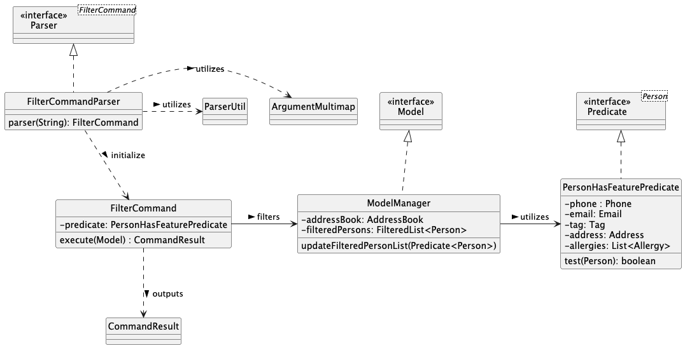

* Table of Contents
{:toc}

--------------------------------------------------------------------------------------------------------------------

## **Acknowledgements**
This project is based on the [AddressBook-Level3 Project](https://github.com/se-edu/addressbook-level3) originally created by the
[SE-EDU initiative](https://se-education.org/). We extend our thanks to the developers of AB3 for their foundational work.

We also extend our gratitude to the creators of the following resources and libraries that were essential in developing Health Connect:

* [AB3 Codebase](https://github.com/se-edu/addressbook-level3)
* [Java 17 Installation Guide for Mac Users](https://se-education.org/guides/tutorials/javaInstallationMac.html)
* [JavaFX](https://openjfx.io/)
* [JUnit](https://junit.org/junit5/)
* [Jackson Library](https://github.com/FasterXML/jackson)

AI Declaration:
* Samriddh : Utilized ChatGPT for code completion, javadoc and writing test cases.
* Nihirra : Used GitHub Copilot and ChatGPT for debugging and assistance with code implementation. 

--------------------------------------------------------------------------------------------------------------------

## **Setting up, getting started**

Refer to the guide [_Setting up and getting started_](SettingUp.md).

--------------------------------------------------------------------------------------------------------------------

## **Design**

### Architecture

The ***Architecture Diagram*** given above explains the high-level design of the App.

Given below is a quick overview of main components and how they interact with each other.

**Main components of the architecture**

**`Main`** (consisting of classes [`Main`](https://github.com/se-edu/addressbook-level3/tree/master/src/main/java/seedu/address/Main.java) and [`MainApp`](https://github.com/se-edu/addressbook-level3/tree/master/src/main/java/seedu/address/MainApp.java)) is in charge of the app launch and shut down.
* At app launch, it initializes the other components in the correct sequence, and connects them up with each other.
* At shut down, it shuts down the other components and invokes cleanup methods where necessary.

The bulk of the app's work is done by the following four components:

* [**`UI`**](#ui-component): The UI of the App.
* [**`Logic`**](#logic-component): The command executor.
* [**`Model`**](#model-component): Holds the data of the App in memory.
* [**`Storage`**](#storage-component): Reads data from, and writes data to, the hard disk.

[**`Commons`**](#common-classes) represents a collection of classes used by multiple other components.

**How the architecture components interact with each other**

The *Sequence Diagram* below shows how the components interact with each other for the scenario where the user issues the command `delete n/Jason p/88781234`.

Each of the four main components (also shown in the diagram above),

* defines its *API* in an `interface` with the same name as the Component.
* implements its functionality using a concrete `{Component Name}Manager` class (which follows the corresponding API `interface` mentioned in the previous point).

For example, the `Logic` component defines its API in the `Logic.java` interface and implements its functionality using the `LogicManager.java` class which follows the `Logic` interface. Other components interact with a given component through its interface rather than the concrete class (reason: to prevent outside component's being coupled to the implementation of a component), as illustrated in the (partial) class diagram below.

The sections below give more details of each component.

### UI component

The **API** of this component is specified in [`Ui.java`](https://github.com/se-edu/addressbook-level3/tree/master/src/main/java/seedu/address/ui/Ui.java)

The UI consists of a `MainWindow` that is made up of parts e.g.`CommandBox`, `ResultDisplay`, `PersonListPanel`, `StatusBarFooter` etc. All these, including the `MainWindow`, inherit from the abstract `UiPart` class which captures the commonalities between classes that represent parts of the visible GUI.

The `UI` component uses the JavaFx UI framework. The layout of these UI parts are defined in matching `.fxml` files that are in the `src/main/resources/view` folder. For example, the layout of the [`MainWindow`](https://github.com/se-edu/addressbook-level3/tree/master/src/main/java/seedu/address/ui/MainWindow.java) is specified in [`MainWindow.fxml`](https://github.com/se-edu/addressbook-level3/tree/master/src/main/resources/view/MainWindow.fxml)

The `UI` component,

* executes user commands using the `Logic` component.
* listens for changes to `Model` data so that the UI can be updated with the modified data.
* keeps a reference to the `Logic` component, because the `UI` relies on the `Logic` to execute commands.
* depends on some classes in the `Model` component, as it displays `Person` object residing in the `Model`.

### Logic component

**API** : [`Logic.java`](https://github.com/se-edu/addressbook-level3/tree/master/src/main/java/seedu/address/logic/Logic.java)

Here's a (partial) class diagram of the `Logic` component:

Further illustrations of interactions within the `Logic` component will follow the feature explanations, focusing on dependencies between these features and the `Logic` class. 
These diagrams and examples will clarify how `Logic` coordinates with other classes to process commands effectively, ensuring consistent operation and robust error handling across features.

How the `Logic` component works:

1. When `Logic` is called upon to execute a command, it is passed to an `AddressBookParser` object which in turn creates a parser that matches the command (e.g., `DeleteCommandParser`) and uses it to parse the command.
2. This results in a `Command` object (more precisely, an object of one of its subclasses e.g., `DeleteCommand`) which is executed by the `LogicManager`.
3. The command can communicate with the `Model` when it is executed (e.g. to delete a person). 
   Note that although this is shown as a single step in the diagram above (for simplicity), in the code it can take several interactions (between the command object and the `Model`) to achieve.
4. The result of the command execution is encapsulated as a `CommandResult` object which is returned back from `Logic`.

Here are the other classes in `Logic` (omitted from the class diagram above) that are used for parsing a user command:

How the parsing works:
* When called upon to parse a user command, the `AddressBookParser` class creates an `XYZCommandParser` (`XYZ` is a placeholder for the specific command name e.g., `AddCommandParser`) which uses the other classes shown above to parse the user command and create a `XYZCommand` object (e.g., `AddCommand`) which the `AddressBookParser` returns back as a `Command` object.
* All `XYZCommandParser` classes (e.g., `AddCommandParser`, `DeleteCommandParser`, `DateCommandParser`,...) inherit from the `Parser` interface so that they can be treated similarly where possible e.g, during testing.

### Model component
**API** : [`Model.java`](https://github.com/se-edu/addressbook-level3/tree/master/src/main/java/seedu/address/model/Model.java)

The `Model` component,

* stores the address book data i.e., all `Person` objects (which are contained in a `UniquePersonList` object).
* stores the currently 'selected' `Person` objects (e.g., results of a search query) as a separate _filtered_ list which is exposed to outsiders as an unmodifiable `ObservableList<Person>` that can be 'observed' e.g. the UI can be bound to this list so that the UI automatically updates when the data in the list change.
* stores a `UserPref` object that represents the user’s preferences. This is exposed to the outside as a `ReadOnlyUserPref` objects.
* does not depend on any of the other three components (as the `Model` represents data entities of the domain, they should make sense on their own without depending on other components)

<strong>Note:</strong> An alternative (arguably, a more OOP) model is given below. It includes a <code>Allergy</code> list in the <code>AddressBook</code>, which <code>Person</code> references. This allows <code>AddressBook</code> to store only one <code>Allergy</code> object per unique tag, rather than each <code>Person</code> needing their own <code>Allergy</code> objects. 

### Storage component

**API** : [`Storage.java`](https://github.com/se-edu/addressbook-level3/tree/master/src/main/java/seedu/address/storage/Storage.java)

The `Storage` component,
* can save both address book data and user preference data in JSON format, and read them back into corresponding objects.
* inherits from both `AddressBookStorage` and `UserPrefStorage`, which means it can be treated as either one (if only the functionality of only one is needed).
* depends on some classes in the `Model` component (because the `Storage` component's job is to save/retrieve objects that belong to the `Model`)

### Common classes

Classes used by multiple components are in the `seedu.address.commons` package.

--------------------------------------------------------------------------------------------------------------------

## **Implementation**
This section describes some noteworthy details on how certain features are implemented.

### Add Feature
Users can add patients to Health Connect, requiring a name, phone number, address, email, tag, and allergy.

#### Features Architecture Design
1. Parsing in `AddCommandParser`: Parsing logic is handled by `AddCommandParser` to ensure consistency before passing parameters to `AddCommand`.
    * Benefit: Simplifies command classes, following the Single Responsibility Principle.
    * Challenge: Requires precise parsing as it bridges user input and command execution.
2. Duplicate Prevention: `AddCommand` checks for duplicates via `ModelManager`, ensuring unique entries.
    * Benefit: Ensures data integrity in both `Model` and `Storage`.
    * Challenge: Requires checks across components, such as using `isDuplicate` method in `Person`.

The activity diagram below illustrates the sequence of actions users will follow to add a new patient profile into the Health Connect application.

### Delete Feature
Users can delete patients by specifying a unique identifier (name, phone number, or email), keeping the data accurate and relevant.
#### Features Architecture Design
1. Parsing in `DeleteCommandParser`: Parsing is handled by `DeleteCommandParser`, passing parameters to `DeleteCommand`.
   * Benefits and Challenges similar to Add Feature
2. Error Prevention: `DeleteCommand` verifies the patient's existence in `ModelManager` before deletion.
    * Benefit: Validates the patients presence, preserving data integrity.
    * challenge: Requires a `matches` method in `Delete` to check records.

This method would have dependencies on the `Model` class and the `Person` class. The class diagram of a delete person command is given
to demonstrate the interactions among classes.

### Edit Feature
Users can update patient information by specifying an index and the fields to be updated, ensuring accurate records.

#### Features Architecture Design
1. Parsing in `EditCommandParser`: Parsing logic in `EditCommandParser` ensures consistency before passing parameters to `EditCommand`.
    * Benefits and Challenges similar to Add Feature

2. Index and Field Validation: `EditCommand` confirms the patient's presence in `ModelManager`.
    * **Benefit:** Prevents errors, ensuring updates are applied only to valid records.
    * **Challenge:** Requires checking with `Model`’s `filteredPersonList`.

3. Duplicate Check: `EditCommand` verifies that edits won’t create duplicate entries.
    * **Benefit:** Prevents redundancy in patient records.
    * **Challenge:** Cross-checks modified data with existing records via `isSamePerson`.

The sequence diagram below illustrates the interactions within the `Logic` component, when executing the edit command in Heath Connect. Take `execute("edit 1 p/88991123")` API call as an example.

<strong>Note:</strong> The lifeline for <code>EditCommandParser</code> should end at the destroy marker (X). However, due to a limitation of PlantUML, the lifeline continues until the end of the diagram.

### Date Feature

The Date feature allows users to add, edit, and view appointment dates and times for each person in the address book, helping doctors maintain an organized schedule without conflicts.

#### Feature Architecture Design
1. **Parsing in DateCommandParser**: `DateCommandParser` handles the parsing of date-related commands, ensuring dates and times are in the correct format (`d/M/yyyy HHmm`) before passing them to `DateCommand`.
    - Benefits and Challenges similar to Add Feature

2. **Date Validation**: `DateCommand` enforces date and time format requirements and ensures compliance (e.g., `d/M/yyyy HHmm`).
    - **Benefit**: Provides users with immediate feedback on invalid formats and values, helping maintain data consistency.
    - **Challenge**: Requires thorough validation logic to prevent incorrect or improperly formatted dates and times from being added.

3. **Preventing Duplicate Dates and Times Across the Model**: `DateCommand` checks for existing dates and times across all records to avoid scheduling conflicts for the doctor, ensuring no overlapping appointments.
    - **Benefit**: Ensures accurate, conflict-free scheduling, giving doctors a reliable view of upcoming appointments.
    - **Challenge**: Requires efficient cross-checks within the model to detect and prevent any duplicate appointment dates across all patient records.

**Sequence Diagram**: Shows interactions within `Logic` when processing date commands, such as adding or editing an appointment date and time, ensuring no conflicts across the schedule.

<strong>Note:</strong> The lifeline for <code>DateCommandParser</code> should end at the destroy marker (X). However, due to a limitation of PlantUML, the lifeline continues until the end of the diagram.

### Filter Feature

The `filter` feature allows users to search for patients based on specific attributes such as tag, phone number, email, address, and allergies. It filters the list of patients to display only those who match the given parameters.

#### Features Architecture Design

1. **Parsing handled by FilterCommandParser**: The logic for parsing the user’s search criteria is managed by the `FilterCommandParser`. It ensures that all parameters are interpreted correctly before passing them to the `FilterCommand` class for execution.

    * **Benefit**: This keeps the `FilterCommand` focused on executing the filter operation, adhering to the Single Responsibility Principle.
    * **Challenge**: The `FilterCommandParser` must handle various combinations of parameters accurately. Ensuring correctness in parsing is crucial since incorrect parameters could lead to empty or erroneous search results.

2. **Filter Logic and AND/OR Conditions**: The filtering logic is handled by the `FilterCommand`, which processes the search criteria using AND logic for different attributes (e.g., both tag and allergy must match) and OR logic for the allergy attribute (e.g., matching any one of the listed allergies).

    * **Benefit**: This flexible search logic allows users to refine their searches and find patients who meet multiple criteria.
    * **Challenge**: The `FilterCommand` needs to ensure that the AND and OR conditions are applied correctly and efficiently, especially when multiple allergies are involved.

The class diagram of a filter command is given to demonstrate the interactions among classes.

## Planned Enhancements

Team Size: 5

1. **Error Validation for CliSyntax:**
   Making sure the system checks if the user enters any unexpected or incorrect symbols. If the user does, the system will let them know what the correct options are, helping avoid confusion and mistakes.

2. **Allow address to have characters that are equal to prefixes:**
   Currently, address validation does not allow certain characters, preventing users from adding addresses with special prefixes (e.g. `n/`, `p/`). Enhancing this to allow specific characters would give users more flexibility to enter detailed or complex addresses.

3. **Allowing `d/o` in the name field:** Currently, the system does not permit the use of `d/o` in the name field as `d/` is reserved for the date command. 
This enhancement would allow users to input `d/o` in names without triggering conflicts, offering more flexibility and ensuring that date-related commands are unaffected by name entries.

4. **Add, Delete, or Replace Allergy Functionality:**
   Allow users to specify whether they want to add, delete, or replace an allergy in the list. This enhancement would give users more control over their allergy list as currently the system only replaces allergies.

5. **Adding a customizable tags feature:** Currently, the app only supports the default tags `High Risk`, `Medium Risk` and `Low Risk`.
   This enhancement allows doctors to create, delete, and edit tags, providing flexibility to personalize patient categorization.
   It enables doctors to define tags that align with their specific needs, improving patient management and enhancing the overall efficiency of the system.

6. **Adding an end time to the `date` feature:** Currently, the app allows only the start time and date, preventing duplicate `DATE_TIME` entries. Adding an end time enables users to 
define precise appointment durations, helping to prevent overlapping and double-booked slots. It improves scheduling clarity, allowing for better time management and conflict prevention, especially 
for managing busy schedules.

7. **Warn user that date entered is in the past:** 
Currently, the user is allowed to enter an appointment date and time from the past because this function is meant to be for easy reference of information, so the user might want to add past patients and their last appointment.
However, in the future, an enhancement can be added where the user is warned when a past date or time in the added. For example, `WARNING: Date and time that was added has already passed.`

8. **Specific error message about date and time format:**
   Currently, the app accepts dates and times in the format d/M/yyyy HHmm while allowing optional leading zeros for day and month, 
which is intended to streamline input and minimise errors without unnecessarily inconveniencing the user for correct inputs. This may be considered as the format dd/MM/yyyy HHmm so a planned enhancement could be to specify this to the user, or convey that leading zeroes are allowed.
   In this iteration, we’ve kept the error messages simple and focused on one format to avoid overloading users with information. We want to ensure that the most critical details are clear, reducing any confusion for users who may not notice subtle differences in date and time formats.

9. **Accept other phone formats:**
Currently, the app only accepts phone numbers that are 8 digits long and start with 3, 6, 8 or 9, according to Singapore's standard format for phone numbers. However, we understand that some users may key in their NOK's number, which may not be a Singapore number, as they might be based overseas. In the future, more phone formats can be added, such as including area codes and accepting more digits.

10. **Add more date formats:**
Currently, we found that our priority was to ensure that the date command functionality was working seamlessly before we added more date formats. However, in the future, we plan to accept more date and time formats (e.g. `MM-dd-yyyy HH:mm`) so that the user can conveniently use the one that is most familiar.

--------------------------------------------------------------------------------------------------------------------

## **Documentation, logging, testing, configuration, dev-ops**

* [Documentation guide](Documentation.md)
* [Testing guide](Testing.md)
* [Logging guide](Logging.md)
* [Configuration guide](Configuration.md)
* [DevOps guide](DevOps.md)

--------------------------------------------------------------------------------------------------------------------

## **Appendix: Requirements**

### Product scope

**Target user profile**:

Home-based healthcare providers who
* Has a need to manage a significant number of patients information
* Needs to see their daily schedule of patient appointments
* Needs to store their patients' appointment date and time
* Tag patients based on allergies and risk
* Can type fast
* Prefers typing to mouse interactions
* Is reasonably comfortable using CLI apps
* Are based in Singapore

**Value proposition**: Our patient management system empowers Singapore home-based healthcare providers to efficiently retrieve and prioritise patient information, enabling them to provide personalized care and see their schedule for the day.

### User stories

Priorities:
- High (must have): `***`
- Medium (nice to have) - `**`
- Low (unlikely to have) - `*`

| Priority | As a …​                        | I want to …​                                                      | So that I can…​                                                                                        |
|----------|--------------------------------|-------------------------------------------------------------------|--------------------------------------------------------------------------------------------------------|
| `***`    | home-based healthcare provider | add the data of new clients                                       | register new clients in the system for tracking                                                        |
| `***`    | home-based healthcare provider | add the contact details of my patients for easy access            | contact and notify them accordingly if there are any emergencies                                       |
| `***`    | home-based healthcare provider | add the address of my patients                                    | know where to get access to my patients                                                                | 
| `**`     | home-based healthcare provider | tag patients based on their urgency                               | prioritise higher-risk patients                                                                        |
| `**`     | home-based healthcare provider | tag a client's important details                                  | keep track of medical allergies or urgency                                                             |
| `***`    | home-based healthcare provider | be notified of overlapping names, phone numbers and email addresses | avoid duplicate client entries                                                                         |
| `***`    | home-based healthcare provider | find my patients' allergies                                       | provide the correct prescription for my patients                                                       |
| `*`      | home-based healthcare provider | filter patients according to priority                             | focus on more urgent patients                                                                          |
| `**`     | home-based healthcare provider | delete the records of patients whom I am not seeing anymore       | keep my address book concise and clutter-free                                                          |
| `***`    | home-based healthcare provider | edit my patients' contact details accordingly                     | contact them easily without having to worry about not being able to reach the due to wrong information |
| `***`    | home-based healthcare provider | edit my patients' address if they move locations                  | get to my patients without worrying about going to the wrong location                                  |   
| `***`    | home-based healthcare provider | add new appointment details                                       | add appointments in my schedule for tracking later on                                                  |
| `***`    | home-based healthcare provider | be notified of overlapping appointments                           | reschedule my appointments as required                                                                 |
| `***`    | home-based healthcare provider | see my schedule for the day                                       | organise my time and ensure that there is sufficient time to travel to different locations             |

### Use cases

(For all use cases below, the **System** is the `HealthConnect` and the **Actor** is the `user`, unless specified otherwise)

**Use case: Add a client**

**MSS**

1.  User requests to add a client.
2.  HealthConnect adds client data and displays confirmation message. 
    Use case ends.

**Extensions**

* 1a.  HealthConnect detects an error in the command format.
    * 1a1. HealthConnect shows an error message. 
        Use case ends.

* 1b. HealthConnect detects a duplicate person entry.
    * 1b1. HealthConnect shows an error message. 
        Use case ends.

**Use case: Delete client data**

**MSS**

1.  User requests to delete a client’s data.
2.  HealthConnect deletes the person and displays confirmation message. 
    Use case ends.

**Extensions**

* 1a. HealthConnect detects an error in the command format.
    * 1a1. HealthConnect shows an error message. 
        Use case ends.

* 1b. HealthConnect detects a duplicate person entry.
    * 1b1. HealthConnect shows an error message.
    * 1b2. HealthConnect requests for correct data.
    * 1b3. User enters new data. 
        Steps 1b1-1b3 are repeated until a unique person is found from details in input. 
        Use case resumes from step 2.

* 1c. HealthConnect detects non-existent client.
    * 1c1. HealthConnect shows an error message. 
        Use case ends.

**Use case: Edit client data**  
Preconditions: HealthConnect has correct view, including client to edit

**MSS**

1.  User requests to edit details.
2.  HealthConnect edits clients' information and displays client's updated details. 
    Use case ends.

**Extensions**

* 1a. HealthConnect detects an error in the command format.
    * 1a1. HealthConnect shows an error message. 
    Use case ends.

* 1b. HealthConnect detects a duplicate person entry.
    * 1b1. HealthConnect shows an error message.
    * 1b2. HealthConnect requests for correct data.
    * 1b3. User enters new data. 
        Steps 1b1-1b3 are repeated until the details inputted renders a unique person. 
        Use case resumes from step 2.

**Use case: Add appointment date and time for client**

**MSS**

1. User requests to add appointment date and time. 
2. HealthConnect adds appointment date and time and displays confirmation message. 
    Use case ends.

**Extensions**

* 1a.  HealthConnect detects an error in the command format.
    * 1a1. HealthConnect shows an error message. 
        Use case ends.

* 1b. HealthConnect detects an overlapping appointment date and time.

    * 1b1. HealthConnect shows an error message.
    * 1b2. HealthConnect displays information on existing person with overlapped date and time. 
        Use case ends.

* 1c. HealthConnect detects non-existent client.

    * 1c1. HealthConnect shows an error message. 
        Use case ends.

**Use case: Show schedule for the day**

**MSS**

1.  User requests to see the schedule for the day.
2.  HealthConnect displays list of persons with matching date. 
    Use case ends.

**Extensions**

* 1a.  HealthConnect detects an error in the command format.
    * 1a1. HealthConnect shows an error message. 
        Use case ends.

**Use case: Find client's name by keywords**

**MSS**

1. User requests to find clients by keywords.
2. HealthConnect displays the list of persons that matches keywords. 
    Use case ends.

**Extensions**

* 1a. HealthConnect detects non-existent clients.
  * 1a1. HealthConnect displays execution message. 
    Use case ends.

**Use case: Filter clients by parameters**

**MSS**

1. User requests to filter client.
2. HealthConnect displays list of persons that matches parameters provided. 
    Use case ends.

**Extensions**

* 1a.  HealthConnect detects an error in the command format.
    * 1a1. HealthConnect shows an error message. 
        Use case ends.

**To be added as potential future enhancements:**

**Use case: Record Client Payment**

**MSS**

1.  User requests to record a payment and inputs client's details.
2.  HealthConnect displays the payment due. 
    Use case ends.

**Extensions**

* 1a. HealthConnect detects an error in the command format.
    * 1a1. HealthConnect shows an error message. 
      Use case ends.

* 1b. HealthConnect detects a duplicate person entry.
    * 1b1. HealthConnect shows an error message.
    * 1b2. HealthConnect requests for correct data.
    * 1b3. User enters new data. 
      Steps 1b1-1b3 are repeated until a unique person is found from details in input. 
      Use case resumes from step 2.

* 1c. HealthConnect detects non-existent client.
    * 1c1. HealthConnect shows an error message. 
      Use case ends.

### Non-Functional Requirements

1. Should work on any _mainstream OS_ as long as it has Java `17` or above installed.
2. Should be able to hold up to 1000 persons without a noticeable sluggishness in performance for typical usage.
3. A user with above average typing speed for regular English text (i.e. not code, not system admin commands) should be able to accomplish most of the tasks faster using commands than using the mouse.
4. The system should respond within 5 seconds for any commands given.
5. Command syntax should be consistent throughout the application to minimize the learning curve.
6. Users should be able to run the application from the downloaded JAR file without an additional installer.
7. The system should provide meaningful, yet concise error messages for the user to easily make the necessary changes.
8. The codebase should be modular to facilitate easy maintenance and future enhancements.
9. The code should be well-documented with clear comments to assist future developers.
10. The application should have a smooth user experience that is intuitive and easy to use.
11. The system should be customised for operations by a single user and need not handle multiple user-access.
12. Configuration and data files should use standard formats to ensure compatibility with text editors and other applications.
13. The system should validate all user inputs to prevent errors when saving the information.
14. The system’s architecture should support potential future upgrades that might include expanded user capacity, without significant reworking of core components.
15.  User data should persist across sessions, stored in a reliable format (e.g., JSON or XML) that can be easily backed up and restored.
16.  The application should be designed in a way that allows new features to be added with minimal disruption to existing functionality.

### Glossary

* **Mainstream OS**: Windows, Linux, Unix, macOS.
* **Patient Record**: A collection of patient's personal and medical information. This includes, but is not limited to, name, contact number, email, address, allergies, injuries sustained.
* **Appointment**: A scheduled session between the healthcare provider and patient for medical consultation or treatment. This is marked in Health Connect by the time, date and patient.
* **Schedule**: A list of all patients' whose appointments is on a specific date.
* **Tag**: A label applied to a patient record, used to categorise and highlight specific medical information, such as priority.
* **Medical History**: Documentation of patient's past illnesses, treatments, surgeries and other medical related information.
* **Allergy**: A known medical condition or sensitivity that a client has to specific substances or environmental factors (e.g., certain foods, medications, pollen).
    This information is recorded in the client’s profile to help healthcare providers avoid potential triggers and deliver appropriate care during visits.
* **Inactive Client**: A client who is no longer receiving care or whose records have not been accessed in a significant amount of time.

--------------------------------------------------------------------------------------------------------------------

## **Appendix: Instructions for manual testing**

Given below are instructions to test the app manually.

:information_source: **Note:** These instructions only provide a starting point for testers to work on;
testers are expected to do more *exploratory* testing.

### Launch and shutdown

1. Initial launch

   1. Download the jar file and copy into an empty folder

   2. Double-click the jar file Expected: Shows the GUI with a set of sample contacts. The window size may not be optimum.

2. Saving window preferences

   1. Resize the window to an optimum size. Move the window to a different location. Close the window.

   2. Re-launch the app by double-clicking the jar file.  Expected: The most recent window size and location is retained.

3. Exiting the Application

   1. Use the `exit` command or close the window directly.  Expected: The application should close without any errors or delays.

## Managing Patient Records

### Adding a patient

1. Adding a valid patient

    1. Test case: `add n/John Doe p/98765432 e/johndoe@example.com a/123 Main St t/Low Risk m/None` 
       Expected: New person added: Joanne; Phone: 98788432; Email: johnd@example.com; Address: 311, Clementi Ave 2, #02-25; Tag: Low Risk; Allergies: None

2. Adding a patient with missing fields

    1. Test case: `add n/John` 
       Expected: Following parameters are missing : p/, e/, a/, t/, m/
       add: Adds a person to the address book. Parameters: n/NAME p/PHONE e/EMAIL a/ADDRESS t/TAG m/ALLERGY...
       Example: add n/John Doe p/98765432 e/johnd@example.com a/311, Clementi Ave 2, #02-25 t/Low Risk m/Peanuts
   
3. Adding a duplicate patient

    1. Prerequisites: Ensure "John Doe" with the contact details in "Adding a valid patient" is already in the contact list.
   
    2. Test Case: `add n/John Doe p/98765432 e/johndoe@example.com a/123 Main St t/Low Risk m/None` 
       Expected Error Message: This person already exists in the address book

    3. Other duplicate person add command to try: `add n/John Doe p/98765432 e/differentemail@example.com a/123 Main St t/Low Risk m/None`,

### Deleting a person

1. Deleting a patient 

    1. Test case: `delete n/Alex Yeoh` 
       Expected: Deleted Person: Alex Yeoh; Phone: 81239873; Email: alex@yahoo.com; Address: 311, Clementi Ave West, #02-25; Tag: Low Risk; Allergies: None
   
    2. Test case: `delete p/81239873` 
       Expected: Deleted Person: Alex Yeoh; Phone: 81239873; Email: alex@yahoo.com; Address: 311, Clementi Ave West, #02-25; Tag: Low Risk; Allergies: None
   
    3. Test case: `delete e/alex@yahoo.com` 
       Expected: Deleted Person: Alex Yeoh; Phone: 81239873; Email: alex@yahoo.com; Address: 311, Clementi Ave West, #02-25; Tag: Low Risk; Allergies: None
   
    4. Other incorrect delete commands to try: `delete`, `delete 1`, `delete x`, `...`  
       Expected: Invalid command format!
       Please provide at least one of the following: name, phone, or email

### Editing a patient

1. Editing a patient

     1. Test case: `edit 1 n/Axel` 

     2. Test case: `edit 1 p/88452209 e/alex@gmail.com` 
        Expected: Edited Person: Axel; Phone: 88452209; Email: alex@gmail.com; Address: 311, Clementi Ave West, #02-25; Tag: Low Risk; Allergies: None

     3. Test case: `edit 1 n/Alice p/90967209 e/alice@gmail.com` 
        Expected: Edited Person: Alice; Phone: 90967209; Email: alice@gmail.com; Address: 311, Clementi Ave West, #02-25; Tag: Low Risk; Allergies: None

     4. Test case: `edit 1` 
        Expected: At least one field to edit must be provided

2. Attempting to edit to create a duplicate patient
    
     1. Prerequisites: Ensure "Alice" with the contact details above is already in the contact list.
    
     2. Test case: `edit 3 n/Alice p/90967209
        Expected Error Message: Error. This edit will result in a person that already exists in the address book.

### Filtering patients

1. Filtering patients by tag

     1. Test case: `filter t/Low Risk` 
        Expected: Lists all patients with tag "Low Risk"

2. Filtering patients by phone number

     1. Test case: `filter p/98765432` 
        Expected: Lists all patients with phone number "98765432"

3. Filtering patients by allergy

     1. Test case: `filter m/Penicillin` 
        Expected: Lists all patients with allergy "Penicillin"

### Saving data

1. Dealing with missing/corrupted data files

    1. Delete the data file.
    2. Restart the app.
    3. Expected: The app should create a new data file with default data.

## **Appendix: Effort**

**Difficulty Level:**

As the group had prior experience with Orbital, it was easier to understand how to work together with one another to add to the AddressBook. 
However, the concepts of Software Engineering were new to all members in the team, and the difficulty lies in having to implement the code according to the Software Engineering principles. 
Most of our effort was dedicated to adding essential features, and debugging cases that we have not previously considered.

**Challenges Faced:**

- Mapping requirements to real-life scenarios: As we are unfamiliar with the potential for patients with same details, we found it difficult to finalise the final logic for duplicate patients.
- Consistent logic throughout codebase: As we had different ideas on implementation, it required many iterations to change the code to make the logic consistent.
- Overriding or changing functionality of the code unintentionally: As there are some portions where we implement the feature concurrently, it results in many merge conflicts and unintentional behaviour.

**Reuse and Adaptation:**

Our group tried to reuse as much of AB3's code structure as much as possible to save time in adding the new commands. However, some commands required extensive changes due to the duplicate person's logic.

**Achievements:**

In creating HealthConnect, we began with a base application (an address book) and adapted it to meet the specific needs of home-based healthcare professionals. 
For example, by simplifying the process of adding and viewing information of patients.  For example, with the use of tags, it makes it easier to filter people to find the relevant details.
Our focus was also on refining existing logic and validations to make them more suitable for this context. 
This included careful adjustments to fields like name and phone number, ensuring that they were logical and functional for home-based healthcare use in Singapore.

After considerable discussion, we established that two entries (Person A and Person B) would be considered duplicates if they shared the same:

- Name, phone number, and email
- Name and email
- Name and phone number

The latter two conditions prevent users from accidentally creating separate entries for the same person if only minor details, like email or phone number, change. 
This approach maintains a cleaner, more accurate record-keeping system and reduces the risk of redundant data.

Given the iterative nature of this project, we prioritized essential features in our initial development, including tags, filters, allergies, appointment date and times, and finding schedule. 
For each of these features, we focused on establishing clear logic and minimizing bugs, aiming for a robust and reliable experience for users from the outset. 
This careful planning and attention to detail allowed us to build a solid foundation for HealthConnect, supporting its growth and adaptability.
