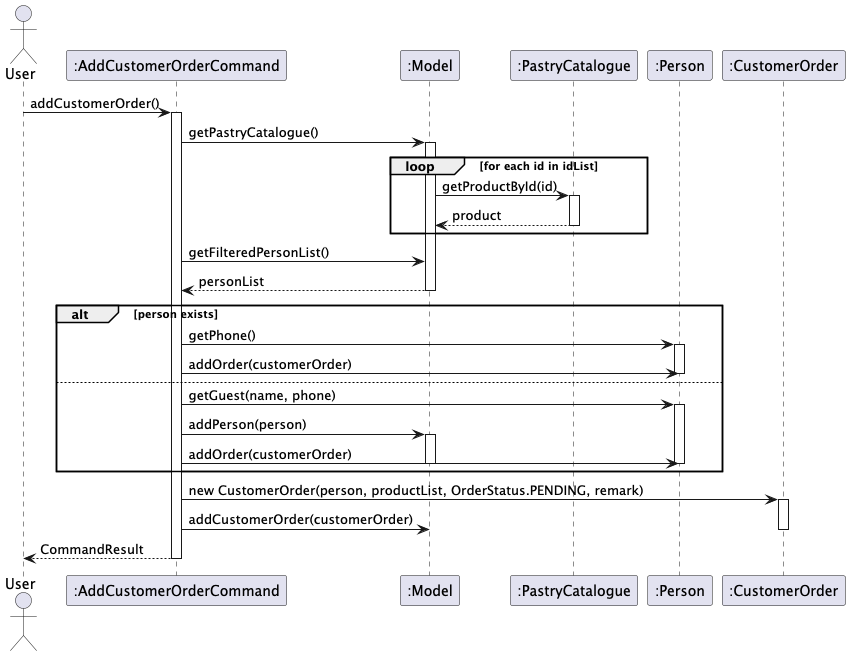
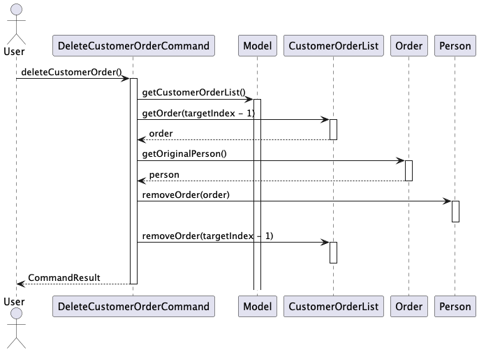

* Table of Contents
{:toc}

--------------------------------------------------------------------------------------------------------------------

## **Acknowledgements**

* This project builds upon [AddressBook-Level3](https://github.com/se-edu/addressbook-level3) created by the [SE-EDU initiative](https://se-education.org).

* We would like to express our sincere gratitude to:
   * Professor [Damith](https://www.comp.nus.edu.sg/~damithch) and the CS2103T teaching team for their guidance and for providing the foundation for this project
   * The original developers of AddressBook-Level3 for creating a robust codebase that made our enhancements possible
   * The SE-EDU initiative for maintaining the original codebase and documentation

* Libraries used:
   * [JavaFX](https://openjfx.io/) - The main GUI framework
   * [JUnit](https://junit.org/junit5/) - Testing framework
--------------------------------------------------------------------------------------------------------------------

## **Setting up, getting started**

Refer to the guide [_Setting up and getting started_](SettingUp.md).

--------------------------------------------------------------------------------------------------------------------

## **Design**

:bulb: **Tip:** The `.puml` files used to create diagrams in this document `docs/diagrams` folder. Refer to the [_PlantUML Tutorial_ at se-edu/guides](https://se-education.org/guides/tutorials/plantUml.html) to learn how to create and edit diagrams.

### Architecture

The ***Architecture Diagram*** given above explains the high-level design of the App.

Given below is a quick overview of main components and how they interact with each other.

**Main components of the architecture**

**`Main`** (consisting of classes [`Main`](https://github.com/AY2425S1-CS2103T-T11-1/tp/blob/master/src/main/java/seedu/address/Main.java) and [`MainApp`](https://github.com/AY2425S1-CS2103T-T11-1/tp/blob/master/src/main/java/seedu/address/MainApp.java)) is in charge of the app launch and shut down.
* At app launch, it initializes the other components in the correct sequence, and connects them up with each other.
* At shut down, it shuts down the other components and invokes cleanup methods where necessary.

The bulk of the app's work is done by the following four components:

* [**`UI`**](#ui-component): The UI of the App.
* [**`Logic`**](#logic-component): The command executor.
* [**`Model`**](#model-component): Holds the data of the App in memory.
* [**`Storage`**](#storage-component): Reads data from, and writes data to, the hard disk.

[**`Commons`**](#common-classes) represents a collection of classes used by multiple other components.

**How the architecture components interact with each other**

The *Sequence Diagram* below shows how the components interact with each other for the scenario where the user issues the command `delete 1`.

Each of the four main components (also shown in the diagram above),

* defines its *API* in an `interface` with the same name as the Component.
* implements its functionality using a concrete `{Component Name}Manager` class (which follows the corresponding API `interface` mentioned in the previous point.

For example, the `Logic` component defines its API in the `Logic.java` interface and implements its functionality using the `LogicManager.java` class which follows the `Logic` interface. Other components interact with a given component through its interface rather than the concrete class (reason: to prevent outside component's being coupled to the implementation of a component), as illustrated in the (partial) class diagram below.

The sections below give more details of each component.

### UI component

The **API** of this component is specified in [`Ui.java`](https://github.com/AY2425S1-CS2103T-T11-1/tp/blob/master/src/main/java/seedu/address/ui/Ui.java)

TThe UI consists of a `MainWindow` that is made up of multiple parts:
* `CommandBox` - Handles user input
* `ResultDisplay` - Shows feedback to user
* `PersonListPanel` - Displays list of persons
* `SupplyOrderListPanel` - Displays list of supply orders
* `CustomerOrderListPanel` - Displays list of customer orders
* `StatusBarFooter` - Shows save location status

All these components, including the `MainWindow`, inherit from the abstract `UiPart` class which encapsulates common functionality for UI components.

The `UI` component uses the JavaFx UI framework. The layout of these UI parts are defined in matching `.fxml` files that are in the `src/main/resources/view` folder. For example, the layout of the [`MainWindow`](https://github.com/AY2425S1-CS2103T-T11-1/tp/blob/master/src/main/java/seedu/address/ui/MainWindow.java) is specified in [`MainWindow.fxml`](https://github.com/AY2425S1-CS2103T-T11-1/tp/blob/master/src/main/resources/view/MainWindow.fxml)

The `UI` component,

* executes user commands using the `Logic` component.
* listens for changes to `Model` data so that the UI can be updated with the modified data.
* keeps a reference to the `Logic` component, because the `UI` relies on the `Logic` to execute commands.
* depends on some classes in the `Model` component, as it displays `Person`, `SupplyOrder`, and `CustomerOrder` objects residing in the `Model`.

Key features:
* Handles window management (showing, hiding, sizing)
* Provides keyboard shortcuts through accelerators
* Implements error handling and displays alerts when needed
* Supports refresh functionality to update all UI components
* Manages help window functionality

### Logic component

**API** : [`Logic.java`](https://github.com/AY2425S1-CS2103T-T11-1/tp/blob/master/src/main/java/seedu/address/logic/Logic.java)

Here's a (partial) class diagram of the `Logic` component:

The sequence diagram below illustrates the interactions within the `Logic` component, taking `execute("delete 1")` API call as an example.

:information_source: **Note:** The lifeline for `DeleteCommandParser` should end at the destroy marker (X) but due to a limitation of PlantUML, the lifeline continues till the end of diagram.

How the `Logic` component works:

1. When `Logic` is called upon to execute a command, it is passed to an `AddressBookParser` object which in turn creates a parser that matches the command (e.g., `DeleteCommandParser`) and uses it to parse the command.
1. This results in a `Command` object (more precisely, an object of one of its subclasses e.g., `DeleteCommand`) which is executed by the `LogicManager`.
1. The command can communicate with the `Model` when it is executed (e.g. to delete a person). 
   Note that although this is shown as a single step in the diagram above (for simplicity), in the code it can take several interactions (between the command object and the `Model`) to achieve.
1. The result of the command execution is encapsulated as a `CommandResult` object which is returned back from `Logic`.

Here are the other classes in `Logic` (omitted from the class diagram above) that are used for parsing a user command:

How the parsing works:
* When called upon to parse a user command, the `AddressBookParser` class creates an `XYZCommandParser` (`XYZ` is a placeholder for the specific command name e.g., `AddCommandParser`) which uses the other classes shown above to parse the user command and create a `XYZCommand` object (e.g., `AddCommand`) which the `AddressBookParser` returns back as a `Command` object.
* All `XYZCommandParser` classes (e.g., `AddCommandParser`, `DeleteCommandParser`, ...) inherit from the `Parser` interface so that they can be treated similarly where possible e.g, during testing.

### Model component
**API** : [`Model.java`](https://github.com/se-edu/addressbook-level3/tree/master/src/main/java/seedu/address/model/Model.java)

The `Model` component,

* stores the address book data i.e., all `Person` objects (which are contained in a `UniquePersonList` object).
* stores the currently 'selected' `Person` objects (e.g., results of a search query) as a separate _filtered_ list which is exposed to outsiders as an unmodifiable `ObservableList<Person>` that can be 'observed' e.g. the UI can be bound to this list so that the UI automatically updates when the data in the list change.
* stores a `UserPref` object that represents the user’s preferences. This is exposed to the outside as a `ReadOnlyUserPref` objects.
* does not depend on any of the other three components (as the `Model` represents data entities of the domain, they should make sense on their own without depending on other components)

:information_source: **Note:** An alternative (arguably, a more OOP) model is given below. It has a `Tag` list in the `AddressBook`, which `Person` references. This allows `AddressBook` to only require one `Tag` object per unique tag, instead of each `Person` needing their own `Tag` objects. 

### Storage component

**API** : [`Storage.java`](https://github.com/se-edu/addressbook-level3/tree/master/src/main/java/seedu/address/storage/Storage.java)

[StorageClassDiagram.puml](diagrams%2FStorageClassDiagram.puml)

The `Storage` component manages data persistence by saving and loading various parts of the application's data in JSON format. It handles the following components: `AddressBook`, `UserPrefs`, `SupplyOrderList`, `CustomerOrderList`, `IngredientCatalogue`, and `PastryCatalogue`.

#### **Responsibilities**
1. **Saving Data**: Converts in-memory objects from the `Model` component into JSON format and writes them to disk.
2. **Loading Data**: Reads data from JSON files and converts them back into in-memory objects used by the `Model` component.
3. **Error Handling**: Provides robust mechanisms to handle missing files, corrupt data, and deserialization errors.
4. **Interface Implementation**: Implements multiple storage interfaces to handle the different types of data:
    - `AddressBookStorage`
    - `UserPrefsStorage`
    - `SupplyOrderListStorage`
    - `CustomerOrderListStorage`
    - `IngredientCatalogueStorage`
    - `PastryCatalogueStorage`

#### **Key Interfaces and Classes**
| Interface/Class                     | Description                                                                                  |
|-------------------------------------|----------------------------------------------------------------------------------------------|
| `StorageManager`                    | Central manager that implements the `Storage` interface and handles all storage operations.   |
| `JsonUserPrefsStorage`              | Implements `UserPrefsStorage`. Handles saving and loading of user preferences.               |
| `JsonAddressBookStorage`            | Implements `AddressBookStorage`. Handles saving and loading of `AddressBook` data.           |
| `JsonSupplyOrderListStorage`        | Implements `SupplyOrderListStorage`. Handles saving and loading of `SupplyOrderList`.        |
| `JsonCustomerOrderListStorage`      | Implements `CustomerOrderListStorage`. Handles saving and loading of `CustomerOrderList`.     |
| `JsonIngredientCatalogueStorage`    | Implements `IngredientCatalogueStorage`. Handles saving and loading of `IngredientCatalogue`. |
| `JsonPastryCatalogueStorage`        | Implements `PastryCatalogueStorage`. Handles saving and loading of `PastryCatalogue`.        |

### **JSON-Adapted Classes and Their Usage**
Each data type uses specialized `JsonAdapted` classes to handle JSON serialization and deserialization. These classes ensure data consistency and validate constraints during data conversion.

| **JSON-Adapted Class**              | **Used By (JSON Classes)**           | **Purpose**                                                               |
|-------------------------------------|--------------------------------------|---------------------------------------------------------------------------|
| `JsonAdaptedPerson`                 | `JsonSerializableAddressBook`, `JsonAdaptedSupplyOrder`, `JsonAdaptedCustomerOrder` | Represents a `Person` in JSON format for serialization.  |
| `JsonAdaptedIngredient`             | `JsonAdaptedPastry`, `JsonAdaptedSupplyOrder` | Represents an `Ingredient` in JSON format.  |
| `JsonAdaptedPastry`                 | `JsonAdaptedCustomerOrder` | Represents a `Pastry` in JSON format.            |
| `JsonAdaptedTag`                    | `JsonSerializableAddressBook`, `JsonAdaptedPerson` | Represents `Tag` data associated with a `Person`.   |
| `JsonSerializableAddressBook`       | `AddressBookStorage`                 | Converts `AddressBook` to/from JSON.                                      |
| `JsonAdaptedCustomerOrder`          | `JsonAdaptedCustomerOrderList`       | Represents `CustomerOrder` in JSON.                                        |
| `JsonAdaptedSupplyOrder`            | `JsonAdaptedSupplyOrderList`         | Represents `SupplyOrder` in JSON.                                          |

---

### Storage Workflow

1. **Application Startup**:
    - The `MainApp` initializes the `StorageManager`.
    - The `StorageManager` loads data from JSON files.
    - If data files are missing or corrupted, the application falls back to sample data.

2. **User Interaction**:
    - Users interact with the application through commands.
    - Upon successful command execution, updated data is saved via `StorageManager`.

3. **Application Shutdown**:
    - The `MainApp` ensures all modified data is saved before closing.
    - This includes saving the current state of User Preferences, Address Book, Ingredient Catalogue, Pastry Catalogue, Customer Orders, and Supply Orders.

#### **Data Flow**
1. **Saving Data**:
    - When data is modified, `Model` notifies `StorageManager`.
    - `StorageManager` converts the data to JSON and saves it using the respective storage class.

2. **Loading Data**:
    - On startup, `StorageManager` reads data from JSON files.
    - The data is deserialized into in-memory objects and passed to the `Model`.

### Error Handling

The `Storage` component employs robust error handling to manage potential issues:
- **DataLoadingException**:
    - Thrown when data loading fails due to corruption or format issues.
    - The application uses sample data in such cases.

- **IOException**:
    - Thrown during file read/write operations.
    - Errors are logged, and users are notified.
--------------------------------------------------------------------------------------------------------------------
### Common classes

Classes used by multiple components are in the `seedu.address.commons` package.

--------------------------------------------------------------------------------------------------------------------

## **Implementation**

This section describes some noteworthy details on how certain features are implemented.

### Add/Delete Order feature

#### Implementation
The order management mechanism is facilitated by `CustomerOrderList` and `SupplyOrderList`. Both classes extends `OrderList` with methods to add and manage orders. Additionally, it implements the following operations:  
* `CustomerOrderList#addOrder(Order)` — Adds a new customer order to the customer order list.
* `CustomerOrderList#removeOrder(Order)` — Removes an existing order from the customer order list.
* `SupplyOrderList#addOrder(Order)` — Adds a new supply order to the supply order list.
* `SupplyOrderList#removeOrder(Order)` — Removes an existing supply order from the supply order list.

These operations are exposed in the `Model` interface as `Model#addCustomerOrder(Order)`, `Model#removeCustomerOrder(Order)`, `Model#removeCustomerOrder(Order)` and `Model#removeSupplyOrder(Order)` respectively.  

**Adding an Order**
* Given below is an example usage scenario on how the order management mechanism behaves at each step when an order is added. 
* For simplicity, we will only focus on the customer order list since both customer and supply order lists share the same behavior. 

Step 1: The user launches the application for the first time. The `CustomerOrderList` will be initialized with the initial order list state.  

Step 2: The user executes `addCustomerOrder` command to add a new customer order. 

Command Execution:  
* The execute method is called with the `Model` as a parameter.
* It retrieves the `PastryCatalogue` from the `Model`.
* It checks if all product IDs in the `idList` exist in the `PastryCatalogue`.
* It retrieves the list of products corresponding to the IDs.
* It retrieves the list of persons from the `Model`.
* It checks if the person exists in the list by their phone number.
* If the person does not exist, it creates a new guest person and adds them to the `Model`.
* It creates a new `CustomerOrder` with the person, product list, order status, and remark.
* It adds the order to the person and the `CustomerOrderList` within `Model`.

The sequence diagram below illustrates the interactions within the `AddCustomerOrderCommand` during the execution of the `addCustomerOrder` command:

**Deleting an Order**
* An example of how the order management mechanism behaves at each step when an order is removed is given below. 
* Once again only the customer order list will be focused on.

Step 1: The user executes `deleteCustomerOrder` command to remove an existing customer order.

Command Execution:  
* The execute method is called with the `Model` as a parameter.
* It retrieves the `CustomerOrderList` from the `Model`.
* It checks if the provided index is valid (1-based index).
* It retrieves the order at the specified index.
* It retrieves the person associated with the order.
* It removes the order from the person.
* It removes the order from the `CustomerOrderList`.
* It returns a `CommandResult` indicating the success of the operation.

The sequence diagram below illustrates the interactions within the DeleteCustomerOrderCommand during the execution of the deleteCustomerOrder command.

#### Design Considerations:

**Aspect: Storage of Orders**  
* **Alternative 1 (current choice):** Store orders in a JSON file.  
  * Pros: Easy to implement and maintain.
  * Cons: May not be efficient for large datasets.
  
* **Alternative 2:** Store orders in a database.  
  * Pros: More efficient for large datasets, supports complex queries.
  * Cons: Requires additional setup and maintenance.

### \[Proposed\] Undo/redo feature

#### Proposed Implementation

The proposed undo/redo mechanism is facilitated by `VersionedAddressBook`. It extends `AddressBook` with an undo/redo history, stored internally as an `addressBookStateList` and `currentStatePointer`. Additionally, it implements the following operations:

* `VersionedAddressBook#commit()` — Saves the current address book state in its history.
* `VersionedAddressBook#undo()` — Restores the previous address book state from its history.
* `VersionedAddressBook#redo()` — Restores a previously undone address book state from its history.

These operations are exposed in the `Model` interface as `Model#commitAddressBook()`, `Model#undoAddressBook()` and `Model#redoAddressBook()` respectively.

Given below is an example usage scenario and how the undo/redo mechanism behaves at each step.

Step 1. The user launches the application for the first time. The `VersionedAddressBook` will be initialized with the initial address book state, and the `currentStatePointer` pointing to that single address book state.

Step 2. The user executes `delete 5` command to delete the 5th person in the address book. The `delete` command calls `Model#commitAddressBook()`, causing the modified state of the address book after the `delete 5` command executes to be saved in the `addressBookStateList`, and the `currentStatePointer` is shifted to the newly inserted address book state.

Step 3. The user executes `add n/David …​` to add a new person. The `add` command also calls `Model#commitAddressBook()`, causing another modified address book state to be saved into the `addressBookStateList`.

:information_source: **Note:** If a command fails its execution, it will not call `Model#commitAddressBook()`, so the address book state will not be saved into the `addressBookStateList`.

Step 4. The user now decides that adding the person was a mistake, and decides to undo that action by executing the `undo` command. The `undo` command will call `Model#undoAddressBook()`, which will shift the `currentStatePointer` once to the left, pointing it to the previous address book state, and restores the address book to that state.

:information_source: **Note:** If the `currentStatePointer` is at index 0, pointing to the initial AddressBook state, then there are no previous AddressBook states to restore. The `undo` command uses `Model#canUndoAddressBook()` to check if this is the case. If so, it will return an error to the user rather
than attempting to perform the undo.

The following sequence diagram shows how an undo operation goes through the `Logic` component:

:information_source: **Note:** The lifeline for `UndoCommand` should end at the destroy marker (X) but due to a limitation of PlantUML, the lifeline reaches the end of diagram.

Similarly, how an undo operation goes through the `Model` component is shown below:

The `redo` command does the opposite — it calls `Model#redoAddressBook()`, which shifts the `currentStatePointer` once to the right, pointing to the previously undone state, and restores the address book to that state.

:information_source: **Note:** If the `currentStatePointer` is at index `addressBookStateList.size() - 1`, pointing to the latest address book state, then there are no undone AddressBook states to restore. The `redo` command uses `Model#canRedoAddressBook()` to check if this is the case. If so, it will return an error to the user rather than attempting to perform the redo.

Step 5. The user then decides to execute the command `list`. Commands that do not modify the address book, such as `list`, will usually not call `Model#commitAddressBook()`, `Model#undoAddressBook()` or `Model#redoAddressBook()`. Thus, the `addressBookStateList` remains unchanged.

Step 6. The user executes `clear`, which calls `Model#commitAddressBook()`. Since the `currentStatePointer` is not pointing at the end of the `addressBookStateList`, all address book states after the `currentStatePointer` will be purged. Reason: It no longer makes sense to redo the `add n/David …​` command. This is the behavior that most modern desktop applications follow.

The following activity diagram summarizes what happens when a user executes a new command:

#### Design considerations:

**Aspect: How undo & redo executes:**

* **Alternative 1 (current choice):** Saves the entire address book.
  * Pros: Easy to implement.
  * Cons: May have performance issues in terms of memory usage.

* **Alternative 2:** Individual command knows how to undo/redo by
  itself.
  * Pros: Will use less memory (e.g. for `delete`, just save the person being deleted).
  * Cons: We must ensure that the implementation of each individual command are correct.

_{more aspects and alternatives to be added}_

### \[Proposed\] Data archiving

_{Explain here how the data archiving feature will be implemented}_

--------------------------------------------------------------------------------------------------------------------

## **Documentation, logging, testing, configuration, dev-ops**

* [Documentation guide](Documentation.md)
* [Testing guide](Testing.md)
* [Logging guide](Logging.md)
* [Configuration guide](Configuration.md)
* [DevOps guide](DevOps.md)

--------------------------------------------------------------------------------------------------------------------

## **Appendix: Requirements**

### Product scope

**Target user profile**:

Home-based bakery business owners
* Individuals who manage small to medium-sized bakery operations
* Need to manage customer relationships and supplier orders efficiently
* Want to reduce administrative effort
* Want to focus on their craft of baking
* Comfortable with typing and using a CLI for interaction
* Interested in organizing ingredient and pastry catalogues
* Value an application that integrates order and inventory management

**Value proposition**:
A one stop solution that helps home-based bakery business owners manage customer and supplier orders, ingredient inventory,
and pastry catalogues more efficiently, allowing them to streamline their operations and focus more on their craft.

### User stories
Priorities: High (must have) - `* * *`, Medium (nice to have) - `* *`, Low (unlikely to have) - `*`

| Priority | As a …​      | I want to …​                                               | So that I can…​                                                        |
|----|--------------|------------------------------------------------------------|------------------------------------------------------------------------|
| * * * | bakery owner | add a new customer or supplier                             | keep track of all my business contacts                                 |
| * * * | bakery owner | update or edit a customer profile                          | keep track of changing preferences, addresses, or order histories      |
| * * * | bakery owner | add and remove ingredients to my Catalogue                 | track available stock for baking needs                                 |
| * * * | bakery owner | add and remove pastries to my Catalogue                    | view what products I have to sell to my customers                      |
| * * * | bakery owner | create and manage customer and supplier orders             | ensure I can fulfill orders on time                                    |
| * * * | bakery owner | delete a customer or supplier                              | remove contacts I no longer do business with                           |
| * * | bakery owner | sort orders based on status (pending/completed)            | prioritize my workload                                                 |
| * * | bakery owner | view ingredient stock                                      | know what ingredients I need to buy to complete any orders             |
| * * | bakery owner | view pastry stock                                          | know what quantities of pastries I have for sale at the current moment |
| * * | bakery owner | filter customers based on tags                             | segment my customer base for targeted actions                          |
| * * | bakery owner | view the full order history of a customer                  | offer personalized service                                             |
| * * | bakery owner | search for a customer or supplier                          | quickly access their details and history                               |
| * * | bakery owner | mark an order as complete once it's delivered or picked up | keep my records up to date                                             |
| *  | bakery owner | integrate the app with an inventory system                 | monitor ingredient levels more effectively                             |
| *  | bakery owner | back up data automatically                                 | prevent data loss                                                      |

### Use cases

(For all use cases below, the **System** is the `BakeBuddy` system and the **Actor** is the `bakery owner`, unless specified otherwise)

**Use case: Add a customer**

**MSS**

1. User requests to add a new customer by providing their details (name, phone, email, address, and any additional information).
2. System validates the provided details.
3. System adds the new customer to the address book.
4. System confirms the addition by displaying a success message.
5. Use case ends.

**Extensions**

- **2a. The provided phone number is already associated with an existing customer.**
    - 2a1. System shows an error message indicating a duplicate phone number.
    - 2a2. Use case ends.

- **2b. One or more mandatory fields (e.g., name, phone) are missing.**
    - 2b1. System shows an error message indicating which fields are missing.
    - 2b2. User provides the missing information.
    - 2b3. Use case resumes from step 2.

- **2c. The provided phone number, email, or other fields do not meet format constraints.**
    - 2c1. System shows an error message specifying the invalid field(s).
    - 2c2. User corrects the invalid input.
    - 2c3. Use case resumes from step 2.

- **3a. The system encounters an error while trying to save the new customer.**
    - 3a1. System shows an error message indicating the save failure.
    - 3a2. System logs the error for troubleshooting.
    - 3a3. Use case ends.

**Use case: Edit a supplier's details**

**MSS**

1. User requests to list suppliers.
2. System shows a list of suppliers.
3. User requests to edit details of a specific supplier.
4. System updates the supplier's details.
5. Use case ends.

**Extensions**

- **2a. The list is empty.**
    - 2a1. Use case ends.

- **3a. The given index is invalid.**
    - 3a1. System shows an error message.
    - 3a2. Use case resumes at step 2.

**Use case: Add a new pastry to the catalogue**

**MSS**

1. User requests to add a new pastry by providing its details (name, price, and list of ingredients).
2. System validates the provided details.
3. System adds the new pastry to the pastry catalogue.
4. System confirms the addition by displaying a success message.

   Use case ends.

**Extensions**

- 2a. One or more mandatory fields (e.g., name, price) are missing.
    - 2a1. System shows an error message indicating which fields are missing.
    - 2a2. User provides the missing information.
    - 2a3. Use case resumes from step 2.

- 2b. The provided ingredient list includes an ingredient that does not exist in the inventory.
    - 2b1. System shows an error message indicating the missing ingredient(s).
    - 2b2. User updates the ingredient list or adds the missing ingredient to the inventory.
    - 2b3. Use case resumes from step 2.

- 2c. The price format is invalid (e.g., negative value or incorrect format).
    - 2c1. System shows an error message indicating the invalid price format.
    - 2c2. User corrects the price format.
    - 2c3. Use case resumes from step 2.

- 3a. The system encounters an error while trying to save the new pastry.
    - 3a1. System shows an error message indicating the save failure.
    - 3a2. System logs the error for troubleshooting.
    - 3a3. Use case ends.

**Use case: Viewing Inventory**

**MSS**

1. Bakery owner logs into the system
2. Bakery owner navigates to the "Inventory" section
3. Bakery owner clicks on "View Inventory"
4. System displays a list of all ingredients in stock, showing each ingredient's ID, name, and quantity available

Use case ends.

### Non-Functional Requirements

1. Performance:
    * The system should respond to all user interactions within 1 to 2 seconds.
    * Entering and processing new orders should take no longer than 2 seconds per transaction.
    * Queries to find customer details, full order history, and all existing orders and deliveries should be executed within 3 seconds.
    * Upon startup, the system should load fully within 5 seconds.

2. Usability:
    * The GUI should be intuitive and user-friendly for bakery owners with varying levels of digital literacy.
    * Every user interaction should follow a consistent interface layout, design, color, and font pattern.
    * Clear messages should guide users if they enter invalid data or encounter errors.

3. Scalability:
    * The application should efficiently manage a database that expands from 100 to 10,000 records without significant performance degradation.
    * The system should be designed with modularity in mind, allowing for easy addition of new features or integrations.

4. Availability & Reliability:
    * The system should be available all the time without unplanned downtime.
    * Automatic data backups should be implemented to prevent data loss.
    * There should be a recovery process to restore customer, supplier, and order delivery information.

5. User Support & Help:
    * Built-in help documentation or guided tutorials should be available for common actions.

*{More to be added}*

### Glossary

* **Customer Profile**: A detailed record of an individual customer's information, including contact details, preferences, past orders, and notes.
* **Order History**: The chronological log of all orders made by a customer, detailing the items purchased, order dates, quantities, and delivery statuses.
* **Order Tracking**: The process of monitoring all customer orders and deliveries from creation to completion.
* **Supplier Profile**: A record of all contact details, products supplied, and other relevant information about a business or individual who provides ingredients or supplies to the bakery.
* **Inventory Management**: The process of keeping track of stock levels, products, and supplies needed for baking.
* **Search Functionality**: A tool within the software that allows quick finding of specific customers or suppliers.
* **Reminder System**: A feature that enables setting notifications for important dates, such as recurring customer orders for birthdays or holidays.
* **Preferences**: Specific customer details that influence their purchasing behavior, stored in the customer profile.
* **Contact Information**: Essential details needed to reach a customer or supplier, stored in their respective profiles.
* **Supplier Order Tracking**: The ability to record and monitor orders placed with suppliers.

--------------------------------------------------------------------------------------------------------------------

## Appendix: Instructions for manual testing

Given below are instructions to test the app manually.

### Launch and shutdown

#### Initial launch

1. Download the `jar` file and copy it into an empty folder.
2. Double-click the `jar` file.
    - **Expected:** Shows the GUI with a set of sample customers, suppliers, and orders. The window size may not be optimum.

#### Saving window preferences

1. Resize the window to an optimum size.
2. Move the window to a different location.
3. Close the window.
4. Re-launch the app by double-clicking the `jar` file.
    - **Expected:** The most recent window size and location is retained.

### Adding a customer

#### Adding a new customer with all valid fields

1. Prerequisites: Ensure (name and phone number) of customer to be added is not already in the list of customers is shown using the `list` command.
2. Test case: `addCustomer n/John Doe p/91234567 e/johndoe@example.com a/123 Baker Street, #01-02 i/no dairy`
    - **Expected:** Customer is added to the list, and the success message is displayed.
3. Test case: `addCustomer n/Emily Clark p/92234567 e/emily@example.com a/456 Orchard Road, #05-10 i/Loyal customer`
    - **Expected:** Customer is added to the list with the correct details.

#### Adding a customer with invalid or missing fields

1. Test case: `addCustomer p/12345678 e/johndoe@example.com` (missing phone number)
    - **Expected:** Error message indicating the missing name field.
2. Test case: `addCustomer n/John Doe p/abc e/johndoe@example.com a/123 Baker Street, #01-02 i/Regular customer` (invalid phone number)
    - **Expected:** Error message indicating the invalid phone number.

### Editing a supplier's details

#### Editing an existing supplier

1. Prerequisites: Ensure supplier to be edited exists in the list of suppliers is shown using the `list` command.
2. Test case: `editContact 2 p/98765432 e/newemail@example.com` (assuming index 2 is valid)
    - **Expected:** Supplier's phone and email are updated, and a success message is displayed.
3. Test case: `editContact 5 a/New Address, #10-20 s/Chocolate` (assuming index 5 is valid and Chocolate exists in the ingredient catalogue)
    - **Expected:** Supplier's address is updated successfully.

#### Editing with invalid data

1. Test case: `editContact 1 s/Caramel` (assuming Caramel is not in the ingredient Catalogue)
    - **Expected:** Error message indicating to add Caramel using the add Ingredient command first.
2. Test case: `editContact 10 p/91234567` (index out of range)
    - **Expected:** Error message indicating the index is invalid.

### Deleting a customer order

#### Deleting an existing customer order

1. Prerequisites: Ensure the list of customer orders is shown.
2. Test case: `deleteCustomerOrder 1`
    - **Expected:** The first order is deleted from the list, and a success message is displayed.
3. Test case: `deleteCustomerOrder 3` (assuming multiple orders exist)
    - **Expected:** The third order is deleted from the list.

#### Deleting with invalid index

1. Test case: `deleteCustomerOrder 0`
    - **Expected:** Error message indicating an invalid index.
2. Test case: `deleteCustomerOrder 100` (index out of range)
    - **Expected:** Error message indicating the index is invalid.

### Adding a pastry

1. Prerequisites: Ensure that the ingredients required for the pastry are already available in the ingredient catalogue.
2. **Test case**: `addPastry Chocolate Croissant 4.50 Chocolate Flour Sugar` (Assuming Chocolate, Flour and Sugar exist in the Ingredient catalogue)
    - **Expected**: The pastry "Chocolate Croissant" is added successfully, and a success message is displayed.

#### Adding with invalid data

1. **Test case**: `addPastry Strawberry Tart 5.00 Strawberry Cream Butter` (assuming Butter is not in the ingredient catalogue)
    - **Expected**: Error message indicating that Butter must be added using the `addIngredient` command before it can be used in a pastry.
2. **Test case**: `addPastry Apple Pie -3.00 Apple Flour Sugar`
    - **Expected**: Error message indicating that the cost cannot be negative.
3. **Test case**: `addPastry Blueberry Muffin 3.00`
    - **Expected**: Error message indicating that at least one ingredient must be provided.

### Filtering contacts by tags

#### Filtering contacts

1. Prerequisites: Ensure the list of contacts is shown using the `list  ` command.
2. Test case: `filterContact t/Customer`
    - **Expected:** Displays only the contacts tagged as "Customer".
3. Test case: `filterContact t/Supplier`
    - **Expected:** Displays only the contacts tagged as "Supplier".

#### Filtering with no results

1. Test case: `filterContact t/NonExistentTag`
    - **Expected:** No contacts are displayed, and an appropriate message is shown.

### Saving data

#### Dealing with missing/corrupted data files

1. **Simulating a missing data file**: Delete the data file (e.g., `data/addressbook.json`) and restart the app.
    - **Expected:** App starts with sample data and a new data file is created.
2. **Simulating a corrupted data file**: Introduce invalid JSON syntax in the data file and restart the app.
    - **Expected:** App shows an error message and starts with an empty address book or sample data.

