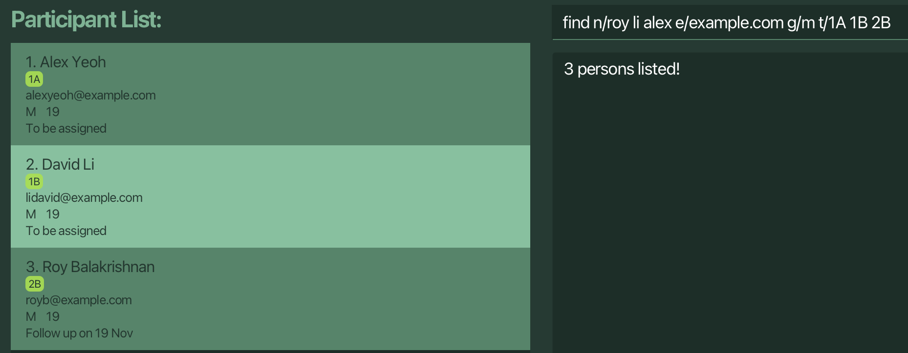

* Table of Contents
{:toc}

--------------------------------------------------------------------------------------------------------------------

## **Acknowledgements**

* This project is based on the AddressBook-Level3 project created by the [SE-EDU initiative](https://se-education.org).
--------------------------------------------------------------------------------------------------------------------

## **Setting up, getting started**

Refer to the guide [_Setting up and getting started_](SettingUp.md).

--------------------------------------------------------------------------------------------------------------------

## **Design**

:bulb: **Tip:** The `.puml` files used to create diagrams in this document `docs/diagrams` folder. Refer to the [_PlantUML Tutorial_ at se-edu/guides](https://se-education.org/guides/tutorials/plantUml.html) to learn how to create and edit diagrams.

### Architecture

The ***Architecture Diagram*** given above explains the high-level design of the App.

Given below is a quick overview of main components and how they interact with each other.

**Main components of the architecture**

**`Main`** (consisting of classes [`Main`](https://github.com/se-edu/addressbook-level3/tree/master/src/main/java/seedu/address/Main.java) and [`MainApp`](https://github.com/se-edu/addressbook-level3/tree/master/src/main/java/seedu/address/MainApp.java)) is in charge of the app launch and shut down.
* At app launch, it initializes the other components in the correct sequence, and connects them up with each other.
* At shut down, it shuts down the other components and invokes cleanup methods where necessary.

The bulk of the app's work is done by the following four components:

* [**`UI`**](#ui-component): The UI of the App.
* [**`Logic`**](#logic-component): The command executor.
* [**`Model`**](#model-component): Holds the data of the App in memory.
* [**`Storage`**](#storage-component): Reads data from, and writes data to, the hard disk.

[**`Commons`**](#common-classes) represents a collection of classes used by multiple other components.

**How the architecture components interact with each other**

The *Sequence Diagram* below shows how the components interact with each other for the scenario where the user issues the command `delete 1`.

Each of the four main components (also shown in the diagram above),

* defines its *API* in an `interface` with the same name as the Component.
* implements its functionality using a concrete `{Component Name}Manager` class (which follows the corresponding API `interface` mentioned in the previous point.

For example, the `Logic` component defines its API in the `Logic.java` interface and implements its functionality using the `LogicManager.java` class which follows the `Logic` interface. Other components interact with a given component through its interface rather than the concrete class (reason: to prevent outside component's being coupled to the implementation of a component), as illustrated in the (partial) class diagram below.

The sections below give more details of each component.

### UI component

The **API** of this component is specified in [`Ui.java`](https://github.com/se-edu/addressbook-level3/tree/master/src/main/java/seedu/address/ui/Ui.java)

The UI consists of a `MainWindow` that is made up of parts e.g.`CommandBox`, `ResultDisplay`, `PersonListPanel`, `StatusBarFooter` etc. All these, including the `MainWindow`, inherit from the abstract `UiPart` class which captures the commonalities between classes that represent parts of the visible GUI.

The `UI` component uses the JavaFx UI framework. The layout of these UI parts are defined in matching `.fxml` files that are in the `src/main/resources/view` folder. For example, the layout of the [`MainWindow`](https://github.com/se-edu/addressbook-level3/tree/master/src/main/java/seedu/address/ui/MainWindow.java) is specified in [`MainWindow.fxml`](https://github.com/se-edu/addressbook-level3/tree/master/src/main/resources/view/MainWindow.fxml)

The `UI` component,

* executes user commands using the `Logic` component.
* listens for changes to `Model` data so that the UI can be updated with the modified data.
* keeps a reference to the `Logic` component, because the `UI` relies on the `Logic` to execute commands.
* depends on some classes in the `Model` component, as it displays `Person` object residing in the `Model`.

### Logic component

**API** : [`Logic.java`](https://github.com/se-edu/addressbook-level3/tree/master/src/main/java/seedu/address/logic/Logic.java)

Here's a (partial) class diagram of the `Logic` component:

The sequence diagram below illustrates the interactions within the `Logic` component, taking `execute("delete 1")` API call as an example.

:information_source: **Note:** The lifeline for `DeleteCommandParser` should end at the destroy marker (X) but due to a limitation of PlantUML, the lifeline continues till the end of diagram.

How the `Logic` component works:

1. When `Logic` is called upon to execute a command, it is passed to an `AddressBookParser` object which in turn creates a parser that matches the command (e.g., `DeleteCommandParser`) and uses it to parse the command.
1. This results in a `Command` object (more precisely, an object of one of its subclasses e.g., `DeleteCommand`) which is executed by the `LogicManager`.
1. The command can communicate with the `Model` when it is executed (e.g. to delete a person). 
   Note that although this is shown as a single step in the diagram above (for simplicity), in the code it can take several interactions (between the command object and the `Model`) to achieve.
1. The result of the command execution is encapsulated as a `CommandResult` object which is returned back from `Logic`.

Here are the other classes in `Logic` (omitted from the class diagram above) that are used for parsing a user command:

How the parsing works:
* When called upon to parse a user command, the `AddressBookParser` class creates an `XYZCommandParser` (`XYZ` is a placeholder for the specific command name e.g., `AddCommandParser`) which uses the other classes shown above to parse the user command and create a `XYZCommand` object (e.g., `AddCommand`) which the `AddressBookParser` returns back as a `Command` object.
* All `XYZCommandParser` classes (e.g., `AddCommandParser`, `DeleteCommandParser`, ...) inherit from the `Parser` interface so that they can be treated similarly where possible e.g, during testing.

### Model component
**API** : [`Model.java`](https://github.com/se-edu/addressbook-level3/tree/master/src/main/java/seedu/address/model/Model.java)

The `Model` component,

* stores the address book data i.e., all `Person` objects (which are contained in a `UniquePersonList` object).
* stores the currently 'selected' `Person` objects (e.g., results of a search query) as a separate _filtered_ list which is exposed to outsiders as an unmodifiable `ObservableList<Person>` that can be 'observed' e.g. the UI can be bound to this list so that the UI automatically updates when the data in the list change.
* stores a `UserPref` object that represents the user’s preferences. This is exposed to the outside as a `ReadOnlyUserPref` objects.
* does not depend on any of the other three components (as the `Model` represents data entities of the domain, they should make sense on their own without depending on other components)

:information_source: **Note:** An alternative (arguably, a more OOP) model is given below. It has a `Tag` list in the `AddressBook`, which `Person` references. This allows `AddressBook` to only require one `Tag` object per unique tag, instead of each `Person` needing their own `Tag` objects. 

### Storage component

**API** : [`Storage.java`](https://github.com/se-edu/addressbook-level3/tree/master/src/main/java/seedu/address/storage/Storage.java)

The `Storage` component,
* can save both address book data and user preference data in JSON format, and read them back into corresponding objects.
* inherits from both `AddressBookStorage` and `UserPrefStorage`, which means it can be treated as either one (if only the functionality of only one is needed).
* depends on some classes in the `Model` component (because the `Storage` component's job is to save/retrieve objects that belong to the `Model`)

### Common classes

Classes used by multiple components are in the `seedu.address.commons` package.

--------------------------------------------------------------------------------------------------------------------

## **Implementation**

This section describes some noteworthy details on how certain features are implemented.

### Find feature

#### Implementation

The find command allows the user to filter the list of contacts by (at least one) criteria applied to data field(s) (`Name`, `Email`, `Gender`, `Age`, `Detail` and/or `StudyGroupTags`). Each field correspond to one criteria, and can consist of one or more keywords. The list of persons in the `AddressBook` is filtered, then displayed to the user.

:information_source: **Note:** `n/Alice Bob` is a single criteria, while `n/Alice e/@example.com` is two criteria.

The user executes a find command with some inputs, for e.g. `find n/Alex Bernice t/1A`, which goes through the `Logic` component as shown by the following sequence diagram:

:information_source: **Note:** The lifeline for `FindCommandParser` should end at the destroy marker (X) but due to a limitation of PlantUML, the lifeline reaches the end of diagram.

For each criteria, a `Predicate` is initialised in the `Model` component as shown below:

The `PredicateGroup` consist of one or more `Predicate`. The following sequence diagram shows how a `PredicateGroup` is used to test a `Person` record:

#### Design Considerations:

**Aspect: Handling multiple criteria** 
Criteria are segregated by data field, and each criteria is independently evaluated.

* **Alternative 1 (current choice):**  For a person to be included, they must _satisfy all criteria_.
  * Pros: Allow the find command to filter very specific criteria that must all be fulfilled, enabling more accurate results.
  * Cons: May return fewer results, especially when using multiple criteria.

* **Alternative 2:** For a person to be included, they only need to _satisfy one criteria_.
  * Pros: Returns wider range of results, potentially finding more relevant person records.
  * Cons: Less specific when finding for exact match.

--------------------------------------------------------------------------------------------------------------------

## **Documentation, logging, testing, configuration, dev-ops**

* [Documentation guide](Documentation.md)
* [Testing guide](Testing.md)
* [Logging guide](Logging.md)
* [Configuration guide](Configuration.md)
* [DevOps guide](DevOps.md)

--------------------------------------------------------------------------------------------------------------------

## **Appendix: Requirements**

### Product scope

**Target user profile**:

Researchers who,
* have a need to manage a significant number of study participants
* need an easy way to contact different experimental groups
* need quick access to study participants' information
* prefer desktop apps over other types
* can type fast
* prefers typing to mouse interactions
* is reasonably comfortable using *CLI* apps

**Value proposition**:

As researchers have to handle large groups of participants across multiple studies, `ResearchRoster` allows them to
* have all participants consolidated in a single program
* consolidate a list of contact details based on **specific experimental criteria**
* export it to an easy-to-read format for better data organization

Thus, *ResearchRoster* allows researchers to save time, effort and energy whilst keeping their participant data well-organised.

### User stories

Priorities: High (must have) - `* * *`, Medium (nice to have) - `* *`, Low (unlikely to have) - `*`

| Priority | As a …​    | I want to …​                                                                          | So that I can …​                                                                     |
|----------|------------|---------------------------------------------------------------------------------------|--------------------------------------------------------------------------------------|
| `* * *`  | user       | add a new person                                                                      | store a new person in my contact list                                                |
| `* * *`  | user       | add details to contacts                                                               | store details of people in my contact list                                           |
| `* * *`  | researcher | add multiple tags to participants                                                     | tag participants to multiple study groups                                                |
| `* * *`  | user       | delete contacts                                                                       | remove old contacts that I no longer need                                           |
| `* *`    | user       | save my contact list                                                                  | keep my contacts between sessions                                                    |
| `*`      | user       | exit the program                                                                      | clear up my processes                                                                |
| `* * *`  | user       | use a program that is fast                                                            | retrieve information quickly                                                         |
| `* * *`  | user       | work on a clean, user-friendly *UI*                                                   | navigate the platform with ease                                                      |
| `* * *`  | user       | list all contacts                                                                     | view my list of contacts                                                             |
| `* * *`  | user       | see usage instructions                                                                | refer to instructions when I forget how to use the app                               |
| `* *`    | user       | be given a prompt on what format to enter details                                     | easily use commands without having to memorise the accepted format for the CLI entry |
| `* *`    | user       | edit contacts                                                                         | update details of my contacts                                                        |
| `* * *`  | researcher | clear participant information in bulk                                                 | quickly clear old groups of participants                                             |
| `* *`    | user       | clear all entries                                                                     | efficiently restart my progress                                                      |
| `* *`    | user       | be prompted for confirmation before clearing my contacts                              | ensure that I do not make a mistake when doing a large irreversible delete           |
| `* * *`  | researcher | search for participants based on criteria(s) (i.e., study group and/or other details) | quickly locate specific groups of participants                                       |
| `* * *`  | researcher | add and delete tags to and from a specific exisitng participant                       | effectively update the participants' study group for organization                    |
| `* * *`  | user       | filter contacts by any attribute                                                      | view my contacts by specific groups                                                  |
| `* * *`  | researcher | find participants using multiple criteria                                             | view specific participants of interest                                               |
| `* *`    | researcher | export contacts emails into easy to copy-paste format                                 | copy the details (like emails) into other places easily                              |
| `* *`    | researcher | assign participants randomly into study groups                                        | easily obtain randomized study groups for experiments                                                |
| `* *`    | researcher | get reminders about upcoming sessions                                                 | be reminded of the time without manually noting it down                              |

### Use cases

(For all use cases below, the **System** is the `ResearchRoster` and the **Actor** is the `user/researcher`, unless specified otherwise.)

#### **Use Case: UC01 - Add a new person**
* *Preconditions:* -
* *Guarantees:* new person record in the system

**MSS**

1.  User requests to add a new person with provided details.
2.  ResearchRoster adds a new person.

    Use case ends.

**Extension**

* 1a. The necessary details are missing from the given input.

    * 1a1. ResearchRoster shows an error message.

      Use case restarts.

#### **Use case: UC02 - Delete a person**
* *Preconditions:* user has added person(s) previously
* *Guarantees:* person to delete is removed from the system

**MSS**

1.  User requests a list of persons ([UC05](#use-case-uc05---list-all-persons), [UC06](#use-case-uc06---find-persons-by-criteria)).
2.  ResearchRoster shows the list of persons.
3.  User requests to delete a specific person in the list.
4.  ResearchRoster deletes the person.

    Use case ends.

**Extensions**

* 2a. The list is empty.

  Use case ends.

* 3a. The given index is invalid.

    * 3a1. ResearchRoster shows an error message.

      Use case resumes at step 2.

#### **Use Case: UC03 - Edit a person's record**
* *Preconditions:* user has added person(s) previously
* *Guarantees:* person record is edited on the system

**MSS**

1.  User requests a list of persons ([UC05](#use-case-uc05---list-all-persons), [UC06](#use-case-uc06---find-persons-by-criteria)).
2.  ResearchRoster shows the list of persons.
3.  User requests to edit a person's record with provided details.
4.  ResearchRoster edits the person's record.

    Use case ends.

**Extensions**

* 2a. The list is empty.

  Use case ends.

* 3a. The given index is invalid.

    * 3a1. ResearchRoster shows an error message.

      Use case resumes at step 2.

* 3b. The changes to make are missing from the given input.

    * 3b1. ResearchRoster shows an error message.

      Use case resumes at step 2.

#### **Use Case: UC04 - Edit records in bulk**
* *Preconditions:* user has added person(s) previously
* *Guarantees:* person record(s) is/are edited on the system

**MSS**

1.  User requests a filtered list of persons ([UC06](#use-case-uc06---find-persons-by-criteria)).
2.  ResearchRoster shows the filtered list of persons.
3.  User requests to apply a change to all records in the list.
4.  ResearchRoster applies the change to all records in the list.

    Use case ends.

**Extensions**

* 2a. The list is empty.

  Use case ends.

* 3a. The given input is invalid.

    * 3a1. ResearchRoster shows an error message.

      Use case resumes at step 2.

#### **Use Case: UC05 - List all persons**
* *Preconditions:* user has added person(s) previously
* *Guarantees:* list of person record(s) is shown

**MSS**

1.  User requests to list persons.
2.  ResearchRoster shows the list of persons.

    Use case ends.

**Extensions**

* 2a. No existing person records.

    * 2a1. ResearchRoster shows a message indicating the list is empty.
    * 2a2. ResearchRoster shows an empty list.

      Use case ends.

#### **Use Case: UC06 - Find persons by criteria**
* *Preconditions:* user has added person(s) previously
* *Guarantees:* list of person record(s) that match the criteria is shown

**MSS**

1.  User requests to list persons that match the criteria.
2.  ResearchRoster shows the list of persons.

    Use case ends.

**Extensions**

* 1a. The criteria is missing from the given input.

    * 1a1. ResearchRoster shows a message indicating the filtered list is empty.
    * 1a2. ResearchRoster shows an empty filtered list.

      Use case restarts.

* 2a. No person records that matches the criteria.

    * 2a1. ResearchRoster shows an error message.

      Use case ends.

#### **Use Case: UC07 - Add study group tag(s) to person**
* *Preconditions:* user has added person(s) previously
* *Guarantees:* study group tag(s) is/are added to person record

**MSS**

1.  User requests a list of persons ([UC05](#use-case-uc05---list-all-persons), [UC06](#use-case-uc06---find-persons-by-criteria)).
2.  ResearchRoster shows the list of persons.
3.  User requests to add study group tag(s) to a person's record.
4.  ResearchRoster adds the tag(s) to the person's record.

    Use case ends.

**Extensions**

* 2a. The list is empty.

  Use case ends.

* 3a. The given index is invalid.

    * 3a1. ResearchRoster shows an error message.

      Use case resumes at step 2.

* 3b. The tag(s) to add are missing from the given input.

    * 3b1. ResearchRoster shows an error message.

      Use case resumes at step 2.

#### **Use Case: UC08 - Remove study group tag(s) from person**
* *Preconditions:* user has added person(s) previously, user has added study group tag(s) to person record previously
* *Guarantees:* study group tag(s) is/are removed from person record

**MSS**

1.  User requests a list of persons ([UC05](#use-case-uc05---list-all-persons), [UC06](#use-case-uc06---find-persons-by-criteria)).
2.  ResearchRoster shows the list of persons.
3.  User requests to remove study group tag(s) from a person's record.
4.  ResearchRoster removes the tag(s) from the person's record.

    Use case ends.

**Extensions**

* 2a. The list is empty.

  Use case ends.

* 3a. The given index is invalid.

    * 3a1. ResearchRoster shows an error message.

      Use case resumes at step 2.

* 3b. The tag(s) to remove are missing from the given input.

    * 3b1. ResearchRoster shows an error message.

      Use case resumes at step 2.

#### **Use Case: UC09 - Add progress status to person record**
* *Preconditions:* user has added person(s) previously
* *Guarantees:* progress status is added to person record

**MSS**

1.  User requests a list of persons ([UC05](#use-case-uc05---list-all-persons), [UC06](#use-case-uc06---find-persons-by-criteria)).
2.  ResearchRoster shows the list of persons.
3.  User requests to add progress status to a person's record.
4.  ResearchRoster adds the status to the person's record.

    Use case ends.

**Extensions**

* 2a. The list is empty.

  Use case ends.

* 3a. The given index is invalid.

    * 3a1. ResearchRoster shows an error message.

      Use case resumes at step 2.

* 3b. The given status is invalid.

    * 3b1. ResearchRoster shows an error message.

      Use case resumes at step 2.

#### **Use Case: UC10 - Export contacts of list**
* *Preconditions:* user has added person(s) with email previously
* *Guarantees:* a text document with list of contacts in plain text

**MSS**

1.  User requests a list of persons ([UC05](#use-case-uc05---list-all-persons), [UC06](#use-case-uc06---find-persons-by-criteria)).
2.  ResearchRoster shows the list of persons.
3.  User requests to export contacts of persons in the list.
4.  ResearchRoster adds the list of persons' contacts to a text file for the user.

    Use case ends.

**Extensions**

* 3a. The list is empty.

    * 3a1. ResearchRoster shows a message indicating that there are no persons to export.

      Use case ends.

* 3b. The given filename is invalid.

    * 3b1. ResearchRoster shows an error message.

      Use case resumes at step 2.

* 4a. ResearchRoster is unable to write to the text file.

    * 4a1. ResearchRoster shows an error message.

      Use case resumes at step 2.

#### **Use Case: UC11 - Assign sample groups**
* *Preconditions:* user has added person(s) previously
* *Guarantees:* study group tags are randomly added to person records based on study parameters

**MSS**

1.  User requests a list of persons ([UC05](#use-case-uc05---list-all-persons), [UC06](#use-case-uc06---find-persons-by-criteria)).
2.  ResearchRoster shows the list of persons.
3.  User requests to randomly assign the list of persons into sample groups.
4.  ResearchRoster assigns the list of persons into sample groups by adding study group tags to each record.

    Use case ends.

**Extensions**

* 2a. The list is empty.

  Use case ends.

* 3a. The study parameters are missing from the given input.

    * 3a1. ResearchRoster shows an error message.

      Use case resumes at step 2.

* 4a. The given input only specifies one sample group.

    * 4a1. ResearchRoster assigns the list of persons into this single sample group by adding study group tags to each record.

      Use case ends.

#### **Use Case: UC12 - Undo last action**
* *Preconditions:* user has performed an action
* *Guarantees:* system state is restored to before last action performed

**MSS**

1.  User requests to undo the last action.
2.  ResearchRoster restores records to before the last action.

    Use case ends.

#### **Use Case: UC13 - Create a session reminder**
* *Preconditions:* -
* *Guarantees:* a reminder is set and triggered before the session

**MSS**

1.  User requests to create a session reminder.
2.  ResearchRoster shows a message confirming reminder is set.
2.  ResearchRoster prompts the user accordingly before the session.

    Use case ends.

**Extensions**

* 1a. The session details are missing from the given input.

    * 1a1. ResearchRoster shows an error message.

      Use case restarts.

* *a. At any time, User chooses to cancels the session reminder.

    * *a1. ResearchRoster shows a message confirming reminder is cancelled.

      Use case ends.

#### **Use Case: UC14 - Track study progress**
* *Preconditions:* user has added progress status to person(s) record previously
* *Guarantees:* progress status for study is shown

**MSS**

1.  User requests to track progress for a study.
2.  ResearchRoster shows the progress status of persons in the study.

    Use case ends.

**Extensions**

* 1a. The given input is invalid.

    * 1a1. ResearchRoster shows an error message.

      Use case restarts.

#### **Use Case: UC15 - Archive old records**
* *Preconditions:* user has added person(s) previously
* *Guarantees:* person records are archived

**MSS**

1.  User requests a list of persons ([UC05](#use-case-uc05---list-all-persons), [UC06](#use-case-uc06---find-persons-by-criteria)).
2.  ResearchRoster shows the list of persons.
3.  User requests to archive a person's record.
4.  ResearchRoster archives the person's record.

    Use case ends.

**Extensions**

* 2a. The list is empty.

  Use case ends.

* 3a. The given index is invalid.

    * 3a1. ResearchRoster shows an error message.

      Use case resumes at step 2.

#### Use case: UC16 - Clear listed persons
* *Preconditions:* user has added person(s) previously
* *Guarantees:* listed persons are removed from the system

MSS

1.  User requests a list of persons ([UC05](#use-case-uc05---list-all-persons), [UC06](#use-case-uc06---find-persons-by-criteria)).
2.  ResearchRoster shows the list of persons.
3.  User requests to clear the listed persons from the system.
4.  ResearchRoster requests confirmation.
5.  User gives confirmation.
6.  ResearchRoster clears listed persons from the system.

    Use case ends.

Extensions

* 3a. The list is empty.

    * 3a1. ResearchRoster shows a message indicating that there are no persons to clear.

      Use case ends.

* 4a. User does not give confirmation and instead requests something else.

  Use case ends.

#### Use case: UC17 - Exit
* *Preconditions:* ResearchRoster is running
* *Guarantees:* ResearchRoster will be exited and closed

MSS

1.  User requests to exit.
2.  ResearchRoster exits and closes.

    Use case ends.

### Non-Functional Requirements

#### General requirements

* The software should be offered as a free product/service.
* The source code should be open source.

#### Constraints

* The data should be stored locally in a human-editable text file (allowing advanced users to modify data directly).
* The software should have minimal reliance on network connectivity and include fallback mechanisms for any network-dependent features.
* The software should not depend on the developer’s remote server.
* The software should be distributed as a single `.jar` file. If that is not feasible, the `.jar` file and any required files should be packaged into a single `.zip` file.
* The software should not exceed 100 MB in size, and document files (i.e., `PDF`s of documentation) should not exceed 15 MB each. Neither should be unnecessarily bloated.
* Any third-party frameworks, libraries or services used should be free, open-source (except for services) and permissively licensed. They should not require users to install additional software or create accounts.
* The developer and user guides should be `PDF`-friendly (by avoiding expandable panels, embedded videos, animated `GIF`s etc.).

#### Quality

* The software should be optimized for the target users: fast typists should be able to complete most tasks more efficiently using the _CLI_ than a _GUI_.
* The software should be intuitive and easy for first-time users to navigate (by providing sample data, a `help` command to access the user guide etc.).
* Multistep commands for onboarding (if any) should have a streamlined, one-step equivalent for regular or expert users.
* The _GUI_ should be intuitive for users who are not tech-savvy.

#### Performance and Efficiency

* The software should respond to user actions within 5 seconds.

#### Scalability

* The software should be able to accommodate up to 5,000 contacts, without a noticeable sluggishness in performance for typical usage.

#### Reliability

* The software should maintain stable operation (i.e., function as intended) at least 99.9% of the time.

#### Robustness

* **Disaster Recovery and Fault Tolerance:** The software should gracefully handle exceptional events (e.g., errors or failures) without losing data or compromising functionality (e.g., crashing).
* **Error Handling:** Clear, informative error messages should be provided, and errors logged to aid troubleshooting and support.

#### Compliance

* The software should protect research participants' confidentiality and comply with relevant legal standards (by safeguarding _private contact details_).

#### Portability

* The software should work without requiring an installer.
* The software should run on any _mainstream OS_ that has `Java 17` (and no other Java version installed).
* The _GUI_ should be free from resolution-related inconveniences for standard screen resolutions (1920x1080 or higher) and screen scales (100% and 125%).
* The _GUI_ should remain functional, though not necessarily optimized, for resolutions of 1280x720 or higher and screen scales of 150%.

#### Maintainability

* **Code Quality:** The code should be well-maintained and follow best practices.
* **Documentation:** Clear, consistent and accurate documentation is required.
* **Testability:** Implemented features should not impede testing or make the software difficult to test.

#### Process Requirements

* The project should follow a development schedule that delivers incremental versions on a weekly basis.

#### Notes about project scope

* Input should primarily be via the _CLI_, with the _GUI_ mainly providing visual feedback.
* The software does not need to support the printing of reports or contacting research participants.
* The software is intended for single-user operation, not multi-user functionality.

### Glossary

* **Mainstream OS**: Windows, Linux, Unix, MacOS
* **Private contact detail**: A contact detail that is not meant to be shared with others
* **UI**: User Interface - The medium through which users interact with a system, encompassing both graphical (*GUI*) and text-based (*CLI*) elements
* **GUI**: Graphical User Interface - A visual-based interface where users interact with the system through graphical elements like icons and windows
* **CLI**: Command Line Interface - A text-based interface where users interact with the system by typing commands

--------------------------------------------------------------------------------------------------------------------

## **Appendix: Instructions for manual testing**

Given below are instructions to test the app manually.

:information_source: **Note:** These instructions only provide a starting point for testers to work on;
testers are expected to do more *exploratory* testing.

### Launch and shutdown

1. Initial launch

   1. Download the jar file and copy into an empty folder.
   
   1. Open a command window. Run the `java -version` command to ensure that you are using Java 17.

   1. Launch the jar file using the `java -jar` command. Use double-clicking as a last resort.  
   Expected: Shows the GUI with a set of sample contacts.

1. Saving window preferences

   1. Resize the window to an optimum size. Move the window to a different location. Close the window.

   1. Re-launch the app by using the java -jar command. 
       Expected: The most recent window size and location is retained.

1. Exiting
    1. Test case: `exit` 
       Expected: Exit message is displayed, followed by the application closing. 
   

### Adding a person: `add`

1. Adds a person to the address book

    1. Test case: `add n/John Doe e/john@example.com g/M a/30 d/to be assigned t/1A t/2B` 
       Expected: Contact is added successfully, with details of the added contact shown in the status message.

    1. Test case: `add n/John Lee e/john@example.com g/M a/30` 
       Expected: Error message "This person already exists in the address book!" is displayed due to duplicate emails.

    1. Test case: `add n/Emma Lee e/emma@gmail.com` 
       Expected: Error message "Invalid command format!" is displayed due to missing mandatory fields.
   
### Editing a person : `edit`

1. Edits an existing person in the address book

    1. Test case: `edit 1 n/Betsy Crower t/1B -t/2B`  
       Expected: Edits the name of the 1st person to be `Betsy Crower`, adds a new tag `1B` and deletes existing tag `2B`.

    1. Test case: `edit 1` 
       Expected: Error message "Provide at least one field to edit!" is displayed.

    1. Test case: `edit 1 -t/10A` 
       Expected: Message "You tried removing a nonexistent study group tag" is displayed.

### Locating persons by criteria : `find`

1. Finds persons whose fields contain the given keywords

    1. Test case: `find n/John` 
       Expected: Returns `john` and `John Doe`.

    1. Test case: `find a/30 40 50-60` 
       Expected: Returns all persons who are either `30`, `40`, or whose ages are `between 50 and 60`.

   1. Test case: `find n/roy li alex e/example.com g/m t/1A 1B 2B` 
      Expected: Returns records for `Alex Yeoh`, `David Li` and `Roy Balakrishnan`.
      

### Deleting persons : `delete`

1. Deletes the specified persons from the address book

   1. Test case: `delete 1 3 5-7` 
      Expected: Deletes the 1st, 3rd, 5th, 6th and 7th person in the displayed list.

   1. Test case: `find John` followed by `delete 2` 
      Expected: Deletes the 2nd person in the results of the `find` command.

   1. Test case: `delete 100` 
      Expected: Error message "Please enter an index within the size of the list. (Your list has 2 entries.)" is displayed.
   1. Test case: `delete 2-` 
         Expected: Error message "Both the lower and upper bounds should be present." is displayed.

### Assigning persons to Study Groups (randomly) : `assign`

1. Assigns persons in the list to given Study Groups (randomly)

    1. Test case: `list` followed by `assign P90-Placebo P90-Experimental` 
       Expected: Assigns every person in the address book to either `P90-Placebo` or `P90-Experimental` study group, but not both.

    1. Test case: `find g/M` followed by `assign Male-Group` 
       Expected: Assigns every male in the address book to `Male-Group` study group.

### Exporting persons' emails : `export`

1. Exports the current listed persons' emails to a .txt file

    1. Test case: `export data/MyEmailsList` 
       Expected: Exports current listed persons' emails to `MyEmailsList.txt` in the `data` directory.
   
    1. Test case: `find g/f` followed by `export female_emails` 
         Expected: Exports only the emails of female persons.

### Clearing listed participants : `clear` then `confirm`

1. Clears the listed persons from the address book.

    1. Test case: `list` followed by `clear` then `confirm` 
       Expected: Clears the entire address book.
   
    1. Test case: `find g/f` followed by `clear` then `confirm` 
       Expected: Clears all female persons from the address book.

--------------------------------------------------------------------------------------------------------------------

## **Appendix: Effort**

* As we were building off of AB3, we were able to reuse the model package and the existing commands.
* In the beginning of our project (v1.2), this saved us time and effort as it was easy to build an MVP from an already functioning product (AB3) by making basic modifications to suit our product.
* We were also able to reuse the extensive test cases and utility in the testutil package, which saved us a lot of effort. Future test cases and utility were also designed after these existing ones.
* However, challenges arose when we wanted to refine our MVP features to better suit ResearchRoster (v1.3) and add new features unlike what AB3 had (v1.3, v1.4, v1.5).
* This was because we had to carefully look through the AB3 code to fully understand how it worked, in order to figure out how we can modify it, work with it, or work around it to implement changes and new features.
* This resulted in us putting in a high amount of effort to maintain good OOP and use/build off the existing classes and methods in AB3, rather than simply creating new classes, methods and solutions that may have overlapped with existing classes and methods.
* The high effort was also because some of the existing classes methods posed limitations to what we wanted to implement, and we had to come up with workarounds to achieve our desired modifications.
* For example, `Edit` command class and `EditPersonDescriptor` class needed lots of reworking because the initial functionality only allowed to overwrite list of tags whilst our product aimed to append to the list and delete from the list instead of resetting the whole list.
* Achievements: We were able to achieve a product that is provides useful and efficient features for researchers. We were able to create new, unique commands such as the `export` and `assign` commands, providing researchers with specialized features of exporting participants' emails, and randomly assigning participants to a different study groups, respectively. Thus, we believe we have achieved our aims of creating a product designed specifically for researchers, which sets ResearchRoster apart from other contact storing applications.
