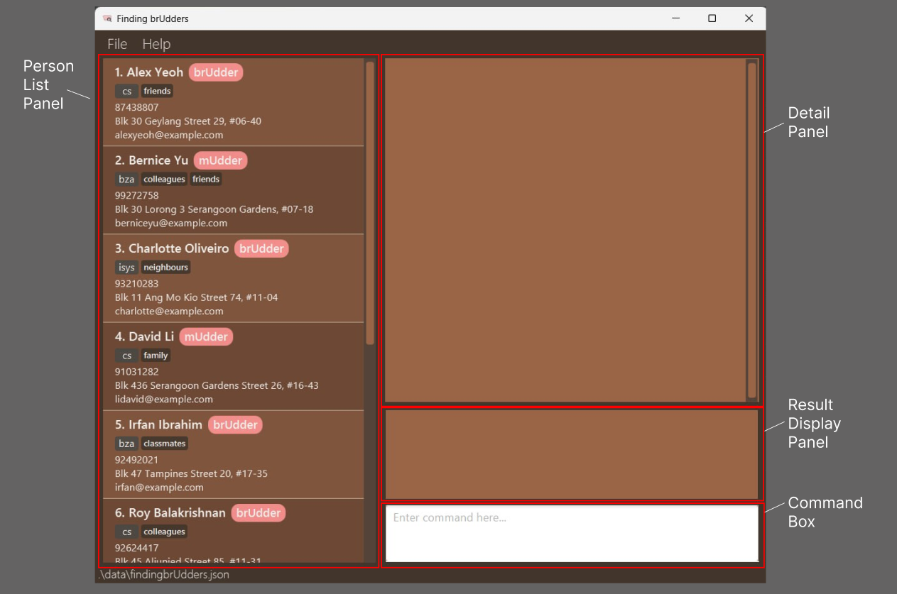

# FindingbrUdders Developer Guide

<!-- * Table of Contents -->
<page-nav-print />

--------------------------------------------------------------------------------------------------------------------

## **Acknowledgements**

### AI Assistance
Parts of the codebase were developed with the assistance of ChatGPT. The contributions from ChatGPT include:
* Assisting in enhancing test cases for AddCommand and EditCommand
* Assisting in enhancing tests for ClearCommand
* Extensive help on implementing DetailPanel UI Component
* LocalDateTime and DateTimeFormatter implementation for Meetings
* Suggesting how test cases can be designed for FindCommand, DeleteMeetingCommand, EditMeetingCommand, FindCommandParser,  DeleteMeetingCommandParser, and EditMeetingCommandParser
* Suggesting the usage of and helped with implementation of Observer pattern (i.e. SelectionListener and ModelClearObserver) for some UI components

--------------------------------------------------------------------------------------------------------------------

## **Setting up, getting started**

Refer to the guide [_Setting up and getting started_](https://ay2425s1-cs2103t-f08-3.github.io/tp/SettingUp.html).

--------------------------------------------------------------------------------------------------------------------

## **Design**

**Note:** In this section, we reference specific class names such as `Person`, `AddressBook`, and other terminology
that may differ from the terms used in other parts of this Developer Guide. The terms used here are intended
specifically for Design discussions and might not directly correspond to the broader terms used elsewhere in the documentation.
For clarification:
* `Person` is generally referred to as an Udder in most other sections of this guide.
* `AddressBook` refers to FindingbrUdders in other contexts within this guide.

### Architecture

<puml src="diagrams/ArchitectureDiagram.puml" width="280" />

The ***Architecture Diagram*** given above explains the high-level design of the App.

Given below is a quick overview of main components and how they interact with each other.

**Main components of the architecture**

**`Main`** (consisting of classes [`Main`](https://github.com/AY2425S1-CS2103T-F08-3/tp/blob/master/src/main/java/seedu/address/Main.java) and [`MainApp`](https://github.com/AY2425S1-CS2103T-F08-3/tp/blob/master/src/main/java/seedu/address/MainApp.java) is in charge of the app launch and shut down.
* At app launch, it initializes the other components in the correct sequence, and connects them up with each other.
* At shut down, it shuts down the other components and invokes cleanup methods where necessary.

The bulk of the app's work is done by the following four components:

* [**`UI`**](#ui-component): The UI of the App.
* [**`Logic`**](#logic-component): The command executor.
* [**`Model`**](#model-component): Holds the data of the App in memory.
* [**`Storage`**](#storage-component): Reads data from, and writes data to, the hard disk.

[**`Commons`**](#common-classes) represents a collection of classes used by multiple other components.

**How the architecture components interact with each other**

The *Sequence Diagram* below shows how the components interact with each other for the scenario where the user issues the command `delete 1`.

<puml src="diagrams/ArchitectureSequenceDiagram.puml" width="574" />

Each of the four main components (also shown in the diagram above),

* defines its *API* in an `interface` with the same name as the Component.
* implements its functionality using a concrete `{Component Name}Manager` class (which follows the corresponding API `interface` mentioned in the previous point.

For example, the `Logic` component defines its API in the `Logic.java` interface and implements its functionality using the `LogicManager.java` class which follows the `Logic` interface. Other components interact with a given component through its interface rather than the concrete class (reason: to prevent outside component's being coupled to the implementation of a component), as illustrated in the (partial) class diagram below.

<puml src="diagrams/ComponentManagers.puml" width="300" />

The sections below give more details of each component.

### UI component

The **API** of this component is specified in [`Ui.java`](https://github.com/AY2425S1-CS2103T-F08-3/tp/blob/master/src/main/java/seedu/address/ui/Ui.java)

<puml src="diagrams/UiClassDiagram.puml" alt="Structure of the UI Component"/>

The UI consists of a `MainWindow` that is made up of parts e.g.`CommandBox`, `ResultDisplay`, `PersonListPanel`, `DetailPanel`, `StatusBarFooter` etc. All these, including the `MainWindow`, inherit from the abstract `UiPart` class which captures the commonalities between classes that represent parts of the visible GUI.

The `UI` component uses the JavaFx UI framework. The layout of these UI parts are defined in matching `.fxml` files that are in the `src/main/resources/view` folder. For example, the layout of the [`MainWindow`](https://github.com/AY2425S1-CS2103T-F08-3/tp/blob/master/src/main/java/seedu/address/ui/MainWindow.java) is specified in [`MainWindow.fxml`](https://github.com/AY2425S1-CS2103T-F08-3/tp/blob/master/src/main/resources/view/MainWindow.fxml)

The `UI` component,

* executes user commands using the `Logic` component.
* listens for changes to `Model` data so that the UI can be updated with the modified data.
* keeps a reference to the `Logic` component, because the `UI` relies on the `Logic` to execute commands.
* depends on some classes in the `Model` component, as it displays `Person` object residing in the `Model`.

### Logic component

**API** : [`Logic.java`](https://github.com/AY2425S1-CS2103T-F08-3/tp/blob/master/src/main/java/seedu/address/logic/Logic.java)

Here's a (partial) class diagram of the `Logic` component:

<puml src="diagrams/LogicClassDiagram.puml" width="550"/>

The sequence diagram below illustrates the interactions within the `Logic` component, taking `execute("delete 1")` API call as an example.

<puml src="diagrams/DeleteSequenceDiagram.puml" alt="Interactions Inside the Logic Component for the `delete 1` Command" />

<box type="info" seamless>

**Note:** The lifeline for `DeleteCommandParser` should end at the destroy marker (X) but due to a limitation of PlantUML, the lifeline continues till the end of diagram.
</box>

How the `Logic` component works:

1. When `Logic` is called upon to execute a command, it is passed to an `AddressBookParser` object which in turn creates a parser that matches the command (e.g., `DeleteCommandParser`) and uses it to parse the command.
1. This results in a `Command` object (more precisely, an object of one of its subclasses e.g., `DeleteCommand`) which is executed by the `LogicManager`.
1. The command can communicate with the `Model` when it is executed, such as to delete a person (Udder). 
   Note that although this is shown as a single step in the diagram above (for simplicity), in the code it can take several interactions (between the command object and the `Model`) to achieve.
1. The result of the command execution is encapsulated as a `CommandResult` object which is returned back from `Logic`.

Here are the other classes in `Logic` (omitted from the class diagram above) that are used for parsing a user command:

<puml src="diagrams/ParserClasses.puml" width="600"/>

How the parsing works:
* When called upon to parse a user command, the `AddressBookParser` class creates an `XYZCommandParser` (`XYZ` is a placeholder for the specific command name e.g., `AddCommandParser`) which uses the other classes shown above to parse the user command and create a `XYZCommand` object (e.g., `AddCommand`) which the `AddressBookParser` returns back as a `Command` object.
* All `XYZCommandParser` classes (e.g., `AddCommandParser`, `DeleteCommandParser`, ...) inherit from the `Parser` interface so that they can be treated similarly where possible e.g, during testing.

### Model component
**API** : [`Model.java`](https://github.com/AY2425S1-CS2103T-F08-3/tp/blob/master/src/main/java/seedu/address/model/Model.java)

<puml src="diagrams/ModelClassDiagram.puml" width="450" />

The `Model` component,

* stores the address book data i.e., all `Person` objects (which are contained in a `UniquePersonList` object).
* stores the currently 'selected' `Person` objects (e.g., results of a search query) as a separate _filtered_ list which is exposed to outsiders as an unmodifiable `ObservableList<Person>` that can be 'observed' e.g. the UI can be bound to this list so that the UI automatically updates when the data in the list change.
* stores a `UserPref` object that represents the user’s preferences. This is exposed to the outside as a `ReadOnlyUserPref` objects.
* does not depend on any of the other three components (as the `Model` represents data entities of the domain, they should make sense on their own without depending on other components)

### Storage component

**API** : [`Storage.java`](https://github.com/AY2425S1-CS2103T-F08-3/tp/blob/master/src/main/java/seedu/address/storage/Storage.java)

<puml src="diagrams/StorageClassDiagram.puml" width="550" />

The `Storage` component,
* can save both address book data and user preference data in JSON format, and read them back into corresponding objects.
* inherits from both `AddressBookStorage` and `UserPrefStorage`, which means it can be treated as either one (if only the functionality of only one is needed).
* depends on some classes in the `Model` component (because the `Storage` component's job is to save/retrieve objects that belong to the `Model`)

### Common classes

Classes used by multiple components are in the `seedu.address.commons` package.

--------------------------------------------------------------------------------------------------------------------

## **Implementation**

This section describes some noteworthy details on how certain features are implemented.

**Note:** In this section, we reference specific class names such as `Person`, `AddressBook`, and other terminology
that may differ from the terms used in other parts of this Developer Guide. The terms used here are intended 
specifically for code implementation discussions and might not directly correspond to the broader terms used elsewhere in the documentation.
For clarification:
* `Person` is generally referred to as an Udder in most other sections of this guide.
* `AddressBook` refers to FindingbrUdders in other contexts within this guide. 

Please note that Udder and `Person` as well as FindingbrUdders and `AddressBook` <u>will be used interchangably</u> in this section to maintain consistency with the 
implementation-specific discussions. 

Additionally, for clarity regarding the UI components discussed in this section,
a screenshot of the user interface - partially labeled with component names - is included below:
 

### Add an Udder Feature

#### **Feature**

`add n/NAME p/PHONE_NUMBER e/EMAIL_ADDRESS a/ADDRESS r/ROLE m/MAJOR [t/TAG]`,
where tag is an optional field.

#### **Feature Purpose**

The `add` command allows users to add a `Person` to the `AddressBook`.

#### Key Components
- `AddCommand`: Executes the action of adding of a new Udder. It takes user input as parameters construct a `Person` object and add it to FindingbrUdders. 
- `AddCommandParser`: Parses user input to create an `AddCommand` object.
- `LogicManager`: Invokes the `AddCommand` to execute the adding of an Udder.
- `ModelManager`: Implements the `Model` interface and contains the internal list of persons (Udders).
- `Person`: Represents an Udder in FindingbrUdders, encapsulating their personal information.
- `AddressBookParser`: Creates an `AddCommand` object based on the user input.

### **Sequence of action**

To help you understand how the `add` command works, here is a list of steps illustrating what occurs when [`LogicManager#execute()` is invoked](#logic-component):

We will be using the user input `add n/John Doe p/98765432 e/johnd@example.com a/John street, block 123, #01-01 r/brUdder m/bza` as an example.

1. The user inputs the command `add n/John Doe p/98765432 e/johnd@example.com a/John street, block 123, #01-01 r/brUdder m/bza`, intending to add a `Person` with the specified details.
2. The `AddCommandParser` interprets the input.
3. An `AddCommand` object is created.
4. The `LogicManager` invokes the execute method of AddCommand.
5. The execute method of `AddCommand` invokes the `addPerson` method in `Model` property to create new contact with the new `Person` object.
6. The execute method of `AddCommand` returns a `CommandResult` object which stores the data regarding the completion of the `AddCommand`.
7. The UI reflects this new list with added `Person`.

:information_source: **Note**:

- At step 2, if the user does not have any arguments, an error will be shown on the screen and the `AddCommand` object will NOT be created!

---

### Delete an Udder Feature

#### **Feature**

`delete INDEX`

#### **Feature Purpose**

The `delete` command allows users to delete a `Person` from the `AddressBook`.

#### Key Components
- `DeleteCommand`: Executes the action of deleting an existing Udder based on user input. This command processes the input parameters to identify the `Person` object to be removed from FindingbrUdders.
- `AddCommandParser`: Parses user input to create a `DeleteCommand` object.
- `LogicManager`: Invokes the `DeleteCommand` to execute the deletion of an Udder.
- `ModelManager`: Implements the `Model` interface and contains the internal list of persons (Udders).
- `Person`: Represents an Udder in FindingbrUdders, encapsulating their personal information.
- `AddressBookParser`: Creates a `DeleteCommand` object based on the user input.

### **Sequence of action**

To help you understand how the `delete` command works, here is a list of steps illustrating what occurs when [`LogicManager#execute()` is invoked](#logic-component):

We will be using the user input `delete 1` as an example.

1. The user inputs the command `delete 1`, intending to delete a person (Udder) with index 1 in the contact list.
2. The `DeleteCommandParser` interprets the input.
3. A `DeleteCommand` object is created.
4. The `LogicManager` invokes the execute method of DeleteCommand.
5. The execute method of `DeleteCommand` invokes the `deletePerson` method in `Model` property to delete the specified `Person` object.
6. The execute method of `DeleteCommand` returns a `CommandResult` object which stores the data regarding the completion of the `DeleteCommand`.
7. The UI reflects this new list without the deleted `Person`.

:information_source: **Note**:

- At step 2, if input is detected as invalid, an error will be shown on the screen and the `DeleteCommand` object will NOT be created!

---
### Edit an Udder Feature

#### **Feature**

`edit INDEX [n/NAME] [p/PHONE NUMBER] [e/EMAIL ADDRESS] [a/ADDRESS] [r/ROLE] [m/MAJOR] [t/TAG]`,
where INDEX is required and at least one of the optional fields (such as name, address, or any other listed field) must also be specified.

#### **Feature Purpose**

The `edit` command allows users to edit the details of an existing `Person` in the `AddressBook`. 

#### Key Components
- `EditCommand`: Executes the action of editing an existing Udder based on user input. This command processes the input parameters to update the `Person` object's details within FindingbrUdders.
- `EditCommandParser`: Parses user input to create an `EditCommand` object.
- `LogicManager`: Invokes the `EditCommand` to execute the editing of an Udder.
- `ModelManager`: Implements the `Model` interface and contains the internal list of persons (Udders).
- `Person`: Represents an Udder in FindingbrUdders, encapsulating their personal information.
- `AddressBookParser`: Creates an `EditCommand` object based on the user input.

### **Sequence of action**

To help you understand how the `edit` command works, here is a list of steps illustrating what occurs when [`LogicManager#execute()` is invoked](#logic-component):

We will be using the user input `edit 1 n/John Doe p/98765432 e/johnd@example.com a/123 Main St r/brUdder m/bza` as an example, whereby the original `Person` object has an address of `John street, block 123, #01-01`.

1. The user executes the command `edit 1 n/John Doe p/98765432 e/johnd@example.com a/123 Main St r/brUdder m/bza`, intending to edit the details of the person (Udder) at index 1.
2. The `EditCommandParser` interprets the input.
3. An `EditCommand` object is created.
4. The `LogicManager` invokes the execute method of `EditCommand`.
5. The execute method of `EditCommand` invokes the `setPerson` method in the `Model` to update the details of the existing `Person` object with the new values.
6. The execute method of `EditCommand` returns a `CommandResult` object which stores the data regarding the completion of the `EditCommand`.
7. The UI reflects this updated list with the edited `Person`.

:information_source: **Note**:

- At step 2, if the input is detected as invalid (either index is invalid or no arguments provided other than index), an error will be shown on the screen and the `EditCommand` object will NOT be created!.

---

### Schedule Meeting with an Udder Feature

#### **Feature**

`schedule UDDER_INDEX st/DD-MM-YYYY HH:MM et/DD-MM-YYYY HH:MM l/LOCATION`

#### **Feature Purpose**

The `schedule` command adds a `Meeting` to the `AddressBook` and the `Person` we scheduled a meeting with.

#### Key Components
- `ScheduleCommand`: Executes the creation of a `Meeting` and adds it to both the `AddressBook` and the `Person`'s `Meetings`. It takes user input as parameters to construct a `Meeting` object linked to a specified `Person`.
- `ScheduleCommandParser`: Parses user input to create a `ScheduleCommand` object.
- `LogicManager`: Invokes the `ScheduleCommand` to execute the scheduling operations.
- `ModelManager`: Implements the `Model` interface and contains the internal list of persons (Udders) and meetings.
- `Person`: Represents an Udder in FindingbrUdders and all information attached to it.
- `Index`: Represents the index that refers to the target Udder of the `Meeting` to be created.
- `Meeting`: Represents a scheduled meeting, containing details such as participants, location, start time, and end time.
- `Meetings`: Represents an ArrayList that contains `Meeting` objects.
- `AddressBookParser`: Creates a `ScheduleCommand` object based on the user input.

### **Sequence of action**

To help you understand how the `schedule` command works, here is a list of steps illustrating what occurs when [`LogicManager#execute()` is invoked](#logic-component):

We will be using the user input `schedule 1 l/The Terrace st/09-10-2024 09:00 et/09-10-2024 10:00` as an example.

1. The user inputs the command `schedule 1 l/The Terrace st/09-10-2024 09:00 et/09-10-2024 10:00`, intending to create a meeting with the `Person` at index 1 with the given details.
2. The `ScheduleCommandParser` interprets the input.
3. A `ScheduleCommand` object is created.
4. The `LogicManager` invokes the execute method of `ScheduleCommand`.
5. The execute method of `ScheduleCommand` identifies the `Person` associated with the given `Index`.
6. The execute method of `ScheduleCommand` creates a new `Meeting` object with the information provided.
7. The execute method of `ScheduleCommand` invokes the `addMeeting` method in `Model` to add the `Meeting` object to the `Meetings` in the `AddressBook` and the `Person` found earlier.
8. The execute method of `ScheduleCommand` returns a `CommandResult` object which stores the data regarding the completion of the `ScheduleCommand`.
9. The UI updates to reflect this newly scheduled `Meeting`.

:information_source: **Note**:

- At step 2, if any arguments are missing, an error will be shown on the screen and the `ScheduleCommand` object will NOT be created!

---

### Delete Meeting with an Udder Feature

#### Feature
`deletem INDEX` where `INDEX` is the index of the meeting to be deleted.

#### Feature Purpose
The `deletem` command allows users to delete an existing `Meeting` from the `AddressBook`, impacting the schedule of the `Person` associated with the meeting.

#### Key Components
- `DeleteMeetingCommand`: Executes the deletion of a `Meeting` from both the `AddressBook` and the `Person`'s `Meetings` based on the user's input.
- `DeleteMeetingCommandParser`: Parses user input to create a `DeleteMeetingCommand` object.
- `LogicManager`: Invokes the `DeleteMeetingCommand` to execute the deletion operation.
- `ModelManager`: Implements the `Model` interface and contains the internal list of persons (Udders) and meetings.
- `Person`: Represents an Udder in FindingbrUdders, encapsulating their personal information including scheduled meetings.
- `Index`: Represents the index that refers to the target Udder of the `Meeting` to be created.
- `Meeting`: Represents a scheduled meeting, containing details such as participants, location, start time, and end time.
- `Meetings`: Represents an ArrayList that contains `Meeting` objects.
- `AddressBookParser`: Creates a `DeleteMeetingCommand` object based on the user input.

### Sequence of Action
To understand how the `deletem` command works, here is a list of steps illustrating what occurs when `LogicManager#execute()` is invoked:

We will be using the user input `deletem 1` as an example.

1. The user inputs the command `deletem 1`, intending to delete the meeting at index `1`.
2. The `DeleteMeetingCommandParser` interprets the input.
3. A `DeleteMeetingCommand` object is created.
4. The `LogicManager` invokes the `execute` method of `DeleteMeetingCommand`.
5. The `execute` method of `DeleteMeetingCommand` retrieves the existing `Meeting` object to be deleted from the `AddressBook` by `Index`.
6. The `execute` method of `DeleteMeetingCommand` finds the `Person` object associated with the meeting being deleted.
7. The `execute` method of `DeleteMeetingCommand` removes the `Meeting` from the `Meetings` in the `AddressBook` and the `Person` object found earlier.
8. The `execute` method of `DeleteMeetingCommand` returns a `CommandResult` object which stores the data regarding the completion of the `DeleteMeetingCommand`.
9. The UI updates to reflect this updated list of meetings in the DetailPanel of the Udder if the affected `Person` is being displayed.

:information_source: **Note**:

- At step 2, if any arguments are missing, an error will be shown on the screen and the `DeleteMeetingCommand` object will NOT be created!

---

### Edit Meeting with an Udder Feature

#### Command Feature
`editm INDEX [n/NAME] [l/LOCATION] [st/START_TIME] [et/END_TIME]` where at least one optional field should be present.

#### Command Feature Purpose
The `editm` command allows users to edit the details of an existing `Meeting` in the `AddressBook`. The existing values will be overwritten by any given input values.

#### Key Components
- `EditMeetingCommand`: Executes the operation of editing a meeting based on the user's input. It updates the details of a Meeting object within the `AddressBook` and the `Person`'s `Meetings`.
- `EditMeetingCommandParser`: Parses user input to create an `EditMeetingCommand` object.
- `LogicManager`: Invokes the `EditMeetingCommand` to execute the editing operation.
- `ModelManager`: Implements the `Model` interface and manages the internal list of persons (Udders) and meetings.
- `Index`: Represents the index that refers to the target Udder of the `Meeting` to be created.
- `Meeting`: Represents a scheduled meeting, containing details such as participants, location, start time, and end time.
- `Meetings`: Represents an ArrayList that contains `Meeting` objects.
- `AddressBookParser`: Creates an `EditMeetingCommand` object based on the user input.

### Sequence of Action
To understand how the `editm` command works, here is a list of steps illustrating what occurs when `LogicManager#execute()` is invoked:

We will be using the user input `editm 1 l/Discussion Room 3 st/09-10-2024 13:00 et/09-10-2024 14:00` as an example.

1. The user inputs the command `editm 1 l/Discussion Room 3 st/09-10-2024 13:00 et/09-10-2024 14:00`, aiming to edit the details of the meeting at index `1` with the specified details.
2. The `EditMeetingCommandParser` interprets the input.
3. An `EditMeetingCommand` object is created.
4. The `LogicManager` invokes the `execute` method of `EditMeetingCommand`.
5. The `execute` method of `EditMeetingCommand` retrieves the existing `Meeting` object to be edited from the `AddressBook` by `Index`.
6. If the edited meeting has a new name, the `execute` method of `EditMeetingCommand` deletes the meeting being edited and creates a new `Meeting` object with the updated details.
7. If the edited meeting has the same name, the `execute` method of `EditMeetingCommand` updates the existing `Meeting` object which already exists in the `Meetings` of the `AddressBook`.
8. The `execute` method of `EditMeetingCommand` returns a `CommandResult` object which stores the data regarding the completion of the `EditMeetingCommand`.
9. The UI updates to display the revised list of meetings in the DetailPanel of the Udder if the associated `Person` is currently displayed.

:information_source: **Note**: 

- At step 2, if any arguments are missing, an error will be shown on the screen and the `EditMeetingCommand` object will NOT be created!

``

--------------------------------------------------------------------------------------------------------------------

## **Documentation, logging, testing, configuration, dev-ops**

* [Documentation guide](Documentation.md)
* [Testing guide](Testing.md)
* [Logging guide](Logging.md)
* [Configuration guide](Configuration.md)
* [DevOps guide](DevOps.md)

--------------------------------------------------------------------------------------------------------------------

## **Appendix: Requirements**

### Product scope

**Target user profile**:

* A sociable member of NUS School of Computing, known as an Udder, who values personal connections and seeks to cultivate relationships with peers and mentors.
* Comprises brUdders (students seeking guidance or wishing to mentor peers) and mUdders (experienced mentors within the computing field).
* Prefers desktop applications for managing contacts and is comfortable using CLI apps for efficient navigation and functionality.

**Value proposition**:  
Has the academic challenge of CS at NUS become overwhelming? Are you looking for more authentic connections beyond Talent Connect, LinkedIn, or even NUSConfessIT? 
Introducing FindingbrUdders—your go-to desktop application crafted specifically for students at the School of Computing (SoC). With FindingbrUdders, managing your contacts and scheduling meetings is seamless, ensuring you never lose track of the invaluable connections you make throughout your university journey. 
Whether you're adding new Udders you meet, updating contact details, or organizing meetings with fellow brUdders and mUdders, our user-friendly Command Line Interface (CLI) makes navigation a breeze. Let FindingbrUdders help you transform stressful networking into meaningful relationships with ease and efficiency!

 

### User stories

**Priorities:**
- High (must have) - `* * *`
- Medium (nice to have) - `* *`
- Low (unlikely to have) - `*`

| Priority | As a…​                        | I want to…​                      | So that I can…​                                                         |
|----------|-------------------------------|----------------------------------|-------------------------------------------------------------------------|
| `* * *`  | Udder                         | add a new contact                |                                                                         |
| `* * *`  | Udder                         | edit an existing contact         | update the added contact with new information                           |
| `* * *`  | lonely brUdder who seeks help | schedule a meeting               | remind myself of future meetings with another contact                   |
| `* * *`  | curious Udder                 | view the details of a contact    | learn more about the contacts abilities                                 |
| `* * *`  | Udder                         | list all contacts                |                                                                         |
| `* * *`  | Udder                         | list all meetings with a contact |                                                                         |
| `* * *`  | Udder                         | delete a contact                 | remove contacts that I no longer need                                   |
| `* * *`  | Udder                         | filter through my contacts       | locate details of an Udder without having to go through the entire list |
| `* *`    | new Udder                     | get help                         | refer to instructions when I forget how to use the App                  |
| `* *`    | Udder                         | edit details of a meeting        | update the meeting with new information                                 |
| `* *`    | Udder                         | delete a meeting                 | remove meetings that no longer exists                                   |
| `*`      | Udder                         | favourite some of my contacts    | find my favourite contacts in an instant                                |
| `*`      | Udder                         | unfavourite some of my contacts  | remove them from my favourites list                                     |

**Update Note:** As of `v1.6` of FindingbrUdders, features with priority label `*` are **not** implemented.

 

### Use cases

For all use cases below, 
**System** is the `FindingbrUdders` application
**Actor** is the `Udder` user using the application

 

**UC01: Add an Udder**

**MSS**

1. The user requests to add a new Udder by specifying necessary details (e.g., name, phone, email, and other contact information).
2. FindingbrUdders validates the provided information.
3. FindingbrUdders adds the new Udder to the system and confirms the addition to the user.
4. FindingbrUdders displays the updated list of Udders with the newly added Udder.

   Use case ends.

**Extensions**

* 2a. The user provides incomplete or invalid details.

    * 2a1. FindingbrUdders shows an error message indicating that the command format is invalid.
    * 2a2. Use case resumes at step 1.

      Use case resumes at step 2.

 

**UC02: Delete an Udder**

**MSS**

1. The user <u>lists all Udders</u>.
2. The user requests to delete a specific Udder from the list.
3. FindingbrUdders deletes the Udder and displays the new Udder list.

    Use case ends.

**Extensions**

* 2a. The given index is invalid.

    * 2a1. FindingbrUdders shows an error message.

      Use case resumes at step 2.

 

**UC03: Schedule a meeting with a specific Udder**

**MSS**

1. The user <u>lists all Udders</u>.
2. The user requests to schedule a meeting with a specific Udder from the list using the index, start and end date, and location.
3. FindingbrUdders creates the meeting with the Udder.

    Use case ends.

**Extensions**

* 2a. The given index is invalid.

    * 2a1. FindingbrUdders shows an error message.

      Use case resumes at step 2.

* 2b. The date/time clashes with another meeting.

    * 2b1. FindingbrUdders shows a error message.

      Use case resumes at step 2.
  
* 2c. The meeting end date/time is earlier than the meeting start date/time.

    * 2c1. FindingbrUdders shows a error message.
  
      Use case resumes at step 2.

 

**UC04: View details of a specific Udder**

**MSS**

1. FindingbrUdders shows the list of contacts either by default, by <u>list request</u>, or after a <u>find request</u>.
2. User clicks the Udder in the Udder list panel.
3. FindingbrUdders displays the details in the details panel.

    Use case ends.

 

**UC05: Find Udders**

**MSS**

1. The user requests to find the Udders using the specified search parameters.
2. FindingbrUdders displays the list of Udders that match the search parameters.

    Use case ends.

 

**UC06: List all Udders**

**MSS**

1. The user requests to list all Udders.
2. FindingbrUdders displays the list of all Udders.

   Use case ends.

 

**UC07: List all meetings**

**MSS**

1. The user requests to list all meetings.
2. FindingbrUdders displays the list of all meetings in the command result panel.

   Use case ends.

 

**UC08: Delete a meeting**

**MSS**

1. The user requests to <u>list meetings</u>.
2. The user requests to delete a specific meeting from the meetings list using the index.
3. FindingbrUdders deletes the meeting.

   Use case ends.

**Extensions**

* 2a. The given index is invalid.

    * 2a1. FindingbrUdders shows an error message.

      Use case resumes at step 2.

 

**UC09: Edit a meeting**

**MSS**

1. The user requests to <u>list meetings</u>.
2. The user requests to edit a specific meeting using the index, with various optional parameters.
3. FindingbrUdders updates the meeting.

   Use case ends.

**Extensions**

* 2a. The given index is invalid.

    * 2a1. FindingbrUdders shows an error message.

      Use case resumes at step 2.

* 2b. The date/time clashes with another meeting.

    * 2b1. FindingbrUdders shows a error message.

      Use case resumes at step 2.

 

### Non-Functional Requirements

1.  Should work on any _mainstream OS_ as long as it has Java `17` or above installed.
2.  Should be able to hold up to 1000 contacts without a noticeable sluggishness in performance for typical usage.
3.  An Udder with above average typing speed for regular English text (i.e. not code, not system admin commands) should be able to accomplish most of the tasks faster using commands than using the mouse.
4.  The app should not feel awkward when switching between clicking the screens and typing commands.

### Glossary

* **Mainstream OS**: Commonly used Operating Systems which include Windows, Linux, Unix, MacOS
* **Private contact detail**: A contact detail that is not meant to be shared with others.
* **Favorites list:** A curated list within the application where users can store their favorite contacts for quicker and easier access.
 

* **Users**:
  - **Udder:** Refers to any type of user described below, which is either a mUdder or a brUdder.
  - **mUdder:** Mentor users or connections who are more experienced in a relevant field.
  - **brUdder:** Peers or connections who are experiencing similar things as you.
--------------------------------------------------------------------------------------------------------------------

## **Appendix: Instructions for manual testing**

Given below are instructions to test the app manually.

<box type="info" seamless>

**Note:** These instructions only provide a starting point for testers to work on;
testers are expected to do more *exploratory* testing.

</box>

### Launch and shutdown

1. Initial launch

   1. Download the jar file and copy into an empty folder

   2. Double-click the jar file Expected: Shows the GUI with a set of sample udders. The window size may not be optimum.

2. Saving window preferences

   1. Resize the window to an optimum size. Move the window to a different location. Close the window.

   2. Re-launch the app by double-clicking the jar file. 
       Expected: The most recent window size and location is retained.

### Adding an Udder

1. Add an Udder to the app

    1. Test case: `add n/John Doe p/98765432 e/johnd@example.com a/John street, block 123, #01-01 r/brUdder m/bza` 
       Expected: New Udder created. Details of the Udder are shown in the Result Display Panel.

    2. Test case: `add n/ p/98765432 e/johnd@example.com a/John street, block 123, #01-01 r/brUdder m/bza` 
       Expected: An error mentioning an invalid entry for a name will show in the Result Display Panel.

    3. Other incorrect add commands to try: `add`, `add John Doe`, `add n/John Doe`, `...` 
       Expected: Similar to previous.

### Clearing all Udders

1. Clearing a list of Udders from the app

    1. Prerequisites: List all Udders using the `list` command. There should be multiple Udders in the list to perceive the full intended behaviour.

    2. Test case: `clear` 
       Expected: A message stating that the app has been cleared shown in Result Display Panel.

    3. Test case: `cler` 
       Expected: List of Udders is not cleared. Error details of an unrecognised command shown in the Result Display Panel.

### Deleting an Udder

1. Deleting an Udder while all Udders are being shown

    1. Prerequisites: List all Udders using the `list` command. Multiple Udders in the list.

    2. Test case: `delete 1` 
       Expected: First Udder is deleted from the list. Details of the deleted Udder shown in the Result Display Panel.

    3. Test case: `delete 0` 
       Expected: No Udder is deleted. Error details shown in the status message.

    4. Other incorrect delete commands to try: `delete`, `delete x`, `...` (where x is larger than the list size) 
       Expected: Similar to previous.

### Editing an Udder

1. Editing an Udder shown in the list

   1. Prerequisites: List all Udders using the `list` command. Multiple Udders in the list.

   2. Test case: `edit 1 p/91234567 e/johndoe@example.com` 
      Expected: First Udder is edited. New details of the edited Udder shown in the Result Display Panel.

   3. Test case: `edit 0 p/91234567 e/johndoe@example.com` 
      Expected: No Udder is edited. Error details shown in the Result Display Panel.

   4. Test case: `edit 1 p/00 e/johndoe@example.com` 
      Expected: No Udder is edited. Error details regarding the phone number shown in the Result Display Panel.

   5. Other incorrect edit commands to try: `edit`, `edit x`, `...` (where x is larger than the list size) 
      Expected: Similar to previous.

### Finding an Udder

1. Finding an Udder from an unfiltered list of Udders

    1. Prerequisites: List all Udders using the `list` command. Multiple Udders in the list.

    2. Test case: `find n/John` 
       Expected: All Udders that contain the word "John" in the name is listed in the Person List Panel.

    3. Test case: `find John` 
       Expected: No filtering is done. Error details shown in the Result Display Panel.

    4. Other incorrect delete commands to try: `find`, `find p/`, `...` 
       Expected: Similar to previous.

### Listing all Udders

1. Listing all Udders from a filtered list of Udders

    1. Prerequisites: Filter Udders using `find n/John`. There exists other Udders filtered out.

    2. Test case: `list` 
       Expected: All Udders are listed in the Person List Panel.

    3. Test case: `lst` 
       Expected: Filter will remain. Error details of an unrecognised command shown in the Result Display Panel.

### Scheduling a Meeting

1. Scheduling a meeting with an Udder shown in the list

    1. Prerequisites: List all Udders using the `list` command.

    2. Test case: `schedule 1 st/09-10-2024 09:00 et/09-10-2024 10:00 l/The Terrace` 
       Expected: New meeting created with the first Udder from the list. Details of the meeting shown in the Result Display Panel.

    3. Test case: `schedule 0 st/09-10-2024 09:00 et/09-10-2024 10:00 l/The Terrace` 
       Expected: No meeting is created. Error details shown in the Result Display Panel.

    4. Other incorrect schedule commands to try: `schedule`, `schedule 1 l/The Terrace`, `...` 
       Expected: Similar to previous.

### Listing all Meetings

1. Listing all meetings previously created

    1. Prerequisites: There is at least one meeting with an existing Udder.

   2. Test case: `meetings` 
      Expected: All meetings are listed in the Result Display Panel.

   3. Test case: `meets` 
      Expected: No meetings are listed. Error details of an unrecognised command is shown in the Result Display Panel.

### Deleting a Meeting

1. Deleting an meeting while all meetings are being shown

    1. Prerequisites: List all meetings using the `meetings` command. Multiple meetings in the list.

    2. Test case: `deletem 1` 
       Expected: First meeting is deleted from the list. Details of the deleted meeting shown in the Result Display Panel.

    3. Test case: `deletem 0` 
       Expected: No meeting is deleted. Error details shown in the Result Display Panel.

    4. Other incorrect deletem commands to try: `deletem`, `deletem x`, `...` (where x is larger than the list size) 
       Expected: Similar to previous.

### Editing a Meeting

1. Editing a meeting while all meetings are being shown

    1. Prerequisites: List all meetings using the `meetings` command. Multiple Udders in the list.

    2. Test case: `editm 1 st/09-10-2024 10:00` 
       Expected: First meeting is edited. New details of the edited meeting shown in the Result Display Panel.

    3. Test case: `editm 0 st/09-10-2024 10:00` 
       Expected: No meeting is edited. Error details shown in the Result Display Panel.

    4. Test case: `editm 1 st/` 
       Expected: No meeting is edited. Error details regarding the start time format shown in the Result Display Panel.

    5. Other incorrect editm commands to try: `editm`, `editm x`, `...` (where x is larger than the list size) 
       Expected: Similar to previous.

---

## **Appendix: Planned Enhancements**

**Team size:** 5

1. **Command Consistency Improvements:**
    * Standardize the behavior of the `delete` command to reset the Person List Panel post-execution, aligning with the current behavior of `add` and `edit` commands. This change will improve user experience by providing consistent feedback and list visibility.
2. **Email Validation Enhancement:**
    * Refine the email validity checks to include verification of the domain, ensuring that the email not only contains an '@' symbol followed by any alphanumeric characters, but also follows a valid format with a recognized domain. This enhancement aims to reduce incorrect/invalid email entries and improve data integrity.
3. **Email Search Logic Enhancement:**
    * Revamp the find functionality for the email field to accommodate searches without the typical formatting of a valid email address, thus broadening the search capabilities.
4. **Duplicate Handling Improvements:**
    * Revamp the duplicate detection logic to identify duplicates based on phone numbers and email addresses, ignoring whitespace variations. 
    * Names will no longer be considered for duplicate checks due to the possibility of multiple individuals sharing the same name, thus mimicking real-world scenarios more accurately.
5. **Cross-Platform UI Consistency:**
    * Implement font packaging within the software to ensure UI consistency across different operating systems, particularly addressing layout issues on MacOS caused by missing font styles.
6. **Detail Panel Behavior Correction:**
    * Adjust the behavior of the Detail Panel to clear its contents when the last Udder in the Person List Panel is deleted, ensuring that no outdated information remains visible, thereby preventing user confusion.
7. **UI Layout Improvements:**
    * Allow the meeting list to be displayed in the Detail Panel instead of the Result Display Panel for enhanced readability.
    * Provide options for users to choose which panel (Detail or Person List Panel) to expand, instead of defaulting to expanding only the Person List Panel.
    * Increase the size of the Result Display Panel for improved user interaction and readability.
8. **Enhanced Tag Management:**
    * Improve the management and display of role tags in the Person List Panel to ensure they are not truncated or hidden, regardless of the length of the Udder's name. This will enhance visibility and accessibility of important categorizations within the user interface.
9. **Meeting Deletion Streamlining:**
    * Streamline the meeting deletion process (`deletem`) by allowing the Detail Panel to display the meetings list, facilitating easier and faster batch deletions without needing to repeatedly execute the meetings command to refresh the index.
10. **Meeting Date Validation:**
    * Change the validation logic for meeting dates to prevent the system from auto-correcting invalid dates to the nearest valid ones, which is the cause for our current app version's inconsistent behavior in its meeting date validation. 
    * After the enhancement, if an entered date is invalid, the system will prompt an error, requiring the user to correct the input. 
