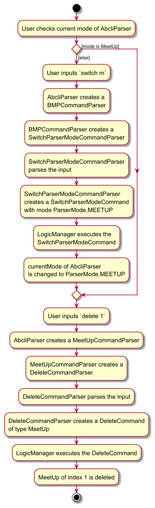

* Table of Contents
  {:toc}

--------------------------------------------------------------------------------------------------------------------

## **Acknowledgements**

* {list here sources of all reused/adapted ideas, code, documentation, and third-party libraries -- include links to the
  original source as well}

--------------------------------------------------------------------------------------------------------------------

## **Setting up, getting started**

Refer to the guide [_Setting up and getting started_](SettingUp.md).

--------------------------------------------------------------------------------------------------------------------

## **Design**

:bulb: **Tip:** The `.puml` files used to create diagrams in this document `docs/diagrams` folder. Refer to the [
_PlantUML Tutorial_ at se-edu/guides](https://se-education.org/guides/tutorials/plantUml.html) to learn how to create
and edit diagrams.

### Architecture

The ***Architecture Diagram*** given above explains the high-level design of the App.

Given below is a quick overview of main components and how they interact with each other.

**Main components of the architecture**

**`Main`** (consisting of
classes [`Main`](https://github.com/se-edu/addressbook-level3/tree/master/src/main/java/seedu/budget/Main.java)
and [`MainApp`](https://github.com/se-edu/addressbook-level3/tree/master/src/main/java/seedu/budget/MainApp.java)) is in
charge of the app launch and shut down.

* At app launch, it initializes the other components in the correct sequence, and connects them up with each other.
* At shut down, it shuts down the other components and invokes cleanup methods where necessary.

The bulk of the app's work is done by the following four components:

* [**`UI`**](#ui-component): The UI of the App.
* [**`Logic`**](#logic-component): The command executor.
* [**`Model`**](#model-component): Holds the data of the App in memory.
* [**`Storage`**](#storage-component): Reads data from, and writes data to, the hard disk.

[**`Commons`**](#common-classes) represents a collection of classes used by multiple other components.

**How the architecture components interact with each other**

The *Sequence Diagram* below shows how the components interact with each other for the scenario where the user issues
the command `delete 1`.

Each of the four main components (also shown in the diagram above),

* defines its *API* in an `interface` with the same name as the Component.
* implements its functionality using a concrete `{Component Name}Manager` class (which follows the corresponding
  API `interface` mentioned in the previous point.

For example, the `Logic` component defines its API in the `Logic.java` interface and implements its functionality using
the `LogicManager.java` class which follows the `Logic` interface. Other components interact with a given component
through its interface rather than the concrete class (reason: to prevent outside component's being coupled to the
implementation of a component), as illustrated in the (partial) class diagram below.

The sections below give more details of each component.

### UI component

The **API** of this component is specified
in [`Ui.java`](https://github.com/se-edu/addressbook-level3/tree/master/src/main/java/seedu/budget/ui/Ui.java)

The UI consists of a `MainWindow` that is made up of parts
e.g.`CommandBox`, `ResultDisplay`, `BuyerListPanel`, `StatusBarFooter` etc. All these, including the `MainWindow`,
inherit from the abstract `UiPart` class which captures the commonalities between classes that represent parts of the
visible GUI.

The `UI` component uses the JavaFx UI framework. The layout of these UI parts are defined in matching `.fxml` files that
are in the `src/main/resources/view` folder. For example, the layout of
the [`MainWindow`](https://github.com/se-edu/addressbook-level3/tree/master/src/main/java/seedu/budget/ui/MainWindow.java)
is specified
in [`MainWindow.fxml`](https://github.com/se-edu/addressbook-level3/tree/master/src/main/resources/view/MainWindow.fxml)

The `UI` component,

* executes user commands using the `Logic` component.
* listens for changes to `Model` data so that the UI can be updated with the modified data.
* keeps a reference to the `Logic` component, because the `UI` relies on the `Logic` to execute commands.
* depends on some classes in the `Model` component, as it displays `Buyer` object residing in the `Model`.

### Logic component

**API
** : [`Logic.java`](https://github.com/se-edu/addressbook-level3/tree/master/src/main/java/seedu/budget/logic/Logic.java)

Here's a (partial) class diagram of the `Logic` component:

The sequence diagram below illustrates the interactions within the `Logic` component, taking `execute("delete 1")` API
call as an example.

:information_source: **Note:** The lifeline for `DeleteCommandParser` should end at the destroy marker (X) but due to a limitation of PlantUML, the lifeline continues till the end of diagram.

How the `Logic` component works:

1. When `Logic` is called upon to execute a command, it is passed to the `AbcliParser` class.
2. The `AbcliParser` class then creates either a `BuyerCommandParser`, `MeetUpCommandParser`, or `PropertyCommandParser` according to its `currentMode`.
3. The created CommandParser then creates another parser that matches the command (e.g., `DeleteCommandParser`) and uses it to parse the command. The type of parser created here is dependent on the CommandParser created in step 2, e.g. a `MeetUpCommandParser` will create a `DeleteCommandParser` for the `MeetUp` class, while a `BuyerCommandParser` will create a `DeleteCommandParser` for the `Buyer` class.
4. This results in a `Command` object (more precisely, an object of one of its subclasses e.g., `DeleteCommand`) which is executed by the `LogicManager`.
5. The command can communicate with the `Model` when it is executed (e.g. to delete a buyer). 
   Note that although this is shown as a single step in the diagram above (for simplicity), in the code it can take several interactions (between the command object and the `Model`) to achieve.
6. The result of the command execution is encapsulated as a `CommandResult` object which is returned back from `Logic`.

Here are the other classes in `Logic` (omitted from the class diagram above) that are used for parsing a user command:

How the parsing works:
* When called upon to parse a user command, the `AbcliParser` class creates a `BMPCommandParser` (`BMP` is a placeholder for the different mode of parsers, either a `BuyerCommandParser`, `MeetUpCommandParser`, or `PropertyCommandParser`). The created BMPCommandParser then creates an `XYZCommandParser` (`XYZ` is a placeholder for the specific command name e.g., `AddCommandParser`) which uses the other classes shown above to parse the user command and create an `XYZCommand` object (e.g., `AddCommand`) which the `AbcliParser` returns back as a `Command` object.
* All `XYZCommandParser` classes (e.g., `AddCommandParser`, `DeleteCommandParser`, ...) inherit from the `Parser` interface so that they can be treated similarly where possible e.g. during testing.
* All `BMPCommandParser` classes (`BuyerCommandParser`, `MeetUpCommandParser`, and `PropertyCommandParser`) extends the `CommandParser` class so that all of them have access to general commands e.g. `HelpCommand`, ...

### Model component

**API
** : [`Model.java`](https://github.com/se-edu/addressbook-level3/tree/master/src/main/java/seedu/budget/model/Model.java)

The `Model` component,

* stores the buyer list data i.e., all `Buyer` objects (which are contained in a `UniqueBuyerList` object).
* stores the currently 'selected' `Buyer` objects (e.g., results of a search query) as a separate _filtered_ list which
  is exposed to outsiders as an unmodifiable `ObservableList<Buyer>` that can be 'observed' e.g. the UI can be bound to
  this list so that the UI automatically updates when the data in the list change.
* stores a `UserPref` object that represents the user’s preferences. This is exposed to the outside as
  a `ReadOnlyUserPref` objects.
* does not depend on any of the other three components (as the `Model` represents data entities of the domain, they
  should make sense on their own without depending on other components)

:information_source: **Note:** An alternative (arguably, a more OOP) model is given below. It has a `Tag` list in the `BuyerList`, which `Buyer` references. This allows `BuyerList` to only require one `Tag` object per unique tag, instead of each `Buyer` needing their own `Tag` objects. 

### Storage component

**API
** : [`Storage.java`](https://github.com/se-edu/addressbook-level3/tree/master/src/main/java/seedu/budget/storage/Storage.java)

The `Storage` component,

* can save buyer list data, meetup list data, property list data, and user preference data in JSON format, and read them back into corresponding objects.
* inherits from both `BuyerListStorage`, `MeetUpListStorage`, `PropertyListStorage`, and `UserPrefStorage`, which means it can be treated as either of them (if only the
  functionality of only one is needed).
* depends on some classes in the `Model` component (because the `Storage` component's job is to save/retrieve objects
  that belong to the `Model`)

### Common classes

Classes used by multiple components are in the `seedu.budget.commons` package.

--------------------------------------------------------------------------------------------------------------------

## **Implementation**

This section describes some noteworthy details on how certain features are implemented.

### Parser Mode Switching

#### Implementation

User inputs are parsed through `AbcliParser` to create executable `Command` objects. The parsing done by `AbcliParser` is determined by its mode of parsing, which is either the Buyer mode, MeetUp mode, or Property mode. For example, in the Buyer mode, AbcliParser will create a `BuyerCommandParser` object to parse the input, and create a command that is of type `Buyer`.

The mode of `AbcliParser` can be switched by executing a `SwitchParserModeCommand`. An example of switching to the MeetUp mode:
1. User inputs `switch m`, which is then passed to the `AbcliParser` class.
2. The `AbcliParser` class then creates either a `BuyerCommandParser`, `MeetUpCommandParser`, or `PropertyCommandParser` according to its `currentMode`. (The default current mode is set to Buyer mode, and the type of `CommandParser` created here doesn't matter since all of them handle `SwitchParserModeCommand` the same way).
3. The created CommandParser then creates a `SwitchParserModeCommandParser` and uses it to parse the command.
4. This results in a `SwitchParserModeCommand` with the mode `ParserMode.MEETUP` which is executed by the `LogicManager`.
5. The `SwitchParserModeCommand` then switches the `currentMode` of `AbcliParser` to `ParserMode.MEETUP` when executed. The `currentMode` will affect the type of `CommandParser` that will be created for future parses (in step 2).
6. The result of the command execution is encapsulated as a `CommandResult` object which is returned back from `Logic`.

The diagram below shows the activity diagram for a user wanting to delete the first `MeetUp` in his `MeetUpList`:

--------------------------------------------------------------------------------------------------------------------

## **Documentation, logging, testing, configuration, dev-ops**

* [Documentation guide](Documentation.md)
* [Testing guide](Testing.md)
* [Logging guide](Logging.md)
* [Configuration guide](Configuration.md)
* [DevOps guide](DevOps.md)

--------------------------------------------------------------------------------------------------------------------

## **Appendix: Product Details**

### Product scope

**Target user profile**:

A real estate agent who...

* has a need to manage a significant number of client contacts
* frequently needs to track client information, such as property preferences, deal statuses, and meetings
* hopes to ensure smooth communication with clients by sending updates on listings, reminders for follow-ups, and
  managing appointments
* prefer desktop apps over other types
* can type fast
* prefers typing to mouse interactions
* is reasonably comfortable using CLI apps

**Value proposition**: Using CLI to streamline management of client contacts and communications will make it more
efficient than a typical mouse/GUI driven app

### User stories

Priorities: High (must have) - `* * *`, Medium (nice to have) - `* *`, Low (unlikely to have) - `*`

| Priority        | As a …​                      | I want to …​                                                                      | So that I can…​                                                      |
|-----------------|------------------------------|------------------------------------------------------------------------------------|-----------------------------------------------------------------------|
| * * *           | new user                     | see usage instructions                                                             | refer to instructions when I forget how to use the App               |
| * * *           | user                         | add a new client                                                                  | keep track of their information                                      |
| * * *           | user                         | delete a client                                                                   | remove entries that I no longer need                                 |
| * * *           | user                         | find a client by name                                                             | locate details of buyers without having to go through the entire list|
| * * *           | user                         | categorize clients into buyers and properties (sellers)                           | easily filter and manage different client types                      |
| * * *           | user                         | filter buyers by name                                                             | easily locate buyers in the address book                             |
| * * *           | user                         | filter properties by name or address                                              | easily locate properties in the address book                         |
| * * *           | user                         | filter meetups by subject                                                         | easily locate meetups in the address book                            |
| * * *           | user                         | view my contacts using commands                                                   | inform them of new property listing                                  |
| * * *           | user                         | collect the name, contact number, and email of buyers                             | track them better                                                    |
| * * *           | user                         | switch between viewing modes                                                      | be focused on whichever list I want to view                          |
| * * *           | user                         | collect the subject and related contacts of my meetups                            |                                                                      |
| * * *           | user                         | collect the landlord name, address, phone number of properties                    |                                                                      |
| * * *           | user                         | have a meetup schedule                                                            |                                                                      |
| * * *           | user                         | tag clients with labels like high priority or first-time buyer                    | keep track of future meetups                                         |
| * *             | long-term user of the app    | mark clients as inactive or closed deal                                           | prioritize my outreach efforts                                       |
| * *             | new user                     | have the same commands for all lists                                              | easily pick up how to use the app                                    |
| * *             | user                         | store notes about clients' property preferences                                   | focus on active prospects                                            |
| * *             | user                         | set reminders for client follow-ups                                               | minimize chance of someone else seeing them by accident              |
| * *             | user                         | group clients by address preferences                                              | tailor property recommendations to their needs                       |
| * *             | user                         | track status of property deals for each client (e.g. interested, offer made, contract signed) | don't miss important communications                       |
| * *             | user                         | add notes to client interactions                                                  | easily send property updates                                         |
| * *             | user                         | collect budget preference, neighborhood preference, and property of my buyer and seller | stay organized                                         |
| * *             | user                         | edit my contact list                                                              | easily change the details of my contacts                             |
| * *             | user                         | edit my meetup details                                                            | easily update the details of my scheduled meetups                    |
| *               | user                         | hide private contact details                                                      | my buyer list remains up-to-date without deleting past information   |
| *               | user                         | filter clients by their buying timelines (e.g. immediate, next 5 months)          | maintain regular communication                                       |
| *               | user                         | send bulk emails to groups of clients                                             | share it with colleagues or for reporting purposes                   |
| *               | long-term user of the app    | archive old client contacts                                                       | quickly build my buyer list                                          |
| *               | long-term user of the app    | log the last interaction date with the client                                     | capture important details discussed in meetings or phone calls       |
| *               | expert user                  | export my contact list to Excel or CSV                                            | stay in regular contact                                              |
| *               | expert user                  | import contacts from my phone or other databases                                  | know which clients have been shown to which property                 |
| *               | user                         | set a follow-up frequency for each client                                         | focus on urgent leads                                                |
| *               | user                         | track a client's viewing history                                                  | never miss an important deadline                                     |
| *               | user                         | set up reminders for key seller-related milestones (e.g. contract expiration, price reduction discussions) | engage them through their preferred channels     |
| *               | user                         | track client communication preferences                                            | easily communicate progress to sellers                               |
| *               | user                         | generate a visual timeline of a property's selling process                        |                                                                      |
| *               | user                         | receive notifications when it's time to follow up with a client                   | not forget                                                           |
| *               | user                         | assign a lead source to each client, e.g. referral, open house, website           | know where my business is coming from                                |
| *               | real estate agent            | schedule and track open house events                                              | ensure smooth operations and follow up with attendees                |
| *               | user                         | monitor competing listings in the same area                                       | adjust pricing and marketing strategies accordingly                  |
| *               | user                         | track commission details for each property sale                                   | keep accurate financial records                                      |
| *               | user                         | generate reports on the number of leads generated per listing                     | show sellers the interest their property is receiving                |
| *               | user                         | manage and log referral partner interactions (e.g. contractors, photographers)    | maintain strong professional relationships                           |
| *               | user                         | send property performance updates to sellers (e.g. number of views, showings)     | keep them informed and engaged                                       |
| *               | user                         | track which clients were referred by past clients                                 | send buyers personalized appreciation messages and foster long-term relationships |

### Use cases

(For all use cases below, the **System** is `ABCLI` and the **Actor** is the `user`, unless specified otherwise)

**Use Case 1: Switching parser modes**

**MSS**

1. User requests to switch the parser mode
2. ABCLI switches to the desired parser mode
3. ABCLI shows a success message
4. ABCLI shows the corresponding list of items in the new mode

**Extensions**

* 1a. The parser mode is invalid
  * 1a1. ABCLI shows an error message
  * Use case ends.

**Use Case 2: Adding a buyer**

**MSS**

1. User requests to add a buyer
2. ABCLI adds the buyer
3. ABCLI shows a success message
4. ABCLI shows the updated list of buyers on its interface

- Use case ends.

**Extensions**

* 1a. The buyer format is invalid
    * 1a1. ABCLI shows an error message
    * Use case ends.

**Use Case 3: Deleting a buyer**

**MSS**

1. User requests to list buyers
2. ABCLI shows the list of buyers on its interface
3. User requests to delete a specific buyer
4. ABCLI deletes the buyer
5. ABCLI shows a success message
6. ABCLI shows the updated list of buyers on its interface

- Use case ends

**Extensions**

- 3a. The index for deletion is not a positive whole number
    - 3a1. ABCLI shows an error message
    - Use case ends
- 3b. The index for deletion is out of range
    - 3b1. ABCLI shows an error message
    - Use case ends

**Use Case 4: Editing a buyer**

**MSS**

1. User requests to edit a buyer
2. ABCLI edits the buyer
3. ABCLI shows a success message
4. ABCLI shows the updated list of buyers on its interface

- Use case ends

**Extensions**

- 1a. The tags for editing are incorrect
    - 1a1. ABCLI shows an error message
    - Use case ends
- 1b. The index for editing is out of range
    - 1b1. ABCLI shows an error message
    - Use case ends
- 1c. The fields to edit are empty
    - 1c1. ABCLI shows an error message
    - Use case ends

**Use Case 5: Viewing all buyers**

**MSS**

1. User requests to view all buyers
2. ABCLI shows the list of buyers on its interface

- Use case ends

**Use Case 6: Finding buyers**

**MSS**

1. User requests to find buyers matching his keywords
2. ABCLI shows a success message
3. ABCLI shows the updates list of buyers matching the keywords

- Use case ends

**Extensions**

* 1a. The tags for finding are incorrect
  * 1a1. ABCLI shows an error message
  * Use case ends

**Use Case 7: Adding a meetup**

**MSS**

1. Similar to `Use Case 2: Adding a buyer`

**Use Case 8: Deleting a meetup**

**MSS**

1. Similar to `Use Case 3: Deleting a buyer`

**Use Case 9: Editing a meetup**

**MSS**

1. Similar to `Use Case 4: Editing a buyer`

**Use Case 10: Viewing all meetups**

**MSS**

1. Similar to `Use Case 5: Viewing all buyers`

**Use Case 11: Finding meetups**

**MSS**

1. Similar to `Use Case 6: Finding buyers`

**Use Case 12: Adding a property**

**MSS**

1. Similar to `Use Case 2: Adding a buyer`

**Use Case 13: Deleting a property**

**MSS**

1. Similar to `Use Case 3: Deleting a buyer`

**Use Case 14: Editing a property**

**MSS**

1. Similar to `Use Case 4: Editing a buyer`

**Use Case 15: Viewing all properties**

**MSS**

1. Similar to `Use Case 5: Viewing all buyers`

**Use Case 16: Finding properties**

**MSS**

1. Similar to `Use Case 6: Finding buyers`

### Non-Functional Requirements
1. ABCLI should be a result of evolving/enhancing/morphing the given codebase.

1. ABCLI should work on any _mainstream OS_ as long as it has Java `17` or above installed.

1. ABCLI should be able to hold up to 1000 buyers without a noticeable sluggishness in performance for typical usage.

1. A user with above average typing speed for regular English text (i.e. not code, not system admin commands) should be
   able to accomplish most of the tasks faster using commands than using the mouse.

1. ABCLI should be targeting users who can type fast and prefer typing to other means of input.

1. ABCLI should be for a single user.

1. ABCLI needs to be developed in a breadth-first incremental manner over the project duration.

1. ABCLI's data should be stored locally and should be in a human editable text file.

1. ABCLI cannot use a DBMS to store data.

1. ABCLI should follow the Object-oriented paradigm primarily.

1. ABCLI should work on the Windows, Linux, and OS-X platforms.

1. ABCLI should work on a computer that has version 17 of Java.

1. ABCLI should work without requiring an installer.

1. ABCLI should not depend on your own remote server.

1. The use of third-party frameworks/libraries/services is allowed but only if they are free, open-source, and have permissive license terms and do not require any installation by users and do not violate other constraints.

1. The GUI should work well for standard screen resolutions 1920x1080 and higher and for screen scales 100% and 125%. In addition, the GUI should be usable for resolutions 1280x720 and higher, and for screen scales 150%.

1. ABCLI has to be packaged into a single JAR file.

--------------------------------------------------------------------------------------------------------------------

## **Appendix: Instructions for manual testing**

Given below are instructions to test the app manually.

:information_source: **Note:** These instructions only provide a starting point for testers to work on;
testers are expected to do more *exploratory* testing.

### Launch and shutdown

1. Initial launch

    1. Download the jar file and copy into an empty folder

    1. Open a command terminal, `cd` into the folder you put the jar file in, and use the `java -jar abcli.jar` command to run the application.  
    Expected: Shows the GUI with a set of sample contacts. The window size may not be optimum.

1. Saving window preferences

    1. Resize the window to an optimum size. Move the window to a different location. Close the window.

    1. Re-launch the app by double-clicking the jar file. 
       Expected: The most recent window size and location is retained.

1. Multiple launches

    1. Prerequisites: List all buyers using the `view` command. At least two buyers in the list.

    1. Launching the app two times by double-clicking the jar file twice.  
     Expected: A new instance of the application should open with each double click

    1. Execute `delete 1` on one of the opened application and close the application.

    1. Execute `delete 2` on the other opened application and close the application.

    1. Launch another instance of the application.  
    Expected: Second contact from the original buyer list is deleted but not the first. This is because if there are changes made to both instances of the application, only the changes made on the most recent application is saved.

1. Force close (unexpected shutdown)

    1. Prerequisites: List all buyers using the `view` command. At least one buyer in the list.
   
    1. Launching the app and execute `delete 1`.    
    Expected: A new instance of the application should open with each double click

    1. Force close the app using Task Manager.

   1. Re-launch another instance of the application.
       Expected: Changes made is saved.

### Deleting a buyer

1. Deleting a buyer while all buyers are being shown

    1. Prerequisites: Switch to buyer mode using the `switch b` command. List all buyers using the `view` command. Multiple buyers in the list.

    1. Test case: `delete 1` 
       Expected: First contact is deleted from the list. Details of the deleted contact shown in the status message.
       Timestamp in the status bar is updated.

    1. Test case: `delete 0` 
       Expected: No buyer is deleted. Error details shown in the status message. Status bar remains the same.

    1. Other incorrect delete commands to try: `delete`, `delete x`, `...` (where x is larger than the list size) 
       Expected: Similar to previous.

1. Deleting a buyer while some buyers are filtered in the list

   1. Prerequisites: Switch to buyer mode using the `switch b` command. Filter the buyer list using the `find` command to show only one buyer using relevant filters.

   1. Test case: `delete 1`    
   Expected: First (and only) contact in the filtered list is deleted. Details of the deleted contact are shown in the status message. The filtered list becomes empty. Timestamp in the status bar is updated.

   1. Test case: `delete 2` (with only one buyer in the filtered list)  
    Expected: No buyer is deleted. Error message indicating an invalid buyer index is shown. Status bar remains unchanged.

1. Deleting a buyer with an out-of-bound index

   1. Prerequisites: Switch to buyer mode using the `switch b` command. Filter the buyer list using the `find` command to show fewer buyers than the total list size.

   1. Test case: `delete x` (where x is within the bounds of the full list but not within the filtered list)  
   Expected: No buyer is deleted. Error message indicating an invalid buyer index for the filtered list is shown. Status bar remains unchanged.

### Editing a buyer

1. Editing a buyer while all buyers are being shown

    1. Prerequisites: Switch to buyer mode using the `switch b` command. List all buyers using the `view` command. Multiple buyers are present in the list.

    1. Test case: `edit 1 b/700000 p/91234567`  
    Expected: First contact’s budget and phone number are updated. All other fields remain the same. Details of the edited buyer are shown in the status message. Timestamp in the status bar is updated.

    1. Test case: `edit 0 b/700000`  
    Expected: No buyer is edited. Error details are shown in the status message. Status bar remains unchanged.

    1. Test case: `edit 1`  
    Expected: No changes are made as no fields are specified. Error message prompts for at least one field to edit. Status bar remains unchanged.

    1. Test case: `edit 1 b/700000 p/91@83817`  
    Expected: No changes are made. Error message displayed due to invalid phone format. Status bar remains unchanged.

1. Editing a buyer in a filtered list

   1. Prerequisites: Switch to buyer mode using the `switch b` command. Filter the buyer list using the `find` command to show only one buyer using relevant filters.

   1. Test case: `edit 1 p/87151234 ` 
   Expected: First (and only) contact in the filtered list has its phone number updated to “87151234”. Details of the edited contact shown in the status message. Timestamp in the status bar is updated.

1. Attempting to edit to create a duplicate buyer

    1. Prerequisites: Switch to buyer mode using the `switch b` command. List all buyers using the `view` command. At least two buyers present.
    
    1. Test case: `edit 2 n/x` (where x is an existing name)
    Expected: No changes are made. Error message shown indicating that the updated details would create a duplicate buyer. Status bar remains unchanged.

1. Attempting to edit a buyer with an invalid index

   1. Prerequisites: Switch to buyer mode using the `switch b` command. List all buyers using the `view` command. Multiple buyers are present.

   1. Test case: `edit x p/87151234` (where x is larger than the list size)  
   Expected: No changes are made. Error message displayed indicating an invalid index. Status bar remains unchanged.

1. Editing a buyer in a filtered list with an out-of-bounds index

    1. Prerequisites: Switch to buyer mode using the `switch b` command. Filter the buyer list using the `find` command, so it has fewer buyers than the total list size.

    1. Test case: `edit x p/87151234` (where x is within the bounds of the full list but not within the filtered list)  
    Expected: No changes are made. Error message shown indicating an invalid index for the filtered list. Status bar remains unchanged.

### Finding a property
1. Finding properties by address keywords

    1. Prerequisites: Switch to property mode using the `switch p` command.
   
    1. Test case: find a/Aljunied Marsiling Shibuya  
Expected: Properties with addresses containing the keywords "Aljunied," "Marsiling," or "Shibuya" are shown in the list. The number of properties found is displayed in the status message.

   1. Test case: find a/ (empty keyword)  
   Expected: Error message informing you that address should not be blank will be displayed.

1. Finding properties by landlord name keywords

    1. Prerequisites: Switch to property mode using the `switch p` command.
   
    1. Test case: `find n/Kurz Elle Kunz`  
    Expected: Properties with landlord names containing "Kurz," "Elle," or "Kunz" are shown in the list. The number of properties found is displayed in the status message.
    
    1. Test case: `find n/`
    Expected: Error message informing you that the landlord name should not be blank will be displayed.

### Saving data

1. Dealing with missing / corrupted data files
   1. Under the `data` section, delete 1 or more of the data files before starting the application. 
      Expected: The program will automatically populate the `data` folder with a sample file.

   1. Under the `data` section, add a new parameter into one of the entries in any file.  
      Expected: The program will ignore any saved data from that file and open an empty file.

## **Appendix: Planned Enhancements**

### Support for special characters in names
* We plan to add support for special characters in names such as Lupita Nyong'o, Adib S/O Tharman etc.

### Restriction of property types
* Property types will be given restrictions in the future such that nonsensical types will not be accepted.

### Improved duplication detection
* Person duplication detection will be changed from the current method of matching names to checking for a repeated phone number OR email as these are more unique identifiers.

## **Appendix: Glossary**
### Glossary
1. **ABCLI**  
Our product name.

1. **CLI**  
The command line interface is a way to interact with a computer by typing text commands instead of using a mouse to click on icons.

1. **Flag**  
In our context, a flag is something preceded by a /, but is not the initial command. e.g in `add n/NAME`,  `n/` is a flag but `add` is not.

1. **GUI**  
Graphical user interface. The screen you see when opening the application.

1. **JAR file**  
A JAR (Java ARchive) file is a compressed package that bundles multiple Java classes and resources for easier distribution and deployment. It can also be executable if it contains a Main-Class entry, allowing it to be run directly on any system with a Java Runtime Environment (JRE).

1. **JavaFX**  
JavaFX is a Java library used to build rich, interactive graphical user interfaces (GUIs) for desktop applications. It provides tools for designing and styling UI components and supports modern features like 2D/3D graphics, animation, and media playback.

1. **Non-Functional Requirement**  
A non-functional requirement specifies criteria that judge the operation of a system, such as performance, reliability, and usability. Unlike functional requirements, it focuses on how a system performs rather than what it does.

1. **Parameter**  
A value that you need to provide for the command to work. e.g in `add n/NAME`, `NAME` is a parameter.

1. **Plant UML**  
PlantUML is a tool that allows users to create diagrams, such as UML diagrams, by writing simple, text-based descriptions that are then converted into visual representations. It supports a range of diagrams—like class, sequence, and activity diagrams—and is often used to quickly illustrate system designs or workflows.

1. **Use Case**  
A use case describes a specific way that a user interacts with a system to achieve a goal, often outlining steps from start to finish. It helps clarify system requirements by detailing the actions, conditions, and outcomes for each interaction scenario.
