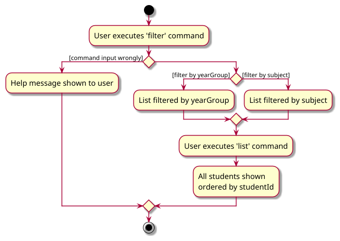

* Table of Contents
{:toc}

--------------------------------------------------------------------------------------------------------------------

## **Acknowledgements**

* This project is based on the AddressBook-Level3 project created by the [SE-EDU initiative](https://se-education.org).

--------------------------------------------------------------------------------------------------------------------

## **Setting up, getting started**

Refer to the guide [_Setting up and getting started_](SettingUp.md).

--------------------------------------------------------------------------------------------------------------------

## **Design**

:bulb: **Tip:** The `.puml` files used to create diagrams in this document `docs/diagrams` folder. Refer to the [_PlantUML Tutorial_ at se-edu/guides](https://se-education.org/guides/tutorials/plantUml.html) to learn how to create and edit diagrams.

### Architecture

The ***Architecture Diagram*** given above explains the high-level design of the App.

Given below is a quick overview of main components and how they interact with each other.

**Main components of the architecture**

**`Main`** (consisting of classes [`Main`](https://github.com/AY2425S1-CS2103T-W11-3/tp/blob/master/src/main/java/seedu/academyassist/Main.java) and [`MainApp`](https://github.com/AY2425S1-CS2103T-W11-3/tp/blob/master/src/main/java/seedu/academyassist/MainApp.java)) is in charge of the app launch and shut down.
* At app launch, it initializes the other components in the correct sequence, and connects them up with each other.
* At shut down, it shuts down the other components and invokes cleanup methods where necessary.

The bulk of the app's work is done by the following four components:

* [**`UI`**](#ui-component): The UI of the App.
* [**`Logic`**](#logic-component): The command executor.
* [**`Model`**](#model-component): Holds the data of the App in memory.
* [**`Storage`**](#storage-component): Reads data from, and writes data to, the hard disk.

[**`Commons`**](#common-classes) represents a collection of classes used by multiple other components.

**How the architecture components interact with each other**

The *Sequence Diagram* below shows how the components interact with each other for the scenario where the user issues the command `delete S00001`.

Each of the four main components (also shown in the diagram above),

* defines its *API* in an `interface` with the same name as the Component.
* implements its functionality using a concrete `{Component Name}Manager` class (which follows the corresponding API `interface` mentioned in the previous point.

For example, the `Logic` component defines its API in the `Logic.java` interface and implements its functionality using the `LogicManager.java` class which follows the `Logic` interface. Other components interact with a given component through its interface rather than the concrete class (reason: to prevent outside component's being coupled to the implementation of a component), as illustrated in the (partial) class diagram below.

The sections below give more details of each component.

### UI component

The **API** of this component is specified in [`Ui.java`](https://github.com/AY2425S1-CS2103T-W11-3/tp/blob/master/src/main/java/seedu/academyassist/ui/Ui.java).

The UI consists of a `MainWindow` that is made up of parts e.g.`CommandBox`, `ResultDisplay`, `PersonListPanel`, `StatusBarFooter` etc. All these, including the `MainWindow`, inherit from the abstract `UiPart` class which captures the commonalities between classes that represent parts of the visible GUI.

The `UI` component uses the JavaFx UI framework. The layout of these UI parts are defined in matching `.fxml` files that are in the `src/main/resources/view` folder. For example, the layout of the [`MainWindow`](https://github.com/AY2425S1-CS2103T-W11-3/tp/blob/master/src/main/java/seedu/academyassist/ui/MainWindow.java) is specified in [`MainWindow.fxml`](https://github.com/AY2425S1-CS2103T-W11-3/tp/blob/master/src/main/resources/view/MainWindow.fxml)

The `UI` component,

* executes user commands using the `Logic` component.
* listens for changes to `Model` data so that the UI can be updated with the modified data.
* keeps a reference to the `Logic` component, because the `UI` relies on the `Logic` to execute commands.
* depends on some classes in the `Model` component, as it displays `Person` object residing in the `Model`.

Certain components will require the instance of the `Model` itself. For example,
* for example, `TrackSubjectWindow` requires information on the number of students taking each subject

### Logic component

**API** : [`Logic.java`](https://github.com/AY2425S1-CS2103T-W11-3/tp/blob/master/src/main/java/seedu/academyassist/logic/Logic.java)

Here's a (partial) class diagram of the `Logic` component:

The sequence diagram below illustrates the interactions within the `Logic` component, taking `execute("delete S00001")` API call as an example.

:information_source: **Note:** The lifeline for `DeleteCommandParser` should end at the destroy marker (X) but due to a limitation of PlantUML, the lifeline continues till the end of diagram.

How the `Logic` component works:

1. When `Logic` is called upon to execute a command, it is passed to an `AcademyAssistParser` object which in turn creates a parser that matches the command (e.g., `DeleteCommandParser`) and uses it to parse the command.
1. This results in a `Command` object (more precisely, an object of one of its subclasses e.g., `DeleteCommand`) which is executed by the `LogicManager`.
1. The command can communicate with the `Model` when it is executed (e.g. to delete a person). 
   Note that although this is shown as a single step in the diagram above (for simplicity), in the code it can take several interactions (between the command object and the `Model`) to achieve.
1. The result of the command execution is encapsulated as a `CommandResult` object which is returned back from `Logic`.

Here are the other classes in `Logic` (omitted from the class diagram above) that are used for parsing a user command:

How the parsing works:
* When called upon to parse a user command, the `AcademyAssistParser` class creates an `XYZCommandParser` (`XYZ` is a placeholder for the specific command name e.g., `AddCommandParser`) which uses the other classes shown above to parse the user command and create a `XYZCommand` object (e.g., `AddCommand`) which the `AcademyAssistParser` returns back as a `Command` object.
* All `XYZCommandParser` classes (e.g., `AddCommandParser`, `DeleteCommandParser`, ...) inherit from the `Parser` interface so that they can be treated similarly where possible e.g, during testing.

Output after parsing:
* If an invalid command is input, a help message is shown to a user to specify the proper use of the command.
* Depending on the parameters input by the user, the same command type can result in different outputs. 
  * For example, the `filter` command can filter by either `subject` or `yearGroup` as shown below.
  * Calling the `list` command reverts the shown list to show all students again.

### Model component
**API** : [`Model.java`](https://github.com/AY2425S1-CS2103T-W11-3/tp/blob/master/src/main/java/seedu/academyassist/model/Model.java)

The `Model` component,

* stores the address book data i.e., all `Person` objects (which are contained in a `UniquePersonList` object).
* stores the currently 'selected' `Person` objects (e.g., results of a search query) as a separate _filtered_ list which is exposed to outsiders as an unmodifiable `ObservableList<Person>` that can be 'observed' e.g. the UI can be bound to this list so that the UI automatically updates when the data in the list change.
* stores a `UserPref` object that represents the user’s preferences. This is exposed to the outside as a `ReadOnlyUserPref` objects.
* does not depend on any of the other three components (as the `Model` represents data entities of the domain, they should make sense on their own without depending on other components)

### Storage component

**API** : [`Storage.java`](https://github.com/AY2425S1-CS2103T-W11-3/tp/blob/master/src/main/java/seedu/academyassist/storage/Storage.java)

The `Storage` component,
* can save both address book data and user preference data in JSON format, and read them back into corresponding objects.
* inherits from both `AcademyAssistStorage` and `UserPrefStorage`, which means it can be treated as either one (if only the functionality of only one is needed).
* depends on some classes in the `Model` component (because the `Storage` component's job is to save/retrieve objects that belong to the `Model`)

### Common classes

Classes used by multiple components are in the `seedu.academyassist.commons` package.

--------------------------------------------------------------------------------------------------------------------

## **Implementation**

This section describes some noteworthy details on how certain features are implemented.

### \[Proposed\] Undo/redo feature

#### Proposed Implementation

The proposed undo/redo mechanism is facilitated by `VersionedAcademyAssist`. It extends `AcademyAssist` with an undo/redo history, stored internally as an `academyAssistStateList` and `currentStatePointer`. Additionally, it implements the following operations:

* `VersionedAcademyAssist#commit()` — Saves the current academy assist state in its history.
* `VersionedAcademyAssist#undo()` — Restores the previous academy assist state from its history.
* `VersionedAcademyAssist#redo()` — Restores a previously undone academy assist state from its history.

These operations are exposed in the `Model` interface as `Model#commitAcademyAssist()`, `Model#undoAcademyAssist()` and `Model#redoAcademyAssist()` respectively.

Given below is an example usage scenario and how the undo/redo mechanism behaves at each step.

Step 1. The user launches the application for the first time. The `VersionedAcademyAssist` will be initialized with the initial address book state, and the `currentStatePointer` pointing to that single address book state.

Step 2. The user executes `delete 5` command to delete the 5th person in the address book. The `delete` command calls `Model#commitAcademyAssist()`, causing the modified state of the address book after the `delete 5` command executes to be saved in the `academyAssistStateList`, and the `currentStatePointer` is shifted to the newly inserted address book state.

Step 3. The user executes `add n/David …​` to add a new person. The `add` command also calls `Model#commitAcademyAssist()`, causing another modified address book state to be saved into the `academyAssistStateList`.

:information_source: **Note:** If a command fails its execution, it will not call `Model#commitAcademyAssist()`, so the academy assist state will not be saved into the `academyAssistStateList`.

Step 4. The user now decides that adding the person was a mistake, and decides to undo that action by executing the `undo` command. The `undo` command will call `Model#undoAcademyAssist()`, which will shift the `currentStatePointer` once to the left, pointing it to the previous academy assist state, and restores the academy assist to that state.

:information_source: **Note:** If the `currentStatePointer` is at index 0, pointing to the initial AcademyAssist state, then there are no previous AcademyAssist states to restore. The `undo` command uses `Model#canUndoAcademyAssist()` to check if this is the case. If so, it will return an error to the user rather
than attempting to perform the undo.

The following sequence diagram shows how an undo operation goes through the `Logic` component:

:information_source: **Note:** The lifeline for `UndoCommand` should end at the destroy marker (X) but due to a limitation of PlantUML, the lifeline reaches the end of diagram.

Similarly, how an undo operation goes through the `Model` component is shown below:

The `redo` command does the opposite — it calls `Model#redoAcademyAssist()`, which shifts the `currentStatePointer` once to the right, pointing to the previously undone state, and restores the academy assist to that state.

:information_source: **Note:** If the `currentStatePointer` is at index `academyAssistStateList.size() - 1`, pointing to the latest academy assist state, then there are no undone AcademyAssist states to restore. The `redo` command uses `Model#canRedoAcademyAssist()` to check if this is the case. If so, it will return an error to the user rather than attempting to perform the redo.

Step 5. The user then decides to execute the command `list`. Commands that do not modify the academy assist, such as `list`, will usually not call `Model#commitAcademyAssist()`, `Model#undoAcademyAssist()` or `Model#redoAcademyAssist()`. Thus, the `academyAssistStateList` remains unchanged.

Step 6. The user executes `clear`, which calls `Model#commitAcademyAssist()`. Since the `currentStatePointer` is not pointing at the end of the `academyAssistStateList`, all address book states after the `currentStatePointer` will be purged. Reason: It no longer makes sense to redo the `add n/David …​` command. This is the behavior that most modern desktop applications follow.

The following activity diagram summarizes what happens when a user executes a new command:

#### Design considerations:

**Aspect: How undo & redo executes:**

* **Alternative 1 (current choice):** Saves the entire academy assist.
  * Pros: Easy to implement.
  * Cons: May have performance issues in terms of memory usage.

* **Alternative 2:** Individual command knows how to undo/redo by
  itself.
  * Pros: Will use less memory (e.g. for `delete`, just save the person being deleted).
  * Cons: We must ensure that the implementation of each individual command are correct.

_{more aspects and alternatives to be added}_

--------------------------------------------------------------------------------------------------------------------

## **Documentation, logging, testing, configuration, dev-ops**

* [Documentation guide](Documentation.md)
* [Testing guide](Testing.md)
* [Logging guide](Logging.md)
* [Configuration guide](Configuration.md)
* [DevOps guide](DevOps.md)

--------------------------------------------------------------------------------------------------------------------

## **Appendix: Requirements**

### Product scope

**Target user profile**:

* prefer desktop apps over other types
* can type fast
* prefers typing to mouse interactions
* is reasonably comfortable using CLI apps
* people who work in management/administration of tuition centres for primary and secondary schools in **Singapore**
* manages a tuition centre of **small to medium size (roughly a few hundred students)**

**Value proposition**: Centralizes contact details, tracks student data and offers functions that improve administrative efficiency and organization for a tuition centre.

### User stories

Priorities: High (must have) - `* * *`, Medium (nice to have) - `* *`, Low (unlikely to have) - `*`

| Priority | As a …​                           | I want to …​                                  | So that I can…​                                                                          |
|----------|-----------------------------------|-----------------------------------------------|------------------------------------------------------------------------------------------|
| `* * *`  | administrator of a tuition centre | view all students' details                    | easily consolidate all information in one place                                          |
| `* * *`  | administrator of a tuition centre | add a new student                             | store details about newly enrolled students                                              |
| `* * *`  | administrator of a tuition centre | delete a student                              | remove students that are no longer enrolled                                              |
| `* * *`  | administrator of a tuition centre | find a student by name                        | locate details of students without having to go through the entire list                  |
| `* * *`  | administrator of a tuition centre | add subjects taken by student                 | add student's subject details without creating a new entry                               |
| `* *`    | administrator of a tuition centre | filter students based on a category           | easily see all students that fall under that category                                    |
| `* *`    | administrator of a tuition centre | view the complete details of a single student | obtain all information related to said student                                           |
| `* *`    | administrator of a tuition centre | sort students based on an order               | group students with similar needs, monitor their progress easily                         |
| `* *`    | administrator of a tuition centre | edit student contact                          | update student details when they are changed without needing to create a new entry       |
| `* *`    | new user                          | see what commands are available               | refer to instructions when I forget how to use the app                                   |
| `*`      | administrator of a tuition centre | clear all contacts                            | empty the address book for a new academic year instead of deleting entries one at a time |
| `*`      | administrator of a tuition centre | track class size                              | see if classes are nearing capacity or undersubscribed                                   |

### Use cases

(For all use cases below, the **System** is the `AcademyAssist` and the **Actor** is the `administrator`, unless specified otherwise)

**Use case: UC1 - Add a student**

**MSS**

1. User requests to add a student
2. User provides the details of the student
3. System confirms student has been added and displays list of updated students

    Use case ends

   **Extensions**

* 2a. Details are not provided/invalid format
  * 2a1. System gives error message and requests for details in correct format
  * 2a2. User re-enters the correct/missing information

    Steps 2a1-2a2 are repeated until the information in the specified format is provided

    Use case resumes at step 3

* 2b. The student entered has already been added
  * 2b1. System indicates that there has already been an entry for the student

    Use case ends

* 2c. Student capacity has been reached 
  * 2c1. System gives a warning to users that it is exceeding student limit

    Use case ends

---

**Use case: UC2 - Delete a student**

**MSS**

1. User chooses to delete a student
2. System deletes the student and all information related to the student
3. System informs user that the student has been successfully deleted

   Use case ends

   **Extensions**

* 1a. The student to be deleted does not exist
  * 1a1. System alerts user that there is no such student found
  * 1a2. User re-enters the correct information

    Steps 1a1-1a2 are repeated until student to be deleted exists 

    Use case resumes at step 2

* 1b. The details of the student to be deleted is in the wrong format/missing
  * 1b1. System gives error message and requests for details in correct format
  * 1b2. User re-enters the correct information

    Steps 1b1-1b2 are repeated until the details in the specified format are provided

    Use case resumes at step 2

---

**Use case: UC3 - Edit a student**

**MSS**

1. User chooses a student's details to edit
2. System updates the student's details based on new input
3. System informs user that details have been updated

    Use case ends

   **Extensions**

* 1a. User chooses a student that doesn't exist to edit
  * 1a1. System alerts user that there is no such student found
  * 1a2. User re-enters the correct student information

    Steps 1a1-1a2 are repeated until student to be edited exists

    Use case resumes at step 2

* 2a. User enters an invalid/missing field or new input
  * 2a1. System requests for the correct field/new input
  * 2a2. User re-enters the correct field or new input

    Steps 2a1-2a2 are repeated until the information in correct format is entered
  
    Use case resumes from step 3

---

**Use case: UC4 - View all students**

**MSS**

1. User chooses to list all student contact details
2. System displays a list of students with their relevant details

    Use case ends

   **Extensions**

* 1a. System encounters an internal error while retrieving student details
  * 1a1. System displays an error message

    Use case ends

* 2a. No students are found in the system
  * 2a1. System gives a blank list

    Use case ends

---

**Use case: UC5 - Finding a student**

**MSS**

1. User initiates a search for a student
2. System displays the matching student(s) 

    Use case ends

   **Extensions**

* 1a. User enters an invalid name/missing name
  * 1a1. System requests for name in correct format
  * 1a2. User re-enters the correct input

    Steps 1a1-1a2 are repeated until the correct name is entered.
    Use case resumes from step 2.

* 2a. No matching student found in the system
  * 2a1. System informs user that there are no such students found
  * 2a2. System gives an empty list

    Use case ends

---

**Use case: UC6 - Clearing the app**

**MSS**

1. User clears the app of all contact data
2. System informs user that the app has been cleared of all data

    Use case ends

   **Extensions**

* 1a. User enters an incorrect format
  * 1a1. System displays an error message and prompts user to try again
  * 1a2. User re-enters the correct clear command

    Steps 1a1-1a2 are repeated until the correct command is entered
  
    Use case resumes from step 2

* 1b. System encounters an internal error while trying to clear the contact book
  * 1b1. System displays an error message

    Use case ends

---

**Use case: UC7 - Displaying a Help Window**

**MSS**

1. User uses the help command
2. System shows user a list of commands and their functionality

    Use case ends

---

**Use case: UC8 - Sorting**

**MSS**

1. User wants to arrange students by their name/subject/studentId/yearGroup
2. System arranges the students in alphabetical order by name/subject or ascending order by yearGroup/studentId
3. System displays students sorted correctly

    Use case ends

   **Extensions**

* 1a. User tries to sort by an invalid field
  * 1a1. System informs user to sort using only name/subject/studentId/yearGroup
  * 1a2. User re-enters the command with a valid field.

    Steps 1a1-1a2 are repeated until only one of name/subject/studentId/yearGroup is entered as the field
    Use case resumes from step 2.

* 3a. There are no students added
  * 3a1. System gives a blank screen

    Use case ends

---

**Use case: UC9 - Viewing a student's complete details**

**MSS**

1. User chooses a student to view their complete details
2. System displays all information pertaining to that student

   Use case ends

   **Extensions**

* 1a. The student chosen does not exist
    * 1a1. System alerts user that there is no such student found
    * 1a2. User re-enters the correct information

      Steps 1a1-1a2 are repeated until student chosen exists

      Use case resumes at step 2

* 1b. The details of the student to be viewed is in the wrong format
    * 1b1. System gives error message and requests for details in correct format
    * 1b2. User re-enters the correct information

      Steps 1b1-1b2 are repeated until the details in the specified format are provided

      Use case resumes at step 2

---

**Use case: UC10 - Filter**

**MSS**

1. User wants to filter students by subjects or yearGroup
2. System gives a list of students who are in that yearGroup/taking that subject

   Use case ends

   **Extensions**

* 1a. User tries to filter by an invalid category
    * 1a1. System informs user to filter using only subject/yearGroup
    * 1a2. User re-enters the command with a valid category

      Steps 1a1-1a2 are repeated until only subject/yearGroup is entered as the field

      Use case resumes from step 2

* 1b. User gives invalid inputs to yearGroup or subject
    * 1b1. System informs user of the correct formats for yearGroup or subject
    * 1b2. User re-enters the command with valid inputs 
    
      Steps 1b1-1b2 are repeated until the user enters the information in the correct format
  
      Use case resumes from step 2

* 2a. There are no students added
    * 2a1. System gives a blank screen

      Use case ends

---

**Use case: UC11 - Tracking students' subjects**

**MSS**

1. User uses the tracksubject command
2. System shows user all subjects and how many students are currently taking them

   Use case ends

---

**Use case: UC12 - Adding subjects to students**

**MSS**

1. User chooses a student to add subject(s) to
2. User decides what are the additional subjects to add to the student  
3. System informs the user that the subjects taken have been updated 

    Use case ends 

   **Extensions**

* 1a. User tries to add subjects to a student that does not exist
    * 1a1. System alerts user that there is no such student found
    * 1a2. User re-enters the correct information

      Steps 1a1-1a2 are repeated until student to add subjects to exists

      Use case resumes at step 2

* 1b. Student details are not provided/invalid format
    * 1b1. System gives error message and requests for details in correct format
    * 1b2. User re-enters the correct/missing information

      Steps 1b1-1b2 are repeated until the information in the specified format is provided

      Use case resumes at step 2

* 2a. User gives an invalid/missing subject
    * 2a1. System informs user of the valid subject inputs 
    * 2a2. User re-enters the command with valid subjects

      Steps 2a1-2a2 are repeated until the user enters the correct subjects

      Use case resumes from step 3

---
### Non-Functional Requirements

#### Data Requirements
1.  Should be able to hold up to 500 students including personal details, contact information, and emergency contacts, without a significant performance drop.
2.  All data should be persistent, meaning it must be saved even after the application is closed, ensuring no data loss between sessions.

#### Environment Requirements
3.  Should work on any _mainstream OS_ as long as it has Java `17` or above installed.
4.  A user with above average typing speed for regular English text (i.e. not code, not system admin commands) should be able to accomplish most of the tasks faster using commands than using the mouse.
5.  AcademyAssist should be able to work offline

#### Documentation
6.  Comprehensive user guides and FAQs should be provided to guide users through installation, configuration, and typical use cases.

#### Maintainability
7.  Codebase should follow industry best practices for readability, including consistent naming conventions for easy maintenance.
8.  The app should follow a modular design so that individual components can be updated without affecting the entire app.

#### Robustness
9.  The system should gracefully handle unexpected inputs, preventing crashes and allowing users to recover from errors.

#### Testability
10.  The system should include automated unit tests and integration tests to validate all major components.

#### Response Time
11. The system should respond to user commands within 2 seconds, ensuring a smooth and efficient user experience.

#### Scalability
12.  The system should be able to handle up to 99999 student records without significant performance degradation, assuming we were to scale the product for use in bigger tuition centres.

#### Accessibility
13.  The system should provide keyboard shortcuts and other accessibility features to support users with disabilities.

#### Extensibility
14.  The system should have a modular design that allows for easy addition of new features and integrations in the future.

### Glossary

* **Mainstream OS**: Windows, Linux, Unix, MacOS
* **AcademyAssist**: The CLI application developed for tuition centers in Singapore to manage their student data and administrative tasks.
* **Administrator**: Tutors and admin staff at the tuition centre.
* **API (Application Programming Interface)**:  Facilitates communication between different software components.
* **Architecture Diagram**: A high-level design diagram showing the primary components and their interactions.
* **CLI (Command Line Interface)**: A text-based interface that allows users to interact with software by typing commands.
* **Command**: A specific instruction or request issued by the user to perform a certain action within the application.
* **Contact Details**: Information related to a student or staff member, including their name, phone number, email, and any other relevant identifiers.
* **Extension (in use cases)**: Alternative flows that might arise due to errors or exceptions while performing the main success scenario.
* **Field**: A specific attribute or category in the context of a student's details, such as name or class, used for sorting or filtering information.
* **GUI (Graphical User Interface)**: A type of user interface that provides a visual representation of the system.
* **Interface**: A contract in Java (or similar languages) that defines methods a class must implement.
* **Invalid Input**: Data or commands entered by the user that do not conform to the expected format or criteria, resulting in an error or rejection of the command.
* **JSON (JavaScript Object Notation)**: A lightweight data interchange format used to store and manage the student data in AcademyAssist.
* **Logic**: The part of the application that handles command execution and application logic.
* **Model**: Represents the app's data held in memory.
* **Modular Design**: A software architecture approach that divides the system into independent components for easier maintenance and scalability.
* **MSS (Main Success Scenario)**: The primary flow of actions in a use case that leads to a successful outcome.
* **NFR (Non-Functional Requirements)**: Specifications that describe the qualities and constraints of a system, such as performance, reliability, and security, rather than its specific functions.
* **NRIC (National Registration Identity Card)**: The identification document used in Singapore.
* **Persistence**: A characteristic of data that ensures it is stored and available even after the application is closed and reopened.
* **Sequence Diagram**: A type of diagram showing interactions between components in a sequential order.
* **Storage**: Manages data persistence, handling read/write operations to the hard disk.
* **Student**: An individual who is enrolled in the tuition centre identified by attributes such as their name, contact details, and unique identifiers. 
* **Subject**: An academic course or topic that students are enrolled in at the tuition center. Each subject is associated with students who are actively studying it.
* **Testability**: The ease with which the system can be tested to ensure its correct behavior, including automated and manual testing.
* **UI (User Interface)**: The component of the app that manages user interaction.

--------------------------------------------------------------------------------------------------------------------

## **Appendix: Instructions for manual testing**

Given below are instructions to test the app manually.

:information_source: **Note:** These instructions only provide a starting point for testers to work on;
testers are expected to do more *exploratory* testing.

### Launch and shutdown

1. Initial launch

   1. Download the jar file and copy into an empty folder.

   2. Double-click the jar file.  
       Expected: A help window appears for first-time users, along with the GUI displaying a set of sample contacts. The window size may not be optimal.

2. Saving window preferences

   1. Resize the window to an optimal size, move it to a different location and close it.

   2. Relaunch the app by double-clicking the JAR file. 
       Expected: No help window appears. The most recent window size and location are retained.

### Adding a student 

1. Adding a student with a new NRIC

   1. Prerequisites: Student with NRIC number T3848559A does not exist in the system.
   
   2. Test case: `add n\Sam Tan i\T3848559A yg\3 p\81003999 e\samtan@gmail.com a\9 Smith Street s\Science` 
       Expected: Student named Sam Tan with NRIC T3848559A is added to the list.
   
2. Adding a student with an existing name but new NRIC

   1. Prerequisites: A student named Sam Tan exists in the system.
   
   2. Test case: `add n\Sam Tan i\S2684225J yg\2 p\88247432 e\sammmie@gmail.com a\16 Next Street s\Math` 
       Expected: Student named Sam Tan with NRIC S2684225J is added to the list.
   
3. Adding a student with an existing NRIC

   1. Prerequisites: A student with NRIC number T3848559A exists in the system.
   
   2. Test case: `add n\John Doe i\T3848559A yg\2 p\91234567 e\johndoe@yahoo.com a\10 Orchard Road s\Science s\Math` 
       Expected: Error message indicating that another student with the same NRIC already exists in the system. 

### Editing a student

1. Editing an existing student's details

    1. Prerequisites: A student with ID S00001 exists in the system.
   
    2. Test case: `edit s00001 p\91234567 a\18 Tampines Road` 
        Expected: Student with ID S00001 is updated with phone number "91234567" and address "18 Tampines Road". 
        Success message is shown in the message box.
   
2. Editing a non-existent student's detail

   1. Prerequisites: Student with ID S00999 does not exist in the system.
   
   2. Test case: `edit s00999 p\84754243 a\25 Orchard Road` 
       Expected: Error message indicating that no student is found with the provided student ID. 
   
3. Editing a student's NRIC to match an existing student's NRIC.

   1. Prerequisites: 
       * Student with ID S00001 exists in the system.
       * Another student with NRIC S2684225J exists in the system.
      
   2. Test case: `edit s00001 i\S2684225J` 
       Expected: Error message indicating that another student with the same NRIC already exists in the system.

### Adding subject(s) to a student

1. Adding one subject to a student

    1. Prerequisites: Student with ID S00001 exists in the system.
   
    2. Test case: `addsubject S00001 s\Math` 
        Expected: Student with ID S00001 is added to the subject Math. Existing subjects remain unchanged.
   
2. Adding multiple subjects to a student

    1. Prerequisites: Student with ID s00001 exists in the system.
   
    2. Test case: `addsubject S00001 s\History s\Chinese`
        Expected: Student with ID S00001 is added to subjects History and Chinese. The existing subjects remained unchanged.

### Deleting a student

1. Deleting an existing student

   1. Prerequisites: Student with ID S00001 exists in the system.
   
   2. Test case: `delete S00001` 
       Expected: Student with ID S00001 is deleted from the list. Details of the deleted student are shown in the success message.
   
2. Deleting a non-existent student

   1. Prerequisites: Student with ID S00001 does not exist in the system. 
   
   2. Test case: `delete S00001` 
       Expected: No student is deleted. Error message indicating that no student is found with the provided student ID.

### Viewing student's detail

1. Viewing details of an existing student

   1. Prerequisites: Student with ID S00002 exists in the system.
   
   2. Test case: `detail S00002` 
       Expected: A pop-up window displays the details of the student with ID S00002.
   
2. Closing the pop-up window

   1. Prerequisites: A pop-up window is displayed.
   
   2. Test case: Press `B` on the keyboard  
       Expected: The pop-up window closes.

### Searching for a student

1. Searching for students by full name

   1. Prerequisites: 
       * Multiple students exist in the system.  
       * A student named Sam Tan exists in the system.
      
   2. Test case: `find sam` 
       Expected: A list of students, including Sam Tan, is shown.
   
2. Searching for students by partial name

    1. Prerequisites:
        * Multiple students exist in the system.
        * A student named Sam Tan exists in the system.
       
    2. Test case: `find sa` 
       Expected: A list of students, including Sam Tan, is shown.

### Sorting the student list

1. Sorting the student list by specific field

   1. Prerequisites: Multiple students exist in the system.
   
   2. Test case: `sort by\name` 
       Expected: Student list is sorted in ascending lexicographical order by name.
   
   3. Test case: `sort by\subject` 
       Expected: Student list is sorted by the lexicographically smallest subject they are taking.
   
   4. Test case: `sort by\studentId` 
       Expected: Student list is sorted in ascending order by student ID.
   
   5. Test case: `sort by\yearGroup` 
       Expected: Student list is sorted in ascending order by year group.
      
### Filtering the student list

1. Filter by year group

   1. Prerequisites: 
       * Multiple students exist in the system.
       * At least one student from year group 3 exists.
      
   2. Test case: `filter yg\3` 
       Expected: A list of students in year group 3 is shown.
   
2. Filter the student list by subject

   1. Prerequisites:
       * Multiple students exist in the system.
       * At least one student taking subject English exists.
      
   2. Test case: `filter s\English` 
       Expected: A list of students taking English is shown.

### Tracking subject statistics

1. Opening the track subject window

    1. Prerequisites: None
   
    2. Test case: `tracksubject` 
       Expected: A window displays subject statistics.
   
2. Closing the track subject window

    1. Prerequisites: The track subject window is displayed.
   
    2. Test case: Press `B` on the keyboard  
       Expected: The track subject window closes.

### Saving data

1. Dealing with missing data file

   1. Prerequisites: Storage file exits (default location: ./data/academyassist.json)
   
   2. Test case: Delete `academyassist.json` 
       Expected: AcademyAssist erases all existing data and start with a blank data file. 

2. Dealing with corrupted data file

   1. Prerequisites: Storage file exits (default location: ./data/academyassist.json)
   
   2. Test case: Edit the file into an invalid JSON format (e.g., deleting a `:`)
       Expected: AcademyAssist erases all existing data and start with a blank data file.
   
   3. Test case: Duplicate a student's entries
      Expected: AcademyAssist erases all existing data and start with a blank data file.
   
   4. Test case: Set `idGeneratedCount` to a value greater than 99999
      Expected: AcademyAssist erases all existing data and start with a blank data file.

--------------------------------------------------------------------------------------------------------------------
## **Appendix: Effort**

### Difficulty
The development of **AcademyAssist** presented a moderate to high difficulty level to our team. The project required a 
solid understanding of Java programming, particularly in object-oriented design. Even though our team has prior experience
with Java, the complexity of the project demanded a deeper understanding of JavaFX, which was new to most of us. But with
the experience gained from developing the individual project before this, we were able to quickly adapt to the team project
development.

### Challenges Faced
The main challenges faced by our team during the development of **AcademyAssist** were:
1. **Designing the product**: The team had to spend a significant amount of time designing the product, including deciding
on the features to include, the architecture of the application, and the user interface design. This required a lot of
discussion and collaboration among team members.
2. **Data Validation**: Implementing robust validation for user inputs was essential to prevent errors and ensure that 
the data entered into the system was accurate and consistent. This involved defining multiple constraints for different 
fields, such as name, NRIC, phone numbers, and email formats.
3. **Ensure OOP Principles**: The team had to ensure that the codebase followed object-oriented programming principles to
maintain code quality and readability. This involved designing classes with clear responsibilities, encapsulating data, and
implementing inheritance and polymorphism where necessary.
4. **Testing**: Writing comprehensive unit tests and integration tests to validate the functionality of the application was
a challenging task. The team had to ensure that the tests covered all possible scenarios and edge cases to catch any bugs
or issues in the development process.
5. **Time Management**: Managing the project timeline and ensuring that all tasks were completed on time was a significant
challenge. The team had to prioritize tasks, allocate resources effectively, and coordinate efforts to meet the project
deadlines.

### Achievements from the Project
Despite the challenges faced, the team was able to successfully develop **AcademyAssist** and deliver a functional product
through effective collaboration, communication, and problem-solving. Some of the key achievements from the project include:
1. **Functional Product**: The team was able to develop a fully functional tuition center management application that
incorporated the features and requirements specified in the project brief.
2. **Collaboration**: The team worked well together, leveraging each member's strengths and skills to contribute to the
project's success. Regular meetings, discussions, and feedback sessions helped to keep the project on track and ensure that
everyone was aligned on the goals and objectives.
3. **Learning and Growth**: The project provided an opportunity for team members to develop a functional application from
an existing codebase (AB3), enhancing their programming skills, problem-solving abilities, and teamwork. 

### Conclusion
Overall, the development of **AcademyAssist** was a challenging but rewarding experience for our team. The project allowed
us to apply our Java programming skills in a real-world context, collaborate effectively with team members, and deliver a
functional product that met the requirements of the project brief. We learned valuable through the project, and we are proud
of the work we have accomplished together.

--------------------------------------------------------------------------------------------------------------------
## **Appendix: Planned Enhancement**
Team size: 5

1. **Allowing more subjects to be added with the addsubject feature:** Currently, Subjects are implemented using an enum with a list of common subjects offered by tuition centers in Singapore. 
Acknowledging that there might be niche subjects not included, we plan to enhance this feature to allow administrators to 
define verified subjects in the system that are offered under the tuition center, such that they can enrol students into 
those subjects as well without losing the benefit of validation and duplication checks. 

2. **Enhance Subject Tracking with list sorted alphabetically or by enrolment:** Currently, the subject list shown when using the subject tracking feature is not sorted. We plan to include the options
to sort by alphabetical order or by enrolment numbers in the future to support easier accessing and allocation of resources.

3. **Enhance UI for scrolling and viewing:** Currently, the UI (e.g. scrollbar) can experience some errors when the app first launches, 
and pop-up windows may require users to manually resize in order to view all the data. In the future, we plan to improve the UI responsiveness 
to work across various window sizes and different computer settings. 

4. **Allowing additional special characters in names:** Currently, only the special characters (-/') are allowed in names. In the future, we plan to improve our validation checks 
to include more special characters such as '.' and ',', and allowing names to end with some of the special characters (e.g. Robert Downey Jr.). 

5. **Accepting consecutive spaces in names:** Currently, consecutive spaces in names are not allowed. We plan to improve the validation checks of names to treat  
multiple spaces in names, which arise likely due to mistakes in entry, as just one space (e.g. treating Jane     Tan as Jane Tan). 

6. **Improved verification of address:** Currently, any String is accepted as an address. In the future, we plan to improve the verification of the address field of 
the add functionality, such that we can check that necessary fields are present, e.g. post code, country, street name etc., 
to ensure that addresses saved are valid addresses.

7. **Allowing Help window to be closed by keyboard shortcut:** Currently, the help window can only be closed by clicking on 
the cross on the window. To improve convenience to the user, we plan to enable the help window to be closed by a keyboard shortcut 
in the future. 

8. **Automatically refresh tracksubject window:** Currently, whenever the user uses a command such as filter or find that 
changes the student contacts listed, the user has to manually run the tracksubject command again to view updated enrolment 
data according to the newly filtered student list. In the future, we plan to enhance the tracksubject method such that 
the enrolment data will be refreshed automatically whenever the student list is changed. 

9. **Display more information on a student's contact:** Currently, only a few fields of a student's contact is displayed 
to keep the information concise and ensure ease of navigation. Although there is a workaround method (detail) provided to 
let users view the full student details, we plan to improve the UI to include more essential information such as NRIC or student photo better 
to reduce ambiguity when navigating through the contact lists.

10. **Make the error message of commands more specific:** Currently, when the user enters commands 
with a StudentID that has an invalid format, the error message is too general. We plan to make it more specific by making it clearer  
to the user that the failed execution was due to an error in the StudentID, and state what the expected format should be. This can help to reduce 
ambiguity and help with troubleshooting. 

--------------------------------------------------------------------------------------------------------------------
