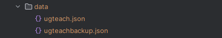

# UGTeach Developer Guide

<!-- * Table of Contents -->
<page-nav-print />

--------------------------------------------------------------------------------------------------------------------

## **Acknowledgements**

* This project is based on the AddressBook-Level3 project created by the [SE-EDU initiative](https://se-education.org).
* Libraries used: [JavaFX](https://openjfx.io/), [Jackson](https://github.com/FasterXML/jackson), [JUnit5](https://github.com/junit-team/junit5)
* The implementation description of the `add` command in this documentation was inspired by the documentation of the past project [NetworkBook](https://ay2324s1-cs2103t-t08-2.github.io/tp/DeveloperGuide.html#add-details).
* The implementation description of the `owe` command in this documentation was inspired by the documentation of the past project [NetworkBook](https://ay2324s1-cs2103t-t08-2.github.io/tp/DeveloperGuide.html#add-details).
* The non-functional requirement related to the standard screen resolution was inspired by the documentation of the current year project [PlanPerfect](https://ay2425s1-cs2103t-t12-2.github.io/tp/DeveloperGuide.html).
* The Quick start guide in the User Guide was adapted from the documentation of the current year project [VBook](https://ay2425s1-cs2103t-f14b-4.github.io/tp/UserGuide.html).
* ChatGPT used to generate some JavaDocs. Github Copilot used for code auto-completion in some parts of the code. Both tools used by [TY1Fan](https://github.com/TY1Fan).

--------------------------------------------------------------------------------------------------------------------

## **Setting up, getting started**

Refer to the guide [_Setting up and getting started_](SettingUp.md).

--------------------------------------------------------------------------------------------------------------------

<div style="page-break-after: always;"></div>


## **Design**

### Architecture

<puml src="diagrams/ArchitectureDiagram.puml" width="280" />

The ***Architecture Diagram*** given above explains the high-level design of the App.

Given below is a quick overview of main components and how they interact with each other.

**Main components of the architecture**

**`Main`** (consisting of classes [`Main`](https://github.com/AY2425S1-CS2103T-F14a-1/tp/blob/master/src/main/java/seedu/address/Main.java) and [`MainApp`](https://github.com/AY2425S1-CS2103T-F14a-1/tp/blob/master/src/main/java/seedu/address/MainApp.java)) is in charge of the app launch and shut down.
* At app launch, it initializes the other components in the correct sequence, and connects them up with each other.
* At shut down, it shuts down the other components and invokes cleanup methods where necessary.

The bulk of the app's work is done by the following four components:
* [**`UI`**](#ui-component): The UI of the App.
* [**`Logic`**](#logic-component): The command executor.
* [**`Model`**](#model-component): Holds the data of the App in memory.
* [**`Storage`**](#storage-component): Reads data from, and writes data to, the hard disk.

[**`Commons`**](#common-classes) represents a collection of classes used by multiple other components.

<div style="page-break-after: always;"></div>

**How the architecture components interact with each other**

The *Sequence Diagram* below shows how the components interact with each other for the scenario where the user issues the command `delete 1`.

<puml src="diagrams/ArchitectureSequenceDiagram.puml" width="574" />

Each of the four main components (also shown in the diagram above),

* defines its *API* in an `interface` with the same name as the Component.
* implements its functionality using a concrete `{Component Name}Manager` class (which follows the corresponding API `interface` mentioned in the previous point.

For example, the `Logic` component defines its API in the `Logic.java` interface and implements its functionality using the `LogicManager.java` class which follows the `Logic` interface. Other components interact with a given component through its interface rather than the concrete class (reason: to prevent outside component's being coupled to the implementation of a component), as illustrated in the (partial) class diagram below.

<puml src="diagrams/ComponentManagers.puml" width="300" />

The sections below give more details of each component.

<div style="page-break-after: always;"></div>

### UI component

The **API** of this component is specified in [`Ui.java`](https://github.com/AY2425S1-CS2103T-F14a-1/tp/blob/master/src/main/java/seedu/address/ui/Ui.java)

<puml src="diagrams/UiClassDiagram.puml" alt="Structure of the UI Component"/>

The UI consists of a `MainWindow` that is made up of parts e.g.`CommandBox`, `ResultDisplay`, `StudentListPanel`, `StatusBarFooter` etc. All these, including the `MainWindow`, inherit from the abstract `UiPart` class which captures the commonalities between classes that represent parts of the visible GUI.

The `UI` component uses the JavaFx UI framework. The layout of these UI parts are defined in matching `.fxml` files that are in the `src/main/resources/view` folder. For example, the layout of the [`MainWindow`](https://github.com/se-edu/addressbook-level3/tree/master/src/main/java/seedu/address/ui/MainWindow.java) is specified in [`MainWindow.fxml`](https://github.com/se-edu/addressbook-level3/tree/master/src/main/resources/view/MainWindow.fxml).

The `UI` component,

* executes user commands using the `Logic` component.
* listens for changes to `Model` data so that the UI can be updated with the modified data.
* keeps a reference to the `Logic` component, because the `UI` relies on the `Logic` to execute commands.
* depends on some classes in the `Model` component, as it displays `Student` object residing in the `Model`.

<div style="page-break-after: always;"></div>

### Logic component

**API** : [`Logic.java`](https://github.com/AY2425S1-CS2103T-F14a-1/tp/blob/master/src/main/java/seedu/address/logic/Logic.java)

Here's a (partial) class diagram of the `Logic` component:

<puml src="diagrams/LogicClassDiagram.puml" width="550"/>

The sequence diagram below illustrates the interactions within the `Logic` component, taking `execute("delete 1")` API call as an example.

<puml src="diagrams/DeleteSequenceDiagram.puml" alt="Interactions Inside the Logic Component for the `delete 1` Command" />

<box type="info" seamless>

**Note:** The lifeline for `DeleteCommandParser` should end at the destroy marker (X) but due to a limitation of PlantUML, the lifeline continues till the end of diagram.
</box>

<div style="page-break-after: always;"></div>

How the `Logic` component works:

1. When `Logic` is called upon to execute a command, it is passed to an `AddressBookParser` object which in turn creates a parser that matches the command (e.g., `DeleteCommandParser`) and uses it to parse the command.
1. This results in a `Command` object (more precisely, an object of one of its subclasses e.g., `DeleteCommand`) which is executed by the `LogicManager`.
1. The command can communicate with the `Model` when it is executed (e.g. to delete a student).<br>
   Note that although this is shown as a single step in the diagram above (for simplicity), in the code it can take several interactions (between the command object and the `Model`) to achieve.
1. The result of the command execution is encapsulated as a `CommandResult` object which is returned back from `Logic`.


Here are the other classes in `Logic` (omitted from the class diagram above) that are used for parsing a user command:

<puml src="diagrams/ParserClasses.puml" width="600"/>

How the parsing works:
* When called upon to parse a user command, the `AddressBookParser` class creates an `XYZCommandParser` (`XYZ` is a placeholder for the specific command name e.g., `AddCommandParser`) which uses the other classes shown above to parse the user command and create a `XYZCommand` object (e.g., `AddCommand`) which the `AddressBookParser` returns back as a `Command` object.
* All `XYZCommandParser` classes (e.g., `AddCommandParser`, `DeleteCommandParser`, ...) inherit from the `Parser` interface so that they can be treated similarly where possible e.g, during testing.

<div style="page-break-after: always;"></div>

### Model component
**API** : [`Model.java`](https://github.com/AY2425S1-CS2103T-F14a-1/tp/blob/master/src/main/java/seedu/address/model/Model.java)

<puml src="diagrams/ModelClassDiagram.puml" width="800" />

The `Model` component,

* stores the address book data i.e., all `Student` objects (which are contained in a `UniqueStudentList` object).
* stores the currently 'selected' `Student` objects (e.g., results of a search query) as a separate _filtered_ list which is exposed to outsiders as an unmodifiable `ObservableList<Student>` that can be 'observed' e.g. the UI can be bound to this list so that the UI automatically updates when the data in the list change.
* stores a `UserPref` object that represents the user’s preferences. This is exposed to the outside as a `ReadOnlyUserPref` objects.
* does not depend on any of the other three components (as the `Model` represents data entities of the domain, they should make sense on their own without depending on other components)

<div style="page-break-after: always;"></div>

### Storage component

**API** : [`Storage.java`](https://github.com/AY2425S1-CS2103T-F14a-1/tp/blob/master/src/main/java/seedu/address/storage/Storage.java)

<puml src="diagrams/StorageClassDiagram.puml" width="550" />

The `Storage` component,
* can save both address book data and user preference data in JSON format, and read them back into corresponding objects.
* inherits from both `AddressBookStorage` and `UserPrefStorage`, which means it can be treated as either one (if only the functionality of only one is needed).
* depends on some classes in the `Model` component (because the `Storage` component's job is to save/retrieve objects that belong to the `Model`)

### Common classes

Classes used by multiple components are in the `seedu.address.commons` package.

--------------------------------------------------------------------------------------------------------------------

<div style="page-break-after: always;"></div>

## **Implementation**

This section describes some noteworthy details on how certain features are implemented.

### Add a new student

[//]: # (First three paragraphs below inspired by https://ay2324s1-cs2103t-t08-2.github.io/tp/DeveloperGuide.html#add-details)

The add command is used to add a new student to the address book. The `AddCommandParser` is responsible for parsing the user input and creating an `AddCommand` object. The `AddCommand` object is then executed by the `Logic` component.

`AddCommandParser` obtains the values corresponding to the prefixes `n/` `p/` `e/` `a/` `t/` `s/` `r/` `paid/` `owed/` from the user input. The `AddCommandParser` will enforce the following constraints:
* There is no preamble text between the `add` command word and the prefixes.
* The prefixes `n/` `p/` `e/` `a/` `t/` `s/` `r/` must be provided (`paid/` and `owed/` are optional).
* If the prefixes are provided, they must appear for only once.
* All values corresponding to the prefixes that are provided must be non-empty and valid.

If the constraints are not met, the `AddCommandParser` will throw a `ParseException` with an error message indicating the constraint that was violated.
Otherwise, a new instance of `Student` is created with the values obtained from the user input.
A new instance of `AddCommand` is then created with the `Student` instance.

On execution, `AddCommand` first queries the supplied model if it contains a student with both an identical name **and** an identical phone number. If no such student exists, `AddCommand` then calls on `model::addStudent` to add the student into the addressBook data.

Finally, `AddCommand` queries the model to see if the student's schedule clashes with others in the address book. If conflicts are found, a warning message is displayed along with the conflicting students.

The following diagram summarizes how a user may add a student into UGTeach.

<puml src="diagrams/UserAddCommandActivityDiagram.puml" alt="UserAddCommandActivityDiagram" width="600"/>

<div style="page-break-after: always;"></div>

The following sequence diagram shows how an add operation goes through the `Logic` component:
<puml src="diagrams/ParseArgsToGetStudentFieldReferenceFrame.puml" alt="ParseArgsToGetStudentFieldReferenceFrame"/>
<puml src="diagrams/AddSequenceDiagram-Logic.puml" alt="AddSequenceDiagram-Logic" />

<box type="info" seamless>

**Note:** The lifeline for `AddCommand` should end at the destroy marker (X) but due to a limitation of PlantUML, the lifeline reaches the end of diagram.

</box>

<div style="page-break-after: always;"></div>

Similarly, how an AddCommand operation goes through the `Model` component is shown below:

<puml src="diagrams/AddSequenceDiagram-Model.puml" alt="AddSequenceDiagram-Model" height="500"/>


#### Design considerations:

**Aspect: How add command is carried out:**

* **Alternative 1 (current choice):** Key in all the details for student in one command.
  * Pros: Easy to implement, as only one command needs to be key in by user.
  * Cons: Command might get too long.

* **Alternative 2:** Key in the details for students in multiple steps.
  * Pros: A step-by-step guide for adding details can be especially helpful for new users, as it offers clear and structured guidance.
  * Cons: It is hard to implement, especially with a mix of optional and compulsory fields.
  Additionally, it is not user-friendly for fast typists, as multiline commands are required to add a student.

<div style="page-break-after: always;"></div>

### Owe tuition fees

[//]: # (Lines 236 - 251 inspired by https://ay2324s1-cs2103t-t08-2.github.io/tp/DeveloperGuide.html#add-details)

The owe command is part of UGTeach's payment tracking feature. It is used to track the amount of tuition fee owed by a student. The `OweCommandParser` is responsible for parsing the user input and creating an `OweCommand` object. The `OweCommand` object is then executed by the `Logic` component.

`OweCommandParser` obtains the `INDEX` of the student and the values corresponding to the prefix `hr/` from the user input. The `OweCommandParser` will enforce the following constraints:
* The `INDEX` must be a positive integer.
* The prefix `hr/` must be provided.
* If the prefixes are provided, they must appear for only once.
* Value corresponding to the prefix that is provided must be non-empty and valid (positive multiple of 0.5).

If the constraints are not met, the `OweCommandParser` will throw a `ParseException` with an error message indicating the constraint that was violated.
Otherwise, a new instance of `OweCommand` is then created with the values of `INDEX` and `HOURS_OWED` parsed by `OweCommandParser`.

On execution, `OweCommand` first queries the supplied model for the student to be updated using the `INDEX`.

Then, `OweCommand` calculates the amount of tuition fee owed and checks if the total amount owed by the student exceeds the limit of `9999999.99`. If it exceeds, `OweCommand` will throw a `CommandException` with an error message indicating that limit was violated.

Finally, `OweCommand` updates the total amount of tuition fee owed by the student by creating a new `Student` instance with updated fields to replace the outdated `Student` instance in the model.

The following activity diagram summarizes what happens when a user wants to track payment after a lesson:
<puml src="diagrams/PaymentTrackingActivityDiagram.puml" width="750"/>

<div style="page-break-after: always;"></div>

How an OweCommand operation goes through the `Model` component is shown below:

<puml src="diagrams/OweSequenceDiagram-Model.puml" alt="OweSequenceDiagram-Model" height="1400" />

#### Design considerations:

**Aspect: How owe executes:**

* **Alternative 1 (current choice):** Calculations for amount owed done by UGTeach.
    * Pros: User friendly.
    * Cons: May have performance issues due to the need to fetch data and perform calculations.

* **Alternative 2:** Calculations for amount owed done by the user.
    * Pros: Easy to implement.
    * Cons: Might not be user-friendly as user would need to find out what is the
    tuition rate charged and calculate how much tuition fee did the student owe.


--------------------------------------------------------------------------------------------------------------------

## **Documentation, logging, testing, configuration, dev-ops**

* [Documentation guide](Documentation.md)
* [Testing guide](Testing.md)
* [Logging guide](Logging.md)
* [Configuration guide](Configuration.md)
* [DevOps guide](DevOps.md)

--------------------------------------------------------------------------------------------------------------------

## **Appendix: Requirements**

### Product scope

**Target user profile**:
* is a full-time university student in Singapore with a fixed schedule
* is giving private tuition to a significant number of students
* has a need to manage a significant number of students' information
* prefer desktop apps over other types
* can type fast
* prefers typing to mouse interactions
* is reasonably comfortable using CLI apps

**Value proposition**: Our CLI-based address book empowers Singapore-based undergraduate private tutors to efficiently manage payments and organize schedules. It streamlines tutoring operations and ensures you stay organized. It is optimized for users who prefer CLI.

<div style="page-break-after: always;"></div>

### User stories

Priorities: High (must have) - `* * *`, Medium (nice to have) - `* *`, Low (unlikely to have) - `*`

| Priority | As a …​                                            | I want to …​                                               | So that I can…​                                                         |
|----------|----------------------------------------------------|------------------------------------------------------------|-------------------------------------------------------------------------|
| `* * *`  | new user                                           | see usage instructions                                     | refer to instructions when I forget how to use the App                  |
| `* * *`  | tutor                                              | add a new student                                          | keep track of my student's information                                  |
| `* * *`  | user                                               | delete an entry                                            | remove entries that I no longer need                                    |
| `* * *`  | private tutor                                      | view all my students' details                              | have an overview of how many student I am managing                      |
| `* * *`  | tutor with many students                           | find a student by name                                     | locate details of students without having to go through the entire list |
| `* * *`  | tutor with many students                           | be warned if the new added class clashes                   | better manage my teaching schedule and the number of students at the same time |
| `* * *`  | busy undergraduate tutor                           | record students' payment status                            | how much students have paid or owe me |
| `* * *`  | busy undergraduate tutor                           | record it when students settle the owed amount             | avoid mistakenly reminding him/her again |
| `* *`    | busy undergraduate tutor                           | find students by day                                       | locate details of students that has tuition on a specific day           |
| `* *`    | new user                                           | see sample entries                                         | understand how the interface will look like with entries added          |
| `* *`    | user                                               | edit contact details                                       | keep my information up-to-date                                          |
| `* *`    | busy undergraduate tutor                           | check who owes me tuition fee                              | identify and remind them to pay                                         |
| `* *`    | busy undergraduate tutor                           | be reminded of my tuition for today                        | remember to teach for today (if any)                                    |
| `* *`    | busy undergraduate tutor                           | have an overview of the tuition fee earned/ owed as of now | easily keep track of how much more I should receive                     |
| `* *`    | forgetful user                                     | detect duplicates                                          | avoid manually finding and deleting the duplicates                      |
| `* *`    | forgetful user                                     | tag my students with the day and time of the tuition       | differentiate between different contacts                                |
| `*`      | user                                               | hide private contact details                               | minimize chance of someone else seeing them by accident                 |
| `*`      | user with many students in the UGTeach application | sort students by name                                      | locate a student easily                                                 |
| `*`      | user that types fast                               | be able to undo my actions                                 | revert back if I have made a mistake                                    |
| `*`      | busy undergraduate tutor                           | have information of both the student and his/her guardian  | contact either of them                                                  |
| `*`      | tutor with many students                           | to know which guardian is associated with which student    | know which student is under that guardian/ vice-versa                   |

<div style="page-break-after: always;"></div>

### Use cases

(For all use cases below, the **System** is the `UGTeach` and the **Actor** is the `user`, unless specified otherwise)

**Use case: UC01 - Adding a student**

**MSS**
1. User enters command to create a new student entry.
1. UGTeach displays success message and the command line is cleared.

   Use case ends.

**Extensions**

* 1a. UGTeach detects error in entered command.
    * 1a1. UGTeach displays error message and does not clear command line.
    * 1a2. User enters new command.<br>
  Steps 1a1-1a2 are repeated until all details entered are correct.<br>
  Use case resumes from step 2.


**Use case: UC02 - Read all entries**

**MSS**
1. User enters command to view all entries.
1. UGTeach displays list with all entries to the user.

   Use case ends.

**Extension**
* 1a. UGTeach detects error in entered command.
    * 1a1. UGTeach displays error message and does not clear command line.
    * 1a2. User enters new command.<br>
  Steps 1a1-1a2 are repeated until all details entered are correct.<br>
  Use case resumes from step 2.<br><br>

* 1b. UGTeach detects the list is empty.
    * 1b1. UGTeach shows an empty list.<br>
  Use case ends.

<div style="page-break-after: always;"></div>

**Use case: UC03 - Read total earnings**

**MSS**

1. User enters command to read total earnings and total amount owed by the students.
1. UGTeach displays total earnings and total amount owed to the user.

   Use case ends.

**Extension**
* 1a. UGTeach detects error in entered command.
    * 1a1. UGTeach displays error message and does not clear command line.
    * 1a2. User enters new command.<br>
  Steps 1a1-1a2 are repeated until all details entered are correct.<br>
  Use case resumes from step 2.


**Use case: UC04 - Delete a student entry**

**MSS**

1. User requests to <ins>find a student(UC05)</ins>.
1. User enters command to delete a specific student.
1. UGTeach displays list with specified student deleted from the list.

   Use case ends.

**Extensions**
* 1a. UGTeach cannot find the specified student.<br>
    Use case ends.<br><br>

* 2a. UGTeach detects error in format of entered command.
    * 2a1. UGTeach displays error message and does not clear command line.
    * 2a2. User enters command with new index.<br>
  Steps 2a1-2a2 are repeated until index entered is correct.<br>
  Use case resumes from step 3.

<div style="page-break-after: always;"></div>

**Use case: UC05 - Find student entries**

**MSS**

1. User enters command to find students based on the specified keywords.
1. UGTeach displays list with students with matching details.

   Use case ends.

**Extensions**
* 1a. UGTeach cannot find any student with the specified keyword.
    * 1a1. UGTeach displays an empty list.<br>
  Use case ends.<br><br>

* 1b. UGTeach detects error in entered command.
    * 1b1. UGTeach displays error message and does not clear command line.
    * 1b2. User enters new command.<br>
  Steps 1a1-1a2 are repeated until all details entered are correct.<br>
  Use case resumes from step 2.


**Use case: UC06 - Receiving tuition fee from a student**

**MSS**

1. User requests to <ins>find a student(UC05)</ins>.
1. User enters command to record payment received from the specified student after a lesson.
1. UGTeach updates the total tuition fee paid by the student.
1. UGTeach displays success message.

   Use case ends.

**Extensions**

* 1a. UGTeach cannot find the specified student.
    * 1a1. User <ins>adds the student to UGTeach(UC01)</ins>.<br>
  Use case resumes from step 1.<br><br>

* 2a. UGTeach detects error in entered command.
    * 2a1. UGTeach displays error message and does not clear command line.
    * 2a2. User enters new command.<br>
  Steps 2a1-2a2 are repeated until all details entered are correct.<br>
  Use case resumes from step 3.

<div style="page-break-after: always;"></div>

**Use case: UC07 - Updating amount of tuition fee owed by student**

**MSS**

1. User requests to <ins>find a student(UC05)</ins>.
1. User enters command to update amount of tuition fee owed by the specified student after a lesson.
1. UGTeach updates the total tuition fee owed by the student.
1. UGTeach displays success message.

   Use case ends.

**Extensions**

* 1a. UGTeach cannot find the specified student.
    * 1a1. User <ins>adds the student to UGTeach (UC01)</ins>.<br>
      Use case resumes from step 1.<br><br>

* 2a. UGTeach detects error in entered command.
    * 2a1. UGTeach displays error message and does not clear command line.
    * 2a2. User enters new command.<br>
      Steps 2a1-2a2 are repeated until all details entered are correct.<br>
      Use case resumes from step 3.

**Use case: UC08 - Settle outstanding fees for student**

**MSS**

1. User requests to <ins>find a student(UC05)</ins>.
1. User enters command to settle outstanding fees for the specified student.
1. UGTeach updates the total tuition fee paid and total tuition fee owed by the student.
1. UGTeach displays success message.

   Use case ends.

**Extensions**

* 1a. UGTeach cannot find the specified student.
    * 1a1. User <ins>adds the student to UGTeach (UC01)</ins>.<br>
  Use case resumes from step 1.<br><br>

* 2a. UGTeach detects error in entered command.
    * 2a1. UGTeach displays error message and does not clear command line.
    * 2a2. User enters new command.<br>
  Steps 2a1-2a2 are repeated until all details entered are correct.<br>
  Use case resumes from step 3.

<div style="page-break-after: always;"></div>

### Non-Functional Requirements
**Environment Requirements**
1. Should work on any _mainstream OS_ as long as it has Java `17` or above installed.

**Data Requirements**
1. All the data should be stored in human-editable files and must not be stored using DBMS. 
1. Data should be saved permanently and must not be affected by power outage.

**Performance Requirements**
1. Should be able to hold up to 1000 students without any noticeable sluggishness in performance for typical usage.
1. For any simple usage, the application should be able to respond within 2 seconds.

**Accessibility**

[//]: # (The non-functional requirements below were inspired by https://ay2425s1-cs2103t-t12-2.github.io/tp/DeveloperGuide.html)

1. A user with above average typing speed for regular English text (i.e. not code, not system admin commands) should be able to accomplish most of the tasks faster using commands than using the mouse.
1. The user interface should work appear seamlessly for screens with standard resolutions (1920x1080) and higher.
1. The user interface should be easy to navigate and intuitive, with clear labels, and large enough texts. 
1. The application should provide clear help sections for users, explaining how to use its features.

**Concurrency Control**
1. Should only be used by one user at a time, meaning it is designed for a single user and cannot be accessed or shared by multiple users simultaneously.

**Testability**
1. The software should not depend on any remote server and should be able to run at any time.
1. The application should be able to launch without an installer.
1. Features should be testable without any external access e.g., remote APIs, audio players, user accounts, internet connection, after the initial download of the application's jar file.

**Security Requirements**
1. The application is assumed to be used locally without creating any user account.
1. Data stored in human-editable files is assumed to be highly secured and not damaged.

**Maintainability Requirements**
1. The codebase should be modular and well-documented (i.e. JavaDoc, following abstraction and cohesion) to ensure ease of maintenance and updates.
1. The application must use a version control system to track changes and maintain multiple versions of the software.

**Logging**
1. Activity Logs: The system should log all user activities and critical events for security auditing and troubleshooting.


### Glossary

* **Abstraction and Cohesion**: Abstraction is hiding all but relevant data in order to reduce complexity and increase efficiency. Cohesion is the degree which elements belong together.
* **API**: Application Programming Interface, a set of programming code that enables data transmission between one software and another.
* **CLI**: Command-line interface, where you interact with the system using your keyboard.
* **DBMS**: Database Management System, a software providing tools for structural data storage.
* **JAR**: Java ARchive, a file format based on the popular ZIP file format and is used for aggregating many files into one. Click [here](https://docs.oracle.com/javase/8/docs/technotes/guides/jar/jarGuide.html) to find out more.
* **JSON**: is a lightweight data-interchange format. Click [here](https://www.json.org/json-en.html) to find out more.
* **Mainstream OS**: Windows, Linux, Unix, macOS.
* **Version Control System**: Version control is the practice of tracking and managing changes to software code, and there are many version control systems such as Git, Apache Subversion etc.
--------------------------------------------------------------------------------------------------------------------

<div style="page-break-after: always;"></div>

## **Appendix: Instructions for manual testing**

Given below are instructions to test the app manually.

<box type="info" seamless>

**Note:** These instructions only provide a starting point for testers to work on;
testers are expected to do more *exploratory* testing.

</box>


### Launch and shutdown

1. Initial launch

   1. Download the jar file and copy into an empty folder.

   1. Open a command terminal, `cd` into the folder that you put the jar file in.

   1. Run the jar file with the command in the terminal `java -jar ugteach.jar`<br>
      Expected: Shows the GUI with a set of sample contacts and a reminder for lessons scheduled today.
      The window size may not be optimum.

1. Saving window preferences

   1. Resize the window to an optimum size. Move the window to a different location. Close the window.

   1. Re-launch the app by double-clicking the jar file.<br>
       Expected: The most recent window size and location is retained.

### Finding students

1. Finding students by name

    1. Test case: `find n/Alex`<br>
       Expected: Only students whose name contains keyword `Alex` listed.

    1. Test case: `find n/Alex Bernice`<br>
       Expected: Only students whose name contains keyword `Alex` **OR** `Bernice` listed.

    1. Test case: `find n/Alex!`<br>
       Expected: Search not performed. UGTeach shows an error message.

    1. Other incorrect find commands to try: `find n/  `, `find n/Bernice!`<br>
   (where keyword supplied contains non-alphanumeric characters or only whitespace)<br>
       Expected: Similar to previous.

1. Finding students by day
    1. Test case: `find d/Thursday`<br>
       Expected: Only students whose tuition day falls on `Thursday` listed.

    1. Test case: `find d/Wednesday Thursday`<br>
       Expected: Only students whose tuition day falls on `Wednesday` **OR** `Thursday` listed.

    1. Test case: `find d/Thur`<br>
       Expected: Search not performed. UGTeach shows an error message.

    1. Other incorrect find commands to try: `find d/`, `find d/foo`<br>
    (where days supplied does not match any day or contains only whitespace)<br>
       Expected: Similar to previous.

<div style="page-break-after: always;"></div>

3. Finding students by name and day
   1. Test case: `find n/Alex d/Thursday`<br>
      Expected: Only students whose name contains keyword `Alex`<br>
      **AND** their tuition day falls on `Thursday` listed.

   1. Test case: `find d/Thursday n/Alex `<br>
      Expected: Similar to previous.

   1. Test case: `find d/Alex Bernice d/Wednesday Thursday`<br>
      Expected: Only students whose name contains keyword `Alex` **OR** `Bernice`<br>
      **AND** their tuition day falls on `Wednesday` **OR** `Thursday` listed.

   1. Test case: `find n/Alex d/`<br>
      Expected: Search not performed. UGTeach shows an error message.

   1. Other incorrect find commands to try: `find n/ d/Thursday`, `find n/Alex! d/Thursday`, `find n/Alex d/Thur`<br>
   (where keywords supplied contains non-alphanumeric characters or only whitespace) or<br>
   (where days supplied does not match any day or contains only whitespace)<br>
      Expected: Similar to previous.

### Adding a new student

**Note:** You are encouraged to follow the test cases in order to see the expected results

1. Adding a new student with all parameters specified

   1. Type `add` and press `Enter` on your keyboard.

   1. You will see an error message in the result display area that shows you how to use this command.

   1. In the error message, an example is provided. Copy the example.

   1. Test case: same as the example you copied.

   1. Expected: A new student with the corresponding information will be added to the end of the current list.

1. Adding a new student with only compulsory parameters specified, order changed and case-insensitive command words

   1. Test case: `aDD n/A Lucky Tester t/Sunday-1000-1200 s/Biology r/500 p/87903288 e/ilovecs2103t@nus.edu.sg a/COM2`.

   1. Expected: The student is successfully added.

1. Adding a duplicated student

   1. Test case: `add n/a lucky Tester p/87903288 e/suchANiceApp@meta.sg a/COM1 B1 r/10 paid/0 owed/0 t/Tuesday-1500-1600
   s/Physics`.

   1. Expected: An error message shown: `A student with the same name and the same phone number already exists in the address book`.


1. Adding a new student with a clashing schedule

   1. Test case: `add n/software Developer p/65894545 e/coderwithoutbug@gmail.com a/Jurong West Condo r/100 t/Sunday-1130-1330 s/GP`

   1. Expected: The new student is successfully added with a warning message.

1. Adding a new student with mixed-case prefixes

   1. Test case: `add N/Teaching Assistant p/90908767 e/getaboveAtobeaTA123@hotmail.com a/21 Lower Kent Ridge Drive r/40.00 t/Thursday-1130-1330 s/Economics Paid/12.00`

   1. Expected: A new contact with the corresponding information will be added to the end of the current list. Whether there is a warning message on the schedule or not depends on your current data.

<div style="page-break-after: always;"></div>

### Editing an existing student

1. Editing a student while all students are being shown

   1. Prerequisites: List all students using the `list` command. Multiple students in the list.

   1. Test case: `eDit 3 owed/500 p/89873423`<br>Expected: Student number 3 will have the new values for their **OWED_AMOUNT** and **PHONE_NUMBER**.

   1. Other incorrect edit commands to try: `edit`, `edit 0`, `edit x`, `...` (where x is larger than the list size)<br>
   Expected: No student is deleted. Error details shown in the status message. Status bar remains the same.

1. Editing a student in a filtered list

   1. Prerequisites: Filter the students using `find` command.<br>Test case: `find n/irfan d/thursday`. (Given that at least 1 student with the mentioned **NAME** and **SCHEDULE** is available in the list)

   1. Test case: `edit 1 n/Jonathan e/jonjon4343@canadian.com`

   1. Expected: The **NAME** and **EMAIL** of the first student in the filtered list will be updated. The list shows all students instead of the previous filtered list.

1. Editing a student with invalid values

   1. Test case: `edit 1 r/0` <br/>
      Expected: An error message displayed reminds you that **RATE** must be from $0.01 to $1000.00.

   1. Test case: `edit 1 n/ p/65432123` <br/>
         Expected: An error message displayed reminds you that **NAME** must not be empty and must contain only alphanumeric characters and space.


### Deleting a student

1. Deleting a student while all students are being shown

   1. Prerequisite: List all students using the `list` command. There should be **at least 1 student** listed.

   1. Test case: `delete 1`<br>
      Expected: First contact is deleted from the list. UGTeach displays success message with details of the deleted student.

   1. Test case: `delete 0`<br>
      Expected: No student is deleted. UGTeach displays error message.

   1. Other incorrect delete commands to try: `delete`, `delete x` (where x is larger than the list size)<br>
      Expected: Similar to previous.

1. Deleting a student from a filtered list

    1. Prerequisite: Find a student using the `find` command. There should be **at least 1 student** found.

    1. Test case: `delete 1`<br>
        Expected: First contact is deleted from the filtered list. UGTeach displays success message with details of the deleted student.

    1. Test case: `delete 0`<br>
       Expected: No student is deleted. UGTeach displays error message.

    1. Other incorrect delete commands to try: `delete`, `delete x` (where x is larger than the list size)<br>
        Expected: Similar to previous.

<div style="page-break-after: always;"></div>

### Getting a reminder

1. Getting a reminder when there are lessons scheduled for today

    1. Prerequisite: There should be **at least 1 lesson** scheduled for today.

    1. Test case: `remind`<br>
         Expected: UGTeach displays success message with details such as student's name, time of the lesson and the subject to be taught.

1. Getting a reminder when there are no lessons scheduled for today

    1. Prerequisite: There should be **no lessons** scheduled for today.

    1. Test case: `remind`<br>
        Expected: UGTeach displays congratulatory message for having no lessons scheduled today.

### Using pay command

1. Using pay command while all students are being shown

    1. Prerequisite: List all students using the `list` command. There should be **at least 1 student** listed.

    1. Test case: `pay 1 hr/1`<br>
       Expected: Paid amount for 1st student increases by (1 hr * rate). UGTeach displays a message that 1st student paid (1 hr * rate).

    1. Test case: `pay 1 hr/-1`<br>
       Expected: No changes. UGTeach displays error message notifying that number of hours provided is invalid.

    1. Test case: `pay 0 hr/1`<br>
       Expected: No changes. UGTeach displays error message of invalid command format.

1. Using pay command from a filtered list

    1. Prerequisite: Find a student using the `find` command. There should be **at least 1 student** found.

    1. Test case: `pay 1 hr/1`<br>
       Expected: Paid amount for 1st student in **filtered list** increases by (1 hr * rate). UGTeach displays a message that 1st student paid (1 hr * rate).

    1. Test case: `pay 1 hr/-1`<br>
       Expected: No changes. UGTeach displays error message notifying that number of hours provided is invalid.

    1. Test case: `pay 0 hr/1`<br>
       Expected: No changes. UGTeach displays error message of invalid command format.

### Using owe command

1. Using owe command while all students are being shown

    1. Prerequisite: List all students using the `list` command. There should be **at least 1 student** listed.

    1. Test case: `owe 1 hr/1`<br>
       Expected: Owed amount for 1st student increases by (1 hr * rate). UGTeach displays a message that 1st student owed another (1 hr * rate).

    1. Test case: `owe 1 hr/-1`<br>
       Expected: No changes. UGTeach displays error message notifying that number of hours provided is invalid.

    1. Test case: `owe 0 hr/1`<br>
       Expected: No changes. UGTeach displays error message of invalid command format.

<div style="page-break-after: always;"></div>

2. Using owe command from a filtered list

    1. Prerequisite: Find a student using the `find` command. There should be **at least 1 student** found.

    1. Test case: `owe 1 hr/1`<br>
       Expected: Owed amount for 1st student in **filtered list** increases by (1 hr * rate). UGTeach displays a message that 1st student owed another (1 hr * rate).

    1. Test case: `owe 1 hr/-1`<br>
       Expected: No changes. UGTeach displays error message notifying that number of hours provided is invalid.

    1. Test case: `owe 0 hr/1`<br>
       Expected: No changes. UGTeach displays error message of invalid command format.

### Using settle command

1. Using settle command while all students are being shown
    1. Prerequisite: List all students using the `list` command. There should be **at least 1 student** listed.

    1. Test case: `settle 1 amount/10`<br>
       Expected: For 1st student, assuming owed amount is more than 10, owed amount decreases by 10, while paid amount increases by 10. UGTeach displays a message that payment of 10.00 has been settled.

    1. Test case: `settle 1 amount/-10`<br>
       Expected: No changes. UGTeach displays error message notifying that amount is invalid.

    1. Test case: `settle 0 amount/10`<br>
       Expected: No changes. UGTeach displays error message of invalid command format.

    1. Test case: `settle 1 amount/10000`<br>
       Expected: No changes, assuming that the amount entered is more than the amount owed.
       UGTeach displays error message that entered amount is more than amount owed.

1. Using settle command from a filtered list

    1. Prerequisite: Find a student using the `find` command. There should be **at least 1 student** found.

    1. Test case: `settle 1 amount/10`<br>
       Expected: For 1st student in **filtered list**, assuming owed amount is more than 10, owed amount decreases by 10, while paid amount increases by 10. UGTeach displays a message that payment of 10.00 has been settled.

    1. Test case: `settle 1 amount/-10`<br>
       Expected: No changes. UGTeach displays error message notifying that amount is invalid.

    1. Test case: `settle 0 amount/10`<br>
       Expected: No changes. UGTeach displays error message of invalid command format.

### Saving data

1. Dealing with missing/corrupted data files

    1. Prerequisite: UGTeach application is closed. You have not edited the `preferences.json` file. There is a folder named `data` in the same directory as the jar file, and there is a `ugteach.json` file in the `data` folder.

    1. Test case: Delete the `ugteach.json` file, then start the application.<br>
       Expected: UGTeach should create a new `ugteach.json` file with default data.

    1. Test case: Delete the `data` folder together with the `ugteach.json` file, then start the application.<br>
       Expected: Similar to previous.

    1. Test case: Corrupt the `ugteach.json` file by changing its contents to invalid format, then start the application.<br>
       e.g. add a non-alphanumeric character to one of the student's name.<br>
       Expected: UGTeach should discard all data in the file and start with an empty `ugteach.json` file.


--------------------------------------------------------------------------------------------------------------------

<div style="page-break-after: always;"></div>

## **Appendix: Planned Enhancement**

Given below are the planned enhancements for UGTeach (to be implemented in the future).

**Team size: 5**

1. **Make Add Command fields shorter:** The current `add command` has 7 compulsory parameters which might be tedious and long even for users who can type fast.
We plan to make the `add command` shorter by making the `email` field **optional**. This is the **new format:**
`add n/NAME p/PHONE_NUMBER a/ADDRESS t/SCHEDULE s/SUBJECT r/RATE [e/EMAIL] [paid/PAID_AMOUNT] [owed/OWED_AMOUNT]`, where parameters in square brackets are optional.


1. **Improve duplicate detection to meet real-world use cases**: The current version only considers students with **both** the same name and the same phone number as duplicates. We take the 2 fields as the main criteria for differentiating students, since different students may have the exact same name. However, the email address could also serve as a unique identifier for students. <br>
   In the future version, we plan to include email address as another criterion for detecting duplicates. To be specific,
   * Two students with the same name and the same phone number are duplicates;
   * Two students with the same name and the same email address are duplicates;
   * Two students with different names, but the same phone number or the same email address, are acceptable. <br>
    
    The following code snippet shows how 2 students are differentiated. Specifically, this will be the updated `isSameStudent` method of the `Student` class.
    ```java
    public boolean isSameStudent(Student otherStudent) {
        if (otherStudent == this) {
            return true;
        }
        
        if (otherStudent == null || !otherStudent.getName().equals(getName())) {
            return false;
        }

        return otherStudent.getPhone().equals(getPhone())
                || getEmail() == null
                || otherStudent.getEmail().equals(getEmail());
    }
    ```


1. **Allow students to have multiple classes:** Currently, UGTeach only allow 1 student to have 1 subject and 1 schedule. UGTeach also forbid users from duplicating contacts.
Hence, users are unable to record multiple classes for students who require tutoring for **more than one subject**.
Therefore, we plan to combine the `subject` and `schedule` parameters to form a `class` parameter that takes in 1 or more classes (comma-separated). For instance, the input
`edit 1 class/Mathematics Monday-1500-1600, Science Wednesday-1200-1400` would mean the first student in UGTeach is receiving tutoring
for Mathematics on Monday (1500-1600) and Science on Wednesday (1200-1400).


1. **Allow phone numbers from other countries:** Currently, UGTeach only allows Singapore phone numbers as we assumed that students (local or international) should have a Singapore number.
However, the user might provide tuition to international students who do not have a Singapore number.
Hence, we plan to **ease the restriction on phone numbers** to allow phone numbers **ranging from 3-digits to 17-digits** since the shortest and longest
phone number in the world are 3 and 17 digits long respectively, according to the [World Population Review](https://worldpopulationreview.com/country-rankings/phone-number-length-by-country).


1. **Improve UI to be horizontally scrollable**: Currently, UGTeach only allows vertical scrolling as it is unlikely for students to have an extremely long name or email.
Hence, 'extreme' inputs (e.g., name with 1000 characters) are **truncated** which might interfere with the normal usage of UGTeach.
Therefore, we plan to improve the UI by **adding a horizontal scroll bar** so that users can view 'extreme' inputs.


1. **Allow negative HOURS_OWED for `owe`:** Currently, UGTeach only allow **positive multiples of 0.5** for the hours specified in the `owe command`. Hence, if users have used the `owe command` on mistake,
   e.g. keyed in the wrong number of hours, the only way for user to revert back to the previous amount owed by the student is through remembering the previous amount owed, and edit the student's `owedAmount` field using the `edit command`.
   This might be inconvenient for the user, as the user might not remember the previous amount that was owed by the student.
   Therefore, we plan to allow **negative multiples of 0.5** for the hours specified in the `owe command`. If users were to make a mistake in the `owe command`, he can enter the same `owe command`, but with the negative hours specified.
   e.g. User typed `owe 1 hr/2` wrongly, when he wants to increase the owed amount of the student by 3 hours * `rate` instead.
   He can first type `owe 1 hr/-2` to 'undo' the previous owe command, and type `owe 1 hr/3` this time for the correct update.
   Special cases that we handle:
    * hr/0 will still not be accepted.
    * When the resulting owed amount of the student that user want to update is less than 0, the command will not be executed and an error message will be shown.
      The main purpose for allowing negative hours for `owe command` is to allow user to 'undo' his mistakes made due to him specifying the wrong number of hours owed by the student.
      Hence, the resulting owed amount from the execution of the `owe command` should not be negative in any daily use case.<br><br>

1. **Integrate `pay` and `settle` command to reduce user confusion:** In the current version, the `pay` command adds the student's payment to the paid amount, while the `settle` command subtracts the amount repaid from the owed amount and adds to the paid amount. Having two commands for the two similar use cases might confuse new users.
    * In the future version, we plan to integrate the 2 commands into 1 command: `pay hr/HOURS_PAID | amount/AMOUNT`.
        * To be specific, the new `pay` command accepts either `hr/HOURS_PAID` or `amount/AMOUNT` but not both and there must be exactly one argument given.
        * `hr/HOURS_PAID` specifies number of hours the student **pays** for, and the amount of `HOURS_PAID * RATE` will be added to the paid amount.
        * `amount/AMOUNT` specifies the amount the student **repays**, which will be subtracted from the owed amount then added to the paid amount.
    * By integrating the 2 features into 1 command, the user can focus on reading the instructions of 1 command and choosing which option they want instead of trying one of them then finding out that it is not what they want. <br>

1. **Allow negative HOURS_PAID and negative AMOUNT for the new `pay` command `pay hr/HOURS_PAID | amount/AMOUNT`:** Currently, UGTeach only allows **positive multiples of 0.5** for the hours specified in the `pay command`. Hence, if users have used the `pay command` on mistake,
   e.g. keyed in the wrong number of hours, the only way for user to revert back to the previous amount paid by the student is through remembering the previous amount paid, and edit the student's `paidAmount` field using the `edit command`.
   This might be inconvenient for the user, as the user might not remember the previous amount that was paid by the student.
   Therefore, we plan to allow **negative multiples of 0.5** for the hours specified in the `pay` command. If users were to make a mistake in the `pay command`, he can enter the same `pay command`, but with the negative hours specified.
   e.g. User typed `pay 1 hr/2` wrongly, when he wants to increase the paid amount of the student by 3 hours * `rate` field of that student instead.
   He can first type `pay 1 hr/-2` to "undo" the previous `pay command`, and type `pay 1 hr/3` this time for the correct update.
   Special cases that we handle:
    * `hr/0` will still not be accepted.
    * When the resulting paid amount of the student that user want to update is less than 0, the command will not be executed and an error message will be shown.
     
    Similarly, we plan to also allow a **negative number with at most 2 decimal places** as a valid AMOUNT when the user needs to "undo" the previous settlement of the owed amount.
    Special cases that we handle:
    * `amount/0` will still not be accepted.
    *  When the resulting paid amount of the student that the user want to update is less than 0, the command will not be executed and an error message will be shown.


    The main purpose for allowing negative hours and negative amount for the new `pay command` is to allow user to "undo" his mistakes made due to him specifying the wrong number of hours paid or the wrong amount settled by the student.
    Hence, the resulting paid amount from the execution of the `pay command` should not be negative in any daily use case.


1. **Enforce double confirmation for clear command:** The current `clear command` clears all the students in the list without any confirmation from the user.
    This might be inconvenient for the user, as the user might accidentally type the `clear command` and lose all the students' data.
    Therefore, we plan to enforce a double confirmation for the `clear command`. When the user types the `clear command`, UGTeach will prompt the user to confirm the deletion of all students in the list.
    The user will have to type `yes` (case-insensitive) to confirm the deletion of all students in the list. If the user types anything else, the deletion will not be executed. Even typing `y` will not be accepted as confirmation, to prevent accidental deletion of all students in the list.
    While this might be slightly inconvenient for the fast typists, as the user will have to type more to confirm the deletion of all students in the list, this will prevent accidental deletion of all students in the list, thereby reducing the risk of complete data loss.
    We believe that the benefits of preventing accidental deletion of all students in the list outweigh the slight inconvenience of having to type more to confirm the deletion of all students in the list.

1. **Enhance storage component to save data in a backup file**: Assuming user have not changed the `preferences.json` file, the current storage component for UGTeach only saves data in the `ugteach.json` file. If the `ugteach.json` file is corrupted or deleted, **all** the data will be lost.
    This might be inconvenient for the user, as the user might accidentally delete the `ugteach.json` file or the file might be corrupted due to some reasons.
    Therefore, we plan to save data in a backup file named `ugteachbackup.json`. The `ugteachbackup.json` file will be updated whenever the `ugteach.json` file is updated.
    The read and write operations will be done only on the `ugteach.json` file, while the `ugteachbackup.json` file will only be updated when the application needs to save the data.
    If the `ugteach.json` file is corrupted or deleted, the user can restore the data from the `ugteach_backup.json` file.
    This will prevent accidental data loss due to the deletion or corruption of the `ugteach.json` file.<br>
    Example of the two files:<br>
    

    <div style="page-break-after: always;"></div>

    The following code snippet shows the planned enhancement for the storage component to save data in a backup file. Specifically, this will be the updated `saveAddressBook` method for `JsonAddressBookStorage` class.
    ```java
    public void saveAddressBook(ReadOnlyAddressBook addressBook, Path filePath) throws IOException {
         requireNonNull(addressBook);
         requireNonNull(filePath);

         // Save to the primary file
         FileUtil.createIfMissing(filePath);
         JsonUtil.saveJsonFile(new JsonSerializableAddressBook(addressBook), filePath);

         // Create backup file path with "backup" before ".json"
         String fileName = filePath.getFileName().toString();
         String backupFileName = fileName.replace(".json", "backup.json");
         Path backupFilePath = filePath.resolveSibling(backupFileName);

         // Save to the backup file
         FileUtil.createIfMissing(backupFilePath);
         JsonUtil.saveJsonFile(new JsonSerializableAddressBook(addressBook), backupFilePath);
     }
    ```
    This code snippet will handle the case even when user have changed their `addressBookFilePath` in the `preferences.json` file. The backup file will be saved in the **same directory** as the primary file, with the same name as the primary file, but with `"backup"` before `".json"`.
    The user will be informed of the backup file location and be recommended to only edit the primary data file, and not the backup file.<br>
    While the amount of storage needed might be slightly larger due to the backup file, this will prevent accidental data loss due to the deletion or corruption of the primary data file. Also, for our standalone application, the amount of storage needed for the backup file will likely not be significant, as the data stored in the `ugteach.json` file is likely not large.
