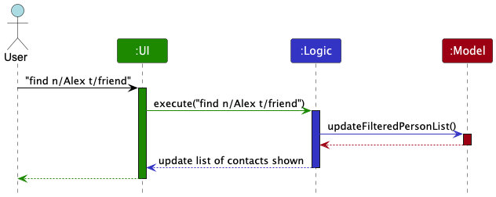

* Table of Contents
{:toc}

--------------------------------------------------------------------------------------------------------------------

## **Acknowledgements**

* This project is based on the [AddressBook-Level3](https://github.com/se-edu/addressbook-level3) project created by the [SE-EDU initiative](https://se-education.org). 
* This project uses a [LogFormatter](https://github.com/AY2425S1-CS2103T-W13-2/tp/blob/master/src/main/java/careconnect/commons/core/LogFormatter.java) 
that is adapted from Manuel Moser's implementation [here](https://stackoverflow.com/questions/53211694/change-color-and-format-of-java-util-logging-logger-output-in-eclipse).

--------------------------------------------------------------------------------------------------------------------

## **Setting up, getting started**

Refer to the guide [_Setting up and getting started_](SettingUp.md).

--------------------------------------------------------------------------------------------------------------------

## **Design**

<div markdown="span" class="alert alert-primary">

:bulb: **Tip:** `.puml` files are used to create diagrams in the `docs/diagrams` folder. Refer to the [_PlantUML Tutorial_ at se-edu/guides](https://se-education.org/guides/tutorials/plantUml.html) to learn how to create and edit diagrams.
</div>

### Architecture


The ***Architecture Diagram*** given above explains the high-level design of the App.

Given below is a quick overview of main components and how they interact with each other.

**Main components of the architecture**

**`Main`** (consisting of classes [`Main`](https://github.com/AY2425S1-CS2103T-W13-2/tp/blob/master/src/main/java/careconnect/Main.java) and [`MainApp`](https://github.com/AY2425S1-CS2103T-W13-2/tp/blob/master/src/main/java/careconnect/MainApp.java)) is in charge of the app launch and shut down.
* At app launch, it initializes the other components in the correct sequence, and connects them up with each other.
* At shut down, it shuts down the other components and invokes cleanup methods where necessary.

The bulk of the app's work is done by the following four components:

* [**`UI`**](#ui-component): The UI of the App.
* [**`Logic`**](#logic-component): The command executor.
* [**`Model`**](#model-component): Holds the data of the App in memory.
* [**`Storage`**](#storage-component): Reads data from, and writes data to, the hard disk.

[**`Commons`**](#common-classes) represents a collection of classes used by multiple other components.

**How the architecture components interact with each other**

The *Sequence Diagram* below shows how the components interact with each other for the scenario where the user issues the command `delete 1`.


Each of the four main components (also shown in the diagram above),

* defines its *API* in an `interface` with the same name as the Component.
* implements its functionality using a concrete `{Component Name}Manager` class (which follows the corresponding API `interface` mentioned in the previous point.

Note that there are also some commands which do not invole the storage component, and only updates the model to effect visual changes. For example, the `find` command



For example, the `Logic` component defines its API in the `Logic.java` interface and implements its functionality using the `LogicManager.java` class which follows the `Logic` interface. Other components interact with a given component through its interface rather than the concrete class (reason: to prevent outside component's being coupled to the implementation of a component), as illustrated in the (partial) class diagram below.


The sections below give more details of each component.

### UI component

The **API** of this component is specified in [`Ui.java`](https://github.com/AY2425S1-CS2103T-W13-2/tp/blob/master/src/main/java/careconnect/ui/Ui.java)


The UI consists of a `MainWindow` that is made up of parts e.g.`CommandBox`, `ResultDisplay`, 
`PersonListPanel`, `PersonDetailCard`, `StatusBarFooter` etc. All these, including the 
`MainWindow`, 
inherit from the abstract `UiPart` class which captures the commonalities between classes that represent parts of the visible GUI.

Each part consists of smaller components e.g. `PersonListPanel` consists of `PersonCard` and 
`PersonDetailCard` consist of `LogListPanel`.

The `UI` component uses the JavaFx UI framework. The layout of these UI parts are defined in matching `.fxml` files that are in the `src/main/resources/view` folder. For example, the layout of the [`MainWindow`](https://github.com/AY2425S1-CS2103T-W13-2/tp/blob/master/src/main/java/careconnect/ui/MainWindow.java) is specified in [`MainWindow.fxml`](https://github.com/AY2425S1-CS2103T-W13-2/tp/blob/master/src/main/resources/view/MainWindow.fxml)

The `UI` component,

* executes user commands using the `Logic` component.
* listens for changes to `Model` data so that the UI can be updated with the modified data.
* keeps a reference to the `Logic` component, because the `UI` relies on the `Logic` to execute commands.
* depends on some classes in the `Model` component, as it displays `Person` object residing in the `Model`.

### Logic component

**API** : [`Logic.java`](https://github.com/AY2425S1-CS2103T-W13-2/tp/blob/master/src/main/java/careconnect/logic/Logic.java)

Here's a (partial) class diagram of the `Logic` component:


The sequence diagram below illustrates the interactions within the `Logic` component, taking `execute("delete 1")` API call as an example.


<div markdown="span" class="alert alert-info">:information_source: **Note:** The lifeline for `TagCommandParser` should end at the destroy marker (X) but due to a limitation of PlantUML, the lifeline continues till the end of diagram.
</div>

How the `Logic` component works:

1. When `Logic` is called upon to execute a command, it is passed to an `AddressBookParser` object which in turn creates a parser that matches the command (e.g., `TagCommandParser`) and uses it to parse the command.
1. This results in a `Command` object (more precisely, an object of one of its subclasses e.g., `TagCommand`) which is executed by the `LogicManager`.
1. The command can communicate with the `Model` when it is executed (e.g. to set the person with the new tag).<br>
   Note that although this is shown as a single step in the diagram above (for simplicity), in the code it can take several interactions (between the command object and the `Model`) to achieve.
1. The result of the command execution is encapsulated as a `CommandResult` object which is returned back from `Logic`.

Here are the other classes in `Logic` (omitted from the class diagram above) that are used for parsing a user command:


How the parsing works:
* When called upon to parse a user command, the `AddressBookParser` class creates an `XYZCommandParser` (`XYZ` is a placeholder for the specific command name e.g., `AddCommandParser`) which uses the other classes shown above to parse the user command and create a `XYZCommand` object (e.g., `AddCommand`) which the `AddressBookParser` returns back as a `Command` object.
* All `XYZCommandParser` classes (e.g., `AddCommandParser`, `DeleteCommandParser`, ...) inherit from the `Parser` interface so that they can be treated similarly where possible e.g, during testing.

### Model component
**API** : [`Model.java`](https://github.com/AY2425S1-CS2103T-W13-2/tp/blob/master/src/main/java/careconnect/model/Model.java)


The `Model` component,

* stores the careconnect book data i.e., all `Person` objects (which are contained in a `UniquePersonList` object).
* stores the currently 'selected' `Person` objects (e.g., results of a search query) as a separate _filtered_ list which is exposed to outsiders as an unmodifiable `ObservableList<Person>` that can be 'observed' e.g. the UI can be bound to this list so that the UI automatically updates when the data in the list change.
* stores a `UserPref` object that represents the user’s preferences. This is exposed to the outside as a `ReadOnlyUserPref` objects.
* does not depend on any of the other three components (as the `Model` represents data entities of the domain, they should make sense on their own without depending on other components)

<div markdown="span" class="alert alert-info">:information_source: **Note:** An alternative (arguably, a more OOP) model is given below. It has a `Tag` list in the `AddressBook`, which `Person` references. This allows `AddressBook` to only require one `Tag` object per unique tag, instead of each `Person` needing their own `Tag` objects.<br>


</div>


### Storage component

**API** : [`Storage.java`](https://github.com/AY2425S1-CS2103T-W13-2/tp/blob/master/src/main/java/careconnect/storage/Storage.java)


The `Storage` component,
* can save both careconnect book data and user preference data in JSON format, and read them back into corresponding objects.
* inherits from both `AddressBookStorage` and `UserPrefStorage`, which means it can be treated as either one (if only the functionality of only one is needed).
* depends on some classes in the `Model` component (because the `Storage` component's job is to save/retrieve objects that belong to the `Model`)

### Common classes

Classes used by multiple components are in the `careconnect.commons` package.

--------------------------------------------------------------------------------------------------------------------

## **Implementation**

This section describes some noteworthy details on how certain features are implemented.

### Autocomplete Command

A `KeyEvent` listener is added to the `commandTextField` within the `CommandBox` to detect when the Tab key is pressed. When this event occurs, it triggers an autocomplete action. This action passes the current text from `commandTextField` to `Logic#autocompleteCommand(String)` via the `MainWindow#autocompleteCommand(String)` method to find appropriate autocomplete suggestions.

The `LogicManager`, which is a concrete implementation of `Logic`, holds a reference to an `Autocompleter` instance, responsible for generating autocomplete suggestions. Additionally, `LogicManager` maintains a list of all valid command options. To handle the autocomplete request, `LogicManager` calls `Autocompleter#autocompleteWithLexicalPriority(String, List)`, which searches for the lexicographically smallest command suggestion among the available options that match the specified prefix.

If a matching suggestion is found, `Autocompleter` returns it. If no match is found, `Autocompleter` throws an `AutocompleteException`. The result—either a valid suggestion or an exception—is then returned to `MainWindow`, where exception handling is managed. If a valid suggestion is provided, `MainWindow` updates the `commandTextField` with the suggested command, appending a space to facilitate further typing. If no suggestion is available (i.e., an exception occurs), feedback is displayed to inform the user that no matching options were found.

### \[Proposed\] Undo/redo feature

#### Proposed Implementation

<div markdown="span" class="alert alert-info">
:information_source: **Note:** 
Note that the usage of `AddressBook` in the naming scheme is because the app is still fundamentally an addressbook contact management app, not because it is a reference to AB3. 
As you will see, this naming scheme is consistent in the code to reduce confusion.

</div>


The proposed undo/redo mechanism is facilitated by `VersionedAddressBook`. It extends `AddressBook` with an undo/redo history, stored internally as an `addressBookStateList` and `currentStatePointer`. Additionally, it implements the following operations:

* `VersionedAddressBook#commit()` — Saves the current careconnect book state in its history.
* `VersionedAddressBook#undo()` — Restores the previous careconnect book state from its history.
* `VersionedAddressBook#redo()` — Restores a previously undone careconnect book state from its history.

These operations are exposed in the `Model` interface as `Model#commitAddressBook()`, `Model#undoAddressBook()` and `Model#redoAddressBook()` respectively.

Given below is an example usage scenario and how the undo/redo mechanism behaves at each step.

Step 1. The user launches the application for the first time. The `VersionedAddressBook` will be initialized with the initial careconnect book state, and the `currentStatePointer` pointing to that single careconnect book state.


Step 2. The user executes `delete 5` command to delete the 5th person in the careconnect book. The `delete` command calls `Model#commitAddressBook()`, causing the modified state of the careconnect book after the `delete 5` command executes to be saved in the `addressBookStateList`, and the `currentStatePointer` is shifted to the newly inserted careconnect book state.


Step 3. The user executes `add n/David …​` to add a new person. The `add` command also calls `Model#commitAddressBook()`, causing another modified careconnect book state to be saved into the `addressBookStateList`.
- Note that the command here is not complete. For the complete `add` command exmample, you can reference the [UG](https://ay2425s1-cs2103t-w13-2.github.io/tp/UserGuide.html#adding-a-client-add)


<div markdown="span" class="alert alert-info">:information_source: **Note:** If a command fails its execution, it will not call `Model#commitAddressBook()`, so the careconnect book state will not be saved into the `addressBookStateList`.

</div>

Step 4. The user now decides that adding the person was a mistake, and decides to undo that action by executing the `undo` command. The `undo` command will call `Model#undoAddressBook()`, which will shift the `currentStatePointer` once to the left, pointing it to the previous careconnect book state, and restores the careconnect book to that state.


<div markdown="span" class="alert alert-info">:information_source: **Note:** If the `currentStatePointer` is at index 0, pointing to the initial AddressBook state, then there are no previous AddressBook states to restore. The `undo` command uses `Model#canUndoAddressBook()` to check if this is the case. If so, it will return an error to the user rather
than attempting to perform the undo.

</div>

The following sequence diagram shows how an undo operation goes through the `Logic` component:


<div markdown="span" class="alert alert-info">:information_source: **Note:** The lifeline for `UndoCommand` should end at the destroy marker (X) but due to a limitation of PlantUML, the lifeline reaches the end of diagram.

</div>

Similarly, how an undo operation goes through the `Model` component is shown below:


The `redo` command does the opposite — it calls `Model#redoAddressBook()`, which shifts the `currentStatePointer` once to the right, pointing to the previously undone state, and restores the careconnect book to that state.

<div markdown="span" class="alert alert-info">:information_source: **Note:** If the `currentStatePointer` is at index `addressBookStateList.size() - 1`, pointing to the latest careconnect book state, then there are no undone AddressBook states to restore. The `redo` command uses `Model#canRedoAddressBook()` to check if this is the case. If so, it will return an error to the user rather than attempting to perform the redo.

</div>

Step 5. The user then decides to execute the command `list`. Commands that do not modify the careconnect book, such as `list`, will usually not call `Model#commitAddressBook()`, `Model#undoAddressBook()` or `Model#redoAddressBook()`. Thus, the `addressBookStateList` remains unchanged.


Step 6. The user executes `clear`, which calls `Model#commitAddressBook()`. Since the `currentStatePointer` is not pointing at the end of the `addressBookStateList`, all careconnect book states after the `currentStatePointer` will be purged. Reason: It no longer makes sense to redo the `add n/David …​` command. This is the behavior that most modern desktop applications follow.


The following activity diagram summarizes what happens when a user executes a new command:


#### Design considerations:

**Aspect: How undo & redo executes:**

* **Alternative 1 (current choice):** Saves the entire careconnect book.
  * Pros: Easy to implement.
  * Cons: May have performance issues in terms of memory usage.

* **Alternative 2:** Individual command knows how to undo/redo by
  itself.
  * Pros: Will use less memory (e.g. for `delete`, just save the person being deleted).
  * Cons: We must ensure that the implementation of each individual command are correct.

_{more aspects and alternatives to be added}_

### \[Proposed\] Data archiving

_{Explain here how the data archiving feature will be implemented}_


--------------------------------------------------------------------------------------------------------------------


## **Documentation, logging, testing, configuration, dev-ops**

* [Documentation guide](Documentation.md)
* [Testing guide](Testing.md)
* [Logging guide](Logging.md)
* [Configuration guide](Configuration.md)
* [DevOps guide](DevOps.md)


--------------------------------------------------------------------------------------------------------------------


## Planned Enhancements

### Improve user feedback during command confirmation
Currently, if the application is waiting for a command to be confirmed, users are not allowed to execute any other
command, and will be prompted to confirm by keying in 'y' or 'n' into the command box. However, the application will 
still attempt to parse the user's input and display a parse error message if the input is not a valid command. This
causes the previous command feedback to be overridden, which may lead to confusion for the user. This is not fixed in
the current version (v1.6) as the current behavior inconveniences the user but there is a way to work around it,
i.e., user will still be prompted to confirm his previous command. The application will prevent user from executing
any other command which is the correct behavior, it is just that the feedback provided might be confusing. Ideally, the
message requesting for confirmation should supersede any parse error message.

### Strengthen Duplicate Detection
We aim to enhance the robustness of duplicate detection. Currently, the system checks for exact string matches, which means a name like "John Doe" is treated as distinct from "john doe" due to case sensitivity. This approach is flawed because minor differences, such as capitalization, should not cause client profiles to be classified as distinct. To address this, we plan to implement fuzzy string matching, allowing the system to identify similar entries more effectively even if minor variations exist. Additionally, if a new user entry closely resembles an existing one, a warning will prompt the user to review before creating the new entry, reducing accidental duplicates.

### Enhance Log Scrolling Experience
We are also planning to improve the log scrolling experience. Currently, users may experience issues where not all parts of a log entry are visible due to two scenarios:
- **Long Logs**: When logs are lengthy, scrolling through them with the arrow keys causes the view to jump to the next log instead of continuing within the current log.
- **End-of-Log Visibility**: If the last log is active, and part of it is hidden from view, users cannot scroll further down to see the entire entry, as there are no additional logs to continue the scroll.

### Allow special character in names
Currently, names can only contain alphanumeric characters and spaces. As a result, valid real names like "XXX S/O YYY", "Robert Downey Jr." will be flagged as invalid names, preventing the user from adding contacts with these names into the application. 

To address these issues, we plan to refine the scrolling behavior to ensure smooth navigation within individual logs, regardless of length, and to enable full visibility of the last log entry when selected.

###  Improve User Experience with Edit Command 
Currently, after successful execution of the `edit` command, the user edited is not 
automatically selected, and any initially selected user is unselected after execution. This is an
inconsistent behaviour from other commands that we aim to improve. 


--------------------------------------------------------------------------------------------------------------------


## **Appendix: Requirements**

### Product scope

**Target user profile**:

Busy social workers providing community case management services at local social service agencies.
- Their role involves the need to keep track of, and follow up with multiple assigned clients, each with varying needs and requirements.

**Value proposition**: manage contacts faster than a typical mouse/GUI driven app
A CLI-first case management application that enables social workers to efficiently manage client details, appointments, and priorities.
- Repeated chores including data entry and search will be streamlined via simple CLI inputs, easing the mental load
of the social workers, allowing them to focus more on delivering high-quality care and support for the clients.

### User stories

Priorities: High (must have) - `* * *`, Medium (nice to have) - `* *`, Low (unlikely to have) - `*`

| Priority | As a …​                                   | I want to …​                             | So that I can…​                                                        |
|---------|-------------------------------------------|------------------------------------------|------------------------------------------------------------------------|
| `* * *` | new user                                  | see usage instructions                   | refer to instructions when I forget how to use the App                 |
| `* * *` | user                                      | add a new client                         | add new clients that I'm serving.                                      |
| `* * *` | user                                      | delete a beneficiary                     | remove entries that I no longer need                                   |
| `* * *` | user                                      | find a beneficiary by name               | locate details of persons without having to go through the entire list |
| `* * *` | user                                      | filter beneficiaries with varoius fields | quickly find beneficiaries based on address and tags                   |
| `* * *` | user                                      | update a beneficiary's information       | keep their records up to date                                          |
| `* * *`  | user with many clients                    | tag clients                              | categorize and organize them for easy filtering                        |
| `* * `  | user                                      | view a log of all actions taken on cases | audit user activity.                                                   |
| `* `    | user that prefers typing over mouse input | navigate the UI using keyboard           | use the app without moving to mouse                                    |
| `* `    | user                                      | sort the client list by various fields   | so that I can scroll through and check for clients that I missed       |

*{More to be added}*

### Use cases

(For all use cases below, the **System** is the `CareConnect` and the **Actor** is the `user`, unless specified otherwise)

**Use case: UC1 - Add New Beneficiary**

**MSS**

1.  User requests to add a new beneficiary with the relevant information.
2.  CareConnect confirms the new beneficiary has been added.

    Use case ends.

**Extensions**

* 1a. The user provides incomplete / invalid information.

    * 1a1. CareConnect displays an error message.

      Use case resumes at step 1.

**Use case: UC2 - List All Beneficiary Information**

**MSS**

1.  User requests to list beneficiaries
2.  CareConnect shows a list of beneficiaries to the user

    Use case ends.

**Extensions**

* 2a. The list is empty

    * 2a1. CareConnect shows that the list is empty.

      Use case ends.

**Use case: UC3 - Edit Beneficiary Information**

**MSS**

1.  User lists all beneficiary information <u>(as per UC2)</u>
2.  User requests to edit a specific beneficiary in the list with the new information
3.  CareConnect confirms the beneficiary information has been edited.

    Use case ends.

**Extensions**

* 2a. The given index is invalid.

    * 2a1. CareConnect shows an error message.

      Use case resumes at step 2.

* 2b. The user provides invalid information.

    * 2b1. CareConnect displays an error message.

      Use case resumes at step 2.

**Use case: UC4 - Delete Beneficiary Information**

**MSS**

1.  User lists all beneficiary information <u>(as per UC2)</u>
2.  User requests to delete a specific beneficiary in the list
3.  CareConnect deletes the beneficiary

    Use case ends.

**Extensions**

* 2a. The given index is invalid.

    * 2a1. CareConnect shows an error message.

      Use case resumes at step 2.

*{More to be added}*

### Non-Functional Requirements

1. Should work on any _mainstream OS_ as long as it has Java `17` or above installed.
2. Should be able to hold up to 1000 persons without a noticeable sluggishness in performance for typical usage.
3. Search queries should return results within 1 second for up to 500 contacts.
4. A user with above average typing speed for regular English text (i.e. not code, not system admin commands) should be able to accomplish most of the tasks faster using commands than using the mouse.
5. Data should be stored in an unencrypted flat file that can be edited by the user.
6. The product must be able to be used offline.
7. The product is not expected to handle _semantic search_.
8. The product is not expected to implement user authentication.
9. The product is not expected to handle more than one user at a time.
10. The product to designed to work on screen sizes of 1920x1080 pixels and above.
11. The product is only expected to handle reasonably sized inputs from the user correctly. The 
    following are considered maximum sizes for a reasonable input:
    - name: 100 characters
    - phone number: 20 characters
    - email: 100 characters
    - address: 100 characters
    - tags: 50 characters

### Glossary

* **Mainstream OS**: Windows, Linux, Unix, MacOS
* **Private contact detail**: A contact detail that is not meant to be shared with others
* **Semantic search**: A search technique that understands user intent by analyzing the meaning and context of terms, providing more relevant results than keyword-based search.


--------------------------------------------------------------------------------------------------------------------

## Appendix: Effort


This project has achieved many of the extensions we have set to accomplish on top of 
the functionalities provided by AB3.

Here are some of the best features we are proud of achieving and the effort required to 
implement them:


1. Syntax highlighting:
   - Difficulty level: 2/5
   - Challenges faced: Deciding on the conditions that should trigger a syntax highlight and separating the different cases using different colors.
   - Solved by: Using enum polymorphism to specify the different behaviors of the syntax 
     highlighter for three different cases.

2. Find feature:
   - Difficulty level: 2/5
   - Challenges faced: Previous predicate tests did not have condition checks that fit our needs 
     for using various fields as filters.
   - Solved by: Using polymorphism to extend predicate to implement custom checks to match 
     contacts that we want.

3. Auto-completion:
   - Difficulty level: 3/5
   - Challenges faced: Predicting the most likely command the user wants to execute.
   - Solved by: Store all possible commands and implementing a search function to return the 
       most likely command the user wants to execute.

4. Logging feature:
   - Difficulty level: 4/5
   - Challenges faced: Formatting the json file to support the logging feature. Updating the Ui to display the logs scrollable panel. Fixing timezone issues for the date of 
     the logs.
   - Solved by: Using a custom data structure and json parser to store and read the logs in a 
     json file. Implementing a scrollable panel in the Ui to display the logs. Standardizing the timezones for reading and writing the date of the logs.

5. Shortcut keys:
   - Difficulty level: 5/5
   - Challenges faced: Implementing the shortcut keys to work across the different components in 
     JavaFx. JavaFX did not allow propagating keystroke events from children to parent, which 
     meant that changes to the parent cannot be triggered by events like keystrokes and mouse 
     clicks on the children components.
   - Solved by: Using a custom key listener to listen for the shortcut keys in the parent component and executing the corresponding functions across different the children components.
--------------------------------------------------------------------------------------------------------------------

## **Appendix: Instructions for manual testing**

Given below are instructions to test the app manually.

<div markdown="span" class="alert alert-info">:information_source: **Note:** These instructions only provide a starting point for testers to work on;
testers are expected to do more *exploratory* testing.

</div>

### Launch and shutdown

1. Initial launch

   1. Ensure you have Java `17` or above installed on your computer.

   1. Download the latest `.jar` file from [here](https://github.com/AY2425S1-CS2103T-W13-2/tp/releases).

   1. Copy the file to the folder you want to use as the _home folder_ for your CareConnect application.

   1. Open a command terminal, `cd` into the folder you put the jar file in, and use the `java -jar careconnect.jar`
      command to run the application.<br>

1. Saving window preferences
   1. Note that CareConnect is best viewed in a **desktop** environment with **full screen**. You may see some
      content being cut-off if the window size is too small.

   1. Resize the window to an optimum size. Move the window to a different location. Close the window.

   1. Re-launch the app by double-clicking the jar file.<br>
      Expected: The most recent window size and location is retained.

1. _{ more test cases …​ }_

### Adding a person
1. Adding a person while all persons are being shown.

   1. Test case: `add n/John Doe p/98765432 e/johnd@example.com a/John street, block 123, #01-01`
      Expected: A new person named "John Doe" is added to the list. 
   
   2. Test case: `add n/John Doe p/98765432`
      Expected: No person is added due to missing parameters. Error details shown in the status 
      message.
      

### Editing a person
1. Editing a person while all persons are being shown.

   1. Prerequisites: Having at least one contact listed. No other contacts with the same 
      name used for the edit.

   1. Test case: `edit 1 n/John Smith`<br>
      Press `y` to confirm.<br>
      Expected: The name of the first person is updated to "John Smith". 

   1. Test case: `edit x` (where x is larger than the number of listed contacts)<br>
      Expected: No person is edited. Error details shown in the status message.

### Deleting a person

1. Deleting a person while all persons are being shown.

   1. Prerequisites:  Having at least one contact listed.

   1. Test case: `delete 1`<br>
      Press `y` to confirm.<br>
      Expected: First contact is deleted from the list. Details of the deleted contact shown in the status message. Timestamp in the status bar is updated.

   1. Other incorrect delete commands to try: `delete x` (where x is larger than the number of listed contacts)<br>
      Expected: No person is deleted. Error details shown in the status message.

### Adding a tag

1. Adding a tag for a person

    1. Prerequisites: Having at least one contact listed. The tag "friend" is not already 
       present in the first person's tag list.
   
    1. Test case: `tag 1 t/friend`<br>
       Expected: A tag "friend" is added to the first person in the list.

    1. Test case: `tag 1 t/friend!`<br>
       Expected: No tag is added due to incorrect tag format. Error message shown in the 
         status message.

### Removing a tag

1. Removing a tag for a person

    1. Prerequisites: Having at least one contact listed. The tag "friend" is already 
present in the first person's tag list. The tag "family" is not present in the first person's tag list.

    1. Test case: `untag 1 t/friend`<br>
       Press `y` to confirm.<br>
       Expected: The tag "friend" is removed from the first person in the list.

    1. Test case: `untag 1 t/family`<br>
       Expected: No tag is removed due to non-existent tag. Error message shown in the status 
       message.

### Setting an appointment

1. Setting an appointment for a person.

   1. Prerequisites: Having at least one contact listed.
   
   1. Test case: `setappointment 1 d/2022-10-10`<br>
      Expected: An appointment on 2022-10-10 is set for the first person in the list.

   1. Test case: `setappointment 1 d/2022/10/10`<br>
      Expected: No appointment is set due to incorrect date format. Error message shown in the 
      status message.

### Finding a person

1. Finding and listing only persons with matching information.

   1. Prerequisites: Having at least one contact with name, tag, or address that contains the 
      substring used for the search. 

   Change the substrings according to the profiles available in your contacts.
   1. Test case: `find n/Jo`<br>
      Expected: Only persons with "Jo" in their name are shown. 

   1. Test case: `find t/friend`<br>
      Expected: Only persons with "friend" in their tag names are shown.

   1. Test case: `find`
      Expected: Displayed list should not change. Error message shown in the status message.

### Adding a log for a person

1. Adding a log for a person with a date.

   1. Prerequisites: Having at least one contact listed.

   1. Test case: `addlog 1 r/John visited the clinic today d/2022-10-11 14:00`<br>
      Expected: A log "John visited the clinic today" dated 2022-10-11 14:00 is added to the first person in the 
      list.

   1. Test case: `addlog x r/John visited the clinic today!` (where x is larger than the number of listed contacts)<br>
      Expected: No person is deleted. Error details shown in the status message.

### Deleting a log for a person

1. Deleting an exiting log for a person.

   1. Prerequisites: Having at least one contact listed with at least one log.

   1. Test case: `deletelog 1 l/1`<br> 
      Press `y` to confirm.<br>
      Expected: The first log of the first person is deleted. Details of the deleted log shown in the status message.

   1. Test case: `deletelog x y` (where x is larger than the number of listed contacts **or** y is 
      larger than the number of logs for the first person)<br>
      Expected: No log is deleted. Error details shown in the status message.


### Saving data

CareConnect data are saved automatically as a JSON file `[JAR file location]/data/addressbook.
json`. 
- Advanced testers are welcome to update data directly by editing that data file.
- If changes to the data file makes its format invalid, CareConnect will discard all data and 
start with an empty data file at the next run. <br>

To test this, you can intentionally edit the data file to make it invalid, and then run the app 
to see if it continues to start properly with an empty data file without the contact named Alice 
Pauline.
- Copy the following into your data/addressbook.json file:
```json
{
  "persons": [
    {
      "name": "Alice Pauline",
      "phone": "94351253"
    }
  ]
}
```

<div style="page-break-after: always"></div>

