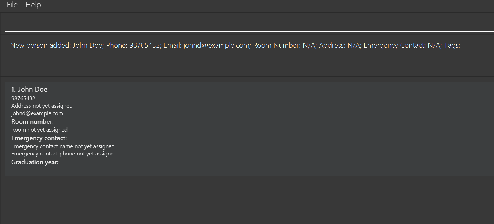
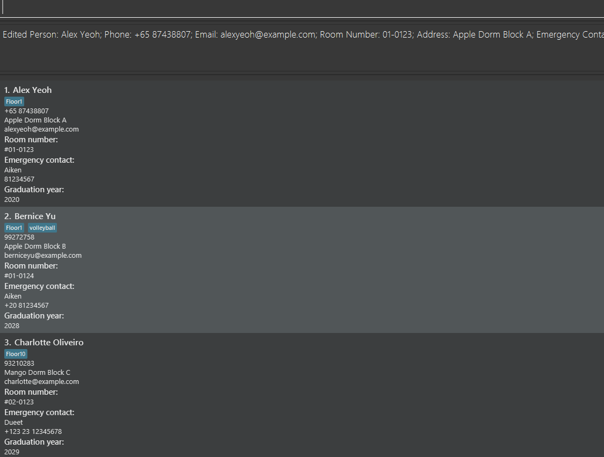
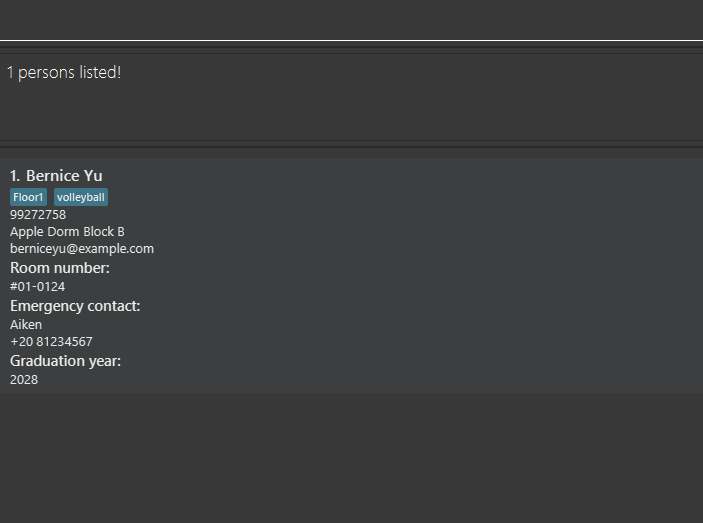
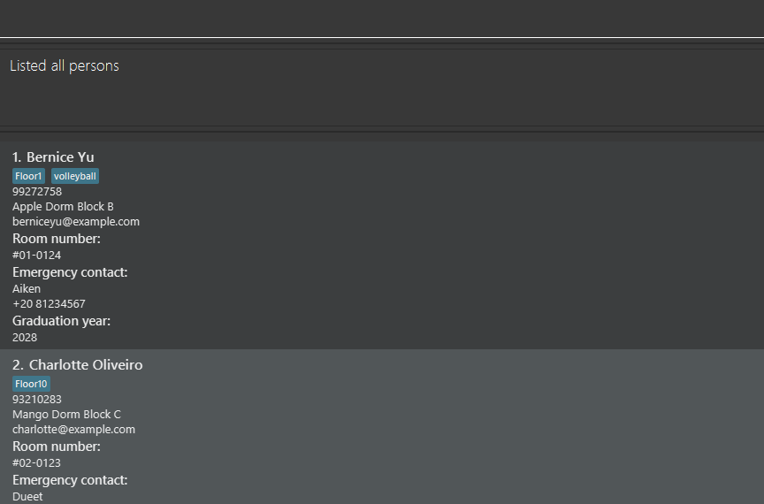

# DorManagerPro Developer Guide

<!-- * Table of Contents -->
<page-nav-print />

--------------------------------------------------------------------------------------------------------------------

## **Acknowledgements**

- GitHub copilot was used by Li Yifeng as an auto-complete tool during most of the coding.

--------------------------------------------------------------------------------------------------------------------

## **Setting up, getting started**

Refer to the guide [_Setting up and getting started_]&#40;SettingUp.md&#41;.

--------------------------------------------------------------------------------------------------------------------

## **Design**

### Architecture

<puml src="diagrams/ArchitectureDiagram.puml" width="280" />

The ***Architecture Diagram*** given above explains the high-level design of the App.

Given below is a quick overview of main components and how they interact with each other.

**Main components of the architecture**

**`Main`** (consisting of classes [`Main`](https://github.com/se-edu/addressbook-level3/tree/master/src/main/java/seedu/address/Main.java) and [`MainApp`](https://github.com/se-edu/addressbook-level3/tree/master/src/main/java/seedu/address/MainApp.java)) is in charge of the app launch and shut down.
* At app launch, it initializes the other components in the correct sequence, and connects them up with each other.
* At shut down, it shuts down the other components and invokes cleanup methods where necessary.

The bulk of the app's work is done by the following four components:

* [**`UI`**](#ui-component): The UI of the App.
* [**`Logic`**](#logic-component): The command executor.
* [**`Model`**](#model-component): Holds the data of the App in memory.
* [**`Storage`**](#storage-component): Reads data from, and writes data to, the hard disk.

[**`Commons`**](#common-classes) represents a collection of classes used by multiple other components.

**How the architecture components interact with each other**

The *Sequence Diagram* below shows how the components interact with each other for the scenario where the user issues the command `delete 1`.

<puml src="diagrams/ArchitectureSequenceDiagram.puml" width="574" />

Each of the four main components (also shown in the diagram above),

* defines its *API* in an `interface` with the same name as the Component.
* implements its functionality using a concrete `{Component Name}Manager` class (which follows the corresponding API `interface` mentioned in the previous point.)

For example, the `Logic` component defines its API in the `Logic.java` interface and implements its functionality using the `LogicManager.java` class which follows the `Logic` interface. Other components interact with a given component through its interface rather than the concrete class (reason: to prevent outside component's being coupled to the implementation of a component), as illustrated in the (partial) class diagram below.

<puml src="diagrams/ComponentManagers.puml" width="300" />

The sections below give more details of each component.

### UI component

The **API** of this component is specified in [`Ui.java`](https://github.com/se-edu/addressbook-level3/tree/master/src/main/java/seedu/address/ui/Ui.java)

<puml src="diagrams/UiClassDiagram.puml" alt="Structure of the UI Component"/>

The UI consists of a `MainWindow` that is made up of parts e.g.`CommandBox`, `ResultDisplay`, `PersonListPanel`, `StatusBarFooter` etc. All these, including the `MainWindow`, inherit from the abstract `UiPart` class which captures the commonalities between classes that represent parts of the visible GUI.

The `UI` component uses the JavaFx UI framework. The layout of these UI parts are defined in matching `.fxml` files that are in the `src/main/resources/view` folder. For example, the layout of the [`MainWindow`](https://github.com/se-edu/addressbook-level3/tree/master/src/main/java/seedu/address/ui/MainWindow.java) is specified in [`MainWindow.fxml`](https://github.com/se-edu/addressbook-level3/tree/master/src/main/resources/view/MainWindow.fxml)

The `UI` component,

* executes user commands using the `Logic` component.
* listens for changes to `Model` data so that the UI can be updated with the modified data.
* keeps a reference to the `Logic` component, because the `UI` relies on the `Logic` to execute commands.
* depends on some classes in the `Model` component, as it displays `Person` object residing in the `Model`.

### Logic component

**API** : [`Logic.java`](https://github.com/se-edu/addressbook-level3/tree/master/src/main/java/seedu/address/logic/Logic.java)

Here's a (partial) class diagram of the `Logic` component:

<puml src="diagrams/LogicClassDiagram.puml" width="650"/>

The sequence diagram below illustrates the interactions within the `Logic` component, taking `execute("delete 1")` API call as an example.

<puml src="diagrams/DeleteSequenceDiagram.puml" alt="Interactions Inside the Logic Component for the `delete 1` Command" />

<box type="info" seamless>

**Note:** The lifeline for `DeleteCommandParser` should end at the destroy marker (X) but due to a limitation of PlantUML, the lifeline continues till the end of diagram.

</box>

How the `Logic` component works:

1. When `Logic` is called upon to execute a command, it is passed to an `AddressBookParser` object which in turn creates a parser that matches the command (e.g., `DeleteCommandParser`) and uses it to parse the command.
2. This results in a `Command` object (more precisely, an object of one of its subclasses e.g., `DeleteCommand`) which is executed by the `LogicManager`.
3. The command can communicate with the `Model` when it is executed (e.g. to delete a person). Certain types of commands (FileAccessCommand) can also communicate with the `Storage` when it is executed. 
   Note that although this is shown as a single step in the diagram above (for simplicity), in the code it can take several interactions (between the command object `Model` and `Storage`) to achieve.
4. The result of the command execution is encapsulated as a `CommandResult` object which is returned back from `Logic`.

Here are the other classes in `Logic` (omitted from the class diagram above) that are used for parsing a user command:

<puml src="diagrams/ParserClasses.puml" width="600"/>

How the parsing works:
* When called upon to parse a user command, the `AddressBookParser` class creates an `XYZCommandParser` (`XYZ` is a placeholder for the specific command name e.g., `AddCommandParser`) which uses the other classes shown above to parse the user command and create a `XYZCommand` object (e.g., `AddCommand`) which the `AddressBookParser` returns back as a `Command` object.
* All `XYZCommandParser` classes (e.g., `AddCommandParser`, `DeleteCommandParser`, ...) inherit from the `Parser` interface so that they can be treated similarly where possible e.g, during testing.

### Model component

**API** : [`Model.java`]&#40;https://github.com/se-edu/addressbook-level3/tree/master/src/main/java/seedu/address/model/Model.java&#41;

<puml src="diagrams/ModelClassDiagram.puml" width="450" />

The `Model` component,

* stores the address book data i.e., all `Person` objects (which are contained in a `UniquePersonList` object).
* stores the currently 'selected' `Person` objects (e.g., results of a search query) as a separate _filtered_ list which is exposed to outsiders as an unmodifiable `ObservableList<Person>` that can be 'observed' e.g. the UI can be bound to this list so that the UI automatically updates when the data in the list change.
* stores a `UserPref` object that represents the user’s preferences. This is exposed to the outside as a `ReadOnlyUserPref` objects.
* stores a history of undoable commands executed successfully by the user, which allows the user to undo commands.
* only depends on the Logic component due to the undo feature.

<box type="info" seamless>

**Note:** An alternative (arguably, a more OOP) model is given below. It has a `Tag` list in the `AddressBook`, which `Person` references. This allows `AddressBook` to only require one `Tag` object per unique tag, instead of each `Person` needing their own `Tag` objects. 

<puml src="diagrams/BetterModelClassDiagram.puml" width="450" />

</box>

### Storage component

**API** : [`Storage.java`]&#40;https://github.com/se-edu/addressbook-level3/tree/master/src/main/java/seedu/address/storage/Storage.java&#41;

<puml src="diagrams/StorageClassDiagram.puml" width="550" />

The `Storage` component,
* can save both address book data and user preference data in JSON format, and read them back into corresponding objects.
* inherits from both `AddressBookStorage` and `UserPrefStorage`, which means it can be treated as either one (if only the functionality of only one is needed).
* depends on some classes in the `Model` component (because the `Storage` component's job is to save/retrieve objects that belong to the `Model`)

### Common classes

Classes used by multiple components are in the `seedu.address.commons` package.

--------------------------------------------------------------------------------------------------------------------

## **Implementation**

This section describes some noteworthy details on how certain features are implemented.

### Add feature

#### Implementation

The `add` command extends `Command` and implements `Undoable`. The `add` command adds a contact based on the supplied parameters, of which
`NAME`, `PHONE`, and `EMAIL` are compulsory while `ADDRESS`, `ROOM_NUMBER`, and `TAG` are optional.
The `add` command is undoable.

Given below is an example usage scenario and how the `add` command behaves at each step.

Step 1. The user executes `add n/John Doe p/+65 98765432 e/johnd@example.com r/01-1008 a/John street t/Floor 1`.

<box type="info" seamless>

 **Note:** An error message will be displayed if attempting to add a contact with duplicate `NAME`, `PHONE` or `EMAIL`.

</box>

Step 2. The `add` command adds a contact with the name John Doe, phone number +65 98765432, email johnd@example.com, room number #01-1008, address John street, tag "Floor 1" to the address book.

The following sequence diagram shows how an `add` command goes through the `Logic` component:

<puml src="diagrams/AddSequenceDiagram.puml" alt="AddSequenceDiagram" />

<box type="info" seamless>

**Note:** There are no destroy markers (X) for `AddCommand` as it is preserved in the `undo` command stack.

</box>

The following activity diagram summarizes what happens when a user executes a `add` command:

<puml src="diagrams/AddActivityDiagram.puml" height="900" width="1000" />

### Edit feature

#### Implementation

The `edit` command extends `Command` and implements `Undoable`. The `edit` command updates an existing contact based on the supplied index and parameters, of which
only the `INDEX` supplied, as well as any one field to update is compulsory.
The `edit` command is undoable.

Given below is an example usage scenario and how the `edit` command behaves at each step.

Step 1. The user executes `edit 1 n/John Doe p/+65 98765432`. 

<box type="info" seamless>

**Note:** An error message will be displayed if attempting to edit a contact to have with duplicate `NAME`, `PHONE` or `EMAIL`.

</box>

Step 2. The `edit` command updates the details of the contact with index 1 to have the name John Doe and phone number +65 98765432.

The following sequence diagram shows how an `edit` command goes through the `Logic` component:

<puml src="diagrams/EditSequenceDiagram.puml" alt="EditSequenceDiagram" />
<box type="info" seamless>

**Note:** There are no destroy markers (X) for `EditCommand` as it is preserved in the `undo` command stack.

The following activity diagram summarizes what happens when a user executes a `edit` command:

<puml src="diagrams/EditActivityDiagram.puml" height="900" width="1000" />

### Delete Command

#### Implementation

The `delete` command extends `Command` and implements `Undoable`. The `delete` command deletes a contact based on its index. The `delete` command is undoable.

Given below is an example usage scenario and how the `delete` command behaves at each step.

Step 1. The user input a delete command followed by an index. For example: `delete 1` deletes the contact with an index of 1.

Step 2. The parser parses the input command and returns a `DeleteCommand`.

Step 3. The `DeleteCommand` is executed by the LogicManager and delete popup get displayed.

Step 4. If user click `Ok` on the pop-up, model updates the filteredPersonList and removes the contact, otherwise cancel the deletion.

The following sequence diagram shows how a `delete` command goes through the `Logic` component:

<puml src="diagrams/DeleteSequenceDiagram.puml" alt="Interactions inside the Logic Component for the `delete 1` Command"/>

The following activity diagram summarizes the delete pop-up mechanism:

<puml src="diagrams/DeletePopupActivityDiagram.puml" alt="Popup interactions inside the Logic Component for the `delete 1` Command"  height="500" width="800"/>

### Clean feature

#### Implementation

The `clean` command extends `Command` and implements `Undoable`. The `clean` command deletes the contacts whose `GradYear` field is earlier than the current year, deleting contacts who have graduated from the address book. The `clean` command is undoable.

Given below is an example usage scenario and how the `clean` command behaves at each step.

Step 1. The user executes `clean` in 2024.
<box type="info" seamless>

 **Note:** The `clean` command checks if there are contacts with `GradYear` 2023 or earlier. If there are none, it will return an error message to the user.
</box>

Step 2. The `clean` command deletes all contacts with `GradYear` 2023 or earlier.

The following sequence diagram shows how a `clean` command goes through the `Logic` component:

<puml src="diagrams/CleanSequenceDiagram.puml" alt="CleanSequenceDiagram-Logic" />

<box type="info" seamless>

**Note:** There are no destroy markers (X) for `CleanCommand` and `GradYearPredicate` as they are preserved in the `undo` command stack.

</box>

The following activity diagram summarizes what happens when a user executes a `clean` command:

<puml src="diagrams/CleanActivityDiagram.puml" height="500" width="800" />

#### Design considerations:

**Aspect: UI display when `clean` executes after a `find` command:**

* **Alternative 1:** Display all contacts.
    * Pros: Shows users the full result of `clean`.
    * Cons: Forgets the results of the `find` command.

* **Alternative 2 (current implementation):** Retain the search results of `find` and only display those contacts.
    * Pros: Allow users to retain their serach results from `find`.
    * Cons: Users cannot see the full extent of `clean` until they return to the default view with `list`.

### Find Command

#### Implementation

The `find` command extends `Command` and implements `Undoable`. The `find` command searches and filters the contacts based on the following parameters: `NAME`, `PHONE`, `ROOM_NUMBER`, and `TAG`.The find command is undoable.

Given below is an example usage scenario and how the `find` command behaves at each step.

Step 1. The user issues a `find` command followed by specific parameters.
For example: `t/friends n/Alex r/08-0805 p/9124 6892`, searches for a profile with a 
tag of friends, a name called Alex, a room number of 08-0805, and a phone number of 9124 6842.

<box type="info" seamless>

 **Note** : These parameters can be combined in any sequence, allowing for versatile parameter configurations. 

</box>

Step 3. The `FindCommand` get executed and updates the filteredPersonList within the model, reflecting the search.

results based on the specified criteria.

<puml src="diagrams/FindSequenceDiagram.puml" alt="FindSequenceDiagram" height="900" width="1000"/>

### Export feature

### Implementation

The `export` command extends `Command`. The `export` command exports the data into a new file.

Given below is an example usage scenario and how the `export` command behaves at each step.

Step 1: The user executes `export`.

Step 2: The `export` command exports all data currently contained by DorManagerPro to a JSON file in the data folder. The name of the JSON file is the time of export.

The following sequence diagram shows how a `export` command goes through the `Logic` component:

### Design considerations:

**Aspect**: The name of the JSON file on `export`.

* **Alternative 1:** Use a generic format such as `SAVE_FILE_1`, `SAVE_FILE_2`.
    * Pros: Easy for the user to know at first glance which save file was created latest as well as the chronological order of their creation.
    * Cons: Does not tell the user at what time they actually exported the save file or contents of the save file.

* **Alternative 2 (current implementation):** The time of the device's system at the moment of `export`.
    * Pros: Allows for pinpoint of exact save files as no two files can be exported at the same time.
    * Cons: Takes longer to manually understand the name of the save file when trying to locate a specific one, especially when multiple `exports` happen within a short peri            od of time. Also has no mention of contents of JSON file.

* **Alternative 3:** A brief summary of the file such as `FIRST-Alex_Jones LENGTH-20`.
    * Pros: Easy for the user to know at first glance what the contents of each file are.
    * Cons: Does not tell the user at what time they actually exported the save file. Also has no indication of the chronology of creation of the files, and hence no information on which file was the last to be created. Additionally, it would become complicated when exporting files with similar data.

### Import feature

### Implementation

The `import` command implements `Undoable`. The `import` imports a file to be loaded into DorManagerPro. The `import` command is undoable.

Given below is an example usage scenario and how the `import` command behaves at each step.

Step 1. The user executes `import fp/./data/SaveFile3.json`

Step 2. The

The following sequence diagram shows how a `import` command goes through the `Logic` component:

### Design considerations:

**Aspect: The exact format of the `FILE_PATH` parameter**

* **Alternative 1:** Take in only the name of the JSON file in the data folder of the home folder.
    * Pros: Shorter command for the user to type. It is also considerably less complicated than alternative 2, making it more accessible to non-technical users.
    * Cons: Limits the ability of import to only the contents of the data folder. Also requires user to move any JSON file they may want to `import` into the data folder.

* **Alternative 2 (current implementation):** Require the user to type in the full file path of the JSON file they wish to `import`.
    * Pros: Allow greater flexibility for user to import JSON files from any location of the device.
    * Cons: Significantly longer command for the user to type. Requires user to have prior knowledge of what the JSON's filepath is, increasing complexity.

### Undo feature

#### Implementation

The undo mechanism is facilitated by the interface `Undoable`.
It has the `undo()` method. The `undo()` method is called when the user executes the `undo` command.
The `undo()` method reverses the effects of the command that was previously executed.
The `undo()` method is implemented in the undoable command classes, such as `AddCommand`, `DeleteCommand`, `EditCommand`, etc.

The `Model` component stores a history of executed undoable commands in a stack.
When a command is executed successfully, the command is pushed onto the stack.
When the user executes the `undo` command, the `Model` component pops the last command from the stack and calls the `undo()` method of the command.

These operations are exposed in the `Model` interface as `Model#pushToUndoStack()` and `Model#undoAddressBook()`.

Given below is an example usage scenario and how the undo mechanism behaves at each step.

Step 1. The user launches the application for the first time. The undo stack is initialised as empty.

Step 2. The user executes `delete 5` command to delete the 5th person in the address book. The `delete` command is pushed onto the undo stack.

Step 3. The user executes `add n/David …​` to add a new person. The `add` command is also pushed onto the undo stack.

<box type="info" seamless>
 
**Note:** If a command is not undoable or fails its execution, it will not be pushed onto the undo stack.
Step 4. The user now decides that adding the person was a mistake, and decides to undo that action by executing the `undo` command. The `undo` command will call `Model#undoAddressBook()`, which will pop the last command from the undo stack and call its `undo()` method. The `undo()` method of the command will then reverse the effects of the command.
 

**Note:** If the undo stack is empty, then there are no commands to undo. The `undo` command checks if this is the case. If so, it will return an error to the user.
</box>

The following sequence diagram shows how an undo operation goes through the `Logic` component:
<puml src="diagrams/UndoSequenceDiagram-Logic.puml" alt="UndoSequenceDiagram-Logic" />

<box type="info" seamless>

**Note:** The lifeline for `UndoCommand` should end at the destroy marker (X) but due to a limitation of PlantUML, the lifeline reaches the end of diagram.
</box>

Similarly, how an undo operation goes through the `Model` component is shown below:

<puml src="diagrams/UndoSequenceDiagram-Model.puml" alt="UndoSequenceDiagram-Model" />

Step 5. The user then decides to execute the command `list`. Commands that do not modify the address book, such as `list`, will not be pushed to the undo stack. Thus, the undo stack remains unchanged.

Step 6. The user executes `clear`, which is pushed to the undo stack.

The following activity diagram summarizes what happens when a user executes a new command:

<puml src="diagrams/CommitActivityDiagram.puml" height="400" width="400"/>

#### Design considerations:

**Aspect: How undo executes:**

* **Alternative 1:** Saves the entire address book.
  * Pros: Easy to implement.
  * Cons: May have performance issues in terms of memory usage.

* **Alternative 2 (current implementation):** Individual command knows how to undo by itself.
  * Pros: Will use less memory (e.g. for `delete`, just save the person being deleted).
  * Cons: We must ensure that the implementation of each individual command are correct.

--------------------------------------------------------------------------------------------------------------------

## **Documentation, logging, testing, configuration, dev-ops**

* [Documentation guide](Documentation.md)
* [Testing guide](Testing.md)
* [Logging guide](Logging.md)
* [Configuration guide](Configuration.md)
* [DevOps guide](DevOps.md)

--------------------------------------------------------------------------------------------------------------------

## **Appendix: Requirements**

### Product scope

**Target user profile**: University dormitory manager (teacher residents or admins at Dorm Halls)

* has a need to manage a significant number of student contacts
* prefer desktop apps over other types
* has experience and prefers using CLI apps

**Value proposition**: Provide fast and centralised access to vital resident information.

* keeps track of residents' contact details
* manages room number and roles of residents
* allows for quick input of details and querying by different conditions for dorm managers of large dorms.

### User stories

Priorities: High (must have) - `* * *`, Medium (nice to have) - `* *`, Low (unlikely to have) - `*`

| Priority | As a …​                   | I want to …​                                                 | So that I can…​                                                        |
|----------|---------------------------|--------------------------------------------------------------|------------------------------------------------------------------------|
| `* * *`  | forgetful dorm manager    | see usage instructions                                       | refer to instructions when I forget how to use the App                 |
| `* * *`  | dorm manager              | add a new contact                                            | keep track of students in my dorm                                      |
| `* * *`  | dorm manager              | delete a contact                                             | remove entries when residents leave the dorm to prevent clutter        |
| `* * *`  | dorm manager              | view contacts                                                |                                                                        |
| `* * *`  | dorm manager              | see emergency contacts of my residents                       | act quickly in the event of an emergency                               |
| `* * *`  | strict dorm manager       | know my residents' room number                               | go check on them                                                       |
| `* *`    | bustling dorm manager     | find a contact by their details (eg. name, room)             | locate contacts without having to go through the entire list           |
| `* *`    | dorm manager              | edit a contact                                               | update contact details                                                 |
| `* *`    | clumsy dorm manager       | undo my actions                                              | restore information if I accidentally delete them                      |
| `* *`    | dorm manager              | give roles (responsibilities) to my residents                | foster communal living                                                 |
| `* *`    | forgetful dorm manager    | keep track of the roles of my residents (eg. RA, CCA leader) | know their responsibilities                                            |
| `* *`    | dorm manager              | find residents with certain roles (eg. RA, CCA leader)       | view and contact them as a group                                       |
| `* *`    | impatient dorm manager    | load / save all resident details to a file                   | avoid typing in each resident's details                                |
| `*`      | dorm manager              | sort contacts by name, room number                           | locate a contact easily                                                |
| `*`      | forgetful dorm manager    | search by partial matches                                    | find contacts without memorising their full name                       |
| `*`      | neat dorm manager         | group residents by block, floor, cluster, year               | keep contacts organised in specific groups                             |
| `*`      | dorm manager              | filter search results by roles or groups                     | find contacts in specific groups quickly                               |
| `*`      | dorm manager              | view a summary of resident groups                            | get an overview of the dorm population                                 |
| `*`      | dorm manager              | keep track of demerit points of my residents                 | evict them when needed                                                 |
| `*`      | anxious dorm manager      | know the phone, email and home address of my residents       | contact residents through multiple channels in case they don't respond |
| `*`      | thoughtful dorm manager   | know the major of my residents                               | provide care and support during stressful periods                      |
| `*`      | wholesome dorm manager    | know the clubs of my residents                               | support their arts showcases / sports competitions                     |
| `*`      | enthusiastic dorm manager | know the food preferences of my residents                    | prepare welfare packs for them                                         |
| `*`      | dorm manager              | know the medical conditions of my residents                  | provide timely medical assistance                                      |
| `*`      | dorm manager              | know the nationality of my residents                         | better respect their culture                                           |
| `*`      | thoughtful dorm manager   | add a small description of each resident                     | note the quirks and interests of each resident                         |
| `*`      | dorm manager              | keep the commands short and powerful                         | use it effectively with CLI experience                                 |

### Use cases

(For all use cases below, the **System** is `DorManagerPro`, and the **Actor** is the `user` who refers to university dormitory managers unless specified otherwise.)

**Use Case: UC01 - Add a profile**

**MSS:**

1. User requests to add a specific profile, specifying name, contact number and email address.
2. DorManagerPro adds the profile.

   Use case ends.

**Extensions:**

* 1a. DorManagerPro detects an error in the command format.
    * 1a1. DorManagerPro requests for the correct command format.
    * 1a2. User enters command again.

  Steps 1a1-1a2 are repeated until the command is correct.
  Use case resumes from step 2.

* 1c. DorManagerPro detects that the specified profile already exists.
    * 1c1. DorManagerPro informs the user and asks for another profile to add.
    * 1c2. User specifies another profile to add.

  Steps 1c1-1c2 are repeated until a valid profile is indicated.
  Use case resumes from step 2.

* 1d. DorManagerPro detects invalid parameters specified by user.
    * 1d1. DorManagerPro requests for valid parameters.
    * 1d2. User re-supplies parameters.

  Steps 1d1-1d2 are repeated until the parameters are valid.
  Use case resumes from step 2.

* *a. At any time, User chooses to stop adding a profile.

  Use case ends.

**Use Case: UC02 - Edit profile**

**Precondition: There is at least one profile added into DorManagerPro.**

**MSS:**

1. User requests to edit or add additional information for a specific profile. This can be the name, phone number, email address, address, emergency contact details, graduation year or tags.
2. DorManagerPro updates the profile with the new or updated information.

   Use case ends.

**Extensions:**

* 1a. DorManagerPro detects an error in the command format.
    * 1a1. DorManagerPro requests for the correct command format.
    * 1a2. User enters command again.

  Steps 1a1-1a2 are repeated until the command is correct.
  Use case resumes from step 2.

* 1b. DorManagerPro cannot find the specified profile to update.
    * 1b1. DorManagerPro requests for a profile that exists to update.
    * 1b2. User specifies profile again.

  Steps 1b1-1b2 are repeated until the command is correct.
  Use case resumes from step 2.

* 1c. DorManagerPro detects invalid parameters specified by user.
    * 1c1. DorManagerPro requests for valid parameters.
    * 1c2. User re-supplies parameters.

  Steps 1c1-1c2 are repeated until the parameters are valid.
  Use case resumes from step 2.

* *a. At any time, User chooses to stop editing.

  Use case ends.

**Use Case: UC03 - Delete all graduated students**

**Precondition: There is at least one graduated student profile added into DorManagerPro.**

**MSS:**

1. User requests to delete all graduated students from the DorManagerPro address book.
2. DorManagerPro deletes all students with graduation years earlier than the current year.

   Use case ends.

**Extensions:**

* 1a. DorManagerPro detects an error in the command format.
    * 1a1. DorManagerPro requests for the correct command format.
    * 1a2. User enters command again.

  Steps 1a1-1a2 are repeated until the command is correct.
  Use case resumes from step 2.

* 1b. DorManagerPro cannot find any students who have graduated.
    * 1b1. DorManagerPro displays an error message informing the user all students in the address book have yet to graduate.

  Use case ends.

* *a. At any time, User chooses to stop deleting all graduated students.

  Use case ends.

**Use Case: UC04 - View profiles**

**Precondition: There is at least one profile added into DorManagerPro.**

**MSS:**

1. User requests to view all profiles.
2. DorManagerPro displays all profiles.
3. User requests to view certain profiles based on the profiles features (tags, roomNumber, number, name).
4. DorManagerPro displays all profiles with all attached information.

   Use case ends.

**Extensions:**

* 1a. DorManagerPro detects an error in the command format.
    * 1a1. DorManagerPro requests for the correct command format.
    * 1a2. User enters command again.

  Steps 1a1-1a2 are repeated until the command is correct.
  Use case resumes from step 2.

* 3a. DorManagerPro detects an error in the command format.
  * 3a1. DorManagerPro requests for the correct command format.
  * 3a2. User enters command again.

  Steps 3a1-3a2 are repeated until the command is correct.
  Use case resumes from step 4.

* *a. At any time, User chooses to stop viewing a profile.

  Use case ends.

**Use Case: UC05 - Delete a profile**

**Precondition: There is at least one profile added into DorManagerPro.**

**MSS:**

1. User requests to delete a specific profile.
2. DorManagerPro asks if user to confirm they want to delete the profile.
3. User confirms.
4. DorManagerPro deletes the profile.

   Use case ends.

**Extensions:**

* 1a. DorManagerPro detects an error in the command format.
    * 1a1. DorManagerPro requests for the correct command format.
    * 1a2. User enters command again.

  Steps 1a1-1a2 are repeated until the command is correct.
  Use case resumes from step 2.

* 1b. DorManagerPro cannot find the specified profile to delete.
    * 1b1. DorManagerPro requests for a profile that exists to delete.
    * 1b2. User specifies profile again.

  Steps 1b1-1b2 are repeated until the command is correct.
  Use case resumes from step 2.

* 1c. DorManagerPro detects invalid parameters specified by user.
    * 1c1. DorManagerPro requests for valid parameters.
    * 1c2. User re-supplies parameters.

  Steps 1c1-1c2 are repeated until the parameters are valid.
  Use case resumes from step 2.

* 2a. User expresses they do not want to delete the profile after all.
    * 2a1. DorManagerPro acknowledges the rejection.

  Use case ends.

* *a. At any time, User chooses to stop deleting a profile.

  Use case ends.

**Use Case: UC06 - Undoing an action**

**Precondition: There is at least one undoable action in the current session of DorManagerPro that has yet to be undone.**

**MSS:**

1. User requests to undo the latest undoable action.
2. DorManagerPro restores the app to the state it was before the latest undoable action was carried out.

   Use case ends.

**Extensions:**

* 1a. DorManagerPro detects an error in the command format.
  * 1a1. DorManagerPro requests for the correct command format.
  * 1a2. User enters command again.

  Steps 1a1-1a2 are repeated until the command is correct.
  Use case resumes from step 2.

* 1b. DorManagerPro detects that there are no undoable actions in the current session of DorManagerPro that has yet to be undone.
  * 1b1. DorManagerPro displays an error message informing the user that there are no undoable actions.

  Use case ends.

* *a. At any time, User chooses to stop undoing an action.

  Use case ends.

**Use Case: UC07 - Exporting the current data**

**MSS:**

1. User requests to export the current data.
2. DorManagerPro exports the current data to a json file.

   Use case ends.

**Extensions:**

* 1a. DorManagerPro detects an error in the command format.
  * 1a1. DorManagerPro requests for the correct command format.
  * 1a2. User enters command again.

  Steps 1a1-1a2 are repeated until the command is correct.
  Use case resumes from step 2.

* *a. At any time, User chooses to stop exporting the current data.

  Use case ends.

**Use Case: UC08 - Importing data from a json file**

**Precondition: There is a json file in the valid format required to load to the address book.**

**MSS:**

1. User requests to import data from a json file, specifying a file path to the json file.
2. DorManagerPro displays all profiles loaded from the imported json file.

   Use case ends.

**Extensions:**

* 1a. DorManagerPro detects an error in the command format.
    * 1a1. DorManagerPro requests for the correct command format.
    * 1a2. User enters command again.

  Steps 1a1-1a2 are repeated until the command is correct.
  Use case resumes from step 2.

* 1b. DorManagerPro detects an invalid file path or file format specified by user.
    * 1b1. DorManagerPro requests for valid file path.
    * 1b2. User re-supplies file path.

  Steps 1b1-1b2 are repeated until the parameters are valid.
  Use case resumes from step 2.

* *a. At any time, User chooses to stop importing.

  Use case ends.

### Non-Functional Requirements

1. Should work on any _mainstream OS_ as long as it has Java `17` or above installed.
2. Should work on Mac as long as javafx and java '17' both installed.
3. Should be able to hold up to 1000 persons without noticeable sluggishness in performance for typical usage.
4. A user with above average typing speed for regular English text (i.e., not code, not system admin commands) should be able to accomplish most of the tasks faster using commands than using the mouse.
5. Should take less than 1000 milliseconds to finish every command operation.
6. Should take less 1 gigabyte of storage.
7. Should be able to work offline.
8. A new user should be able to be reasonably familiar with the commands within 30 minutes.
9. DorManagerPro should support all input in English and not other languages.

### Glossary

* **Mainstream OS**: Windows, Linux, Unix, MacOS
* **Private contact detail**: A contact detail that is not meant to be shared with others
* **Dorm**: A university or college hall of residence / hotel for students and teachers
* **Dorm resident**: Student and / or teacher currently staying in a dorm
* **Dorm manager**: User of DorManagerPro that has to keep track of the residents in their dorm
* **Profile**: Collection of information related to a resident that serves as a block of interrelated data in DorManagerPro. Consists of name, contact number, room number, and emergency contact.
* **Emergency contact**: Person to contact when the resident related to said contact gets into an emergency (injury, immigration related issues etc.). Consists of a name and contact number.
* **Dorm room**: Rooms of the dorm where residents stay in. Corresponds to a floor and unit number that specify its location.
* **Graduation Year**: The year during which the student will graduate.
* **File path**: The path to the file. Is considered to be the location of the file. Can often be found by right-clicking the file as an option in the menu.
* **JSON**: A type of file like `pdf` and `docx` that is often used for data storage.
* **Parameter**: A value / characteristic used by a feature that is often defined by the feature, or otherwise by the real world.

--------------------------------------------------------------------------------------------------------------------

## **Appendix: Instructions for manual testing**

Given below are instructions to test the app manually.

<box type="info" seamless>

**Note:** These instructions only provide a starting point for testers to work on; testers are expected to do more *exploratory* testing.

</box>

### Launch and shutdown

1. Initial launch

   1. Download the jar file and copy into an empty folder

   1. Double-click the jar file Expected: Shows the GUI with a set of sample contacts. The window size may not be optimum.

1. Saving window preferences

   1. Resize the window to an optimum size. Move the window to a different location. Close the window.

   1. Re-launch the app by double-clicking the jar file. 
       Expected: The most recent window size and location is retained.

### Deleting a person

1. Deleting a person while all persons are being shown

   1. Prerequisites: List all persons using the `list` command. Multiple persons in the list.

   2. Test case: `delete 1` 
      Expected: Delete popup shows up. After confirming on the popup, first contact is deleted from the list. Details of the deleted contact shown in the status message.

   3. Test case: `delete 0` 
      Expected: No person is deleted. Error details shown in the status message.

   4. Other incorrect delete commands to try: `delete`, `delete x`, `...` (where x is larger than the list size) 
      Expected: Similar to previous.

### Finding a person

1. Finding with parameters missing.
   1. Test case: `find`  
      Expected: An error message is shown stating that the command format is incorrect and showing the user the correct format.
   2. Test case: `find t/`  
      Expected: Listing out everyone is the contact list.
2. Finding a person with all possible parameters specified.
   1. Prerequisites: There is a contact in the list with a name `John Doe`, a phone number of `98765432`, a room number of `08-0805`, and a tag of `friends`.
   2. Test case:  `find n/John Doe p/98765432 r/08-0805 t/friends`  
      Expected: Displaying the contact with name John Doe, a phone number of 98765432, and living in room in the room 08-0805, and has a tag of friends.
3. Finding a person with parameter that does not conform to data validation.
   1. Test case: `find n/John Doe p/abcd`  
      Expected: An error message is shown informing the user about the correct data format for PHONE.
   2. Test case: `find n/John Doe r/abcd`  
      Expected: An error message is shown informing the user about the correct data format for ROOM_NUMBER.

### Saving data

1. Dealing with missing/corrupted data files
   1. Test case: Edit a record of a person in DorManagerPro.json to have a name containing `/`, which is an invalid character in DorManagerPro.  
      Expected: On launch, the application has no contacts as it does not read files that contain invalid data.

### Exporting data

1. Exporting a contact list with one or more contacts.
   1. Prerequisites: There is at least one person in DorManagerPro
   2. Test case: `export`  
      Expected: A json file is exported to the data folder of the application, with the name of the json file being the time of export.
   3. More positive tests can be done for different numbers of people in DorManagerPro

2. Exporting a contact list with zero contacts
   1. Prerequisites: There are no people in DorManagerPro
   2. Test case: `export`  
      Expected: A json file is exported to the data folder of the application, with the name of the json file being the time of export. The contents of the json file is as follows: `{ "persons" : [ ] }`

### Importing data

1. Importing a json file with valid data
   1. Prerequisites: There is a json file with valid data in the device. In this case, it is assumed the file path to the json file is `./data/SaveFile.json`.
   2. Test case: `import fp/./data/SaveFile.json`  
      Expected: The contents of `SaveFile.json` is loaded into DorManagerPro.

2. Importing a json file with invalid data
   1. Prerequisites: There is a json file with invalid data in the device. In this case, it is assumed the file path to the json file is `./data/SaveFile.json`.
   2. Test case: `import fp/./data/SaveFile.json`
   Expected: No information is imported into DorManagerPro. Error details shown in the status message.

3. Importing a file that is not of json format
   1. Prerequisites: There is a file not of json format on the device. In this case, it is assumed the file path to this file is `./data/text`.
   2. Test case: `import fp/./data/text`
      Expected: Same as above.

4. Importing a folder
   1. Prerequisites: There is a folder on the device. In this case, it is assumed the file path to this file is `./data`.
   2. Test case: `import fp/./data`
      Expected: Same as above.

5. Trying to import a file that does not exist on the device
    1. Test case: `import fp/./data/SaveFile4.json` where SaveFile4.json does not exist on the device  
       Expected: Same as above, with error message now instead specifying that the file path must correspond to an existing system path.

### Adding a person

1. Adding a person with only compulsory parameters specified.
   1. Test case: `add n/John Doe p/98765432 e/johnd@example.com`  
      Expected: John Doe is added to the address book with a success message, as shown below.
      

2. Adding a person with all possible parameters specified.
   1. Test case: `add n/John Doe p/98765432 e/johnd@example.com r/05-0523 a/311, Clementi Ave 2, #02-25 t/Floor10 t/Table Tennis t/Floor 5`  
      Expected: John Doe is added to the address books with all the other details and a success message.

3. Adding a person with some compulsory parameters missing.
   1. Test case: `add n/John Doe`  
      Expected: An error message is shown stating that the command format is incorrect and showing the user the correct format.
   2. Test case: `add n/John Doe e/johnd@example.com r/05-0523 a/311, Clementi Ave 2, #02-25 t/Floor10 t/Table Tennis t/Floor 5`  
      Expected: Similar to (i).

4. Adding a person with data that does not conform to data validation.
   1. Test case: `add n/John Doe p/abcd e/johnd@example.com`  
      Expected: An error message is shown informing the user about the correct data format for PHONE.
   2. Test case: `add n/John Doe p/1234567 e/HAI`  
      Expected: An error message is shown informing the user about the correct data format for EMAIL.

5. Adding a person with duplicate phone.
   1. Prerequisites: There is at least one person in the address book.
   2. Test case:
      1. Step 1: `add n/John Doe p/12345678 e/johnd@example.com`  
      2. Step 2: `add n/Alex Yeoh p/12345678 e/heyhey@example.com`  
         Expected: An error message appears informing the user that there is already someone with that phone number in the address book.

### Editing a person

1. Editing a person with only some optional parameters specified.
   1. Prerequisites: There is at least one person in the address book and edit will not result in duplicates.
   2. Test case: `edit 1 n/John Doe`  
      Expected: The name of the first person in the address book is changed to John Doe. Success message shown in the status message.

2. Editing a person with all possible parameters specified.
   1. Prerequisites: There is at least one person in the address book and edit will not result in duplicates.
   2. Test case: `edit 1 n/John Doe p/98765432 e/johndoe@example.com r/05-0523 a/311, Clementi Ave 2, #02-25 en/Bob ep/12346789 g/2020 t/Floor10`  
      Expected: The first person in the address book is updated with the new details. Success message shown in the status message.

3. Editing a person with data that does not conform to data validation.
   1. Prerequisites: There is at least one person in the address book.
   2. Test case: `edit 1 p/abcd`  
      Expected: An error message is shown informing the user about the correct data format for PHONE.
   3. Test case: `edit 1 e/HAI`  
      Expected: An error message is shown informing the user about the correct data format for EMAIL.

4. Editing a person with duplicate phone.
   1. Prerequisites: There are at least two persons in the address book.
   2. Test case:
      1. Step 1: `edit 1 p/12345678`  
      2. Step 2: `edit 2 p/12345678`  
         Expected: An error message appears informing the user that there is already someone with that phone number in the address book.

### Undo a command

1. Undoing a `delete` command

   1. Prerequisites: The previous successfully executed command is a `delete` command.
   2. Test case: `undo` 
      Expected: The previous deletion is reverted. Details of the restored contact shown in the status message.

1. Undoing a `clear` command

   1. Prerequisites: The previous successfully executed command is a `clear` command.
   2. Test case: `undo` 
      Expected: All contacts that were cleared are restored. Result "Address book has been restored" shown in the status message.

1. No command to undo

   1. Prerequisites: No undoable commands have been executed since the starting of the app.
   2. Test case: `undo` 
      Expected: No command is undone. Error message "No commands to undo" displayed in the status message.

### Deleting all graduated students

1. Deleting all graduated students when all persons are being shown.
   1. Prerequisites: List all persons using the `list` command. Multiple persons in the list, with at least 1 person with GRADUATION_YEAR field earlier than the current year.
   2. Test case: `clean`, executed in YEAR, where YEAR is the current year.  
      Expected: All persons with GRADUATION_YEAR field YEAR - 1 or earlier deleted from the address book. Status message informs the user that graduated students have been deleted, and deleted persons visibly disappear from the list of all students.
   3. Test case: `clean dasd`, executed in YEAR, where YEAR is the current year.  
      Expected: Similar to (ii). All trailing characters in a valid command is ignored.
2. Deleting all graduated students when only some persons are being shown, or when no people are shown.
   1. Prerequisites: Multiple persons in the list, with at least 1 person with GRADUATION_YEAR field earlier than the current year. Find a specific student with the `find` command, typing `find n/NAME`, replacing NAME with the name of any person in the address book.
   2. Test case: `clean`, executed in YEAR, where YEAR is the current year.  
      Expected: All persons with GRADUATION_YEAR field YEAR - 1 or earlier deleted from the address book. Status message informs the user that graduated students have been deleted. However, if none of the graduated students have name NAME, the view does not change, as we continue to see the view of the address book after applying `find n\NAME`. Use `list` to see the effects of the deletion. An example is shown below with screenshots.
      1. It is currently 2024. Alex is the only student with GRADUATION_YEAR 2023 or earlier. 
      2. We execute `find n/Bernice`, such that only Bernice is in the view. 
      3. We execute `clean`. The view remains the same. 
      4. We execute `list` and see that Alex is deleted. 
3. Attempting to delete all graduated students when there are none.
   1. Prerequisites: No persons present in the address book with GRADUATION_YEAR field earlier than the current year.
   2. Test case: `clean`, executed in YEAR, where YEAR is the current year.  
      Expected: An error message displayed informing the user that there are no graduated students to be deleted.

## **Appendix: Planned enhancements**

Team size: 5

1. **Add more precise functionality to the `clean` command**. The `clean` command currently does not allow removal of students who have graduated in the current year, as it can only detect the graduation year but not the month. We plan to add support for storing a more specific graduation date, such that we can accurately remove students who have graduated immediately after their graduation.

2. **Add support for setting EmergencyName, EmergencyPhone and GraduationYear using the `add` command.**
The `add` command currently does not allow setting emergency contact details and graduation year of students.
The only way to set these fields is through the `edit` command, which can be inconvenient for users.
We plan to add support for setting EmergencyName, EmergencyPhone and GraduationYear to the `add` command.

3. **Add more features to the help command pop up window.** The `help` command pop up window currently only shows instructions for three commands, `add`, `edit` and `delete`. We plan
to add instructions for all other features to make it easier to familiarise themselves with the commands without going to the external User Guide.

4. **Add support to file path formatting in `import`.** Currently, the FILE_PATH parameter for the `import` command only takes in forward slashes, `/`, when taking in user input, e.g. `import fp/./data/SaveFile.json` would be a valid file path for `import`, but `import fp/.\data\SaveFile.json` would not be valid. We plan to add support to `\` as a delimiter between folders and files in the future to be more intuitive for users of all Operating Systems, especially those that use backslashes in file paths like Windows.

5. **Improve specificity of `import` error messages.** Currently, the error message for when the file exists on the device but is otherwise incompatible with DorManagerPro, whether this be because it is of the wrong file type, has a format incompatible with DorManagerPro or contains invalid data is as follows:  
Could not read data from file FILE_PATH due to inability to find or access the file.  
This error message could be more specific and our team plans to update this to the following error message:  
DorManagerPro could not access the file at FILE_PATH. This could be because the file is of the wrong type, it has a format incompatible with DorManagerPro or it contains invalid data. Please check that the file path leads to a JSON file with valid data and formatting.

## **Appendix: Effort**

### Overview

As we have adapted AB3 for university dorm managers, our main efforts were in adding support for other necessary fields, enhancing the duplicate handling and data validation, and providing extra functions to streamline data saving, adding, updating and to safeguard against mistakes.
This posed substantial difficulties for us, as we had to work within the AB3 model and implement the multiple features to be compatible with the rest of the app.

Here are some of the achievements of DorManagerPro:
* Fields
  * Added fields for room number, emergency contacts, and graduation year.
  * Implemented relevant duplicate handling and field constraints for room number, emergency contacts, and graduation years.
  * More specific and relevant field constraints and duplication handling for name, phone number, email address and tags.
* Features
  * All commands that change the state of the address book are now undoable!
  * It is now possible to export the state of the address book to a json file.
  * It is now possible to import a json file into the address book.
  * It is now possible to delete all students who have graduated at once in one command.

Lines of Code: 24608

[comment]: Should we also estimate difficulty level and effort required??

### Challenges faced

#### Challenge 1: Implementing undo functionality for import command

The undo functionality was initially implemented by extending an abstract class `ConcreteCommand` with the `undo` abstract method.
However, the import command is an undoable command that also extends the `FileAccessCommand` class.
This posed a challenge as the import command could not extend two classes at once because Java does not allow multiple inheritance.
To overcome this, we had to refactor the `ConcreteCommand` class to an interface `Undoable` and let all undoable commands implement this interface.
This allowed us to implement the `undo` method in the import command.

### Challenge 2: Creating a dependency between Storage and FileAccessCommand for export and import

Import and export was initially deemed odd to do since it would have to access `Storage`, whereas all other commands at the time only needed to have access to `Model` to be executed. Accordingly, we were fairly certain that it would have been inadequate for the `import` and `export` commands to inherit directly from `Command`.
The workaround our team decided on was to create a new class `FileAccessCommand` that would require a `Model` and `Storage` for it's execute which `export` and `import` could then inherit from. As `FileAccessCommand` inherits from `Command` this allowed `export` and `import` to continue using the polymorphism when parsing commands and in the LogicManager while having a unique execute to carry out its functions.

### Challenge 3: Removal of address field as a compulsory field

While AddressBook3 initially had address as a compulsory field when adding a person to the contact list, our team felt that in the context of DorManagerPro, addresses could instead be optional. In most cases, all the residents would by default live in the dorm managed by the user, and by extension have a common address.
We then had to contemplate between the outright removal of the field or only making it optional. We decided to make it optional as it could still provide helpful information such as the students permanent residence outside the dorm in case the user had to contact them.
Regardless, it was still quite a challenge to make the once compulsory field optional since it was so intertwined with the original AddressBook3.
