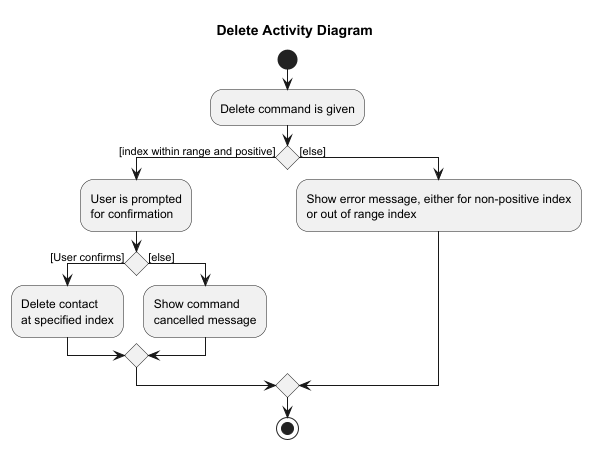

* Table of Contents
  {:toc}

--------------------------------------------------------------------------------------------------------------------

## **Acknowledgements**

* This project is based on the AgentAssist-Level3 project created by the [SE-EDU initiative](https://se-education.org).

* Libraries used: [JavaFX](https://openjfx.io/), [Jackson](https://github.com/FasterXML/jackson), [JUnit5](https://github.com/junit-team/junit5)

--------------------------------------------------------------------------------------------------------------------

## **Setting up, getting started**

Refer to the guide [_Setting up and getting started_](SettingUp.md).

--------------------------------------------------------------------------------------------------------------------

## **Design**

:bulb: **Tip:** The `.puml` files used to create diagrams in this document `docs/diagrams` folder. Refer to the [_PlantUML Tutorial_ at se-edu/guides](https://se-education.org/guides/tutorials/plantUml.html) to learn how to create and edit diagrams.

### Architecture

The ***Architecture Diagram*** given above explains the high-level design of the App.

Given below is a quick overview of main components and how they interact with each other.

**Main components of the architecture**

**`Main`** (consisting of classes [`Main`](https://github.com/se-edu/agentassist-level3/tree/master/src/main/java/seedu/address/Main.java) and [`MainApp`](https://github.com/se-edu/agentassist-level3/tree/master/src/main/java/seedu/address/MainApp.java)) is in charge of the app launch and shut down.
* At app launch, it initializes the other components in the correct sequence, and connects them up with each other.
* At shut down, it shuts down the other components and invokes cleanup methods where necessary.

The bulk of the app's work is done by the following four components:

* [**`UI`**](#ui-component): The UI of the App.
* [**`Logic`**](#logic-component): The command executor.
* [**`Model`**](#model-component): Holds the data of the App in memory.
* [**`Storage`**](#storage-component): Reads data from, and writes data to, the hard disk.

[**`Commons`**](#common-classes) represents a collection of classes used by multiple other components.

**How the architecture components interact with each other**

The *Sequence Diagram* below shows how the components interact with each other for the scenario where the user issues the command `delete 1`.

Each of the four main components (also shown in the diagram above),

* defines its *API* in an `interface` with the same name as the Component.
* implements its functionality using a concrete `{Component Name}Manager` class (which follows the corresponding API `interface` mentioned in the previous point.

For example, the `Logic` component defines its API in the `Logic.java` interface and implements its functionality using the `LogicManager.java` class which follows the `Logic` interface. Other components interact with a given component through its interface rather than the concrete class (reason: to prevent outside component's being coupled to the implementation of a component), as illustrated in the (partial) class diagram below.

The sections below give more details of each component.

### UI component

The **API** of this component is specified in [`Ui.java`](https://github.com/se-edu/agentassist-level3/tree/master/src/main/java/seedu/address/ui/Ui.java)

The UI consists of a `MainWindow` that is made up of parts e.g.`CommandBox`, `ResultDisplay`, `PersonListPanel`, `StatusBarFooter` etc. All these, including the `MainWindow`, inherit from the abstract `UiPart` class which captures the commonalities between classes that represent parts of the visible GUI.

The `UI` component uses the JavaFx UI framework. The layout of these UI parts are defined in matching `.fxml` files that are in the `src/main/resources/view` folder. For example, the layout of the [`MainWindow`](https://github.com/se-edu/agentassist-level3/tree/master/src/main/java/seedu/address/ui/MainWindow.java) is specified in [`MainWindow.fxml`](https://github.com/se-edu/agentassist-level3/tree/master/src/main/resources/view/MainWindow.fxml)

The `UI` component,

* executes user commands using the `Logic` component.
* listens for changes to `Model` data so that the UI can be updated with the modified data.
* keeps a reference to the `Logic` component, because the `UI` relies on the `Logic` to execute commands.
* depends on some classes in the `Model` component, as it displays `Person` object residing in the `Model`.

### Logic component

**API** : [`Logic.java`](https://github.com/se-edu/agentassist-level3/tree/master/src/main/java/seedu/address/logic/Logic.java)

Here's a (partial) class diagram of the `Logic` component:

The sequence diagram below illustrates the interactions within the `Logic` component, taking `execute("delete 1")` API call as an example.

:information_source: **Note:** The lifeline for `DeleteCommandParser` should end at the destroy marker (X) but due to a limitation of PlantUML, the lifeline continues till the end of diagram.

How the `Logic` component works:

1. When `Logic` is called upon to execute a command, it is passed to an `AgentAssistParser` object which in turn creates a parser that matches the command (e.g., `DeleteCommandParser`) and uses it to parse the command.
1. This results in a `Command` object (more precisely, an object of one of its subclasses e.g., `DeleteCommand`) which is executed by the `LogicManager`.
1. The command can communicate with the `Model` when it is executed (e.g. to delete a person). 
   Note that although this is shown as a single step in the diagram above (for simplicity), in the code it can take several interactions (between the command object and the `Model`) to achieve.
1. The result of the command execution is encapsulated as a `CommandResult` object which is returned back from `Logic`.

Here are the other classes in `Logic` (omitted from the class diagram above) that are used for parsing a user command:

How the parsing works:
* When called upon to parse a user command, the `AgentAssistParser` class creates an `XYZCommandParser` (`XYZ` is a placeholder for the specific command name e.g., `AddCommandParser`) which uses the other classes shown above to parse the user command and create a `XYZCommand` object (e.g., `AddCommand`) which the `AgentAssistParser` returns back as a `Command` object.
  * `FilterCommandParser` is explicitly shown as unlike other command parsers, `FilterCommandParser` performs an additional task: it creates multiple predicate classes, which are combined into a `CombinedPredicate`.
* All `XYZCommandParser` classes (e.g., `AddCommandParser`, `DeleteCommandParser`, ...) and `FilterCommandParser` inherit from the `Parser` interface so that they can be treated similarly where possible e.g, during testing.

### Model component
**API** : [`Model.java`](https://github.com/se-edu/agentassist-level3/tree/master/src/main/java/seedu/address/model/Model.java)

The `Model` component,

* stores the address book data i.e., all `Person` objects (which are contained in a `UniquePersonList` object).
* stores the currently 'selected' `Person` objects (e.g., results of a search query) as a separate _filtered_ list which is exposed to outsiders as an unmodifiable `ObservableList<Person>` that can be 'observed' e.g. the UI can be bound to this list so that the UI automatically updates when the data in the list change.
* stores a `UserPref` object that represents the user’s preferences. This is exposed to the outside as a `ReadOnlyUserPref` objects.
* does not depend on any of the other three components (as the `Model` represents data entities of the domain, they should make sense on their own without depending on other components)

### Storage component

**API** : [`Storage.java`](https://github.com/se-edu/agentassist-level3/tree/master/src/main/java/seedu/address/storage/Storage.java)

The `Storage` component,
* can save both address book data and user preference data in JSON format, and read them back into corresponding objects.
* inherits from both `AgentAssistStorage` and `UserPrefStorage`, which means it can be treated as either one (if only the functionality of only one is needed).
* depends on some classes in the `Model` component (because the `Storage` component's job is to save/retrieve objects that belong to the `Model`)

### Common classes

Classes used by multiple components are in the `seedu.address.commons` package.

--------------------------------------------------------------------------------------------------------------------

## **Implementation**

This section describes some noteworthy details on how certain features are implemented.

### \[Proposed\] Undo/redo feature

#### Proposed Implementation

The proposed undo/redo mechanism is facilitated by `VersionedAgentAssist`. It extends `AgentAssist` with an undo/redo history, stored internally as an `agentAssistStateList` and `currentStatePointer`. Additionally, it implements the following operations:

* `VersionedAgentAssist#commit()` — Saves the current address book state in its history.
* `VersionedAgentAssist#undo()` — Restores the previous address book state from its history.
* `VersionedAgentAssist#redo()` — Restores a previously undone address book state from its history.

These operations are exposed in the `Model` interface as `Model#commitAgentAssist()`, `Model#undoAgentAssist()` and `Model#redoAgentAssist()` respectively.

Given below is an example usage scenario and how the undo/redo mechanism behaves at each step.

Step 1. The user launches the application for the first time. The `VersionedAgentAssist` will be initialized with the initial address book state, and the `currentStatePointer` pointing to that single address book state.

Step 2. The user executes `delete 5` command to delete the 5th person in the address book. The `delete` command calls `Model#commitAgentAssist()`, causing the modified state of the address book after the `delete 5` command executes to be saved in the `agentAssistStateList`, and the `currentStatePointer` is shifted to the newly inserted address book state.

Step 3. The user executes `add n/David …​` to add a new person. The `add` command also calls `Model#commitAgentAssist()`, causing another modified address book state to be saved into the `agentAssistStateList`.

:information_source: **Note:** If a command fails its execution, it will not call `Model#commitAgentAssist()`, so the address book state will not be saved into the `agentAssistStateList`.

Step 4. The user now decides that adding the person was a mistake, and decides to undo that action by executing the `undo` command. The `undo` command will call `Model#undoAgentAssist()`, which will shift the `currentStatePointer` once to the left, pointing it to the previous address book state, and restores the address book to that state.

:information_source: **Note:** If the `currentStatePointer` is at index 0, pointing to the initial AgentAssist state, then there are no previous AgentAssist states to restore. The `undo` command uses `Model#canUndoAgentAssist()` to check if this is the case. If so, it will return an error to the user rather
than attempting to perform the undo.

The following sequence diagram shows how an undo operation goes through the `Logic` component:

:information_source: **Note:** The lifeline for `UndoCommand` should end at the destroy marker (X) but due to a limitation of PlantUML, the lifeline reaches the end of diagram.

Similarly, how an undo operation goes through the `Model` component is shown below:

The `redo` command does the opposite — it calls `Model#redoAgentAssist()`, which shifts the `currentStatePointer` once to the right, pointing to the previously undone state, and restores the address book to that state.

:information_source: **Note:** If the `currentStatePointer` is at index `agentAssistStateList.size() - 1`, pointing to the latest address book state, then there are no undone AgentAssist states to restore. The `redo` command uses `Model#canRedoAgentAssist()` to check if this is the case. If so, it will return an error to the user rather than attempting to perform the redo.

Step 5. The user then decides to execute the command `list`. Commands that do not modify the address book, such as `list`, will usually not call `Model#commitAgentAssist()`, `Model#undoAgentAssist()` or `Model#redoAgentAssist()`. Thus, the `agentAssistStateList` remains unchanged.

Step 6. The user executes `clear`, which calls `Model#commitAgentAssist()`. Since the `currentStatePointer` is not pointing at the end of the `agentAssistStateList`, all address book states after the `currentStatePointer` will be purged. Reason: It no longer makes sense to redo the `add n/David …​` command. This is the behavior that most modern desktop applications follow.

The following activity diagram summarizes what happens when a user executes a new command:

#### Design considerations:

**Aspect: How undo & redo executes:**

* **Alternative 1 (current choice):** Saves the entire address book.
    * Pros: Easy to implement.
    * Cons: May have performance issues in terms of memory usage.

* **Alternative 2:** Individual command knows how to undo/redo by
  itself.
    * Pros: Will use less memory (e.g. for `delete`, just save the person being deleted).
    * Cons: We must ensure that the implementation of each individual command are correct.

_{more aspects and alternatives to be added}_

### \[Proposed\] Data archiving

_{Explain here how the data archiving feature will be implemented}_

--------------------------------------------------------------------------------------------------------------------

## **Documentation, logging, testing, configuration, dev-ops**

* [Documentation guide](Documentation.md)
* [Testing guide](Testing.md)
* [Logging guide](Logging.md)
* [Configuration guide](Configuration.md)
* [DevOps guide](DevOps.md)

--------------------------------------------------------------------------------------------------------------------

## **Appendix: Requirements**

### Product scope

**Banking Agents, that sell credit cards**:

* has a need to manage a significant number of contacts
* prefer desktop apps over other types
* can type fast
* prefers typing to mouse interactions
* needs a fast way to access data, and see relevant customer information at a glance while on a call with the customer
* is reasonably comfortable using CLI apps

**Value proposition**: manage contacts faster than a typical mouse/GUI driven app

### User stories

Priorities: High (must have) - `* * *`, Medium (nice to have) - `* *`, Low (unlikely to have) - `*`

| Priority | As a …​         | I want to …​                                                               | So that I can…​                                                                                                                     |
|----------|-----------------|----------------------------------------------------------------------------|-------------------------------------------------------------------------------------------------------------------------------------|
| `* * *`  | user            | save current data                                                          | when I close & open the app, details I have added persist                                                                           |
| `* * *`  | user            | be able to edit data of my customer                                        | I can change customer details without having to delete a contact and re-add it with the new details                                 |
| `* * *`  | banking agent   | add a customer                                                             | I can save the records and details of the new customer                                                                              |
| `* * *`  | banking agent   | remove a customer                                                          | I can remove a customer that is no longer going to use our credit card services or is blacklisted                                   |
| `* * *`  | banking agent   | view details of a customer                                                 | I need not ask customers for details again                                                                                          |
| `* * *`  | banking agent   | save contact details of the customers                                      | I can contact customers who are more willing to spend money and call back customers with updates                                    |
| `* * *`  | banking agent   | edit contact details of the customers                                      | I need not delete and re-add a customer just for a small change in detail (i.e. moved house)                                        |
| `* * *`  | banking agent   | delete contact details                                                     | I can remove customers who are no longer valid or for whatever reason are not worth saving                                          |
| `* * *`  | banking agent   | save a note/remarks about the customers                                    | I can recall any particular notable details about the customer (for e.g. This customer is very concerned about pricing)             |
| `* *`    | banking agent   | check which credit card services or plans a customer has/had               | I avoid selling products that the customer already has                                                                              |
| `* *`    | banking agent   | filter using details like occupation and income                            | I can target a group of customers more quickly                                                                                      |
| `* *`    | first time user | have a walkthrough guide to show me the user interface                     | I am familiar with the features available and how I can find and use them                                                           |
| `*`      | user            | export current data                                                        | I can backup the data regularly                                                                                                     |
| `*`      | user            | import data from a backup                                                  | I can use my data backed up in case of data loss, or initialise the app with a set of data if I am transferring from a prior source |
| `*`      | banking agent   | view common urls/card information                                          | I can read/send them to the customer quickly when inquired                                                                          |
| `*`      | banking agent   | be reminded to call back a client when I open the application              | I can immediately know which client I need to follow up today                                                                       |
| `*`      | impatient user  | get the results that falls into a specific group/category                  | I don’t waste time querying all the result in that category one by one                                                              |
| `*`      | impatient user  | enter details quickly using a user-friendly interface                      | I can quickly add/view data and not get mad because it’s fast                                                                       |
| `*`      | long time user  | access my most frequently used features easily                             | I can save time when accessing my most used features                                                                                |
| `*`      | beginner user   | have a help menu                                                           | I know how to perform a particular task                                                                                             |
| `*`      | beginner user   | have some sample customer data that has already been inputted into the app | I can find out information can be saved in the application                                                                          |

*{More to be added}*

### Use cases

(For all use cases below, the **System** is the `AgentAssist` and the **Actor** is the `user`, unless specified otherwise)

**Use case: U1 - Delete a person**

**MSS**

1.  User requests to list persons.
2.  AgentAssist shows a list of persons.
3.  User requests to delete a specific person in the list. 
4.  AgentAssist asks user for confirmation.
5.  User confirms. 
6.  AgentAssist deletes the person.

    Use case ends.

**Extensions**

* 2a. The list is empty.

  Use case ends.

* 3a. The given index is invalid.

    * 3a1. AgentAssist shows an error message.

      Use case resumes at step 2.

**Use case: U2 - Add a Person**

**MSS**

1.  User requests to add a user.
2.  AgentAssist adds a person.
3.  AgentAssist returns the unique user ID assigned to the new user.

    Use case ends.

**Extensions**

* 1a. The given parameters are invalid.
    * 1a1. AgentAssist shows an invalid parameter error message.

      Use case resumes at step 1.

**Use case: U3 - Filter for a person**

**MSS**

1.  User requests to view a person using an attribute like name to filter for the person.
2.  AgentAssist returns a list of users which match the filter set in step 1.

    Use case ends.

**Extensions**

* 1a. The given filter option is invalid.
    * 1a1. AgentAssist shows an invalid parameter error message.

      Use case resumes at step 1.
* 1b. No users in the existing data pass the filter
    * 1b1. AgentAssist shows a blank list.

**Use case: U4 - Add remarks about a person**

**MSS**

1.  User performs <u>Filter for a person (U3)</u> .
2.  AgentAssist returns a list of people, with the person in it.
3.  User requests to add a remark about the person, using the index of the person in the list.
4.  AgentAssist adds a remark for the person.

    Use case ends.

**Use case: U5 - Exit**

**MSS**

1.  User requests to exit.
2.  AgentAssist exits.

    Use case ends.

### Non-Functional Requirements

#### Platform Compatibility
- **Description**: AgentAssist must be operational on any mainstream operating system (Windows, macOS, Linux) as long as Java 17 or newer is installed.

#### Performance and Capacity
- **Description**: The system should efficiently handle up to 1000 customer records without noticeable sluggishness in typical usage scenarios.
- **Performance Goal**: All commands should execute and return a response within two seconds to maintain a fluid user experience.

#### User Efficiency
- **Description**: Designed for users with above-average typing speed in regular English text; such users should find executing tasks via commands faster than using a mouse.

#### System Architecture
- **Description**: AgentAssist is designed for single-user scenarios, ensuring personalized and secure data management without the complexities of multi-user capabilities.

#### Data Management
- **Description**: All customer data should be stored locally in a human-editable text file format, allowing for easy access and manual modifications if required.

#### Documentation
- **Description**: Provide comprehensive, easy-to-read User and Developer Guides detailing functionality, usage, and system requirements.
- **Additional**: Both guides should be formatted to be printer-friendly, particularly in PDF format, facilitating easy distribution and referencing.

#### Installation and Distribution
- **Description**: AgentAssist should be accessible without the need for a traditional installer. The application should be distributable as a single JAR file, simplifying setup and use.
- **Dependency**: The software should operate independently without requiring connections to any remote servers owned or managed by the developer.

#### User Interface
- **Description**: While the primary interface is command-line based, any graphical user interface (GUI) elements should be optimized for standard screen resolutions (1920x1080 and higher) and screen scales (100% and 125%), ensuring clarity and usability across various devices.

### Glossary

* **Mainstream OS**: Common operating systems like Windows, Linux, Unix, and macOS supported by the application.
* **CLI (Command Line Interface)**: A text-based interface where users interact with the app by typing commands instead of using a graphical interface (mouse-driven).
* **Banking Agent**: A user of the system responsible for selling credit cards to customers.
* **Contact**: A record in the AgentAssist system that contains personal and financial details of a customer.
* **Customer**: A person whose details are managed within the AgentAssist system. This could be a potential or existing client of the banking agent interested in or already using credit card services.
--------------------------------------------------------------------------------------------------------------------

## **Appendix: Instructions for manual testing**

Given below are instructions to test the app manually.

:information_source: **Note:** These instructions only provide a starting point for testers to work on;
testers are expected to do more *exploratory* testing.

### Launch and shutdown

1. Initial launch

    1. Download the jar file and copy into an empty folder

    1. Double-click the jar file Expected: Shows the GUI with a set of sample contacts. The window size may not be optimum.

1. Saving window preferences

    1. Resize the window to an optimum size. Move the window to a different location. Close the window.

    1. Re-launch the app by double-clicking the jar file. 
       Expected: The most recent window size and location is retained.

1. _{ more test cases …​ }_

### Deleting a person

1. Deleting a person while all persons are being shown

    1. Prerequisites: List all persons using the `list` command. Multiple persons in the list.

    1. Test case: `delete 1` 
       Expected: First contact is deleted from the list. Details of the deleted contact shown in the status message.

    1. Test case: `delete 0` 
       Expected: No person is deleted. Error details shown in the status message.

    1. Other incorrect delete commands to try: `delete`, `delete x`, `...` (where x is larger than the list size) 
       Expected: Similar to previous.

2. Deleting a person after having filtered based on a criteria
    1. Prerequisites: Use the `filter` command with a suitable flag. Multiple persons in the list.

    1. Functions similar to above example except that the indexes to be used are based on the new list shown.

### Saving data

1. Dealing with missing/corrupted data files

    1. _{explain how to simulate a missing/corrupted file, and the expected behavior}_

1. _{ more test cases …​ }_
