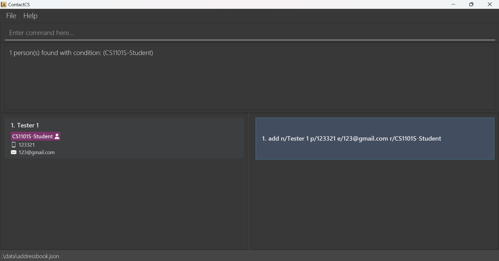
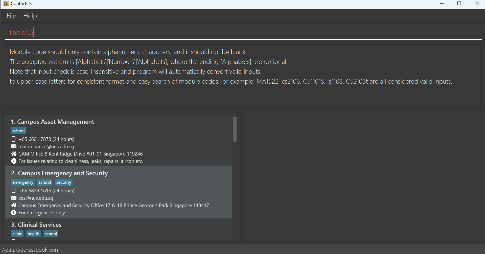
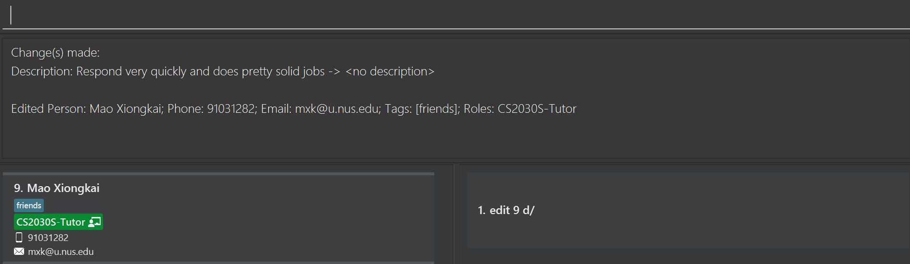
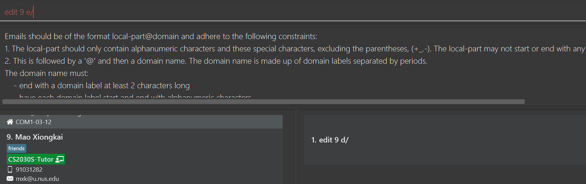
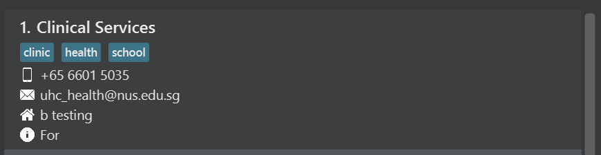
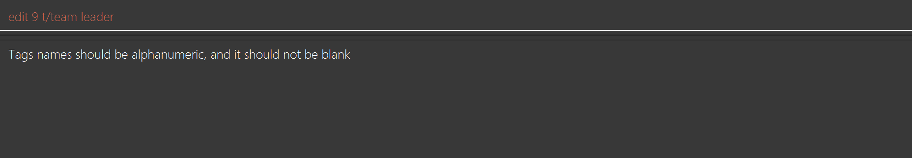
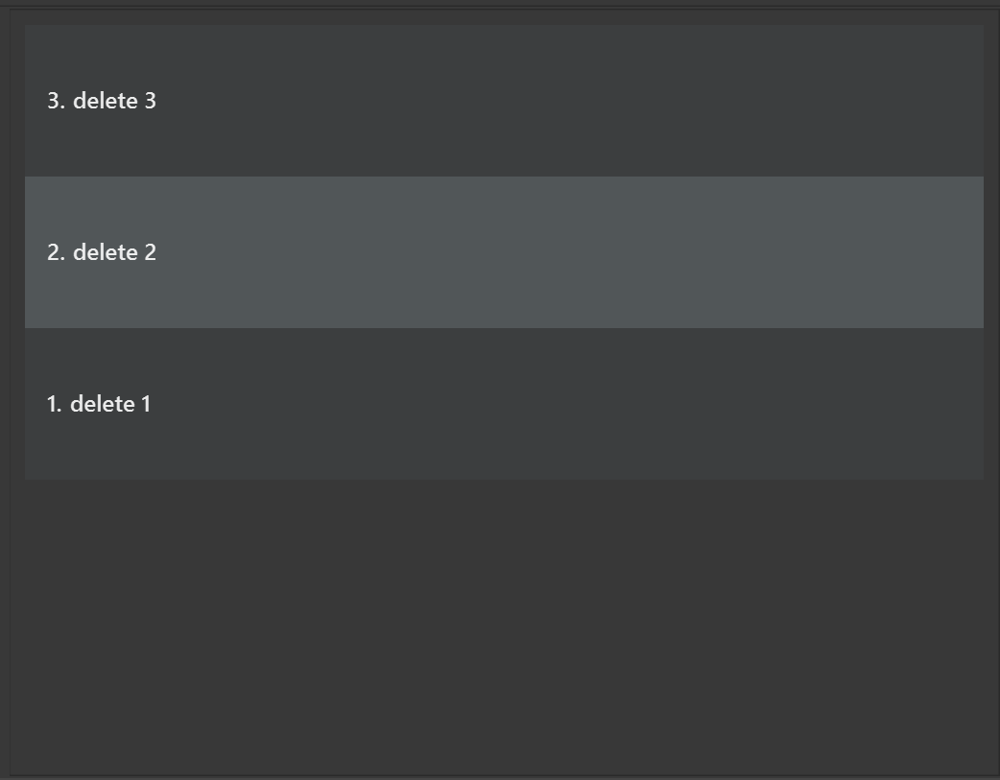

# ContactCS Developer Guide

<!-- * Table of Contents -->
<page-nav-print />

--------------------------------------------------------------------------------------------------------------------

## **Acknowledgements**

1. The Undo/Redo features of ContactCS are implemented with references to the `[Proposed] Undo/redo feature` section in the
[original AB3 Developer Guide](https://se-education.org/addressbook-level3/DeveloperGuide.html).
During the development process of these two features, the codes are written by our own developers, based on the suggested
architectural design and APIs mentioned in the above documentation.

--------------------------------------------------------------------------------------------------------------------

## **Setting up, getting started**

Refer to the guide [_Setting up and getting started_](SettingUp.md).

--------------------------------------------------------------------------------------------------------------------

## **Design**

### Architecture

<puml src="diagrams/ArchitectureDiagram.puml" width="280" />

The ***Architecture Diagram*** given above explains the high-level design of the App.

Given below is a quick overview of main components and how they interact with each other.

**Main components of the architecture**

**`Main`** (consisting of classes [`Main`](https://github.com/AY2425S1-CS2103T-F12-1/tp/blob/master/src/main/java/seedu/address/Main.java) and [`MainApp`](https://github.com/AY2425S1-CS2103T-F12-1/tp/blob/master/src/main/java/seedu/address/MainApp.java)) is in charge of the app launch and shut down.
* At app launch, it initializes the other components in the correct sequence, and connects them up with each other.
* At shut down, it shuts down the other components and invokes _cleanup methods_ where necessary.

The bulk of the app's work is done by the following four components:

* [**`UI`**](#ui-component): The UI of the App.
* [**`Logic`**](#logic-component): The command executor.
* [**`Model`**](#model-component): Holds the data of the App in memory.
* [**`Storage`**](#storage-component): Reads data from, and writes data to, the hard disk.

[**`Commons`**](#common-classes) represents a collection of classes used by multiple other components.

**How the architecture components interact with each other**

The *Sequence Diagram* below shows how the components interact with each other for the scenario where the user issues the command `delete 1`.

<puml src="diagrams/ArchitectureSequenceDiagram.puml" width="574" />

Each of the four main components (also shown in the diagram above),

* defines its *API* in an `interface` with the same name as the Component.
* implements its functionality using a concrete `{Component Name}Manager` class (which follows the corresponding API `interface` mentioned in the previous point.

For example, the `Logic` component defines its API in the `Logic.java` interface and implements its functionality using the `LogicManager.java` class which follows the `Logic` interface. Other components interact with a given component through its interface rather than the concrete class (reason: to prevent outside component's being coupled to the implementation of a component), as illustrated in the (partial) class diagram below.

<puml src="diagrams/ComponentManagers.puml" width="300" />

The sections below give more details of each component.

### UI component

The **API** of this component is specified in [`Ui.java`](https://github.com/AY2425S1-CS2103T-F12-1/tp/blob/master/src/main/java/seedu/address/ui/Ui.java)

<puml src="diagrams/UiClassDiagram.puml" alt="Structure of the UI Component"/>

The UI consists of a `MainWindow` that is made up of parts e.g.`CommandBox`, `ResultDisplay`, `PersonListPanel`, `HistoryCommandListPanel`, `StatusBarFooter` etc. All these, including the `MainWindow`, inherit from the abstract `UiPart` class which captures the commonalities between classes that represent parts of the visible GUI.

The `UI` component uses the JavaFx UI framework. The layout of these UI parts are defined in matching `.fxml` files that are in the `src/main/resources/view` folder. For example, the layout of the [`MainWindow`](https://github.com/AY2425S1-CS2103T-F12-1/tp/blob/master/src/main/java/seedu/address/ui/MainWindow.java) is specified in [`MainWindow.fxml`](https://github.com/AY2425S1-CS2103T-F12-1/tp/blob/master/src/main/resources/view/MainWindow.fxml)

The `UI` component,

* executes user commands using the `Logic` component.
* listens for changes to `Model` data so that the UI can be updated with the modified data.
* keeps a reference to the `Logic` component, because the `UI` relies on the `Logic` to execute commands.
* depends on some classes in the `Model` component, as it displays `Person` object residing in the `Model`.

### Logic component

**API** : [`Logic.java`](https://github.com/AY2425S1-CS2103T-F12-1/tp/blob/master/src/main/java/seedu/address/logic/Logic.java)

Here's a (partial) class diagram of the `Logic` component:

<puml src="diagrams/LogicClassDiagram.puml" width="550"/>

The sequence diagram below illustrates the interactions within the `Logic` component, taking `execute("delete 1")` API call as an example.

<puml src="diagrams/DeleteSequenceDiagram.puml" alt="Interactions Inside the Logic Component for the `delete 1` Command" />

<box type="info" seamless>

**Note:** The lifeline for `DeleteCommandParser` should end at the destroy marker (X) but due to a limitation of PlantUML, the lifeline continues till the end of diagram.
</box>

How the `Logic` component works:

1. When `Logic` is called upon to execute a command, it is passed to an `AddressBookParser` object which in turn creates a parser that matches the command (e.g., `DeleteCommandParser`) and uses it to parse the command.
1. This results in a `Command` object (more precisely, an object of one of its subclasses e.g., `DeleteCommand`) which is executed by the `LogicManager`.
1. The command can communicate with the `Model` when it is executed (e.g. to delete a person). 
   Note that although this is shown as a single step in the diagram above (for simplicity), in the code it can take several interactions (between the command object and the `Model`) to achieve.
1. The result of the command execution is encapsulated as a `CommandResult` object which is returned back from `Logic`.

Here are the other classes in `Logic` (omitted from the class diagram above) that are used for parsing a user command:

<puml src="diagrams/ParserClasses.puml" width="600"/>

How the parsing works:
* When called upon to parse a user command, the `AddressBookParser` class creates an `XYZCommandParser` (`XYZ` is a placeholder for the specific command name e.g., `AddCommandParser`) which uses the other classes shown above to parse the user command and create a `XYZCommand` object (e.g., `AddCommand`) which the `AddressBookParser` returns back as a `Command` object.
* All `XYZCommandParser` classes (e.g., `AddCommandParser`, `DeleteCommandParser`, ...) inherit from the `Parser` interface so that they can be treated similarly where possible e.g, during testing.

### Model component
**API** : [`Model.java`](https://github.com/AY2425S1-CS2103T-F12-1/tp/blob/master/src/main/java/seedu/address/model/Model.java)

<puml src="diagrams/ModelClassDiagram.puml" width="450" />

The `Model` component,

* stores the address book data i.e., all `Person` objects (which are contained in a `UniquePersonList` object).
* stores the currently 'selected' `Person` objects (e.g., results of a search query) as a separate _filtered_ list which is exposed to outsiders as an unmodifiable `ObservableList<Person>` that can be 'observed' e.g. the UI can be bound to this list so that the UI automatically updates when the data in the list change.
* stores a `UserPref` object that represents the user’s preferences. This is exposed to the outside as a `ReadOnlyUserPref` objects.
* does not depend on any of the other three components (as the `Model` represents data entities of the domain, they should make sense on their own without depending on other components)

<box type="info" seamless>

**Note:** An alternative (arguably, a more OOP) model is given below. It has a `Tag` list in the `AddressBook`, which `Person` references. This allows `AddressBook` to only require one `Tag` object per unique tag, instead of each `Person` needing their own `Tag` objects. 

<puml src="diagrams/BetterModelClassDiagram.puml" width="450" />

</box>

### Storage component

**API** : [`Storage.java`](https://github.com/AY2425S1-CS2103T-F12-1/tp/blob/master/src/main/java/seedu/address/storage/Storage.java)

<puml src="diagrams/StorageClassDiagram.puml" width="550" />

The `Storage` component,
* can save both address book data and user preference data in JSON format, and read them back into corresponding objects.
* inherits from both `AddressBookStorage` and `UserPrefStorage`, which means it can be treated as either one (if only the functionality of only one is needed).
* depends on some classes in the `Model` component (because the `Storage` component's job is to save/retrieve objects that belong to the `Model`)

### Common classes

Classes used by multiple components are in the `seedu.address.commons` package.

--------------------------------------------------------------------------------------------------------------------

## **Implementation**

This section describes some noteworthy details on how certain features are implemented.

### Undo/redo

The undo/redo mechanism is facilitated by `VersionedAddressBook`.
It extends `AddressBook` with an undo/redo history, stored internally as an `addressBookStateList` and `currentStatePointer`.
Additionally, it implements the following operations:

* `VersionedAddressBook#commitAddressBook()` — Saves the current address book state in its history.
* `VersionedAddressBook#undoAddressBook()` — Restores the previous address book state from its history.
* `VersionedAddressBook#redoAddressBook()` — Restores a previously undone address book state from its history.

These operations are exposed in the `Model` interface as `Model#commitAddressBook()`, `Model#undoAddressBook()` and `Model#redoAddressBook()` respectively.

Given below is an example usage scenario and how the undo/redo mechanism behaves at each step.

Step 1. The user launches the application for the first time. The `VersionedAddressBook` will be initialized with the initial address book state, and the `currentStatePointer` pointing to that single address book state.

<puml src="diagrams/UndoRedoState0.puml" alt="UndoRedoState0" />

Step 2. The user executes `delete 5` command to delete the 5th person in the address book. The `delete` command calls `Model#commitAddressBook()`, causing the modified state of the address book after the `delete 5` command executes to be saved in the `addressBookStateList`, and the `currentStatePointer` is shifted to the newly inserted address book state.

<puml src="diagrams/UndoRedoState1.puml" alt="UndoRedoState1" />

Step 3. The user executes `add n/David …​` to add a new person. The `add` command also calls `Model#commitAddressBook()`, causing another modified address book state to be saved into the `addressBookStateList`.

<puml src="diagrams/UndoRedoState2.puml" alt="UndoRedoState2" />

<box type="info" seamless>

**Note:** If a command fails its execution, it will not call `Model#commitAddressBook()`, so the address book state will not be saved into the `addressBookStateList`.

</box>

Step 4. The user now decides that adding the person was a mistake, and decides to undo that action by executing the `undo` command. The `undo` command will call `Model#undoAddressBook()`, which will shift the `currentStatePointer` once to the left, pointing it to the previous address book state, and restores the address book to that state.

<puml src="diagrams/UndoRedoState3.puml" alt="UndoRedoState3" />

<box type="info" seamless>

**Note:** If the `currentStatePointer` is at index 0, pointing to the initial AddressBook state, then there are no previous AddressBook states to restore. The `Model#undoAddressBook()` throws a `CommandException` in this case. Then, it will return an error to the user rather
than attempting to perform the undo.

</box>

The following sequence diagram shows how an undo operation goes through the `Logic` component:

<puml src="diagrams/UndoSequenceDiagram-Logic.puml" alt="UndoSequenceDiagram-Logic" />

<box type="info" seamless>

**Note:** The lifeline for `UndoCommand` should end at the destroy marker (X) but due to a limitation of PlantUML, the lifeline reaches the end of diagram.

</box>

Similarly, how an undo operation goes through the `Model` component is shown below:

<puml src="diagrams/UndoSequenceDiagram-Model.puml" alt="UndoSequenceDiagram-Model" />

The `redo` command does the opposite — it calls `Model#redoAddressBook()`, which shifts the `currentStatePointer` once to the right, pointing to the previously undone state, and restores the address book to that state.

<box type="info" seamless>

**Note:** If the `currentStatePointer` is at index `addressBookStateList.size() - 1`, pointing to the latest address book state, then there are no undone AddressBook states to restore. The `Model#redoAddressBook()` will throw a `CommandException` in this case. Then, it will return an error to the user rather than attempting to perform the redo.

</box>

Step 5. The user then decides to execute the command `list`. Commands that do not modify the address book, such as `list`, will not call `Model#commitAddressBook()`, `Model#undoAddressBook()` or `Model#redoAddressBook()`. Thus, the `addressBookStateList` remains unchanged.

<puml src="diagrams/UndoRedoState4.puml" alt="UndoRedoState4" />

Step 6. The user executes `clear`, which calls `Model#commitAddressBook()`. Since the `currentStatePointer` is not pointing at the end of the `addressBookStateList`, all address book states after the `currentStatePointer` will be purged. Reason: It no longer makes sense to redo the `add n/David …​` command. This is the behavior that most modern desktop applications follow.

<puml src="diagrams/UndoRedoState5.puml" alt="UndoRedoState5" />

The following activity diagram summarizes what happens when a user executes a new command:

<puml src="diagrams/CommitActivityDiagram.puml" width="250" />

<box type="info" seamless>

**Note:** `Model#undoAddressBook()` and `Model#redoAddressBook()` will also throw a `CommandException` in the unlikely case that there are uncommitted changes when an undo or a redo is attempted. This may happen if a data changing command did not call `Model#commitAddressBook()`.

</box>

#### Design considerations:

**Aspect: How undo & redo executes:**

* **Alternative 1 (current choice):** Saves the entire address book.
  * Pros: Easy to implement.
  * Cons: May have performance issues in terms of memory usage.

* **Alternative 2:** Individual command knows how to undo/redo by
  itself.
  * Pros: Will use less memory (e.g. for `delete`, just save the person being deleted).
  * Cons: We must ensure that the implementation of each individual command are correct.

--------------------------------------------------------------------------------------------------------------------

## **Documentation, logging, testing, configuration, dev-ops**

* [Documentation guide](Documentation.md)
* [Testing guide](Testing.md)
* [Logging guide](Logging.md)
* [Configuration guide](Configuration.md)
* [DevOps guide](DevOps.md)

--------------------------------------------------------------------------------------------------------------------

## **Appendix: Requirements**

### Product scope

**Target user profile**:

* NUS Computer Science Freshman
* unfamiliar with the school system(team teams, school structures, communication channels etc.)
* has no idea where to look for contact info of relevant personnel when certain issues happen, for example
  * Informing tutor about absence in tutorial/lab due to illness
  * Asking Prof for clarification/actions on certain admin issues
  * Contact school financial office to settle relevant issues
* has a need to manage a significant number of contacts
* find it frustrating to gather contacts from all types of platforms
* has the initiatives to jot down contact info when such information is given during the class
* prefer desktop apps over other types
* can type fast
* prefers typing to mouse interactions
* is reasonably comfortable using CLI apps

**Value proposition**: \
Allows NUS CS freshmen to easily locate the admin contact details when needed,
which helps them better manage contact details of their professors, teaching assistants, classmates, CCA mates, offices, emergency helplines, etc.
so that they can focus more on their study.

### User stories

Priorities: High (must have) - `* * *`, Medium (nice to have) - `* *`, Low (unlikely to have) - `*`

| Priority | As a …​                                                                                                      | I want to …​                                                                                                                | So that I can…​                                                                      |
|----------|--------------------------------------------------------------------------------------------------------------|-----------------------------------------------------------------------------------------------------------------------------|--------------------------------------------------------------------------------------|
| `* * *`  | Y1 CS Student                                                                                                | add a contact                                                                                                               | start tracking my contacts on this app                                               |
| `* * *`  | Y1 CS student who prefers a clean address book with useful contacts only                                     | delete contacts                                                                                                             | remove contacts that I no longer need to keep track of                               |
| `* * *`  | Y1 CS student who hates using a mouse or touchpad                                                            | access to all functionalities of the app with keyboard                                                                      | manage the contacts in the most efficient way                                        |
| `* * *`  | Y1 CS student                                                                                                | search for contact info from my address book using name, module code (with role), or tag                                   | find their contact immediately and reach out to them to settle any issues            |
| `* *`    | Y1 CS student                                                                                                | navigate to view the full contact list                                                                                      | perform an action (like editing or deleting contacts)                                |
| `* *`    | Y1 CS student who struggles to remember who to reach out to for certain issues                               | find the correct contact info by searching the category of the issue that I am trying to settle                             | seek help immediately even when I forget who to reach out to                         |
| `* *`    | Y1 CS student who wants to seek clarifications/actions from a professor regarding certain issues             | find contact details of the professor(s) for a course                                                                       | seek help/assistance with ease                                                       |
| `* *`    | Y1 CS student who is sick before a tutorial/lab/exam                                                         | find contact details of my TA                                                                                               | easily inform them about my absence on time                                          |
| `* *`    | Y1 CS student who is involved in any accident or emergency                                                   | find contact details of campus security                                                                                     | protect me and my friends' safety immediately                                        |
| `* *`    | Y1 CS student who has financial concerns for school                                                          | find contact details of nus financial office                                                                                | settle any financial related issues                                                  |
| `* *`    | Y1 CS student who needs to update contact info                                                               | update contact info for courses in this semester with that in the next semester                                             | keep info updated in more efficient ways                                             |
| `* *`    | Y1 CS student who frequently access some of the contact details but lazy to repeat same commands everytime   | classify frequently accessed contacts and query them using shorter commands                                                 | access those frequent contact without wasting too much time                          |
| `* *`    | New user                                                                                                     | see usage instructions                                                                                                      | refer to instructions when I forget how to use the App                               |
| `* *`    | Y1 CS student who is a fresh man in a cca                                                                    | find contact details of my cca leader/friends                                                                               | settle any cca-related issues with them                                              |
| `* *`    | Y1 CS student who are unsure about the procedure of making an appointment with a doctor                      | find contact details for UHC and NUH easily                                                                                 | make appointment with doctor as early as possible                                    |
| `* *`    | Y1 CS student who are facing an academic challenges and mental issue                                         | find contact details of counselling service                                                                                 | seek help and support from others before it is too late                              |
| `* *`    | Y1 CS student who lives in campus and don't know where to contact with if I need to enquire some information | find contact details of campus hostels easily                                                                               |                                                                                      |
| `* *`    | Y1 CS student who is keen to study together with friends/wants to manage friends know from class             | find out contact of friends who attend a specific module/course during the semester                                         |                                                                                      |
| `* *`    | Potential user exploring the app                                                                             | see the app populated with sample data                                                                                      | see how the app will look like when it is in use.                                    |
| `*`      | Y1 CS student who wants to share my contact list with friends who need them                                  | transfer useful data to help others efficiently                                                                             |                                                                                      |
| `*`      | Y1 CS student who are unsure about the modules planning but don't know who to reach out for                  | find the respective contact of academic advisors                                                                            |                                                                                      |
| `*`      | Y1 CS student who is unaware of the various opportunities provided by nus and soc                            | find the contact emails and main pages for the opportunities such as SEP, NOC, UROP + ReX, summer school, winter school etc |                                                                                      |
| `*`      | User who performed action wrongly when using the app                                                         | redo/undo current actions                                                                                                   | perform multiple actions efficiently without wasting time on correcting the mistakes |

### Use cases

(For all use cases below, the **System** is the `ContactCS` and the **Actor** is the `CS freshman`, unless specified otherwise)

**Use case: UC01 Add a contact**

**MSS**

1. User requests to add a new contact by providing the relevant contact details.
2. ContactCS adds the contact to the contact list.

    Use case ends.

**Extensions**

* 1a. Necessary input is missing.

  * 1a1. ContactCS requests the user to provide the required information
  * 1a2. User enters new data
  * Steps 1a1 - 1a2 are repeated until the data entered contain all the necessary fields

    Use case resumes from step 2.

* 1b. The given format is invalid.

    * 1b1. ContactCS requests the user to provide the correct format and shows the valid command format
    * 1b2. User enters new input
    * Steps 1b1 - 1b2 are repeated until the format for the entered input is correct

      Use case resumes from step 2.

* 1c. The given contact is a duplicate.

    * 1c1. ContactCS shows an error message telling the user that the contact already exists in ContactCS

      Use case ends.

**Use case: UC02 Search contact(s)**

**MSS**

1.  User requests to search for contact(s) by providing one or more of the following:
     * The name of the contact,
     * The module code (optionally including the role),
     * Tag
     * A combination of above

2. ContactCS shows a list of matching contacts 

    Use case ends.

**Extensions**

* 1a. Necessary input of at least one keyword is missing.

    * 1a1. ContactCS requests the user to provide keyword
    * 1a2. User enters new input
    * Steps 1a1 - 1a2 are repeated until all required fields in the input are complete

      Use case resumes from step 2.

* 1b. The input format is invalid.

    * 1b1. ContactCS requests the user to provide the correct format and shows correct syntax, example
    * 1b2. User enters new input
    * Steps 1b1 - 1b2 are repeated until the format for the entered input is correct

      Use case resumes from step 2.

* 1c. No matching contacts found.
  * 1c1. ContactCS displays a message to the user saying that there is no matching contacts found

      Use case ends.

**Use case: UC03 List contacts**

**MSS**

1. User requests to list the contacts
2. ContactCS shows a list of contacts

   Use case ends.

**Use case: UC04 Delete a person**

**MSS**

1. User requests to [list (UC03)](#uc03) the contacts or [search (UC02)](#uc02) for contact(s)
2. User requests to delete a person or multiple persons in the list
3. ContactCS deletes the person(s)

    Use case ends.

**Extensions**

* 2a. The given index/indices is/are invalid.

    * 2a1. ContactCS requests the user to provide the correct index/indices
    * 2a2. User enters new index/indices
    * Steps 2a1 - 2a2 are repeated until the index/indices entered is/are valid

      Use case resumes from step 3.

**Use case: UC05 Edit contact information**

**MSS**

1. User requests to [list (UC03)](#uc03) the contacts or [search (UC02)](#uc02) for contact(s)
2. User requests to edit contact information for a specific person in the list, providing the new contact details
3. ContactCS updates the contact details based on the information provided by the user

    Use case ends.

**Extensions**

* 2a. The given index is invalid.

    * 2a1. ContactCS requests the user to provide the correct index
    * 2a2. User enters new index
    * Steps 2a1 - 2a2 are repeated until the index entered is correct

      Use case resumes from step 3.

* 2b. The given format is invalid.

    * 2b1. ContactCS requests the user to provide the correct format and shows the valid command format
    * 2b2. User enters new input
    * Steps 2b1 - 2b2 are repeated until the format for the entered input is valid

      Use case resumes from step 3.

**Use case: UC06 View usage instructions**

**MSS**

1.  User requests to view usage instructions for the app
2.  ContactCS displays the usage instructions and commands available for the user

    Use case ends.

**Extensions**

* 1a. The given format is invalid.

    * 1a1. ContactCS requests the user to provide the correct format and shows the valid command format
    * 1a2. User enters new input
    * Steps 1a1 - 1a2 are repeated until the format for the entered input is correct

      Use case resumes from step 2.

**Use case: UC07 Undo actions**

**MSS**

1. User requests to undo the last action that modified contact list data
2. ContactCS reverts to the previous state

    Use case ends.

**Extensions**

* 1a. No modification of contact list data has been performed yet.
    * 1a1. ContactCS shows an error message indicating that there is no action to undo

      Use case ends.

* 1b. The given format is invalid.

    * 1b1. ContactCS requests the user to provide the correct format and shows the valid command format
    * 1b2. User enters new input
    * Steps 1b1 - 1b2 are repeated until the format of the entered input is correct

      Use case resumes from step 2.

**Use case: UC08 Redo actions**

**MSS**

1. User requests a redo
2. ContactCS reapplies the last undone action

    Use case ends.

**Extensions**

* 1a. User tries to redo an action without having undone one first.
    * 1a1. ContactCS shows an error message indicating that there is no action to redo

        Use case ends.

* 1b. The given format is invalid.

    * 1b1. ContactCS requests the user to provide the correct format and shows the valid command format
    * 1b2. User enters new input
    * Steps 1b1 - 1b2 are repeated until the format of the entered input is correct

      Use case resumes from step 2.

### Non-Functional Requirements

1. The application should work on any _mainstream OS_ as long as it has Java `17` installed.
2. The application should be able to hold up to 1000 persons without a noticeable sluggishness in performance for typical usage.
3. A user with above average typing speed for regular English text (i.e. not code, not system admin commands) should be able to accomplish most of the tasks faster using commands than using the mouse.
4. The UI should not lag or freeze anytime during normal usage.
5. All usage of data related to NUS should abide by NUS regulations.
6. The application should remain backwards compatible, namely all data generated in previous versions should be usable in newer versions.
7. The application should be easily usable by NUS year 1 Computer Science students with any skill level.
8. Managing contacts will remain as the core feature in all iterations.
9. The application should not crash for any input given by the user.
10. The application will remain as a CLI based application.

### Glossary
* **Architecture Diagram**: A visual representation of all the elements that make up part, or all, of a system
* **high-level design**: Representing the system or architecture in an abstract way, without diving into technical details, implementation specifics, or granular components
* **cleanup methods**: Functions or procedures that are invoked to release resources, close connections, or finalize tasks before an application or component shuts down
* **Sequence Diagram**: A visual representation of the sequence of interactions between different objects, components, or actors in a system over time
* **UI**: User Interface - the space where interactions between humans (users) and machines (software or hardware) occur
* **API**: Application Programming Interface - A set of rules, protocols, and tools that allows different software applications to communicate and interact with each other
* **GUI**: Graphical User Interface - A type of user interface that allows users to interact with software applications or devices through graphical elements rather than using text-based commands
* **JavaFx**: A Java library used for building modern GUIs
* **lifeline (in a Sequence Diagram)**: A graphical element that depicts the lifespan of an object or actor in the system as interactions occur over time
* **JSON**: An open standard file format and data interchange format that uses human-readable text to store and transmit data objects consisting of attribute–value pairs and arrays
* **CLI app**: Command-Line Interface application - A software application that allows users to interact with it through a text-based interface by typing commands in a console or terminal
* **Mainstream OS**: Windows, Linux, Unix, MacOS
* **Private contact detail**: A contact detail that is not meant to be shared with others

--------------------------------------------------------------------------------------------------------------------

## **Appendix: Instructions for manual testing**

Given below are instructions to test the app manually.

<box type="info" seamless>

**Note:** These instructions only provide a starting point for testers to work on;
testers are expected to do more *exploratory* testing.

</box>

### Launch and shutdown

1. Initial launch

    1. Download the jar file and copy into an empty folder

    1. Open a terminal and `cd` into the folder with the jar file.

    3. Run `java -jar contactcs.jar`.  
       Expected: Shows the GUI with a set of sample contacts. The window size may not be optimum.

1. Saving window preferences

    1. Resize the window to an optimum size. Move the window to a different location. Close the window.

    1. Re-launch the app by rerunning `java -jar contactcs.jar` in the terminal. 
       Expected: The most recent window size and location is retained.

### Deleting person(s)

1. Deleting person(s) while all persons are being shown

    1. Prerequisites: List all persons using the `list` command. Multiple persons in the list.

    1. Test case: `delete 1` 
       Expected: First contact is deleted from the list. Details of the deleted contact shown in the status message.

    1. Test case: `delete 1 3` 
      Expected: First and third contacts are deleted from the list. Details of the deleted contacts shown in the status message.

    1. Test case: `delete 0` 
       Expected: No person is deleted. Error details shown in the status message. Status bar remains the same.

    1. Other incorrect delete commands to try: `delete`, `delete x` (where x is larger than the list size), `delete abc` 
       Expected: Similar to previous.

### Saving data

1. Testing data persistence across sessions

    1. Add a new person using the `add` command.

    1. Close the app.

    1. Re-launch the app.  
       Expected: The newly added person should still be present in the list.

    1. You can try out other data changing commands such as `delete`, `edit`, `clear`.

1. Dealing with missing data file

    1. Exit the address book, if it is running.
    2. delete the `contactcs.json` file inside the folder named `data`. It is located in the same folder as the jar file.
    3. Relaunch the app.  
       Expected: The app should create a new `contactcs.json` file filled with sample data.

### Undo/Redo
1. Testing how undone states are purged after committing
   1. Add Alice using `add n/Alice p/11111111` command.
   1. Add Bob using `add n/Bob p/22222222` command.
   1. Undo the previous command.
   1. Add Catherine using `add n/Catherine p/33333333` command.
   1. Undo the previous command. Now only Alice is in the list.
   1. Then, perform a redo.
   Expected: Catherine is added back. Bob is lost forever.

### Finding contacts
1. Testing mixture of fields specified in a single `find`
   1. Prerequisites
      1. Clear the list using the `clear` command.
      2. Run `add n/Alice p/11111111 r/CS1101S t/tag1`
      2. Run `add n/Bob p/22222222 r/MA1521 t/tag2`
      2. Run `add n/Catherine p/33333333 r/CS2103T t/tag3`
   1. Run `find n/Alice n/Bob r/CS1101S`.  
   Expected: Only Alice is shown in the list. 
   Reason: The `find` command finds all persons with (name Alice **or** Bob) **and** role CS1101S.
   2. Run `find r/CS1101S r/MA1521 t/tag1 t/tag3`  
   Expected: Only Alice is shown in the list. 
   Reason: The `find` command finds all persons with (module role CS1101S **or** MA1521) **and** (tag1 **or** tag 3).

### Editing module roles
1. Editing module roles of a person
   1. Prerequisites
      1. Clear the list using the `clear` command.
      2. Run `add n/Alice p/11111111 r/CS1101S t/tag1`
   1. Run `edit 1 r/CS2103T`  
   Expected: The role of Alice is changed to CS2103T. The status message shows the change.

### Adding a person with module roles
1. Using role acronyms
   1. Run `add n/Alice p/11111111 r/CS1101S-Prof r/CS2103T-TA`  
   Expected: Alice is added module roles CS1101S-Professor and CS2103T-Tutor.  
   Note that `TA` is short for `Tutor` and `Prof` is short for `Professor`. You can also specify the full role name.

1. Not specifying the role
   1. Run `add n/Alice p/11111111 r/MA1521`  
   Expected: Alice is added with module role MA1521-Student.  
   Reason: If the role is not specified, the default role is Student.

## **Appendix: Planned Enhancements**
**Team size**: 5

1. **Make find command shorter by allowing fuzzy search of module-role, such that user can find all contacts with roles related to a specified module, just by inputting module code or even fraction of it.
(For example:`find r/CS2103T` finds all contacts related to CS2103T, `find r/CS` finds all contacts related to modules whose module codes start with CS).**
The current find command automatically assumes that user wants to search student role if only a module code is supplied to the find command, which may be counter-intuitive to some users.
Sometimes, user cannot remember the full module code, or wants to search over a wider range of modules, but the current implementation does not support that either,
hence reducing the usefulness of this command.
  
     
(As shown in the screenshot, `find r/CS1101S` only matches contacts with role **CS1101S Student**, despite that there are 2 CS1101S professors in the sample data.)
  
     
(As shown in the screenshot, `find r/CS` results in error messages because construction of search query requires exact module code to work.)
  
    This limitation is due to our current system design which forces a role type to be assigned to an exact module code into the search query for the find command to execute,
we plan to adopt other ways of constructing the query to allow for more general search of module-role in the future.
  
2. **Allow deletion of other optional data fields of a contact, using the current edit command approach.** Currently, only the description and tag fields can be deleted, by specifying the corresponding prefix followed by an empty string (For Example: `edit 9 t/` removes all tags, while `edit 9 d/` removes the description of the ninth contact in the current list). However, other optional fields such as the phone, email and address cannot be removed as of v1.6.
  
     
(As shown in the screenshot, `edit 9 d/` successfully removes description field from the ninth person in the current list.)
  
     
(As shown in the screenshot, `edit 9 e/` as an attempt to remove email from ninth person in the current list fails, because empty email field for edit command is not allowed.
Similar issues happen when removing phone using `edit 9 p/` and removing address using `edit 9 a/`.)
  
    This can be very troublesome to user if he/she accidentally adds these fields to a contact and realized that these wrong fields cannot be removed.
If these fields are left unchanged over a long period of time, user may forget that these fields are wrong and hence use the wrong information in the program, which is definitely
not desired. We plan to allow edit command to accept empty input for phone, email and address and change the parser such that the empty inputs for these fields can be considered as
deleting them from the selected contact.
  
3. **Allow the user to delimit special prefixes appearing in the contact details.**
Currently, if any of the input fields contain the special prefixes, the string will be split into multiple fields, which may not be the user's intention.
For example, if the user attempts to execute `edit 1 d/For a/b testing`, the command will be wrongly interpreted as
   - change the description of the first contact to `For`, and
   - add a new contact with description `b testing`. (refer to the screenshot below)
  
      
   
    The current workaround is to add a non-whitespace character in front of the prefix (i.e. `edit 1 d/For 'a/b testing`), but this is not intuitive to the user.
We plan to follow a more standard approach of using a backslash to escape the special prefixes.
More importantly, the parser will remove the backslash at the end of parsing, so that the user does not see the backslash in the final output.
  
4. **Enforce realistic role assignment for contacts.** Currently, a contact can have multiple roles, such as both "Professor" and "Student".
This is unrealistic, as an individual is typically either a student or a professor, but not both.
  
     
(As shown in the screenshot, Royston is both a CS1101S professor and CS2100 student.)
  
We plan to enforce stricter role assignment, ensuring that:
   * A contact can be designated as a Professor across multiple modules. 
   * Alternatively, a contact can be designated as either a Student or a Tutor across multiple modules.
     
5. **Allow command navigation using up and down arrows.** Currently, the user has to type the command from scratch if he/she wants to execute a previous command again.
This can be very troublesome if the user wants to execute the same command multiple times, or if the user wants to execute a similar command to the previous one.
We plan to allow the user to navigate through the command history using the up and down arrows.
     
6. **Allows sorting of contacts based on different fields.** Currently, the contacts are displayed in the order they are added to the address book. 
This can make it challenging for users to locate a contact if they are unsure of specific search criteria.
We plan to allow the user to view the contacts in a sorted order to find the contact he/she is looking for more easily.
     
7. **Allow multi-word tags for contacts.** Currently, tag field only allows alphanumeric inputs for tag creation, which means **spaces**, **underscores(_)** and **dashes(-)** are not
allowed in the input, and as a result prevents user from creating multi-word tags for contacts. 
  
     
(As shown in the screenshot, `edit 9 t/team leader` as an attempt to replace existing tags of ninth person in the current list shows an error message,
because tag input `team leader` contains space which is not allowed, same issue happens with the add command)
  
    This is not very suitable design because user may want to create multi-word tags
such as `team leader`, `best friend`, `financial office` etc, and the current validation method does not offer this level of flexibility. Therefore, we plan to loosen the restriction
on tag creation input to allow space for word separation, so that user can create multi-word tag to contacts for easier management.
  

8. **Reflect the true redo/undo states of the address book in the history command list.** Currently, the history command list only shows all data changing commands executed by the user and does not precisely reflect the current and history states of the address book.
   For example, if the user executes `delete 1`, then `delete 2`, then `undo`, then `delete 3`, the true history states are `[delete 1, delete 3]` since `delete 2` has been purged.
   However, the history command list will only show all data changing commands executed so far, (refer to the screenshot below) which is not accurate.
   Moreover, we plan to highlight the current state of the address book in the history command list, so that the user can easily identify the current state of the address book.
     
     
 
9. **Standardize Phone Number Format for Duplicate Detection.** Currently, the application allows adding multiple contacts with phone numbers that may look different but essentially represent the same number.
For example, `+65 12345678 (24 hr)` and `12345678` are treated as distinct, leading to potential duplicates and inconsistencies.
We plan to implement a standardization process to recognize and handle variations in phone number formatting. Specifically:
* Strip country codes (like "+65") when detecting duplicates, assuming that the default region can be inferred.
* Ignore any additional annotations (e.g., "(24 hr)"), focusing only on the numeric phone number for duplicate checks.
* Ensure that both +65 12345678 and 12345678 are considered the same number to prevent duplicate entries.
 

10. **Allow simultaneous adding and deleting module roles in a single `edit` command.**
Currently, it requires 2 separate `edit` commands  if the user wants to replace existing module roles for a contact.
We plan to allow the user to add and delete multiple module roles in a single `edit` command at the same time.
For example, the user can execute `edit 1 r/-CS1101S-Student r/+CS2103T-TA` to replace the existing module role CS1101S-Student with CS2103T-TA for the first contact in the list.

