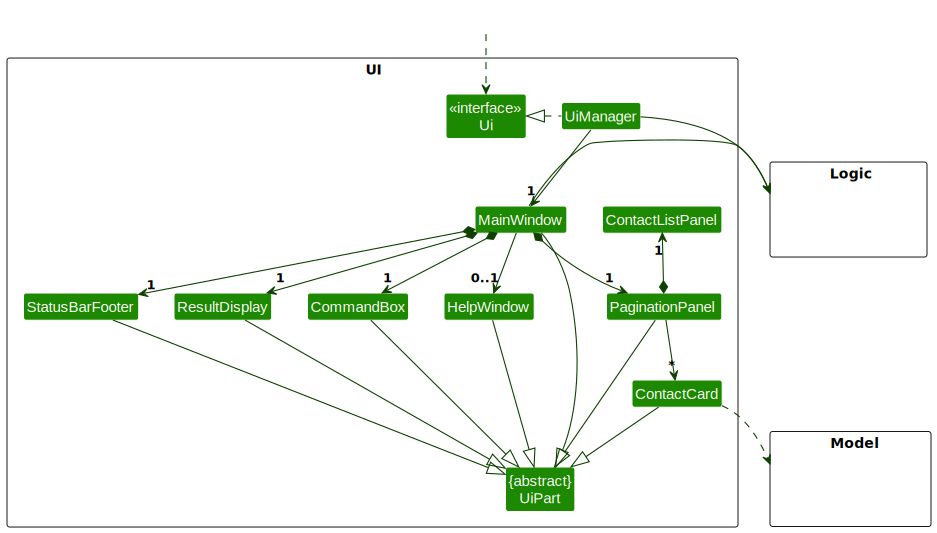
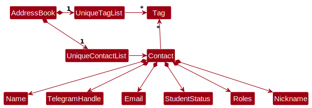

# AB-3 Developer Guide

<!-- * Table of Contents -->
<page-nav-print />

--------------------------------------------------------------------------------------------------------------------

## **Acknowledgements**

- Sample data for testing purpose developed by [Wu Zengfu](AboutUs.md#wu-zengfu): https://github.com/wuzengfu/tp_util
- JavaFX Pagination documentation: https://docs.oracle.com/javase/8/javafx/api/javafx/scene/control/Pagination.html

--------------------------------------------------------------------------------------------------------------------

## **Setting up, getting started**

Refer to the guide [_Setting up and getting started_](SettingUp.md).

--------------------------------------------------------------------------------------------------------------------

## **Design**

### Architecture

The ***Architecture Diagram*** given above explains the high-level design of the App.

Given below is a quick overview of main components and how they interact with each other.

**Main components of the architecture**

**`Main`** (consisting of classes [`Main`](https://github.com/se-edu/addressbook-level3/tree/master/src/main/java/seedu/address/Main.java) and [`MainApp`](https://github.com/se-edu/addressbook-level3/tree/master/src/main/java/seedu/address/MainApp.java)) is in charge of the app launch and shut down.
* At app launch, it initializes the other components in the correct sequence, and connects them up with each other.
* At shut down, it shuts down the other components and invokes cleanup methods where necessary.

The bulk of the app's work is done by the following four components:

* [**`UI`**](#ui-component): The UI of the App.
* [**`Logic`**](#logic-component): The command executor.
* [**`Model`**](#model-component): Holds the data of the App in memory.
* [**`Storage`**](#storage-component): Reads data from, and writes data to, the hard disk.

[**`Commons`**](#common-classes) represents a collection of classes used by multiple other components.

**How the architecture components interact with each other**

The *Sequence Diagram* below shows how the components interact with each other for the scenario where the user issues the command `delete 1`.

Each of the four main components (also shown in the diagram above),

* defines its *API* in an `interface` with the same name as the Component.
* implements its functionality using a concrete `{Component Name}Manager` class (which follows the corresponding API `interface` mentioned in the previous point.

For example, the `Logic` component defines its API in the `Logic.java` interface and implements its functionality using the `LogicManager.java` class which follows the `Logic` interface. Other components interact with a given component through its interface rather than the concrete class (reason: to prevent outside component's being coupled to the implementation of a component), as illustrated in the (partial) class diagram below.

The sections below give more details of each component.

### UI component

The **API** of this component is specified in [`Ui.java`](https://github.com/se-edu/addressbook-level3/tree/master/src/main/java/seedu/address/ui/Ui.java)

The UI consists of a `MainWindow` that is made up of parts e.g.`CommandBox`, `ResultDisplay`, `ContactListPanel`, `StatusBarFooter` etc. All these, including the `MainWindow`, inherit from the abstract `UiPart` class which captures the commonalities between classes that represent parts of the visible GUI.

The `UI` component uses the JavaFx UI framework. The layout of these UI parts are defined in matching `.fxml` files that are in the `src/main/resources/view` folder. For example, the layout of the [`MainWindow`](https://github.com/se-edu/addressbook-level3/tree/master/src/main/java/seedu/address/ui/MainWindow.java) is specified in [`MainWindow.fxml`](https://github.com/se-edu/addressbook-level3/tree/master/src/main/resources/view/MainWindow.fxml)

The `UI` component,

* executes user commands using the `Logic` component.
* listens for changes to `Model` data so that the UI can be updated with the modified data.
* keeps a reference to the `Logic` component, because the `UI` relies on the `Logic` to execute commands.
* depends on some classes in the `Model` component, as it displays `Contact` object residing in the `Model`.

### Logic component

**API** : [`Logic.java`](https://github.com/se-edu/addressbook-level3/tree/master/src/main/java/seedu/address/logic/Logic.java)

Here's a (partial) class diagram of the `Logic` component:

The sequence diagram below illustrates the interactions within the `Logic` component, taking `execute("delete 1")` API call as an example.

<box type="info" seamless>

**Note:** The lifeline for `DeleteCommandParser` should end at the destroy marker (X) but due to a limitation of PlantUML, the lifeline continues till the end of diagram.
</box>

How the `Logic` component works:

1. When `Logic` is called upon to execute a command, it is passed to an `AddressBookParser` object which in turn creates a parser that matches the command (e.g., `DeleteCommandParser`) and uses it to parse the command.
1. This results in a `Command` object (more precisely, an object of one of its subclasses e.g., `DeleteCommand`) which is executed by the `LogicManager`.
1. The command can communicate with the `Model` when it is executed (e.g. to delete a contact). 
   Note that although this is shown as a single step in the diagram above (for simplicity), in the code it can take several interactions (between the command object and the `Model`) to achieve.
1. The result of the command execution is encapsulated as a `CommandResult` object which is returned back from `Logic`.

Here are the other classes in `Logic` (omitted from the class diagram above) that are used for parsing a user command:

How the parsing works:
* When called upon to parse a user command, the `AddressBookParser` class creates an `XYZCommandParser` (`XYZ` is a placeholder for the specific command name e.g., `AddCommandParser`) which uses the other classes shown above to parse the user command and create a `XYZCommand` object (e.g., `AddCommand`) which the `AddressBookParser` returns back as a `Command` object.
* All `XYZCommandParser` classes (e.g., `AddCommandParser`, `DeleteCommandParser`, ...) inherit from the `Parser` interface so that they can be treated similarly where possible e.g, during testing.

### Model component
**API** : [`Model.java`](https://github.com/se-edu/addressbook-level3/tree/master/src/main/java/seedu/address/model/Model.java)

The `Model` component,

* stores the address book data i.e., all `Contact` objects (which are contained in a `UniqueContactList` object).
* stores the currently 'selected' `Contact` objects (e.g., results of a search query) as a separate _filtered_ list which is exposed to outsiders as an unmodifiable `ObservableList<Contact>` that can be 'observed' e.g. the UI can be bound to this list so that the UI automatically updates when the data in the list change.
* stores a `UserPref` object that represents the user’s preferences. This is exposed to the outside as a `ReadOnlyUserPref` objects.
* does not depend on any of the other three components (as the `Model` represents data entities of the domain, they should make sense on their own without depending on other components)

<box type="info" seamless>

**Note:** An alternative (arguably, a more OOP) model is given below. It has a `Tag` list in the `AddressBook`, which `Contact` references. This allows `AddressBook` to only require one `Tag` object per unique tag, instead of each `Contact` needing their own `Tag` objects. 

</box>

### Storage component

**API** : [`Storage.java`](https://github.com/se-edu/addressbook-level3/tree/master/src/main/java/seedu/address/storage/Storage.java)

<puml src="diagrams/StorageClassDiagram.puml" width="550" />

The `Storage` component,
* can save both address book data and user preference data in JSON format, and read them back into corresponding objects.
* inherits from both `AddressBookStorage` and `UserPrefStorage`, which means it can be treated as either one (if only the functionality of only one is needed).
* depends on some classes in the `Model` component (because the `Storage` component's job is to save/retrieve objects that belong to the `Model`)

### Common classes

Classes used by multiple components are in the `seedu.address.commons` package.

--------------------------------------------------------------------------------------------------------------------

## **Implementation**

This section describes some noteworthy details on how certain features are implemented.

### Pagination

The pagination makes use of `javafx.scene.control.Pagination` component which is inherited by `PaginationPanel`. 
The `PaginationPanel.java` stores all logic and attributes related to Pagination.

The `PaginationPanel` contains the following member/class variables:

* `ROWS_PER_PAGE`: Represents the number of items to display in a single page.
* `currentPageIndex`: Represents the index (0-indexed) of the current page, it is shared among all instances and hence `static`.
* `personList`: A **reference** of `ObservableList<Person>` from `Logic` during the initialization of UI.

#### Implementation of constructor ####

The constructor of `PaginationPanel` takes in a reference of `ObservableList<Person>` and stores it as a member variable.
Since it is _observable_, the pagination listens to the event when there is an update of `personList`, this is implemented by
`this.personList.addListener(this::onListItemsChanged)`. Then the constructor initializes the pagination component.

#### Steps to update the list when there is a change ####

Since the constructor adds a listener that listens to `onListItemsChanged` event on `personList`.
The `onListItemsChanged` simply invokes `initPagination` to re-render the list displayed.
It takes the following steps to make the update:

1. Calculate the number of pages by `personList.size()` and `ROWS_PER_PAGE`. The `Math::max` ensures that there is **at least one** page
even when there is no item. Then it updates the page count of the pagination.
2. Calculate the starting index of sublist from `personList`.
3. Calculate the end index of sublist from `personList`. The `Math::min` makes sure that the index does not go beyond the list size. Hence,
when there is less than the default `ROWS_PER_PAGE` number of items to render, it can correctly render all remaining items without the risk of
triggering `ArrayIndexOutOfBoundException`.
4. Get the sublist to be rendered based on the calculated `fromIndex` and `endIndex`.
5. Render the updated sublist.

--------------------------------------------------------------------------------------------------------------------

## **Documentation, logging, testing, configuration, dev-ops**

* [Documentation guide](Documentation.md)
* [Testing guide](Testing.md)
* [Logging guide](Logging.md)
* [Configuration guide](Configuration.md)
* [DevOps guide](DevOps.md)

--------------------------------------------------------------------------------------------------------------------

## **Appendix: Requirements**

### Product scope

**Target user profile**:

Administrative Directors of CCAs in NUS who wish to manage a database of the CCA members more effectively.
The database size is around 50 students. These directors are tech savvy who can type fast.

**Value proposition**: Enables users to efficiently and easily manage large CCA membership database
(including creation, edition, and deletion of data entries).

--------------------------------------------------------------------------------------------------------------------

### User stories

Priorities: High (must have) - `* * *`, Medium (nice to have) - `* *`, Low (unlikely to have) - `*`

| Priority | As a …​                     | I want to …​                                                                                                                                                                             | So that I can…​                             -                                                                                    |
|----------|-----------------------------|------------------------------------------------------------------------------------------------------------------------------------------------------------------------------------------|----------------------------------------------------------------------------------------------------------------------------------|
| `* * *`  | new user                    | search the contact information by his/her name                                                                                                                                           | find the information of this member quickly.                                                                                     |
| `* * *`  | user                        | remove a member from the address book                                                                                                                                                    | update the address book accordingly if he is no longer in the club                                                               |
| `* * *`  | user                        | use this app to populate the member’s details into the app database                                                                                                                      | save their details (name, year, tele handle, email address) into the database for future reference                               |
| `* *`    | user                        | see a demonstration or tutorial for me to get started                                                                                                                                    | know how to use the app                                                                                                          |
| `*`      | user that values efficiency | “manipulate” member’s data entries in batches                                                                                                                                            | can do things efficiently (Manipulate includes: Edit, Delete and Add)                                                            |
| `*`      | intermediate user           | generate a list of selected member information easily                                                                                                                                    | observe only the information I need                                                                                              |
| `*`      | user                        | archive data from past members / alumni to somewhere else                                                                                                                                | use them in the future when the need arises, such as passing the details to comapnies who may only wish to invite graduates only |
| `*`      | expert user                 | train another new user to take over my role and responsibility in the CCA                                                                                                                | hand over the attendance tracking process easily                                                                                 |
| `*`      | frequent user               | indicate whether a member has attended a training/event                                                                                                                                  | keep track of the participation status (how active it is) of each member                                                         |
| `*`      | frequent user               | search for member's details based on active participation status                                                                                                                         | have a better sensing on member's involvement to choose for the next ExCo                                                        |
| `*`      | intermediate user           | understand / be guided on the automation capabilities of this tool such as automatically updating particulars (year of study, graduation status, on exchange) when a new semester begins | use the app with ease                                                                                                            |
| `*`      | user                        | view the PDPA stance the members have in terms of sending of info the 3rd parties                                                                                                        | know whether I am allowed to send member’s personal details to 3rd parties                                                       |

--------------------------------------------------------------------------------------------------------------------

### use cases

(For all use cases below, the **System** is the `AddressBook` and the **Actor** is the `user`, unless specified otherwise)

**Use case: Add a contact**

**MSS**

1.  User requests to add contact
2.  AddressBook adds the contact

    Use case ends.

**Extensions**

* 1a. Given contact has invalid or duplicate fields.
    * 1a1. AddressBook shows an error message.

      Use case ends.

* 1b. Given contact has duplicate 'name' field.
    * 1a1. AddressBook shows an error message and prompts user to re-enter with nickname.

      Use case ends.

**Use case: Delete a contact**

**MSS**

1.  User requests to delete contact
2.  AddressBook deletes the contact

    Use case ends.

**Extensions**

* 1a. The given contact is not in the AddressBook
    * 1a1. AddressBook shows an error message.

      Use case ends.

* 1b. Multiple matching contacts in the AddressBook
    * 1b1. AddressBook shows list of all matching contacts.
    * 1b2. User enters index of contact to delete

      Use case resumes at step 2.

**Use case: Search for contact**

**MSS**

1.  User requests to search for contact
2.  AddressBook shows list of all matching contacts

    Use case ends.

**Extensions**

* 1a. User did not provide the search input
    * 1a1. AddressBook shows an error message.

      Use case ends.
* 1b. Given search input has invalid or duplicate fields.
    * 1b1. AddressBook shows an error message.

      Use case ends.
* 1c. Search input does not match any contact in the AddressBook
    * 1c1. AddressBook shows an error message and prompts user to try searching under another field

      Use case ends.

**Use case: List all contacts**

**MSS**

1.  User requests to list all contacts
2.  AddressBook shows list of all contacts

    Use case ends.

**Use case: Help to find list of contacts**

**MSS**

1.  New user requests to see the list of commands
2.  Data_coNdUctorS shows help list and URL to our User Guide
3.  User goes to the User Guide link

    Use case ends.

--------------------------------------------------------------------------------------------------------------------

### Non-Functional Requirements

1.  Should work on any _mainstream OS_ as long as it has Java `17` or above installed.
2.  Should be able to hold up to 1000 contacts without a noticeable sluggishness in performance for typical usage.
3.  A user with above average typing speed for regular English text (i.e. not code, not system admin commands) should be able to accomplish most of the tasks faster using commands than using the mouse.
4.  Data changes should be automatically saved to avoid loss of data.
5.  Should validate data entries to ensure consistency and correctness (eg. check that email format is correct etc.)
6.  Should be able to accommodate increasing member data over time.
7.  Should be able to retrieve and display member data within 2 seconds.
8.  User Interface should be intuitive even for new users.

--------------------------------------------------------------------------------------------------------------------

### Glossary

* **Mainstream OS**: Windows, Linux, Unix, MacOS
* **Private contact detail**: A contact detail that is not meant to be shared with others

--------------------------------------------------------------------------------------------------------------------

## **Appendix: Instructions for manual testing**

Given below are instructions to test the app manually.

<box type="info" seamless>

**Note:** These instructions only provide a starting point for testers to work on;
testers are expected to do more *exploratory* testing.

</box>

### Launch and shutdown

1. Initial launch

   1. Download the jar file and copy into an empty folder

   1. Double-click the jar file Expected: Shows the GUI with a set of sample contacts. The window size may not be optimum.

1. Saving window preferences

   1. Resize the window to an optimum size. Move the window to a different location. Close the window.

   1. Re-launch the app by double-clicking the jar file. 
       Expected: The most recent window size and location is retained.

1. _{ more test cases …​ }_

### Deleting a contact

1. Deleting a contact while all contacts are being shown

   1. Prerequisites: List all contacts using the `list` command. Multiple contacts in the list.

   1. Test case: `delete 1` 
      Expected: First contact is deleted from the list. Details of the deleted contact shown in the status message. Timestamp in the status bar is updated.

   1. Test case: `delete 0` 
      Expected: No contact is deleted. Error details shown in the status message. Status bar remains the same.

   1. Other incorrect delete commands to try: `delete`, `delete x`, `...` (where x is larger than the list size) 
      Expected: Similar to previous.

1. _{ more test cases …​ }_

### Saving data

1. Dealing with missing/corrupted data files

   1. _{explain how to simulate a missing/corrupted file, and the expected behavior}_

1. _{ more test cases …​ }_
