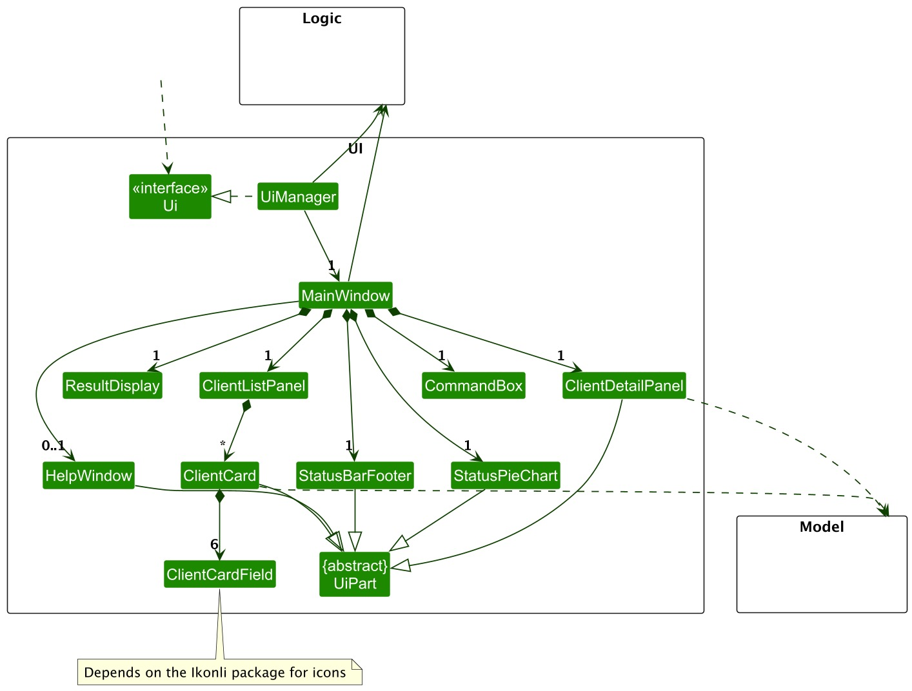

- Table of Contents
  {:toc}

---

## **Acknowledgements**

- {list here sources of all reused/adapted ideas, code, documentation, and third-party libraries -- include links to the original source as well}

---

## **Setting up, getting started**

Refer to the guide [_Setting up and getting started_](SettingUp.md).

---

## **Design**

:bulb: **Tip:** The `.puml` files used to create diagrams in this document `docs/diagrams` folder. Refer to the [_PlantUML Tutorial_ at se-edu/guides](https://se-education.org/guides/tutorials/plantUml.html) to learn how to create and edit diagrams.

### Architecture

The **_Architecture Diagram_** given above explains the high-level design of the App.

Given below is a quick overview of main components and how they interact with each other.

**Main components of the architecture**

**`Main`** (consisting of classes [`Main`](https://github.com/AY2425S1-CS2103-F10-3/tp/blob/master/src/main/java/seedu/address/Main.java) and [`MainApp`](https://github.com/AY2425S1-CS2103-F10-3/tp/blob/master/src/main/java/seedu/address/MainApp.java)) is in charge of the app launch and shut down.

- At app launch, it initializes the other components in the correct sequence, and connects them up with each other.
- At shut down, it shuts down the other components and invokes cleanup methods where necessary.

The bulk of the app's work is done by the following four components:

- [**`UI`**](#ui-component): The UI of the App.
- [**`Logic`**](#logic-component): The command executor.
- [**`Model`**](#model-component): Holds the data of the App in memory.
- [**`Storage`**](#storage-component): Reads data from, and writes data to, the hard disk.

[**`Commons`**](#common-classes) represents a collection of classes used by multiple other components.

**How the architecture components interact with each other**

The _Sequence Diagram_ below shows how the components interact with each other for the scenario where the user issues the command `delete 1`.

Each of the four main components (also shown in the diagram above),

- defines its _API_ in an `interface` with the same name as the Component.
- implements its functionality using a concrete `{Component Name}Manager` class (which follows the corresponding API `interface` mentioned in the previous point.

For example, the `Logic` component defines its API in the `Logic.java` interface and implements its functionality using the `LogicManager.java` class which follows the `Logic` interface. Other components interact with a given component through its interface rather than the concrete class (reason: to prevent outside component's being coupled to the implementation of a component), as illustrated in the (partial) class diagram below.

The sections below give more details of each component.

### UI component

The **API** of this component is specified in [`Ui.java`](https://github.com/AY2425S1-CS2103-F10-3/tp/blob/master/src/main/java/seedu/address/ui/Ui.java)

The UI consists of a `MainWindow` that is made up of parts e.g.`CommandBox`, `ResultDisplay`, `PersonListPanel`, `StatusBarFooter` etc. All these, including the `MainWindow`, inherit from the abstract `UiPart` class which captures the commonalities between classes that represent parts of the visible GUI.

The `UI` component uses the JavaFx UI framework. The layout of these UI parts are defined in matching `.fxml` files that are in the `src/main/resources/view` folder. For example, the layout of the [`MainWindow`](https://github.com/AY2425S1-CS2103-F10-3/tp/blob/master/src/main/java/seedu/address/ui/MainWindow.java) is specified in [`MainWindow.fxml`](https://github.com/AY2425S1-CS2103-F10-3/tp/blob/master/src/main/resources/view/MainWindow.fxml)

The `UI` component,

- executes user commands using the `Logic` component.
- listens for changes to `Model` data so that the UI can be updated with the modified data.
- keeps a reference to the `Logic` component, because the `UI` relies on the `Logic` to execute commands.
- depends on some classes in the `Model` component, as it displays `Person` object residing in the `Model`.

### Logic component

**API** : [`Logic.java`](https://github.com/AY2425S1-CS2103-F10-3/tp/blob/master/src/main/java/seedu/address/logic/Logic.java)

Here's a (partial) class diagram of the `Logic` component:

The sequence diagram below illustrates the interactions within the `Logic` component, taking `execute("delete 1")` API call as an example.

:information_source: **Note:** The lifeline for `DeleteCommandParser` should end at the destroy marker (X) but due to a limitation of PlantUML, the lifeline continues till the end of diagram.

How the `Logic` component works:

1. When `Logic` is called upon to execute a command, it is passed to an `AddressBookParser` object which in turn creates a parser that matches the command (e.g., `DeleteCommandParser`) and uses it to parse the command.
2. This results in a `Command` object (more precisely, an object of one of its subclasses e.g., `DeleteCommand`) which is executed by the `LogicManager`.
3. The command can communicate with the `Model` when it is executed (e.g. to delete a person). 
   Note that although this is shown as a single step in the diagram above (for simplicity), in the code it can take several interactions (between the command object and the `Model`) to achieve.
4. The result of the command execution is encapsulated as a `CommandResult` object which is returned back from `Logic`.

Here are the other classes in `Logic` (omitted from the class diagram above) that are used for parsing a user command:

How the parsing works:

- When called upon to parse a user command, the `AddressBookParser` class creates an `XYZCommandParser` (`XYZ` is a placeholder for the specific command name e.g., `AddCommandParser`) which uses the other classes shown above to parse the user command and create a `XYZCommand` object (e.g., `AddCommand`) which the `AddressBookParser` returns back as a `Command` object.
- All `XYZCommandParser` classes (e.g., `AddCommandParser`, `DeleteCommandParser`, ...) inherit from the `Parser` interface so that they can be treated similarly where possible e.g, during testing.

### Model component

**API** : [`Model.java`](https://github.com/AY2425S1-CS2103-F10-3/tp/blob/master/src/main/java/seedu/address/model/Model.java)

The `Model` component,

- stores the address book data i.e., all `Person` objects (which are contained in a `UniquePersonList` object).
- stores the currently 'selected' `Person` objects (e.g., results of a search query) as a separate _filtered_ list which is exposed to outsiders as an unmodifiable `ObservableList<Person>` that can be 'observed' e.g. the UI can be bound to this list so that the UI automatically updates when the data in the list change.
- stores a `UserPref` object that represents the user’s preferences. This is exposed to the outside as a `ReadOnlyUserPref` objects.
- does not depend on any of the other three components (as the `Model` represents data entities of the domain, they should make sense on their own without depending on other components)

:information_source: **Note:** An alternative (arguably, a more OOP) model is given below. It has a `Tag` list in the `AddressBook`, which `Person` references. This allows `AddressBook` to only require one `Tag` object per unique tag, instead of each `Person` needing their own `Tag` objects. 

### Storage component

**API** : [`Storage.java`](https://github.com/AY2425S1-CS2103-F10-3/tp/blob/master/src/main/java/seedu/address/storage/Storage.java)

The `Storage` component,

- can save both address book data and user preference data in JSON format, and read them back into corresponding objects.
- inherits from both `AddressBookStorage` and `UserPrefStorage`, which means it can be treated as either one (if only the functionality of only one is needed).
- depends on some classes in the `Model` component (because the `Storage` component's job is to save/retrieve objects that belong to the `Model`)

### Common classes

Classes used by multiple components are in the `seedu.address.commons` package.

---

## **Implementation**

This section describes some noteworthy details on how certain features are implemented.

### \[Proposed\] Undo/redo feature

#### Proposed Implementation

The proposed undo/redo mechanism is facilitated by `VersionedAddressBook`. It extends `AddressBook` with an undo/redo history, stored internally as an `addressBookStateList` and `currentStatePointer`. Additionally, it implements the following operations:

- `VersionedAddressBook#commit()` — Saves the current address book state in its history.
- `VersionedAddressBook#undo()` — Restores the previous address book state from its history.
- `VersionedAddressBook#redo()` — Restores a previously undone address book state from its history.

These operations are exposed in the `Model` interface as `Model#commitAddressBook()`, `Model#undoAddressBook()` and `Model#redoAddressBook()` respectively.

Given below is an example usage scenario and how the undo/redo mechanism behaves at each step.

Step 1. The user launches the application for the first time. The `VersionedAddressBook` will be initialized with the initial address book state, and the `currentStatePointer` pointing to that single address book state.

Step 2. The user executes `delete 5` command to delete the 5th person in the address book. The `delete` command calls `Model#commitAddressBook()`, causing the modified state of the address book after the `delete 5` command executes to be saved in the `addressBookStateList`, and the `currentStatePointer` is shifted to the newly inserted address book state.

Step 3. The user executes `add n/David …​` to add a new person. The `add` command also calls `Model#commitAddressBook()`, causing another modified address book state to be saved into the `addressBookStateList`.

:information_source: **Note:** If a command fails its execution, it will not call `Model#commitAddressBook()`, so the address book state will not be saved into the `addressBookStateList`.

Step 4. The user now decides that adding the person was a mistake, and decides to undo that action by executing the `undo` command. The `undo` command will call `Model#undoAddressBook()`, which will shift the `currentStatePointer` once to the left, pointing it to the previous address book state, and restores the address book to that state.

:information_source: **Note:** If the `currentStatePointer` is at index 0, pointing to the initial AddressBook state, then there are no previous AddressBook states to restore. The `undo` command uses `Model#canUndoAddressBook()` to check if this is the case. If so, it will return an error to the user rather
than attempting to perform the undo.

The following sequence diagram shows how an undo operation goes through the `Logic` component:

:information_source: **Note:** The lifeline for `UndoCommand` should end at the destroy marker (X) but due to a limitation of PlantUML, the lifeline reaches the end of diagram.

Similarly, how an undo operation goes through the `Model` component is shown below:

The `redo` command does the opposite — it calls `Model#redoAddressBook()`, which shifts the `currentStatePointer` once to the right, pointing to the previously undone state, and restores the address book to that state.

:information_source: **Note:** If the `currentStatePointer` is at index `addressBookStateList.size() - 1`, pointing to the latest address book state, then there are no undone AddressBook states to restore. The `redo` command uses `Model#canRedoAddressBook()` to check if this is the case. If so, it will return an error to the user rather than attempting to perform the redo.

Step 5. The user then decides to execute the command `list`. Commands that do not modify the address book, such as `list`, will usually not call `Model#commitAddressBook()`, `Model#undoAddressBook()` or `Model#redoAddressBook()`. Thus, the `addressBookStateList` remains unchanged.

Step 6. The user executes `clear`, which calls `Model#commitAddressBook()`. Since the `currentStatePointer` is not pointing at the end of the `addressBookStateList`, all address book states after the `currentStatePointer` will be purged. Reason: It no longer makes sense to redo the `add n/David …​` command. This is the behavior that most modern desktop applications follow.

The following activity diagram summarizes what happens when a user executes a new command:

#### Design considerations:

**Aspect: How undo & redo executes:**

- **Alternative 1 (current choice):** Saves the entire address book.

  - Pros: Easy to implement.
  - Cons: May have performance issues in terms of memory usage.

- **Alternative 2:** Individual command knows how to undo/redo by
  itself.
  - Pros: Will use less memory (e.g. for `delete`, just save the person being deleted).
  - Cons: We must ensure that the implementation of each individual command are correct.

_{more aspects and alternatives to be added}_

### \[Proposed\] Data archiving

_{Explain here how the data archiving feature will be implemented}_

---

## **Documentation, logging, testing, configuration, dev-ops**

- [Documentation guide](Documentation.md)
- [Testing guide](Testing.md)
- [Logging guide](Logging.md)
- [Configuration guide](Configuration.md)
- [DevOps guide](DevOps.md)

---

## **Appendix: Requirements**

### Product scope

**Target user profile**:

A sales and customer relations representative working in the F&B industry. In
particular, this representative works with B2B sales.

- has a need to manage a significant number of business contacts
- prefer desktop apps over other types
- can type fast
- prefers typing to mouse interactions
- is reasonably comfortable using CLI apps

**Value proposition**: This product aims to streamline and simplify sales management for Food and Beverage outlets. By providing an organized, easy-to-use platform for managing business contacts, it helps sales representatives save time and improve efficiency.

### User stories

Priorities: High (must have) - `* * *`, Medium (nice to have) - `* *`, Low (unlikely to have) - `*`

| Priority | As a …           | I want to …                                                                 | So that I can …                                                       |
| -------- | ---------------- |-----------------------------------------------------------------------------|-----------------------------------------------------------------------|
| `* * *`  | user             | add a new contact                                                           | save the contact information of people                                |
| `* * *`  | user             | delete a contact                                                            | free up space in my app                                               |
| `* * *`  | user             | view all contact                                                            | see the full list of contacts                                         |
| `* * *`  | user             | view a contact                                                              | retrieve contact information of a person                              |
| `* * *`  | user             | save all contact                                                            | retain all information for when i reopen the app                      |
| `* * *`  | sales rep        | have a low query time                                                       | avoid wasting much time querying my desired contact                   |
| `* *`    | user             | find a person by name                                                       | locate details of persons without having to go through the entire list |
| `* *`    | user             | search through my contacts                                                  | find a specific person                                                 |
| `* *`    | new user         | see usage instructions                                                      | know how to use the app                                                |
| `* *`    | user             | edit contact                                                                | update contact with new information                                    |
| `* *`    | user             | sort contact by name                                                        | see whose contact I have saved                                         |
| `* *`    | user             | pin a specific contact                                                      | view them on a separate list                                           |
| `* *`    | user             | archive contact                                                             | hide less frequently used contacts without deleting them               |
| `* *`    | user             | be alerted when a contact already exist                                     | avoid accidentally creating a duplicate                                |
| `* *`    | user             | hide private contact details                                                | minimize chance of someone else seeing them by accident                |
| `* *`    | user             | undo a command                                                              | fix a mistake I made                                                   |
| `* *`    | new user         | import all contact details into the app                                     | start using without manual setup                                       |
| `* *`    | sales rep        | keep track of clients I have contacted by seeing when I last contacted them | avoid wasting time calling them again about the same product           |
| `* *`    | sales rep        | view my most popular/active clients                                         | promote the new product                                                |
| `* *`    | sales rep        | remember the client's preferred products                                    | recommend related products                                             |
| `* *`    | sales rep        | add notes to client's contact                                               | keep track of my conversation with them                                |
| `* *`    | sales rep        | delete notes from a client's contact                                        | remove incorrect or outdated notes                                    |
| `* *`    | sales rep        | group my clients by industry                                                | tell if sales are doing well in that industry among other metrics      |
| `* *`    | sales rep        | add tags to clients                                                         | categorize them                                                        |
| `* *`    | sales rep        | keep note of my client's email addresses                                    | potentially send promotions or survey forms                            |
| `* *`    | sales rep        | export a list of contact emails                                             | add them to a mailing list                                             |
| `* *`    | sales rep        | export my contacts                                                          | send it to my coworker who needs it for his work                       |
| `* *`    | sales rep        | add a tag to multiple clients                                               | tag the clients more easily                                            |
| `*`      | user             | sort contacts by name                                                       | locate a person easily                                                 |
| `*`      | experienced user | use keyboard shortcuts                                                      | navigate the app faster                                                |
| `*`      | sales rep        | contact my client quickly from the app                                      | avoid typing numbers repeatedly on my _device_                         |

### Use cases

(For all use cases below, the **System** is the `Bizbook` and the **Actor** is the `user`, unless specified otherwise)

**Use case: UC1 - Add a person**

**MSS**

1.  Actor requests to add a new person.
2.  System shows details of the newly added person.

    Use case ends.

**Extensions**

- 1a. The details entered about the new person are invalid.

  - 1a1. System shows an error message.

    Use case ends.

- 1b. A person with the same identifier is already in contact list.

  - 1b1. System shows duplicate person message.

    Use case ends.

**Use case: UC2 - List all people**

**MSS**

1.  Actor requests to list all people saved in the System.
2.  System shows a list of people.

    Use case ends.

**Extensions**

- 1a. No contacts stored in the System.

  - 1a1. System informs Actor that they have no contacts stored.

    Use case ends.

**Use case: UC3 - Delete a person**

**MSS**

1.  Actor performs <u>list all people (UC2)</u>.
2.  Actor requests to delete a specific person in the list.
3.  System shows details of deleted person.

    Use case ends.

**Extensions**

- 2a. The specified person is invalid.

  - 2a1. System shows an error message.

    Use case ends.

**Use case: UC4 - View person contact**

**MSS**

1.  Actor request to see specific person.
2.  System shows person's contact details.

    Use case ends.

**Extensions**

- 1a. The specified person is invalid.

  - 1a1. System shows an error message.

    Use case ends.

**Use case: UC5 - Find people**

**MSS**

1.  Actor requests to find specific people.
2.  System shows a filtered list of people.

    Use case ends.

**Extensions**

- 1a. No contacts match keywords.

  - 1a1. System informs Actor that they have no contacts that match.

    Use case ends.

**Use case: UC6 - Add notes to a person contact**

**MSS**

1.  Actor performs <u>list all people (UC2)</u>.
2.  Actor requests to add a note to a specific person.
3.  System shows details of the newly added note to that person.

    Use case ends.

**Extensions**

- 2a. The specified person is invalid.

  - 2a1. System shows an error message.

    Use case ends.

- 2b. The note name is invalid.

  - 2b1. System shows an error message.

    Use case ends.

**Use case: UC7 - Pin a person**

**MSS**

1.  Actor performs <u>list all people (UC2)</u>.
2.  Actor requests to pin a specific person.
3.  System shows details of newly pinned person.

**Extension**

- 2a. The person is already pinned.

  - 2a1. System shows duplicated pin message.

    Use case ends.

**Use case: UC8 - Delete note from a person contact**

**MSS**

1.  Actor performs <u>list all people (UC2)</u>.
2.  Actor requests to delete a specific note from a specific person.
3.  System shows updated details excluding deleted note from that person.

    Use case ends.

**Extensions**

- 2a. The specified person is invalid.

    - 2a1. System shows an error message.

      Use case ends.

- 2b. The note index is invalid.

    - 2b1. System shows an error message.

      Use case ends.

**Use case: UC9 - Export contact list**

**MSS**

1.  Actor requests to export contact list to a specific file.
2.  System exports the contact information into the file.

    Use case ends.

**Extensions**

- 1a. System detects that the directory does not exist.

    - 1a1. System creates the directory.

      Use case resumes from step 2.

- 1b. System detects that the file is used by another process.

    - 1b1. System shows an error message.

      Use case ends.

### Non-Functional Requirements

1.  The system should work on any _mainstream OS_ as long as it has Java `17` or above installed.
2.  The system should be able to hold up to 1000 contacts without a noticeable sluggishness in performance for typical usage.
3.  The system should be developed in a modular way for easier updates and bug fixes.
4.  The system should ensure data consistency accross all instances.
5.  The system should continue functioning in the event of a missing or corrupted save file.
6.  The system should encrypt sensitive data to follow data protection laws.
7.  The interface should be intuitive and easy to use.

_{More to be added}_

### Glossary

- **Mainstream OS**: Windows, Linux, Unix, MacOS
- **Private contact detail**: A contact detail that is not meant to be shared with others
- **Device**: system with dialing and calling capabilities

---

## **Appendix: Instructions for manual testing**

Given below are instructions to test the app manually.

:information_source: **Note:** These instructions only provide a starting point for testers to work on;
testers are expected to do more *exploratory* testing.

### Launch and shutdown

1. Initial launch

   1a. Download the jar file and copy into an empty folder

   2b. Double-click the jar file Expected: Shows the GUI with a set of sample contacts. The window size may not be optimum.

2. Saving window preferences

   2a. Resize the window to an optimum size. Move the window to a different location. Close the window.

   2b. Re-launch the app by double-clicking the jar file. 
   Expected: The most recent window size and location is retained.

3. _{ more test cases …​ }_

### Deleting a person

1. Deleting a person while all persons are being shown

   1a. Prerequisites: List all persons using the `list` command. Multiple persons in the list.

   1b. Test case: `delete 1` 
   Expected: First contact is deleted from the list. Details of the deleted contact shown in the status message. Timestamp in the status bar is updated.

   1c. Test case: `delete 0` 
   Expected: No person is deleted. Error details shown in the status message. Status bar remains the same.

   1d. Other incorrect delete commands to try: `delete`, `delete x`, `...` (where x is larger than the list size) 
   Expected: Similar to previous.

2. _{ more test cases …​ }_

### Saving data

1. Dealing with missing/corrupted data files

   1a. _{explain how to simulate a missing/corrupted file, and the expected behavior}_

2. _{ more test cases …​ }_
