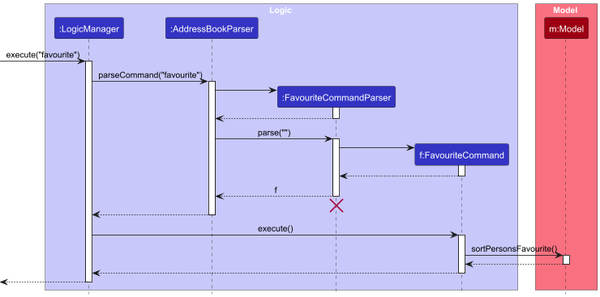

* Table of Contents
  {:toc}

--------------------------------------------------------------------------------------------------------------------

## **Acknowledgements**

* {list here sources of all reused/adapted ideas, code, documentation, and third-party libraries -- include links to the
  original source as well}
* The use cases within the Developer Guide and the commands in User Guide were formatted into GFMD style using GPT-4o. The content itself was self-written by the team.

--------------------------------------------------------------------------------------------------------------------

## **Setting up, getting started**

Refer to the guide [_Setting up and getting started_](SettingUp.md).

--------------------------------------------------------------------------------------------------------------------

## **Design**

<div markdown="span" class="alert alert-primary">

:bulb: **Tip:** The `.puml` files used to create diagrams in this document `docs/diagrams` folder. Refer to the [
_PlantUML Tutorial_ at se-edu/guides](https://se-education.org/guides/tutorials/plantUml.html) to learn how to create
and edit diagrams.
</div>

### Architecture


The ***Architecture Diagram*** given above explains the high-level design of the App.

Given below is a quick overview of main components and how they interact with each other.

**Main components of the architecture**

**`Main`** (consisting of
classes [`Main`](https://github.com/se-edu/addressbook-level3/tree/master/src/main/java/seedu/address/Main.java)
and [`MainApp`](https://github.com/se-edu/addressbook-level3/tree/master/src/main/java/seedu/address/MainApp.java)) is
in charge of the app launch and shut down.

* At app launch, it initializes the other components in the correct sequence, and connects them up with each other.
* At shut down, it shuts down the other components and invokes cleanup methods where necessary.

The bulk of the app's work is done by the following four components:

* [**`UI`**](#ui-component): The UI of the App.
* [**`Logic`**](#logic-component): The command executor.
* [**`Model`**](#model-component): Holds the data of the App in memory.
* [**`Storage`**](#storage-component): Reads data from, and writes data to, the hard disk.

[**`Commons`**](#common-classes) represents a collection of classes used by multiple other components.

**How the architecture components interact with each other**

The *Sequence Diagram* below shows how the components interact with each other for the scenario where the user issues
the command `delete 1`.


Each of the four main components (also shown in the diagram above),

* defines its *API* in an `interface` with the same name as the Component.
* implements its functionality using a concrete `{Component Name}Manager` class (which follows the corresponding
  API `interface` mentioned in the previous point.

For example, the `Logic` component defines its API in the `Logic.java` interface and implements its functionality using
the `LogicManager.java` class which follows the `Logic` interface. Other components interact with a given component
through its interface rather than the concrete class (reason: to prevent outside component's being coupled to the
implementation of a component), as illustrated in the (partial) class diagram below.


The sections below give more details of each component.

### UI component

The **API** of this component is specified
in [`Ui.java`](https://github.com/se-edu/addressbook-level3/tree/master/src/main/java/seedu/address/ui/Ui.java)


The UI consists of a `MainWindow` that is made up of parts
e.g.`CommandBox`, `ResultDisplay`, `PersonListPanel`, `StatusBarFooter` etc. All these, including the `MainWindow`,
inherit from the abstract `UiPart` class which captures the commonalities between classes that represent parts of the
visible GUI.

The UI for the Single page person view is a standalone UI window that is called through the functionalities of the
application itself.

The `UI` component uses the JavaFx UI framework. The layout of these UI parts are defined in matching `.fxml` files that
are in the `src/main/resources/view` folder. For example, the layout of
the [`MainWindow`](https://github.com/se-edu/addressbook-level3/tree/master/src/main/java/seedu/address/ui/MainWindow.java)
is specified
in [`MainWindow.fxml`](https://github.com/se-edu/addressbook-level3/tree/master/src/main/resources/view/MainWindow.fxml)

The `UI` component,

* executes user commands using the `Logic` component.
* listens for changes to `Model` data so that the UI can be updated with the modified data.
* keeps a reference to the `Logic` component, because the `UI` relies on the `Logic` to execute commands.
* depends on some classes in the `Model` component, as it displays `Person` object residing in the `Model`.

### Logic component

**API** : [`Logic.java`](https://github.com/se-edu/addressbook-level3/tree/master/src/main/java/seedu/address/logic/Logic.java)

Here's a (partial) class diagram of the `Logic` component:


The sequence diagram below illustrates the interactions within the `Logic` component, taking `execute("delete 1")` API
call as an example.


<div markdown="span" class="alert alert-info">:information_source: <strong>Note:</strong> The lifeline for `DeleteCommandParser` should end at the destroy marker (X) but due to a limitation of PlantUML, the lifeline continues till the end of diagram.
</div>

How the `Logic` component works:

1. When `Logic` is called upon to execute a command, it is passed to an `AddressBookParser` object which in turn creates
   a parser that matches the command (e.g., `DeleteCommandParser`) and uses it to parse the command.
2. This results in a `Command` object (more precisely, an object of one of its subclasses e.g., `DeleteCommand`) which
   is executed by the `LogicManager`.
3. The command can communicate with the `Model` when it is executed (e.g. to delete a person).<br>
   Note that although this is shown as a single step in the diagram above (for simplicity), in the code it can take
   several interactions (between the command object and the `Model`) to achieve.
4. The result of the command execution is encapsulated as a `CommandResult` object which is returned back from `Logic`.

Here are the other classes in `Logic` (omitted from the class diagram above) that are used for parsing a user command:


How the parsing works:

* When called upon to parse a user command, the `AddressBookParser` class creates an `XYZCommandParser` (`XYZ` is a
  placeholder for the specific command name e.g., `AddCommandParser`) which uses the other classes shown above to parse
  the user command and create a `XYZCommand` object (e.g., `AddCommand`) which the `AddressBookParser` returns back as
  a `Command` object.
* All `XYZCommandParser` classes (e.g., `AddCommandParser`, `DeleteCommandParser`, ...) inherit from the `Parser`
  interface so that they can be treated similarly where possible e.g, during testing.

### Model component

**API** : [`Model.java`](https://github.com/se-edu/addressbook-level3/tree/master/src/main/java/seedu/address/model/Model.java)


The `Model` component,

* stores the address book data i.e., all `Person` objects (which are contained in a `UniquePersonList` object).
* stores the currently 'selected' `Person` objects (e.g., results of a search query) as a separate _filtered_ list which
  is exposed to outsiders as an unmodifiable `ObservableList<Person>` that can be 'observed' e.g. the UI can be bound to
  this list so that the UI automatically updates when the data in the list change.
* stores a `UserPref` object that represents the user’s preferences. This is exposed to the outside as
  a `ReadOnlyUserPref` objects.
* does not depend on any of the other three components (as the `Model` represents data entities of the domain, they
  should make sense on their own without depending on other components)

<div markdown="span" class="alert alert-info">:information_source: <strong>Note:</strong> An alternative (arguably, a more OOP) model is given below. It has a `Tag` list in the `AddressBook`, which `Person` references. This allows `AddressBook` to only require one `Tag` object per unique tag, instead of each `Person` needing their own `Tag` objects.<br>


</div>

### Storage component

**API** : [`Storage.java`](https://github.com/se-edu/addressbook-level3/tree/master/src/main/java/seedu/address/storage/Storage.java)


The `Storage` component,

* can save both address book data and user preference data in JSON format, and read them back into corresponding
  objects.
* inherits from both `AddressBookStorage` and `UserPrefStorage`, which means it can be treated as either one (if only
  the functionality of only one is needed).
* depends on some classes in the `Model` component (because the `Storage` component's job is to save/retrieve objects
  that belong to the `Model`)

### Common classes

Classes used by multiple components are in the `seedu.address.commons` package.

--------------------------------------------------------------------------------------------------------------------

## **Implementation**

This section describes some noteworthy details on how certain features are implemented.

### \[Proposed\] Undo/redo feature

#### Proposed Implementation

The proposed undo/redo mechanism is facilitated by `VersionedAddressBook`. It extends `AddressBook` with an undo/redo
history, stored internally as an `addressBookStateList` and `currentStatePointer`. Additionally, it implements the
following operations:

* `VersionedAddressBook#commit()`— Saves the current address book state in its history.
* `VersionedAddressBook#undo()`— Restores the previous address book state from its history.
* `VersionedAddressBook#redo()`— Restores a previously undone address book state from its history.

These operations are exposed in the `Model` interface as `Model#commitAddressBook()`, `Model#undoAddressBook()`
and `Model#redoAddressBook()` respectively.

Given below is an example usage scenario and how the undo/redo mechanism behaves at each step.

Step 1. The user launches the application for the first time. The `VersionedAddressBook` will be initialized with the
initial address book state, and the `currentStatePointer` pointing to that single address book state.


Step 2. The user executes `delete 5` command to delete the 5th person in the address book. The `delete` command
calls `Model#commitAddressBook()`, causing the modified state of the address book after the `delete 5` command executes
to be saved in the `addressBookStateList`, and the `currentStatePointer` is shifted to the newly inserted address book
state.


Step 3. The user executes `add n/David …​` to add a new person. The `add` command also
calls `Model#commitAddressBook()`, causing another modified address book state to be saved into
the `addressBookStateList`.


<div markdown="span" class="alert alert-info">:information_source: <strong>Note:</strong> If a command fails its execution, it will not call `Model#commitAddressBook()`, so the address book state will not be saved into the `addressBookStateList`.

</div>

Step 4. The user now decides that adding the person was a mistake, and decides to undo that action by executing
the `undo` command. The `undo` command will call `Model#undoAddressBook()`, which will shift the `currentStatePointer`
once to the left, pointing it to the previous address book state, and restores the address book to that state.


<div markdown="span" class="alert alert-info">:information_source: <strong>Note:</strong> If the `currentStatePointer` is at index 0, pointing to the initial AddressBook state, then there are no previous AddressBook states to restore. The `undo` command uses `Model#canUndoAddressBook()` to check if this is the case. If so, it will return an error to the user rather
than attempting to perform the undo.

</div>

The following sequence diagram shows how an undo operation goes through the `Logic` component:


<div markdown="span" class="alert alert-info">:information_source: <strong>Note:</strong> The lifeline for `UndoCommand` should end at the destroy marker (X) but due to a limitation of PlantUML, the lifeline reaches the end of diagram.

</div>

Similarly, how an undo operation goes through the `Model` component is shown below:


The `redo` command does the opposite — it calls `Model#redoAddressBook()`, which shifts the `currentStatePointer` once
to the right, pointing to the previously undone state, and restores the address book to that state.

<div markdown="span" class="alert alert-info">:information_source: <strong>Note:</strong> If the `currentStatePointer` is at index `addressBookStateList.size() - 1`, pointing to the latest address book state, then there are no undone AddressBook states to restore. The `redo` command uses `Model#canRedoAddressBook()` to check if this is the case. If so, it will return an error to the user rather than attempting to perform the redo.

</div>

Step 5. The user then decides to execute the command `list`. Commands that do not modify the address book, such
as `list`, will usually not call `Model#commitAddressBook()`, `Model#undoAddressBook()` or `Model#redoAddressBook()`.
Thus, the `addressBookStateList` remains unchanged.


Step 6. The user executes `clear`, which calls `Model#commitAddressBook()`. Since the `currentStatePointer` is not
pointing at the end of the `addressBookStateList`, all address book states after the `currentStatePointer` will be
purged. Reason: It no longer makes sense to redo the `add n/David …​` command. This is the behavior that most modern
desktop applications follow.


The following activity diagram summarizes what happens when a user executes a new command:


#### Design considerations:

**Aspect: How undo & redo executes:**

* **Alternative 1 (current choice):** Saves the entire address book.
    * Pros: Easy to implement.
    * Cons: May have performance issues in terms of memory usage.

* **Alternative 2:** Individual command knows how to undo/redo by
  itself.
    * Pros: Will use less memory (e.g. for `delete`, just save the person being deleted).
    * Cons: We must ensure that the implementation of each individual command are correct.

_{more aspects and alternatives to be added}_


### View Window
The view window function in the application allows for the user
to  view the full contents of a contact through a pop-up GUI.

Given it is a pop-up there is a different mechanism that calls and closes
the view window.

Given below is a sequence diagram to highlight the differences in implementation


### Log Command
Log command add a log entry to person at given index.
Given below is a sequence diagram of favourite command usage.


### Favourite Command
Favourite command given different parameter can favourite/unfavourite a person in the list at the given index, or sort the list by Favourite.
Given below is a sequence diagram of favourite command usage.




<div markdown="span" class="alert alert-info">:information_source: <strong>Note:</strong> The lifeline for `FavouriteCommandParser` should end at the destroy marker (X) but due to a limitation of PlantUML, the lifeline continues till the end of diagram.


### \[Proposed\] Data archiving

_{Explain here how the data archiving feature will be implemented}_


--------------------------------------------------------------------------------------------------------------------

## **Documentation, logging, testing, configuration, dev-ops**

* [Documentation guide](Documentation.md)
* [Testing guide](Testing.md)
* [Logging guide](Logging.md)
* [Configuration guide](Configuration.md)
* [DevOps guide](DevOps.md)

--------------------------------------------------------------------------------------------------------------------

## **Appendix: Requirements**

### Product scope

**Target user profile**

* Real estate agents
* Need manage a large number of clients with varying details
* Need to record past engagement with clients
* Can type fast
* Prefers typing to mouse interactions
* Is reasonably comfortable using CLI apps

**Value proposition**: 
This app helps real estate agents efficiently manage client relationships by centralizing contact details and logging
interactions. Also, automated reminders and notes ensure that you never miss an opportunity to engage clients. It
simplifies client management but focuses only on handling moderate-sized contact lists, without support for financial
transactions, property details, or large-scale CRM functions.


### User stories

Priorities: High (must have) - `* * *`, Medium (nice to have) - `* *`, Low (unlikely to have) - `*`

| Priority | As a …​                                          | I want to …​                                                 | So that I can…​                                                                                |
|--------|--------------------------------------------------|--------------------------------------------------------------|------------------------------------------------------------------------------------------------|
| `* * *` | new user                                         | see usage instructions                                       | refer to instructions when I forget how to use the App                                         |
| `* * *` | salesperson                                      | add a new contact with details (name, phone, email)          | store client information in the address book                                                   |
| `* * *` | salesperson                                      | delete a contact                                             | remove people that I no longer interact with                                                   |
| `* * *` | salesperson                                      | search for a contact by name                                 | quickly find the client without manually scrolling through the list                            |
| `* * *` | salesperson with many clients in the address book | find a person by name                                        | locate details of persons without having to go through the entire list                         |
| `* *`  | salesperson with many clients in the address book | find people by category                                      | view a collection of persons in the same category without having to go through the entire list |
| `* *`  | salesperson                                      | add notes and remarks for a contact                          | remember snippets of information about my clients                                              |
| `* *`  | real estate agent                                | attach properties to a contact                               | easily identify what properties a client is looking at                                         |
| `* *`  | salesperson                                      | be reminded of important events                              | minimize chance of missing these important events                                              |
| `* *`  | salesperson                                      | system to check the validity of all inputs                   | avoid entering incorrect or incomplete data                                                    |
| `* *`  | salesperson                                      | view the history of interactions with a contact              | keep track of past communication (e.g., notes, calls, meetings)                                |
| `* *`  | salesperson                                      | mark certain contacts as favourites                          | easily access the most important clients at the top of the list                                |
| `* *`  | salesperson                                      | store incomplete information                                 | later update it with more details or correct outdated information                              |
| `* *`  | salesperson with many clients in the address book        | keep track of important contacts                             | locate an important person easily                                                              |
| `* *`  | salesperson with many clients in the address book                                      | sort contacts alphabetically by their name                   | easily browse through the address book                                                         |
| `* *`  | salesperson                                      | view all information about a contact on one page             | see all relevant details of a client without clicking multiple times                           |
| `*`    | salesperson                                      | receive a confirmation prompt before clearing all contacts   | avoid accidental deletion of the entire address book                                           |
| `*`    | salesperson                                      | receive a success notification after adding/editing/deleting | know the operation was completed correctly                                                     |
| `*`    | user                                             | hide private contact details                                 | minimize chance of someone else seeing them by accident                                        |


### Use cases

(For all use cases below, the **System** is the `AddressBook` and the **Actor** is the `user`, unless specified
otherwise)

### Use Case: **UC01 - Delete a Contact**

**Actor**: Salesperson  
**Precondition**: The contact exists in the contact list.  
**Guarantees**: The specified contact is removed from the AddressBook, and the Salesperson receives confirmation of the deletion.

#### Main Success Scenario (MSS):
1. The Salesperson requests to list persons.
2. AddressBook displays a list of persons.
3. The Salesperson issues the `delete` command with a valid contact index.
4. AddressBook validates the contact index.
5. AddressBook removes the specified contact from the contact list.
6. AddressBook displays a success message: "Contact `<Name>` deleted."

   **Use case ends.**

---

#### Extensions:
- **2a.** The list is empty.
  - **Use case ends.**

- **3a.** The command format is incorrect (e.g., index not provided).
  - **3a1.** AddressBook displays an error message:
    ```
    Invalid command format! 
    delete: Deletes the person identified by the index number used in the displayed person list.
    Parameters: INDEX (must be a positive integer)
    Example: delete 1
    ```
  - **Use case resumes at Step 2.**

- **4a.** The contact index is invalid or out of bounds.
  - **4a1.** AddressBook displays an error message: `The person index provided is invalid.`
  - **4a2.** The Salesperson corrects the contact index and reissues the command.
  - **Use case resumes from Step 3.**

---

#### Including Related Use Cases:
- **UC06 - View Full Contact Details**: The Salesperson may use this use case to view the contact’s full details before confirming the deletion.
- **UC09 - Display Help Information**: The `help` command will include instructions on how to use the `delete` command.

---

#### Variations:
- **1a.** The Salesperson deletes a contact by issuing the `delete` command with a valid index.
  - **Use case proceeds normally from Step 4.**

- **1b.** The Salesperson deletes a contact after viewing the contact details.
  - **Use case proceeds normally from Step 4.**

---

### Use Case: **UC02 - Sort Contact List Alphabetically**
**Actor**: Salesperson  
**Precondition**: The system has a non-empty list of contacts.  
**Guarantees**: The contact list is sorted in the specified order (ascending or descending), and the Salesperson can view the sorted list.

#### Main Success Scenario (MSS):
1. The Salesperson issues the `sort` command with a specified order (ascending or descending).
2. The system validates the sorting parameter (`asc` or `desc`).
3. The system sorts the contact list based on the specified order.
4. The sorted contact list is displayed.
5. The system shows a success message: `Contacts sorted <A-Z/Z-A>`

   **Use case ends.**

---

#### Extensions:
- **2a.** The entered sorting parameter is invalid (e.g., `ascending` instead of `asc`).
    - **2a1.** The system displays an error message: `Invalid sorting order. Use 'asc' for ascending or 'desc' for descending.`
    - **2a2.** The Salesperson corrects the sorting parameter and reissues the command.
    - **Use case resumes from Step 2.**

- **2b.** The Salesperson forgets to specify the sorting order.
    - **2b1.** The system displays an error message: `Error: No sorting order provided. Please specify 'asc' or 'desc'.`
    - **2b2.** The Salesperson adds the correct sorting order and reissues the command.
    - **Use case resumes from Step 2.**

---

#### Variations:
- **1a.** The Salesperson issues the `sort asc` command to sort the contacts in ascending order.
    - **Use case proceeds normally from Step 2.**

- **1b.** The Salesperson issues the `sort desc` command to sort the contacts in descending order.
    - **Use case proceeds normally from Step 2.**

---

#### Postconditions:
- The contact list is displayed in the specified alphabetical order. The system does not change the underlying data, only the view of the contact list.

---

### Use Case: **UC03 - Log Interaction with Contact**

**Actor**: Salesperson  
**Precondition**: The contact exists in the AddressBook contact list.  
**Guarantees**: The interaction details are saved under the specified contact’s history, optionally including the date of the interaction, for future reference.

#### Main Success Scenario (MSS):
1. The Salesperson issues the `log` command with a valid `index`, an optional date (`d/`) in the `yyyy-mm-dd` format, and descriptive interaction details (`l/`).
2. AddressBook validates each component:
  - **index**: Ensures the provided ID is a numeric identifier that corresponds to an existing contact in the AddressBook.
  - **Date** (if included): Confirms that the date follows the required `yyyy-mm-dd` format and checks that it falls within the acceptable date range (not before the contact’s creation date or beyond the current date).
  - **Interaction Details**: Verifies that the interaction details are provided and are non-empty, allowing the Salesperson to record free-form notes about the interaction, such as the nature, location, or purpose.
3. Upon successful validation, AddressBook logs the interaction details in the contact’s profile. If a date is provided, it is also stored with the log entry.
4. AddressBook displays a success message confirming the operation:
   ```
   Added history to Person: William Go; Phone: 96341234; Email: william.go@example.com; Address: Blk 34 Bishan St 23, #07-45; Remark: Looking to purchase condo; Birthday: 1975-12-30; Remark: Looking to purchase condo; Tags: [buyer]; DateOfCreation: 2024-01-22; History: Date of Creation: 2024-01-22
   [2024-02-05]:
     [2024-02-05] Negotiated condo deal
   [2024-03-03]:
     [2024-03-03] Follow-up on condo purchase
   ; PropertyList: Property List:
   Property at 246 Sentosa Cove, Sentosa (Condo): 180.00 sqm, 3 bed, 3 bath - $3000000.00
   ```
5. The contact’s interaction history is updated to include the new log entry, making it accessible for future reference and review.

   **Use case ends.**

---

#### Extensions:
- **2a.** The `index` is of invalid format (not a positive integer).
  - **2a1.** The system displays an error message:
    ```
    Invalid command format!
    favourite: Marks a person as a favourite or sorts all favourite persons to the top of the list.
    Two usage formats are supported:
    1. To mark a person as favourite: Specify the index of the person in the displayed list.
       Parameters: INDEX (must be a positive integer)
       Example: favourite 1
    2. To sort all favourite persons to the top: Use the command without any parameters.
       Example: favourite
    ```
  - **2a2.** The Salesperson corrects the `index` and reissues the command.
  - **Use case resumes from Step 2.**

- **2b.** The `index` is out of bound (larger than the last existing contact).
  - **2b1.** The system displays an error message: `The person index provided is out of bound`
  - **2b2.** The Salesperson corrects the `index` and reissues the command.
  - **Use case resumes from Step 2.**

- **2c.** The optional date is provided but is either in an invalid format or outside the valid range:
  - **2c1.** AddressBook displays an error message: `Invalid date format! Please use yyyy-mm-dd.`
  - **2c2.** The Salesperson corrects or removes the date and reissues the command.
  - **Use case resumes from Step 2.**

- **2d.** The optional date is provided but is before the date of creation of the contact:
  - **2d1.** AddressBook displays an error message: `<Date entered> is before the date of creation of this log <Date of creation>!`
  - **2d2.** The Salesperson corrects or removes the date and reissues the command.
  - **Use case resumes from Step 2.**

- **2e.** The optional date is provided but is in the future:
  - **2e1.** AddressBook displays an error message: `<Date entered> is in the future!`
  - **2e2.** The Salesperson corrects or removes the date and reissues the command.
  - **Use case resumes from Step 2.**

- **2f.** The interaction details are missing or empty:
  - **2f1.** AddressBook displays an error message: `Message cannot be empty`
  - **2f2.** The Salesperson adds the interaction details and reissues the `log` command.
  - **Use case resumes from Step 2.**

---

#### Including Related Use Cases:
- **UC06 - View Full Contact Details**: The Salesperson can use this case to view the entire history of interactions logged for a specific contact, including details added through this `log` command.

---

#### Variations:
- **1a.** The Salesperson includes an optional date in the interaction log (e.g., `d/<Event date>`).
  - **Use case proceeds normally from Step 2.**

- **1b.** The Salesperson omits the date, logging only the interaction details.
  - **Use case proceeds normally from Step 2.**

---

#### Postconditions:
- The interaction is recorded under the specified contact’s history. If a date is provided, it is included with the log entry. This log is now accessible in future interactions for tracking communication history.

---

### Use Case: **UC04 - Find Contacts by Name**

**Actor**: Salesperson  
**Precondition**: The system contains a list of contacts.  
**Guarantees**: The contacts matching the search criteria are displayed.

#### **Main Success Scenario (MSS):**
1. The Salesperson issues the `find` command with one or more keywords as input.
2. The system performs a case-insensitive search of the contact list, matching contacts whose names contain any of the keywords provided (an OR search).
   * The search matches only full words in the name field and ignores the order of keywords.
3. The system displays a list of contacts that match at least one of the keywords.
4. The system shows a success message: `<Number of persons matching the search> persons listed!`

   **Use case ends.**

---

### **Extensions:**
- **2a.** The search input does not match any contacts.
  - **2a1.** The system displays a message: `0 persons listed!`
  - **Use case ends.**

---

### Variations:
- **1a.** The Salesperson enters multiple keywords (e.g., `find Alex David`).
  - The system finds contacts that match at least one keyword, displaying persons such as `Alex Yeoh` and `David Li`.
  - **Use case proceeds normally from Step 3.**

---

### Postconditions:
- The list of matching contacts is displayed based on the keywords entered, allowing for case-insensitive and partial order matching.

---

### Use Case: **UC05 - Add or Edit Remarks for a Contact**

**Actor**: Salesperson  
**Precondition**: The contact already exists in the contact list.  
**Guarantees**: The remark is added or updated for the specified contact and displayed in the contact's profile.

#### Main Success Scenario (MSS):
1. The Salesperson issues the `remark` command with a valid contact index and an optional remark message in the format: `remark <index> r/<remark message>`.
2. The system validates the contact index to ensure it:
   - References an existing contact in the current list.
   - Is a positive integer within the list's range.
3. The system adds or updates the remark for the specified contact. If a remark already exists, it is replaced with the new message; otherwise, a new remark is added. If `r/` is absent, or followed by an empty string, the existing remark is removed.
4. The system displays a success message: `Added remark to Person: <Person details>`, when non empty remark is added or changed, and `Removed remark from Person: <Person details>` otherwise.
5. The contact’s profile is updated, and the new remark appears in the contact list view.

   **Use case ends.**

---

### Extensions:
- **2a.** The `index` is of invalid format (not a positive integer).
  - **2a1.** The system displays an error message:
    ```
    Invalid command format!
    favourite: Marks a person as a favourite or sorts all favourite persons to the top of the list.
    Two usage formats are supported:
    1. To mark a person as favourite: Specify the index of the person in the displayed list.
       Parameters: INDEX (must be a positive integer)
       Example: favourite 1
    2. To sort all favourite persons to the top: Use the command without any parameters.
       Example: favourite
    ```
  - **2a2.** The Salesperson corrects the `index` and reissues the command.
  - **Use case resumes from Step 2.**

- **2b.** The `index` is out of bound (larger than the last existing contact).
  - **2b1.** The system displays an error message: `The person index provided is out of bound`
  - **2b2.** The Salesperson corrects the `index` and reissues the command.
  - **Use case resumes from Step 2.**
---

### Including Related Use Cases:
- **UC06 - View Full Contact Details**: This use case allows the Salesperson to verify that the remark was correctly added or updated by viewing the contact's details.

---

### Variations:
- **1a.** The Salesperson issues the `remark` command with a new remark for the contact.
  - **Use case proceeds normally from Step 2.**

- **1b.** The Salesperson edits an existing remark by issuing the `remark` command with a new remark message.
  - **Use case proceeds normally from Step 2.**
---

### Postconditions:
- The remark is saved or updated for the contact, with any leading or trailing spaces in the message ignored. The updated remark is displayed in the contact's profile within the contact list.

---

### Use Case: **UC06 - View Full Contact Details**

**Actor**: Salesperson  
**Precondition**: The contact exists in the contact list.  
**Guarantees**: The full details of the contact are displayed in a single page pop-out view for the Salesperson.

#### Main Success Scenario (MSS):
1. The Salesperson issues the `view` command with a valid contact index in the format `view <index>`.
2. The system validates the index, ensuring:
   - It references an existing contact in the current list.
   - It is a positive integer within the list's range.
3. Upon successful validation, the system retrieves and displays all available details of the contact in a pop-out GUI window, ensuring a single, focused view for all information related to the contact.
4. The system displays a success message: `Person details displayed`.

   **Use case ends.**

---

### Extensions:
- **2a.** The `index` is of invalid format (not a positive integer).
  - **2a1.** The system displays an error message:
    ```
    Invalid command format!
    favourite: Marks a person as a favourite or sorts all favourite persons to the top of the list.
    Two usage formats are supported:
    1. To mark a person as favourite: Specify the index of the person in the displayed list.
       Parameters: INDEX (must be a positive integer)
       Example: favourite 1
    2. To sort all favourite persons to the top: Use the command without any parameters.
       Example: favourite
    ```
  - **2a2.** The Salesperson corrects the `index` and reissues the command.
  - **Use case resumes from Step 2.**

- **2b.** The `index` is out of bound (larger than the last existing contact).
  - **2b1.** The system displays an error message: `The person index provided is out of bound`
  - **2b2.** The Salesperson corrects the `index` and reissues the command.
  - **Use case resumes from Step 2.**

- **3a.** The contact is missing some optional information (e.g., birthday, social media handle).
  - **3a1.** The system displays a message: `Some details are missing for this contact.`
  - **Use case resumes from Step 4.**

---

### Including Related Use Cases:
- **UC15 - Add a New Contact**: If the Salesperson finds incomplete information, they may choose to create a new contact with complete details.
- **UC05 - Add or Edit Remarks for a Contact**: After viewing the contact’s full details, the Salesperson may choose to add or update remarks for additional context.

---

### Variations:
- **1a.** The Salesperson views a contact with all fields filled in (name, phone, email, address, birthday, and social media handle).
  - **Use case proceeds normally from Step 2.**

- **1b.** The Salesperson views a contact with only mandatory fields filled (name and phone).
  - **Use case proceeds normally from Step 2.**

---

### Postconditions:
- The contact details are fully displayed in a single-page pop-out window, allowing the Salesperson to review or edit information as needed.

---

### Use Case: **UC07 - Mark Contact as Favourite**
**Actor**: Salesperson  
**Precondition**: The contact exists in the contact list.  
**Guarantees**: The contact is marked as a favourite, and the Salesperson can easily access it from the favourite list.

#### Main Success Scenario (MSS):
1. The Salesperson issues the `favourite` command with a valid `index`.
2. The system validates the `index`.
3. The system marks the contact as a favourite.
4. The system displays a success message: `Add <Name at index> to favourite.`

   **Use case ends.**

---

#### Extensions:
- **2a.** The `index` is of invalid format (not a positive integer).
    - **2a1.** The system displays an error message: 
      ```
      Invalid command format!
      favourite: Marks a person as a favourite or sorts all favourite persons to the top of the list.
      Two usage formats are supported:
      1. To mark a person as favourite: Specify the index of the person in the displayed list.
         Parameters: INDEX (must be a positive integer)
         Example: favourite 1
      2. To sort all favourite persons to the top: Use the command without any parameters.
         Example: favourite
      ```
    - **2a2.** The Salesperson corrects the `index` and reissues the command.
    - **Use case resumes from Step 2.**

- **2a.** The `index` is out of bound (larger than the last existing contact).
  - **2a1.** The system displays an error message: `The person index provided is out of bound`
  - **2a2.** The Salesperson corrects the `index` and reissues the command.
  - **Use case resumes from Step 2.**

- **3a.** The contact is already marked as a favourite.
    - **3a1.** The system removes the contact from favourite.
    - **3a2.** The system displays a message: `Remove <Name at index> from favourite.`
    - **Use case ends.**

---

#### Including Related Use Cases:
- **UC06 - View Full Contact Details**: This use case may be referenced if the Salesperson wants to mark a contact as favourite after reviewing their full details.

---

#### Variations:
- **1a.** The Salesperson marks a new contact as favourite.
    - **Use case proceeds normally from Step 2.**

- **1b.** The Salesperson marks an existing contact that was not previously marked as favourite.
    - **Use case proceeds normally from Step 2.**

---

#### Postconditions:
- The contact is marked as a favourite, and if 'favourite' is entered, it will appear at the top of the contact list for easier access.

---

### Use Case: **UC08 - Add Birthday Reminder for a Contact**
**Actor**: Salesperson  
**Precondition**: The contact exists in the contact list and has a valid birthday.  
**Guarantees**: The birthday is saved for the contact, and the Salesperson will receive a reminder notification before the birthday.

#### Main Success Scenario (MSS):
1. The Salesperson issues the `birthday` command with a valid `index` and birthday date.
2. The system validates the `index` and birthday format.
3. The system stores the birthday for the contact.
4. The system displays a success message:
      ```
      Added birthday to Person: John Doe; Phone: 87431234; Email: john.doe@example.com; Address: Blk 123 Clementi Ave 3, #12-34; Remark: Looking for a 3-bedroom condo; Birthday: 1986-02-24; Remark: Looking for a 3-bedroom condo; Tags: [longTerm][buyer]; DateOfCreation: 2024-01-05; History: Date of Creation: 2024-01-05
      [2024-02-15]:
        [2024-02-15] Meeting about 3-bedroom condo
      ; PropertyList: Property List:
      Property at 123 Maple Street, Woodlands (Condo): 120.50 sqm, 3 bed, 2 bath - $850000.00
      Property at 456 Elm Street, Bukit Timah (Landed): 250.00 sqm, 5 bed, 4 bath - $2200000.00
      ```

   **Use case ends.**

---

#### Extensions:
- **2a.** The `index` is of invalid format (not a positive integer).
  - **2a1.** The system displays an error message:
    ```
    Invalid command format! 
    birthday: Edits the birthday of the person identified by the index number used in the last person listing. Existing birthday will be overwritten by the input.
    Parameters: INDEX (must be a positive integer) b/[BIRTHDAY]
    Example: birthday 1 b/2001-12-12
    ```
  - **2a2.** The Salesperson corrects the `index` and reissues the command.
  - **Use case resumes from Step 2.**

- **2b.** The `index` is out of bound (larger than the last existing contact).
  - **2b1.** The system displays an error message: `The person index provided is out of bound`
  - **2b2.** The Salesperson corrects the `index` and reissues the command.
  - **Use case resumes from Step 2.**

- **2c.** The birthday format is incorrect.
    - **2c1.** The system displays an error message: `Invalid date format! Please use yyyy-mm-dd.`
    - **2c2.** The Salesperson corrects the birthday format and reissues the command.
    - **Use case resumes from Step 2.**

---

#### Including Related Use Cases:
- **UC03 - Log Interaction with Contact**: This use case may be referenced when logging a reminder notification as an interaction.
- **UC06 - View Full Contact Details**: The Salesperson can view the saved birthday in the full contact profile.

---

#### Postconditions:
- The birthday is stored in the contact’s profile, and a reminder will be triggered for the Salesperson close to the date.

---

### Use Case: **UC09 - Display Help Information**

**Actor**: Salesperson  
**Precondition**: The system is running, and the Salesperson needs assistance with commands.  
**Guarantees**: The system displays basic help information.

#### Main Success Scenario (MSS):
1. The Salesperson issues the `help` command.
2. The system displays help information with a list of commands.

   **Use case ends.**

---

#### Extensions:
- There are no extensions for this use case as the `help` command always succeeds.

---

#### Postconditions:
- Help information is displayed to assist the Salesperson with command usage.

---

### Use Case: **UC10 - Clear All Contacts**
**Actor**: Salesperson  
**Precondition**: The system contains a list of contacts.  
**Guarantees**: All contacts are deleted from the system, and the Salesperson receives confirmation.

#### Main Success Scenario (MSS):
1. The Salesperson issues the `clear` command.
2. The system deletes all contacts from the contact list.
3. The system shows a success message: `All contacts have been deleted.`

   **Use case ends.**

---

#### Extensions:
- There are no extensions for this use case as the `clear` command always succeeds.

---

#### Including Related Use Cases:
- **UC09 - Display Help Information**: The `help` command will include information on how to use the `clear` command.
- **UC10 - Delete a Contact**: This use case is related to clearing all contacts, as it handles individual deletion.

---

#### Variations:
- **1a.** The Salesperson clears all contacts after reviewing them using the `list` command.
    - **Use case proceeds normally from Step 2.**

---

#### Postconditions:
- All contacts are removed from the system, and the contact list is now empty.

---

### Use Case: **UC11 - Exit Application**
**Actor**: Salesperson  
**Precondition**: The Salesperson is interacting with the system and wants to close the application.  
**Guarantees**: The application closes safely, and any unsaved data is automatically saved.

#### Main Success Scenario (MSS):
1. The Salesperson issues the `exit` command.
2. The system checks for any unsaved changes and automatically saves them if needed.
3. The system closes the application.

   **Use case ends.**

---

#### Extensions:
- There are no extensions for this use case as the `exit` command always succeeds.

---

#### Including Related Use Cases:
- **UC13 - Saving Data Automatically**: This use case is directly referenced during Step 2 when the system attempts to automatically save data before closing the application.
- **UC09 - Display Help Information**: The `help` command will include information on how to use the `exit` command.

---

#### Variations:
- **1a.** The Salesperson exits the application without unsaved changes.
    - **Use case proceeds normally from Step 3.**

- **1b.** The Salesperson exits the application with unsaved changes, and the system successfully saves the data.
    - **Use case proceeds normally from Step 2.**

---

#### Postconditions:
- The application is closed, and all data is saved automatically if needed.

---

### Use Case: **UC12 - Saving Data Automatically**
**Actor**: System (implicitly triggered by the Salesperson’s actions)  
**Precondition**: The Salesperson performs any action that modifies the contact list.  
**Guarantees**: The system automatically saves the modified contact list to the storage file after each operation.

#### Main Success Scenario (MSS):
1. The Salesperson performs an operation that modifies the contact list (e.g., `add`, `delete`, `edit`).
2. The system automatically saves the modified contact list to the storage file.
3. The system ensures that the changes are successfully saved without explicit user intervention.

   **Use case ends.**

---

#### Extensions:
- **2a.** The system encounters an error while saving the data.
    - **2a1.** The system displays an error message: `Unable to save data automatically. Please save manually.`
    - **2a2.** The system retries saving automatically after the next operation or prompts the Salesperson to manually save the data.
    - **Use case ends.**

---

#### Including Related Use Cases:
- **UC12 - Exit Application**: This use case references the automatic saving mechanism during Step 2 to ensure data is saved before exiting the application.
- **UC14 - Edit Data File Manually**: This use case is referenced if the automatic save fails, and the Salesperson may choose to manually edit the data file.

---

#### Variations:
- **1a.** The Salesperson performs a valid operation that modifies the contact list.
    - **Use case proceeds normally from Step 2.**

- **1b.** The system automatically saves data after each operation without explicit user interaction.
    - **Use case proceeds normally from Step 2.**

---

#### Postconditions:
- The contact list is saved automatically after each operation, ensuring data consistency.

---

### Use Case: **UC13 - Edit Data File Manually**
**Actor**: Salesperson  
**Precondition**: The Salesperson has access to the data file and is familiar with the required format for making changes.  
**Guarantees**: The Salesperson can manually edit the data file, and the system loads the updated data during the next session.

#### Main Success Scenario (MSS):
1. The Salesperson manually opens the data file and edits the contents (e.g., adds, edits, or removes contacts) while adhering to the correct format.
2. The system loads the updated data file when the application is restarted.
3. The system verifies that the format is valid and updates the contact list accordingly.

   **Use case ends.**

---

#### Extensions:
- **3a.** The format of the data file is incorrect.
    - **3a1.** The system displays an error message: `Error: Data file format is incorrect. Please adhere to the correct format.`
    - **3a2.** The Salesperson corrects the format and restarts the application.
    - **Use case resumes from Step 2.**

---

#### Including Related Use Cases:
- **UC12 - Saving Data Automatically**: This use case is referenced if the Salesperson manually edits the data file after automatic saving fails.
- **UC09 - Display Help Information**: The `help` command will provide guidance on how to ensure the data file is correctly formatted for manual edits.

---

#### Variations:
- **1a.** The Salesperson successfully edits the data file and restarts the application to load the changes.
    - **Use case proceeds normally from Step 3.**

- **1b.** The Salesperson makes an error in the format, and the system rejects the data file.
    - **Use case proceeds with Extension 3a.**

---

#### Postconditions:
- The updated data from the file is successfully loaded, provided the format is valid.

---

### **Error Scenarios:**

- **Invalid Index:**
  Example: `remark abc r/Important client`
  `Error: Invalid index. Please provide a valid contact index.`

- **Missing Remark:**
  Example: `remark 1`
  `Error: Remark message is required.`


### Use Case: **UC14 - Add a New Contact**

**Actor**: User  
**Precondition**: The AddressBook application is running, and the User wants to add a new contact.  
**Guarantees**: A new contact with valid information is added to the AddressBook.

#### Main Success Scenario (MSS):
1. The User issues the `add` command, specifying a full name and phone number as mandatory fields, with optional fields such as address, birthday, email, social media handle, remark, and tag.
2. AddressBook validates the input parameters for correctness.
3. AddressBook adds the new contact to the contact list.
4. AddressBook displays a success message: `Contact successfully added: <Name>.`
5. The newly added contact appears in the contact list.

   **Use case ends.**

---

#### Extensions:
- **2a.** One or more required fields are missing.
    - **2a1.** AddressBook displays an error message:
      ```
      Invalid command format!
      add: Adds a person to the address book. Parameters: n/NAME p/PHONE e/EMAIL a/ADDRESS [b/BIRTHDAY] [t/TAG]...
      Example: add n/John Doe p/98765432 e/johnd@example.com a/311, Clementi Ave 2, #02-25 b/2001-04-08 t/friends t/owesMoney
      ```
    - **Use case ends.**

- **2b.** Input parameters are invalid (e.g., incorrect phone number format).
    - **2b1.** Invalid `Name` parameter.
      - **2b1.1** AddressBook displays an error message: `Names should only contain alphanumeric characters and spaces, and it should not be blank`
      - **Use case ends.**
    
      - **2b2.** Invalid `Phone Number` parameter.
        - **2b2.1** AddressBook displays an error message: `Phone numbers should only contain numbers, and it should be at least 3 digits long`
        - **Use case ends.**
    
      - **2b4.** Invalid `Birthday` parameter.
        - **2b4.1** AddressBook displays an error message: `Birthday should be a valid date of the format yyyy-mm-dd and be within reasonable limits.`
        - **Use case ends.**
    
      - **2b5.** Invalid `Email` parameter.
        - **2b5.1** AddressBook displays an error message: 
          ```
          Emails should be of the format local-part@domain and adhere to the following constraints:
          1. The local-part should only contain alphanumeric characters and these special characters, excluding the parentheses, (+_.-). The local-part may not start or end with any special characters.
          2. This is followed by a '@' and then a domain name. The domain name is made up of domain labels separated by periods.
          The domain name must:
              - end with a domain label at least 2 characters long
              - have each domain label start and end with alphanumeric characters
              - have each domain label consist of alphanumeric characters, separated only by hyphens, if any.
          ```
        - **Use case ends.**
    
      - **2b6.** Invalid command syntax.
        - **2b7.1** AddressBook displays an error message: `Invalid command format! 
                                                            add: Adds a person to the address book. Parameters: n/NAME p/PHONE e/EMAIL a/ADDRESS [b/BIRTHDAY] [t/TAG]...
                                                            Example: add n/John Doe p/98765432 e/johnd@example.com a/311, Clementi Ave 2, #02-25 b/2001-04-08 t/friends t/owesMoney`
        - **Use case ends.**
    
- **2c.** The contact already exists in the AddressBook.
    - **2c1.** AddressBook displays a warning message: `This person already exists in the address book`
    - **Use case resumes at Step 3.**

---

#### Postconditions:
- The new contact with valid details is saved and displayed in the AddressBook. If any errors occur, the contact is not added.

---

### Use Case: **UC15 - Add Property for a Contact**

**Actor**: User  
**Precondition**: The AddressBook application is running, and the User has a contact they wish to associate with a property listing.  
**Guarantees**: The specified property listing is added to the chosen contact in the AddressBook.

#### Main Success Scenario (MSS):
1. The User issues the `addProperty` command, specifying a valid index and complete property details, including address, town, type, size, number of bedrooms, number of bathrooms, and price.
2. AddressBook validates each parameter for correctness:
  - **Address** is checked to confirm it is non-empty and follows an acceptable alphanumeric and punctuation format.
  - **Town** is validated as a non-empty, alphabetic string.
  - **Property Type** is validated to ensure it is a valid type (e.g., "Condo", "HDB", "Landed").
  - **Size** is validated as a positive number representing square meters.
  - **Number of Bedrooms** is validated as a non-negative integer.
  - **Number of Bathrooms** is validated as a non-negative integer.
  - **Price** is validated as a positive number representing the asking price in the relevant currency.
3. AddressBook adds the validated property details to the contact at the specified index.
4. AddressBook displays a success message and updates the contact's details with the new property listing.

   **Use case ends.**

---

#### Extensions:
- **1a.** The command format is invalid.
  - **1a1.** AddressBook displays an error message: `Invalid command format! <command format>.`
  - **Use case ends.**

- **2a.** The provided index is out of range or does not correspond to any contact.
  - **2a1.** AddressBook displays an error message: `The person index provided is invalid.`
  - **Use case ends.**

- **2b.** One or more property details are missing or invalid:
  - **2b1.** AddressBook displays specific error messages based on the missing or invalid parameter:
    - **Missing Address**: `Address must be provided.`
    - **Invalid Town**: `Town must be a valid non-empty string.`
    - **Invalid Property Type**: `Property type must be one of the accepted types (e.g., Condo, HDB, Landed).`
    - **Invalid Size**: `Size must be a positive number representing square meters.`
    - **Invalid Bedrooms**: `Bedrooms must be a non-negative integer.`
    - **Invalid Bathrooms**: `Bathrooms must be a non-negative integer.`
    - **Invalid Price**: `Price must be a positive number.`
  - **Use case ends.**

---

#### Postconditions:
- The contact’s property list is updated to include the new property listing if all inputs are valid. If any errors occur, the property is not added.

---

### Non-Functional Requirements

1. **Portability:**
- The app should work on any _mainstream OS_ as long as it has Java `17` or above installed.

2. **Performance:**
  - The app should be able to hold up to 1000 persons without a noticeable sluggishness in performance for typical usage.
  - The search and sort functions should return results within 2 seconds for 50 contacts.

3. **Efficiency**
  - A user with above average typing speed for regular English text (i.e. not code, not system admin commands) should be
    able to accomplish most of the tasks faster using commands than using the mouse.

4. **Usability:**
  - The interface should be intuitive, requiring less than 15 minutes of training for a real estate agent to become proficient.
  - The app should provide clear error messages for incorrect inputs (e.g., invalid phone numbers, dates) and guide the user in correcting them.

5. **Reliability:**
  - The app must have an uptime of at least 99.5% during business hours.
  - Data, such as contacts and interaction logs, should be autosaved after each modification, ensuring no loss of data during usage.

6. **Scalability:**
  - While optimized for a moderate number of contacts (up to 1000), the app should still function with reduced performance for up to 2,000 contacts.

7. **Maintainability:**
  - The codebase should follow standard code style and be modular, ensuring ease of updates and bug fixes.
  - The app should allow easy export and import of contact data for backup or migration purposes.

*{More to be added}*

### Glossary

* **Mainstream OS**: Windows, Linux, Unix, MacOS

* **Real Estate Agent**: A professional who manages the buying, selling, and renting of properties, and maintains relationships with clients.

* **Contact List**: A digital repository where client details such as name, phone number, address, and email are stored.

* **Interaction Log**: A chronological record of communication or meetings with a client, typically used to track past engagements.

* **CLI (Command Line Interface)**: A user interface where commands are typed, offering a faster alternative to graphical interface interactions.

* **Favourite**: A contact marked as important for easy access.

--------------------------------------------------------------------------------------------------------------------
## **Planned Enhancements**
### Editing and deleting log entries
* Currently RealConnect does not support editing or deleting history logs. This feature is designed as such due to the nature of logging, of which modification or postmortem addition is not encouraged. However to tolerate user mistakes such as accidental wrong input, editing and deleting of log will be implemented and added to RealConnect.
### Editing and deleting of properties
### More flexible date input formatting
### Confirmation upon unusual input when adding properties
* Currently RealConnect accepts any non-negative integer values for property attributes number of bathrooms and bedrooms. Additional confirmation dialog will be implemented in the future to prompt the user to confirm unusually large input like 2000 bathrooms, to mitigate the chance of user mistakes.
### Allow closing App by clicking close button
* RealConnect as a CLI App currently support closing the application by command `exit`, force closing by clicking the close button of the window while person detail window is up may cause the detail card window to not close properly. In the future our team will focus on the GUI interaction more to resolve this issue.

--------------------------------------------------------------------------------------------------------------------


## **Appendix: Instructions for manual testing**

Given below are instructions to test the app manually.

<div markdown="span" class="alert alert-info">:information_source: <Strong>Note:</Strong> These instructions only provide a starting point for testers to work on;
testers are expected to do more exploratory testing.

</div>

### Launch and shutdown

1. Initial launch

    1. Download the jar file and copy into an empty folder

    1. run `java -jar RealConnect.jar` in the same directory Expected: Shows the GUI with a set of sample contacts. The window size may not be
       optimum.

1. Saving window preferences

    1. Resize the window to an optimum size. Move the window to a different location. Close the window.

    1. Re-launch the app by double-clicking the jar file.<br>
       Expected: The most recent window size and location is retained.

1. _{ more test cases …​ }_

### Deleting a person

1. Deleting a person while all persons are being shown

    1. Prerequisites: List all persons using the `list` command. Multiple persons in the list.

    2. Test case: `delete 1`<br>
       Expected: First contact is deleted from the list. Details of the deleted contact shown in the status message.
       Timestamp in the status bar is updated.

    3. Test case: `delete 0`<br>
       Expected: No person is deleted. Error details shown in the status message. Status bar remains the same.

    4. Other incorrect delete commands to try: `delete`, `delete x`, `...` (where x is larger than the list size)<br>
       Expected: Similar to previous.

1. _{ more test cases …​ }_

### Saving data

1. Dealing with missing/corrupted data files

    1. _{explain how to simulate a missing/corrupted file, and the expected behavior}_

1. _{ more test cases …​ }_
