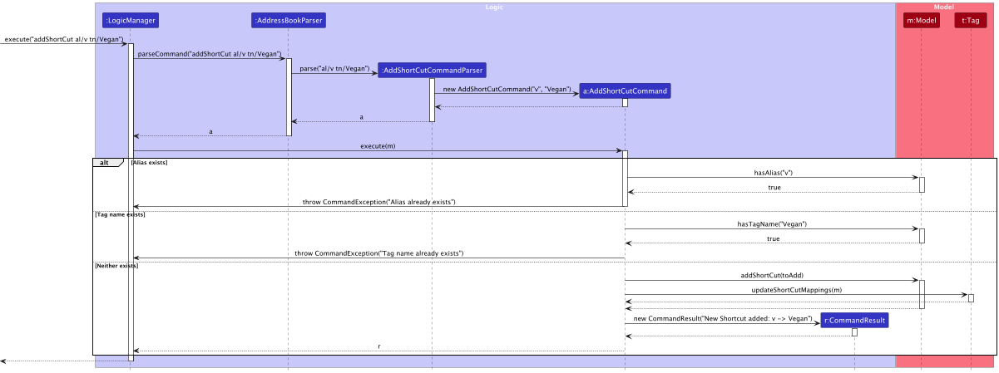
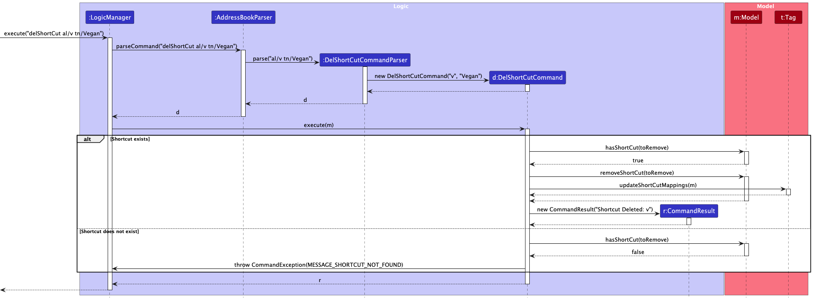

* Table of Contents:
  * Acknowledgements
  * Setting Up, getting started
  * Design
  * Implementation
  * Documentation, testing, configurations, dev-ops
  * Appendix:
    * Product scope
    * User stories
    * Use cases
    * Non-functional Requirements
    * Glossary

--------------------------------------------------------------------------------------------------------------------

## **Acknowledgements**

* NomNomNotifier is adapted from the AddressBook Level-3 created by the SE-EDU initiative.

* Below are the Java libraries used in this project:
  * JavaFX for UI
  * JUnit5 and TestFX for Testing
  * Jackson for Storage
  
--------------------------------------------------------------------------------------------------------------------

## **Setting up, getting started**

Refer to the guide [_Setting up and getting started_](SettingUp.md).

--------------------------------------------------------------------------------------------------------------------

## **Design**

:bulb: **Tip:** The `.puml` files used to create diagrams in this document `docs/diagrams` folder. Refer to the [_PlantUML Tutorial_ at se-edu/guides](https://se-education.org/guides/tutorials/plantUml.html) to learn how to create and edit diagrams.

### Architecture

The ***Architecture Diagram*** given above explains the high-level design of the App.

Given below is a quick overview of main components and how they interact with each other.

**Main components of the architecture**

**`Main`** (consisting of classes [`Main`](https://github.com/se-edu/addressbook-level3/tree/master/src/main/java/seedu/address/Main.java) and [`MainApp`](https://github.com/se-edu/addressbook-level3/tree/master/src/main/java/seedu/address/MainApp.java)) is in charge of the app launch and shut down.
* At app launch, it initializes the other components in the correct sequence, and connects them up with each other.
* At shut down, it shuts down the other components and invokes cleanup methods where necessary.

The bulk of the app's work is done by the following four components:

* [**`UI`**](#ui-component): The UI of the App.
* [**`Logic`**](#logic-component): The command executor.
* [**`Model`**](#model-component): Holds the data of the App in memory.
* [**`Storage`**](#storage-component): Reads data from, and writes data to, the hard disk.

[**`Commons`**](#common-classes) represents a collection of classes used by multiple other components.

**How the architecture components interact with each other**

The *Sequence Diagram* below shows how the components interact with each other for the scenario where the user issues the command `delete 1`.

Each of the four main components (also shown in the diagram above),

* defines its *API* in an `interface` with the same name as the Component.
* implements its functionality using a concrete `{Component Name}Manager` class (which follows the corresponding API `interface` mentioned in the previous point.

For example, the `Logic` component defines its API in the `Logic.java` interface and implements its functionality using the `LogicManager.java` class which follows the `Logic` interface. Other components interact with a given component through its interface rather than the concrete class (reason: to prevent outside component's being coupled to the implementation of a component), as illustrated in the (partial) class diagram below.

The sections below give more details of each component.

### UI component

The **API** of this component is specified in [`Ui.java`](https://github.com/se-edu/addressbook-level3/tree/master/src/main/java/seedu/address/ui/Ui.java)

The UI consists of a `MainWindow` that is made up of parts e.g.`CommandBox`, `ResultDisplay`, `PersonListPanel`, `StatusBarFooter` etc. All these, including the `MainWindow`, inherit from the abstract `UiPart` class which captures the commonalities between classes that represent parts of the visible GUI.

The `UI` component uses the JavaFx UI framework. The layout of these UI parts are defined in matching `.fxml` files that are in the `src/main/resources/view` folder. For example, the layout of the [`MainWindow`](https://github.com/se-edu/addressbook-level3/tree/master/src/main/java/seedu/address/ui/MainWindow.java) is specified in [`MainWindow.fxml`](https://github.com/se-edu/addressbook-level3/tree/master/src/main/resources/view/MainWindow.fxml)

The `UI` component,

* executes user commands using the `Logic` component.
* listens for changes to `Model` data so that the UI can be updated with the modified data.
* keeps a reference to the `Logic` component, because the `UI` relies on the `Logic` to execute commands.
* depends on some classes in the `Model` component, as it displays `Person` object residing in the `Model`.

### Logic component

**API** : [`Logic.java`](https://github.com/se-edu/addressbook-level3/tree/master/src/main/java/seedu/address/logic/Logic.java)

Here's a (partial) class diagram of the `Logic` component:

The sequence diagram below illustrates the interactions within the `Logic` component, taking `execute("delete 1")` API call as an example.

:information_source: **Note:** The lifeline for `DeleteCommandParser` should end at the destroy marker (X) but due to a limitation of PlantUML, the lifeline continues till the end of diagram.

How the `Logic` component works:

1. When `Logic` is called upon to execute a command, it is passed to an `AddressBookParser` object which in turn creates a parser that matches the command (e.g., `DeleteCommandParser`) and uses it to parse the command.
1. This results in a `Command` object (more precisely, an object of one of its subclasses e.g., `DeleteCommand`) which is executed by the `LogicManager`.
1. The command can communicate with the `Model` when it is executed (e.g. to delete a person). 
   Note that although this is shown as a single step in the diagram above (for simplicity), in the code it can take several interactions (between the command object and the `Model`) to achieve.
1. The result of the command execution is encapsulated as a `CommandResult` object which is returned back from `Logic`.

Here are the other classes in `Logic` (omitted from the class diagram above) that are used for parsing a user command:

How the parsing works:
* When called upon to parse a user command, the `AddressBookParser` class creates an `XYZCommandParser` (`XYZ` is a placeholder for the specific command name e.g., `AddCommandParser`) which uses the other classes shown above to parse the user command and create a `XYZCommand` object (e.g., `AddCommand`) which the `AddressBookParser` returns back as a `Command` object.
* All `XYZCommandParser` classes (e.g., `AddCommandParser`, `DeleteCommandParser`, ...) inherit from the `Parser` interface so that they can be treated similarly where possible e.g, during testing.

### Model component
**API** : [`Model.java`](https://github.com/se-edu/addressbook-level3/tree/master/src/main/java/seedu/address/model/Model.java)

The `Model` component,

* stores address book data, including:
  * all `Person` objects (which are contained in a `UniquePersonList` object).
  * A list of shortcuts, represented by `UniqueShortCutList`, which contains `ShortCut` objects. Each `ShortCut` maps an alias (represented by `Alias`) to a full tag name (represented by `FullTagName`).
* stores the currently 'selected' `Person` objects (e.g., results of a search query) as a separate _filtered_ list which is exposed to outsiders as an unmodifiable `ObservableList<Person>` that can be 'observed' e.g. the UI can be bound to this list so that the UI automatically updates when the data in the list change.
* stores a `UserPref` object that represents the user’s preferences. This is exposed to the outside as a `ReadOnlyUserPref` objects.
* does not depend on any of the other three components (as the `Model` represents data entities of the domain, they should make sense on their own without depending on other components)

#### Person Model Components

* **Person**: Represents a single individual in the address book, encapsulating multiple details about the person.
    - `Name`: Represents the name of the person. Enforces validation rules to ensure data integrity.
    - `Phone`: Represents the phone number of the person. It includes validation to ensure that the data matches a specific format.
    - `Email`: Represents the email address of the person, with validation for standard email formats.
    - `Address`: Represents the residential or business address of the person.
    - `PostalCode`: Part of the `Address` class, further specifying the person’s address.
    - `Tag`: A list of tags associated with the person, allowing categorization of people (e.g., "friend", "colleague").
    - `OrderTracker`: Keeps track of the orders associated with the person.

#### Shortcut Model Components

The shortcut functionality has been added to enhance the tagging process within the `AddressBook`. It includes the following components:
- `UniqueShortCutList`: Manages the collection of all `ShortCut` objects within the `AddressBook`. Each shortcut in the list is unique by alias.
- `ShortCut`: Represents a mapping between an alias (shortcut) and a full tag name.
- `Alias`: A class representing the alias of a tag, enforcing specific validation rules.
- `FullTagName`: A class representing the full name of the tag associated with an alias, also enforcing validation rules.

:information_source: **Note:** An alternative (arguably, a more OOP) model is given below. It has a `Tag` list in the `AddressBook`, which `Person` references. This allows `AddressBook` to only require one `Tag` object per unique tag, instead of each `Person` needing their own `Tag` objects. 

### Storage Component

**API** : [`Storage.java`](https://github.com/se-edu/addressbook-level3/tree/master/src/main/java/seedu/address/storage/Storage.java)

The `Storage` component is responsible for managing data persistence, including saving and loading both the address book data and user preference settings. It stores data in JSON format and reads them back into corresponding objects.

#### Structure

The `Storage` component consists of the following main packages:
1. **User Preferences Storage**
2. **Address Book Storage**

Each of these storage packages provides interfaces and implementations for reading and writing data in a structured way. The `StorageManager` serves as the central manager for handling both user preferences and address book data storage.

#### Key Classes and Interfaces

* **`Storage` (interface)**:
    - The primary interface for storage functionality, extending both `AddressBookStorage` and `UserPrefsStorage`.
    - This design allows `Storage` to be used as either an address book storage handler or a user preferences storage handler, depending on the context.

* **`StorageManager` (class)**:
    - Implements the `Storage` interface, consolidating both `AddressBookStorage` and `UserPrefsStorage` functionality.
    - Manages both types of storage using their respective implementations (`JsonAddressBookStorage` for address book data and `JsonUserPrefsStorage` for user preferences).

* **`UserPrefsStorage` (interface)**:
    - Provides methods for reading and writing user preferences data.
    - Implemented by `JsonUserPrefsStorage`, which reads/writes user preferences in JSON format.

* **`AddressBookStorage` (interface)**:
    - Defines methods for reading and writing the address book data.
    - Implemented by `JsonAddressBookStorage`, which handles JSON storage for `AddressBook`.

#### JSON-Based Storage for Address Book Data

The Address Book data storage relies on JSON serialization with the following classes:
- **`JsonAddressBookStorage` (class)**:
    - Implements `AddressBookStorage` and manages the reading/writing of JSON data for the address book.
- **`JsonSerializableAddressBook` (class)**:
    - Provides the schema for serializing the `AddressBook` data, including `Person` and `Shortcut` objects.
- **`JsonAdaptedShortCut`, `JsonAdaptedPerson`, and `JsonAdaptedTag` (classes)**:
    - Adapter classes for each entity within the `AddressBook`.
    - These classes are responsible for converting each respective model component into a format suitable for JSON serialization and deserialization.

### Common classes

Classes used by multiple components are in the `seedu.address.commons` package.

--------------------------------------------------------------------------------------------------------------------

## **Implementation**

This section describes some noteworthy details on how certain features are implemented.

### Add Shortcut feature
#### Implementation
The `addShortCut` feature enables users to create shortcuts for tags in the address book. This process includes parsing the command input, checking for existing aliases or tag names in `Model` to avoid duplication, and adding the shortcut in `UniqueShortCutList` in `Model`.

Given below is an example usage scenario and how the add shortcut mechanism works at each step.

**Step 1: Command Execution by `LogicManager`:**
* The `LogicManager` receives the `execute("addShortCut al/v tn/Vegan")` command. This initiates the process of adding a shortcut where `al/v` represents the alias (`v`), and `tn/Vegan` represents the full tag name (`Vegan`).

**Step 2: Parsing the Command:**
* `LogicManager` calls `parseCommand` on `AddressBookParser` with the command string to interpret the input.
* `AddressBookParser` creates an `AddShortCutCommandParser` to handle the specifics of parsing the `addShortCut` command.

**Step 3: Tokenizing and Parsing Arguments:**
* The `AddShortCutCommandParser` tokenizes the command arguments (`al/v tn/Vegan`) to identify the alias and full tag name.
* It uses `ArgumentTokenizer` to break down the input and `ParserUtil` to validate and extract the alias (`v`) and tag name (`Vegan`).

**Step 4: Creating `AddShortCutCommand`:**
* With the parsed alias and tag name, `AddShortCutCommandParser` creates a new `AddShortCutCommand` instance with these values and returns it to `AddressBookParser`, which then passes it back to `LogicManager`.

**Step 5: Executing `AddShortCutCommand`:**
* `LogicManager` calls the `execute` method of `AddShortCutCommand`, passing in the `Model` instance (`m`) to access and update the data.

**Step 6: Checking for Existing Aliases and Tag Names:**
* The `AddShortCutCommand` performs checks in the `Model`:
    * **Alias Check**: It calls `Model.hasAlias("v")` to see if the alias already exists. If it does, the command throws a `CommandException` with the message `"Alias already exists"`, and the process stops.
    * **Tag Name Check**: If the alias is unique, `AddShortCutCommand` proceeds to check if the tag name (`Vegan`) already exists in `Model` using `Model.hasTagName("Vegan")`. If the tag name exists, a `CommandException` is thrown with the message `"Tag name already exists"`.

**Step 7: Adding the New Shortcut:**
* If both checks pass (i.e., the alias and tag name are unique), `AddShortCutCommand` calls `Model.addShortCut(toAdd)` to add the new shortcut to the `Model`.
* Following this, it calls `Tag.updateShortCutMappings(m)` to update the shortcut mappings in the `Tag` component, ensuring the new shortcut is recognized.

**Step 8: Returning the Result:**
* After successfully adding the shortcut, `AddShortCutCommand` creates a `CommandResult` with a success message, such as `"New Shortcut added: v -> Vegan"`.
* The result is returned back to `LogicManager`, completing the `addShortCut` command execution.

---

### Delete Shortcut feature
#### Implementation
The `delShortCut` feature allows users to delete existing shortcuts for tags in the address book. This process involves parsing the command input, checking if the specified shortcut exists in `Model`, and removing it if it does. If the shortcut does not exist, an error message is returned.

Below is a step-by-step usage scenario of the `delShortCut` feature, illustrating how each component interacts in the deletion process.

**Step 1: Command Execution by `LogicManager`:**
* The `LogicManager` receives the `execute("delShortCut al/v tn/Vegan")` command. This starts the deletion process for the shortcut where `al/v` represents the alias (`v`), and `tn/Vegan` represents the full tag name (`Vegan`).

**Step 2: Parsing the Command:**
* `LogicManager` calls `parseCommand` on `AddressBookParser` with the command string to interpret the input.
* `AddressBookParser` creates a `DelShortCutCommandParser` to handle the specifics of parsing the `delShortCut` command.

**Step 3: Tokenizing and Parsing Arguments:**
* `DelShortCutCommandParser` tokenizes the command arguments (`al/v tn/Vegan`) to extract the alias and full tag name.
* It uses `ArgumentTokenizer` to break down the input and `ParserUtil` to parse and validate the alias (`v`) and tag name (`Vegan`).

**Step 4: Creating `DelShortCutCommand`:**
* With the parsed alias and tag name, `DelShortCutCommandParser` creates a new `DelShortCutCommand` instance with these values and returns it to `AddressBookParser`, which then passes it back to `LogicManager`.

**Step 5: Executing `DelShortCutCommand`:**
* `LogicManager` calls the `execute` method of `DelShortCutCommand`, passing in the `Model` instance (`m`) to access and update data.

**Step 6: Checking for the Shortcut's Existence:**
* Inside `execute`, `DelShortCutCommand` first checks if the shortcut exists by calling `Model.hasShortCut(toRemove)`:
    - **Shortcut Exists**: If `hasShortCut` returns `true`, the command proceeds to delete the shortcut.
    - **Shortcut Does Not Exist**: If `hasShortCut` returns `false`, a `CommandException` is thrown with the message `"Shortcut not found"`, and the process stops.

**Step 7: Deleting the Shortcut and Updating Mappings:**
* If the shortcut exists, `DelShortCutCommand` calls `Model.removeShortCut(toRemove)` to remove the shortcut from `Model`.
* It then calls `Tag.updateShortCutMappings(m)` to ensure the `Tag` component reflects the updated shortcuts.

**Step 8: Returning the Result:**
* After successfully deleting the shortcut, `DelShortCutCommand` creates a `CommandResult` with the success message `"Shortcut Deleted: v"`.
* The result is returned to `LogicManager`, completing the `delShortCut` command execution.

Additional Info
* This implementation ensures users can delete shortcuts with feedback on success or failure. If the shortcut does not exist, the system provides a clear error message, and `Tag.updateShortCutMappings` ensures shortcut mappings remain up-to-date across components.
* This implementation allows users to create new shortcuts while enforcing uniqueness. It provides meaningful error feedback if a conflict exists, and updates the model with new shortcuts. The `Tag.updateShortCutMappings` method ensures all components are aware of the new mapping, maintaining consistency across the application.

---
### List Shortcut feature
#### Implementation
The `listShortCut` feature allows users to view all existing shortcuts for tags in the address book. This process involves parsing the command input, retrieving the list of shortcuts from the `Model`, formatting the shortcuts into a readable format, and displaying them to the user.

Below is a step-by-step usage scenario of the `listShortCut` feature, showing how each component interacts to achieve this functionality.

**Step 1: Command Execution by `LogicManager`:**
* The `LogicManager` receives the `execute("listShortCut")` command, initiating the process of listing all tag shortcuts in the address book.

**Step 2: Parsing the Command:**
* `LogicManager` calls `parseCommand` on `AddressBookParser` with the command string to interpret the input.
* `AddressBookParser` creates a `ListShortCutCommandParser` to handle the specifics of parsing the `listShortCut` command.

**Step 3: Creating `ListShortCutCommand`:**
* `ListShortCutCommandParser` parses the command, confirming it matches the expected format.
* After validating the command, it creates a new `ListShortCutCommand` instance and passes it back to `AddressBookParser`, which in turn returns it to `LogicManager`.

**Step 4: Executing `ListShortCutCommand`:**
* `LogicManager` calls the `execute` method of `ListShortCutCommand`, passing in the `Model` instance (`m`) to access stored shortcuts.

**Step 5: Retrieving and Formatting Shortcuts:**
* `ListShortCutCommand` calls `Model.getShortCutList()` to retrieve the current list of shortcuts stored in `UniqueShortCutList`.
* It then formats the shortcuts by calling `formatShortCuts(shortcutList.toString())`, which organizes the list into a readable format for the user.

**Step 6: Creating and Returning the Result:**
* After formatting, `ListShortCutCommand` creates a `CommandResult` with the message containing the formatted list of shortcuts (e.g., `"Shortcut Mappings\n<formatted shortcuts>"`).
* The result is returned to `LogicManager`, completing the `listShortCut` command execution.

### Filter feature
#### Implementation
The `filter` feature enables users to filter the list of persons in the address book based on specific tag keywords. This process involves parsing the command input, generating a predicate for filtering, updating the filtered list in `Model`, and displaying the results.

Below is a step-by-step usage scenario of the `filter` feature, showing how each component interacts to achieve this functionality.

**Step 1: Command Execution by `LogicManager`:**
* The `LogicManager` receives the `execute("filter v vg")` command, initiating the filtering process where `v` and `vg` represent the tag keywords for filtering persons in the address book.

**Step 2: Parsing the Command:**
* `LogicManager` calls `parseCommand` on `AddressBookParser` with the command string to interpret the input.
* `AddressBookParser` creates a `FilterCommandParser` to handle the specifics of parsing the `filter` command.

**Step 3: Creating `TagsContainsKeywordsPredicate`:**
* `FilterCommandParser` extracts the keywords (`v` and `vg`) from the command.
* It then creates a new `TagsContainsKeywordsPredicate` instance, passing the keywords to this predicate, which is used to filter persons based on tags matching these keywords.

**Step 4: Creating `FilterCommand`:**
* `FilterCommandParser` then creates a `FilterCommand` with the `TagsContainsKeywordsPredicate` and passes it back to `AddressBookParser`, which returns it to `LogicManager`.

**Step 5: Executing `FilterCommand`:**
* `LogicManager` calls the `execute` method of `FilterCommand`, passing in the `Model` instance (`m`) to update the list of persons based on the filter criteria.

**Step 6: Updating the Filtered List:**
* `FilterCommand` calls `Model.updateFilteredPersonList(predicate)`, which applies the `TagsContainsKeywordsPredicate` to filter persons by tags.
* The `Model` updates the filtered list of persons and returns confirmation.

**Step 7: Retrieving and Displaying the Filtered List:**
* `FilterCommand` then calls `Model.getFilteredPersonList()` to retrieve the updated filtered list of persons matching the keywords.
* A `CommandResult` is created with a message summarizing the number of persons listed after filtering (e.g., `"X persons listed"`).

**Step 8: Returning the Result:**
* The `CommandResult` is returned to `LogicManager`, completing the `filter` command execution.

---

This implementation allows users to filter persons by tag keywords, enabling them to quickly locate individuals associated with specific tags. The feature provides feedback on the number of matching persons, enhancing the usability of the address book.

---

This implementation enables users to quickly view all tag shortcuts, providing a well-organized list of alias-to-tag mappings. The formatting method ensures that the displayed shortcuts are easy to read, enhancing the user experience.
### \[Proposed\] Undo/redo feature

#### Proposed Implementation

The proposed undo/redo mechanism is facilitated by `VersionedAddressBook`. It extends `AddressBook` with an undo/redo history, stored internally as an `addressBookStateList` and `currentStatePointer`. Additionally, it implements the following operations:

* `VersionedAddressBook#commit()` — Saves the current address book state in its history.
* `VersionedAddressBook#undo()` — Restores the previous address book state from its history.
* `VersionedAddressBook#redo()` — Restores a previously undone address book state from its history.

These operations are exposed in the `Model` interface as `Model#commitAddressBook()`, `Model#undoAddressBook()` and `Model#redoAddressBook()` respectively.

Given below is an example usage scenario and how the undo/redo mechanism behaves at each step.

Step 1. The user launches the application for the first time. The `VersionedAddressBook` will be initialized with the initial address book state, and the `currentStatePointer` pointing to that single address book state.

Step 2. The user executes `delete 5` command to delete the 5th person in the address book. The `delete` command calls `Model#commitAddressBook()`, causing the modified state of the address book after the `delete 5` command executes to be saved in the `addressBookStateList`, and the `currentStatePointer` is shifted to the newly inserted address book state.

Step 3. The user executes `add n/David …​` to add a new person. The `add` command also calls `Model#commitAddressBook()`, causing another modified address book state to be saved into the `addressBookStateList`.

:information_source: **Note:** If a command fails its execution, it will not call `Model#commitAddressBook()`, so the address book state will not be saved into the `addressBookStateList`.

Step 4. The user now decides that adding the person was a mistake, and decides to undo that action by executing the `undo` command. The `undo` command will call `Model#undoAddressBook()`, which will shift the `currentStatePointer` once to the left, pointing it to the previous address book state, and restores the address book to that state.

:information_source: **Note:** If the `currentStatePointer` is at index 0, pointing to the initial AddressBook state, then there are no previous AddressBook states to restore. The `undo` command uses `Model#canUndoAddressBook()` to check if this is the case. If so, it will return an error to the user rather
than attempting to perform the undo.

The following sequence diagram shows how an undo operation goes through the `Logic` component:

:information_source: **Note:** The lifeline for `UndoCommand` should end at the destroy marker (X) but due to a limitation of PlantUML, the lifeline reaches the end of diagram.

Similarly, how an undo operation goes through the `Model` component is shown below:

The `redo` command does the opposite — it calls `Model#redoAddressBook()`, which shifts the `currentStatePointer` once to the right, pointing to the previously undone state, and restores the address book to that state.

:information_source: **Note:** If the `currentStatePointer` is at index `addressBookStateList.size() - 1`, pointing to the latest address book state, then there are no undone AddressBook states to restore. The `redo` command uses `Model#canRedoAddressBook()` to check if this is the case. If so, it will return an error to the user rather than attempting to perform the redo.

Step 5. The user then decides to execute the command `list`. Commands that do not modify the address book, such as `list`, will usually not call `Model#commitAddressBook()`, `Model#undoAddressBook()` or `Model#redoAddressBook()`. Thus, the `addressBookStateList` remains unchanged.

Step 6. The user executes `clear`, which calls `Model#commitAddressBook()`. Since the `currentStatePointer` is not pointing at the end of the `addressBookStateList`, all address book states after the `currentStatePointer` will be purged. Reason: It no longer makes sense to redo the `add n/David …​` command. This is the behavior that most modern desktop applications follow.

The following activity diagram summarizes what happens when a user executes a new command:

#### Design considerations:

**Aspect: How undo & redo executes:**

* **Alternative 1 (current choice):** Saves the entire address book.
  * Pros: Easy to implement.
  * Cons: May have performance issues in terms of memory usage.

* **Alternative 2:** Individual command knows how to undo/redo by
  itself.
  * Pros: Will use less memory (e.g. for `delete`, just save the person being deleted).
  * Cons: We must ensure that the implementation of each individual command are correct.

_{more aspects and alternatives to be added}_

### \[Proposed\] Data archiving

_{Explain here how the data archiving feature will be implemented}_

--------------------------------------------------------------------------------------------------------------------

## **Documentation, logging, testing, configuration, dev-ops**

* [Documentation guide](Documentation.md)
* [Testing guide](Testing.md)
* [Logging guide](Logging.md)
* [Configuration guide](Configuration.md)
* [DevOps guide](DevOps.md)

--------------------------------------------------------------------------------------------------------------------

## **Appendix: Requirements**

### Product scope

**Target user profile**:

* Managers of smaller eateries/restaurants who need to maintain organised customer details for delivery purposes.
* prefer desktop apps over other types
* can type fast
* prefers typing to mouse interactions

**Value proposition**: For restaurants to efficiently and accurately manage customer contact and information

### User stories

Priorities: High (must have) - `* * *`, Medium (nice to have) - `* *`, Low (unlikely to have) - `*`

| Priority | As a …​                                    | I want to …​                                                         | So that I can…​                                               |
| -------- | ------------------------------------------ |----------------------------------------------------------------------|---------------------------------------------------------------|
| `* * *`  | manager                                    | add a customer’s detail via a one-line CLI command                   | quickly add new customers without >1 step                     |
| `* *`    | manager                                    | retrieve a customer’s detail via a one-line CLI command              | view their details without having to scroll through pages     |
| `* * *`  | manager                                    | delete customer data in one-line CLI                                 | delete customers that I want to not deliver to anymore        |
| `* * *`  | manager                                    | search for customers by name                                         | quickly access customer profiles during phone orders          |
| `* * *`  | manager                                    | search for customers by phone number                                 | quickly access customer profiles during phone orders          |
| `* *`    | manager                                    | edit customer data in one-line CLI                                   | update any part of user data in 1 step                        |
| `* *`    | manager                                    | bulk-create multiple customers through a file                        | quickly populate the system                                   |
| `* *`    | manager                                    | bulk update multiple customers                                       | effectively manage large sets of customers                    |
| `* *`    | manager                                    | assign tags to customers easily by setting abbreviations to tagnames | waste time typing out tag names that are already predetermined |
| `*`      | manager                                    | archive customer data instead of a hard delete                       | avoid losing this information permanently                     |
| `*`      | manager                                    | unarchive a customer                                                 | continue serving this customer                                |
| `*`      | manager                                    | list customers by recent order dates                                 | quickly identify who is a repeat customer                     |
| `*`      | manager                                    | list customers by order frequency                                    | identify regular customers for reward programmes              |
| `*`      | manager                                    | export customer data as a CSV                                        | provide the data to other people to use                       |
| `*`      | manager                                    | convert a CSV file into a readable state file                        | have a backup                                                 |
| `*`      | manager                                    | export CSV data using specific criteria                              | reduce the effort needed by others to parse the data          |
| `*`      | manager                                    | validate attributes when adding a customer                           | avoid entering invalid data                                   |
| `*`      | manager                                    | validate attributes when updating a customer                         | avoid entering invalid data                                   |
| `*`      | manager                                    | categorise customers as VIP, regular, or new                         | know who to target for promotions                             |
| `*`      | manager                                    | tag customers with dietary restrictions                              | personalise orders and maintain customer service              |
| `*`      | manager                                    | create a tag                                                         | tag customers with a different issue                          |
| `*`      | manager                                    | tag customers with multiple different tags                           | store a pattern of customers                                  |
| `*`      | manager                                    | bulk tag customers with dietary restrictions                         | save time                                                     |
| `*`      | manager                                    | group customers by tag                                               | easily find and manage customers for promotions               |

### Use cases

(For all use cases below, the **System** is the `AddressBook` and the **Actor** is the `manager`, unless specified otherwise)

**Use case: Add a customer**

**MSS**
1. Manager requests to add customer
2. AddressBook adds the person
    Use Case Ends

**Extension**
* 1a. Manager request/invalid/incomplete
  * 1a1. AddressBook shows an error message
  * Use Case Ends

* 1a. Manager tags customer using pre-assigned shortcut
  * 1a1. Abbreviation is mapped to pre-assigned tag name
  * Use Case resumes at step 2

**Use case: Search for a customer**

**MSS**
1. Manager requests to list the customers
2. AddressBook shows a list of customers
3. Manager requests to search for customer by name/phone number
4. AddressBook shows the customer
   Use Case Ends 

**Extension**
* 1a. Manager request/invalid/incomplete
  * 1a1. AddressBook shows an error message.
  * Use Case Ends
* 2a. The list is empty
  * User Case Ends

**Use case: Delete a person**

**MSS**

1.  Manager requests to list customers
2.  AddressBook shows a list of customers
3.  Manager requests to delete a specific customers in the list
4.  AddressBook deletes the customers

    Use case ends.

**Extensions**

* 2a. The list is empty.

  Use case ends.

* 3a. The given index is invalid.

    * 3a1. AddressBook shows an error message.

      Use case resumes at step 2.

**Use Case: Creating a shortcut**

**MSS**

1. Manager requests to add shortcut
2. AddressBook adds the shortcut with alias and tag name to UniqueShortcut list
    Use Case ends

**Extension**
* 1a. Shortcut format is invalid
    * 1a1. AddressBook shows error message
    * Use Case ends
* 1b. Alias or tag name in shortcut already exists in AddressBook
  * 1b1. AddressBook shows error message
  * Use Case ends

**Use Case: Deleting a shortcut**

**MSS**

1. Manager requests to delete shortcut
2. AddressBook deletes the shortcut with specified alias and tag name in UniqueShortCut list

    Use Case ends

**Extension**
* 1a. Shortcut format is invalid
    * 1a1. AddressBook shows error message
    * Use Case ends
* 1b. ShortCut does not exist in AddressBook
    * 1b1. AddressBook shows error message
    * Use Case ends

### Non-Functional Requirements

1. Should work on any _mainstream OS_ as long as it has Java `17` or above installed. 
2. Command Response Time: All operations (add, delete, search) should respond within 1 second 
3. Bulk Operations: Bulk actions (e.g., adding multiple customers) should handle up to 100 records and complete within 2 seconds 
4. A user with above average typing speed for regular English text (i.e. not code, not system admin commands) should be able to accomplish most of the tasks faster using commands than using the mouse.
4. Error Handling: Meaningful error messages should be provided for invalid inputs (e.g., invalid email or phone number). 
5. Command Documentation: Provide help text for each command and clear usage instructions.

### Glossary

* **Mainstream OS**: Windows, Linux, Unix, MacOS
* **Private contact detail**: A contact detail that is not meant to be shared with others
* 	CLI (Command-Line Interface): A text-based interface where users can type commands to interact with the system
* Customer: An individual whose details (e.g., name, phone number, email) are stored in the system for tracking purposes
* Tag: A label or keyword that can be associated with a customer to categorize or describe them (e.g., “vegetarian”, “loyalty-programme”)
* Parameter: Information provided by the user as part of a command, such as name, email, or phone number
* CSV (Comma-Separated Values): A common format for storing and exchanging tabular data, where each row represents a record, and each field is separated by a comma

--------------------------------------------------------------------------------------------------------------------

## **Appendix: Instructions for manual testing**

Given below are instructions to test the app manually.

:information_source: **Note:** These instructions only provide a starting point for testers to work on;
testers are expected to do more *exploratory* testing.

### Launch and shutdown

1. Initial launch

   1. Download the jar file and copy into an empty folder

   1. Double-click the jar file Expected: Shows the GUI with a set of sample contacts. The window size may not be optimum.

1. Saving window preferences

   1. Resize the window to an optimum size. Move the window to a different location. Close the window.

   1. Re-launch the app by double-clicking the jar file. 
       Expected: The most recent window size and location is retained.

1. _{ more test cases …​ }_

### Deleting a person

1. Deleting a person while all persons are being shown

   1. Prerequisites: List all persons using the `list` command. Multiple persons in the list.

   1. Test case: `delete 1` 
      Expected: First contact is deleted from the list. Details of the deleted contact shown in the status message. Timestamp in the status bar is updated.

   1. Test case: `delete 0` 
      Expected: No person is deleted. Error details shown in the status message. Status bar remains the same.

   1. Other incorrect delete commands to try: `delete`, `delete x`, `...` (where x is larger than the list size) 
      Expected: Similar to previous.

1. _{ more test cases …​ }_

### Saving data

1. Dealing with missing/corrupted data files

   1. _{explain how to simulate a missing/corrupted file, and the expected behavior}_

1. _{ more test cases …​ }_
