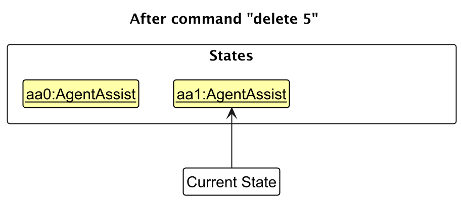

* Table of Contents
{:toc}

--------------------------------------------------------------------------------------------------------------------

## **Acknowledgements**

* {list here sources of all reused/adapted ideas, code, documentation, and third-party libraries -- include links to the original source as well}

--------------------------------------------------------------------------------------------------------------------

## **Setting up, getting started**

Refer to the guide [_Setting up and getting started_](SettingUp.md).

--------------------------------------------------------------------------------------------------------------------

## **Design**

:bulb: **Tip:** The `.puml` files used to create diagrams in this document `docs/diagrams` folder. Refer to the [_PlantUML Tutorial_ at se-edu/guides](https://se-education.org/guides/tutorials/plantUml.html) to learn how to create and edit diagrams.

### Architecture

The ***Architecture Diagram*** given above explains the high-level design of the App.

Given below is a quick overview of main components and how they interact with each other.

**Main components of the architecture**

**`Main`** (consisting of classes [`Main`](https://github.com/se-edu/addressbook-level3/tree/master/src/main/java/seedu/address/Main.java) and [`MainApp`](https://github.com/se-edu/addressbook-level3/tree/master/src/main/java/seedu/address/MainApp.java)) is in charge of the app launch and shut down.
* At app launch, it initializes the other components in the correct sequence, and connects them up with each other.
* At shut down, it shuts down the other components and invokes cleanup methods where necessary.

The bulk of the app's work is done by the following four components:

* [**`UI`**](#ui-component): The UI of the App.
* [**`Logic`**](#logic-component): The command executor.
* [**`Model`**](#model-component): Holds the data of the App in memory.
* [**`Storage`**](#storage-component): Reads data from, and writes data to, the hard disk.

[**`Commons`**](#common-classes) represents a collection of classes used by multiple other components.

**How the architecture components interact with each other**

The *Sequence Diagram* below shows how the components interact with each other for the scenario where the user issues the command `delete 1`.

Each of the four main components (also shown in the diagram above),

* defines its *API* in an `interface` with the same name as the Component.
* implements its functionality using a concrete `{Component Name}Manager` class (which follows the corresponding API `interface` mentioned in the previous point.

For example, the `Logic` component defines its API in the `Logic.java` interface and implements its functionality using the `LogicManager.java` class which follows the `Logic` interface. Other components interact with a given component through its interface rather than the concrete class (reason: to prevent outside component's being coupled to the implementation of a component), as illustrated in the (partial) class diagram below.

The sections below give more details of each component.

### UI component

The **API** of this component is specified in [`Ui.java`](https://github.com/se-edu/addressbook-level3/tree/master/src/main/java/seedu/address/ui/Ui.java)

The UI consists of a `MainWindow` that is made up of parts e.g.`CommandBox`, `ResultDisplay`, `PersonListPanel`, `StatusBarFooter` etc. All these, including the `MainWindow`, inherit from the abstract `UiPart` class which captures the commonalities between classes that represent parts of the visible GUI.

The `UI` component uses the JavaFx UI framework. The layout of these UI parts are defined in matching `.fxml` files that are in the `src/main/resources/view` folder. For example, the layout of the [`MainWindow`](https://github.com/se-edu/addressbook-level3/tree/master/src/main/java/seedu/address/ui/MainWindow.java) is specified in [`MainWindow.fxml`](https://github.com/se-edu/addressbook-level3/tree/master/src/main/resources/view/MainWindow.fxml)

The `UI` component,

* executes user commands using the `Logic` component.
* listens for changes to `Model` data so that the UI can be updated with the modified data.
* keeps a reference to the `Logic` component, because the `UI` relies on the `Logic` to execute commands.
* depends on some classes in the `Model` component, as it displays `Person` object residing in the `Model`.

### Logic component

**API** : [`Logic.java`](https://github.com/se-edu/addressbook-level3/tree/master/src/main/java/seedu/address/logic/Logic.java)

Here's a (partial) class diagram of the `Logic` component:

The sequence diagram below illustrates the interactions within the `Logic` component, taking `execute("delete 1")` API call as an example.

:information_source: **Note:** The lifeline for `DeleteCommandParser` should end at the destroy marker (X) but due to a limitation of PlantUML, the lifeline continues till the end of diagram.

How the `Logic` component works:

1. When `Logic` is called upon to execute a command, it is passed to an `AddressBookParser` object which in turn creates a parser that matches the command (e.g., `DeleteCommandParser`) and uses it to parse the command.
1. This results in a `Command` object (more precisely, an object of one of its subclasses e.g., `DeleteCommand`) which is executed by the `LogicManager`.
1. The command can communicate with the `Model` when it is executed (e.g. to delete a person). 
   Note that although this is shown as a single step in the diagram above (for simplicity), in the code it can take several interactions (between the command object and the `Model`) to achieve.
1. The result of the command execution is encapsulated as a `CommandResult` object which is returned back from `Logic`.

Here are the other classes in `Logic` (omitted from the class diagram above) that are used for parsing a user command:

How the parsing works:
* When called upon to parse a user command, the `AddressBookParser` class creates an `XYZCommandParser` (`XYZ` is a placeholder for the specific command name e.g., `AddCommandParser`) which uses the other classes shown above to parse the user command and create a `XYZCommand` object (e.g., `AddCommand`) which the `AddressBookParser` returns back as a `Command` object.
* All `XYZCommandParser` classes (e.g., `AddCommandParser`, `DeleteCommandParser`, ...) inherit from the `Parser` interface so that they can be treated similarly where possible e.g, during testing.

### Model component
**API** : [`Model.java`](https://github.com/se-edu/addressbook-level3/tree/master/src/main/java/seedu/address/model/Model.java)

The `Model` component,

* stores the address book data i.e., all `Person` objects (which are contained in a `UniquePersonList` object).
* stores the currently 'selected' `Person` objects (e.g., results of a search query) as a separate _filtered_ list which is exposed to outsiders as an unmodifiable `ObservableList<Person>` that can be 'observed' e.g. the UI can be bound to this list so that the UI automatically updates when the data in the list change.
* stores a `UserPref` object that represents the user’s preferences. This is exposed to the outside as a `ReadOnlyUserPref` objects.
* does not depend on any of the other three components (as the `Model` represents data entities of the domain, they should make sense on their own without depending on other components)

:information_source: **Note:** An alternative (arguably, a more OOP) model is given below. It has a `Tag` list in the `AddressBook`, which `Person` references. This allows `AddressBook` to only require one `Tag` object per unique tag, instead of each `Person` needing their own `Tag` objects. 

### Storage component

**API** : [`Storage.java`](https://github.com/se-edu/addressbook-level3/tree/master/src/main/java/seedu/address/storage/Storage.java)

The `Storage` component,
* can save both address book data and user preference data in JSON format, and read them back into corresponding objects.
* inherits from both `AddressBookStorage` and `UserPrefStorage`, which means it can be treated as either one (if only the functionality of only one is needed).
* depends on some classes in the `Model` component (because the `Storage` component's job is to save/retrieve objects that belong to the `Model`)

### Common classes

Classes used by multiple components are in the `seedu.address.commons` package.

--------------------------------------------------------------------------------------------------------------------

## **Implementation**

This section describes some noteworthy details on how certain features are implemented.

### \[Proposed\] Undo/redo feature

#### Proposed Implementation

The proposed undo/redo mechanism is facilitated by `VersionedAddressBook`. It extends `AddressBook` with an undo/redo history, stored internally as an `addressBookStateList` and `currentStatePointer`. Additionally, it implements the following operations:

* `VersionedAddressBook#commit()` — Saves the current address book state in its history.
* `VersionedAddressBook#undo()` — Restores the previous address book state from its history.
* `VersionedAddressBook#redo()` — Restores a previously undone address book state from its history.

These operations are exposed in the `Model` interface as `Model#commitAddressBook()`, `Model#undoAddressBook()` and `Model#redoAddressBook()` respectively.

Given below is an example usage scenario and how the undo/redo mechanism behaves at each step.

Step 1. The user launches the application for the first time. The `VersionedAddressBook` will be initialized with the initial address book state, and the `currentStatePointer` pointing to that single address book state.

Step 2. The user executes `delete 5` command to delete the 5th person in the address book. The `delete` command calls `Model#commitAddressBook()`, causing the modified state of the address book after the `delete 5` command executes to be saved in the `addressBookStateList`, and the `currentStatePointer` is shifted to the newly inserted address book state.

Step 3. The user executes `add n/David …​` to add a new person. The `add` command also calls `Model#commitAddressBook()`, causing another modified address book state to be saved into the `addressBookStateList`.

:information_source: **Note:** If a command fails its execution, it will not call `Model#commitAddressBook()`, so the address book state will not be saved into the `addressBookStateList`.

Step 4. The user now decides that adding the person was a mistake, and decides to undo that action by executing the `undo` command. The `undo` command will call `Model#undoAddressBook()`, which will shift the `currentStatePointer` once to the left, pointing it to the previous address book state, and restores the address book to that state.

:information_source: **Note:** If the `currentStatePointer` is at index 0, pointing to the initial AddressBook state, then there are no previous AddressBook states to restore. The `undo` command uses `Model#canUndoAddressBook()` to check if this is the case. If so, it will return an error to the user rather
than attempting to perform the undo.

The following sequence diagram shows how an undo operation goes through the `Logic` component:

:information_source: **Note:** The lifeline for `UndoCommand` should end at the destroy marker (X) but due to a limitation of PlantUML, the lifeline reaches the end of diagram.

Similarly, how an undo operation goes through the `Model` component is shown below:

The `redo` command does the opposite — it calls `Model#redoAddressBook()`, which shifts the `currentStatePointer` once to the right, pointing to the previously undone state, and restores the address book to that state.

:information_source: **Note:** If the `currentStatePointer` is at index `addressBookStateList.size() - 1`, pointing to the latest address book state, then there are no undone AddressBook states to restore. The `redo` command uses `Model#canRedoAddressBook()` to check if this is the case. If so, it will return an error to the user rather than attempting to perform the redo.

Step 5. The user then decides to execute the command `list`. Commands that do not modify the address book, such as `list`, will usually not call `Model#commitAddressBook()`, `Model#undoAddressBook()` or `Model#redoAddressBook()`. Thus, the `addressBookStateList` remains unchanged.

Step 6. The user executes `clear`, which calls `Model#commitAddressBook()`. Since the `currentStatePointer` is not pointing at the end of the `addressBookStateList`, all address book states after the `currentStatePointer` will be purged. Reason: It no longer makes sense to redo the `add n/David …​` command. This is the behavior that most modern desktop applications follow.

The following activity diagram summarizes what happens when a user executes a new command:

#### Design considerations:

**Aspect: How undo & redo executes:**

* **Alternative 1 (current choice):** Saves the entire address book.
  * Pros: Easy to implement.
  * Cons: May have performance issues in terms of memory usage.

* **Alternative 2:** Individual command knows how to undo/redo by
  itself.
  * Pros: Will use less memory (e.g. for `delete`, just save the person being deleted).
  * Cons: We must ensure that the implementation of each individual command are correct.

_{more aspects and alternatives to be added}_

### \[Proposed\] Data archiving

_{Explain here how the data archiving feature will be implemented}_

--------------------------------------------------------------------------------------------------------------------

## **Documentation, logging, testing, configuration, dev-ops**

* [Documentation guide](Documentation.md)
* [Testing guide](Testing.md)
* [Logging guide](Logging.md)
* [Configuration guide](Configuration.md)
* [DevOps guide](DevOps.md)

--------------------------------------------------------------------------------------------------------------------

## **Appendix: Requirements**

### Product scope

**Target user profile**: Celebrity Talent Managers

* has a need to manage a significant number of contacts (talents, contractors, etc)
* prefer desktop apps over other types
* can type fast
* prefers typing to mouse interactions
* is reasonably comfortable using CLI apps

**Value proposition**: The address book offers celebrity managers a **secure, offline tool** to manage **various contacts and stakeholders, track VIP relationships, and schedule events** efficiently. With a customizable field, it streamlines coordination while ensuring **privacy and data control** in a high-stakes environment.

### User stories

Priorities: High (must have) - `* * *`, Medium (nice to have) - `* *`, Low (unlikely to have) - `*`

| Priority | As a …​                                                        | I want to …​                                                  | So that I can…​                                          |
|----------|----------------------------------------------------------------|---------------------------------------------------------------|----------------------------------------------------------|
| `* * *`  | Celebrity Talent Manager                                       | add new contacts to my address book                           | keep track of important stakeholders                     |
| `* * *`  | Celebrity Talent Manager                                       | use command-line shortcuts to manage my contacts and schedule | work faster and more efficiently                         |
| `* * *`  | Celebrity Talent Manager                                       | delete a contact                                              | remove entries that I no longer need                     |
| `* * *`  | Celebrity Talent Manager                                       | view details of a specific contact                            | quickly access specific information when needed          |
| `* * *`  | Celebrity Talent Manager                                       | list my contacts                                              | see an overview of my contacts                           |
| `* * *`  | Celebrity Talent Manager                                       | add important events and deadlines                            | quickly view my important tasks                          |
| `* * *`  | Celebrity Talent Manager                                       | add remarks and people to my events and deadlines             | view who is involved with specific tasks                 |
| `* * *`  | Celebrity Talent Manager                                       | view the event details a client has                           | see and plan around their schedule                       |
| `* * *`  | Celebrity Talent Manager                                       | view all my events                                            | have an overview of my timetable                         |
| `* * *`  | Celebrity Talent Manager                                       | delete an event                                               | remove outdated entries                                  |
| `* * *`  | Celebrity Talent Manager                                       | save my data                                                  | come back to it next time                                |
| `* *`    | Celebrity Talent Manager dealing with various groups           | group and tag my contacts                                     | group contacts based on specific tags                    |
| `* *`    | Celebrity Talent Manager with many contacts                    | search for clients using tags                                 | quickly find individuals in a specific group             |
| `* *`    | Celebrity Talent Manager with many contacts                    | search for clients using names                                | quickly find specific individuals                        |
| `* *`    | Celebrity Talent Manager                                       | delete a contact only after confirmation                      | prevent accidental deletion of something still important |
| `* *`    | Celebrity Talent Manager                                       | edit contact information                                      | update ay changes in their information                   |
| `* *`    | Celebrity Talent Manager who can be forgetful                  | be alerted when I add duplicate entries                       | avoid duplicate entries                                  |
| `* *`    | Celebrity Talent Manager who is new to the application         | access a help guide in the application                        | find out the command I need when I forget it             |
| `* *`    | Celebrity Talent Manager                                       | perform mass deletion of entries                              | save time when I have to delete a lot of entries         |
| `* *`    | Celebrity Talent Manager                                       | set customisable remark fields for entries                    | save information specific to the contact                 |
| `* *`    | Celebrity Talent Manager who works with international partners | view the calendar different timezones                         | work with clients of different timezones easily          |
| `* *`    | Celebrity Talent Manager                                       | be alerted when events clash                                  | identify clashes and resolve them easily                 |
| `* *`    | Celebrity Talent Manager                                       | mark events as over or ended                                  | keep track my schedule                                   |
| `* *`    | Celebrity Talent Manager                                       | unmark events as over or ended                                | mark tasks as undone or ongoing again                    |
| `* *`    | Celebrity Talent Manager                                       | add a photo for my contacts                                   | easily remember or recognise the contact                 |
| `*`      | Celebrity Talent Manager                                       | flag priority contacts                                        | identify contacts that require immediate focus           |
| `*`      | Celebrity Talent Manager                                       | export and import client data                                 | safely transfer information on different devices         |
| `*`      | Celebrity Talent Manager who can be careless at times          | undo my last command                                          | quickly revert my changes when they are wrong            |
| `*`      | Celebrity Talent Manager                                       | set reminders for tasks                                       | get reminded of upcoming tasks that are due soon         |
| `*`      | Celebrity Talent Manager                                       | set visual indicators for my contacts based on availability   | quickly see if someone is available or not               |
| `*`      | Celebrity Talent Manager                                       | customise my data storage location                            | change where my data is kept locally                     |
| `*`      | Celebrity Talent Manager                                       | set my own CLI shortcuts                                      | use the commands faster based on my preferences          |

### Use cases

(For all use cases below, the **System** is the `TalentHub` and the **Actor** is the `celebrity talent manager`, unless specified otherwise)

**Use case: UC01 - Add Contact**

**MSS**

1. Talent Manager requests to add a specific contact
2. TalentHub adds the person

Use case ends.

**Extensions**

* 1a. The command format is incorrect.

  * 1a1. TalentHub outputs a generic error message about incorrect command format.

    Use case ends.
  
* 1b. Any parameter is missing or invalid.

  * 1b1. TalentHub outputs an error message specifying the issue.

    Use case ends.

* 1c. An identical phone number is detected.

  * 1c1. TalentHub outputs an error message specifying the issue.

    Use case ends.

**Use case: UC02 - Delete Contact after List**

**MSS**

1. Talent Manager [list contacts (UC06)](#)
2. Talent Manager [delete contact (UC04)](#)

   Use case ends.

**Use case: UC03 - Delete Contact after Find**

**MSS**

1. Talent Manager [find contacts (UC05)](#)
2. Talent Manager [delete contact (UC04)](#)

   Use case ends.

**Use case: UC04 - Delete Contact**

**MSS**

1. Talent Manager requests to delete a specific person in the list
2. TalentHub deletes the person

   Use case ends.

**Extensions**

* 1a. The command format is incorrect.

  * 1a1. TalentHub outputs a generic error message about incorrect command format.

    Use case ends.

* 1b. The list is empty.

  * 1b1. System shows an error message specifying the list is empty.

    Use case ends.

* 1c. The given index is invalid.

  * 1c1. System shows an error message.

    Use case ends.

**Use case: UC05 - Find Contact**

**MSS**

1. User requests to find persons with with `keywords`
2. System processes and list person with `keywords`

   Use case ends.

**Extensions**

* 1a. The command format is incorrect.

  * 1a1. TalentHub outputs a generic error message about incorrect command format.

    Use case ends.

* 1b. The keyword is empty.

  * 1b1. System shows an error message.

    Use case ends.

**Use case: UC06 - List All Contacts**

**MSS**

1. Talent Manager requests to list contacts
2. System shows a list of all contacts

   Use case ends.

**Extensions**

* 1a. The command format is incorrect.

  * 1a1. TalentHub outputs a generic error message about incorrect command format.

    Use case ends.

**Use case: UC07 - Add Events**

**MSS**

1. Talent Manager requests to add a event for a specific contact
2. System adds the event

Use case ends.

**Extensions**

* 1a. The command format is incorrect.

  * 1a1. TalentHub outputs a generic error message about incorrect command format.

    Use case ends.

* 1b. A duplicate event is detected:
  
  * 1b1. System displays a message informing the Talent Manager of the duplicate event and does not add it.

    Use case ends.

    
**Use case: UC08 - List All Events**

**MSS**

1. Talent Manager requests to list all events.
2. System retrieves and displays all events in chronological order.
   
   Use case ends.

**Extensions**

* 1a. The command format is invalid.

  * 1a1. TalentHub outputs a generic error message about incorrect command format.

    Use case ends.

* 2a. If no events are scheduled.

  * 2a1. System displays a message stating "No events.".

    User case ends.

**Use case: UC09 - Delete Event after List**

**MSS**

1. Talent Manager [List Events (UC08)](#)
2. Talent Manager [Delete Event (UC10)](#)

   Use case ends.

**Use case: UC10 - Delete Event**

1. Talent Manager requests to delete a specific event in the list
1. TalentHub deletes the event

   Use case ends.

**Extensions**

* 1a. The command format is invalid.

  * 1a1. TalentHub outputs a generic error message about incorrect command format.

    Use case ends.

* 1b. The list is empty.

    * 1b1. System shows an error message specifying the list is empty.

      Use case ends.
  
* 1c. The given index is invalid.

  * 1c1. TalentHub shows an error message.

    Use case ends.

### Non-Functional Requirements

1. Should work on any _mainstream OS_ as long as it has Java `17` or above installed.
2. The software should work without requiring an installer.
3. The software should not depend on a remote server. 
4. Since the app is intended to be an offline tool, it should function fully without any internet connection.
5. The application should be packaged into a single JAR file.
6. File sizes should be reasonable and not exceed the limits given below. 
   - Product (i.e., the JAR/ZIP file): 100MB
   - Documents (i.e., PDF files): 15MB/file
7. The developer guide and user guide should be PDF-friendly. Don't use expandable panels, embedded videos, animated GIFs etc.
8. The use of third-party libraries/frameworks/services should not be used so as to improve security and stability of the application.
9. Talent managers with above average typing speed for regular English text (i.e. not code, not system admin commands) should be able to accomplish most of the tasks faster using commands than using the mouse.
10. The application should prioritise one-shot commands over multi-step commands as they are faster. If a multi-step command is provided to help new users, a one-shot equivalent should also be provided for regular/expert users.
11. Regular tasks (e.g., adding a contact, listing events) should be executable within a few milliseconds to maintain efficiency and not interrupt the talent manager’s workflow.
12. The system should efficiently handle a large database of contacts and events (e.g., 1,000+ entries), allowing for fast searches, retrievals, and modifications without performance degradation.
13. The data should be stored locally and should be in a human editable text file.
14. The data should not be stored using a Database Management System.
15. The data should be able to be loaded using a data file if the network is down.
16. The system should provide a user-friendly and intuitive interface with clear instructions and feedback to guide talent managers who are not IT-savvy in using the command-line interface effectively.
17. The GUI should work well (i.e., should not cause any resolution-related inconveniences to the user) for standard screen resolutions 1920x1080 and higher and for screen scales 100% and 125%.
18. The GUI should be usable (i.e., all functions can be used even if the user experience is not optimal) for resolutions 1280x720 and higher and for screen scales 150%.
19. As the app is an offline tool, it should be robust and able to run for extended periods without crashing. Downtime should be limited to under 1% (if any issues require restarting).
20. The system should be able to recover from crashes within 5 seconds, ensuring minimal disruption to the talent manager’s workflow.

### Glossary

* **AddressBook**: A structured data set containing contact and event information for Talents managed by Talent Managers.
* **Events**: Social and networking events organised by third parties e.g. award shows, brand, events.
* **Index**: Refers to the position of the individuals contact or event in TalentHub.
* **Industry Professional**: Individuals that Talents make contacts for events.
* **Logic Component**: A part of the architecture responsible for handling user commands and parsing them.
* **Mainstream OS**: Windows, Linux, macOS.
* **Model Component**: Manages the applications responsible for handling user commands and parsing them.
* **Model-View-Controller (MVC)**: A design pattern that separates an application into three main logical components: the Model, the View, and the Controller.
* **ObservableList**: A list that is monitored for changes, triggering updates to any UI components bound to it.
* **Parser**: A component that interprets and processes commands inputted by the user.
* **Persistence**: The storage of data in a way that it can be retrieved later, even after the application is closed.
* **Person**: Refers to a contact object within the address book application.
* **Points of Contact (POCs)**: List of persons involved in the event that the Talent Manager would have to contact e.g. hairdresser, stylist, chauffeur.
* **Private Contact Detail**: A contact detail that is not meant to be shared with others.
* **Sequence Diagram**: A type of UML diagram that shows the order of interactions between objects in a particular scenario.
* **Storage Component**: Manages reading from and writing to the persistent storage.
* **Tag**: The associated description with said contact based on common groups.
* **Talent Manager**: Industry professionals involved in managing and planning Talent schedules.
* **Talents**: Well-known or up-and-coming individuals who partake in the entertainment industry in one way or another.
* **Undo/Redo Feature**: A functionality that allows reverting or reapplying actions taken by the user within the application.
* **VersionedAddressBook**: A class responsible for implementing the undo/redo feature by maintaining different states of the TalentHub
--------------------------------------------------------------------------------------------------------------------

## **Appendix: Instructions for manual testing**

Given below are instructions to test the app manually.

:information_source: **Note:** These instructions only provide a starting point for testers to work on;
testers are expected to do more *exploratory* testing.

### Launch and shutdown

1. Initial launch

   1. Download the jar file and copy into an empty folder

   2. Double-click the jar file Expected: Shows the GUI with a set of sample contacts. The window size may not be optimum.

2. Saving window preferences

   1. Resize the window to an optimum size. Move the window to a different location. Close the window.

   2. Re-launch the app by double-clicking the jar file. 
       Expected: The most recent window size and location is retained.

### Adding a person

1. Adding a person to TalentHub

   1. Test case: `add person n/Alex Yeoh p/98765432 e/sydney@example.com a/311, Clementi Ave 2, #02-25 t/Celebrity`
      1. **Expected**
         1. A contact with the name 'Alex Yeoh' with the tag 'Celebrity' and phone number '98765432' is added to the persons list. 
         2. If you are on the Events tab, TalentHub will switch to the Persons tab and display the added contact.
   
   2. Test case: Add same person above
      1. **Expected**: This person already exists in TalentHub.

   3. Test case: Add new person with same number as above
      1. **Expected**: This phone number is already used by another person in TalentHub

   4. Test case: `add person n/Alex Yeoh e/sydney@example.com a/311, Clementi Ave 2, #02-25 t/Celebrity ` 
      1. **Expected**: 
         1. Invalid command format! 
            add person: Adds a person to the address book. 
            Parameters: n/NAME p/PHONE [e/EMAIL] [a/ADDRESS] [t/TAG]... 
            Example: `add person n/Alex Yeoh p/98765432 e/sydney@example.com a/311, Clementi Ave 2, #02-25 t/Celebrity`
   
   5. Other incorrect add commands to try: `add person n/Alex Yeoh p/98765432 a/311, Clementi Ave 2, #02-25 t/Celebrity` or any inputs that do not include a name, phone number, email or address.

### Deleting a person

1. Deleting a person while all persons are being shown

    1. **Prerequisites**: List all persons using the `list person` command. Multiple persons in the list. Alex Yeoh at index 1

    2. Test case: `delete person 1`
       1. **Expected**: Are you sure you want to delete this person? All events tied to this person will be deleted and this person will no longer show in any event's contact list. (Y/N)
       2. **Input Y or y**: Deleted Person: `Alex Yeoh; Phone: 98765432; Email: sydney@example.com; Address: 311, Clementi Ave 2, #02-25; Tags: [Celebrity]`
       3. **Input N or n**: Pending command has been cancelled
       4. If you are on the Events tab, TalentHub will switch to the Persons tab and display the added contact.

    3. Test case: `delete event 0`
       1. **Expected**
          1. Invalid command format! 
             delete person: Deletes the person identified by the index number used in the displayed person list.  
             Parameters: INDEX (must be a positive integer).  
             Example: `delete person 1`

    4. Other incorrect delete commands to try: `delete person`, `delete person x`, `...` (where x is larger than the list size) 
       1. Expected: Similar to previous.

### Adding an event

1. Adding an event to TalentHub

    1. **Prerequisites**: Have 2  contacts for Alex Yeoh and Bernice Yu created in your Persons list

    2. Test case: `add event n/Oscars t/2024-03-01 12:10 to 2024-03-01 18:30 v/Hollywood c/Alex Yeoh p/Bernice Yu`
         1. **Expected**
            1. An event with the name 'Oscars' with the associated celebrity, duration and venue is added to the persons list.
            2. If you are on the Persons tab, TalentHub will switch to the Events tab and display the added contact.
   
    3. Test case: Add same event as above
         1. **Expected**: This event already exists in TalentHub.  
    
    4. Test case: Add new event with different event name but same celebrity name and clashing timing e.g. `t/2024-02-28 12:10 to 2024-03-01 18:30`
         1. **Expected**: Alex Yeoh has another event that clashes with this event.
    
    5. Test case: `add event n/Oscars t/2024-03-01 12:10 to 2024-03-01 18:30 v/Hollywood c/Alex Yeoh p/Alex Yeoh`
         1.  **Expected**: Celebrity cannot be a contact in contact list.

    6. Test case: `add event n/Oscars t/2024-03-01 12:10 to 2024-03-01 18:30 v/Hollywood c/John Doe p/Bernice Yu` 
         1. **Expected**: John Doe not found in address book!
    
    7. Test case: `add event n/Oscars t/2024-03-01 12:10 to 2024-03-01 18:30 v/Hollywood c/Alex Yeoh p/John Doe`
         1. **Expected**: John Doe not found in address book!
   
    8. Test case: `add event t/2024-03-01 12:10 to 2024-03-01 18:30 v/Hollywood c/Alex Yeoh p/Bernice Yu`
         1. **Expected**
             1.  Invalid command format! 
                 add event: Adds an event to the address book.  
                 Parameters: n/NAME t/TIME [v/VENUE] c/CELEBRITY [p/CONTACTS]... 
                 Example: `add event n/Oscars t/2024-03-01 12:10 to 2024-03-01 18:30 v/Hollywood c/Alex Yeoh p/Bernice Yu p/David Li`
    
    9. Other incorrect add commands to try: `add event n/Oscars t/2024-03-01 12:10 to 2024-03-01 18:30 c/Alex Yeoh p/Bernice Yu` or any inputs that do not include a name, time, venue or Talent name.

### Deleting an event

1. Deleting an event while all persons are being shown

    1. Prerequisites: List all events using the `list event` command. Multiple events in the list.

    2. Test case: `delete event 1`
        1. **Expected**: Deleted Event: `Oscars; Time: From: 2024-03-01 12:10 To: 2024-03-01 18:30; Venue: Hollywood; Celebrity: Alex Yeoh; Contacts: Bernice Yu`
        2. If you are on the Persons tab, TalentHub will switch to the Events tab and display the added contact. 

    3. Test case: `delete event 0`
        1. **Expected**
            1. Invalid command format! 
               delete: Deletes the event identified by the index number used in the displayed event list. 
               Parameters: INDEX (must be a positive integer) 
               Example: `delete event 1`

    4. Other incorrect delete commands to try: `delete event`, `delete event x`, `...` (where x is larger than the list size) 
        1. Expected: Similar to previous.

### Viewing a person

1. Viewing a person on TalentHub
   
    1. **Prerequisites**: List all persons using the `list person` command. Multiple persons in the list. An entry with the person Alex Yeoh listed and no entries with person Bernice Yu listed

    2. Test case: `view person Alex Yeoh`
        1. **Expected**: Alex Yeoh shown!
        2. If you are on the Events tab, TalentHub will switch to the Persons tab and display the added contact.
    
    3. Test case: `view person Bernice Yu`
        1. **Expected**: Name not found in TalentHub!
    
    4. Test case: `view person`
        1. **Expected**
            1. Invalid command format! 
               view: Views the person whose name is the specified keywords (case-insensitive) and displays him/her. 
               Parameters: KEYWORD [MORE_KEYWORDS]... 
               Example: `view person David Li` 
        
    5. Other incorrect commands to try: `view person John Doe` or any other contact names not found in TalentHub

### Viewing an event

1. Viewing an event on TalentHub

    1. **Prerequisites**: List all events using the `list events` command. Multiple events in the list. An entry with the event called Oscars listed and no entries with event Emmys listed

    2. Test case: `view event Oscars`
        1. **Expected**: 1 events listed!
        2. If you are on the Persons tab, TalentHub will switch to the Events tab and display the added contact.

    3. Test case: `view event Emmys`
        1. **Expected**: 0 events listed!

    4. Test case: `view event`
        1. **Expected**
            1. Invalid command format! 
               view: Views the event whose name is the specified keywords (case-insensitive) and displays it. 
               Parameters: KEYWORD [MORE_KEYWORDS]... 
               Example: `view event Awards show` 
        
    5. Other incorrect commands to try: `view event Fashion Week` or any other events not found in TalentHub

### Finding a person

1. Finding a person on TalentHub

    1. **Prerequisites**: List all persons using the `list person` command. Multiple persons in the list. Three entries with names starting with Alex listed. One entry with names starting with Bernice listed. No entries with names starting with David listed

    2. Test case: `find person Alex`
        1. **Expected**: 3 persons listed!
        2. If you are on the Events tab, TalentHub will switch to the Persons tab and display the added contacts.

    3. Test case: `find person David`
        1. **Expected**: 0 persons listed!

    4. Test case: `find person Sydney Bernice`
        1. **Expected**: 4 persons listed!

    5. Test case: `find person`
         1. **Expected**
             1. Invalid command format! 
                find: Finds all persons whose names contain any of the specified keywords (case-insensitive) and displays them as a list with index numbers. 
                Parameters: KEYWORD [MORE_KEYWORDS]... 
                Example: `find person Alex Bernice` 
         
    6. Other incorrect inputs to try:  `find person John` or any other contact names not found in TalentHub

### Finding an event

1. Finding an event on TalentHub

    1. **Prerequisites**: List all events using the `list events` command. Multiple events in the list. Three entries with the name Oscars listed. One entry with the name Red Carpet. No entries with name Emmys listed

    2. Test case: `find event Oscars`
        1. **Expected**: 3 events listed!
        2. If you are on the Persons tab, TalentHub will switch to the Events tab and display the added contact.

    3. Test case: `find event Emmys`
        1. **Expected**: 0 events listed!
    
    4. Test case: `find event Oscars Red`
        1. **Expected**: 4 events listed!

    5. Test case: `find event`
        1. **Expected**
            1. Invalid command format! 
               find: Finds all events whose names contain any of the specified keywords (case-insensitive) and displays them as a list with index numbers. 
               Parameters: KEYWORD [MORE_KEYWORDS]... 
               Example: `find event Emmys Oscars` 

    6. Other incorrect inputs to try: `find event Red Carpet` or any other events not found in TalentHub

### Filter a person

1. Filtering a person on TalentHub

    1. **Prerequisites**: List all persons using the `list person` command. Multiple persons in the list. Three entries with tags called Celebrity.  No entries with tags called TwitchStreamer.

    2. Test case: `filter person celebrity`
        1. **Expected**: 3 persons listed!
        2. If you are on the Events tab, TalentHub will switch to the Persons tab and display the added contacts.

    3. Test case: `filter person TwitchStreamer`
        1. **Expected**: 0 persons listed!

    4. Test case: `filter person`
         1. **Expected**
             1. Invalid command format! 
                filter: Filters the persons by the specified tag (case-insensitive) and displays it. 
                Parameters: TAG 
                Example: `filter person Chauffeur` 
            
    5. Other incorrect inputs to try: `filter person TikToker` or any other tags not found in TalentHub.

### Filtering an event

1. Filtering an event on TalentHub

    1. **Prerequisites**: List all events using the `list events` command. Multiple events in the list. Three entries with celebrity name Alex Yeoh. No entries with celebrity name Bernice Yu listed

    2. Test case: `filter event Alex Yeoh`
        1. **Expected**: 3 events listed!
        2. If you are on the Persons tab, TalentHub will switch to the Events tab and display the added contact.

    3. Test case: `filter event Bernice Yu`
        1. **Expected**: 0 events listed!

    4. Test case: `filter event`
         1. **Expected**
             1. Invalid command format! 
                filter: Filters the events by the specified celebrity (case-insensitive) and displays it. 
                Parameters: NAME 
                Example: `filter event Alex Yeoh` 

    5. Other incorrect inputs to try:  `filter event John Doe` or any other contact names not found in TalentHub

### Editing a person

1. Editing a person on TalentHub

    1. **Prerequisites**: List all persons using the `list person` command. Multiple persons in the list. 

    2. Test case: `edit person 1 p/91234567 e/johndoe@example.com`
       1. **Expected**: Edited Person: Alex Yeoh; Phone: 91234567; Email: johndoe@example.com; Address: 311, Clementi Ave 2, #02-25; Tags: [Celebrity]
   
    3. Test case: Edit contact to have the same name as another contact.
       1. **Expected**: This person already exists in the address book.
    
    4. Test case: Edit contact to have the same number as another contact
       1. **Expected**: This phone number is already being used by another person in TalentHub.
    
    5. Test case: `edit person`
       1. **Expected**
          1. Invalid command format! 
             edit person: Edits the details of the person identified by the index number used in the displayed person list. Existing values will be overwritten by the input values. 
             Parameters: INDEX (must be a positive integer) [n/NAME] [p/PHONE] [e/EMAIL] [a/ADDRESS] [t/TAG]... 
             Example: `edit person 1 p/91234567 e/johndoe@example.com` 

    6. Other incorrect inputs to try: `edit person 0` or any other edit command with inputs of the wrong format.

### Editing an event

1. Editing an event on TalentHub

   1. **Prerequisites**: List all persons using the `list event` command. Multiple persons in the list.

   2. Test case: `edit event 1 t/2024-03-01 13:10 to 2024-03-01 19:30 v/Broadway c/Bernice Yu p/Alex Yeoh`
      1. **Expected**: Edited Event: Emmys; Time: From: 2024-03-01 13:10 To: 2024-03-01 19:30; Venue: Broadway; Celebrity: Bernice Yu; Contacts: CelebrityAlex Yeoh 90765432

   3. Test case: Edit event to have same details as another event.
      1. **Expected**: This event already exists in TalentHub.
   
   4. Test case: Same celebrity has clashing events e.g. `edit event 2 t/2024-03-01 13:10 to 2024-03-01 19:30 v/Broadway c/Bernice Yu p/David Lee`
      1. **Expected**: Bernice Yu has another event that clashes with this event!
   
   5. Test case: Celebrity is both celebrity and contact e.g. `edit event 2 p/Bernice Yu`
      1. **Expected**: Celebrity cannot be a contact in contact list!
   
   6. Test case: `edit event`
      1. **Expected**
         1. Invalid command format! 
            edit event: Edits the details of the event identified by the index number used in the displayed event list. Existing values will be overwritten by the input values. 
            Parameters: INDEX (must be a positive integer) [n/EVENT NAME] [t/TIME] [v/VENUE] [c/CELEBRITY]... 
            Example: `edit event 1 t/2024-03-01 13:10 to 2024-03-01 19:30 v/Broadway c/David Li p/Alex Yeoh` 
   
   7. Other incorrect inputs to try: `edit event 0` or any edit event command with inputs in the wrong format.

