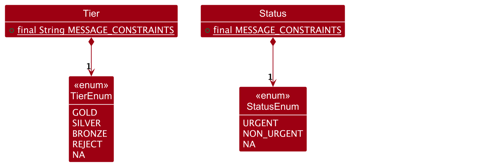

## Table of Contents
* [Acknowledgements](#acknowledgements)
* [Setting up, getting started](#setting-up-getting-started)
* [Design](#design)
* [Implementation](#implementation)
* [Planned enhancements](#planned-enhancements)
* [Documentation, logging, testing, configuration, dev-ops](#documentation-logging-testing-configuration-dev-ops)
* [Appendix: Requirements](#appendix-requirements)
    * [Product scope](#product-scope)
    * [User stories](#user-stories)
    * [Use cases](#use-cases)
    * [Non-Functional Requirements](#non-functional-requirements)
    * [Glossary](#glossary)
* [Appendix: Instructions for manual testing](#appendix-instructions-for-manual-testing)

--------------------------------------------------------------------------------------------------------------------

## Acknowledgements

* This project is based on the AddressBook-Level3 project created by the [SE-EDU initiative](https://se-education.org).

* Libraries used: [JavaFX](https://openjfx.io/), [Jackson](https://github.com/FasterXML/jackson), [JUnit5](https://github.com/junit-team/junit5), [Ikonli](https://github.com/kordamp/ikonli)

--------------------------------------------------------------------------------------------------------------------

## Setting up, getting started

Refer to the guide [_Setting up and getting started_](SettingUp.md).

--------------------------------------------------------------------------------------------------------------------

## Design

:bulb: **Tip:** The `.puml` files used to create diagrams in this document `docs/diagrams` folder. Refer to the [_PlantUML Tutorial_ at se-edu/guides](https://se-education.org/guides/tutorials/plantUml.html) to learn how to create and edit diagrams.

### Architecture

The **Architecture Diagram** given above explains the high-level design of the App.

Given below is a quick overview of main components and how they interact with each other.

**Main components of the architecture**

`Main` (consisting of classes [`Main`](https://github.com/AY2425S1-CS2103T-T14-4/tp/blob/master/src/main/java/seedu/address/Main.java) and [`MainApp`](https://github.com/AY2425S1-CS2103T-T14-4/tp/blob/master/src/main/java/seedu/address/MainApp.java)) is in charge of the app launch and shut down.
* At app launch, it initializes the other components in the correct sequence, and connects them up with each other.
* At shut down, it shuts down the other components and invokes cleanup methods where necessary.

The bulk of the app's work is done by the following four components:

* [`UI`](#ui-component): The UI of the App.
* [`Logic`](#logic-component): The command executor.
* [`Model`](#model-component): Holds the data of the App in memory.
* [`Storage`](#storage-component): Reads data from, and writes data to, the hard disk.

[`Commons`](#common-classes) represents a collection of classes used by multiple other components.

**How the architecture components interact with each other**

The *Sequence Diagram* below shows how the components interact with each other for the scenario where the user issues the command `delete 1`.

Each of the four main components (also shown in the diagram above),

* defines its **API** in an `interface` with the same name as the Component.
* implements its functionality using a concrete `{Component Name}Manager` class (which follows the corresponding API `interface` mentioned in the previous point.

For example, the `Logic` component defines its **API** in the `Logic.java` interface and implements its functionality using the `LogicManager.java` class which follows the `Logic` interface. Other components interact with a given component through its interface rather than the concrete class (reason: to prevent outside component's being coupled to the implementation of a component), as illustrated in the (partial) class diagram below.

The sections below give more details of each component.

### UI component

The **API** of this component is specified in [`Ui.java`](https://github.com/AY2425S1-CS2103T-T14-4/tp/blob/master/src/main/java/seedu/address/ui/Ui.java)

The UI consists of a `MainWindow` that is made up of parts e.g.`CommandBox`, `ResultDisplay`, `ClientListPanel`, `ClientDetailPanel`, `StatusBarFooter`, `StatusPieChart` etc. All these UI components, including the `MainWindow`, inherit from the abstract `UiPart` class which captures the commonalities between classes that represent parts of the visible GUI.

The `ClientListPanel` contains multiple `ClientCard` components, each representing a client's information with six `ClientCardField` elements that utilize the Ikonli package for icons. The `MainWindow` also includes a `ClientDetailPanel` that acts as a split view within the main window, and a `HelpWindow` that can be launched as a separate window.

The `UI` component uses the JavaFx UI framework. The layout of these UI parts are defined in matching `.fxml` files that are in the `src/main/resources/view` folder. For example, the layout of the [`MainWindow`](https://github.com/AY2425S1-CS2103T-T14-4/tp/blob/master/src/main/java/seedu/address/ui/MainWindow.java) is specified in [`MainWindow.fxml`](https://github.com/AY2425S1-CS2103T-T14-4/tp/blob/master/src/main/resources/view/MainWindow.fxml)

The `UI` component:

* Executes user commands using the `Logic` component through both the `UiManager` and `MainWindow`.
* Updates the display based on changes to `Model` data, particularly through the `ClientCard` and `ClientDetailPanel` components which directly observe the `Model`.
* Maintains a hierarchical structure where `UiManager` manages the `MainWindow`, which in turn contains and manages all other UI components.
* Features several dynamic elements:
    * A `ClientDetailPanel` that functions as an integrated split view within the main window
    * A separate `HelpWindow` that can be opened as a popup window
    * A `StatusPieChart` for visual data representation of status

### Logic component

**API** : [`Logic.java`](https://github.com/AY2425S1-CS2103T-T14-4/tp/blob/master/src/main/java/seedu/address/logic/Logic.java)

Here's a (partial) class diagram of the `Logic` component:

The sequence diagram below illustrates the interactions within the `Logic` component, taking `execute("delete 1")` API call as an example.

:information_source: **Note:** The lifeline for `DeleteCommandParser` should end at the destroy marker (X) but due to a limitation of PlantUML, the lifeline continues till the end of diagram.

How the `Logic` component works:

1. When `Logic` is called upon to execute a command, it is passed to an `AgentAssistParser` object which in turn creates a parser that matches the command (e.g., `DeleteCommandParser`) and uses it to parse the command.
1. This results in a `Command` object (more precisely, an object of one of its subclasses e.g., `DeleteCommand`) which is executed by the `LogicManager`.
1. The command can communicate with the `Model` when it is executed (e.g. to delete a client). 
   Note that although this is shown as a single step in the diagram above (for simplicity), in the code it can take several interactions (between the command object and the `Model`) to achieve.
1. The result of the command execution is encapsulated as a `CommandResult` object which is returned back from `Logic`.

Here are the other classes in `Logic` (omitted from the class diagram above) that are used for parsing a user command:

How the parsing works:
* When called upon to parse a user command, the `AgentAssistParser` class creates an `XYZCommandParser` (`XYZ` is a placeholder for the specific command name e.g., `AddCommandParser`).
* `XYZCommandParser` is responsible for parsing the command details and constructing an `XYZCommand object` (e.g., `AddCommand`).This `XYZCommand` object is then returned to the `AgentAssistParser` as a `Command` object.
    * Note: `FilterCommandParser` performs an additional step by creating multiple predicate classes (e.g., `NameContainsSubstringPredicate`). These individual predicates are then combined into a single `CombinedPredicate`.
* All `XYZCommandParser` classes (e.g., `AddCommandParser`, `FilterCommandParser`, etc.) implement the `Parser` interface, allowing them to be handled consistently, such as in testing scenarios.

### Model component
**API** : [`Model.java`](https://github.com/AY2425S1-CS2103T-T14-4/tp/blob/master/src/main/java/seedu/address/model/Model.java)

The `Model` component,

* stores the address book data i.e., all `Client` objects (which are contained in a `UniqueClientList` object).
* stores the currently 'selected' `Client` objects (e.g., results of a search query) as a separate _filtered_ list which is exposed to outsiders as an unmodifiable `ObservableList<Client>` that can be 'observed' e.g. the UI can be bound to this list so that the UI automatically updates when the data in the list change.
* stores a `UserPref` object that represents the user’s preferences. This is exposed to the outside as a `ReadOnlyUserPref` objects.
* does not depend on any of the other three components (as the `Model` represents data entities of the domain, they should make sense on their own without depending on other components).

### Storage component

**API** : [`Storage.java`](https://github.com/AY2425S1-CS2103T-T14-4/tp/blob/master/src/main/java/seedu/address/storage/Storage.java)

The `Storage` component,
* can save both address book data and user preference data in JSON format, and read them back into corresponding objects.
* inherits from both `AgentAssistStorage` and `UserPrefStorage`, which means it can be treated as either one (if only the functionality of only one is needed).
* depends on some classes in the `Model` component (because the `Storage` component's job is to save/retrieve objects that belong to the `Model`)

### Common classes

Classes used by multiple components are in the `seedu.address.commons` package.

--------------------------------------------------------------------------------------------------------------------

## Implementation

This section describes some noteworthy details on how certain features are implemented.

### 1. Tier and Status Attributes

AgentAssist is designed to support credit card sales, making it essential to have predefined credit card tiers that align with the bank’s product offerings. These tiers provide agents with insights into a client’s financial profile, allowing them to tailor their sales approach to meet each client’s unique needs.

Additionally, the inclusion of a status attribute for clients enhances customer service by indicating whether follow-up action is required. This feature helps agents keep track of promised actions, reducing missed commitments and ensuring a reliable client experience.

#### Current implementation

The `Tier` and `Status` fields are implemented as classes containing `enum` values, which restrict the possible options for these fields and improve data consistency.

Using `enum` values for `Tier` aligns with a real-world banking scenario where a predefined set of credit card tiers is available. This structure also accommodates clients who may have applied but been declined for a credit card, providing agents with an at-a-glance view of a client’s status and relevant product options.

Moreover, using enums for `Tier` simplifies updates to the list of predefined services,allowing banks to customize offerings based on their unique product catalog.

When updating the `Tier` `enum`, ensure that related CSS files (`ClientDetailPanel.css` and `ClientListCard.css`) are also updated. These files specify color settings for each tier, and you may need to rename the CSS classes to align with the new enum values. 
- Below is an example of a CSS update after renaming an enum value to `TEST`:
      
- This is the result in the UI after update the CSS:  
    

Similarly, `Status` is implemented using `enum` values to define a set of predefined client statuses. Each status has a corresponding color in the UI, offering agents visual cues to prioritize their follow-ups effectively:

- `NA` – Indicates clients with **no follow-up/action needed**. This status is displayed in green, representing a positive state with no immediate action.
- `NON_URGENT` – Indicates clients who **need a follow-up, though not urgently**. This status is displayed in orange, suggesting action is required soon but not immediately.
- `URGENT` – Indicates clients who need an **urgent follow-up**, displayed in red to ensure prompt action.

By assigning specific colors to each status, the UI helps agents prioritize their tasks effectively.

### 2. Add Command
The `add` command is used to add new clients into the existing list of clients. However, the command will prevent adding any clients who are considered 'duplicates' of existing clients.

#### Current implementation
This is a high-level view of what occurs when the `add` command is executed: 

There are a total of 3 checks that occur:
- **Flag Validation:** Checks that all required flags are present and that there are no invalid flags.
- **Value Validation:** Checks that the values provided for each specified flag are valid.
- **Duplicate Check:** Checks that there is no existing client with the same details (same `name`, `phone` and `email`) to prevent duplicate entries.

Note: The error messages shown will differ based on which check fails. The checks also occur in the same sequential order that they are listed in above.

    
### 3. Edit Command
The `edit` command is used to add a client's contact to the existing list of clients saved in AgentAssist.

#### Current implementation
Here is a high-level view of the logic flow when the `edit` command is executed:

The `edit` command performs five sequential checks:
- **Index Validation:** Checks that the specified index is not negative.
- **Flag Presence:** Checks  that at least one flag has been specified.
- **Remark Flag Validation:** Checks that the `remark new` and `remark append` flags are not used together.
- **Range Check:** Checks that the specified index is within the range of the current viewed client list.
- **Value Validation:** Checks that all values provided are valid.

Note: Users must specify a valid client index from the currently viewed list, ensuring it is a positive number and within list bounds.

### 4. Delete Command
The `delete` command is used to remove client's contacts from the existing list of clients saved in AgentAssist.

#### Current implementation
To execute the `delete` command, users must specify a valid client index from the currently viewed client list, ensuring the following:
1. The index is a **positive number**.
2. The index is **within the bounds** of the currently viewed client list.

Here is a high-level view of the methods involved when the user inputs `delete 1`, and approves of the deletion after a confirmation prompt is showed.

This follows the activity diagram shown below:

The user confirmation prompt shown here is also used in the `clear` command. This prompt is intended to help prevent accidental data loss by allowing users to confirm their decision, providing an opportunity to reconsider or correct any unintended command input.

### 5. Filter Command
The `filter` command is used to view a specific subset of clients by applying specific filtering criteria to the client list. 

#### Current implementation
The following diagrams provide a high-level overview of the `filter` command's logic flow:

**Note:** The sequence diagram has been omitted due to its complexity.

The filter command performs two primary checks:
- **Flag Validation:**  Checks there are no invalid flags, no duplicate flags, and that at least one valid flag is specified.
- **Argument Validation:** Checks that the argument values provided for each flag meet the required parsing criteria (as outlined in the User Guide).

Once these validations are complete, each valid flag and its corresponding argument are used to create a specific `Predicate` object (e.g., `NameContainsSubstringPredicate`, `AddressContainsSubstringPredicate`). These predicates are then combined to form a `CombinedPredicate` object.

- **Note:** `tier` and `status` use `TierStartsWithSubstringPredicate` and `StatusStartsWithSubstringPredicate` respectively, allowing partial matches based on the start of the provided substring.

The `CombinedPredicate` is applied to each client in AgentAssist, evaluating whether the client meets all filter criteria. Clients that satisfy the criteria are added to the filtered list. After all clients are evaluated, the filtered client list is displayed.

## Planned enhancements

### 1. Multi-Language Support
**Current Issue:** Non-English text input can cause visual bugs, including reversed text display.

**Proposed Solution:** Replace the default system font with a universal font that supports multiple languages. See [this reference](https://stackoverflow.com/questions/42854957/javafx-strange-space-characters-in-arabic) for implementation details.

### 2. Support for Forward Slash in Names
**Current Issue:** Names containing forward slashes (e.g., `Ramesh s/o Ravichandran`) are incompatible with `add`, `edit`, and `filter` commands due to two problems:

1. The parser misinterprets "s/o" as a Status flag command, resulting in an invalid status error
2. The name validation regex explicitly blocks forward slashes to prevent parsing conflicts

**Technical Impact:**
- Allowing forward slashes would create ambiguous parsing scenarios
- Example of resulting error message:
  

**Status:** Scheduled for future release due to the complexity of potential solutions and risk of introducing new bugs.

### 3.  Support for Symbols such as `@` and Parentheses in Names
**Current Issue:** Names containing symbols like `@` and parentheses (e.g., `John @ Doe` or `Jane (Admin) Smith`) are currently incompatible with the `add`, `edit`, and `filter` commands because support for these characters has not been implemented yet. Although such cases are rare, the current name validation regex excludes these symbols.

**Technical Impact:**
- There are no anticipated issues with allowing these symbols in names. The main reason for the lack of support is the low frequency of such cases, making it a lower priority for development.

**Status:** Scheduled for future release as an enhancement to improve flexibility in name handling, allowing a broader range of symbols in user inputs.

### 4. Data Import/Export Functionality
**Current issue:** Users must manually copy and paste the `agentassist.json` file in the `data` directory, if they wish to use others' AgentAssist data files, or share their data files with other users.

**Proposed Enhancement:** Add UI buttons in the application menu for:
- Importing data files
- Exporting data files

**Status:** Scheduled for future release as current manual process provides a workable solution.

### 5. Error Message Improvement
**Current issue:** Error messages are inconsistent when users input incorrect values. Depending on the parameter that is incorrect, the messages vary in detail. For example:
- Using `edit` without index nor flags:

- Using `edit` with index only:

- Using `edit` with index and `p/` flag without an argument: 

These images illustrate varying error message formats of the `edit` command. 

While some messages provide the full command hint, others offer minimal guidance, leading to an inconsistent user experience. This inconsistency extends beyond the `edit` command, as other error messages of other commands also vary in its level of information. In certain cases, error messages merely identify the issue without offering additional guidance, while others incorporate helpful usage hints.

Additionally, certain command hints could benefit from more clarity on constraints, especially for the `edit` command, which currently does not indicate that the `rn/` and `ra/` flags cannot be used simultaneously.

**Proposed Enhancement:** Standardize error message types and improve command hints:
- `Incorrect command format` Error Messages 
  - Triggered when required flags are missing.
  - Message format: "Incorrect command format” followed by a command usage hint.
- `Invalid flag values` Error Messages
  - Triggered when all necessary flags are present, but one or more flag values are invalid.
  - Message format: Flag-specific error message followed by a command usage hint.
- Enhanced Usage Hint for `edit` Command
  - Include guidance indicating that the rn/ and ra/ flags cannot be used simultaneously.

**Status:** Scheduled for future release, as:
1. The current error messages are functional and provide sufficient guidance for users. However, standardizing them will improve usability by minimizing confusion and ensuring consistent messaging.
2. The restriction on using `rn/` and `ra/` flags simultaneously is already documented in the user guide, and an error message is triggered if both flags are used together. This allows users to learn about the constraint through multiple avenues.

### 6. Relax Parsing Requirements for `income` and `email` Arguments in Filter Command
**Current issue:** The parsing requirements for the Filter command are overly strict, particularly for the `income` and `email` fields. Specifically:
- `income` must be a full, valid Singapore personal phone number (8 digits, starting with 6, 8 or 9).
- `email` must be in a valid email format (e.g., `username@domain`).

These requirements can be restrictive for agents who may prefer more flexible filtering, such as searching by the first few digits of a phone number (useful when multiple contacts share a company extension) or by email domain alone.

**Proposed Enhancement:** Relax parsing requirements for the `income` and `email` fields when used with the filter command, allowing any input and matching based on substrings rather than strict validation.

**Status:** Scheduled for future release due to current timeline priorities.

### 7. Prevent Duplicate Client Entries by Standardizing Name Formatting
**Current issue:** Duplicate client entries can occur when minor differences in whitespace are present in names due to user input errors (e.g., `John Doe` vs. `John   Doe`). These variations, often caused by unintentional typos when using the `add` or `edit` commands, are currently treated as distinct entries.

**Proposed Enhancement:** Standardize client names by trimming excess whitespace from each part of the name before storing and comparing entries. This ensures that variations in spacing do not create duplicates.

**Status:** Scheduled for future release due to current timeline priorities.

### 8. Warning for Edit Commands with Inputs Identical to Current Values
**Current issue:** Users are not warned when the inputs for the `edit` command are the identical to the current values, resulting in no changes.

**Proposed Enhancement:** Add a confirmation prompt when the inputs are verified to make no changes to the client.

**Status:** Scheduled for future releases as the lack of confirmation prompt does not affect the intended functionality.

### 9. Edit Command for Remark Improvement
**Current Issue:** Users are unable to edit specific sections of `remark` using the `edit` command. To make specific changes, users have to remove all remarks before re-entering them with the changes.

**Proposed Enhancement:** Improve the `edit` command functionality for flag `/ra` such that it displays a text-editable window with that allows for the entire remark text to be edited.

**Status:** Scheduled for future releases as current manual process provides a workable solution.

### 10. Close Command Response Enhancement
**Current issue:** The feedback messages for the `close` command lack context sensitivity. When users request to close a detailed view that is not opened, the system returns "Detailed view closed" rather than a more accurate message indicating that no client was viewed. While the command functions correctly and maintains system integrity, this response could be more informative.

**Proposed Enhancement:** Implement context-aware feedback messages for the `close` command. When no client is viewed, the system should return a more appropriate message such as "No client currently being viewed" rather than indicating a closure action that did not occur. This would better align with user expectations and improve clarity.

**Status:** Scheduled for future release as the current behavior, while not optimal, does not impact system functionality or data integrity. The enhancement is purely cosmetic and aimed at improving user experience through more precise feedback messaging.

--------------------------------------------------------------------------------------------------------------------

## **Documentation, logging, testing, configuration, dev-ops**

* [Documentation guide](Documentation.md)
* [Testing guide](Testing.md)
* [Logging guide](Logging.md)
* [Configuration guide](Configuration.md)
* [DevOps guide](DevOps.md)

--------------------------------------------------------------------------------------------------------------------

## **Appendix: Requirements**

### Product scope

**Banking Agents, that sell credit cards**:

* has a need to manage a significant number of contacts
* prefer desktop apps over other types
* can type fast
* prefers typing to mouse interactions
* needs a fast way to access data, and see relevant client information at a glance while on a call with the client
* is reasonably comfortable using CLI apps

**Value proposition**: manage contacts faster than a typical mouse/GUI driven app

### User stories

Priorities: High (must have) - `* * *`, Medium (nice to have) - `* *`, Low (unlikely to have) - `*`

| Priority | As a …​         | I want to …​                                                              | So that…​                                                                                                                           |
|----------|-----------------|---------------------------------------------------------------------------|-------------------------------------------------------------------------------------------------------------------------------------|
| `* * *`  | user            | save current data                                                         | when I close & open the app, details I have added persist                                                                           |
| `* * *`  | user            | be able to edit data of my client                                         | I can change client details without having to delete and re-add the contact with the new details                                    |
| `* * *`  | banking agent   | add a client                                                              | I can save the records and details of the new client                                                                                |
| `* * *`  | banking agent   | remove a client                                                           | I can remove a client that is no longer going to use our credit card services or is blacklisted                                     |
| `* * *`  | banking agent   | view details of a client                                                  | I need not ask clients for details again                                                                                            |
| `* * *`  | banking agent   | save contact details of the clients                                       | I can contact clients who are more willing to spend money and call back clients with updates                                        |
| `* * *`  | banking agent   | edit contact details of the clients                                       | I need not delete and re-add a client just for a small change in detail (i.e. moved house)                                          |
| `* * *`  | banking agent   | save a note/remarks about the clients                                     | I can recall any particular notable details about the client (for e.g. This client is very concerned about pricing)                 |
| `* *`    | banking agent   | check which credit card services or plans a client has/had                | I avoid selling products that the client already has                                                                                |
| `* *`    | banking agent   | filter using details like occupation and income                           | I can target a group of clients more quickly                                                                                        |
| `* *`    | first time user | have a walkthrough guide to show me the user interface                    | I am familiar with the features available and how I can find and use them                                                           |
| `*`      | user            | export current data                                                       | I can backup the data regularly                                                                                                     |
| `*`      | user            | import data from a backup                                                 | I can use my backed up data in case of data loss, or initialise the app with a set of data if I am transferring from a prior source |
| `*`      | banking agent   | view common urls/card information                                         | I can read/send them to the client quickly when inquired                                                                            |
| `*`      | banking agent   | be reminded to call back a client when I open the application             | I can immediately know which client I need to follow up today                                                                       |
| `*`      | impatient user  | get the results that fall into a specific group/category                  | I don’t waste time querying all the results in that category individually                                                           |
| `*`      | impatient user  | enter details quickly using a user-friendly interface                     | I can quickly add/view data and not get mad because it’s fast                                                                       |
| `*`      | long time user  | access my most frequently used features easily                            | I can save time when accessing my most used features                                                                                |
| `*`      | beginner user   | have a help menu                                                          | I know how to perform a particular task                                                                                             |
| `*`      | beginner user   | have some sample client data that has already been inputted into the app  | I can find out information can be saved in the application                                                                          |

### Use cases

(For all use cases below, the **System** is the `AgentAssist` and the **Actor** is the `user`, unless specified otherwise)

**Use case: U1 - List all clients**

**MSS**

1. User requests to see the entire list of clients.
2. AgentAssist shows a list of all clients.

    Use case ends.

**Use case: U2 - Delete a client**

**MSS**

1.  User performs <u>Filter for a client (U4)</u> or <u>List all clients (U1)</u>.
2.  AgentAssist returns a list of clients.
3.  User requests to delete a specific client in the list, using the index of the client of the list.
4.  AgentAssist asks user for confirmation.
5.  User confirms.
6.  AgentAssist deletes the client.

    Use case ends.

**Extensions**

* 2a. The list is empty.

  Use case ends.

* 3a. The given index is invalid.

    * 3a1. AgentAssist shows an error message.

      Use case resumes at step 2.
* 4a. User declines to give confirmation.
  * 4a1. AgentAssist shows a cancellation message.
  * 4a2. Nothing is changed.

**Use case: U3 - Add a Client**

**MSS**

1.  User requests to add a client.
2.  AgentAssist adds a client.
3.  AgentAssist returns a success message.

    Use case ends.

**Extensions**

* 1a. The given parameters are invalid.
    * 1a1. AgentAssist shows an invalid parameter error message.

      Use case resumes at step 1.

**Use case: U4 - Filter for a client**

**MSS**

1.  User requests to search for a client using an attribute like name to filter for the client.
2.  AgentAssist returns a list of clients which match the filter set in step 1.
3. AgentAssist returns a success message.

    Use case ends.

**Extensions**

* 1a. The given filter option is invalid.
    * 1a1. AgentAssist shows an invalid parameter error message.

      Use case resumes at step 1.
* 1b. No clients in the existing data pass the filter.
    * 1b1. AgentAssist shows a blank list.

      Use case ends.

**Use case: U5 - Edit a Client**

**MSS**

1. User performs <u>Filter for a client (U4)</u> or <u>List all clients (U1)</u>.
2. AgentAssist returns a list of clients.
3. User specifies which client and attribute they would like to edit, using the index of the client of the list.
4. AgentAssist edits the selected client.
5. AgentAssist returns a success message.

    Use case ends.

**Extensions**

* 3a. The provided client index is invalid.
  * 3a1. AgentAssist shows an invalid index error message.

    Use case resumes at step 3.

* 3b. The given edit option is invalid.
  * 3b1. AgentAssist shows an invalid parameter error message.

    Use case resumes at step 3.
* 3c. Provided values are invalid.
  * 3c1. AgentAssist shows the errors pertaining to the fields.

    Use case resumes at step 3.

* 3d. Provided values will cause edited client to become a duplicate of an existing client.
  * 3d1. AgentAssist shows an error to inform the user that allowing this edit will result in a duplicate client.
  * 3d2. No change occurs.

    Use case resumes at step 3.

**Use case: U6 - View a client**

**MSS**

1.  User performs <u>Filter for a client (U4)</u> or requests to <u>List all clients (U1)</u>.
2.  AgentAssist returns a list of clients, with the client of interest in it.
3.  User requests to view a client, using the index of the client of the list.
4.  AgentAssist returns a detailed view of the client and a success message.

    Use case ends.

**Extensions**

* 3a. The provided client index is invalid.
  * 3a1. AgentAssist shows an invalid index error message.

    Use case resumes at step 3.

**Use case: U7 - Close detailed view**

**MSS**

1. User requests to close detailed view. 
2. AgentAssist closes the detailed view.

    Use case ends.

**Use case: U8 - Clear clients' contacts**

**MSS**

1. User requests to clear the list of clients' contacts.
2. AgentAssist prompts for confirmation from user.
3. User provides confirmation.
4. AgentAssist clears contact list and shows a success message.

    Use case ends.

**Extensions**

* 3a. User declines confirmation.
  * 3a1. AgentAssist shows cancellation message to user.
  * 3a2. No change is made.

    Use case ends.

**Use case: U9 - Undo the most recent change**

**MSS**
1. User requests to undo the last change made to the list of contacts.
2. AgentAssist reverse the last change made, and displays the edited list and a success message.

    Use case ends.

**Extensions**

* 2a. There was no recorded last change
  * 2a1. AgentAssist shows an error message to user.
  * 2a2. No change is made.

    Use case ends.

**Use case: U10 - Exit**

**MSS**

1.  User requests to exit.
2.  AgentAssist exits.

    Use case ends.

### Non-Functional Requirements

#### Platform Compatibility
- **Description**: AgentAssist must be operational on any mainstream operating system (Windows, macOS, Linux) as long as Java 17 or newer is installed.

#### Performance and Capacity
- **Description**: The system should efficiently handle up to 1000 client records without noticeable sluggishness in typical usage scenarios.
- **Performance Goal**: All commands should execute and return a response within two seconds to maintain a fluid user experience.

#### User Efficiency
- **Description**: Designed for users with above-average typing speed in regular English text; such users should find executing tasks via commands faster than using a mouse.

#### System Architecture
- **Description**: AgentAssist is designed for single-user scenarios, ensuring clientalized and secure data management without the complexities of multi-user capabilities.

#### Data Management
- **Description**: All client data should be stored locally in a human-editable text file format, allowing for easy access and manual modifications if required.

#### Documentation
- **Description**: Provide comprehensive, easy-to-read User and Developer Guides detailing functionality, usage, and system requirements.
- **Additional**: Both guides should be formatted to be printer-friendly, particularly in PDF format, facilitating easy distribution and referencing.

#### Installation and Distribution
- **Description**: AgentAssist should be accessible without the need for a traditional installer. The application should be distributable as a single JAR file, simplifying setup and use.
- **Dependency**: The software should operate independently without requiring connections to any remote servers owned or managed by the developer.

#### User Interface
- **Description**: While the primary interface is command-line based, any graphical user interface (GUI) elements should be optimized for standard screen resolutions (1920x1080 and higher) and screen scales (100% and 125%), ensuring clarity and usability across various devices.

### Glossary

* **Mainstream OS**: Common operating systems like Windows, Linux, Unix, and macOS supported by the application.
* **CLI (Command Line Interface)**: A text-based interface where users interact with the app by typing commands instead of using a graphical interface (mouse-driven).
* **Banking Agent**: A user of the system responsible for selling credit cards to clients.
* **Contact**: A record in the AgentAssist system that contains cliental and financial details of a client.
* **Client**: An individual whose information is managed within the AgentAssist system. This client may be a prospective or existing customer of the banking agent, expressing interest in or currently using credit card services.

--------------------------------------------------------------------------------------------------------------------

## **Appendix: Instructions for manual testing**

Given below are instructions to test the app manually.

:information_source: **Note:** These instructions only provide a starting point for testers to work on;
testers are expected to do more *exploratory* testing.

### Launch and shutdown

1. Initial launch

    1. Download the jar file and copy into an empty folder

    1. Double-click the jar file Expected: Shows the GUI with a set of sample contacts. The window size may not be optimum.

1. Saving window preferences

    1. Resize the window to an optimum size. Move the window to a different location. Close the window.

    1. Re-launch the app by double-clicking the jar file. 
       Expected: The most recent window size and location is retained.

### Adding a client

1. Adding a new client to AgentAssist

    1. Prerequisites: There must not be an existing client with the same name, phone number and email as the new client.

    2. Test case: `add n/ <NAME> p/ <PHONE> e/ <EMAIL> a/ <ADDRESS> j/ <JOB> i/ <INCOME>` 
       Expected: A client with the given details is added to the end of the list of clients. Details are shown in the results box and any details that are truncated can be seen by using the `view` command with the client's displayed index.

    3. Test case: `add n/ <NAME> p/ <PHONE> e/ <EMAIL> a/ <ADDRESS> j/ <JOB> i/ <INCOME> t/ <TIER> r/ <REMARK> s/ Status` 
       Expected: A client with the given details, including the optional ones, is added to the end of the list of clients. Similar to previous. 

   4. Missing compulsory fields: `add n/ <NAME> p/ <PHONE>`, `add n/ <NAME> p/ <PHONE> e/ <EMAIL>`, `...`  
      Expected: An error message is shown to user. No client is added. Missing fields are shown in the error message. 

   5. Invalid command formats: `add`, `add n/ <NAME> p/ <INVALID_PHONE> e/ E/ <EMAIL>...`, `...`  
       Expected: An error message is shown to user. No client is added. Error details shown in the status message.

2. Add an existing client
    1. Prerequisites: There exists a client in AddressBook which has the same name, phone number and email as the client to be added.
    2. Test case: `add n/ <SAME_NAME> p/ <SAME_PHONE> e/ <SAME_EMAIL> a/ <ADDRESS> j/ <JOB> i/ <INCOME>` (where <SAME_NAME>, <SAME_PHONE> and <SAME_EMAIL> are the name, phone number and email of an existing client)  
       Expected: An error message indicating that the client already exists is shown to user. No client is added.

### Deleting a client

1. Deleting a client while all clients are being shown

    1. Prerequisites: List all clients using the `list` command. Multiple clients in the list.

   2. Test case: `delete 1` 
       Expected: A prompt for confirmation from the user is given. If the user provides confirmation, the first contact is deleted from the list. Details of the deleted contact shown in the status message. Otherwise, the user is informed that the command has been cancelled, and no change is made.

   3. Test case: `delete 0` 
       Expected: An error message is shown to the user. No client is deleted. Error details shown in the status message.

   4. Other incorrect delete commands to try: `delete`, `delete x`, `...` (where x is larger than the list size) 
       Expected: Similar to previous.

2. Deleting a client after having filtered based on a criteria
   1. Prerequisites: Use the `filter` command with a suitable flag. Multiple clients in the list.
   2. Functions similar to above example except that the indexes to be used are based on the new list shown.

### Editing a client

1. Editing a client while all clients are being shown

    1. Prerequisites: List all clients using the `list` command. At least one client in the list.
    2. Test case: `edit 1 n/ <NAME>` 
         Expected: The name of the client in index 1 will be changed to <NAME>.
    3. Test case: `edit 1 n/ <NAME> p/ <PHONE>` 
         Expected: The name and the phone of the client in index 1 will be changed to <NAME> and <PHONE> respectively.
   4. Other correct edit commands to try: `edit 1 n/ <NAME> p/ <PHONE> e/ <EMAIL>`, `...` (for any number of valid flags and valid arguments) 
      Expected: Similar to previous.
   5. Test case: `edit 0 n/ <NAME>` 
        Expected: An error message is shown to the user. No edits are made to client details. Error details shown in the status message.
   6. Other incorrect edit commands to try: 
      `edit 1 f/<INVALID_VALUE>` (where f is a valid flag), 
      `edit x n/<NAME>` (where x is larger than list size), 
      `edit 1 y/<VALUE>` (where y is an invalid flag)  
       Expected: Similar to previous.

2. Editing a client after having filtered based on a criteria
    1. Prerequisites: Use the `filter` command with a suitable flag. Multiple clients in the list.
    2. Functions similar to above example except that the indexes to be used are based on the new list shown.

### Saving data

1. Dealing with missing/corrupted data files
   1. Back up the existing `agentassist.json` file under the `data` directory.
   2. Since the data file is corrupted, the application will show a blank list of clients' contacts.
   3. Adding any new contacts now, will override the old file.
   4. You may attempt to repair the old corrupted file, by cross-checking the old corrupted file against the new, uncorrupted file created when a new contact is added after step 3.
   5. Make sure to follow the constraints laid out in the user guide for each attribute of Client.
   6. If the data file is successfully repaired, running `agentassist.jar` should result in the old data being displayed back in the application.
