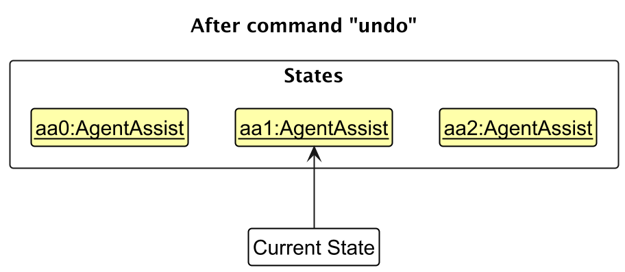
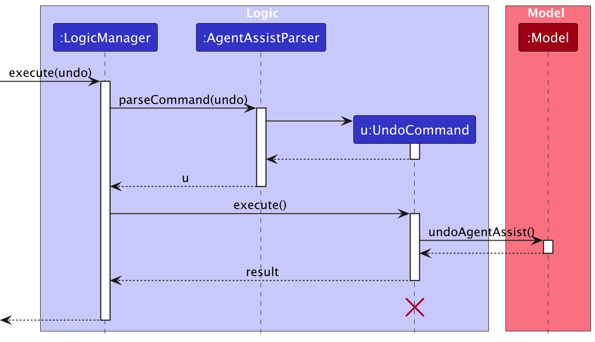

* Table of Contents
{:toc}

--------------------------------------------------------------------------------------------------------------------

## **Acknowledgements**

* {list here sources of all reused/adapted ideas, code, documentation, and third-party libraries -- include links to the original source as well}

--------------------------------------------------------------------------------------------------------------------

## **Setting up, getting started**

Refer to the guide [_Setting up and getting started_](SettingUp.md).

--------------------------------------------------------------------------------------------------------------------

## **Design**

<div markdown="span" class="alert alert-primary">

:bulb: **Tip:** The `.puml` files used to create diagrams in this document `docs/diagrams` folder. Refer to the [_PlantUML Tutorial_ at se-edu/guides](https://se-education.org/guides/tutorials/plantUml.html) to learn how to create and edit diagrams.
</div>

### Architecture


The ***Architecture Diagram*** given above explains the high-level design of the App.

Given below is a quick overview of main components and how they interact with each other.

**Main components of the architecture**

**`Main`** (consisting of classes [`Main`](https://github.com/se-edu/addressbook-level3/tree/master/src/main/java/seedu/address/Main.java) and [`MainApp`](https://github.com/se-edu/addressbook-level3/tree/master/src/main/java/seedu/address/MainApp.java)) is in charge of the app launch and shut down.
* At app launch, it initializes the other components in the correct sequence, and connects them up with each other.
* At shut down, it shuts down the other components and invokes cleanup methods where necessary.

The bulk of the app's work is done by the following four components:

* [**`UI`**](#ui-component): The UI of the App.
* [**`Logic`**](#logic-component): The command executor.
* [**`Model`**](#model-component): Holds the data of the App in memory.
* [**`Storage`**](#storage-component): Reads data from, and writes data to, the hard disk.

[**`Commons`**](#common-classes) represents a collection of classes used by multiple other components.

**How the architecture components interact with each other**

The *Sequence Diagram* below shows how the components interact with each other for the scenario where the user issues the command `delete 1`.


Each of the four main components (also shown in the diagram above),

* defines its *API* in an `interface` with the same name as the Component.
* implements its functionality using a concrete `{Component Name}Manager` class (which follows the corresponding API `interface` mentioned in the previous point.

For example, the `Logic` component defines its API in the `Logic.java` interface and implements its functionality using the `LogicManager.java` class which follows the `Logic` interface. Other components interact with a given component through its interface rather than the concrete class (reason: to prevent outside component's being coupled to the implementation of a component), as illustrated in the (partial) class diagram below.


The sections below give more details of each component.

### UI component

The **API** of this component is specified in [`Ui.java`](https://github.com/se-edu/addressbook-level3/tree/master/src/main/java/seedu/address/ui/Ui.java)


The UI consists of a `MainWindow` that is made up of parts e.g.`CommandBox`, `ResultDisplay`, `StudentListPanel`, `StatusBarFooter` etc. All these, including the `MainWindow`, inherit from the abstract `UiPart` class which captures the commonalities between classes that represent parts of the visible GUI.

The `UI` component uses the JavaFx UI framework. The layout of these UI parts are defined in matching `.fxml` files that are in the `src/main/resources/view` folder. For example, the layout of the [`MainWindow`](https://github.com/se-edu/addressbook-level3/tree/master/src/main/java/seedu/address/ui/MainWindow.java) is specified in [`MainWindow.fxml`](https://github.com/se-edu/addressbook-level3/tree/master/src/main/resources/view/MainWindow.fxml)

The `UI` component,

* executes user commands using the `Logic` component.
* listens for changes to `Model` data so that the UI can be updated with the modified data.
* keeps a reference to the `Logic` component, because the `UI` relies on the `Logic` to execute commands.
* depends on some classes in the `Model` component, as it displays `Student` object residing in the `Model`.

### Logic component

**API** : [`Logic.java`](https://github.com/se-edu/addressbook-level3/tree/master/src/main/java/seedu/address/logic/Logic.java)

Here is a fuller diagram of how the `Logic` component might interact with adjacent classes:


The sequence diagram below illustrates the interactions within the `Logic` component, taking `execute("delete 1")` API call as an example.


<div markdown="span" class="alert alert-info">:information_source: **Note:** The lifeline for `DeleteCommandParser` should end at the destroy marker (X) but due to a limitation of PlantUML, the lifeline continues till the end of diagram.
</div>

How the `Logic` component works:

1. When `Logic` is called upon to execute a command, it is passed to an `AddressBookParser` object which in turn creates a parser that matches the command (e.g., `DeleteCommandParser`) and uses it to parse the command.
1. This results in a `Command` object (more precisely, an object of one of its subclasses e.g., `DeleteCommand`) which is executed by the `LogicManager`.
1. The command can communicate with the `Model` when it is executed (e.g. to delete a student).<br>
   Note that although this is shown as a single step in the diagram above (for simplicity), in the code it can take several interactions (between the command object and the `Model`) to achieve.
1. The result of the command execution is encapsulated as a `CommandResult` object which is returned back from `Logic`.

Here are the other classes in `Logic` (omitted from the class diagram above) that are used for parsing a user command:


How the parsing works:
* When called upon to parse a user command, the `AddressBookParser` class creates an `XYZCommandParser` (`XYZ` is a placeholder for the specific command name e.g., `AddCommandParser`) which uses the other classes shown above to parse the user command and create a `XYZCommand` object (e.g., `AddCommand`) which the `AddressBookParser` returns back as a `Command` object.
* All `XYZCommandParser` classes (e.g., `AddCommandParser`, `DeleteCommandParser`, ...) inherit from the `Parser` interface so that they can be treated similarly where possible e.g, during testing.

### Model component
**API** : [`Model.java`](https://github.com/se-edu/addressbook-level3/tree/master/src/main/java/seedu/address/model/Model.java)


The `Model` component,

* stores the address book data i.e., all `Student` objects (which are contained in a `UniqueStudentList` object).
* stores the currently 'selected' `Student` objects (e.g., results of a search query) as a separate _filtered_ list which is exposed to outsiders as an unmodifiable `ObservableList<Student>` that can be 'observed' e.g. the UI can be bound to this list so that the UI automatically updates when the data in the list change.
* stores a `UserPref` object that represents the user’s preferences. This is exposed to the outside as a `ReadOnlyUserPref` objects.
* does not depend on any of the other three components (as the `Model` represents data entities of the domain, they should make sense on their own without depending on other components)

<div markdown="span" class="alert alert-info">:information_source: **Note:** An alternative (arguably, a more OOP) model is given below. It has a `Tag` list in the `AddressBook`, which `Student` references. This allows `AddressBook` to only require one `Tag` object per unique tag, instead of each `Student` needing their own `Tag` objects.<br>


</div>


### Storage component

**API** : [`Storage.java`](https://github.com/se-edu/addressbook-level3/tree/master/src/main/java/seedu/address/storage/Storage.java)


The `Storage` component,
* can save both address book data and user preference data in JSON format, and read them back into corresponding objects.
* inherits from both `AddressBookStorage` and `UserPrefStorage`, which means it can be treated as either one (if only the functionality of only one is needed).
* depends on some classes in the `Model` component (because the `Storage` component's job is to save/retrieve objects that belong to the `Model`)

### Common classes

Classes used by multiple components are in the `seedu.address.commons` package.

--------------------------------------------------------------------------------------------------------------------

## **Implementation**

This section describes some noteworthy details on how certain features are implemented.

### \[Proposed\] Undo/redo feature

#### Proposed Implementation

The proposed undo/redo mechanism is facilitated by `VersionedAddressBook`. It extends `AddressBook` with an undo/redo history, stored internally as an `addressBookStateList` and `currentStatePointer`. Additionally, it implements the following operations:

* `VersionedAddressBook#commit()` — Saves the current address book state in its history.
* `VersionedAddressBook#undo()` — Restores the previous address book state from its history.
* `VersionedAddressBook#redo()` — Restores a previously undone address book state from its history.

These operations are exposed in the `Model` interface as `Model#commitAddressBook()`, `Model#undoAddressBook()` and `Model#redoAddressBook()` respectively.

Given below is an example usage scenario and how the undo/redo mechanism behaves at each step.

Step 1. The user launches the application for the first time. The `VersionedAddressBook` will be initialized with the initial address book state, and the `currentStatePointer` pointing to that single address book state.


Step 2. The user executes `delete 5` command to delete the 5th student in the address book. The `delete` command calls `Model#commitAddressBook()`, causing the modified state of the address book after the `delete 5` command executes to be saved in the `addressBookStateList`, and the `currentStatePointer` is shifted to the newly inserted address book state.


Step 3. The user executes `add n/David …​` to add a new student. The `add` command also calls `Model#commitAddressBook()`, causing another modified address book state to be saved into the `addressBookStateList`.


<div markdown="span" class="alert alert-info">:information_source: **Note:** If a command fails its execution, it will not call `Model#commitAddressBook()`, so the address book state will not be saved into the `addressBookStateList`.

</div>

Step 4. The user now decides that adding the student was a mistake, and decides to undo that action by executing the `undo` command. The `undo` command will call `Model#undoAddressBook()`, which will shift the `currentStatePointer` once to the left, pointing it to the previous address book state, and restores the address book to that state.



<div markdown="span" class="alert alert-info">:information_source: **Note:** If the `currentStatePointer` is at index 0, pointing to the initial AddressBook state, then there are no previous AddressBook states to restore. The `undo` command uses `Model#canUndoAddressBook()` to check if this is the case. If so, it will return an error to the user rather
than attempting to perform the undo.

</div>

The following sequence diagram shows how an undo operation goes through the `Logic` component:



<div markdown="span" class="alert alert-info">:information_source: **Note:** The lifeline for `UndoCommand` should end at the destroy marker (X) but due to a limitation of PlantUML, the lifeline reaches the end of diagram.

</div>

Similarly, how an undo operation goes through the `Model` component is shown below:


The `redo` command does the opposite — it calls `Model#redoAddressBook()`, which shifts the `currentStatePointer` once to the right, pointing to the previously undone state, and restores the address book to that state.

<div markdown="span" class="alert alert-info">:information_source: **Note:** If the `currentStatePointer` is at index `addressBookStateList.size() - 1`, pointing to the latest address book state, then there are no undone AddressBook states to restore. The `redo` command uses `Model#canRedoAddressBook()` to check if this is the case. If so, it will return an error to the user rather than attempting to perform the redo.

</div>

Step 5. The user then decides to execute the command `list`. Commands that do not modify the address book, such as `list`, will usually not call `Model#commitAddressBook()`, `Model#undoAddressBook()` or `Model#redoAddressBook()`. Thus, the `addressBookStateList` remains unchanged.


Step 6. The user executes `clear`, which calls `Model#commitAddressBook()`. Since the `currentStatePointer` is not pointing at the end of the `addressBookStateList`, all address book states after the `currentStatePointer` will be purged. Reason: It no longer makes sense to redo the `add n/David …​` command. This is the behavior that most modern desktop applications follow.


The following activity diagram summarizes what happens when a user executes a new command:


#### Design considerations:

**Aspect: How undo & redo executes:**

* **Alternative 1 (current choice):** Saves the entire address book.
  * Pros: Easy to implement.
  * Cons: May have performance issues in terms of memory usage.

* **Alternative 2:** Individual command knows how to undo/redo by
  itself.
  * Pros: Will use less memory (e.g. for `delete`, just save the student being deleted).
  * Cons: We must ensure that the implementation of each individual command are correct.

_{more aspects and alternatives to be added}_


### \[Proposed\] Consultation Management

The consultation management feature enables TAs to schedule and manage consultation sessions with students. This section describes the implementation details of the consultation system.

#### Architecture

The consultation feature comprises these key components:

* `Consultation`: Core class representing a consultation session
* `Date`: Represents and validates consultation dates
* `Time`: Represents and validates consultation times
* `AddConsultCommand`: Handles adding new consultations
* `AddConsultCommandParser`: Parses user input for consultation commands

[//]: # (The class diagram below shows the structure of the consultation feature:)

[//]: # ()

#### Implementation

The consultation management system is implemented through several key mechanisms:

**1. Date and Time Validation**

The system enforces strict validation for consultation scheduling:
* Dates must be in `YYYY-MM-DD` format and represent valid calendar dates
* Times must be in 24-hour `HH:mm` format
* Both use Java's built-in `LocalDate` and `LocalTime` for validation

Example:
```java
Date date = new Date("2024-10-20"); // Valid
Time time = new Time("14:00");      // Valid
Date invalidDate = new Date("2024-13-45"); // Throws IllegalArgumentException
```

**2. Consultation Management**

The `Consultation` class manages:
* Immutable date and time properties
* Thread-safe student list management
* Equality based on date, time, and enrolled students

Core operations:
```java
// Creating a consultation
Consultation consult = new Consultation(date, time, students);

// Adding/removing students
consult.addStudent(student);
consult.removeStudent(student);

// Getting immutable student list
List<Student> students = consult.getStudents(); // Returns unmodifiable list
```

**3. Command Processing**

The system supports these consultation management commands:
- `addconsult`: Creates new consultation sessions
- `addtoconsult`: Adds students to existing consultations
- `deleteconsult`: Removes consultation sessions
- `removefromconsults`: Removes students from consultations

Command examples:
```
addconsult d/2024-10-20 t/14:00
addtoconsult 1 n/John Doe n/Harry Ng
deleteconsult 1
removefromconsult 1 n/John Doe
```

**Aspect 1: Date and Time Representation**

* **Alternative 1 (current choice)**: Separate `Date` and `Time` classes
    * Pros: Clear separation of concerns, focused validation
    * Cons: Two objects to manage instead of one

* **Alternative 2**: Combined `DateTime` class
    * Pros: Unified handling of temporal data
    * Cons: More complex validation, reduced modularity

**Aspect 2: Student List Management**

* **Alternative 1 (current choice)**: Immutable view with mutable internal list
    * Pros: Thread-safe external access, flexible internal updates
    * Cons: Complex implementation

* **Alternative 2**: Fully immutable list
    * Pros: Simpler thread-safety
    * Cons: Higher memory usage for modifications


### \[Proposed\] Data Archiving / Export Feature

[//]: # (_{Explain here how the data archiving feature will be implemented}_)

The export feature allows TAs to export their current list of students to a CSV file for external use. This feature is particularly useful for creating backups, sharing data with other applications, or generating reports.

#### Proposed Implementation

The export functionality is implemented through the `ExportCommand` class which converts the current student list into CSV format and saves it to a file in the project's `data` folder. It is then ready for further use, which could be in the form of a download/import functionality in a separate feature.

Currently, the exported CSV includes the following student information:
- Name
- Phone number
- Email address
- Enrolled courses (semicolon separated)

#### Implementation Details

1. File Handling
The system aims to implement several safety features:
- Creates a `data` directory if it does not exist
- Validates filename for illegal characters
- Prevents accidental file overwriting
- Properly escapes special characters in CSV output
- 
2. Force Flag
The `-f` flag allows overwriting of existing files:
```
export students     // Creates a new file students.csv
export students     // Warns the user
export -f students  // Overwrites the students.csv file
```

#### Design Considerations

**Aspect: Export File Format**

* **Alternative 1 (current choice)**: CSV format
    * Pros: Wide compatibility, easy to read/edit
    * Cons: Limited formatting options

* **Alternative 2**: JSON format
    * Pros: Preserves data structures better
    * Cons: Less user-friendly for direct editing

**Aspect: File Location**

* **Alternative 1 (current choice)**: Fixed `data` directory
    * Pros: Consistent location, prevents scattered files
    * Cons: Less flexibility for users

* **Alternative 2**: User-specified directory
    * Pros: More user control
    * Cons: More complex input validation needed


--------------------------------------------------------------------------------------------------------------------

## **Documentation, logging, testing, configuration, dev-ops**

* [Documentation guide](Documentation.md)
* [Testing guide](Testing.md)
* [Logging guide](Logging.md)
* [Configuration guide](Configuration.md)
* [DevOps guide](DevOps.md)

--------------------------------------------------------------------------------------------------------------------

## **Appendix: Requirements**

### Product scope

**Target user profile**:

Teaching Assistants (TAs) in academic institutions such as universities, colleges, and online learning platforms.

- Role: TAs supporting professors and lecturers in managing course-related tasks.
- Experience Level: New and experienced TAs handling multiple responsibilities.
- Needs: Efficient management of student information and tasks.
- Has a need to manage a significant number of contacts
- Prefer desktop apps over other types
- Can type fast
- Prefers typing to mouse interactions
- Is reasonably comfortable using CLI apps

**Value proposition**: TAHub simplifies the role of Teaching Assistants by providing a centralized hub to organize student information, and efficiently manage course-related tasks. This platform empowers TAs to focus more on enhancing student learning and less on administrative chaos.

### User stories

Priorities: High (must have) - `* * *`, Medium (nice to have) - `* *`, Low (unlikely to have) - `*`

| Priority | As a …             | I want to …                                                               | So that I can …                                                          |
|----------|--------------------|---------------------------------------------------------------------------|--------------------------------------------------------------------------|
| `* * *`  | teaching assistant | add students to my course roster                                          | keep track of all students under my supervision                          |
| `* * *`  | teaching assistant | update student information                                                | keep student records up-to-date and accurate                             |
| `* * *`  | teaching assistant | search for a student by their name                                        | quickly find a specific student when needed                              |
| `* * *`  | teaching assistant | search for students enrolled in a course                                  | quickly find all students enrolled in a certain course                   |
| `* * *`  | teaching assistant | filter students by homework submission status                             | quickly get to grading and providing feedback                            |
| `* * *`  | teaching assistant | mark students' attendance in my tutorial                                  | leverage my fast typing to quickly take attendance                       |
| `* * *`  | teaching assistant | assign participation marks to each student                                | keep track of student participation easily to assign a grade later       |
| `* * *`  | teaching assistant | export student data as a CSV                                              | easily share information with professors or use in other applications    |
| `* * *`  | teaching assistant | schedule consultation sessions                                            | set aside dedicated time slots to meet with students                     |
| `* * *`  | teaching assistant | add students to consultation slots                                        | keep track of which students are attending each consultation             |
| `* * *`  | teaching assistant | view all my upcoming consultations                                        | prepare for and manage my consultation schedule                          |
| `* *`    | teaching assistant | assign tasks and deadlines to students                                    | track their responsibilities and ensure they stay on schedule            |
| `* *`    | teaching assistant | set reminders for important tasks or deadlines                            | stay notified of upcoming responsibilities and avoid missing them        |
| `* *`    | teaching assistant | view a calendar showing all upcoming student deadlines and my TA duties   | manage my time effectively and avoid scheduling conflicts                |
| `* *`    | teaching assistant | filter students by academic performance                                   | prioritise communication with students in need of help                   |
| `* *`    | teaching assistant | manually tag students in need of help                                     | remember to give these students additional support to help them catch up |
| `* *`    | teaching assistant | filter students by their attendance                                       | reach out to them if they have not attended for long periods of time     |
| `* *`    | teaching assistant | mark students who will be absent with a valid reason                      | keep track of special cases when taking attendance                       |
| `* *`    | teaching assistant | search for the availability of students during a certain time             | find the preferred timing to host a consultation session                 |
| `* *`    | teaching assistant | view a list of students that match my search query without typing in full | handle mass search queries for convenience                               |
| `* *`    | teaching assistant | merge duplicate student entries                                           | maintain a clean and accurate database                                   |
| `* *`    | teaching assistant | backup my student database to a local file                                | ensure data safety and practice file management                          |
| `* *`    | teaching assistant | use a command to import student data from a CSV file                      | quickly populate my database at the start of a semester                  |
| `* *`    | teaching assistant | get alerts for consultation timing conflicts                              | avoid double booking consultation slots                                  |
| `* *`    | teaching assistant | see the history of consultations with each student                        | track how often I meet with specific students                            |
| `* *`    | teaching assistant | add notes to consultation sessions                                        | record what was discussed and any follow-up actions needed               |
| `*`      | teaching assistant | add notes to a student's profile                                          | keep track of special considerations for each student                    |
| `*`      | teaching assistant | assign a profile picture to each student                                  | have a visual aid to recognise who is who in my tutorial                 |
| `*`      | teaching assistant | toggle between light and dark mode                                        | select my preferred viewing mode                                         |
| `*`      | teaching assistant | redesign the TAHub GUI layout                                             | select my preferred visual layout                                        |
| `*`      | teaching assistant | press up and down to navigate command history                             | quickly reuse recently used commands                                     |
| `*`      | teaching assistant | generate a statistical summary of class performance                       | quickly assess overall class trends in scores/attendance etc.            |
| `*`      | teaching assistant | export my consultation schedule to my calendar                            | integrate consultation timings with my other appointments                |
| `*`      | teaching assistant | set recurring consultation slots                                          | establish regular consultation hours without manual scheduling           |

*{More to be added}*

### Use cases

(For all use cases below, the **System** is the `TAHub` and the **Actor** is the `user`, unless specified otherwise)

**<u>Use case: UC1 - Add a student</u>**

**MSS:**

1. User requests to add a student by providing the necessary details (name, contact, courses, email).
2. TAHub validates the inputs.
3. TAHub adds the student with the provided details.
4. The GUI displays the updated student list.
5. Use case ends.

**Extensions:**
* 2a. One or more input parameters are missing or invalid.
    * 2a1. TAHub shows an error message indicating the missing or invalid field(s).
    * 2a2. Use case resumes at step 1.


* 2b. The student already exists (both name and contact match an existing student).
    * 2b1. TAHub shows a duplicate error message.
    * 2b2. Use case resumes at step 1.

<br>

**<u>Use case: UC2 - Find students by Course</u>**

**MSS:**

1. User requests to find students enrolled in a particular course.
2. TAHub shows a list of students enrolled in that particular course.
3. Use case ends.

**Extensions:**

* 2a. There are no students enrolled in the given course.
    * 2a1. TAHub will show a message indicating there are no students found.
    * 2a2. Use case continues from 3.


* 2b. There are multiple courses containing the given string as a prefix.
    * 2b1. TAHub will display a list of all students enrolled in those courses.
    * 2b2. Use case continues from 3.

<br>

**<u>Use case: UC3 - Find student by name</u>**

**MSS:**

1. User requests to find a student by name.
2. TAHub displays a list of students whose names contain the input string as a prefix.
3. Use case ends.

**Extensions:**

* 2a. The list is empty.
  * 2a1. TAHub displays a message that there were no students found.
  * 2a2. Use case ends.

<br>

**<u>Use case: UC4 - Edit Student Information</u>**

**Precondition:** The Edited Student exists in Database

**MSS:**

1. User requests to edit a student's information by providing the index and necessary details (name, contact, courses, email).
2. TAHub validates the inputs.
3. TAHub updates the student with the provided details.
4. TAHub displays the updated student's information.
5. Use case ends.

**Extensions:**

* 2a. One or more input parameters are missing or invalid.
  * 2a1. TAHub shows an error message indicating the missing or invalid field(s).
  * 2a2. User enters new data.
  * 2a3. Steps 3a1-3a2 are repeated until the data entered are correct.<br>
  Use case resumes from step 3

<br>

**<u>Use case: UC5 - Delete Student by Index</u>**

**MSS:**

1. User requests to delete a specific student in the list by index.
2. TAHub verifies the given index.
3. TAHub deletes the student at the index in the list.
4. Use case ends.

**Extensions:**

* 2a. The given index is invalid.
  * 2a1. TAHub shows an error message stating that the index is invalid.
  * 2a2. Use case ends.

<br>

**<u>Use case: UC6 - Export Student List</u>**

**MSS**

1. TA enters export command with desired filename
2. System validates filename
3. System creates CSV file
4. System writes current student list to file
5. Success message shows number of students exported

**Extensions**

* 2a. Invalid filename
    * 2a1. System shows error message about invalid characters
    * 2a2. Use case resumes from step 1

* 3a. File already exists
    * 3a1. System shows error message suggesting force flag
    * 3a2. Use case resumes from step 1

* 3b. Directory creation fails
    * 3b1. System shows error message about directory creation
    * 3b2. Use case ends

* 4a. Write operation fails
    * 4a1. System shows error message about write failure
    * 4a2. Use case ends

**<u>Use case: UC7 - Create a Consultation</u>**

**MSS**

1. User enters: `addconsult d/2024-10-20 t/14:00`
2. System validates date and time are
   - In valid format
   - Not in the past
   - Not already booked
3. System creates consultation
4. Success message shown

**Extensions**

* 1a. Invalid date/time format
    * 1a1. System shows error message
    * 1a2. Use case ends

* 1b. Date/time already booked
    * 1b1. System shows conflict error
    * 1b2. Use case ends

**<u>Use case: UC8 - Add Student to Consultation</u>**

**MSS**

1. TA lists existing consultations
   - If no future consultations exist, system shows an appropriate message
2. TA selects consultation
3. TA adds student
4. System updates consultation

**Extensions**

* 1a. No existing consultations
    * 1a1. System shows message that no future consultations are available
    * 1a2. Use case ends

* 2a. Invalid consultation selection
    * 2a1. System shows error message
    * 2a2. Use case resumes from step 1

* 3a. Student does not exist in system
    * 3a1. System shows error message that student cannot be found
    * 3a2. Use case resumes from step 3

* 3b. Student already in consultation
    * 3b1. System shows error message that student is already registered
    * 3b2. Use case resumes from step 3

**<u>Use case: UC9 - Delete Consultation</u>**

**MSS**

1. TA lists existing consultations
2. TA enters command to delete specific consultation(s) by index
3. System removes the consultation(s)
4. Success message shown with deleted consultation details

**Extensions**

* 1a. No existing consultations
    * 1a1. System shows message that no consultations are available
    * 1a2. Use case ends

* 2a. Invalid consultation index
    * 2a1. System shows error message listing invalid indices
    * 2a2. Use case resumes from step 2

**<u>Use case: UC10 - Remove Students from Consultation</u>**

**MSS**

1. TA lists existing consultations
2. TA selects consultation by index 
3. TA specifies students to remove by name
4. System validates student existence in consultation 
5. System removes specified students from consultation 
6. Success message shown

**Extensions**

* 2a. Invalid consultation index
    * 2a1. System shows error message
    * 2a2. Use case resumes from step 2

* 3a. Student not found in system
    * 3a1. System shows error message identifying missing student
    * 3a2. Use case resumes from step 3

* 4a. Student not in consultation
    * 4a1. System shows error message that student is not in consultation
    * 4a2. Use case resumes from step 3


*{More to be added}*

### Non-Functional Requirements

1.  Should work on any _mainstream OS_ as long as it has Java `17` or above installed.
2.  Should be able to hold up to 1000 students without a noticeable sluggishness in performance for typical usage.
3.  A user with above average typing speed for regular English text (i.e. not code, not system admin commands) should be able to accomplish most of the tasks faster using commands than using the mouse.
4. The system should be able to scale to accommodate a growing number of users (teachers, TAs, students) without requiring significant reengineering.
5. The platform should have a clean, intuitive user interface that allows new users to complete basic tasks (like searching for a student) with minimal training.
6. Any search query should return results within 1 second for up to 10,000 student records.
7. Product should be for a single user.
8. The data should be stored locally and should be in a human editable text file.
9. The software should work without requiring an installer.

*{More to be added}*

### Glossary

* **Mainstream OS**: Windows, Linux, Unix, MacOS
* **Private contact detail**: A contact detail that is not meant to be shared with others
* **TA**: Teaching assistant
* **Student Record**: A collection of data fields that stores information about a student, including their name, contact information, course enrollment, and other relevant details (e.g., performance data or group assignments).

--------------------------------------------------------------------------------------------------------------------

## **Appendix: Instructions for manual testing**

Given below are instructions to test the app manually.

<div markdown="span" class="alert alert-info">:information_source: **Note:** These instructions only provide a starting point for testers to work on;
testers are expected to do more *exploratory* testing.

</div>

### Launch and shutdown

1. Initial launch

   1. Download the jar file and copy into an empty folder

   2. Double-click the jar file Expected: Shows the GUI with a set of sample contacts. The window size may not be optimum.

2. Saving window preferences

   1. Resize the window to an optimum size. Move the window to a different location. Close the window.

   2. Re-launch the app by double-clicking the jar file.<br>
       Expected: The most recent window size and location is retained.

3. _{ more test cases …​ }_

### Adding a student
1. Test case: `add n/TestOne p/11111111 e/test1@example.com c/CS2103T`<br>
    Expected: Student `TestOne` is added to the list. Details of the added student is shown.
2. Test case: `add n/TestOne p/11111111`<br>
   Expected: No student is added. Error details shown.
3. Test case: `add n/TestOne e/test1@example.com c/CS2103T`<br>
   Expected: No student is added. Error details shown.
4. Test case: `add n/Test1 p/11111111 e/test1@example.com c/CS2103T`<br>
   Expected: No student is added. Error details shown.

### Finding a student (by course)
1. Prerequisites: List all students using the `list` command. Multiple students in the list.

2. Test case: `find c/CS2103T` (Assuming Students with course `CS2103T` Exist)<br>
   Expected: Displays students details with course `CS2103T`.
3. Test case: `find c/CS2103T` (Assuming Students with course `CS2103T` does not Exist)<br>
   Expected: No Students Found. Displays 0 students.
4. Test case: `find c/1234`
   Expected: No Students Found. Error details shown.


### Finding a student (by name)
1. Prerequisites: List all students using the `list` command. Multiple students in the list.

2. Test case: `find n/TestOne` (Assuming Student with name `TestOne` Exists)<br>
   Expected: Displays students details with name `TestOne`.
3. Test case: `find n/TestOne` (Assuming Students with name `TestOne` does not Exist)<br>
   Expected: No Students Found. Displays 0 students.
4. Test case: `find n/Test1`
   Expected: No Students Found. Error details shown.

### Editing a student
1. Prerequisites: List all students using the `list` command. Multiple students in the list.

2. Test case: `edit 1 n/TestOne p/11111111`<br>
   Expected: 1st student is edited. Details of the edited student is shown.
3. Test case: `edit 2 e/test1@example.com c/CS2103T`<br>
   Expected: 2nd student is edited. Details of the edited student is shown.
4. Test case: `edit 2 n/Test 2`<br>
   Expected: No student is edited. Error details shown.
5. Other incorrect edit commands to try: `edit`, `edit x`, `...` (where x is larger than the list size)<br>
   Expected: No student is edited. Error details shown.

### Deleting a student
1. Prerequisites: List all students using the `list` command. Multiple students in the list.

2. Test case: `delete 1`<br>
   Expected: 1st student is deleted from the list. Details of the deleted student shown in the status message.
3. Test case: `delete 0`<br>
   Expected: No student is deleted. Error details shown in the status message.
4. Other incorrect delete commands to try: `delete`, `delete x`, `...` (where x is larger than the list size)<br>
   Expected: No student is deleted. Error details shown in the status message.

2. { more test cases …​ }_

### Saving data

1. Dealing with missing/corrupted data files

   1. _{explain how to simulate a missing/corrupted file, and the expected behavior}_

2. _{ more test cases …​ }_
