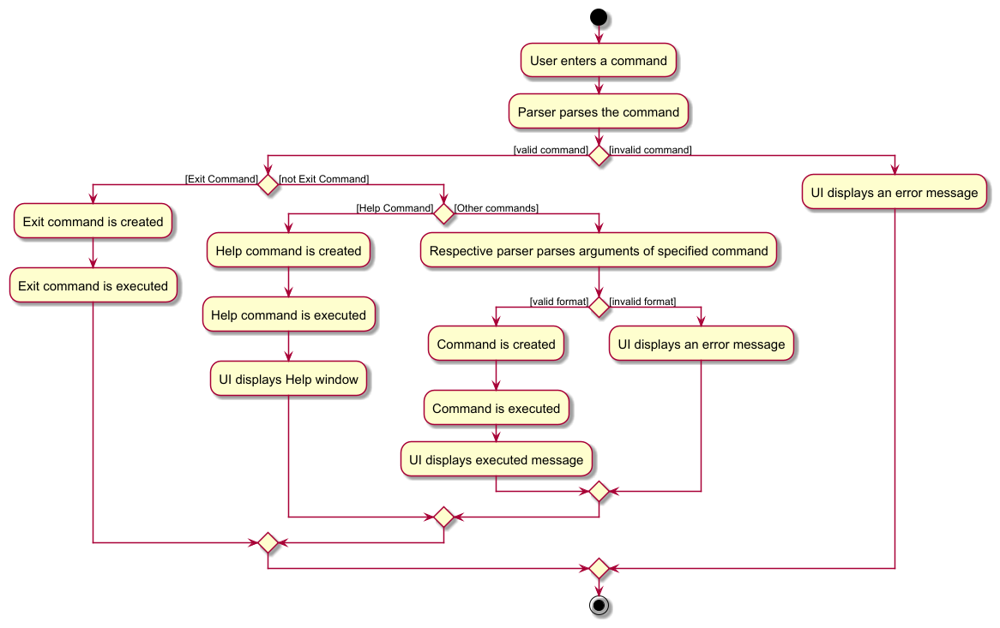

* Table of Contents
{:toc}

--------------------------------------------------------------------------------------------------------------------

## **Acknowledgements**

* Our team member isaactodo's iP chatbot code. https://github.com/isaactodo/ip
* Solution for max sized context menu for Autocomplete feature adapted from https://stackoverflow.com/questions/51272738/javafx-contextmenu-max-size-has-no-effect.
* Code for sidebar of UG and DG inspired by ChatGPT.

--------------------------------------------------------------------------------------------------------------------

## **Setting up, getting started**

Refer to the guide [_Setting up and getting started_](SettingUp.md).

--------------------------------------------------------------------------------------------------------------------

## **Design**

<div markdown="span" class="alert alert-primary">

:bulb: **Tip:** The `.puml` files used to create diagrams in this document `docs/diagrams` folder. Refer to the [_PlantUML Tutorial_ at se-edu/guides](https://se-education.org/guides/tutorials/plantUml.html) to learn how to create and edit diagrams.
</div>

### Architecture


The ***Architecture Diagram*** given above explains the high-level design of the App.

Given below is a quick overview of main components and how they interact with each other.

**Main components of the architecture**

**`Main`** (consisting of classes [`Main`](https://github.com/se-edu/addressbook-level3/tree/master/src/main/java/seedu/address/Main.java) and [`MainApp`](https://github.com/se-edu/addressbook-level3/tree/master/src/main/java/seedu/address/MainApp.java)) is in charge of the app launch and shut down.
* At app launch, it initializes the other components in the correct sequence, and connects them up with each other.
* At shut down, it shuts down the other components and invokes cleanup methods where necessary.

The bulk of the app's work is done by the following four components:

* [**`UI`**](#ui-component): The UI of the App.
* [**`Logic`**](#logic-component): The command executor.
* [**`Model`**](#model-component): Holds the data of the App in memory.
* [**`Storage`**](#storage-component): Reads data from, and writes data to, the hard disk.

[**`Commons`**](#common-classes) represents a collection of classes used by multiple other components.

**How the architecture components interact with each other**

The *Sequence Diagram* below shows how the components interact with each other for the scenario where the user issues the command `delete 1`.


Each of the four main components (also shown in the diagram above),

* defines its *API* in an `interface` with the same name as the Component.
* implements its functionality using a concrete `{Component Name}Manager` class (which follows the corresponding API `interface` mentioned in the previous point.

For example, the `Logic` component defines its API in the `Logic.java` interface and implements its functionality using the `LogicManager.java` class which follows the `Logic` interface. Other components interact with a given component through its interface rather than the concrete class (reason: to prevent outside component's being coupled to the implementation of a component), as illustrated in the (partial) class diagram below.


The sections below give more details of each component.

### UI component

The **API** of this component is specified in [`Ui.java`](https://github.com/se-edu/addressbook-level3/tree/master/src/main/java/seedu/address/ui/Ui.java)


The UI consists of a `MainWindow` that is made up of parts e.g.`CommandBox`, `ResultDisplay`, `PersonListPanel`, `StatusBarFooter` etc. All these, including the `MainWindow`, inherit from the abstract `UiPart` class which captures the commonalities between classes that represent parts of the visible GUI. However, `DialogBox` inherits from `HBox`.

The `UI` component uses the JavaFx UI framework. The layout of these UI parts are defined in matching `.fxml` files that are in the `src/main/resources/view` folder. For example, the layout of the [`MainWindow`](https://github.com/se-edu/addressbook-level3/tree/master/src/main/java/seedu/address/ui/MainWindow.java) is specified in [`MainWindow.fxml`](https://github.com/se-edu/addressbook-level3/tree/master/src/main/resources/view/MainWindow.fxml)

The `UI` component,

* executes user commands using the `Logic` component.
* listens for changes to `Model` data so that the UI can be updated with the modified data.
* keeps a reference to the `Logic` component, because the `UI` relies on the `Logic` to execute commands.
* depends on some classes in the `Model` component, as it displays `Person` object residing in the `Model`.

`CommandBox` holds a reference towards `AutocompleteParser` which helps parses user input for a list of suggestions to show to the user.
### Logic component

**API** : [`Logic.java`](https://github.com/se-edu/addressbook-level3/tree/master/src/main/java/seedu/address/logic/Logic.java)

Here's a (partial) class diagram of the `Logic` component:


The sequence diagram below illustrates the interactions within the `Logic` component, taking `execute("delete 1")` API call as an example.


<div markdown="span" class="alert alert-info">:information_source: **Note:** The lifeline for `DeleteCommandParser` should end at the destroy marker (X) but due to a limitation of PlantUML, the lifeline continues till the end of diagram.
</div>

How the `Logic` component works:

1. When `Logic` is called upon to execute a command, it is passed to an `AddressBookParser` object which in turn creates a parser that matches the command (e.g., `DeleteCommandParser`) and uses it to parse the command.
1. This results in a `Command` object (more precisely, an object of one of its subclasses e.g., `DeleteCommand`) which is executed by the `LogicManager`.
1. The command can communicate with the `Model` when it is executed (e.g. to delete a person).<br>
   Note that although this is shown as a single step in the diagram above (for simplicity), in the code it can take several interactions (between the command object and the `Model`) to achieve.
1. The result of the command execution is encapsulated as a `CommandResult` object which is returned back from `Logic`.

Here are the other classes in `Logic` (omitted from the class diagram above) that are used for parsing a user command:


How the parsing works:
* When called upon to parse a user command, the `AddressBookParser` class creates an `XYZCommandParser` (`XYZ` is a placeholder for the specific command name e.g., `AddCommandParser`) which uses the other classes shown above to parse the user command and create a `XYZCommand` object (e.g., `AddCommand`) which the `AddressBookParser` returns back as a `Command` object.
* All `XYZCommandParser` classes (e.g., `AddCommandParser`, `DeleteCommandParser`, ...) inherit from the `Parser` interface so that they can be treated similarly where possible e.g, during testing.

### Model component
**API** : [`Model.java`](https://github.com/se-edu/addressbook-level3/tree/master/src/main/java/seedu/address/model/Model.java)


The `Model` component,

* stores the address book data i.e., all `Person` objects (which are contained in a `UniquePersonList` object).
* stores the currently 'selected' `Person` objects (e.g., results of a search query) as a separate _filtered_ list which is exposed to outsiders as an unmodifiable `ObservableList<Person>` that can be 'observed' e.g. the UI can be bound to this list so that the UI automatically updates when the data in the list change.
* stores a `UserPref` object that represents the user’s preferences. This is exposed to the outside as a `ReadOnlyUserPref` objects.
* does not depend on any of the other three components (as the `Model` represents data entities of the domain, they should make sense on their own without depending on other components)

<div markdown="span" class="alert alert-info">:information_source: **Note:** An alternative (arguably, a more OOP) model is given below. It has a `Tag` list in the `AddressBook`, which `Person` references. This allows `AddressBook` to only require one `Tag` object per unique tag, instead of each `Person` needing their own `Tag` objects.<br>


</div>


### Storage component

**API** : [`Storage.java`](https://github.com/se-edu/addressbook-level3/tree/master/src/main/java/seedu/address/storage/Storage.java)


The `Storage` component,
* can save both address book data and user preference data in JSON format, and read them back into corresponding objects.
* inherits from both `AddressBookStorage` and `UserPrefStorage`, which means it can be treated as either one (if only the functionality of only one is needed).
* depends on some classes in the `Model` component (because the `Storage` component's job is to save/retrieve objects that belong to the `Model`)
  
The following is an example JSON output for a person:

```json
{
    "name": "John Doe",
    "phone": "98765432",
    "gender": "male",
    "modules": [
        {
            "module": "CS2103T",
            "grade": 85
        }
    ],
    "tags": [
        "colleague"
    ]
}
```

### Common classes

Classes used by multiple components are in the `seedu.address.commons` package.

--------------------------------------------------------------------------------------------------------------------

## General Flow
The activity diagram below illustrates the general flow of an interaction between the user and StoreClass.



1. The user enters a command in the `CommandBox`.
2. The AddressBookParser parses the command.
3. If the command is a valid command and is of a valid format, the corresponding `Command` object is created.
4. The `Command` object is executed by the `Logic` component.
5. The `UI` component displays the result of the command execution to the user. <br>

---

## **Implementation**

This section describes some noteworthy details on how certain features are implemented.

### Undo/redo feature

#### Implementation Overview

The undo/redo functionality is implemented in the `VersionedAddressBook`, which extends the basic `AddressBook` to include versioning capabilities. This is achieved by maintaining an internal history of address book states. The history is stored in a list (`addressBookStateList`), and the current state is tracked by the `currentStatePointer`.

The key operations involved in undo/redo are:

- **`VersionedAddressBook#save()`**: Saves the current state of the address book into the history list.
- **`VersionedAddressBook#undo()`**: Restores the address book to the previous state.
- **`VersionedAddressBook#redo()`**: Restores the address book to a previously undone state.

These operations are available to the rest of the system through the `Model` interface, specifically:

- `Model#saveAddressBook()`
- `Model#undoAddressBook()`
- `Model#redoAddressBook()`

---

## How Undo/Redo Works

The mechanism functions as follows:

1. **Save**: Every modification to the address book, such as `add`, `delete`, or `edit` commands, triggers a save operation to save the current state of the address book.

2. **Undo**: The undo operation moves the `currentStatePointer` backward and restores the previous state. If no more undo operations can be performed (i.e., if the pointer is at the start of the history), the operation fails and returns an error.

3. **Redo**: The redo operation moves the `currentStatePointer` forward and restores the next state that was undone. If there are no undone states, the operation fails and returns an error.

The activity diagram below illustrates how the state list changes according to the user's commands.


---

### Example Flow

Here is how undo and redo would work through a sequence of user actions:

---

#### Step 1. Initial State
Upon launching the application, the `VersionedAddressBook` is initialized with the default state (an empty address book, for example). This state is stored in the `addressBookStateList` as the first entry, and the `currentStatePointer` points to this state.


---

#### Step 2. Performing a Deletion
When a user executes the `delete` command (e.g., `delete 5`), the current state of the address book is saved before the change is made. This ensures that the delete action is reversible. The new state of the address book (with the 5th person deleted) is then stored in the history.

The `saveAddressBook()` operation is called internally, and the `currentStatePointer` is moved forward to point to the newly saved state.


---

#### Step 3. Performing an Addition
Next, if a user executes an `add` command (e.g., `add n/David ...`), a new state of the address book is created. As before, `saveAddressBook()` is invoked to save the new state, and the `currentStatePointer` is shifted to this new state.


<div markdown="span" class="alert alert-info">:information_source: **Note:** If a command fails its execution, it will not call `Model#saveAddressBook()`, so the address book state will not be saved into the `addressBookStateList`.

</div>

---

#### Step 4. Undoing the Addition
If the user decides to undo the most recent action (the `add` command), the `undo` operation will restore the address book to the state before the addition. Internally, `undoAddressBook()` is called, which moves the `currentStatePointer` backward and restores the state.

If the pointer is already at the first state (the initial state), attempting to undo will return an error.


<div markdown="span" class="alert alert-info">:information_source: **Note:** If the `currentStatePointer` is at index 0, pointing to the initial AddressBook state, then there are no previous AddressBook states to restore. The `undo` command uses `Model#canUndoAddressBook()` to check if this is the case. If so, it will return an error to the user rather
than attempting to perform the undo.

</div>

#### Undo Sequence Diagram
The following sequence diagram shows how the undo operation works across the `Logic` and `Model` components:

`Logic`:


<div markdown="span" class="alert alert-info">:information_source: **Note:** The lifeline for `UndoCommand` should end at the destroy marker (X) but due to a limitation of PlantUML, the lifeline reaches the end of diagram.

</div>

`Model`:


The `redo` command does the opposite — it calls `Model#redoAddressBook()`, which shifts the `currentStatePointer` once to the right, pointing to the previously undone state, and restores the address book to that state.

<div markdown="span" class="alert alert-info">:information_source: **Note:** If the `currentStatePointer` is at index `addressBookStateList.size() - 1`, pointing to the latest address book state, then there are no undone AddressBook states to restore. The `redo` command uses `Model#canRedoAddressBook()` to check if this is the case. If so, it will return an error to the user rather than attempting to perform the redo.

</div>

---

#### Step 5. Redoing the Addition
If the user decides to redo the action after undoing it, the `redo` operation will restore the state that was undone. The `redoAddressBook()` method is invoked, which moves the `currentStatePointer` forward to the next state in history and restores that state.

As with undo, if the pointer is at the last state in the list, trying to redo will return an error.


#### Redo Sequence Diagram
The following sequence diagram shows how the redo operation works across the `Logic` and `Model` components:


---

## Design Considerations

Here are the important aspects of the undo/redo implementation:

- **Saving Mechanism:** Each modification to the address book (like `add`, `delete`, or `edit`) triggers a call to `saveAddressBook()`. This function stores the current state of the address book and updates the `currentStatePointer`. However, commands that do not modify the address book (such as `list`, `find`, or `filter`) do not trigger a call to `saveAddressBook()`, and therefore do not modify the history.

- **Undo/Redo Pointer Management:** The `currentStatePointer` is moved backward during undo and forward during redo. If no more states can be undone or redone, appropriate error messages are returned.

- **Memory Considerations:** Since each address book state is stored in memory, excessive changes could increase memory usage. The current implementation keeps track of all states but might need optimization in the future, depending on the application’s use case.

- **State Purging:** After calling `undo`, when a command that modifies the address book is executed (such as `add`, `delete`, or `edit`), the states after the current one are purged to ensure consistency. This prevents errors from conflicting history states. Additionally, after calls to `archive` and `load`, the history is also purged to ensure consistency between different data files.

---


### Data archiving

The archive and load feature is achieved through `ArchiveCommand` and `LoadCommand` which both extend the `Command` class. When such command is executed, the LogicManager will update the Storage when necessary.

The Following UML Object Diagrams will illustrate how archive and load are done

Before the archiving or loading

We will use a simple case where there is one working AddressBook named `addressBook.json` in `data` folder and one archived AddressBook named `archivedFile1.json` in `archived` folder


**Scenario 1 Archive to a new file**

In this scenario, the user is trying to archive the current address book into a new file named `archiveFile2.json`. He enters the command `archive pa/archiveFile2.json` A new file names `archiveFile2.json` will be created and hold the data of `addressBook.json`. And the data in `addressBook.json` will be discarded.


**Scenario 2 Archive to a existing file**

In this scenario, the user is trying to archive the current address book into the existing file named `archiveFile1.json`. He enters the command `archive pa/archiveFile1.json` A file names `archiveFile1.json` will be overwritten and hold the data of `addressBook.json`. And the data in `addressBook.json` will be discarded.


The following sequence diagram illustrate how an archive operation is processed under `Logic` component.


<div markdown="span" class="alert alert-info">:information_source: **Note:** The lifeline for `ArchiveCommand` should end at the destroy marker (X) but due to a limitation of PlantUML, the lifeline reaches the end of diagram. Some details like parameters of function is omitted for simplicity.

</div>

**Scenario 3 Loading from a file**

In this scenario, the user is trying to load the address book from a file named `archiveFile1.json`. He enters the command `load pa/archiveFile1.json`. The data in the current working address book will be discarded. The data in `archiveFile1.json` will be loaded into the working address book.


The following sequence diagram illustrate how a load operation is processed under `Logic` component.


<div markdown="span" class="alert alert-info">:information_source: **Note:** The lifeline for `LoadCommand` should end at the destroy marker (X) but due to a limitation of PlantUML, the lifeline reaches the end of diagram. Some details like parameters of function is omitted for simplicity.

</div>

-------------------------------------------------------------------------------

## **Documentation, logging, testing, configuration, dev-ops**

* [Documentation guide](Documentation.md)
* [Testing guide](Testing.md)
* [Logging guide](Logging.md)
* [Configuration guide](Configuration.md)
* [DevOps guide](DevOps.md)

--------------------------------------------------------------------------------------------------------------------

## **Appendix: Requirements**

### Product scope

**Target user profile**:

* a teacher in an educational institution (private institution, i.e. tuition centers)
* need to manage large amount of student information
* prefer desktop apps over other types
* can type fast
* prefers typing to mouse interactions
* is reasonably comfortable using CLI apps

**Value proposition**: It allows for easy and efficient retrieval or storage of student information while providing a clean and user-friendly interface. The application supports modularity, and users are able to import and export to other similar applications without relying on complex or costly software.


### User stories

Priorities: High (must have) - `* * *`, Medium (Good to have) - `* *`, Low (nice to have) - `*`

| Priority | As a …​  | I want to …​                                              | So that I can…​                                                |
|----------|----------|-----------------------------------------------------------|----------------------------------------------------------------|
| `* * *`  | educator | add students into the database                            | easily refer to their information when needed                  |
| `* * *`  | educator | list all students to view the number of students          | collate that information                                       |
| `* * *`  | educator | delete a student                                          | remove entries that I no longer need                           |
| `* * *`  | educator | find a person by name                                     | find the relevant person without scrolling through a long list |
| `* *`    | educator | clear all information                                     | start anew for a new academic year                             |
| `* *`    | educator | update details easily when there are changes              | have the most updated information                              |
| `* *`    | educator | categorize students into groups                           |                                                                |
| `* *`    | educator | record students grades for tests and assignments          |                                                                |
| `* *`    | educator | view a summary of each student's grade                    |                                                                |
| `* *`    | educator | tag students with relevant labels                         | prioritize students based on their status                      |
| `* *`    | educator | record notes on student behaviour                         | easily track issues related to their behaviour                 |
| `* *`    | educator | archive old student data                                  | keep my AB clean while being able to retrieve old information  |
| `*`      | educator | set learning goals                                        | track their progress towards these goals                       |
| `*`      | educator | undo/redo any changes                                     | avoid re-entering the data during a mis-entry                  |
| `*`      | educator | see a list of suggested commands when typing out commands | easily type in the commands that I want and reduce typos       |
| `*`      | educator | export student data                                       | share the information with others                              |
| `*`      | educator | keep track of meetings with students                      | keep track of my commitments                                   |
| `*`      | educator | see sample data                                           | try out the app's feature without adding my own student data   |


### Use cases

(For all use cases below, the **System** is the `StoreClass` and the **Actor** is the `user`, unless specified otherwise)

#### **Use case 1: List out all students**

**Main Success Scenario**

1.  User requests to list students
2.  StoreClass shows a list of students

    Use case ends.

#### **Use case 2: Delete a student**

**Main Success Scenario**

1.  User requests to list students
2.  StoreClass shows a list of students
3.  User requests to delete a specific student in the list
4.  StoreClass deletes the student

    Use case ends.

**Extensions**

* 2a. The list is empty.

  Use case ends.

* 3a. The given index is invalid.

    * 3a1. AddressBook shows an error message.

      Use case resumes at step 2.

#### **Use case 3: Add a student**

**Main Success Scenario**

1.  User requests to add persons and type in the relevant information
2.  StoreClass adds the new student
3. StoreClass show the new list of students
    Use case ends.

**Extensions**

* 1a. The provided information is invalid.

    * 1a1. StoreClass displays the corresponding data error message.

      Use case resumes at step 1.

#### **Use case 4: Search for student**

**Main Success Scenario**

1.  User requests to search for student with the relevant search query.
2.  StoreClass displays the relevant student(s) matching the query. <br>
    Use case ends.

**Extensions**

* 1a. StoreClass is unable to find any matching results.

    * 1a1. StoreClass displays a message indicating that not students match the search query.

      Use case ends.

#### **Use case 5: Update Student Information**

**Main Success Scenario**

1.  User requests to <u>list students (UC1)</u>.
2. User selects the specific student from the list to update.
3. User enters the new information.
4. StoreClass updates the student's details and display a success message. <br>
    Use case ends.

**Extensions**

* 4a. StoreClass detects an error in the entered information.

    * 1a1. StoreClass displays a message indicating which fields are invalid.

      Use case ends.

#### **Use case 6: Record Student Grades**

**Main Success Scenario**

1. User requests to <u>list students (UC1)</u>.
2. User selects the specific student to record a grade.
3. User enters the grade information.
4. StoreClass updates the student's grades and display a success message. <br>
    Use case ends.

**Extensions**

* 4a. StoreClass detects an error in the entered information.

    * 1a1. StoreClass displays a message indicating which fields are invalid.

      Use case ends.

#### **Use case 7: Categorize Students**

**Main Success Scenario**

1. User requests to <u>list students (UC1)</u>.
2. User selects one or more students to be categorized.
3. StoreClass requests for the group to assign the students to.
4. User selects the group.
5. StoreClass categorize the student(s) and display a success message. <br>
    Use case ends.

**Extensions**

* 4a. StoreClass detects that no groups exist.

    * 4a1. StoreClass allows the user to create a new group.
    * 4a2. StoresClass creates a new group.

      Use case resumes from step 6.

#### **Use case 8: Tag Students**

**Main Success Scenario**

1. User requests to <u>list students (UC1)</u>.
2. User selects one or more students to be tagged.
3. StoreClass requests for the tag(s) to assign the students to.
4. User enters the tag(s)
5. StoreClass applies the tags to the selected student(s) and display a success message. <br>
    Use case ends.

**Extensions**

* 4a. StoreClass detects an invalid tag(s).

    * 4a1. StoreClass requests a valid tag.
    * 4a2. User enters a valid tag. <br>
      Steps 4a1-4a2 are repeated until a valid tag is entered. <br>
      Use case resumes from step 6.

#### **Use case 9: Archive Student Data**

**Main Success Scenario**

1.  User requests to archive student data.
2.  StoreClass requests confirmation for archiving.
3. User confirms.
4. StoreClass archives the students data and removes them from the current interface.
5. StoreClass displays a success message. <br>
    Use case ends.

**Extensions**

* *a. User wishes to view the archived data.

    * *a1. StoreClass lists all available archives.
    * *a2. User selects the archive.
    * *a3. StoreClass displays the archives information.

      Use case ends

#### **Use case 10: Export Student Data**

**Main Success Scenario**

1.  User chooses to export student data.
2.  StoreClass requests confirmation for exporting.
3. User confirms.
4. StoreClass exports the students data and displays a success message. <br>
   Use case ends.

**Extensions**

* *4a. StoreClass is unable to export the data.

    * *4a1. StoreClass returns an error message.

      Use case ends.

#### **Use case 11: Undo/Redo Actions**

**Main Success Scenario**

1.  User performs an action/command.
2.  User chooses to undo the action.
3. StoreClass reverses the action and displays a success message. <br>
   Use case ends.

**Extensions**

* *a. User chooses to redo the action.

    * *a1. StoreClass restores the previous action and display a success message.

      Use case ends.

#### **Use case 12: Filter Student List** 

**Main Success Scenario**

1.  User request to filter a list of student based on specified conditions.
2.  StoreClass displays all students that match all conditions. <br>
    Use case ends.

**Extensions**
* 1a. No matching student found.
    * 1a1. StoreClass display a message indicating that no students match the search query. <br>
      Use case ends.
  
### Non-Functional Requirements

1.  Should work on any _mainstream OS_ as long as it has Java `17` or above installed.
2.  Should be able to hold up to 1000 persons without a noticeable sluggishness in performance for typical usage.
3.  A user with above average typing speed for regular English text (i.e. not code, not system admin commands) should be able to accomplish most of the tasks faster using commands than using the mouse.
4.  The product should be an offline product that can run without accessing the internet, allowing access to core features such as adding, deleting, listing and archiving.
5. Sensitive student data such as contact details, grades and payment information should be protected through encryption or password protection to prevent unauthorized access.
6. The system should be able to manage an increasing number of students and additional data fields without significant performance degradation, ensuring that response times remains under 200ms.


### Glossary

* **Archive**: A feature that allows users to store old data for use later without cluttering the current interface.
* **Export**: Saving the student data in a file format as `json` file. This is done through data archiving.
* **Private contact detail**: A contact detail that is not meant to be shared with others.
* **Mainstream OS**: Windows, Linux, Unix, MacOS.
* **Student Number**: A unique identifier assigned to each student.
* **Tag**: A label that can be added to a student for categorization or searching.
* **Undo/Redo**: The ability to reverse an action/command made in the application.

--------------------------------------------------------------------------------------------------------------------

## **Appendix: Instructions for manual testing**

Given below are instructions to test the app manually.

<div markdown="span" class="alert alert-info">:information_source: **Note:** These instructions only provide a starting point for testers to work on;
testers are expected to do more *exploratory* testing.

</div>

### Launch and shutdown

1. Initial launch

   1. Download the jar file and copy into an empty folder

   1. Double-click the jar file Expected: Shows the GUI with a set of sample contacts. The window size may not be optimum.

1. Saving window preferences

   1. Resize the window to an optimum size. Move the window to a different location. Close the window.

   1. Re-launch the app by double-clicking the jar file.<br>
       Expected: The most recent window size and location is retained.

1. Exit the App
    1. Enter `exit` in the command box. This will exit the app.

### Adding a person
1. Adding a person into the person list
   1. Assumption: We assume there is no duplicate in this test case
   2. Test case `add n/John Doe p/98765432 g/male m/Physics`<br>
   Expected: A person named John Doe into StoreClass with the details givens
   3. Test case `add n/John Doe p/000 g/male m/Physics`<br> 
   Expected: No person is added, an error message will be displayed.
   4. Other incorrect add command to try : <br>
   `add n/John Doe p/98765432 g/notAGender m/Physics`<br>
   `add n/J@hn Do! p/98765432 g/male m/Physics`<br>
   Expected: Same as test case 3

### Editing a person
1. Editing a person in the person list
    1. Assumption: We assume the index here is valid if it is a positive integer
    2. Test case `edit 1 g/female`<br>
       Expected: The gender of the first person in the list is changed to female
    3. Test case `edit 0 g/female`<br>
       Expected: No person is edited, an error message will be displayed. 
    4. Other incorrect edit command to try : <br>
       `edit 1 p/000`<br>
       `edit 1 n/J@hn D*n`<br>
       Expected: Same as test case 3
    5. Other valid edit command to try : <br>
        `edit 1 n/Angelica Lee`<br>
        `edit 1 p/96754328`<br>
        Expected: the field indicated by the prefix is edit to the information given.

### Deleting a person

1. Deleting a person while all persons are being shown

   1. Prerequisites: List all persons using the `list` command. Multiple persons in the list.

   1. Test case: `delete 1`<br>
      Expected: First contact is deleted from the list. Details of the deleted contact shown in the status message. Timestamp in the status bar is updated.

   1. Test case: `delete 0`<br>
      Expected: No person is deleted. Error details shown in the status message. Status bar remains the same.

   1. Other incorrect delete commands to try: `delete`, `delete x`, `...` (where x is larger than the list size)<br>
      Expected: Similar to previous.


### Saving data

1. Dealing with missing/corrupted data files
   1. Here `<HomeFolder>` refer to the folder containing the jar file.
   1. Test case: Missing data file<br>
      1. Close the app
      2. Delete the json file with path `<HomeFolder>/data/addressbook.json` or remove the `data` folder entirely
      3. Reopen the app <br>
      Expected: a sample database will be provided.
   2. Test case: Corrupted file<br>
      1. Ensure that there is at least 1 student in StoreClass
      1. Close the app
      2. Open the json file with path  `<HomeFolder>/data/addressbook.json` and edit the name of the first student name to a invalid one e.g. `J@hn D*n`
      3. ReOpen the app <br>
      Expected: the corrupted list is discarded and an empty list is provided.

1. Saving data
   1. Do some simple command to add / edit / delete student.
   2. Close the app.
   3. Reopen the app to see if your changes are saved correctly.<br>
   Expected: Data is saved correctly, the list should after reopen should be same as before close.

### Finding a person

1. Test case: `find John`<br>
Expected: list out all students whose names and tags contain john.

### Filtering a list

1. Test case: `filter g/male`<br>
Expected: list out all the male students.

### Undoing and Redoing a action

1. Test case: Undo and redo a command
   1. Perform a simple command that is supported by undo and redo e.g. add, edit or delete
   2. Enter the command `undo`<br>
   Expected: the action performed in step 1 will be undo.
   3. Enter the command `redo`<br>
   Expected: the action undone in step 2 will be redo.

### Archiving Data
Prerequisite: Ensure you can write in the `<HomeFolder>`

Test case:  `archive pa/mybook.json`<br>
Expected: The current list is cleared. Its data is stored in a json file with path `<HomeFolder>/archived/mybook.json`

### Loading Data
Prerequisite: Ensure you have a local `json` file containing a StoreClass data to read in the folder `<HomeFolder>/archived`. This can be done by try to archive one using the previous test.

Test case: `load pa/mybook.json`<br>
Expected: The current list will be overwritten and the content of the file will be loaded into the list.

### Grade a person
Assumption: The index and module are valid

1. Test case: `grade 1 m/Math s/95`<br>
Expected: Grade the first student's math as 95.
2. Test case `grade 1 m/Math s/999`<br>
Expected: No one will be graded, an error message will be shown.

## **Planned Enhancements**
1. Support for phone numbers that are not strictly 8 digits.
2. User customization of pass/fail grade boundary.
3. Support for grades that are in decimal values.
4. Add a way to view grades without hovering over the class, preferably without using the mouse.
