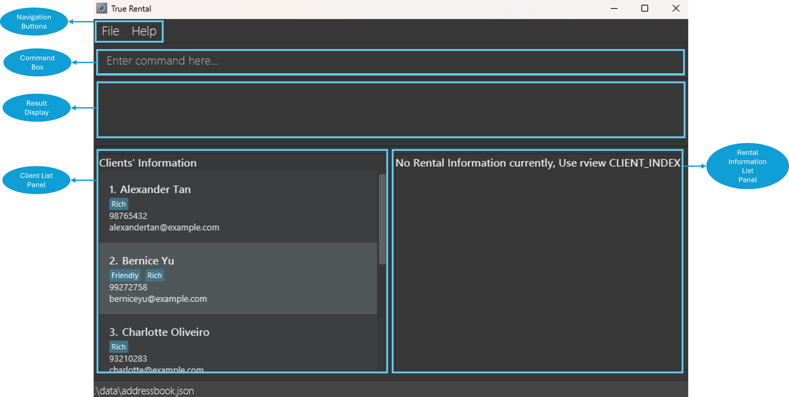

# TrueRental Developer Guide

## **Table of Contents**
<a id="table-of-contents"/><page-nav-print />

--------------------------------------------------------------------------------------------------------------------

## **Acknowledgements**

This project is built on top of [AddressBook-Level3 Project](https://se-education.org/). Special thanks and appreciation
for the team of AddressBook-Level 3.

**ChatGPT** was used to create the TrueRental application logo, as well as **debugging** and **documentation** purposes only.

{width=200px height=200px}

--------------------------------------------------------------------------------------------------------------------

## **Setting up, getting started**

Refer to the guide [_Setting up and getting started_](SettingUp.md).

--------------------------------------------------------------------------------------------------------------------

## **Design**

### Architecture

<puml src="diagrams/ArchitectureDiagram.puml" width="280" />

The ***Architecture Diagram*** given above explains the high-level design of the App.

Given below is a quick overview of main components and how they interact with each other.

**Main components of the architecture**

**`Main`** (consisting of
classes [`Main`](https://github.com/AY2425S1-CS2103T-T15-1/tp/blob/master/src/main/java/seedu/address/Main.java)
and [`MainApp`](https://github.com/AY2425S1-CS2103T-T15-1/tp/blob/master/src/main/java/seedu/address/MainApp.java)) is
in charge of the app launch and shut down.

* At app launch, it initializes the other components in the correct sequence, and connects them up with each other.
* At shut down, it shuts down the other components and invokes cleanup methods where necessary.

The bulk of the app's work is done by the following four components:

* [**`UI`**](#ui-component): The UI of the App.
* [**`Logic`**](#logic-component): The command executor.
* [**`Model`**](#model-component): Holds the data of the App in memory.
* [**`Storage`**](#storage-component): Reads data from, and writes data to, the hard disk.

[**`Commons`**](#common-classes) represents a collection of classes used by multiple other components.

**How the architecture components interact with each other**

The *Sequence Diagram* below shows how the components interact with each other for the scenario where the user issues
the command `cdelete 1`.

<puml src="diagrams/ArchitectureSequenceDiagram.puml" width="574" />

Each of the four main components (also shown in the diagram above),

* defines its *API* in an `interface` with the same name as the Component.
* implements its functionality using a concrete `{Component Name}Manager` class (which follows the corresponding
  API `interface` mentioned in the previous point.

For example, the `Logic` component defines its API in the `Logic.java` interface and implements its functionality using
the `LogicManager.java` class which follows the `Logic` interface. Other components interact with a given component
through its interface rather than the concrete class (reason: to prevent outside component's being coupled to the
implementation of a component), as illustrated in the (partial) class diagram below.

<puml src="diagrams/ComponentManagers.puml" width="300" />

The sections below give more details of each component.

### UI component

The **API** of this component is specified
in [`Ui.java`](https://github.com/AY2425S1-CS2103T-T15-1/tp/blob/master/src/main/java/seedu/address/ui/Ui.java)

<puml src="diagrams/UiClassDiagram.puml" alt="Structure of the UI Component"/>

The UI consists of a `MainWindow` that is made up of parts
e.g.`CommandBox`, `ResultDisplay`, `PersonListPanel`, `StatusBarFooter` etc. All these, including the `MainWindow`,
inherit from the abstract `UiPart` class which captures the commonalities between classes that represent parts of the
visible GUI.

The `UI` component uses the JavaFx UI framework. The layout of these UI parts are defined in matching `.fxml` files that
are in the `src/main/resources/view` folder. For example, the layout of
the [`MainWindow`](https://github.com/AY2425S1-CS2103T-T15-1/tp/blob/master/src/main/java/seedu/address/ui/MainWindow.java)
is specified
in [`MainWindow.fxml`](https://github.com/AY2425S1-CS2103T-T15-1/tp/blob/master/src/main/resources/view/MainWindow.fxml)

The `UI` component,

* executes user commands using the `Logic` component.
* listens for changes to `Model` data so that the UI can be updated with the modified data.
* keeps a reference to the `Logic` component, because the `UI` relies on the `Logic` to execute commands.
* depends on some classes in the `Model` component, as it displays `Person` object residing in the `Model`.

### Logic component

**API** : 
[`Logic.java`](https://github.com/AY2425S1-CS2103T-T15-1/tp/blob/master/src/main/java/seedu/address/logic/Logic.java)

Here's a (partial) class diagram of the `Logic` component:

<puml src="diagrams/LogicClassDiagram.puml" width="550"/>

The sequence diagram below illustrates the interactions within the `Logic` component, taking `execute("cdelete 1")` API
call as an example.

<puml src="diagrams/DeleteSequenceDiagram.puml" alt="Interactions Inside the Logic Component for the `cdelete 1` Command" />

<box type="info" seamless>

**Note:** The lifeline for `DeleteClientCommandParser` should end at the destroy marker (X) but due to a limitation of
PlantUML, the lifeline continues till the end of diagram.

</box>

The sequence diagram below illustrates the interactions within the `Logic` component,
taking `execute("cadd n/John Doe p/91231231 e/john@example.com")` API call as an example.

<puml src="diagrams/AddClientSequenceDiagram.puml" alt="Interactions Inside the Logic Component for the `cadd n/John Doe p/91231231 e/john@example.com` Command" />

<box type="info" seamless>

**Note:** The lifeline for `AddClientCommandParser` should end at the destroy marker (X) but due to a limitation of
PlantUML, the lifeline continues till the end of diagram.

</box>

How the `Logic` component works:

1. When `Logic` is called upon to execute a command, it is passed to an `AddressBookParser` object which in turn creates
   a parser that matches the command (e.g., `DeleteClientCommandParser`) and uses it to parse the command.
1. This results in a `Command` object (more precisely, an object of one of its subclasses e.g., `DeleteClientCommand`)
   which is executed by the `LogicManager`.
1. The command can communicate with the `Model` when it is executed (e.g. to delete a [_client_](#glossary-client)). 
   Note that although this is shown as a single step in the diagram above (for simplicity), in the code it can take
   several interactions (between the command object and the `Model`) to achieve.
1. The result of the command execution is encapsulated as a `CommandResult` object which is returned back from `Logic`.

Here are the other classes in `Logic` (omitted from the class diagram above) that are used for parsing a user command:

<puml src="diagrams/ParserClasses.puml" width="600"/>

How the parsing works:

* When called upon to parse a user command, the `AddressBookParser` class creates an `XYZCommandParser` (`XYZ` is a
  placeholder for the specific command name e.g., `AddCommandParser`) which uses the other classes shown above to parse
  the user command and create a `XYZCommand` object (e.g., `AddCommand`) which the `AddressBookParser` returns back as
  a `Command` object.
* All `XYZCommandParser` classes (e.g., `AddCommandParser`, `DeleteClientCommandParser`, ...) inherit from the `Parser`
  interface so that they can be treated similarly where possible e.g, during testing.

### Model component

**API** : 
[`Model.java`](https://github.com/AY2425S1-CS2103T-T15-1/tp/blob/master/src/main/java/seedu/address/model/Model.java)

<puml src="diagrams/ModelClassDiagram.puml" width="890" />

The `Model` component,

* stores the address book data i.e., all `Person` objects (which are contained in a `UniquePersonList` object).
* stores the currently 'selected' `Person` objects (e.g., results of a search query) as a separate _filtered_ list which
  is exposed to outsiders as an unmodifiable `ObservableList<Person>` that can be 'observed' e.g. the UI can be bound to
  this list so that the UI automatically updates when the data in the list change.
* stores a `UserPref` object that represents the user’s preferences. This is exposed to the outside as
  a `ReadOnlyUserPref` objects.
* does not depend on any of the other three components (as the `Model` represents data entities of the domain, they
  should make sense on their own without depending on other components)

<box type="info" seamless>

**Note:** An alternative (arguably, a more OOP) model is given below. It has a `Tag` list in the `AddressBook`,
which `Person` references. This allows `AddressBook` to only require one `Tag` object per unique tag, instead of
each `Person` needing their own `Tag` objects. 

<puml src="diagrams/BetterModelClassDiagram.puml" width="450" />

</box>

### Storage component

**API** : 
[`Storage.java`](https://github.com/AY2425S1-CS2103T-T15-1/tp/blob/master/src/main/java/seedu/address/storage/Storage.java)

<puml src="diagrams/StorageClassDiagram.puml" width="550" />

The `Storage` component,

* can save both TrueRental's data and user preference data in JSON format, and read them back into corresponding
  objects.
* inherits from both `AddressBookStorage` and `UserPrefStorage`, which means it can be treated as either one (if only
  the functionality of only one is needed).
* depends on some classes in the `Model` component (because the `Storage` component's job is to save/retrieve objects
  that belong to the `Model`)
* Separately, it has another portion within the storage component to store the current's session command history into a
  text file.

### Common classes

Classes used by multiple components are in the `seedu.address.commons` package.

--------------------------------------------------------------------------------------------------------------------

## **Implementation**

This section describes some noteworthy details on how certain features are implemented.

### Confirmation prompts

Some commands such as `clear`, `cdelete` and `rdelete` prompts the user for confirmation.

How confirmation prompts work:

* The `CommandResult` class now has different types:
    * **`ORDINARY`**: A regular result, representing a command's success.
    * **`SHOW_HELP`**: The help window should be shown to the user.
    * **`EXIT`**: The app should exit.
    * **`PROMPT`**: The app should prompt the user for confirmation.
* There is a new `Supplier<CommandResult>` field in the `CommandResult` class, which will be applied when the user
  confirms the prompt.
* In commands that will prompt for confirmation, the `execute` method returns a `CommandResult` that contains an
  additional `Supplier<Command>` and prompt message.
* The `LogicManager` detects if the result of a command is of the type `PROMPT`, and enters a state where it waits for
  a confirmation.
* `LogicManager` also keeps track of the most recent `CommandResult`. When a confirmation is obtained, it will apply
  the supplier in the previous `CommandResult`.

--------------------------------------------------------------------------------------------------------------------

## **Documentation, logging, testing, configuration, dev-ops**

* [Documentation guide](Documentation.md)
* [Testing guide](Testing.md)
* [Logging guide](Logging.md)
* [Configuration guide](Configuration.md)
* [DevOps guide](DevOps.md)

--------------------------------------------------------------------------------------------------------------------

## **Appendix: Requirements**

### Product scope

**Target user profile**:

* are [_letting agents_](#glossary-letting-agent)
* has a need to manage a significant number of [_client_](#glossary-client)'s personal and [_rental
  information_](#glossary-rental-information)
* prefer desktop apps over other types
* can type fast
* prefers typing to mouse interactions
* is reasonably comfortable using CLI apps

**Value proposition**: manage many [_client_](#glossary-client)'s personal and [_rental
information_](#glossary-rental-information), such as name, phone number, address, rental start date, rental end date,
monthly rent amount, etc.

### User stories

Priorities: High (must have) - `* * *`, Medium (nice to have) - `* *`, Low (unlikely to have) - `*`

| Priority | As a …​ | I can …​                                          | So that I can…​                                                            |
|----------|---------|---------------------------------------------------|----------------------------------------------------------------------------|
| `* * *`  | user    | save a _client_'s personal information            | contact them easily                                                        |
| `* * *`  | user    | save a _client_'s _rental information_            | view their respective properties                                           |
| `* * *`  | user    | edit a _client_'s personal information            | modify their personal details                                              |
| `* * *`  | user    | edit a _client_'s _rental information_            | modify their property's _rental information_                               |
| `* * * ` | user    | delete a _client_'s personal information          | clear my application when he/she is no longer my _client_                  |
| `* * *`  | user    | delete a _client_'s _rental information_          | clear my application when the property is not owned by my _client_ anymore |
| `* * *`  | user    | find a _client_'s personal information            | find the _client_ easily                                                   |
| `* * *`  | user    | view a _client_'s _rental information_            | find the _client_'s property easily                                        |
| `* * *`  | user    | re-visit my previous input                        | type faster                                                                |
| `* * *`  | user    | autofill my input                                 | type faster                                                                |
| `* *`    | user    | colour code a _client_                            | differentiate more important _clients_                                     |
| `* *`    | user    | sort _clients_ by name                            | find _clients_ easily                                                      |
| `* *`    | user    | attach files to a _client_                        | attach important contracts to the respective _clients_                     |
| `* *`    | user    | assign tags to _clients_                          | differentiate _clients_ by any interesting factors                         |
| `* *`    | user    | autofill CLI commands                             | easily assess the command line without typing the command again            |
| `* *`    | user    | export all _client_'s personal information        | save it somewhere else                                                     |
| `* *`    | user    | export a specific _client_'s _rental information_ | save it somewhere else                                                     |
| `*`      | user    | send emails to a _client_                         | schedule meetings with them                                                |
| `*`      | user    | set reminders for a _client_                      | remember my schedule with individual _client_                              |
| `*`      | user    | lock my application                               | protect my data                                                            |

*{More to be added}*

### Use cases

(For all use cases below, the **System** is the `TrueRental` system and the **Actor** is the `user`, unless specified
otherwise)

**Use case 01: Add a [_client_](#glossary-client)**

**MSS**

1. User chooses to add a _client_
2. User enters _client_'s information
3. System validates user input
4. System adds new _client_ information
5. System notifies user upon successful add operation

   Use case ends.

**Extensions**

* 3a. System detects error for invalid instruction

    * 3a1. System prompts error for invalid instruction
    * 3a2. User enters new instruction
    * Steps 3a1-3a2 are repeated until instruction is valid

  Use case continues from step 3.

* 3b. System detects error in _client_'s information

    * 3b1. System prompts error for invalid _client_'s information
    * 3b2. User enters new _client_'s information
    * Steps 3b1-3b2 are repeated until _client_'s information is valid

  Use case continues from step 3.

* 3c. System detects duplicated _client_'s information

    * 3c1. System prompts error for duplicated _client_'s information
    * 3c2. User enters new non-duplicated _client_'s information
    * Steps 3c1-3c2 are repeated until _client_'s information is valid

  Use case continues from step 4.

* *a. At any time, user chooses not proceed on with the operation.

  Use case ends.

**Use case 02: Add a [_client_](#glossary-client)'s [_rental information_](#glossary-rental-information)**

**MSS**

1. User chooses to add _rental information_
2. User selects _client_
3. User enters _client_'s _rental information_
4. System validates user input
5. System updates new _client_ information
6. System notifies user upon successful add operation

   Use case ends.

**Extensions**

* 4a. System detects error for invalid instruction

    * 4a1. System prompts error for invalid instruction
    * 4a2. User enters new instruction
    * Steps 4a1-4a2 are repeated until instruction is valid

  Use case continues from step 4.

* 4b. System detects error for invalid _client_

    * 4b1. System prompts error for invalid _client_
    * 4b2. User selects new _client_
    * Steps 4b1-4b2 are repeated until selected _client_ is valid

  Use case continues from step 4.

* 4c. System detects error in _client_'s _rental information_

    * 4c1. System prompts error for invalid _client_'s _rental information_
    * 4c2. User enters new _client_'s _rental information_
    * Steps 4c1-4c2 are repeated until _client_'s _rental information_ is valid

  Use case continues from step 4.

* 4d. System detects duplicated _client_'s _rental information_

    * 4d1. System prompts error for duplicated _client_'s _rental information_
    * 4d2. User enters new non-duplicated _client_'s _rental information_
    * Steps 4d1-4d2 are repeated until _client_'s _rental information_ is valid

  Use case continues from step 5.

* *a. At any time, user chooses not proceed on with the operation.

  Use case ends.

**Use case 03: Find a [_client_](#glossary-client)**

**MSS**

1. User chooses to find a _client_
2. User enters keyword
3. System validates user input
4. System filters list of _client_ based on keyword

   Use case ends.

**Extensions**

* 3a. System detects error for invalid instruction

    * 3a1. System prompts error for invalid instruction
    * 3a2. User enters new instruction
    * Steps 3a1-3a2 are repeated until instruction is valid

  Use case continues from step 3.

* 3b. System detects error for invalid keyword

    * 3b1. System prompts error for invalid keyword
    * 3b2. User enters new keyword
    * Steps 3b1-3b2 are repeated until keyword is valid

  Use case continues from step 4.

* 4a. The list is empty.

  Use case ends.

* *a. At any time, user chooses not proceed on with the operation.

  Use case ends.

**Use case 04: Edit a [_client_](#glossary-client)'s information**

**MSS**

1. User chooses to edit a _client_'s information.
2. User enters the _client_ information that he / she wants to update.
3. System validates user input.
4. System updates the _client_'s information as requested.
5. System notifies user for successful modification.

   Use case ends.

**Extensions**

* 3a. System detects error for invalid instruction.

    * 3a1. System prompts error for invalid instruction.
    * 3a2. User enters new instruction.
    * Steps 3a1-3a2 are repeated until the instruction is valid.

  Use case resumes from step 3.

* 3b. System detects error for invalid _client_ information.

    * 3b1. System prompts error for invalid _client_ information.
    * 3b2. User enters new _client_ information.
    * Steps 3b1-3b2 are repeated until the _client_ information is valid.

  Use case resumes from step 3.

* 4a. System fails to update the _client_'s information.

    * 4a1. System prompts user that edit has failed.

  Use case resumes from step 1 or user choose not to proceed and use case ends.

* *a. At any time, User chooses not to proceed with the operation.

  Use case ends.

**Use case 05: Edit a [_client_](#glossary-client)'s [_rental information_](#glossary-rental-information)**

**MSS**

1. User chooses to edit a _client_'s _rental information_.
2. User enters the _rental information_ that he / she wants to update.
3. System validates user input.
4. System updates the _client_'s _rental information_ as requested.
5. System notifies user for successful modification.

   Use case ends.

**Extensions**

* 3a. System detects error for invalid instruction.

    * 3a1. System prompts error for invalid instruction.
    * 3a2. User enters new instruction.
    * Steps 3a1-3a2 are repeated until the instruction is valid.

  Use case resumes from step 3.

* 3b. System detects error for invalid _rental information_.

    * 3b1. System prompts error for invalid _rental information_.
    * 3b2. User enters new _rental information_.
    * Steps 3b1-3b2 are repeated until the _rental information_ is valid.

  Use case resumes from step 3.

* 4a. System fails to update the _client_'s _rental information_.

    * 4a1. System prompts user that edit has failed.

  Use case resumes from step 1 or user choose not to proceed and use case ends.

* *a. At any time, User chooses not to proceed with the operation.

  Use case ends.

**Use case 06: Delete a [_client_](#glossary-client)**

**MSS**

1. User chooses to delete a _client_ and all related _rental information_
2. User types in a command consisting the index of the _client_
3. System prompts the user for confirmation
4. User confirms the deletion
5. System deletes that _client_ and all related _rental information_

   Use case ends.

**Extensions**

* 2a. The provided index is not valid

    * 2a1. System prompts error for invalid index
    * 2a2. User enters new instruction
    * Steps 2a1-2a2 are repeated until the instruction is valid

  Use case resumes from step 3.

* 4a. User cancels the deletion

  Use case ends.

**Use case 07: Delete a [_rental information_](#glossary-rental-information) from a [_client_](#glossary-client)**

**MSS**

1. User chooses to delete a specific _rental information_ from a _client_
2. User types in a command consisting the index of the _client_ and _rental information_
3. System prompts the user for confirmation
4. User confirms the deletion
5. System deletes that _rental information_

   Use case ends.

**Extensions**

* 2a. The provided index is not valid

    * 2a1. System prompts error for invalid index
    * 2a2. User enters new instruction
    * Steps 2a1-2a2 are repeated until the instruction is valid

  Use case resumes from step 3.

* 4a. User cancels the deletion

  Use case ends.

**Use case 08: Re-visit previously entered commands**

**MSS**

1. User previously entered multiple commands
2. User presses up-arrow key to re-visit previous command
3. System fills command box with respective command
4. User presses down-arrow key to re-visit next command
5. System fills command box with respective command
6. User presses enter to submit the command
7. System performs the action relating to the command

   Use case ends.

**Extensions**

* 2a. There are no more previous command within the command history

    * 2a1. System stays at current command

  Use case resumes from step 3.

* 3a. There are no more next command within the command history

    * 3a1. System fills command box with empty command

  Use case ends.

**Use case 09: Sort a [_client_] list by name**

**MSS**

1. User chooses to sort a _client_ list by name
2. User types in the respective command.
3. System sorts the _client_ list by name

   Use case ends.

### Non-Functional Requirements

1. Should work on any [_mainstream OS_](#glossary-mainstream-os) as long as it has Java `17` or above installed.
2. Should be able to hold up to 1000 [_clients_](#glossary-client) without a noticeable sluggishness in performance for
   typical usage.
3. A user with above average typing speed for regular English text (i.e. not code, not system admin commands) should be
   able to accomplish most of the tasks faster using commands than using the mouse.
4. A user should be able to see clearly with reasonably large texts.
5. The user interface should be simple, functional, and visually inoffensive to the majority of users.
6. A new user should be able to view information intuitively, even if they do not know the commands used to perform
   tasks.
7. Should be able to type up to 2000 characters without a noticeable lag.

### Glossary

* <a id="glossary-mainstream-os"/>**Mainstream OS**: Windows, Linux, Unix, MacOS
* <a id="glossary-private-contact-detail"/>**Private contact detail**: A contact detail that is not meant to be shared
  with others
* <a id="glossary-user"/>**User**: A letting agent that is using TrueRental to manage the contact information of their
  clients
* <a id="glossary-client"/>**Client**: An individual that is renting a property from a letting agent
* <a id="glossary-letting-agent"/>**Letting agent**: An individual that facilitates a property rental agreement
* <a id="glossary-system"/>**System**: TrueRental desktop application
* <a id="glossary-clients-information"/>**Client's information**: A client's information containing name, phone number
  and email, not meant to be shared with others.
* <a id="glossary-rental-information"/>**Client's rental information**: A client's rental information containing
  address, rental start date, rental end date, rent due date, monthly rent amount, deposit amount, tenant list, not
  meant to be shared with others.
* <a id="glossary-mss"/>**MSS**: Main Success Scenario.

[Back to top](#table-of-contents)

--------------------------------------------------------------------------------------------------------------------

## **Appendix: Instructions for manual testing**

Given below are instructions to test the app manually.

<box type="info" seamless>

**Note:** These instructions only provide a starting point for testers to work on;
testers are expected to do more *exploratory* testing.

</box>

### Launch and shutdown

1. Initial launch

    1. Download the latest `truerental.jar` file from [here](https://github.com/AY2425S1-CS2103T-T15-1/tp/releases) and
       copy into an empty folder
    2. Open a command terminal, `cd` into the folder that you previously saved the .jar file in.
    3. Use `java --version`to ensure your java version is `Java 17`.
    4. Use `java -jar truerental.jar` command to run the application.
    5. Expected: A GUI similar to the image shown below should appear within a few seconds. The application will contain
       some sample data.
       

1. Shut down

    1. Click on the cross at the top of the application window.
        1. MacOS: Red cross button at the top-left of the application window.
        2. Windows / Linux: Red cross button at the top-right of the application window. 
           Expected: The application will exit and close safely.

    2. Enter `exit` into the command box of the application. 
       Expected: The application will exit and close safely.

1. Subsequent Launches

    1. Relaunch the application by `cd` into the respective folder with the `truerental.jar` file.
    2. Use `java --version` to ensure your java version is `Java 17`.
    3. Use `java -jar truerental.jar` command to run the application.
    4. Expected: The application should retain all changes made to the data within the application previously.

1. Saving window preferences

    1. Resize the window to an optimum size. Move the window to a different location. Close the window.

    1. Re-launch the app by typing `java -jar truerental.jar`. 
       Expected: The most recent window size and location is retained.

### Basic Usage

#### Adding a [_client_](#glossary-client)

Adding a client while all clients are being shown.

<box type="warning">

**Prerequisite**: List all _clients_ using the `list` command. Multiple _clients_ in the list.   Please input this command `cadd n/Alice Peng p/81239999 e/alicepeng@example.com` to ensure that there is already a client with the name `Alice Peng` with phone number `81239999` and email address `alicepeng@example.com`. 

<box type="info" light>

**Note:** If the client already exist within the list, please continue with the test cases.

</box>

</box>

<box type="info" seamless>

**Test case 1:** `cadd n/John Doe p/99887766 e/johndoe@example.com`

<box type="success">

A new client is added, with the name "John Doe", phone number "99887766", email address "
johndoe@example.com". The details of the added client is shown in the result display box.

</box>

</box>

<box type="info" seamless>

**Test case 2:** `cadd n/Amy Tan p/99887766`

<box type="success">

A new client is added, with the name "Amy Tan", phone number "99887766", without an email address. The
details of the added client is shown in the result display box.

</box>

</box>

<box type="info" seamless>

**Test case 3:** `cadd n/Beckham Lee e/beckhamlee@example.com`

<box type="success">

A new client is added, with the name "Beckham Lee", email address "beckhamlee@example.com", without a
phone number. The details of the added client is shown in the result display box.

</box>

</box>

<box type="info" seamless>

**Test case 4:** `cadd n/John Doe p/81234567 e/johndoe@test.com`

<box type="success">

A new client is added, with the name "John Doe", phone number "81234567", email address "
johndoe@test.com". The details of the added client is shown in the result display box.

</box>

</box>

<box type="info" seamless>

**Test case 5:** `cadd n/Alice Peng p/81239999 e/alicepeng@example.com`

<box type="wrong">

No new client is added, as there already exist the same client within the application from prerequisite. Error details
will be displayed in the result display box.

</box>

</box>

<box type="info" seamless>

**Test case 6:** `cadd n/Charlie Peng`

<box type="wrong">

No new client is added, as a client is required to have at least one phone number or one email address.
Error details will be displayed in the result display box.

</box>

</box>

<box type="info" seamless>

**Test case 7:** `cadd n/J@ckie Chan p/91112222 e/jackiechan@example.com`

<box type="wrong">

No new client is added, as the name contains invalid format. Error details will be displayed in the
result display box.

</box>

</box>

<box type="info" seamless>

**Test case 8:** `cadd n/Jackie Chan p/#999$999 e/jackiechan@example.com`

<box type="wrong">

No new client is added, as the phone contains invalid format. Error details will be displayed in the
result display box.

</box>

</box>

<box type="info" seamless>

**Test case 9:** `cadd n/Jackie Chan p/91112222 e/jackiechan@.com`

<box type="wrong">

No new client is added, as the email contains invalid format. Error details will be displayed in the
result display box.

</box>

</box>

<box type="info" seamless>

**Test case 10:** `cadd`

<box type="wrong">

No new client is added, as there are no parameters provided. Error details will be displayed in the
result display box.

</box>

</box>

#### Adding a client's [_rental information_](#glossary-rental-information)

Adding a _client_'s rental information while all _clients_ are being shown.

<box type="warning">

**Prerequisite**: List all _clients_ using the `list` command and suppose 10 clients are displayed. Additionally, one of
the clients already has a rental saved in the application with address of "Blk 321 Ang Mo Kio Ave 3, #09-123". 

</box>

<box type="info" seamless>

**Test case 1**: `radd 99 a/508 Bishan Street 11 #01-386` 

<box type="wrong">

No rental information will be added to the client with index 99 as the client does not exist. Error details will be
displayed in the result display box.

</box>

</box>

<box type="info" seamless>

**Test case 2**: `radd a/508 Bishan Street 11 #01-386` 

<box type="wrong">

No rental information will be added as the index of client is not provided in the command. Error details will be
displayed in the result display box

</box>

</box>

<box type="info" seamless>

**Test case 3**: `radd 1 a/Blk 321 Ang Mo Kio Ave 3, #09-123` 

<box type="wrong">

No rental information will be added as there already exist a rental with the same address. Error details will be
displayed in the result display box.

</box>

</box>

<box type="info" seamless>

**Test case 4**: `radd 1 a/508 Bishan Street 11 #01-386` 

<box type="success">

A rental information will be added to the client with index 1. The rental information added has address as "508 Bishan
Street 11 #01-386"; rental start date, rental end date, rental monthly payment date, monthly rent amount, deposit amount
and customers as "—" because they are not specified in the command.

</box>

</box>

<box type="info" seamless>

**Test case 5**: `radd 1 s/01/01/2024` 

<box type="wrong">

No rental information will be added to the client with index 1 as address is not provided (address is mandatory and must
be provided). Error details will be displayed in the result display box.

</box>

</box>

<box type="info" seamless>

**Test case 6**: `radd 1 a/508 Bishan Street 11 #01-386 s/01/01/2024 e/30/06/2024` 

<box type="success">

A rental information will be added to the client with index 1. The rental information added has address as "508 Bishan
Street 11 #01-386", rental start date as "01 Jan 2024" and rental end date as "30 Jun 2024"; rental monthly payment
date, monthly rent amount, deposit amount and customers as "—" because they are not specified in the command.

</box>

</box>

<box type="info" seamless>

**Test case 7**: `radd 1 a/508 Bishan Street 11 #01-386 s/01-01-2024` and
`radd 1 a/508 Bishan Street 11 #01-386 r/1 e/31-12-2024` 

<box type="wrong">

No rental information will be added to the client with index 1 as rental start date and rental end date are required to
be in the form of `dd/mm/yyyy`. Error details will be displayed in the result display box.

</box>

</box>

<box type="info" seamless>

**Test case 8**: `radd 1 a/508 Bishan Street 11 #01-386 m/4000 d/8500` 

<box type="success">

A rental information will be added to the client with index 1. The rental information added has address as "508 Bishan
Street 11 #01-386", monthly rent amount as "$4000" and deposit amount as "$8500"; rental start date, rental end date,
rental monthly payment date and customers as "—" because they are not specified in the command.

</box>

</box>

<box type="info" seamless>

**Test case 9**: `radd 1 a/508 Bishan Street 11 #01-386 m/1000.`, `radd 1 a/508 Bishan Street 11 #01-386 d/1000.`,
`radd 1 a/508 Bishan Street 11 #01-386 m/1000.0`, `radd 1 a/508 Bishan Street 11 #01-386 d/1000.0`,
`radd 1 a/508 Bishan Street 11 #01-386 m/1000.111`, `radd 1 a/508 Bishan Street 11 #01-386 d/1000.111`,
`radd 1 a/508 Bishan Street 11 #01-386 m/-1000` and `radd 1 a/508 Bishan Street 11 #01-386 d/-1000` 

<box type="wrong">

No rental information will be added to the client with index 1 as monthly rent amount and deposit amount are required to
be a positive integer (and including 0) and with exactly 2 decimal points if a decimal point is specified. Error details
will be displayed in the result display box.

</box>

</box>

<box type="info" seamless>

**Test case 10**: `radd 1 a/508 Bishan Street 11 #01-386 dd/20` 

<box type="success">

A rental information will be added to the client with index 1. The rental information added has address of "508 Bishan
Street 11 #01-386" and rental monthly payment date as "20"; rental start date, rental end date, monthly rent amount,
deposit amount and customers as "—" because they are not specified in the command.

</box>

</box>

<box type="info" seamless>

**Test case 11**: `radd 1 a/508 Bishan Street 11 #01-386 dd/-1` and `radd 1 a/508 Bishan Street 11 #01-386 dd/40` 

<box type="wrong">

No rental information will be added to the client with index 1 as rental monthly payment date are required to be an
integer in the range of 1 to 31. Error details will be displayed in the result display box.

</box>

</box>

<box type="info" seamless>

**Test case 12**: `radd 1 a/508 Bishan Street 11 #01-386 cl/Steven;David` 

<box type="success">

A rental information will be added to the client with index 1. The rental information added has address of "508 Bishan
Street 11 #01-386" and customers as "Steven;David"; rental start date, rental end date, rental monthly payment date,
monthly rent amount and deposit amount as "—" because they are not specified in the command.

</box>

</box>

<box type="info" seamless>

**Test case 13**: `radd 1 a/508 Bishan Street 11 #01-386 cl/Steven, David;Jason Ong` 

<box type="success">

A rental information will be added to the client with index 1. The rental information added has address of "508 Bishan
Street 11 #01-386" and customers as "Steven, David;Jason Ong"; rental start date, rental end date, rental monthly
payment date, monthly rent amount and deposit amount as "—" because they are not specified in the command. Note that
"Steven, David" will be treated as one person, as we only recognized ";" as the separator for customer's name.

</box>

</box>

<box type="info" seamless>

**Test case 14**: `radd 1 a/508 Bishan Street 11 #01-386 cl/Steven;David;` and
`radd 1 a/508 Bishan Street 11 #01-386 cl/Steven;` 

<box type="wrong">

No rental information will be added to the client with index 1 as single customer does not need the ";" separator; and
for multiple customers, ";" separator is used in between names to separate the names, ";" should not be added anywhere
else. Error details will be displayed in the result display box.

</box>

</box>

<box type="info" seamless>

**Test case 15**: `radd 1 a/508 Bishan Street 11 #01-386 s/ e/ dd/ m/ d/ cl/` 

<box type="success">

A rental information will be added to the client with index 1. The rental information added has address as "508 Bishan
Street 11 #01-386"; rental start date, rental end date, rental monthly payment date, monthly rent amount, deposit amount
and customers as "—", because no values are specified after their respective prefix.

</box>

</box>

#### Viewing a client's [_rental information_](#glossary-rental-information)

Viewing a _client's rental information_ while all _clients_ are being shown.

<box type="warning">

**Prerequisite:** List all _clients_ using the `list` command. Multiple _clients_ in the list, with the respective rental information within each client.

</box>

<box type="info" seamless>

**Test case 1**: `rview 1`

<box type="success">

If the first client has rental information, displays the respective client's rental information in the
rental information list panel. A command success message is displayed in the result display box.

</box>

</box>

<box type="info" seamless>

**Test case 2**: `rview 2`

<box type="wrong">

If the second client does not have rental information, no rental information will be displayed in the
rental information list panel. A command success message is displayed in the result display box.

</box>

</box>

<box type="info" seamless>

**Test case 3**: `rview 0`

<box type="wrong">

No rental information is shown in the rental information list panel as 0 is an invalid index. Error details will be displayed in
the result display box.

</box>

</box>

<box type="info" seamless>

**Test case 4**: `rview x`, where x is larger than the total number of clients.

<box type="wrong">

No rental information is shown in the rental information list panel as x is an invalid index. Error details will be displayed in
the result display box.

</box>

</box>

<box type="info" seamless>

**Test case 5**: `rview`

<box type="wrong">

No rental information is shown in the rental information list panel as no index is provided. Error details will be displayed in
the result display box.

</box>

</box>

#### Editing a [_client_](#glossary-client)

<box type="warning">

**Prerequisite**: List all _clients_ using the `list` command. Multiple _clients_ in the list, with the first client
being named "John Doe", with email address "johndoe@example.com" and phone number "99887766".

</box>

<box type="info" seamless>

**Test case 1**: `cedit 1 n/Peter Pan`

<box type="success">

The first client's name will be edited from "John Doe" to "Peter Pan". A command success message is
displayed in the result display box.

</box>

</box>

<box type="info" seamless>

**Test case 2**: `cedit 1 p/91231231`

<box type="success">

The first client's phone number will be edited from "99887766" to "91231231". A command success message
is displayed in the result display box.

</box>

</box> 

<box type="info" seamless>

**Test case 3**: `cedit 1 e/peterpan@example.com`

<box type="success">

The first client's email address will be edited from "johndoe@example.com" to "peterpan@example.com". A
command success message is displayed in the result display box.

</box>

</box> 

<box type="info" seamless>

**Test case 4**: `cedit 1 n/Peter Wang p/ e/`

<box type="wrong">

No client's information will be edited as a client must at least have a phone number or an email
address. Error details will be displayed in the result display box.

</box>

</box> 

<box type="info" seamless>

**Test case 5**: `cedit 0`

<box type="wrong">

No client's information will be edited as 0 is an invalid index. Error details will be displayed in the result display box.

</box>

</box> 

<box type="info" seamless>

**Test case 6**: `cedit x`, where x is larger than the total number of clients.

<box type="wrong">

No client's information will be edited as x is an invalid index. Error details will be displayed in the result display box.

</box>

</box>

<box type="info" seamless>

**Test case 7**: `cedit`

<box type="wrong">

No client's information will be edited as no index is provided. Error details will be displayed in the result display box.

</box>

</box>

<box type="info" seamless>

**Test case 8**: `cedit 2 n/Peter Pan p/91231231 e/peterpan@example.com`

<box type="wrong">

No client's information will be edited as there already exist the client with the name "Peter Pan" with the phone number "91231231" and "peterpan@example.com" after test cases 1-3. Error details will be displayed in the result display box.

</box>

</box>

#### Editing a client's [_rental information_](#glossary-rental-information)

Editing a _client_'s _rental information_.

<box type="warning">

**Prerequisite**: List all _clients_ using the `list` command and suppose 10 clients are displayed. The first client in
the list has one rental information with address as "Blk 321 Ang Mo Kio Ave 3, #09-123", rental start date as
"01 Apr 2018", rental end date as "31 Dec 2024", rental monthly payment date as "15", monthly rent amount as "$2500.00",
deposit amount as "$7500.00" and customers as "Jackson;Yummi" 

</box>

<box type="info" seamless>

**Test case 1**: `redit 99 r/1 s/01/01/2024` 

<box type="wrong">

No client's rental information will be edited as the client with index 99 does not exist. Error details will be
displayed in the result display box.

</box>

</box>

<box type="info" seamless>

**Test case 2**: `redit 1 r/2 s/01/01/2024` 

<box type="wrong">

No client's rental information will be edited as the client with index 1 (the first client) does not have a second
rental information. Error details will be displayed in the result display box.

</box>

</box>

<box type="info" seamless>

**Test case 3**: `redit 1 r/1 a/729 Woodlands Circle #01-47` 

<box type="success">

The first rental information of the first client will be edited, specifically address will be edited from "Blk 321 Ang
Mo Kio Ave 3, #09-123" to "729 Woodlands Circle #01-47".

</box>

</box>

<box type="info" seamless>

**Test case 4**: `redit 1 r/1 a/` 

<box type="wrong">

No client's rental information will be edited as address is mandated and cannot be empty for all rental information.
Error details will be displayed in the result display box.

</box>

</box>

<box type="info" seamless>

**Test case 5**: `redit 1 r/1 s/01/01/2024 e/30/06/2024` 

<box type="success">

The first rental information of the first client will be edited, specifically rental start date will be edited from
"01 Apr 2018" to "01 Jan 2024" and rental end date will be edited from "31 Dec 2024" to "30 Jun 2024".

</box>

</box>

<box type="info" seamless>

**Test case 6**: `redit 1 r/1 s/01-01-2024` and `redit 1 r/1 e/31-12-2024` 

<box type="wrong">

No client's rental information will be edited as rental start date and rental end date are required to be in the form of
`dd/mm/yyyy`. Error details will be displayed in the result display box.

</box>

</box>

<box type="info" seamless>

**Test case 7**: `redit 1 r/1 m/4000 d/8500` 

<box type="success">

The first rental information of the first client will be edited, specifically monthly rent amount will be edited from
"$2500.00" to "$4000.00" and deposit amount will be edited from "$7500.00" to "$8500.00".

</box>

</box>

<box type="info" seamless>

**Test case 8**: `redit 1 r/1 m/1000.`, `redit 1 r/1 d/1000.`, `redit 1 r/1 m/1000.0`, `redit 1 r/1 d/1000.0`,
`redit 1 r/1 m/1000.111`, `redit 1 r/1 d/1000.111`, `redit 1 r/1 m/-1000` and `redit 1 r/1 d/-1000` 

<box type="wrong">

No client's rental information will be edited as monthly rent amount and deposit amount are required to be a positive
integer (and including 0) and with exactly 2 decimal points if a decimal point is specified. Error details will be
displayed in the result display box.

</box>

</box>

<box type="info" seamless>

**Test case 9**: `redit 1 r/1 dd/20` 

<box type="success">

The first rental information of the first client will be edited, specifically rental monthly payment date will be edited
from "15" to "20".

</box>

</box>

<box type="info" seamless>

**Test case 10**: `redit 1 r/1 dd/-1` and `redit 1 r/1 dd/40` 

<box type="wrong">

No client's rental information will be edited as rental monthly payment date are required to be an integer in the range
of 1 to 31. Error details will be displayed in the result display box.

</box>

</box>

<box type="info" seamless>

**Test case 11**: `redit 1 r/1 cl/Steven;David` 

<box type="success">

The first rental information of the first client will be edited, specifically customers will be edited from
"Jackson;Yummi" to "Steven;David".

</box>

</box>

<box type="info" seamless>

**Test case 12**: `redit 1 r/1 cl/Steven, David;Jason Ong` 

<box type="success">

The first rental information of the first client will be edited, specifically customers will be edited from
"Jackson;Yummi" to "Steven, David;Jason Ong". Note that "Steven, David" will be treated as one person, as we only
recognized ";" as the separator for customer's name.

</box>

</box>

<box type="info" seamless>

**Test case 13**: `redit 1 r/1 cl/Steven;David;` and `redit 1 r/1 cl/Steven;` 

<box type="wrong">

No client's rental information will be edited as single customer does not need the ";" separator; and for multiple
customers, ";" separator is used in between names to separate the names, ";" should not be added anywhere else. Error
details will be displayed in the result display box.

</box>

</box>

<box type="info" seamless>

**Test case 14**: `redit 1 r/1 s/ e/ dd/ m/ d/ cl/` 

<box type="success">

The first rental information of the first client will be edited, specifically rental start date, rental end date, rental
monthly payment date, monthly rent amount, deposit amount and customers will be edited from their respective value to
"—", essentially set all the values back to "empty".

</box>

</box>

#### Listing all [_clients_](#glossary-client)

Listing all _clients_ within the application.

<box type="warning">

**Prerequisite**: There are already multiple _clients_ within the application.

</box>

<box type="info" seamless>

**Test case 1**: `list`

<box type="success">

All _clients_ will be displayed in the client list panel.

</box>

</box>

#### Find a keyword within all [_clients_](#glossary-client) and [_rental information_](#glossary-rental-information)

Finding a keyword from all _clients_ and _rental information_.

<box type="warning">

**Prerequisite**: List all _clients_ using the `list` command. Multiple _clients_ in the list, with client called
Amy Tan in this list.

</box>

<box type="info" seamless>

**Test case 1**: `find k/Amy Tan`

<box type="success">

Client with the keyword "Amy Tan" will be displayed on the client list panel. Command success message
will be displayed in the result display box.

</box>

</box>

<box type="info" seamless>

**Test case 2**: `find k/Yong Li`, given that no client within the list is called "Yong Li"

<box type="wrong">

No client or rental information matches the particular keyword "Yong Li". Error details will be
displayed in the result display box.

</box>

</box>

<box type="info" seamless>

**Test case 3**: `find Amy`

<box type="wrong">

No prefix k/ given. An invalid command will be shown in the result display box.

</box>

</box>

<box type="info" seamless>

**Test case 4**: `find k/`

<box type="wrong">

No parameters given. An invalid command will be shown in the result display box.

</box>

</box>

<box type="info" seamless>

**Test case 5**: `find`

<box type="wrong">

No prefix and/or parameters given. An invalid command will be shown in the result display box.

</box>

</box>

#### Find a information from all [_clients_](#glossary-client)

<!-- TODO!! @Nathan follow format above for n/ e/ t/ p/ -->

#### Deleting a [_client_](#glossary-client)

1. Deleting a _client_ while all _clients_ are being shown

    1. Prerequisites: List all _clients_ using the `list` command. Multiple _clients_ in the list.

    2. Test case: `cdelete 1` 
       Expected: The first _client_ is deleted from the list. Details of the deleted contact will be displayed in the
       result display box.

    3. Test case: `cdelete 0` 
       Expected: No _client_ is deleted. Error details will be displayed in the result display box.

    4. Test case: `cdelete x`, where x is larger than the total number of clients. 
       Expected: No _client_ is deleted. An invalid command will be shown in the result display box.

#### Deleting a client's [_rental information_](#glossary-rental-information)

1. <!-- TODO!! @Nathan follow same foramt as above -->

#### Command History Feature

Retrieving previously entered commands.

<box type="warning">

**Prerequisites**: Below commands were previously entered.
 1. `cadd n/John Doe p/99887766 e/johndoe@example.com`
 2. `radd 1 a/BLK 1 Bishan s/01/01/2024 e/31/12/2024 dd/15 m/2700 d/8100 cl/Steven;David`
 3. `cadd n/Amy Tan p/99887766`
 4. `rview 1`
 5. `list`
 6. `cdelete 2`

</box>

<box type="info" seamless>

**Test case** (Steps 1 to 13 are performed sequentially):

Step 1: Press ↑ up-arrow key on the keyboard.

<box type="success">

`cdelete 2` is shown in the command box.

</box>

Step 2: Press ↑ up-arrow key on the keyboard.

<box type="success">

`list` is shown in the command box.

</box>

Step 3: Press ↑ up-arrow key on the keyboard.

<box type="success">

`rview 1` is shown in the command box.

</box>

Step 4: Press ↑ up-arrow key on the keyboard.

<box type="success">

`cadd n/Amy Tan p/99887766` is shown in the command box.

</box>

Step 5: Press ↑ up-arrow key on the keyboard.

<box type="success">

`radd 1 a/BLK 1 Bishan s/01/01/2024 e/31/12/2024 dd/15 m/2700 d/8100 cl/Steven;David` is shown in
the command box.

</box>

Step 6: Press ↑ up-arrow key on the keyboard.

<box type="success">

`cadd n/John Doe p/99887766 e/johndoe@example.com` is shown in the command box.

</box>

Step 7: Press ↑ p-arrow key on the keyboard.

<box type="success">

`cadd n/John Doe p/99887766 e/johndoe@example.com` is still shown in the command box, because there
are no more previous commands.

</box>

Step 8: Press ↓ down-arrow key on the keyboard.

<box type="success">

`radd 1 a/BLK 1 Bishan s/01/01/2024 e/31/12/2024 dd/15 m/2700 d/8100 cl/Steven;David` is shown in
the command box.

</box>

Step 9: Press ↓ down-arrow key on the keyboard.

<box type="success">

`cadd n/Amy Tan p/99887766` is shown in the command box.

</box>

Step 10: Press ↓ down-arrow key on the keyboard.

<box type="success">

`rview 1` is shown in the command box.

</box>

Step 11: Press ↓ down-arrow key on the keyboard.

<box type="success">

`list` is shown in the command box.

</box>

Step 12: Press ↓ down-arrow key on the keyboard.

<box type="success">

`cdelete 3` is shown in the command box.

</box>

Step 13: Press ↓ down-arrow key on the keyboard.

<box type="success">

Nothing is shown in the command box.

</box>

</box>

#### Autofill Commands Feature

1. Autofills command name.

<box type="warning">

**Prerequisites**: The input command is empty and user is trying to enter the command.

</box>

<box type="info" seamless>

**Test case** (Steps 1 to 6 are performed sequentially):

Step 1: Enter `r` as the input command. 

<box type="success">

Value of the input command is now "r".

</box>

Step 2: Press Tab key on the keyboard. 

<box type="success">

Value of the input command changes from "r" to "radd".

</box>

Step 3: Press Tab key on the keyboard. 

<box type="success">

Value of the input command changes from "radd" to "redit".

</box>

Step 4: Press Tab key on the keyboard. 

<box type="success">

Value of the input command changes from "redit" to "rdelete".

</box>

Step 5: Press Tab key on the keyboard. 

<box type="success">

Value of the input command changes from "rdelete" to "rview".

</box>

Step 6: Press Tab key on the keyboard. 

<box type="success">

Value of the input command changes from "rview" to "radd".

</box>

</box>  

2. Autofills parameter prefix for a command.

<box type="warning">

**Prerequisites**: The input command is empty and user is trying to enter the command.

</box>

<box type="info" seamless>

**Test case** (Steps 1 to 9 are performed sequentially):

Step 1: Enter `radd ` as the input command. 

<box type="success">

Value of the input command is now "radd " (Take note of the whitespace at the end of the input).

</box>

Step 2: Press Tab key on the keyboard. 

<box type="success">

Value of the input command changes from "radd " to "radd a/".

</box>

Step 3: Press Tab key on the keyboard. 

<box type="success">

Value of the input command changes from "radd a/" to "radd cl/".

</box>

Step 4: Press Tab key on the keyboard. 

<box type="success">

Value of the input command changes from "radd cl/" to "radd d/".

</box>

Step 5: Press Spacebar key on the keyboard. 

<box type="success">

Value of the input command changes from "radd d/" to "radd d/ " (Take note of the whitespace at the end of the input).

</box>

Step 6: Press Tab key on the keyboard. 

<box type="success">

Value of the input command changes from "radd d/ " to "radd a/".

</box>

Step 7: Enter `1075 Eunos Avenue 6 #01-171 ` at the end of the input command. 

<box type="success">

Value of the input command changes from "radd a/" to "radd a/1075 Eunos Avenue 6 #01-171 " (Take note of the whitespace
at the end of the input).

</box>

Step 8: Press Tab key on the keyboard. 

<box type="success">

Value of the input command changes from "radd a/1075 Eunos Avenue 6 #01-171 " to
"radd a/1075 Eunos Avenue 6 #01-171 a/".

</box>

Step 9: Press Tab key on the keyboard. 

<box type="success">

Value of the input command changes from "radd a/1075 Eunos Avenue 6 #01-171 a/" to
"radd a/1075 Eunos Avenue 6 #01-171 cl/".

</box>

</box>

3. Autofills value for parameter.

<box type="warning">

**Prerequisites**: The input command is empty and user is trying to enter the command. Note that autofill values are
shared across all parameters and only applicable when there is no value for prefix yet.

</box>

<box type="info" seamless>

**Test case** (Steps 1 to 9 are performed sequentially):

Step 1: Enter `redit cl/J` as the input command. 

<box type="success">

Value of the input command is now "redit cl/J".

</box>

Step 2: Press Tab key on the keyboard. 

<box type="success">

Value of the input command changes from "redit cl/J " to "redit cl/Josh".

</box>

Step 3: Press Tab key on the keyboard. 

<box type="success">

Value of the input command changes from "redit cl/Josh" to "redit cl/Joshua".

</box>

Step 4: Press Tab key on the keyboard. 

<box type="success">

Value of the input command changes from "redit cl/Joshua" to "redit cl/Jayden".

</box>

Step 5: Press Spacebar key on the keyboard. 

<box type="success">

Value of the input command changes from "redit cl/Jayden" to "redit cl/Jayden " (Take note of the whitespace at the end
of the input).

</box>

Step 6: Enter `a/B` at the end of the input command. 

<box type="success">

Value of the input command changes from "redit cl/Jayden " to "redit cl/Jayden a/B".

</box>

Step 7: Press Tab key on the keyboard. 

<box type="success">

Value of the input command changes from "redit cl/Jayden a/B" to "redit cl/Jayden a/Block".

</box>

Step 8: Press Tab key on the keyboard. 

<box type="success">

Value of the input command changes from "redit cl/Jayden a/Block" to "redit cl/Jayden a/Blk".

</box>

Step 9: Press Tab key on the keyboard. 

<box type="success">

Value of the input command changes from "redit cl/Jayden a/Blk" to "redit cl/Jayden a/BLOCK".

</box>

</box>

#### Sort all _clients_ by name

1. Sorting the entire True Rental's database by name.

    1. Prerequisites: List all _clients_ using the `list` command. Multiple _clients_ in the list.

    2. Test case: `sort` 
       Expected: Client list will be sorted in alphabetical order by name. A command success message for name will be
       displayed in the result display box.

#### Clear

1. Clearing the entire True Rental's database, wiping all clients and their respective rental information.

    1. Prerequisites: There are more than 1 client and 1 rental information in the application.

    2. Test case: `clear` 
       Expected: Both client list panel and rental information list panel will be empty with all data being cleared. A
       command success message will be displayed in the result display box.

#### Exit

1. Safely exiting `TrueRental` application.

    1. Prerequisites: Run the application

    2. Test case: `exit`
       Expected: The application will exit and be closed safely.

--------------------------------------------------------------------------------------------------------------------

## Duplicate Client Detection and Handling

A client is only considered as **duplicate** **if and only if** all three parameters `[NAME]`, `[PHONE_NUMBER]`
and `[EMAIL_ADDRESS]` are **exactly the same** (including case sensitivity).

This is to allow the user to have a greater flexibility of manipulating the client's information.

**For example:** All the clients stated below the initial client are **NOT CONSIDERED** as duplicates.

<box type="info" light>

An **initial client** with the name `Jason Lee`, phone number `91231231` and email address `jasonlee@example.com`

</box>

<box type="success" light>

The following are **NOT DUPLICATES** of the initial client:

1. A client with the name `Jason Lee`, phone number `99998888` and email address `jasonlee@example.com`.
2. A client with the name `Jason Lee`, phone number `91231231` and email address `NOTjasonlee@example.com`.
3. A client with the name `Jason Lee`, phone number `—` and email address `jasonlee@example.com`.
4. A client with the name `Jason Lee`, phone number `91231231` and email address `—`.
5. A client with the name `JASON LEE`, phone number `91231231` and email address `jasonlee@example.com`.

<box type="info" seamless>

**Note:** `—` signifies an empty parameter without any characters.

</box>

</box>

<box type="wrong" light>

The following is a **DUPLICATE** of the initial client:

1. A client with the name: `Jason Lee`, phone number: `91231231` and email address `jasonlee@example.com`.

</box>

## Duplicate Rental Information Detection and Handling

Rental information is considered a **duplicate** **if and only if** the `ADDRESS` parameter is **exactly the same**, including case sensitivity.

This is to allow you to have a greater flexibility of manipulating the rental information.

**For example:**

<box type="info" light>

An **initial rental information** with the address `201 Bukit Batok Street 21 #10-163`, rental start date `01/01/2024` and monthly rent amount `3200`. The values for rental end date, rent due date, deposit amount, and customer list are unspecified.

</box>

<box type="success" light>

The following are **NOT DUPLICATES** of the initial rental information:

1. Rental information with the address `201 BUKIT BATOK STREET 21 #10-163`, rental start date `01/01/2024` and monthly rent amount `3200`. The values for rental end date, rent due date, deposit amount, and customer list are unspecified (as `—`).
2. Rental information with the address `201 BUKIT Batok Street 21 #10-163`, rental start date `01/01/2024` and monthly rent amount `3500`. The values for rental end date, rent due date, deposit amount, and customer list are unspecified (as `—`).
3. Rental information with the address `201 Bukit BATOK Street 21 #10-163`, rental start date `01/01/2024`, monthly rent amount `3200` and rental end date `31/12/2024`. The values for rent due date, deposit amount, and customer list are unspecified (as `—`).
4. Rental information with the address `201 BuKiT BaToK StReEt 21 #10-163`, rental start date `01/01/2024`, monthly rent amount `3200`, rental end date `31/12/2024`, rent due date `10`. The values for deposit amount and customer list are unspecified (as `—`).
5. Rental information with the address `201 bukit batok street 21 #10-163`, rental start date `01/06/2024` and monthly rent amount `3200`. The values for rental end date, rent due date, deposit amount, and customer list are unspecified (as `—`).

</box>

<box type="wrong" light>

The following are **DUPLICATES** of the initial rental information:

1. Rental information with the address `201 Bukit Batok Street 21 #10-163`, rental start date `01/02/2024` and monthly rent amount `3300`. The values for rental end date, rent due date, deposit amount, and customer list are unspecified.
2. Rental information with the address `201 Bukit Batok Street 21 #10-163` and rental start date `01/12/2024`. The values for monthly rent amount, rental end date, rent due date, deposit amount, and customer list are unspecified.

</box>

--------------------------------------------------------------------------------------------------------------------

### Appendix: Future Enhancements

#### Additional Parameter Constraints

<d-table>

| Parameter       | Description                                                                                                        | Additional Constraints                                                                                                                                          | Examples                                                                                                                     |
|-----------------|--------------------------------------------------------------------------------------------------------------------|-----------------------------------------------------------------------------------------------------------------------------------------------------------------|------------------------------------------------------------------------------------------------------------------------------|
| `NAME`          | Client's name                                                                                                      | Accommodate special characters in names, which includes, but not limited to `/` , `'`, `.`, `;`.                                                                | `Ravi S/O Ramasamy`                                                                                                          |
| `PHONE_NUMBER`  | Client's phone number                                                                                              | Accommodate country code, which includes, but not limited to `+65` and limit to a certain number of characters such as 8 characters only for Singapore numbers. | `98765421`                                                                                                                   |
| `EMAIL`         | Client's email address                                                                                             | Accommodate well-established email companies only.                                                                                                              | `test@gmail.com`                                                                                                             |
| `TAG`           | Client's tag                                                                                                       | Limit up to `20 characters`.                                                                                                                                    | `12345678901234567890`                                                                                                       |
| `ADDRESS`       | The address of the property managed by the client.                                                                 | Limit up to **150** `Unicode` characters.                                                                                                                       | `Building 9, Meadowbrook Towers, 235 Crescent Drive, Hillside Road, Block F, Suburb 12, Bangalore, Karnataka, 560078, India` |
| `MONTHLY_RENT`  | The security deposit amount for the property managed by your client, paid by the tenant at the start of the lease. | Restrict the value to the maximum representable value of a `Double` in Java.                                                                                    | `999999999999`                                                                                                               |
| `DEPOSIT`       | The address of the property managed by the client.                                                                 | Restrict the value to the maximum representable value of a `Double` in Java.                                                                                    | `999999999999`                                                                                                               |
| `CUSTOMER_LIST` | The name(s) of the tenant(s) for the property managed by the client.                                               | Limit the usage of the `;` separator to **49** occurrences, which can accommodate up to 50 names in total.                                                      | `Alice;Bob;Charlie;David;Ella;Fiona;Geoge;Helen;Ivan;Joshua;Keria;Laura`                                                     |

</d-table>

#### `cedit` Command

The current version of `cedit` only supports replacing **all tags** with the **updated tag** provided by the `cedit`
command.
In the future, there will be an update to the `cedit` command, where the user is able to choose which tag to **retain** as well as which tag to **edit**.

#### `redit` Command

The current version of `redit` only supports replacing existing value to the newly specified value for all parameters used in `redit`.
In the future, there will be an update to the `redit` command, where the user is able to choose whether to edit from the existing value or simply replace the existing value, offering greater convenience.

#### `sort` Command

The current version of `sort` is case-sensitive.
In the future, there will be an update to the `sort` command, where the sorting will be case-insensitive.

#### `RENT_DUE_DATE` Parameter

The current `RENT_DUE_DATE` meant to refer to the specific day (of the month) on which the rent payment is due for the property managed by the client. However, the term `DATE` may be misleading, as users might assume it requires the format `dd/mm/yyyy`.
In the future, there will be an update to the `RENT_DUE_DATE` parameter, where it will be renamed to `RENT_DUE_DAY` for greater clarity.

#### Error Message For Invalid Value Of `MONTHLY_RENT` Parameter

The current error message for an invalid value of `MONTHLY_RENT` is: `Monthly Rent should only contain numbers, and in 2 decimal places if needed`. This message may be misleading, as the term `numbers` is too vague.
In the future, there will be an update to the error message for invalid value of `MONTHLY_RENT`, where it will be rephrased to `Monthly Rent should only contain positive numbers (including 0, with no leading zeroes), and be formatted with exactly 2 decimal places if needed` for greater clarity.

#### Error Message For Invalid Value Of `DEPOSIT` Parameter

The current error message for an invalid value of `DEPOSIT` is: `Deposit should only contain numbers, and in 2 decimal places if needed`. This message may be misleading, as the term `numbers` is too vague.
In the future, there will be an update to the error message for invalid value of `DEPOSIT`, where it will be rephrased to `Deposit should only contain positive numbers (including 0, with no leading zeroes), and be formatted with exactly 2 decimal places if needed` for greater clarity.

#### Duplicate Rental Information Detection

Currently, rental information is considered a duplicate if and only if the `ADDRESS` parameter **matches exactly**, **including case sensitivity**. However, this approach may not be ideal as unique identifiers such as unit numbers can differentiate addresses that are otherwise the same.
In the future, there will be an update to the duplicate rental information detection method, where rental information will be considered a duplicate if and only if the `ADDRESS` parameter **matches** (**case-insensitively**).

#### Handling Long Text In The UI

Currently, some long texts are truncated due to the window size constraints of the application, with excess text displayed as `...`.
In the future, there will be an update to the UI and additional constraints on the parameter value. The UI will be updated such that all characters will be fully displayed without truncation or the use of `...`.

#### \[Proposed\] Undo/redo feature

#### Proposed Implementation

The proposed undo/redo mechanism is facilitated by `VersionedAddressBook`. It extends `AddressBook` with an undo/redo
history, stored internally as an `addressBookStateList` and `currentStatePointer`. Additionally, it implements the
following operations:

* `VersionedAddressBook#commit()`— Saves the current address book state in its history.
* `VersionedAddressBook#undo()`— Restores the previous address book state from its history.
* `VersionedAddressBook#redo()`— Restores a previously undone address book state from its history.

These operations are exposed in the `Model` interface as `Model#commitAddressBook()`, `Model#undoAddressBook()`
and `Model#redoAddressBook()` respectively.

Given below is an example usage scenario and how the undo/redo mechanism behaves at each step.

Step 1. The user launches the application for the first time. The `VersionedAddressBook` will be initialized with the
initial address book state, and the `currentStatePointer` pointing to that single address book state.

<puml src="diagrams/UndoRedoState0.puml" alt="UndoRedoState0" />

Step 2. The user executes `cdelete 5` command to delete the 5th [_client_](#glossary-client) in the address book.
The `cdelete` command calls `Model#commitAddressBook()`, causing the modified state of the address book after
the `cdelete 5` command executes to be saved in the `addressBookStateList`, and the `currentStatePointer` is shifted to
the newly inserted address book state.

<puml src="diagrams/UndoRedoState1.puml" alt="UndoRedoState1" />

Step 3. The user executes `add n/David …​` to add a new [_client_](#glossary-client). The `add` command also
calls `Model#commitAddressBook()`, causing another modified address book state to be saved into
the `addressBookStateList`.

<puml src="diagrams/UndoRedoState2.puml" alt="UndoRedoState2" />

<box type="info" seamless>

**Note:** If a command fails its execution, it will not call `Model#commitAddressBook()`, so the address book state will
not be saved into the `addressBookStateList`.

</box>

Step 4. The user now decides that adding the [_client_](#glossary-client) was a mistake, and decides to undo that action
by executing the `undo` command. The `undo` command will call `Model#undoAddressBook()`, which will shift
the `currentStatePointer` once to the left, pointing it to the previous address book state, and restores the address
book to that state.

<puml src="diagrams/UndoRedoState3.puml" alt="UndoRedoState3" />

<box type="info" seamless>

**Note:** If the `currentStatePointer` is at index 0, pointing to the initial AddressBook state, then there are no
previous AddressBook states to restore. The `undo` command uses `Model#canUndoAddressBook()` to check if this is the
case. If so, it will return an error to the user rather
than attempting to perform the undo.

</box>

The following sequence diagram shows how an undo operation goes through the `Logic` component:

<puml src="diagrams/UndoSequenceDiagram-Logic.puml" alt="UndoSequenceDiagram-Logic" />

<box type="info" seamless>

**Note:** The lifeline for `UndoCommand` should end at the destroy marker (X) but due to a limitation of PlantUML, the
lifeline reaches the end of diagram.

</box>

Similarly, how an undo operation goes through the `Model` component is shown below:

<puml src="diagrams/UndoSequenceDiagram-Model.puml" alt="UndoSequenceDiagram-Model" />

The `redo` command does the opposite — it calls `Model#redoAddressBook()`, which shifts the `currentStatePointer` once
to the right, pointing to the previously undone state, and restores the address book to that state.

<box type="info" seamless>

**Note:** If the `currentStatePointer` is at index `addressBookStateList.size() - 1`, pointing to the latest address
book state, then there are no undone AddressBook states to restore. The `redo` command uses `Model#canRedoAddressBook()`
to check if this is the case. If so, it will return an error to the user rather than attempting to perform the redo.

</box>

Step 5. The user then decides to execute the command `list`. Commands that do not modify the address book, such
as `list`, will usually not call `Model#commitAddressBook()`, `Model#undoAddressBook()` or `Model#redoAddressBook()`.
Thus, the `addressBookStateList` remains unchanged.

<puml src="diagrams/UndoRedoState4.puml" alt="UndoRedoState4" />

Step 6. The user executes `clear`, which calls `Model#commitAddressBook()`. Since the `currentStatePointer` is not
pointing at the end of the `addressBookStateList`, all address book states after the `currentStatePointer` will be
purged. Reason: It no longer makes sense to redo the `add n/David …​` command. This is the behavior that most modern
desktop applications follow.

<puml src="diagrams/UndoRedoState5.puml" alt="UndoRedoState5" />

The following activity diagram summarizes what happens when a user executes a new command:

<puml src="diagrams/CommitActivityDiagram.puml" width="250" />

#### Design considerations:

**Aspect: How undo & redo executes:**

* **Alternative 1 (current choice):** Saves the entire address book.
    * Pros: Easy to implement.
    * Cons: May have performance issues in terms of memory usage.

* **Alternative 2:** Individual command knows how to undo/redo by
  itself.
    * Pros: Will use less memory (e.g. for `cdelete`, just save the [_client_](#glossary-client) being deleted).
    * Cons: We must ensure that the implementation of each individual command are correct.

_{more aspects and alternatives to be added}_
