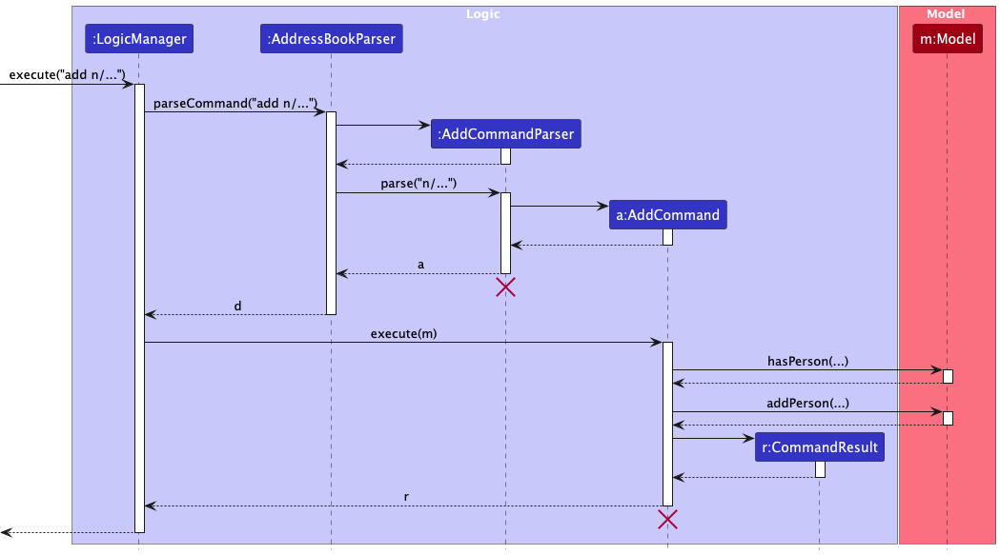

* Table of Contents
{:toc}

--------------------------------------------------------------------------------------------------------------------

## **Acknowledgements**

* {list here sources of all reused/adapted ideas, code, documentation, and third-party libraries -- include links to the original source as well}

--------------------------------------------------------------------------------------------------------------------

## **Setting up, getting started**

Refer to the guide [_Setting up and getting started_](SettingUp.md).

--------------------------------------------------------------------------------------------------------------------

## **Design**

### Architecture

The ***Architecture Diagram*** given above explains the high-level design of the App.

Given below is a quick overview of main components and how they interact with each other.

**Main components of the architecture**

**`Main`** (consisting of classes [`Main`](https://github.com/se-edu/addressbook-level3/tree/master/src/main/java/seedu/address/Main.java) and [`MainApp`](https://github.com/se-edu/addressbook-level3/tree/master/src/main/java/seedu/address/MainApp.java)) is in charge of the app launch and shut down.
* At app launch, it initializes the other components in the correct sequence, and connects them up with each other.
* At shut down, it shuts down the other components and invokes cleanup methods where necessary.

The bulk of the app's work is done by the following four components:

* [**`UI`**](#ui-component): The UI of the App.
* [**`Logic`**](#logic-component): The command executor.
* [**`Model`**](#model-component): Holds the data of the App in memory.
* [**`Storage`**](#storage-component): Reads data from, and writes data to, the hard disk.

[**`Commons`**](#common-classes) represents a collection of classes used by multiple other components.

**How the architecture components interact with each other**

The *Sequence Diagram* below shows how the components interact with each other for the scenario where the user issues the command `delete n/Jason p/88781234`.

Each of the four main components (also shown in the diagram above),

* defines its *API* in an `interface` with the same name as the Component.
* implements its functionality using a concrete `{Component Name}Manager` class (which follows the corresponding API `interface` mentioned in the previous point.

For example, the `Logic` component defines its API in the `Logic.java` interface and implements its functionality using the `LogicManager.java` class which follows the `Logic` interface. Other components interact with a given component through its interface rather than the concrete class (reason: to prevent outside component's being coupled to the implementation of a component), as illustrated in the (partial) class diagram below.

The sections below give more details of each component.

### UI component

The **API** of this component is specified in [`Ui.java`](https://github.com/se-edu/addressbook-level3/tree/master/src/main/java/seedu/address/ui/Ui.java)

The UI consists of a `MainWindow` that is made up of parts e.g.`CommandBox`, `ResultDisplay`, `PersonListPanel`, `StatusBarFooter` etc. All these, including the `MainWindow`, inherit from the abstract `UiPart` class which captures the commonalities between classes that represent parts of the visible GUI.

The `UI` component uses the JavaFx UI framework. The layout of these UI parts are defined in matching `.fxml` files that are in the `src/main/resources/view` folder. For example, the layout of the [`MainWindow`](https://github.com/se-edu/addressbook-level3/tree/master/src/main/java/seedu/address/ui/MainWindow.java) is specified in [`MainWindow.fxml`](https://github.com/se-edu/addressbook-level3/tree/master/src/main/resources/view/MainWindow.fxml)

The `UI` component,

* executes user commands using the `Logic` component.
* listens for changes to `Model` data so that the UI can be updated with the modified data.
* keeps a reference to the `Logic` component, because the `UI` relies on the `Logic` to execute commands.
* depends on some classes in the `Model` component, as it displays `Person` object residing in the `Model`.

### Logic component

**API** : [`Logic.java`](https://github.com/se-edu/addressbook-level3/tree/master/src/main/java/seedu/address/logic/Logic.java)

Here's a (partial) class diagram of the `Logic` component:

The sequence diagram below illustrates the interactions within the `Logic` component, taking `execute("date n/Alex Yeoh d/31/10/2024")` API call as an example.

<strong>Note:</strong> The lifeline for <code>DateCommandParser</code> should end at the destroy marker (X). However, due to a limitation of PlantUML, the lifeline continues until the end of the diagram.

How the `Logic` component works:

1. When `Logic` is called upon to execute a command, it is passed to an `AddressBookParser` object which in turn creates a parser that matches the command (e.g., `DeleteCommandParser`) and uses it to parse the command.
1. This results in a `Command` object (more precisely, an object of one of its subclasses e.g., `DeleteCommand`) which is executed by the `LogicManager`.
1. The command can communicate with the `Model` when it is executed (e.g. to delete a person). 
   Note that although this is shown as a single step in the diagram above (for simplicity), in the code it can take several interactions (between the command object and the `Model`) to achieve.
1. The result of the command execution is encapsulated as a `CommandResult` object which is returned back from `Logic`.

Here are the other classes in `Logic` (omitted from the class diagram above) that are used for parsing a user command:

How the parsing works:
* When called upon to parse a user command, the `AddressBookParser` class creates an `XYZCommandParser` (`XYZ` is a placeholder for the specific command name e.g., `AddCommandParser`) which uses the other classes shown above to parse the user command and create a `XYZCommand` object (e.g., `AddCommand`) which the `AddressBookParser` returns back as a `Command` object.
* All `XYZCommandParser` classes (e.g., `AddCommandParser`, `DeleteCommandParser`, `DateCommandParser`,...) inherit from the `Parser` interface so that they can be treated similarly where possible e.g, during testing.

### Model component
**API** : [`Model.java`](https://github.com/se-edu/addressbook-level3/tree/master/src/main/java/seedu/address/model/Model.java)

The `Model` component,

* stores the address book data i.e., all `Person` objects (which are contained in a `UniquePersonList` object).
* stores the currently 'selected' `Person` objects (e.g., results of a search query) as a separate _filtered_ list which is exposed to outsiders as an unmodifiable `ObservableList<Person>` that can be 'observed' e.g. the UI can be bound to this list so that the UI automatically updates when the data in the list change.
* stores a `UserPref` object that represents the user’s preferences. This is exposed to the outside as a `ReadOnlyUserPref` objects.
* does not depend on any of the other three components (as the `Model` represents data entities of the domain, they should make sense on their own without depending on other components)

<strong>Note:</strong> An alternative (arguably, a more OOP) model is given below. It includes a <code>Allergy</code> list in the <code>AddressBook</code>, which <code>Person</code> references. This allows <code>AddressBook</code> to store only one <code>Allergy</code> object per unique tag, rather than each <code>Person</code> needing their own <code>Allergy</code> objects. 

### Storage component

**API** : [`Storage.java`](https://github.com/se-edu/addressbook-level3/tree/master/src/main/java/seedu/address/storage/Storage.java)

The `Storage` component,
* can save both address book data and user preference data in JSON format, and read them back into corresponding objects.
* inherits from both `AddressBookStorage` and `UserPrefStorage`, which means it can be treated as either one (if only the functionality of only one is needed).
* depends on some classes in the `Model` component (because the `Storage` component's job is to save/retrieve objects that belong to the `Model`)

### Common classes

Classes used by multiple components are in the `seedu.address.commons` package.

--------------------------------------------------------------------------------------------------------------------

## **Implementation**
This section describes some noteworthy details on how certain features are implemented.

### Add Feature
Users can seamlessly add patients to their Health Connect application.
Patients must have a name, phone number, address, email, tag, and allergy assigned to them.
#### Features Architechture Design
1. Parsing handled by AddCommandParser: The logic for parsing is contained within the AddCommandParser to ensure the arguments are consistently handled before passing the
relevant parameters to the AddCommand class.

    * Benefit: This structure simplifies the command classes, follows the Single responsibility principle.
   * Challenge: The AddCommandParser needs to handle the parsing extremely carefully and ensure correctness since the parser is the crucial later between the user input and
the excecution of the command
2. Avoiding duplicates: The AddCommand checks the person being added and ensures that duplicates are caught early in the ModelManager. This provides immediate feedback
and prevents incorrect and impossible states in the data model(eg. 2 people with same name, number and email).

    * Benefit: The model is validated every time a new person is added. Hence, this ensures that the date in the Model and in Storage is always correct. This ensures the integrity of data.
    * Challenge: This requires checks across classes in other components in the architecture. E.g. need to have a isDuplicate method in the person class and access it in the
AddCommandParser class to check if the person being added already exists in the Health Connect address book.

Note:
Tags must be one of the following: High Risk, Medium Risk or Low Risk. This is to ensure that the doctor can classify each patient and attend to their needs accordingly.

A person must have at least one allergy tag. If the person has no allergies the None allergy tag can be added to them. This is to ensure that the doctor is fully certain of the allergies that each patient has.

The activity diagram below illustrates the sequence of actions users will follow to add a new patient profile into the Health Connect application.

The sequence diagram below demonstrates the interaction among carious classes to add a new Person into the Health Connect Application.

### Delete Feature
Users can easily delete patients from their Health Connect application. To remove a patient, users must specify the patient's unique identifier, such as their name, phone number, or email.
The Delete feature allows for the removal of outdated or incorrect records, helping to maintain the integrity and relevance of the data within the application.

#### Features Architecture Design
1. Parsing handled by DeleteCommandParser: The logic for parsing is contained within the DeleteCommandParser to ensure that arguments are consistently handled before passing the relevant parameters to the DeleteCommand class.

    * Benefit: This structure keeps the DeleteCommand class focused on executing the delete operation, following the Single Responsibility Principle.
    * Challenge: The DeleteCommandParser must ensure the accuracy of input parsing, as it acts as the crucial layer between user input and command execution. Incorrect parsing could result in unintended deletions.

2. Preventing erroneous deletions: The DeleteCommand checks the specified patient against the existing records in the ModelManager to confirm their existence before deletion. This provides immediate feedback if the patient is not found and prevents accidental deletions.

    * Benefit: Validating the existence of the patient before deletion preserves data integrity, ensuring that only valid deletions occur and preventing unintended modifications.
    * Challenge: This requires checks across classes within the architecture. For example, a method like `matches` in the Delete class could be used by the DeleteCommand to verify the presence of the specified patient in Model's filtered list.

This method would have dependencies on the Model class and the Person class. The class diagram of a delete person command is given
to demonstrate the interactions among classes.

The sequence diagram below illustrates the interactions within the `Logic` component, when executing the delete command in Heath Connect. Take `execute("delete n/Jason p/88502457")` API call as an example.

<strong>Note:</strong> The lifeline for <code>DeleteCommandParser</code> should end at the destroy marker (X). However, due to a limitation of PlantUML, the lifeline continues until the end of the diagram.

### Edit Feature
Users can easily edit patient information within the Health Connect application. To update a patient's details, users must specify the patient's index in the list, along with the fields to be updated. The Edit feature ensures that patient records remain accurate and up-to-date, maintaining the relevance and integrity of data within the application.

#### Features Architecture Design
1. Parsing handled by EditCommandParser: The logic for parsing is contained within the EditCommandParser to ensure that arguments, including the specified index and fields to be updated, are consistently handled before passing the relevant parameters to the EditCommand class.

    * **Benefit:** This structure keeps the EditCommand class focused on executing the update operation, adhering to the Single Responsibility Principle.
    * **Challenge:** The EditCommandParser must ensure precise parsing of input, as it acts as the essential intermediary between user input and command execution. Incorrect parsing could lead to unintended modifications of patient records.

2. Validating index and fields during edits: The EditCommand checks the specified index to confirm the patient’s presence in the ModelManager before proceeding with the updates. This prevents errors and provides immediate feedback if the index is invalid.

    * **Benefit:** Confirming the patient’s existence before editing preserves data integrity, ensuring updates are applied only to valid records.
    * **Challenge:** This requires coordination across classes within the architecture. In the `execute` method, the index is checked with the `Model`'s filteredPersonList. This is to ensure validity within the Model's current list before applying changes.

3. Checking for duplicate patients: After parsing and validating, the EditCommand verifies that the edited details do not create a duplicate patient entry within the list. If the update would cause the patient to match an existing record, the command will reject the changes and notify the user.

    * **Benefit:** This check prevents duplicate records from being introduced into the system, ensuring data integrity and avoiding redundancy in the patient list.
    * **Challenge:** This requires cross-checking the modified patient data with existing records in the ModelManager. The method like `isSamePerson` is implemented in the person class, accessible by the EditCommand, to detect and prevent any updates that would result in duplicate patient entries.

The sequence diagram below illustrates the interactions within the `Logic` component, when executing the edit command in Heath Connect. Take `execute("edit 1 p/88991123")` API call as an example.

<strong>Note:</strong> The lifeline for <code>EditCommandParser</code> should end at the destroy marker (X). However, due to a limitation of PlantUML, the lifeline continues until the end of the diagram.

The activity diagram below illustrates the sequence of actions users will follow to edit a patient profile into the Health Connect application.

## Planned Enhancements
### \[Proposed\] Undo/redo feature

The proposed undo/redo mechanism is facilitated by `VersionedAddressBook`. It extends `AddressBook` with an undo/redo history, stored internally as an `addressBookStateList` and `currentStatePointer`. Additionally, it implements the following operations:

* `VersionedAddressBook#commit()` — Saves the current address book state in its history.
* `VersionedAddressBook#undo()` — Restores the previous address book state from its history.
* `VersionedAddressBook#redo()` — Restores a previously undone address book state from its history.

These operations are exposed in the `Model` interface as `Model#commitAddressBook()`, `Model#undoAddressBook()` and `Model#redoAddressBook()` respectively.

Given below is an example usage scenario and how the undo/redo mechanism behaves at each step.

Step 1. The user launches the application for the first time. The `VersionedAddressBook` will be initialized with the initial address book state, and the `currentStatePointer` pointing to that single address book state.

Step 2. The user executes `delete 5` command to delete the 5th person in the address book. The `delete` command calls `Model#commitAddressBook()`, causing the modified state of the address book after the `delete 5` command executes to be saved in the `addressBookStateList`, and the `currentStatePointer` is shifted to the newly inserted address book state.

Step 3. The user executes `add n/David …​` to add a new person. The `add` command also calls `Model#commitAddressBook()`, causing another modified address book state to be saved into the `addressBookStateList`.

:information_source: **Note:** If a command fails its execution, it will not call `Model#commitAddressBook()`, so the address book state will not be saved into the `addressBookStateList`.

Step 4. The user now decides that adding the person was a mistake, and decides to undo that action by executing the `undo` command. The `undo` command will call `Model#undoAddressBook()`, which will shift the `currentStatePointer` once to the left, pointing it to the previous address book state, and restores the address book to that state.

:information_source: **Note:** If the `currentStatePointer` is at index 0, pointing to the initial AddressBook state, then there are no previous AddressBook states to restore. The `undo` command uses `Model#canUndoAddressBook()` to check if this is the case. If so, it will return an error to the user rather
than attempting to perform the undo.

The following sequence diagram shows how an undo operation goes through the `Logic` component:

:information_source: **Note:** The lifeline for `UndoCommand` should end at the destroy marker (X) but due to a limitation of PlantUML, the lifeline reaches the end of diagram.

Similarly, how an undo operation goes through the `Model` component is shown below:

The `redo` command does the opposite — it calls `Model#redoAddressBook()`, which shifts the `currentStatePointer` once to the right, pointing to the previously undone state, and restores the address book to that state.

:information_source: **Note:** If the `currentStatePointer` is at index `addressBookStateList.size() - 1`, pointing to the latest address book state, then there are no undone AddressBook states to restore. The `redo` command uses `Model#canRedoAddressBook()` to check if this is the case. If so, it will return an error to the user rather than attempting to perform the redo.

Step 5. The user then decides to execute the command `list`. Commands that do not modify the address book, such as `list`, will usually not call `Model#commitAddressBook()`, `Model#undoAddressBook()` or `Model#redoAddressBook()`. Thus, the `addressBookStateList` remains unchanged.

Step 6. The user executes `clear`, which calls `Model#commitAddressBook()`. Since the `currentStatePointer` is not pointing at the end of the `addressBookStateList`, all address book states after the `currentStatePointer` will be purged. Reason: It no longer makes sense to redo the `add n/David …​` command. This is the behavior that most modern desktop applications follow.

The following activity diagram summarizes what happens when a user executes a new command:

### \[Proposed\] Adding an End Time to the Date Feature with Duplicate/Overlap Prevention

To support effective scheduling, we propose adding an `end time` to the Date feature, along with functionality to prevent overlapping time slots. This will prevent double-booking, ensuring the doctor avoids conflicting appointments and maintains organized time management.
#### Features Architecture Design

1. **Data Model Update**
    - Update the `Date` class to include an `endTime` field alongside `startTime`, using `LocalDate` for the date and `LocalTime` for `startTime` and `endTime` to distinguish between date and time clearly.
      - Introduce an overlap-checking method `isOverlappingDate` within the `Date` class to determine if one `Date` object conflicts with another based on `startTime` and `endTime`.

2. **Command Parsing and Validation**
    - Modify `AddDateCommandParser` to handle an additional `endTime` parameter, ensuring both `startTime` and `endTime` are correctly formatted.
    - Validation rules:
        - Confirm that `endTime` follows the correct format and is after `startTime`.
        - **Overlap Check:** Ensure that any new date entry does not overlap with existing dates in `ModelManager`. If an overlap is detected, reject the command and provide the user with an error message indicating a scheduling conflict.

3. **ModelManager Update**
    - Add an `hasOverlappingDate(Date newDate)` method to `ModelManager` to verify against existing entries, ensuring no overlaps occur between appointments. This check maintains scheduling integrity across the application.

4. **Command Class Modification**
    - Update the `AddDateCommand` class to accommodate the `endTime` parameter. Before adding a new date, validate against `ModelManager` to ensure it does not conflict with current schedules.

5. **User Interface Update**
    - Adjust the UI to enable users to specify both `startTime` and `endTime` fields.
    - Display an error message when scheduling conflicts arise, instructing users to select an alternate time slot for their appointment.

6. **Storage Update**
    - Modify the storage schema to include the `endTime` field, ensuring proper serialization and deserialization so that time data remains consistent when loading and saving appointments.

The following class diagram shows the interaction between the classes given the new update

The following activity diagram summarizes what happens when a user executes the date command with the new end time improvement.

#### Considerations

- **Edge Cases:** Handle cases where `endTime` is equal to or before `startTime`, and verify that appointments on different dates do not incorrectly trigger overlaps.
- **Testing:** Add unit tests to validate the following scenarios:
    - Non-overlapping time slots are added successfully.
    - Overlapping time slots are correctly identified, resulting in command rejection.
    - Edge cases with adjacent `startTime` and `endTime` that do not overlap are handled as expected.

## **Implementation**
This section describes some noteworthy details on how certain features are implemented.

### Email Feature

The email feature allows users to add, edit, and view email addresses for each person in the address book.

#### Implementation

The `Email` class represents a person's email address and is stored as a `String` in the `Person` class.

### Allergy Feature

The allergy feature allows users to add, edit and view allergies for each person in the address book.

### Implementation

The 'Allergy' class represents a persons Allergy.

### Tag Feature

The tag feature allows users to add, edit, and view tags for each person in the address book.

### Implementation

A tag is represented by the 'Tag' class and 'JsonAdaptedTag' is used for JSON serialization and deserialization.
In this version a person can only have 3 possible tags: High Risk, Low Risk and Medium Risk

### Date Feature

The date feature allows users to add, edit, and view dates for each person in the address book.

#### Implementation

The `Date` class represents a date.

#### Design considerations:

**Aspect: How undo & redo executes:**

* **Alternative 1 (current choice):** Saves the entire address book.
  * Pros: Easy to implement.
  * Cons: May have performance issues in terms of memory usage.

* **Alternative 2:** Individual command knows how to undo/redo by
  itself.
  * Pros: Will use less memory (e.g. for `delete`, just save the person being deleted).
  * Cons: We must ensure that the implementation of each individual command are correct.

_{more aspects and alternatives to be added}_

### \[Proposed\] Data archiving

_{Explain here how the data archiving feature will be implemented}_

--------------------------------------------------------------------------------------------------------------------

## **Documentation, logging, testing, configuration, dev-ops**

* [Documentation guide](Documentation.md)
* [Testing guide](Testing.md)
* [Logging guide](Logging.md)
* [Configuration guide](Configuration.md)
* [DevOps guide](DevOps.md)

--------------------------------------------------------------------------------------------------------------------

## **Appendix: Requirements**

### Product scope

**Target user profile**:

Home-based healthcare providers who
* Has a need to manage a significant number of patients information
* Needs to see their daily schedule of patient appointments
* Needs to be reminded up upcoming appointments
* Tag patients based on allergies and other medical information
* Can type fast
* Prefers typing to mouse interactions
* Is reasonably comfortable using CLI apps
* Are based in Singapore

**Value proposition**: Our patient management system empowers home-based healthcare providers to efficiently retrieve and prioritise patient information, enabling them to provide personalized care and see their schedule for the day.

### User stories

Priorities:
- High (must have): `***`
- Medium (nice to have) - `**`
- Low (unlikely to have) - `*`

| Priority | As a …​                        | I want to …​                                                       | So that I can…​                                          |
|----------|--------------------------------|--------------------------------------------------------------------|----------------------------------------------------------|
| `***`    | home-based healthcare provider | add the data of new clients                                        | register new clients in the system for tracking          |
| `***`    | home-based healthcare provider | add the contact details of my patients for easy access             | contact and notify them accordingly if there are any emergencies |
| `***`    | home-based healthcare provider | add the address of my patients                                     | know where to get access to my patients                  | 
| `**`     | home-based healthcare provider | tag patients based on their urgency                                | prioritise higher-risk patients                          |
| `**`     | home-based healthcare provider | tag a client's important details                                   | keep track of medical allergies or urgency               |
| `***`    | home-based healthcare provider | be notified of overlapping names phone numbers and email addresses | avoid duplicate client entries                           |
| `***`    | home-based healthcare provider | find my patients' records                                          | understand how my patient is doing                       |
| `***`    | home-based healthcare provider | find my patients' allergies                                        | provide the correct prescription for my patients         |
| `*`      | home-based healthcare provider | filter patients according to address and priority                  | save travel time or focus on more urgent cases           |
| `**`     | home-based healthcare provider | delete the records of patients whom I am not seeing anymore        | keep my address book concise and clutter-free            |
| `***`    | home-based healthcare provider | edit my patients' contact details accordingly                      | contact them easily without having to worry about not being able to reach the due to wrong information |
| `***`    | home-based healthcare provider | edit my patients' address if they move locations                   | get to my patients without worrying about going to the wrong location |   
| `***`    | home-based healthcare provider | add new appointment details                                        | add appointments in my schedule for tracking later on    |
| `***`    | home-based healthcare provider | be notified of overlapping appointments                            | reschedule my appointments as required                   |
| `***`    | home-based healthcare provider | see my schedule for the day                                        | organise my time and ensure that there is sufficient time to travel to different locations |

### Use cases

(For all use cases below, the **System** is the `AddressBook` and the **Actor** is the `user`, unless specified otherwise)

**Use case: Add a client**

**MSS**

1.  User requests to add a client and provides the required client details.
2.  AddressBook validates the input
3.  AddressBook adds the client data.
4.  AddressBook confirms the successful addition of the client.

    Use case ends.

**Extensions**

* 2a.  Invalid Input Format
    * 2a1. AddressBook shows an error message.

  Use case ends.

* 2b. Duplicate Client

    * 2b1. AddressBook shows an error message.

  Use case ends.

**Use case: Delete client data**

**MSS**

1.  User requests to list clients
2.  AddressBook shows a list of clients
3.  User requests to delete a client’s data and inputs the client's attributes (name, phone number, and/or email).
4.  AddressBook validates the input
5.  AddressBook deletes the person

    Use case ends.

**Extensions**

* 4a.  Invalid Input Format
    * 4a1. AddressBook shows an error message.

  Use case ends.

* 4b. Duplicate Client

    * 4b1. AddressBook detects multiple entries matching the provided attribute (name, phone number, or email).
    * 4b2. AddressBook shows an error message indicating that multiple clients match the input
    * 4b3. User requests to delete the client's data with at least 2 of the 3 client's attributes
    * 4b4. AddressBook validates the input
    * 4b5. Addressbook deletes the person

  Use case ends.

* 4c. Client Does Not Exist

    * 4c1. AddressBook shows an error message.

  Use case ends.

**Use case: Edit client data**  
Preconditions: AddressBook has correct view, including client to edit

**MSS**

1.  User requests to edit details and inputs index and updated client's information
2.  AddressBook validates the input
3.  AddressBook confirms the successful edit of client's details

    Use case ends.

**Extensions**

* 2a. Invalid Input Format
  * 2a1. AddressBook shows an error message.

  Use case ends.

* 2b. Duplicate Client
    * 2b1. AddressBook detects multiple entries matching the provided attribute (name, phone number, or email).
    * 2b2. AddressBook shows an error message indicating that multiple clients match the input
    * 2b3. User requests to edit the client's data without matching details 
    * 2b4. AddressBook validates the input
    * 2b5. Addressbook edits the person

  Use case ends.

**Use case: Add appointment date for client**

**MSS**

1. User requests to add date and inputs the client's attributes (name, phone number, and/or email) and appointment date.
2. AddressBook validates the input.
3. AddressBook confirms the successful addition of appointment date to client. 
4. AddressBook shows a list of all clients.

    Use case ends.

**Extensions**

* 4a.  Invalid Input Format
    * 4a1. AddressBook shows an error message.

  Use case ends.

* 4b. Appointment Date Overlaps

    * 4b1. AddressBook detects existing person with date inputted.
    * 4b2. AddressBook displays information on existing person with overlapped date.
    * 4b3. AddressBook shows an error message indicating that there is a clash in appointment time.

  Use case ends.

* 4c. Client Does Not Exist

    * 4c1. AddressBook shows an error message.

  Use case ends.

**Use case: Show schedule for the day**

**MSS**

1.  User requests to see the schedule for the day and inputs the date.
2.  AddressBook validates the input.
3.  AddressBook shows the schedule for the day.

    Use case ends.

**Extensions**

* 2a.  Invalid Input Format
    * 2a1. AddressBook shows an error message.

  Use case ends.

**Use case: Find client's name by keywords**

**MSS**

1. User requests to find client and inputs keywords to find name.
2. AddressBook shows the list of persons whose name matches the keywords.

    Use case ends.

**Extensions**

* 1a. No Matches
  * 1a1. AddressBook shows message.
  * 1a2. AddressBook displays nothing in the list.

  Use case ends.

**Use case: Filter clients by parameters**

**MSS**

1. User requests to filter client and inputs parameters to filter by.
2. AddressBook validates the input.
3. AddressBook shows list of persons that matches parameters provided.

    Use case ends.

**Extensions**

* 2a.  Invalid Input Format
    * 2a1. AddressBook shows an error message.

  Use case ends.

**To be added as potential future enhancements:**

**Use case: Record Client Payment**

**MSS**

1.  User requests to list clients
2.  AddressBook shows a list of clients
3.  User requests to record a payment by providing the client’s name, phone number, and amount paid.
4.  AddressBook validates the input.
5.  AddressBook records the payment.

    Use case ends.

**Extensions**

* 4a.  Invalid Input Format
    * 4a1. AddressBook shows an error message.

  Use case ends.

* 4b.  Name and Phone Number mismatch
    * 4b1. AddressBook shows an error message.

  Use case ends.

*{More to be added}*

### Non-Functional Requirements

1. Should work on any _mainstream OS_ as long as it has Java `17` or above installed.
2. Should be able to hold up to 1000 persons without a noticeable sluggishness in performance for typical usage.
3. A user with above average typing speed for regular English text (i.e. not code, not system admin commands) should be able to accomplish most of the tasks faster using commands than using the mouse.
4. The system should respond within 5 seconds for any commands given.
5. Command syntax should be consistent throughout the application to minimize the learning curve.
6. Users should be able to run the application from the downloaded JAR file without an additional installer.
7. The system should provide meaningful, yet concise error messages for the user to easily make the necessary changes.
8. The codebase should be modular to facilitate easy maintenance and future enhancements.
9. The code should be well-documented with clear comments to assist future developers.
10. The application should have a smooth user experience that is intuitive and easy to use.
11. The system should be customised for operations by a single user and need not handle multiple user-access.
12. Configuration and data files should use standard formats to ensure compatibility with text editors and other applications.
13. The system should validate all user inputs to prevent errors when saving the information.
14. The system’s architecture should support potential future upgrades that might include expanded user capacity, without significant reworking of core components.
15.  User data should persist across sessions, stored in a reliable format (e.g., JSON or XML) that can be easily backed up and restored.
16.  The application should be designed in a way that allows new features to be added with minimal disruption to existing functionality.

### Glossary

* **Mainstream OS**: Windows, Linux, Unix, MacOS
* **Patient Record**: A collection of patient's personal and medical information. This includes, but is not limited to, name, contact number, email, address, allergies, injuries sustained.
* **Appointment**: A scheduled session between the healthcare provider and patient for medical consultation or treatment. This is marked in the AddressBook by the time, date and patient.
* **Schedule**: A list of all patients' appointments, displaying the date and time and location of the appointments.
* **Tag**: A label applied to a patient record, used to categorise and highlight specific medical information, such as allergies or conditions.
* **Medical History**: Documentation of patient's past illnesses, treatments, surgeries and other medical related information.
* **Inactive Client**: A client who is no longer receiving care or whose records have not been accessed in a significant amount of time
* **Allergy**: A known medical condition or sensitivity that a client has to specific substances or environmental factors (e.g., certain foods, medications, pollen). This information is recorded in the client’s profile to help healthcare providers avoid potential triggers and deliver appropriate care during visits.
--------------------------------------------------------------------------------------------------------------------

## **Appendix: Instructions for manual testing**

Given below are instructions to test the app manually.

:information_source: **Note:** These instructions only provide a starting point for testers to work on;
testers are expected to do more *exploratory* testing.

### Launch and shutdown

1. Initial launch

   1. Download the jar file and copy into an empty folder

   2. Double-click the jar file Expected: Shows the GUI with a set of sample contacts. The window size may not be optimum.

2. Saving window preferences

   1. Resize the window to an optimum size. Move the window to a different location. Close the window.

   2. Re-launch the app by double-clicking the jar file.  Expected: The most recent window size and location is retained.

3. Exiting the Application

   1. Use the `exit` command or close the window directly.  Expected: The application should close without any errors or delays.

### Adding a person

1. Adding a valid person

    1. Test case: `add n/John Doe p/98765432 e/johndoe@example.com a/123 Main St t/Low Risk m/None` 
       Expected: "John Doe" is added to the list of contacts. Details of the added contact shown in the status message.

2. Adding a person with missing fields

    1. Test case: `add n/John` 
       Expected: No person is added. Invalid command format shown in the status message.

3. Adding a duplicate person

    1. Prerequisites: Ensure "John Doe" with the contact details in "Adding a valid person" is already in the contact list.

    2. Test Case: `add n/John Doe p/98765432 e/johndoe@example.com a/123 Main St t/Low Risk m/None` 
       Expected: Error message displayed indicating that the person already exists.

    3. Other duplicate person add command to try: `add n/John Doe p/98765432 e/differentemail@example.com a/123 Main St t/Low Risk m/None`,

### Deleting a person

1. Deleting a person

   1. Test case: `delete n/Alex Yeoh` 
      Expected: First contact is deleted from the list. Details of the deleted contact shown in the status message. Timestamp in the status bar is updated.

   1. Test case: `delete 0` 
      Expected: No person is deleted. Error details shown in the status message. Status bar remains the same.

   1. Other incorrect delete commands to try: `delete`, `delete x`, `...` (where x is larger than the list size) 
      Expected: Similar to previous.

1. _{ more test cases …​ }_

### Saving data

1. Dealing with missing/corrupted data files

   1. _{explain how to simulate a missing/corrupted file, and the expected behavior}_

1. _{ more test cases …​ }_

## **Appendix: Effort**

**Difficulty Level:**

As the group had prior experience with Orbital, it was easier to understand how to work together with one another to add to the AddressBook. 
However, the concepts of Software Engineering were new to all members in the team, and the difficulty lies in having to implement the code according to the Software Engineering principles.
Most of our effort was dedicated to adding commands, and debugging cases that we have not previously considered.

**Challenges Faced:**

- Mapping requirements to real-life scenarios: As we are unfamiliar with the potential for patients with same details, we found it difficult to finalise the final logic for duplicate patients.
- Consistent logic throughout codebase: As we had different ideas on implementation, it required many iterations to change the code to make the logic consistent.
- Overriding or changing functionality of the code unintentionally: As there are some portions where we implement the feature concurrently, it results in many merge conflicts and unintentional behaviour.

**Reuse and Adaptation:**

Our group tried to reuse as much of AB3's code structure as much as possible to save time in adding the new commands. 
However, some commands required extensive changes due to the duplicate persons logic.

**Achievements:**

Our group is happy with the outcome of Health Connect, as the process of adding and obtaining information of patients is simplified. 
With the use of tags, it makes it easier to filter people to find the relevant details. 