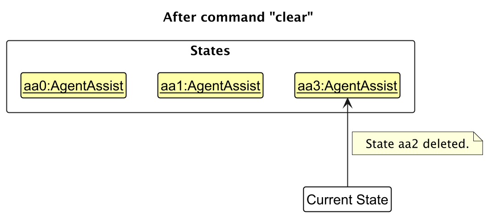

* Table of Contents
{:toc}

--------------------------------------------------------------------------------------------------------------------

## **Acknowledgements**

* {list here sources of all reused/adapted ideas, code, documentation, and third-party libraries -- include links to the original source as well}

--------------------------------------------------------------------------------------------------------------------

## **Setting up, getting started**

Refer to the guide [_Setting up and getting started_](SettingUp.md).

--------------------------------------------------------------------------------------------------------------------

## **Design**

<div markdown="span" class="alert alert-primary">

:bulb: **Tip:** The `.puml` files used to create diagrams in this document `docs/diagrams` folder. Refer to the [_PlantUML Tutorial_ at se-edu/guides](https://se-education.org/guides/tutorials/plantUml.html) to learn how to create and edit diagrams.
</div>

### Architecture


The ***Architecture Diagram*** given above explains the high-level design of the App.

Given below is a quick overview of main components and how they interact with each other.

**Main components of the architecture**

**`Main`** (consisting of classes [`Main`](https://github.com/se-edu/addressbook-level3/tree/master/src/main/java/seedu/address/Main.java) and [`MainApp`](https://github.com/se-edu/addressbook-level3/tree/master/src/main/java/seedu/address/MainApp.java)) is in charge of the app launch and shut down.
* At app launch, it initializes the other components in the correct sequence, and connects them up with each other.
* At shut down, it shuts down the other components and invokes cleanup methods where necessary.

The bulk of the app's work is done by the following four components:

* [**`UI`**](#ui-component): The UI of the App.
* [**`Logic`**](#logic-component): The command executor.
* [**`Model`**](#model-component): Holds the data of the App in memory.
* [**`Storage`**](#storage-component): Reads data from, and writes data to, the hard disk.

[**`Commons`**](#common-classes) represents a collection of classes used by multiple other components.

**How the architecture components interact with each other**

The *Sequence Diagram* below shows how the components interact with each other for the scenario where the user issues the command `delete 1`.


Each of the four main components (also shown in the diagram above),

* defines its *API* in an `interface` with the same name as the Component.
* implements its functionality using a concrete `{Component Name}Manager` class (which follows the corresponding API `interface` mentioned in the previous point.

For example, the `Logic` component defines its API in the `Logic.java` interface and implements its functionality using the `LogicManager.java` class which follows the `Logic` interface. Other components interact with a given component through its interface rather than the concrete class (reason: to prevent outside component's being coupled to the implementation of a component), as illustrated in the (partial) class diagram below.


The sections below give more details of each component.

### UI component

The **API** of this component is specified in [`Ui.java`](https://github.com/se-edu/addressbook-level3/tree/master/src/main/java/seedu/address/ui/Ui.java)


The UI consists of a `MainWindow` that is made up of parts e.g.`CommandBox`, `ResultDisplay`, `PersonListPanel`, `StatusBarFooter` etc. All these, including the `MainWindow`, inherit from the abstract `UiPart` class which captures the commonalities between classes that represent parts of the visible GUI.

The `UI` component uses the JavaFx UI framework. The layout of these UI parts are defined in matching `.fxml` files that are in the `src/main/resources/view` folder. For example, the layout of the [`MainWindow`](https://github.com/se-edu/addressbook-level3/tree/master/src/main/java/seedu/address/ui/MainWindow.java) is specified in [`MainWindow.fxml`](https://github.com/se-edu/addressbook-level3/tree/master/src/main/resources/view/MainWindow.fxml)

The `UI` component,

* executes user commands using the `Logic` component.
* listens for changes to `Model` data so that the UI can be updated with the modified data.
* keeps a reference to the `Logic` component, because the `UI` relies on the `Logic` to execute commands.
* depends on some classes in the `Model` component, as it displays `Person` object residing in the `Model`.

### Logic component

**API** : [`Logic.java`](https://github.com/se-edu/addressbook-level3/tree/master/src/main/java/seedu/address/logic/Logic.java)

Here's a (partial) class diagram of the `Logic` component:


The sequence diagram below illustrates the interactions within the `Logic` component, taking `execute("delete 1")` API call as an example.


<div markdown="span" class="alert alert-info">:information_source: **Note:** The lifeline for `DeleteCommandParser` should end at the destroy marker (X) but due to a limitation of PlantUML, the lifeline continues till the end of diagram.
</div>

How the `Logic` component works:

1. When `Logic` is called upon to execute a command, it is passed to an `AddressBookParser` object which in turn creates a parser that matches the command (e.g., `DeleteCommandParser`) and uses it to parse the command.
1. This results in a `Command` object (more precisely, an object of one of its subclasses e.g., `DeleteCommand`) which is executed by the `LogicManager`.
1. The command can communicate with the `Model` when it is executed (e.g. to delete a person).<br>
   Note that although this is shown as a single step in the diagram above (for simplicity), in the code it can take several interactions (between the command object and the `Model`) to achieve.
1. The result of the command execution is encapsulated as a `CommandResult` object which is returned back from `Logic`.

Here are the other classes in `Logic` (omitted from the class diagram above) that are used for parsing a user command:


How the parsing works:
* When called upon to parse a user command, the `AddressBookParser` class creates an `XYZCommandParser` (`XYZ` is a placeholder for the specific command name e.g., `AddCommandParser`) which uses the other classes shown above to parse the user command and create a `XYZCommand` object (e.g., `AddCommand`) which the `AddressBookParser` returns back as a `Command` object.
* All `XYZCommandParser` classes (e.g., `AddCommandParser`, `DeleteCommandParser`, ...) inherit from the `Parser` interface so that they can be treated similarly where possible e.g, during testing.

### Model component
**API** : [`Model.java`](https://github.com/se-edu/addressbook-level3/tree/master/src/main/java/seedu/address/model/Model.java)


The `Model` component,

* stores the address book data i.e., all `Person` objects (which are contained in a `UniquePersonList` object).
* stores the currently 'selected' `Person` objects (e.g., results of a search query) as a separate _filtered_ list which is exposed to outsiders as an unmodifiable `ObservableList<Person>` that can be 'observed' e.g. the UI can be bound to this list so that the UI automatically updates when the data in the list change.
* stores a `UserPref` object that represents the user’s preferences. This is exposed to the outside as a `ReadOnlyUserPref` objects.
* does not depend on any of the other three components (as the `Model` represents data entities of the domain, they should make sense on their own without depending on other components)

<div markdown="span" class="alert alert-info">:information_source: **Note:** An alternative (arguably, a more OOP) model is given below. It has a `Tag` list in the `AddressBook`, which `Person` references. This allows `AddressBook` to only require one `Tag` object per unique tag, instead of each `Person` needing their own `Tag` objects.<br>


</div>


### Storage component

**API** : [`Storage.java`](https://github.com/se-edu/addressbook-level3/tree/master/src/main/java/seedu/address/storage/Storage.java)


The `Storage` component,
* can save both address book data and user preference data in JSON format, and read them back into corresponding objects.
* inherits from both `AddressBookStorage` and `UserPrefStorage`, which means it can be treated as either one (if only the functionality of only one is needed).
* depends on some classes in the `Model` component (because the `Storage` component's job is to save/retrieve objects that belong to the `Model`)

### Common classes

Classes used by multiple components are in the `seedu.address.commons` package.

--------------------------------------------------------------------------------------------------------------------

## **Implementation**

This section describes some noteworthy details on how certain features are implemented.

### \[Proposed\] Undo/redo feature

#### Proposed Implementation

The proposed undo/redo mechanism is facilitated by `VersionedAddressBook`. It extends `AddressBook` with an undo/redo history, stored internally as an `addressBookStateList` and `currentStatePointer`. Additionally, it implements the following operations:

* `VersionedAddressBook#commit()` — Saves the current address book state in its history.
* `VersionedAddressBook#undo()` — Restores the previous address book state from its history.
* `VersionedAddressBook#redo()` — Restores a previously undone address book state from its history.

These operations are exposed in the `Model` interface as `Model#commitAddressBook()`, `Model#undoAddressBook()` and `Model#redoAddressBook()` respectively.

Given below is an example usage scenario and how the undo/redo mechanism behaves at each step.

Step 1. The user launches the application for the first time. The `VersionedAddressBook` will be initialized with the initial address book state, and the `currentStatePointer` pointing to that single address book state.


Step 2. The user executes `delete 5` command to delete the 5th person in the address book. The `delete` command calls `Model#commitAddressBook()`, causing the modified state of the address book after the `delete 5` command executes to be saved in the `addressBookStateList`, and the `currentStatePointer` is shifted to the newly inserted address book state.


Step 3. The user executes `add n/David …​` to add a new person. The `add` command also calls `Model#commitAddressBook()`, causing another modified address book state to be saved into the `addressBookStateList`.


<div markdown="span" class="alert alert-info">:information_source: **Note:** If a command fails its execution, it will not call `Model#commitAddressBook()`, so the address book state will not be saved into the `addressBookStateList`.

</div>

Step 4. The user now decides that adding the person was a mistake, and decides to undo that action by executing the `undo` command. The `undo` command will call `Model#undoAddressBook()`, which will shift the `currentStatePointer` once to the left, pointing it to the previous address book state, and restores the address book to that state.


<div markdown="span" class="alert alert-info">:information_source: **Note:** If the `currentStatePointer` is at index 0, pointing to the initial AddressBook state, then there are no previous AddressBook states to restore. The `undo` command uses `Model#canUndoAddressBook()` to check if this is the case. If so, it will return an error to the user rather
than attempting to perform the undo.

</div>

The following sequence diagram shows how an undo operation goes through the `Logic` component:


<div markdown="span" class="alert alert-info">:information_source: **Note:** The lifeline for `UndoCommand` should end at the destroy marker (X) but due to a limitation of PlantUML, the lifeline reaches the end of diagram.

</div>

Similarly, how an undo operation goes through the `Model` component is shown below:


The `redo` command does the opposite — it calls `Model#redoAddressBook()`, which shifts the `currentStatePointer` once to the right, pointing to the previously undone state, and restores the address book to that state.

<div markdown="span" class="alert alert-info">:information_source: **Note:** If the `currentStatePointer` is at index `addressBookStateList.size() - 1`, pointing to the latest address book state, then there are no undone AddressBook states to restore. The `redo` command uses `Model#canRedoAddressBook()` to check if this is the case. If so, it will return an error to the user rather than attempting to perform the redo.

</div>

Step 5. The user then decides to execute the command `list`. Commands that do not modify the address book, such as `list`, will usually not call `Model#commitAddressBook()`, `Model#undoAddressBook()` or `Model#redoAddressBook()`. Thus, the `addressBookStateList` remains unchanged.


Step 6. The user executes `clear`, which calls `Model#commitAddressBook()`. Since the `currentStatePointer` is not pointing at the end of the `addressBookStateList`, all address book states after the `currentStatePointer` will be purged. Reason: It no longer makes sense to redo the `add n/David …​` command. This is the behavior that most modern desktop applications follow.



The following activity diagram summarizes what happens when a user executes a new command:


#### Design considerations:

**Aspect: How undo & redo executes:**

* **Alternative 1 (current choice):** Saves the entire address book.
  * Pros: Easy to implement.
  * Cons: May have performance issues in terms of memory usage.

* **Alternative 2:** Individual command knows how to undo/redo by
  itself.
  * Pros: Will use less memory (e.g. for `delete`, just save the person being deleted).
  * Cons: We must ensure that the implementation of each individual command are correct.

_{more aspects and alternatives to be added}_

### \[Proposed\] Data archiving

_{Explain here how the data archiving feature will be implemented}_


--------------------------------------------------------------------------------------------------------------------

## **Documentation, logging, testing, configuration, dev-ops**

* [Documentation guide](Documentation.md)
* [Testing guide](Testing.md)
* [Logging guide](Logging.md)
* [Configuration guide](Configuration.md)
* [DevOps guide](DevOps.md)

--------------------------------------------------------------------------------------------------------------------

## **Appendix: Requirements**

### Product scope

**Target user profile**:

A real estate agent who...
* has a need to manage a significant number of client contacts
* frequently needs to track client information, such as property preferences, deal statuses, and meetings
* hopes to ensure smooth communication with clients by sending updates on listings, reminders for follow-ups, and managing appointments
* prefer desktop apps over other types
* can type fast
* prefers typing to mouse interactions
* is reasonably comfortable using CLI apps

**Value proposition**: Using CLI to streamline management of client contacts and communications will make it more efficient than a typical mouse/GUI driven app


### User stories

Priorities: High (must have) - `* * *`, Medium (nice to have) - `* *`, Low (unlikely to have) - `*`

| Priority | As a …​                   | I want to …​                                                                                               | So that I can…​                                                            |
|--------|---------------------------|------------------------------------------------------------------------------------------------------------|----------------------------------------------------------------------------|
| `* * *` | new user                  | see usage instructions                                                                                     | refer to instructions when I forget how to use the App                     |
| `* * *` | user                      | add a new client                                                                                           | keep track of their information                                            |
| `* * *` | user                      | delete a client                                                                                            | remove entries that I no longer need                                       |
| `* * *` | user                      | find a client by name                                                                                      | locate details of persons without having to go through the entire list     |
| `* * *` | user                      | categorize clients as buyers, sellers and renters                                                          | easily filter and manage different client types                            |
| `* * *` | user                      | filter contacts by tags (e.g. `Meeting Time`, `High` or `Low Priority`)                                    |                                                                            |
| `* * *` | user                      | send bulk emails to groups of clients                                                                      | inform them of new property listing                                        |
| `* * *` | user                      | view my contacts using commands                                                                            | track them better                                                          |
| `* * *` | user                      | collect the name, contact number and email of my clients                                                   |                                                                            |
| `* * *` | user                      | have a meeting schedule                                                                                    | keep track of future meetings                                              |
| `* * * ` | user                      | tag clients with labels like `high priority` or `first time buyer`                                         | prioritise my outreach efforts                                             |
| `* *`  | long-term user of the app | archive old client contacts                                                                                | my address book remains up-to-date without deleting past information       |
| `* *`  | long-term user of the app | mark clients as `inactive` or `closed deal`                                                                | focus on active prospects                                                  |
| `* *`  | user                      | hide private contact details                                                                               | minimize chance of someone else seeing them by accident                    |
| `* *`  | user                      | store notes about clients' property preferences                                                            | tailor property recommendations to their needs                             |
| `* *`  | user                      | set reminders for client follow-ups                                                                        | don't miss important communications                                        |
| `* *`  | user                      | group clients by location preferences                                                                      | easily send property updates                                               |
| `* *`  | user                      | track status of property deals for each client (e.g. `interested`, `offer made`, `contract signed`)        | stay organised                                                             |
| `* *`  | long-term user of the app | log the last interaction date with the client                                                              | maintain regular communication                                             |
| `* *`  | expert user               | export my contact list to Excel or CSV                                                                     | share it with colleagues or for reporting purposes                         |
| `* *`  | expert user               | import contacts from my phone or other databases                                                           | quickly build by address book                                              |
| `* *`  | user                      | add notes to client interactions                                                                           | capture important details discussed in meetings or phone calls             |
| `* *`  | user                      | set a follow-up frequency for each client                                                                  | stay in regular contact                                                    |
| `* *`  | user                      | track a client's viewing history                                                                           | know which client have been shown to which property                        |
| `* *`  | user                      | filter clients by their buying timelines (e.g. immediate, next 5 months)                                   | focus on urgent leads                                                      |
| `* *`  | user                      | set up reminders for key seller-related milestones (e.g. contract expiration, price reduction discussions) | never miss an important deadline                                           |
| `* *`  | user                      | track client communication preferences                                                                     | engage them through their preferred channels                               |
| `* *`  | user                      | generate a visual itmeline of a property's selling process                                                 | easily communicate progress to sellers                                     |
| `* *`  | user                      | collect budget preference, neighbourhood preference and property of my buyer and seller                    |                                                                            |
| `*`    | user                      | receive notifications when it's time to follow up with a client                                            | not forget                                                                 |
| `*`    | user                      | assign a lead source to each client, e.g. referral, open house, website                                    | know where my business is coming from                                      |
| `*`    | real estate agent         | schedule and track open house events                                                                       | ensure smooth operations and follow up with attendees                      |
| `*`    | user                      | monitor competing listings in the same area                                                                | adjust pricing and marketing strategies accordingly                        |
| `*`    | user                      | track commission details for each property sale                                                            | keep accurate financial records                                            |
| `*`    | user                      | generate reports on the number of leads genrated per listing                                               | show sellers the interest their property is receiving                      |
| `*`    | user                      | manage and log referral partner interactions (e.g. contractors, photographers)                             | maintain strong professional relationships                                 |
| `*`    | user                      | send property performance updates to sellers (e.g. number of views, showings)                              | keep them informed and engaged                                             |
| `*`    | user                      | track which clients were referre by past clients                                                           | send personalised appreciation messages and foster long-term relationships |

### Use cases

(For all use cases below, the **System** is `ABCLI` and the **Actor** is the `user`, unless specified otherwise)

<details>
    <summary><b>Use Case 1: Adding a contact</b></summary>

**MSS**

1.  User requests to add a contact
    ```
    add n/Kori Sendra c/91234567 e/kori_sendra@gmail.com t/buyer
    ```
2.  ABCLI adds the person
3.  ABCLI shows a success message
    ```
    Kori Sendra successfully added to contacts!
    ```
4.  ABCLI shows the updated list of contacts on its interface
    ```
    1) Name: Kori Sendra, Contact Number: 91234567, Email: kori_sendra@gmail.com, Type: Buyer
    2) Name: Adams Apple, Contact Number: 97654321, Email: adamsapple00@gmail.com, Type: Seller
    ```

- Use case ends.

**Extensions**

* 2a. The contact format is invalid

    * 2a1. ABCLI shows an error message
    ```
    Invalid add command format!
    ```

    * Use case ends.

</details>

<details>
    <summary><b>Use Case 2: Deleting a contact</b></summary>

**MSS**

1.  User requests to list contacts
    ```
    view
    ```
2.  ABCLI shows the list of contacts on its interface
    ```
    1) Name: Kori Sendra, Contact Number: 91234567, Email: kori_sendra@gmail.com, Type: Buyer
    ```
3.  User requests to delete a specific contact
    ```
    delete 1
    ```
4.  ABCLI deletes the contact
5.  ABCLI shows a success message
    ```
    Deleted Contact: Kori Sendra; 91234567; kori_sendra@gmail.com; Buyer 
    ```
6.  ABCLI shows the updated list of contacts on its interface
    ```
    1) Name: Adams Apple, Contact Number: 97654321, Email: adamsapple00@gmail.com, Type: Seller
    ```
    
- Use case ends

**Extensions**
- 2a. The index for deletion is not a positive whole number
  - 2a1. ABCLI shows an error message
  ```
   Invalid command format!
   -----------------------
   delete: Deletes the person identified by the index number used in the displayed contact list.
   
   Parameters: INDEX (must be a positive integer)
   
  ```
  - Use case ends
- 3a. The index for deletion is out of range
  - 3a1. ABCLI shows an error message
  ```
  Invalid command format!
  
  The contact index is invalid.
  ```
  - Use case ends
</details>

<details>
    <summary><b>Use Case 3: Adding a meetup</b></summary>

**MSS**
1.  User requests to add a meetup
    ```
    meetup n/Adams Apple i/Meeting with Adams Apple at 12pm on Saturday at Marina Bay Sands VIP Lounge.
    ```
2.  ABCLI adds the meetup
3.  ABCLI shows a success message
    ```
    Meetup with Adams Apple successfully added!
    ```
4.  ABCLI shows the updated list of meetups on its interface
    ```
    1. Meeting with: Adams Apple
       Meeting info: Meeting with Adams Apple at 12pm on Saturday at Marina Bay Sands VIP Lounge.
    ```
- Use case ends

**Extensions**
- 2a. The command is missing a name

  - 2a1. ABCLI shows an error message
    ```
    No name provided!
    You need to provide a name for whom you are meeting up with.
    ```
  - Use case ends
- 3a. The command is missing a flag
  - 3a1. ABCLI shows an error message
    ```
    No i/ or n/ flag is provided!
    You need provide the missing flags.
    ```
  - Use case ends
</details>

<details>
    <summary><b>Use Case 4: Viewing contacts</b></summary>

**MSS**
1.  User requests to view all contacts
    ```
    view
    ```
2.  ABCLI shows the list of contacts on its interface
    ```
    1) Name: John Doe, Contact Number: 94738334, Email: johndoezzz@gmail.com, Type: Seller
    2) Name: Jamer Boliver, Contact Number: 91111111, Email: boliverman@gmail.com, Type: Buyer
    ```
    
- Use case ends

**Extensions**
- 2a. Viewing buyer and seller contacts

    - 2a1. User requests to view buyer contacts
      ```
      view t/buyer
      ```
    - 2a2. ABCLI shows the list of contacts of buyers on its interface
      ```
      1) Name: Jamer Boliver, Contact Number: 91111111, Email: boliverman@gmail.com, Type: Buyer
      ```
    - 2a3. User requests to view seller contacts
      ```
      view t/seller
      ```
    - 2a4. ABCLI shows the list of contacts of sellers on its interface
      ```
      1) Name: John Doe, Contact Number: 94738334, Email: johndoezzz@gmail.com, Type: Seller
      ```
    - Use case ends
- 3a. t/ flag has invalid contact type
    - 3a1. ABCLI shows an error message
      ```
      Invalid contact type!
      Please indicate only buyer or seller.
      ```
    - Use case ends

</details>


### Non-Functional Requirements

1.  Should work on any _mainstream OS_ as long as it has Java `17` or above installed.
2.  Should be able to hold up to 1000 persons without a noticeable sluggishness in performance for typical usage.
3.  A user with above average typing speed for regular English text (i.e. not code, not system admin commands) should be able to accomplish most of the tasks faster using commands than using the mouse.

*{More to be added}*

### Glossary

* **Mainstream OS**: Windows, Linux, Unix, MacOS
* **Private contact detail**: A contact detail that is not meant to be shared with others

--------------------------------------------------------------------------------------------------------------------

## **Appendix: Instructions for manual testing**

Given below are instructions to test the app manually.

<div markdown="span" class="alert alert-info">:information_source: **Note:** These instructions only provide a starting point for testers to work on;
testers are expected to do more *exploratory* testing.

</div>

### Launch and shutdown

1. Initial launch

   1. Download the jar file and copy into an empty folder

   1. Double-click the jar file Expected: Shows the GUI with a set of sample contacts. The window size may not be optimum.

1. Saving window preferences

   1. Resize the window to an optimum size. Move the window to a different location. Close the window.

   1. Re-launch the app by double-clicking the jar file.<br>
       Expected: The most recent window size and location is retained.

1. _{ more test cases …​ }_

### Deleting a person

1. Deleting a person while all persons are being shown

   1. Prerequisites: List all persons using the `list` command. Multiple persons in the list.

   1. Test case: `delete 1`<br>
      Expected: First contact is deleted from the list. Details of the deleted contact shown in the status message. Timestamp in the status bar is updated.

   1. Test case: `delete 0`<br>
      Expected: No person is deleted. Error details shown in the status message. Status bar remains the same.

   1. Other incorrect delete commands to try: `delete`, `delete x`, `...` (where x is larger than the list size)<br>
      Expected: Similar to previous.

1. _{ more test cases …​ }_

### Saving data

1. Dealing with missing/corrupted data files

   1. _{explain how to simulate a missing/corrupted file, and the expected behavior}_

1. _{ more test cases …​ }_

### Non-Functional Requirements
1. ABCLI should be a result of evolving/enhancing/morphing the given codebase.

1. ABCLI should be targeting users who can type fast and prefer typing over other means of input.

1. ABCLI should be for a single user.

1. ABCLI needs to be developed in a breadth-first incremental manner over the project duration.

1. ABCLI's data should be stored locally and should be in a human editable text file.

1. ABCLI cannot use a DBMS to store data.

1. ABCLI should follow the Object-oriented paradigm primarily.

1. ABCLI should work on the Windows, Linux, and OS-X platforms.

1. ABCLI should work on a computer that has version 17 of Java.

1. ABCLI should work without requiring an installer.

1. ABCLI should not depend on your own remote server.

1. The use of third-party frameworks/libraries/services is allowed but only if they are free, open-source, and have permissive license terms and do not require any installation by users and do not violate other constraints.

1. The GUI should work well for standard screen resolutions 1920x1080 and higher and for screen scales 100% and 125%. In addition, the GUI should be usable for resolutions 1280x720 and higher, and for screen scales 150%.

1. ABCLI has to be packaged into a single JAR file.

### Glossary
1. **ABCLI**  
Our product name.

1. **CLI**  
The command line interface is a way to interact with a computer by typing text commands instead of using a mouse to click on icons.

1. **Command Line**   
A text box where you enter commands.

1. **Flag**  
In our context, a flag is something preceded by a /, but is not the initial command. e.g in `add n/NAME`,  `n/` is a flag but `add` is not.

1. **GUI**  
Graphical user interface. The screen you see when opening the application.

1. [**Java**](https://www.java.com/en/)  
A programming language.

1. **Parameter**  
A value that you need to provide for the command to work. e.g in `add n/NAME`, `NAME` is a parameter.

1. [**Windows**](https://en.wikipedia.org/wiki/Microsoft_Windows)  
An operating system.
