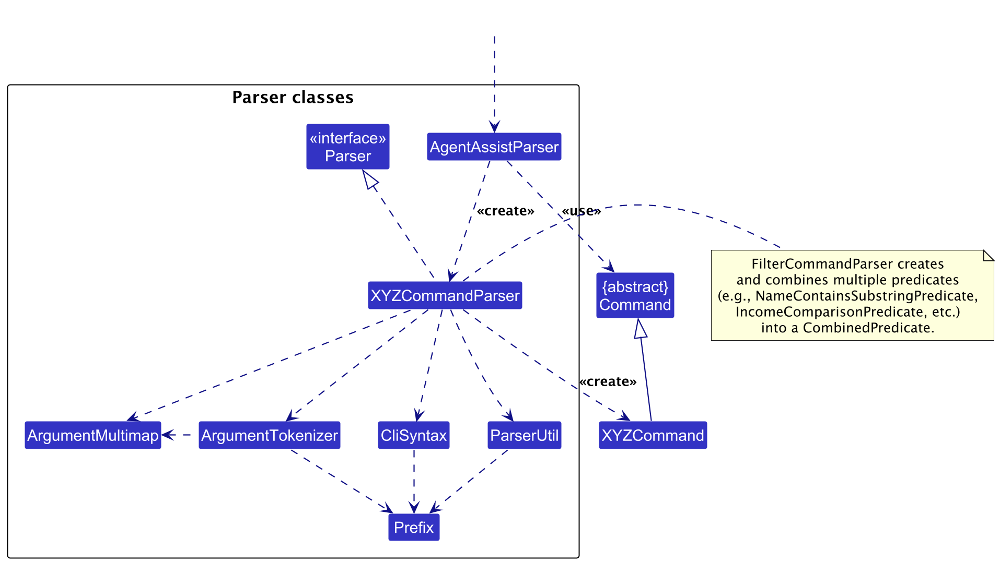

* Table of Contents
{:toc}

--------------------------------------------------------------------------------------------------------------------

## **Acknowledgements**

* {list here sources of all reused/adapted ideas, code, documentation, and third-party libraries -- include links to the original source as well}

--------------------------------------------------------------------------------------------------------------------

## **Setting up, getting started**

Refer to the guide [_Setting up and getting started_](SettingUp.md).

--------------------------------------------------------------------------------------------------------------------

## **Design**

:bulb: **Tip:** The `.puml` files used to create diagrams in this document `docs/diagrams` folder. Refer to the [_PlantUML Tutorial_ at se-edu/guides](https://se-education.org/guides/tutorials/plantUml.html) to learn how to create and edit diagrams.

### Architecture

The ***Architecture Diagram*** given above explains the high-level design of the App.

Given below is a quick overview of main components and how they interact with each other.

**Main components of the architecture**

**`Main`** (consisting of classes [`Main`](https://github.com/se-edu/addressbook-level3/tree/master/src/main/java/seedu/address/Main.java) and [`MainApp`](https://github.com/se-edu/addressbook-level3/tree/master/src/main/java/seedu/address/MainApp.java)) is in charge of the app launch and shut down.
* At app launch, it initializes the other components in the correct sequence, and connects them up with each other.
* At shut down, it shuts down the other components and invokes cleanup methods where necessary.

The bulk of the app's work is done by the following four components:

* [**`UI`**](#ui-component): The UI of the App.
* [**`Logic`**](#logic-component): The command executor.
* [**`Model`**](#model-component): Holds the data of the App in memory.
* [**`Storage`**](#storage-component): Reads data from, and writes data to, the hard disk.

[**`Commons`**](#common-classes) represents a collection of classes used by multiple other components.

**How the architecture components interact with each other**

The *Sequence Diagram* below shows how the components interact with each other for the scenario where the user issues the command `delete 1`.

Each of the four main components (also shown in the diagram above),

* defines its *API* in an `interface` with the same name as the Component.
* implements its functionality using a concrete `{Component Name}Manager` class (which follows the corresponding API `interface` mentioned in the previous point.

For example, the `Logic` component defines its API in the `Logic.java` interface and implements its functionality using the `LogicManager.java` class which follows the `Logic` interface. Other components interact with a given component through its interface rather than the concrete class (reason: to prevent outside component's being coupled to the implementation of a component), as illustrated in the (partial) class diagram below.

The sections below give more details of each component.

### UI component

The **API** of this component is specified in [`Ui.java`](https://github.com/se-edu/addressbook-level3/tree/master/src/main/java/seedu/address/ui/Ui.java)

The UI consists of a `MainWindow` that is made up of parts e.g.`CommandBox`, `ResultDisplay`, `PersonListPanel`, `StatusBarFooter` etc. All these, including the `MainWindow`, inherit from the abstract `UiPart` class which captures the commonalities between classes that represent parts of the visible GUI.

The `UI` component uses the JavaFx UI framework. The layout of these UI parts are defined in matching `.fxml` files that are in the `src/main/resources/view` folder. For example, the layout of the [`MainWindow`](https://github.com/se-edu/addressbook-level3/tree/master/src/main/java/seedu/address/ui/MainWindow.java) is specified in [`MainWindow.fxml`](https://github.com/se-edu/addressbook-level3/tree/master/src/main/resources/view/MainWindow.fxml)

The `UI` component,

* executes user commands using the `Logic` component.
* listens for changes to `Model` data so that the UI can be updated with the modified data.
* keeps a reference to the `Logic` component, because the `UI` relies on the `Logic` to execute commands.
* depends on some classes in the `Model` component, as it displays `Person` object residing in the `Model`.

### Logic component

**API** : [`Logic.java`](https://github.com/se-edu/addressbook-level3/tree/master/src/main/java/seedu/address/logic/Logic.java)

Here's a (partial) class diagram of the `Logic` component:

The sequence diagram below illustrates the interactions within the `Logic` component, taking `execute("delete 1")` API call as an example.

:information_source: **Note:** The lifeline for `DeleteCommandParser` should end at the destroy marker (X) but due to a limitation of PlantUML, the lifeline continues till the end of diagram.

How the `Logic` component works:

1. When `Logic` is called upon to execute a command, it is passed to an `AddressBookParser` object which in turn creates a parser that matches the command (e.g., `DeleteCommandParser`) and uses it to parse the command.
1. This results in a `Command` object (more precisely, an object of one of its subclasses e.g., `DeleteCommand`) which is executed by the `LogicManager`.
1. The command can communicate with the `Model` when it is executed (e.g. to delete a person). 
   Note that although this is shown as a single step in the diagram above (for simplicity), in the code it can take several interactions (between the command object and the `Model`) to achieve.
1. The result of the command execution is encapsulated as a `CommandResult` object which is returned back from `Logic`.

Here are the other classes in `Logic` (omitted from the class diagram above) that are used for parsing a user command:

How the parsing works:
* When called upon to parse a user command, the `AddressBookParser` class creates an `XYZCommandParser` (`XYZ` is a placeholder for the specific command name e.g., `AddCommandParser`) which uses the other classes shown above to parse the user command and create a `XYZCommand` object (e.g., `AddCommand`) which the `AddressBookParser` returns back as a `Command` object.
* All `XYZCommandParser` classes (e.g., `AddCommandParser`, `DeleteCommandParser`, ...) inherit from the `Parser` interface so that they can be treated similarly where possible e.g, during testing.

### Model component
**API** : [`Model.java`](https://github.com/se-edu/addressbook-level3/tree/master/src/main/java/seedu/address/model/Model.java)

The `Model` component,

* stores the address book data i.e., all `Person` objects (which are contained in a `UniquePersonList` object).
* stores the currently 'selected' `Person` objects (e.g., results of a search query) as a separate _filtered_ list which is exposed to outsiders as an unmodifiable `ObservableList<Person>` that can be 'observed' e.g. the UI can be bound to this list so that the UI automatically updates when the data in the list change.
* stores a `UserPref` object that represents the user’s preferences. This is exposed to the outside as a `ReadOnlyUserPref` objects.
* does not depend on any of the other three components (as the `Model` represents data entities of the domain, they should make sense on their own without depending on other components)

:information_source: **Note:** An alternative (arguably, a more OOP) model is given below. It has a `Tag` list in the `AddressBook`, which `Person` references. This allows `AddressBook` to only require one `Tag` object per unique tag, instead of each `Person` needing their own `Tag` objects. 

### Storage component

**API** : [`Storage.java`](https://github.com/se-edu/addressbook-level3/tree/master/src/main/java/seedu/address/storage/Storage.java)

The `Storage` component,
* can save both address book data and user preference data in JSON format, and read them back into corresponding objects.
* inherits from both `AddressBookStorage` and `UserPrefStorage`, which means it can be treated as either one (if only the functionality of only one is needed).
* depends on some classes in the `Model` component (because the `Storage` component's job is to save/retrieve objects that belong to the `Model`)

### Common classes

Classes used by multiple components are in the `seedu.address.commons` package.

--------------------------------------------------------------------------------------------------------------------

## **Implementation**

This section describes some noteworthy details on how certain features are implemented.

### \[Proposed\] Undo/redo feature

#### Proposed Implementation

The proposed undo/redo mechanism is facilitated by `VersionedAddressBook`. It extends `AddressBook` with an undo/redo history, stored internally as an `addressBookStateList` and `currentStatePointer`. Additionally, it implements the following operations:

* `VersionedAddressBook#commit()` — Saves the current address book state in its history.
* `VersionedAddressBook#undo()` — Restores the previous address book state from its history.
* `VersionedAddressBook#redo()` — Restores a previously undone address book state from its history.

These operations are exposed in the `Model` interface as `Model#commitAddressBook()`, `Model#undoAddressBook()` and `Model#redoAddressBook()` respectively.

Given below is an example usage scenario and how the undo/redo mechanism behaves at each step.

Step 1. The user launches the application for the first time. The `VersionedAddressBook` will be initialized with the initial address book state, and the `currentStatePointer` pointing to that single address book state.

Step 2. The user executes `delete 5` command to delete the 5th person in the address book. The `delete` command calls `Model#commitAddressBook()`, causing the modified state of the address book after the `delete 5` command executes to be saved in the `addressBookStateList`, and the `currentStatePointer` is shifted to the newly inserted address book state.

Step 3. The user executes `add n/David …​` to add a new person. The `add` command also calls `Model#commitAddressBook()`, causing another modified address book state to be saved into the `addressBookStateList`.

:information_source: **Note:** If a command fails its execution, it will not call `Model#commitAddressBook()`, so the address book state will not be saved into the `addressBookStateList`.

Step 4. The user now decides that adding the person was a mistake, and decides to undo that action by executing the `undo` command. The `undo` command will call `Model#undoAddressBook()`, which will shift the `currentStatePointer` once to the left, pointing it to the previous address book state, and restores the address book to that state.

:information_source: **Note:** If the `currentStatePointer` is at index 0, pointing to the initial AddressBook state, then there are no previous AddressBook states to restore. The `undo` command uses `Model#canUndoAddressBook()` to check if this is the case. If so, it will return an error to the user rather
than attempting to perform the undo.

The following sequence diagram shows how an undo operation goes through the `Logic` component:

:information_source: **Note:** The lifeline for `UndoCommand` should end at the destroy marker (X) but due to a limitation of PlantUML, the lifeline reaches the end of diagram.

Similarly, how an undo operation goes through the `Model` component is shown below:

The `redo` command does the opposite — it calls `Model#redoAddressBook()`, which shifts the `currentStatePointer` once to the right, pointing to the previously undone state, and restores the address book to that state.

:information_source: **Note:** If the `currentStatePointer` is at index `addressBookStateList.size() - 1`, pointing to the latest address book state, then there are no undone AddressBook states to restore. The `redo` command uses `Model#canRedoAddressBook()` to check if this is the case. If so, it will return an error to the user rather than attempting to perform the redo.

Step 5. The user then decides to execute the command `list`. Commands that do not modify the address book, such as `list`, will usually not call `Model#commitAddressBook()`, `Model#undoAddressBook()` or `Model#redoAddressBook()`. Thus, the `addressBookStateList` remains unchanged.

Step 6. The user executes `clear`, which calls `Model#commitAddressBook()`. Since the `currentStatePointer` is not pointing at the end of the `addressBookStateList`, all address book states after the `currentStatePointer` will be purged. Reason: It no longer makes sense to redo the `add n/David …​` command. This is the behavior that most modern desktop applications follow.

The following activity diagram summarizes what happens when a user executes a new command:

#### Design considerations:

**Aspect: How undo & redo executes:**

* **Alternative 1 (current choice):** Saves the entire address book.
  * Pros: Easy to implement.
  * Cons: May have performance issues in terms of memory usage.

* **Alternative 2:** Individual command knows how to undo/redo by
  itself.
  * Pros: Will use less memory (e.g. for `delete`, just save the person being deleted).
  * Cons: We must ensure that the implementation of each individual command are correct.

_{more aspects and alternatives to be added}_

### \[Proposed\] Data archiving

_{Explain here how the data archiving feature will be implemented}_

--------------------------------------------------------------------------------------------------------------------

## **Documentation, logging, testing, configuration, dev-ops**

* [Documentation guide](Documentation.md)
* [Testing guide](Testing.md)
* [Logging guide](Logging.md)
* [Configuration guide](Configuration.md)
* [DevOps guide](DevOps.md)

--------------------------------------------------------------------------------------------------------------------

## **Appendix: Requirements**

### Product Scope

---

#### **Target User Profile:**

- **User Role:** Healthcare Administrator
- **Workplace:** Old folks home for dementia patients
- **Responsibilities:**
    - Manage and update contact details for patients, doctors, and next-of-kin.
    - Respond quickly to emergency situations by accessing relevant contacts.
    - Maintain communication efficiency with minimal manual processes.

- **Key Characteristics:**
    - Handles large volumes of contact data on a daily basis.
    - Prefers using desktop applications over mobile or web-based alternatives.
    - Skilled at typing and prefers keyboard shortcuts over mouse interactions for speed.
    - Comfortable with using command-line interfaces (CLI) for fast data entry and retrieval.

    
#### **Value Proposition:**

MedConnect offers a **streamlined contact management system** tailored for healthcare administrators. Its key features include:

- **Efficient Lookup and Update:** Quickly find and update contact information for patients, their emergency contacts, and healthcare staff.
- **Time-Sensitive Operations:** When every second counts, MedConnect ensures that administrators can contact the right person immediately.
- **Command-Line First:** Optimized for users who prefer CLI, allowing for rapid data entry and navigation without reliance on graphical interfaces.
- **Comprehensive Contact Database:** Centralizes all relevant contact details, reducing the need for multiple systems and improving response times in emergencies.

---

### User stories

Priorities: High (must have) - `* * *`, Medium (nice to have) - `* *`, Low (unlikely to have) - `*`
### Beginner User Stories

| Priority | As a …​                  | I want to …​                                 | So that I can…​                                                            |
|----------|--------------------------|----------------------------------------------|----------------------------------------------------------------------------|
| `* * *`  | new user                 | familiarise myself with the app              | play around with dummy data without compromising real patient data         |
| `* * *`  | healthcare administrator | add new hospital staff and patients          | easily reach out to them when needed                                       |
| `* * *`  | healthcare administrator | update contact details                       | ensure all contact information is accurate and current                     |
| `* *`    | healthcare administrator | search contacts by name, role, or department | quickly find and connect with the right person in high-pressure situations |
| `* * *`  | healthcare administrator | view patient emergency contact details       | notify next-of-kin during urgent medical events                            |
| `* *`    | healthcare administrator | add multiple contact methods for each person | reach them through different channels when needed                          |
| `* *`    | healthcare administrator | assign doctors to patients                   | easily track which doctor is responsible for each patient                  |

### Intermediate User Stories

| Priority | As a …​                  | I want to …​                             | So that I can…​                                                              |
|----------|--------------------------|------------------------------------------|------------------------------------------------------------------------------|
| `* *`    | healthcare administrator | filter contacts by department            | streamline communication during different situations                         |
| `*`      | healthcare administrator | create custom groups                     | efficiently contact the right team during emergencies                        |
| `* *`    | healthcare administrator | mark on-call staff                       | know whom to contact during off-hours                                        |
| `* *`    | healthcare administrator | access frequently contacted individuals  | save time during routine interactions                                        |
| `* *`    | healthcare administrator | filter contacts by shift or availability | quickly reach staff who are currently on duty                                |
| `* *`    | healthcare administrator | archive outdated contacts                | maintain a clean and relevant contact list without losing historical records |

### Advanced User Stories

| Priority | As a …​                  | I want to …​                                  | So that I can…​                                                      |
|----------|--------------------------|-----------------------------------------------|----------------------------------------------------------------------|
| `*`      | healthcare administrator | view a history of previous interactions       | have a complete record of communications for reference               |
| `*`      | healthcare administrator | set reminders for follow-up actions           | ensure I don’t miss important tasks                                  |
| `* *`    | healthcare administrator | import contact data in bulk                   | keep the database up-to-date without manual entry                    |
| `* *`    | healthcare administrator | export contact information                    | provide it to others or have a backup in case of system failures     |
| `* *`    | healthcare administrator | create templates for emergency communications | send critical messages quickly during emergencies                    |
| `*`      | healthcare administrator | secure access with user authentication        | ensure only authorized personnel can access or update sensitive data |
| `* * *`  | healthcare administrator | delete outdated patient/staff contacts        | ensure all information is relevant and current                       |

---

### Use cases

(For all use cases below, the **System** is the `AddressBook` and the **Actor** is the `user`, unless specified otherwise)

---
### Use Case: Add a New Contact

**System:** MedConnect  
**Actor:** Healthcare Administrator

#### **Main Success Scenario (MSS):**
1. User requests to add a new patient contact.
2. MedConnect prompts the user to enter patient details:
    - Name
    - Phone Number
    - Address
    - Emergency Contact Name
    - Emergency Contact Phone Number
3. User enters the required details.
4. MedConnect validates the provided information.
5. MedConnect successfully adds the new contact to the address book.
6. MedConnect confirms that the contact was added successfully.

   **Use case ends.**

#### **Extensions:**

**3a.** The entered details are invalid (e.g., phone number contains letters).
- **3a1.** MedConnect informs the user of the invalid details.
- **3a2.** User corrects the invalid details and resubmits.

  **Use case resumes from step 4.**

**3b.** Some required fields are missing.
- **3b1.** MedConnect prompts the user to complete the missing fields.
- **3b2.** User provides the missing information.

  **Use case resumes from step 4.**

**6a.** The contact already exists in the system (e.g., duplicate phone number).
- **6a1.** MedConnect notifies the user of the duplicate entry.

  **Use case ends.**

---

### Use Case: Delete a Contact

**System:** MedConnect  
**Actor:** Healthcare Administrator

#### **Main Success Scenario (MSS):**
1. User requests to list all contacts.
2. MedConnect retrieves and shows a list of all contacts.
3. User requests to delete a specific contact by index.
4. MedConnect confirms that the contact has been deleted.
5. MedConnect removes the contact from the database.

   **Use case ends.**

#### **Extensions:**

**2a.** The contact list is empty.
- **Use case ends.**

**3a.** The given index is invalid (e.g., out of range).
- **3a1.** MedConnect informs the user of the invalid index.

  **Use case resumes from step 2.**

**3b.** User cancels the deletion before confirmation.
- **3b1.** MedConnect acknowledges the cancellation.

  **Use case ends.**
---
### Use Case: View Emergency Contacts

**System:** MedConnect  
**Actor:** Healthcare Administrator

#### **Main Success Scenario (MSS):**
1. User requests to view the emergency contact information for a specific patient.
2. MedConnect requests the patient’s ID or name.
3. User provides the patient ID or name.
4. MedConnect retrieves the emergency contact details for the specified patient.
5. MedConnect provides the emergency contact details, including the name, relationship, and phone number.

   **Use case ends.**

#### **Extensions:**

**3a.** The patient does not exist in the system.
- **3a1.** MedConnect informs the user that no contact was found.

  **Use case resumes from step 2.**

**3b.** Multiple patients share the same name.
- **3b1.** MedConnect requests additional information (e.g., birthdate, address) to identify the correct patient.
- **3b2.** User provides the required additional information.

  **Use case resumes from step 4.**
---

### Use Case: Archive Outdated Contacts

**System:** MedConnect  
**Actor:** Healthcare Administrator

#### **Main Success Scenario (MSS):**
1. User requests to archive a specific contact.
2. MedConnect retrieves and presents a list of available contacts.
3. User selects a contact to archive by index.
4. MedConnect confirms that the contact has been archived.
5. The selected contact is removed from the main contact list and stored in the archive.

   **Use case ends.**

#### **Extensions:**

**3a.** The given index is invalid.
- **3a1.** MedConnect informs the user of the invalid index.

  **Use case resumes from step 2.**

**3b.** User cancels the archive action before confirmation.
- **3b1.** MedConnect acknowledges the cancellation.

  **Use case ends.**
---

### Use Case: Multiple Contact Methods

**System:** MedConnect  
**Actor:** Healthcare Administrator

#### **Main Success Scenario (MSS):**
1. User requests to view contact methods for a specific patient using their patient ID and a modifier (e.g., to view all contact methods or only the primary contact method).
2. MedConnect requests the patient’s ID and modifier.
3. User provides the patient’s ID and the desired modifier (e.g., "primary," "all," "email," or "phone").
4. MedConnect retrieves the specified contact methods based on the modifier provided.
5. MedConnect provides the contact information as per the user’s request.

   **Use case ends.**

#### **Extensions:**

**3a.** The patient ID provided does not exist.
- **3a1.** MedConnect informs the user that no contact was found for the provided ID.

  **Use case resumes from step 2.**

**3b.** No valid modifier is provided.
- **3b1.** MedConnect informs the user of the missing or invalid modifier and assumes the default modifier ("primary").

  **Use case resumes from step 4.**

**3c.** Additional invalid modifiers are provided after the valid modifier.
- **3c1.** MedConnect ignores the invalid modifiers and proceeds with the valid one.

  **Use case resumes from step 4.**
---

### Use Case: Delete Outdated Contacts (Hard Delete)

**System:** MedConnect  
**Actor:** Healthcare Administrator

#### **Main Success Scenario (MSS):**
1. User requests to permanently delete a patient’s data by their patient ID.
2. MedConnect requests confirmation of the deletion for the given patient ID.
3. User confirms the deletion request.
4. MedConnect removes the patient’s contact data from the address book.
5. MedConnect confirms that the patient’s data has been deleted permanently.

   **Use case ends.**

#### **Extensions:**

**3a.** The patient ID provided does not exist in the system.
- **3a1.** MedConnect informs the user that no contact was found with the provided ID.

  **Use case resumes from step 2.**

**3b.** User cancels the deletion before confirmation.
- **3b1.** MedConnect acknowledges the cancellation of the deletion.

  **Use case ends.**
---

### Non-Functional Requirements (NFRs) 

#### 1. Performance Requirements:
- **Responsiveness:**  
  The system should respond to user commands (e.g., adding, updating, or viewing contacts) within **2 seconds** for typical operations under normal usage conditions (i.e., up to 1000 contacts in the database).

- **Scalability:**  
  MedConnect should support operations with **up to 5000 contacts** without performance degradation. Basic operations such as retrieving or adding contacts should not exceed a response time of **3 seconds** under this load.

#### 2. Reliability and Availability:
- **System Uptime:**  
  MedConnect must be available for use at least **99% of the time**, especially during hospital operating hours (24/7 access). Regular maintenance should be scheduled during off-peak times.

- **Disaster Recovery and Backup:**  
  Contact data must be backed up **daily** to prevent data loss. The system should be able to recover from backup within **2 hours** of a failure.

#### 3. Usability Requirements:
- **Typing Efficiency:**  
  The system should be optimized for keyboard-only interactions. A user familiar with the system should be able to complete key operations (e.g., adding a new contact, viewing emergency contacts) in less than **30 seconds** using only the keyboard.

- **Error Handling and Feedback:**  
  The system must provide **immediate feedback** (within 1 second) when an error occurs, such as invalid input or missing fields. The user should be able to correct errors without restarting the operation.

#### 4. Security and Privacy Requirements:
- **Data Encryption:**  
  All sensitive patient and contact information must be encrypted when stored locally. The system should implement industry-standard encryption (e.g., AES-256) for both storage and transmission of data.

- **User Authentication (Future Consideration):**  
  If the system evolves to handle multiple users, it must implement **role-based access control** with password authentication. Healthcare administrators should have different access levels than general staff.

#### 5. Data and Storage Requirements:
- **Human-Editable File Format:**  
  Contact information should be stored in a **human-readable and editable format** (e.g., `.txt` or `.csv`) so that administrators can manually access and modify data if needed.

- **Data Integrity:**  
  The system must ensure that no data is lost or corrupted during common operations (e.g., adding, updating, or deleting contacts). **Transaction-like behavior** must be implemented to ensure all data operations either succeed fully or fail without partially corrupting data.

#### 6. Compatibility and Portability:
- **Cross-Platform Support:**  
  MedConnect must be compatible with **mainstream operating systems** (Windows, macOS, Linux) and function seamlessly on systems with **Java 17 or higher** installed.

#### 7. Compliance Requirements:
- **Healthcare Data Regulations:**  
  MedConnect must adhere to local and international healthcare data protection regulations, such as **HIPAA** in the US, or similar regulations in other regions, ensuring the privacy and security of sensitive medical information.

#### 8. Maintainability and Extensibility:
- **Modular Design:**  
  The system must be designed with a modular structure, allowing future extensions such as additional data fields or user roles without requiring significant rework.

- **Testability:**  
  MedConnect must be **easily testable**, with automated tests that can cover at least **80% of the codebase**. Each core feature (e.g., adding a contact, deleting outdated contacts) should have dedicated test cases.
---

### Glossary

- **Mainstream OS**: Windows, Linux, Unix, MacOS

- **MedConnect**: A healthcare application designed to help healthcare administrators manage patient and staff contact information efficiently.

- **Healthcare Administrator**: The primary user of MedConnect, responsible for managing patient and staff contact details in a healthcare environment. They ensure that the contact information is up-to-date for communication during critical situations.

- **Emergency Contact**: The designated person or persons to be notified in case of a patient emergency, usually including details such as their name, phone number, and relationship to the patient.

- **Primary Contact Method**: The main communication method for a person in the system, typically used for emergency situations.

- **Command-Line Interface (CLI)**: A method of interacting with MedConnect through typed text commands, allowing fast input for users who prefer typing over graphical interfaces.

- **Modifier**: An additional parameter in commands used to filter or customize operations, such as viewing only specific types of contact details (e.g., emergency, email, phone).

- **Mainstream Operating Systems**: Common operating systems on which MedConnect can run, including Windows, macOS, and Linux.

- **Encryption**: The process of encoding sensitive data, such as patient information, to protect it from unauthorized access.

- **HIPAA**: The Health Insurance Portability and Accountability Act, a US regulation that ensures the security and privacy of patient data. MedConnect must comply with such regulations in healthcare environments.

- **Java 17**: The version of Java required to run MedConnect, which ensures compatibility and performance across different operating systems.

- **Human-Editable File**: A data file format (e.g., `.txt` or `.csv`) that can be easily accessed and modified by healthcare administrators without needing special software.

- **Role-Based Access Control (RBAC)**: A security mechanism that restricts access to data based on the user’s role, allowing different permissions for administrators and general staff (for future implementation).

- **System Uptime**: The percentage of time that MedConnect is available and operational, measured as part of reliability goals.

- **Backup**: The process of creating copies of MedConnect's data to ensure it can be restored in the event of data loss or system failure.

- **Test Coverage**: The percentage of the system's code that is covered by automated tests, ensuring that key features and functionality are reliably tested.

- **AES-256**: A widely-used encryption standard that secures sensitive data using a 256-bit encryption key, ensuring strong protection of patient information.

--------------------------------------------------------------------------------------------------------------------

## **Appendix: Instructions for manual testing**

Given below are instructions to test the app manually.

:information_source: **Note:** These instructions only provide a starting point for testers to work on;
testers are expected to do more *exploratory* testing.

### Launch and shutdown

1. Initial launch

   1. Download the jar file and copy into an empty folder

   1. Double-click the jar file Expected: Shows the GUI with a set of sample contacts. The window size may not be optimum.

1. Saving window preferences

   1. Resize the window to an optimum size. Move the window to a different location. Close the window.

   1. Re-launch the app by double-clicking the jar file. 
       Expected: The most recent window size and location is retained.

1. _{ more test cases …​ }_

### Deleting a person

1. Deleting a person while all persons are being shown

   1. Prerequisites: List all persons using the `list` command. Multiple persons in the list.

   1. Test case: `delete 1` 
      Expected: First contact is deleted from the list. Details of the deleted contact shown in the status message. Timestamp in the status bar is updated.

   1. Test case: `delete 0` 
      Expected: No person is deleted. Error details shown in the status message. Status bar remains the same.

   1. Other incorrect delete commands to try: `delete`, `delete x`, `...` (where x is larger than the list size) 
      Expected: Similar to previous.

1. _{ more test cases …​ }_

### Saving data

1. Dealing with missing/corrupted data files

   1. _{explain how to simulate a missing/corrupted file, and the expected behavior}_

1. _{ more test cases …​ }_
