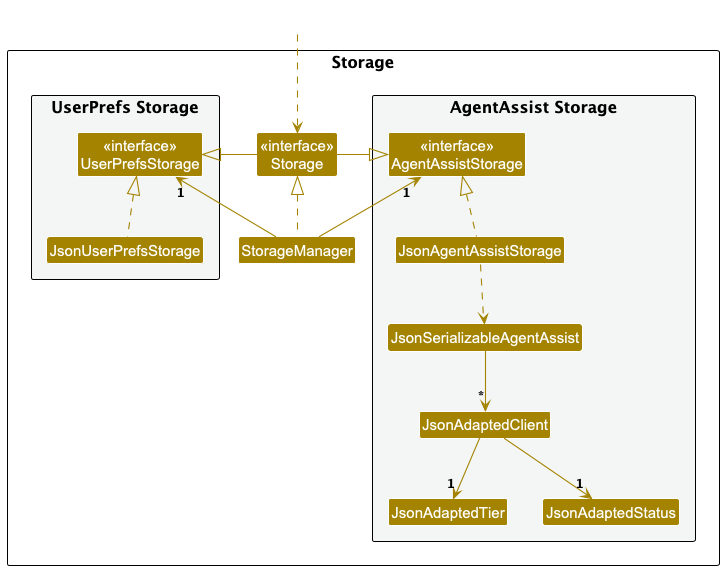

* Table of Contents
{:toc}

--------------------------------------------------------------------------------------------------------------------

## **Acknowledgements**

* [AddressBook Level 3](https://se-education.org/addressbook-level3/) (Original Source)
* JavaFX
* JSON

--------------------------------------------------------------------------------------------------------------------

## **Setting up, getting started**

Refer to the guide [_Setting up and getting started_](SettingUp.md).

--------------------------------------------------------------------------------------------------------------------

## **Design**

:bulb: **Tip:** The `.puml` files used to create diagrams in this document `docs/diagrams` folder. Refer to the [_PlantUML Tutorial_ at se-edu/guides](https://se-education.org/guides/tutorials/plantUml.html) to learn how to create and edit diagrams.

### Architecture

The ***Architecture Diagram*** given above explains the high-level design of the App.

Given below is a quick overview of main components and how they interact with each other.

**Main components of the architecture**

**`Main`** (consisting of classes [`Main`](https://github.com/se-edu/addressbook-level3/tree/master/src/main/java/seedu/address/Main.java) and [`MainApp`](https://github.com/se-edu/addressbook-level3/tree/master/src/main/java/seedu/address/MainApp.java)) is in charge of the app launch and shut down.
* At app launch, it initializes the other components in the correct sequence, and connects them up with each other.
* At shut down, it shuts down the other components and invokes cleanup methods where necessary.

The bulk of the app's work is done by the following four components:

* [**`UI`**](#ui-component): The UI of the App.
* [**`Logic`**](#logic-component): The command executor.
* [**`Model`**](#model-component): Holds the data of the App in memory.
* [**`Storage`**](#storage-component): Reads data from, and writes data to, the hard disk.

[**`Commons`**](#common-classes) represents a collection of classes used by multiple other components.

**How the architecture components interact with each other**

The *Sequence Diagram* below shows how the components interact with each other for the scenario where the user issues the command `delete 1`.

Each of the four main components (also shown in the diagram above),

* defines its *API* in an `interface` with the same name as the Component.
* implements its functionality using a concrete `{Component Name}Manager` class (which follows the corresponding API `interface` mentioned in the previous point.

For example, the `Logic` component defines its API in the `Logic.java` interface and implements its functionality using the `LogicManager.java` class which follows the `Logic` interface. Other components interact with a given component through its interface rather than the concrete class (reason: to prevent outside component's being coupled to the implementation of a component), as illustrated in the (partial) class diagram below.

The sections below give more details of each component.

### UI Component

The **API** of this component is specified in [`Ui.java`](https://github.com/se-edu/addressbook-level3/tree/master/src/main/java/seedu/address/ui/Ui.java)

The UI consists of a `MainWindow` that is made up of parts e.g.`CommandBox`, `ResultDisplay`, `PersonListPanel`, `StatusBarFooter`, `TagList` etc. All these, including the `MainWindow`, inherit from the abstract `UiPart` class which captures the commonalities between classes that represent parts of the visible GUI.

The `UI` component uses the JavaFx UI framework. The layout of these UI parts are defined in matching `.fxml` files that are in the `src/main/resources/view` folder. For example, the layout of the [`MainWindow`](https://github.com/se-edu/addressbook-level3/tree/master/src/main/java/seedu/address/ui/MainWindow.java) is specified in [`MainWindow.fxml`](https://github.com/se-edu/addressbook-level3/tree/master/src/main/resources/view/MainWindow.fxml)

The `UI` component,

* executes user commands using the `Logic` component.
* listens for changes to `Model` data so that the UI can be updated with the modified data.
* keeps a reference to the `Logic` component, because the `UI` relies on the `Logic` to execute commands.
* depends on some classes in the `Model` component, as it displays `Person` object residing in the `Model`.

### Logic Component

**API** : [`Logic.java`](https://github.com/se-edu/addressbook-level3/tree/master/src/main/java/seedu/address/logic/Logic.java)

Here's a (partial) class diagram of the `Logic` component:

The sequence diagram below illustrates the interactions within the `Logic` component, taking `execute("delete 1")` API call as an example.

Below is another sequence diagram, taking `execute("tag 1 t/friends")` API call as example.
![[Interactions Inside the Logic Component for the `tag 1 t/friends` Command]](images/TagSequenceDiagram.png)

:information_source: **Note:** The lifeline for `DeleteCommandParser` and `TagCommandParser` should end at the destroy marker (X) but due to a limitation of PlantUML, the lifeline continues till the end of diagram.

How the `Logic` component works:

1. When `Logic` is called upon to execute a command, it is passed to an `AddressBookParser` object which in turn creates a parser that matches the command (e.g., `DeleteCommandParser`, `TagCommandParser`) and uses it to parse the command.
1. This results in a `Command` object (more precisely, an object of one of its subclasses e.g., `DeleteCommand`, `TagCommand`) which is executed by the `LogicManager`.
1. The command can communicate with the `Model` when it is executed (e.g. to delete a person). 
   Note that although this is shown as a single step in the diagram above (for simplicity), in the code it can take several interactions (between the command object and the `Model`) to achieve.
1. The result of the command execution is encapsulated as a `CommandResult` object which is returned back from `Logic`.

Here are the other classes in `Logic` (omitted from the class diagram above) that are used for parsing a user command:

How the parsing works:
* When called upon to parse a user command, the `AddressBookParser` class creates an `XYZCommandParser` (`XYZ` is a placeholder for the specific command name e.g., `AddCommandParser`, `TagCommandParser`) which uses the other classes shown above to parse the user command and create a `XYZCommand` object (e.g., `AddCommand`, `TagCommand`) which the `AddressBookParser` returns back as a `Command` object.
* All `XYZCommandParser` classes (e.g., `AddCommandParser`, `DeleteCommandParser`, ...) inherit from the `Parser` interface so that they can be treated similarly where possible e.g, during testing.

Diving into specific implementation of the `XYZCommand` and `XYZCommandParser` classes, the user command undergoes extensive checks for validity.
Demonstrating with an example, the following activity diagrams summarise what happens when a user executes a `newtag` and `tag` command:

These extensive input checks in the Logic classes protect against potential malicious and invalid inputs that could undermine the usage of the code.

The class diagram below provides an overview of Command.

Commands that extends the UndoableCommand class have a concrete implementation of `undo`, which is called during the execution of an UndoCommand. During the execution of an `UndoableCommand`, the changes to the addressbook are stored, and will be used for `undo`.

### Model Component
**API** : [`Model.java`](https://github.com/se-edu/addressbook-level3/tree/master/src/main/java/seedu/address/model/Model.java)

The `Model` component,

* stores the address book data i.e., all `Person` objects (which are contained in a `UniquePersonList` object).
* stores the current list of tags as an `ObservableList<Tag>` that can be 'observed' e.g. the UI can be bound to this list so that the UI automatically updates when the data in the list change. This allows `AddessBook` to only require one `Tag` object per unique tag, instead of each `Person` needing their own `Tag` objects.
* stores the currently 'selected' `Person` objects (e.g., results of a search query) as a separate _filtered_ list which is exposed to outsiders as an unmodifiable `ObservableList<Person>` that can be 'observed' e.g. the UI can be bound to this list so that the UI automatically updates when the data in the list changes.
* stores a `UserPref` object that represents the user’s preferences. This is exposed to the outside as a `ReadOnlyUserPref` objects.
* stores a `Command` object that represents the user's last executed command.

### Storage Component

**API** : [`Storage.java`](https://github.com/se-edu/addressbook-level3/tree/master/src/main/java/seedu/address/storage/Storage.java)

The `Storage` component,
* can save both address book data and user preference data in JSON format, and read them back into corresponding objects.
* inherits from both `AddressBookStorage` and `UserPrefStorage`, which means it can be treated as either one (if only the functionality of only one is needed).
* depends on some classes in the `Model` component (because the `Storage` component's job is to save/retrieve objects that belong to the `Model`)

### Common classes

Classes used by multiple components are in the `seedu.address.commons` package.

--------------------------------------------------------------------------------------------------------------------

## **Implementation**

This section describes some noteworthy details on how certain features are implemented.

### \[Proposed\] Augment undo, add redo feature

#### Proposed Implementation

Currently, the undo feature facilitated by the class `UndoCommand`. It is implemented by having an abstract class `UndoableCommand`, which the command extends, proving a concrete implementation of `UndoableCommand#undo()`. and is implemented by having an undo method under each command, which implements an `UndoableCommand` interface. It does not utilise saved states of the address book.

The proposed augmented undo and new redo mechanism is facilitated by `VersionedAddressBook`. It extends `AddressBook` with an undo/redo history, stored internally as an `addressBookStateList` and `currentStatePointer`. Additionally, it implements the following operations:

* `VersionedAddressBook#commit()` — Saves the current address book state in its history.
* `VersionedAddressBook#undo()` — Restores the previous address book state from its history.
* `VersionedAddressBook#redo()` — Restores a previously undone address book state from its history.

These operations are exposed in the `Model` interface as `Model#commitAddressBook()`, `Model#undoAddressBook()` and `Model#redoAddressBook()` respectively.

Given below is an example usage scenario and how the undo/redo mechanism behaves at each step.

Step 1. The user launches the application for the first time. The `VersionedAddressBook` will be initialized with the initial address book state, and the `currentStatePointer` pointing to that single address book state.

Step 2. The user executes `delete 5` command to delete the 5th person in the address book. The `delete` command calls `Model#commitAddressBook()`, causing the modified state of the address book after the `delete 5` command executes to be saved in the `addressBookStateList`, and the `currentStatePointer` is shifted to the newly inserted address book state.

Step 3. The user executes `add n/David …​` to add a new person. The `add` command also calls `Model#commitAddressBook()`, causing another modified address book state to be saved into the `addressBookStateList`.

:information_source: **Note:** If a command fails its execution, it will not call `Model#commitAddressBook()`, so the address book state will not be saved into the `addressBookStateList`.

Step 4. The user now decides that adding the person was a mistake, and decides to undo that action by executing the `undo` command. The `undo` command will call `Model#undoAddressBook()`, which will shift the `currentStatePointer` once to the left, pointing it to the previous address book state, and restores the address book to that state.

:information_source: **Note:** If the `currentStatePointer` is at index 0, pointing to the initial AddressBook state, then there are no previous AddressBook states to restore. The `undo` command uses `Model#canUndoAddressBook()` to check if this is the case. If so, it will return an error to the user rather
than attempting to perform the undo.

The following sequence diagram shows how an undo operation goes through the `Logic` component:

:information_source: **Note:** The lifeline for `UndoCommand` should end at the destroy marker (X) but due to a limitation of PlantUML, the lifeline reaches the end of diagram.

Similarly, how an undo operation goes through the `Model` component is shown below:

The `redo` command does the opposite — it calls `Model#redoAddressBook()`, which shifts the `currentStatePointer` once to the right, pointing to the previously undone state, and restores the address book to that state.

:information_source: **Note:** If the `currentStatePointer` is at index `addressBookStateList.size() - 1`, pointing to the latest address book state, then there are no undone AddressBook states to restore. The `redo` command uses `Model#canRedoAddressBook()` to check if this is the case. If so, it will return an error to the user rather than attempting to perform the redo.

Step 5. The user then decides to execute the command `list`. Commands that do not modify the address book, such as `list`, will usually not call `Model#commitAddressBook()`, `Model#undoAddressBook()` or `Model#redoAddressBook()`. Thus, the `addressBookStateList` remains unchanged.

Step 6. The user executes `clear`, which calls `Model#commitAddressBook()`. Since the `currentStatePointer` is not pointing at the end of the `addressBookStateList`, all address book states after the `currentStatePointer` will be purged. Reason: It no longer makes sense to redo the `add n/David …​` command. This is the behavior that most modern desktop applications follow.

The following activity diagram summarises what happens when a user executes a new command:

#### Design considerations:

**Aspect: How undo & redo executes:**

* **Alternative 1:** Saves the entire address book.
  * Pros: Easy to implement.
  * Cons: May have performance issues in terms of memory usage.

* **Alternative 2 (current implementation):** Individual command knows how to undo/redo by
  itself.
  * Pros: Will use less memory (e.g. for `delete`, just save the person being deleted).
  * Cons: We must ensure that the implementation of each individual command are correct.

--------------------------------------------------------------------------------------------------------------------

## **Documentation, logging, testing, configuration, dev-ops**

* [Documentation guide](Documentation.md)
* [Testing guide](Testing.md)
* [Logging guide](Logging.md)
* [Configuration guide](Configuration.md)
* [DevOps guide](DevOps.md)

--------------------------------------------------------------------------------------------------------------------

## **Appendix: Requirements**

### Product Scope

**Target user profile**: 

Wedding planners who
* needs to manage a significant number (50-100) of wedding guests
* only have guests with Singapore phone numbers
* only needs to plan 1 wedding at a time
* prefer desktop applications over other types (e.g. Web-based)
* can type fast
* much prefers typing to cursor interactions
* is reasonably comfortable using Command Line Interface (CLI) applications

**Value proposition**:
Reduce the time taken to add, tag and filter guests, allowing planners to focus more time on other wedding needs.

### User stories

Priorities: High (must have) - `* * *`, Medium (nice to have) - `* *`, Low (unlikely to have) - `*`

| Priority | As a …​                                                   | I want to …​                                                 | So that I can…​                                                                             |
|----------|-----------------------------------------------------------|--------------------------------------------------------------|---------------------------------------------------------------------------------------------|
| `* * *`  | wedding planner new to the app                            | see usage instructions and examples                          | refer to instructions when I forget how to use the App                                      |
| `* * *`  | wedding planner                                           | add a new person to the guest list                           | track the person using the guest list                                                       |
| `* * *`  | wedding planner                                           | delete a person                                              | remove someone that has been uninvited                                                      |
| `* * *`  | wedding planner                                           | view the entire guest list                                   | get an view all the guests in my guest list                                                 |
| `* * *`  | wedding planner                                           | find a guest by name                                         | locate specific guests without having to go through the entire list                         |
| `* * *`  | wedding planner                                           | create customisable tags which can be applied to guests      | have a personalised way to identify each group of guests                                    |
| `* * *`  | wedding planner managing distinct groups of guests        | apply customisable tags to guests                            | categorise my guests easily                                                                 |
| `* * *`  | wedding planner managing distinct groups of guests        | delete tags associated with guests                           | re-categorise my guests if needed                                                           |
| `* * *`  | wedding planner                                           | view the RSVP status of each guest                           | see if each guest is attending, not attending or have not RSVP'ed to the wedding            |
| `* *`    | wedding planner                                           | filter guests according to their RSVP status                 | view guests that are attending, not attending or have not RSVP'ed to the wedding only       |
| `* *`    | wedding planner managing distinct groups of guests        | filter guests according to their tags                        | view specific groups of guests without having to go through the entire list                 |
| `* *`    | wedding planner managing many guests                      | apply or remove existing tags on multiple guests at once     | quickly tag or untag large groups of guests in the guest list at once                       |
| `* *`    | wedding planner managing many tags                        | apply or remove multiple existing tags at once on each guest | quickly tag or untag multiple tags onto each guest at once                                  |
| `* *`    | wedding planner managing many distinct groups of guests   | create and delete multiple predefined tags at once           | quickly create or delete multiple predefined tags at once                                   |
| `*`      | wedding planner with frequent guest category changes      | rename predefined tags that were already created             | change the description of tags without altering their association to the guests in the list |
| `*`      | wedding planner                                           | apply multiple filters to the list                           | view only a specific group of guests                                                        |
| `*`      | wedding planner                                           | have colour coded tags and fields                            | distinguish tags and different fields easily                                                |
| `*`      | wedding planner                                           | see the list of tags already created                         | easily tag guests without checking if the tag has been already created                      |
| `*`      | wedding planner handling multiple guests and tags at once | undo my last command                                         | avoid retyping long commands or having to recall my mistakes                                |

### Use Cases

(For all use cases below, the **System** is the `AddressBook` and the **Actor** is the `user`, unless specified otherwise)

**Use Case 1 (UC1)**: Add Guest 
**MSS**:

1.  User enters the command to add a guest.
2.  The system prompts the user for guest's name, contact number and email address.
3.  User inputs their name, contact number and email address.
4.  The system validates the input.
5.  The system saves the guest and display confirmation message.

    Use case ends.

**Extensions**:
* 3a. User inputs invalid contact number.
  * 3a1. System displays error message and prompts for corrected input.
  * Use case resumes at step 3.

* 3b. User enters duplicate guest name.
    * 3b1. System displays an error message, showing user already exists and prompts for corrected input.
    * Use case resumes at step 3.

**Use Case 2 (UC2)**: Delete Guest 
**Preconditions**: List displayed is not empty. 
**MSS**:

1.  User enters the command to delete a guest.
2.  The system prompts for guest.
3.  User enters the guest.
4.  The system verifies the input.
5.  The system deletes the guest and display confirmation message.

    Use case ends.

**Extensions**:

* 3a. User inputs invalid index.
    * 3a1. System displays error message and prompts for corrected input.
    * Use case resumes at step 3.

**Use Case 3 (UC3)**: Find Guest By Name 
**MSS**:

1.  User enters the command to find a guest.
2.  The system prompts for the guest's name.
3.  User enters the name.
4.  The system searches for the guest.
5.  The system displays a list of matching guest(s).

    Use case ends.
    
**Extensions**:

* 5a. No guests match the keyword.
    * 5a1. System displays a message indicating no guest found. 
    * Use case ends.

**Use Case 4 (UC4)**: Set RSVP Status 
**Preconditions**: List displayed is not empty. 
**MSS**:

1.  User enters the command to set RSVP status.
2.  The system prompts for the guest and RSVP status.
3.  User enters the guest and RSVP status.
4.  The system verifies the input.
5.  The system updates the RSVP status of the guest in the list and shows confirmation message.

    Use case ends.

**Extensions**:

* 3a. User enters an invalid guest or status.
    * 3a1. System displays error message and prompt for indexes.
    * Use case resumes at step 3.

**Use Case 5 (UC5)**: Create Tag(s) 
**MSS**:

1.  User enters the command to create tag(s).
2.  The system prompts for the description of the tag(s).
3.  User enters the description of the tag(s).
4.  The system verifies the input.
5.  The system updates the tag list to show the created tag and shows confirmation message.
    
    Use case ends.

**Extensions**:

* 3a. User enters at least one invalid description (e.g. containing non-ASCII characters, or is too long)
    * 2a1. System displays error message and the correct usage.
    * Use case ends.

* 4a. Adding the new tag(s) would exceed the limit on the number of predefined tags allowed.
    * 3a1. System displays a message indicating the limit will be reached.
    * Use case ends.

* 4b. User enters at least one duplicate tag description (i.e. tag already exists in the tag list)
    * 3b1. System continues to update the tag list for non-offending tag descriptions (if any).
    * 3b2. System displays a message indicating the tag(s) that already exist(s).
    * Use case ends.

**Use Case 6 (UC6)**: Delete Tag(s) 
**Preconditions**: Tag(s) is/are not on any guest in the entire list, or the command has to have the --force flag. 
**MSS**:

1.  User enters the command to delete tag(s).
2.  The system prompts for the description of the tag(s).
3.  User enters the description of the tag(s).
4.  The system verifies the input.
5.  The system updates the tag list to remove the deleted tag(s) and shows confirmation message.

   Use case ends.

**Extensions**

* 3a. User enters at least one invalid description (e.g. containing non-ASCII characters, or is too long)
  * 2a1. System displays error message and the correct usage.
  * Use case ends.

* 4a. User enters at least one tag description that does not match any of the predefined tags.
    * 4a1. System continues to update the tag list for non-offending tag descriptions (if any).
    * 4a2. System displays a message indicating the tag(s) that already exist(s).
    * Use case ends.

**Use Case 7 (UC7)**: Rename Tag 
**Preconditions**: The new tag name is not in use yet, and the tag to be renamed exists in the tag list. 
**MSS**

1.  User enters the command to rename tag.
2.  The system prompts for the description of the tag.
3.  User enters the description of the tag to be renamed, and the new description.
4.  The system verifies the input.
5.  The system updates the tag description and shows confirmation message.

    Use case ends.

**Extensions**:

* 3a. User enters an invalid description.
    * 3a1. System displays error message and prompt tag description.
    * Use case ends.

* 3b. User enters a description not matching any existing tags.
    * 3b1. System displays a message indicating the tag does not exist.
    * Use case ends.

**Use Case 8 (UC8)**: Tag Guest 
**MSS**:

1.  User enters the command to tag guest.
2.  The system prompts for the guest and the tag.
3.  User enters the guest and the tag.
4.  The system verifies the input.
5.  The system updates the guest list to show the tag on the guest and shows confirmation message.

    Use case ends.

**Extensions**:

* 3a. User enters an invalid tag.
    * 3a1. System displays error message and prompt for the guest and corrected tag.
    * Use case resumes at step 3.

* 3b. User enters invalid guest.
    * 3c1. System displays error message and prompt for corrected guest and tag.
    * Use case resumes at step 3.

* 5a. Tag not in tag list.
    * 5a1. System displays a message indicating the tag does not exist in tag list.
    * 5a2. User <u>creates a new tag (UC5)</u>.
    * Use case ends.

**Use Case 9 (UC9)**: Untag Guest 
**MSS**:

1.  User enters the command to untag guest.
2.  The system prompts for the guest and the tag.
3.  User enters the guest and tag.
4.  The system verifies the input.
5.  The system updates the guest list to show that the tag on the guest are removed and shows confirmation message.

    Use case ends.

**Extensions**:

* 3b. User enters invalid guest.
    * 3c1. System displays error message and prompt for the corrected guest and tag.
    * Use case resumes at step 3.

* 5a. Tag not on guest
    * 5a1. System displays a message indicating the tag does not exist on the guest.
    * Use case ends.
    
**Use Case 10 (UC10)**: Filter by Tag or RSVP Status 
**MSS**:

1.  User enters the command to filter guest list.
2.  The system prompts for the desired predicate.
3.  User enters the desired predicate.
4.  The system verifies the input.
5.  The system shows the list of guests matching the predicate and shows confirmation message.

    Use case ends.

**Extensions**:

* 3a. User enters an invalid RSVP status.
    * 3a1. System displays error message indicating invalid RSVP status and prompts for the corrected predicate.
    * Use case resumes at step 3.

* 3b. User enters an invalid tag.
    * 3b1. System displays error message indicating the tag does not exist in tag list and prompts for the corrected predicate.
    * Use case resumes at step 3.

**Use Case 10 (UC10)**: Undo Last Command 
**Preconditions**: Last command was successfully executed. 
**MSS**:

1.  User enters the command to undo the last action.
2.  The system verifies the input.
3.  The system shows the list before last action was taken shows confirmation message.

    Use case ends.

**Extensions**:

* 2a. No last action present.
    * 2a1. System displays error message indicating there is no action to undo.
    * Use case ends.

* 2b. Last action was an undo.
    * 2b1. System displays error message indicating last action was an undo.
    * Use case ends.

### Non-Functional Requirements

1.  Should work on any _mainstream OS_ as long as it has Java `17` or above installed.
2.  Should be able to hold up to 100 guests without a noticeable sluggishness in performance for typical usage.
3.  A user with above average typing speed for regular English text (i.e. not code, not system admin commands) should be able to accomplish most of the tasks faster using commands than using the mouse.
4.  Should only be able to support one wedding event at a time.
5.  Should load the list of guests in under 3 seconds, even when _filtering_ the list.
6.  GUI should be intuitive and easy to learn for wedding planners to manage the guest list.
7.  Guest list should be saved and updated throughout uses.

### Glossary

* **Mainstream OS**: Windows, Linux, Unix, MacOS
* **GUI**: Graphical User Interface allows users to interact with the address book codebase through visual representation
* **CLI**: Command Line Interface accepts text input to execute functions of the application
* **JAR file**: A package file that contains many class files, associated metadata and resources that build the application
* **RSVP status**: A field on each guest that indicates if the guest has responded, attending or not attending the wedding, which can be used for filtering purposes
* **Customisable tags**: Tags on guests containing text written by user, which can be used for filtering purposes
* **Tag list**: A list of tags created using the `newtag` command that can be used to tag guests with
* **Delete**: Removes a guest and all details regarding the guest from the address book
* **Add**: Creates and saves a new guest into the address book
* **Filter**: Only show guests that contains the text input by the user
* **Filter panel**: Shows the current filter predicates applied to the list
* **New Tag**: Creates a new tag and adds it to the tag list
* **Delete Tag**: Removes a tag from the tag list and all instances of it on all guests in the address book
* **Untag**: Removes a tag from guest but does not remove it from the tag list or other guests not specified
* **Undo**: Undoes the previous executed command
--------------------------------------------------------------------------------------------------------------------

## **Appendix: Instructions for manual testing**

Given below are instructions to test the app manually.

:information_source: **Note:** These instructions only provide a starting point for testers to work on;
testers are expected to do more *exploratory* testing.

### Launch and shutdown

1. Initial launch

   1. Download the jar file and copy into an empty folder

   1. Double-click the jar file Expected: Shows the GUI with a set of sample contacts. The window size may not be optimum.

1. Saving window preferences

   1. Resize the window to an optimum size. Move the window to a different location. Close the window.

   1. Re-launch the app by double-clicking the jar file. 
       Expected: The most recent window size and location is retained.

### Deleting a person

1. Deleting a person while all persons are being shown

   1. Prerequisites: List all persons using the `list` command. Multiple persons in the list.

   1. Test case: `delete 1` 
      Expected: First contact is deleted from the list. Details of the deleted contact shown in the status message.

   1. Test case: `delete 0` 
      Expected: No person is deleted. Error details shown in the status message.

   1. Other incorrect delete commands to try: `delete`, `delete x`, `...` (where x is larger than the list size) 
      Expected: Similar to previous.

### Creating a tag

1. Creating a tag
    
   1. Prerequisites: Tag list contains less than 30 tags. Tag `family` does not exist while `friends` does.

   1. Test case: `newtag t/family` 
      Expected: Tag `family` is created and shown in the tag list. Details of the created tag shown in the status message.

   1. Test case: `newtag t/friends` 
      Expected: No tag is created. Error details shown in the status message.

   1. Other incorrect newtag commands to try: `newtag`, `newtag t/`, `newtag t/x` (where x is a non-ASCII character) 
      Expected: Similar to previous.

### Saving data

:information_source: **Tip:** When utilising the application, it is recommended to occasionally duplicate the data file to an empty folder independent of the application as a backup, in case of missing or corrupted data files.

1. Dealing with corrupted data files
   1. Run the JAR file and note the error message for the corrupted data file
   2. Open the project using an IDE (recommended to use IntelliJ IDEA)
   2. Navigate to `/data` folder
   3. Open the JSON file inside, it should be named `addressbook.json`
   4. Edit the file to fix the corrupted data

:information_source: **Important:** Editing the data file directly is dangerous and could cause more issues. Do it with discretion and only as a last resort.

2. Dealing with missing data files
   1. Open the project using an IDE (recommended to use IntelliJ IDEA)
   2. Navigate to `/data` folder
   3. Open the JSON file inside, it should be named `addressbook.json`.
   4. If there is none, you can copy the default data file from our [code space](https://github.com/AY2425S1-CS2103T-W11-2/tp)
