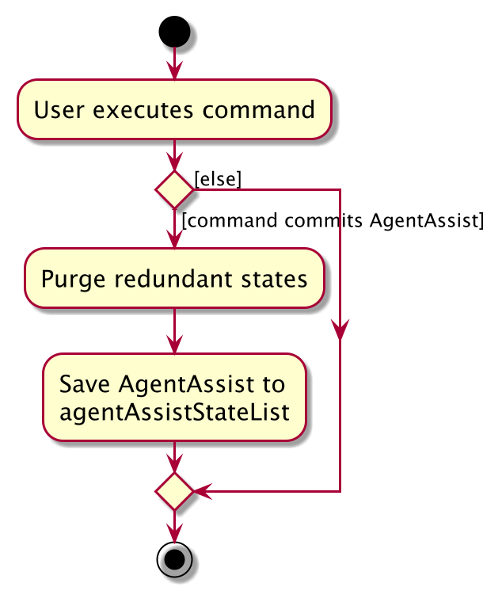

--
layout: page
title: Developer Guide
---
* Table of Contents
  {:toc}

--------------------------------------------------------------------------------------------------------------------

## **Acknowledgements**

* This project is based on the AddressBook-Level3 project created by the [SE-EDU initiative](https://se-education.org).

--------------------------------------------------------------------------------------------------------------------

## **Setting up, getting started**

Refer to the guide [_Setting up and getting started_](SettingUp.md).

--------------------------------------------------------------------------------------------------------------------

## **Design**

:bulb: **Tip:** The `.puml` files used to create diagrams in this document `docs/diagrams` folder. Refer to the [_PlantUML Tutorial_ at se-edu/guides](https://se-education.org/guides/tutorials/plantUml.html) to learn how to create and edit diagrams.

### Architecture

The ***Architecture Diagram*** given above explains the high-level design of the App.

Given below is a quick overview of main components and how they interact with each other.

**Main components of the architecture**

**`Main`** (consisting of classes [`Main`](https://github.com/se-edu/addressbook-level3/tree/master/src/main/java/seedu/address/Main.java) and [`MainApp`](https://github.com/se-edu/addressbook-level3/tree/master/src/main/java/seedu/address/MainApp.java)) is in charge of the app launch and shut down.
* At app launch, it initializes the other components in the correct sequence, and connects them up with each other.
* At shut down, it shuts down the other components and invokes cleanup methods where necessary.

The bulk of the app's work is done by the following four components:

* [**`UI`**](#ui-component): The UI of the App.
* [**`Logic`**](#logic-component): The command executor.
* [**`Model`**](#model-component): Holds the data of the App in memory.
* [**`Storage`**](#storage-component): Reads data from, and writes data to, the hard disk.

[**`Commons`**](#common-classes) represents a collection of classes used by multiple other components.

**How the architecture components interact with each other**

The *Sequence Diagram* below shows how the components interact with each other for the scenario where the user issues the command `delete 1`.

Each of the four main components (also shown in the diagram above),

* defines its *API* in an `interface` with the same name as the Component.
* implements its functionality using a concrete `{Component Name}Manager` class (which follows the corresponding API `interface` mentioned in the previous point.

For example, the `Logic` component defines its API in the `Logic.java` interface and implements its functionality using the `LogicManager.java` class which follows the `Logic` interface. Other components interact with a given component through its interface rather than the concrete class (reason: to prevent outside component's being coupled to the implementation of a component), as illustrated in the (partial) class diagram below.

The sections below give more details of each component.

### UI component

The **API** of this component is specified in [`Ui.java`](https://github.com/se-edu/addressbook-level3/tree/master/src/main/java/seedu/address/ui/Ui.java)

The UI consists of a `MainWindow` that is made up of parts e.g.`CommandBox`, `ResultDisplay`, `PersonListPanel`, `StatusBarFooter` etc. All these, including the `MainWindow`, inherit from the abstract `UiPart` class which captures the commonalities between classes that represent parts of the visible GUI.

The `UI` component uses the JavaFx UI framework. The layout of these UI parts are defined in matching `.fxml` files that are in the `src/main/resources/view` folder. For example, the layout of the [`MainWindow`](https://github.com/se-edu/addressbook-level3/tree/master/src/main/java/seedu/address/ui/MainWindow.java) is specified in [`MainWindow.fxml`](https://github.com/se-edu/addressbook-level3/tree/master/src/main/resources/view/MainWindow.fxml)

The `UI` component,

* executes user commands using the `Logic` component.
* listens for changes to `Model` data so that the UI can be updated with the modified data.
* keeps a reference to the `Logic` component, because the `UI` relies on the `Logic` to execute commands.
* depends on some classes in the `Model` component, as it displays `Person` object residing in the `Model`.

### Logic component

**API** : [`Logic.java`](https://github.com/se-edu/addressbook-level3/tree/master/src/main/java/seedu/address/logic/Logic.java)

Here's a (partial) class diagram of the `Logic` component:

The sequence diagram below illustrates the interactions within the `Logic` component, taking `execute("delete 1")` API call as an example.

:information_source: **Note:** The lifeline for `DeleteCommandParser` should end at the destroy marker (X) but due to a limitation of PlantUML, the lifeline continues till the end of diagram.

How the `Logic` component works:

1. When `Logic` is called upon to execute a command, it is passed to an `AddressBookParser` object which in turn creates a parser that matches the command (e.g., `DeleteCommandParser`) and uses it to parse the command.
1. This results in a `Command` object (more precisely, an object of one of its subclasses e.g., `DeleteCommand`) which is executed by the `LogicManager`.
1. The command can communicate with the `Model` when it is executed (e.g. to delete a person). 
   Note that although this is shown as a single step in the diagram above (for simplicity), in the code it can take several interactions (between the command object and the `Model`) to achieve.
1. The result of the command execution is encapsulated as a `CommandResult` object which is returned back from `Logic`.

Here are the other classes in `Logic` (omitted from the class diagram above) that are used for parsing a user command:

How the parsing works:
* When called upon to parse a user command, the `AddressBookParser` class creates an `XYZCommandParser` (`XYZ` is a placeholder for the specific command name e.g., `AddCommandParser`) which uses the other classes shown above to parse the user command and create a `XYZCommand` object (e.g., `AddCommand`) which the `AddressBookParser` returns back as a `Command` object.
* All `XYZCommandParser` classes (e.g., `AddCommandParser`, `DeleteCommandParser`, ...) inherit from the `Parser` interface so that they can be treated similarly where possible e.g, during testing.

### Model component
**API** : [`Model.java`](https://github.com/se-edu/addressbook-level3/tree/master/src/main/java/seedu/address/model/Model.java)

The `Model` component,

* stores the address book data i.e., all `Person` objects (which are contained in a `UniquePersonList` object).
* stores the currently 'selected' `Person` objects (e.g., results of a search query) as a separate _filtered_ list which is exposed to outsiders as an unmodifiable `ObservableList<Person>` that can be 'observed' e.g. the UI can be bound to this list so that the UI automatically updates when the data in the list change.
* stores a `UserPref` object that represents the user’s preferences. This is exposed to the outside as a `ReadOnlyUserPref` objects.
* does not depend on any of the other three components (as the `Model` represents data entities of the domain, they should make sense on their own without depending on other components)

:information_source: **Note:** An alternative (arguably, a more OOP) model is given below. It has a `Tag` list in the `AddressBook`, which `Person` references. This allows `AddressBook` to only require one `Tag` object per unique tag, instead of each `Person` needing their own `Tag` objects. 

### Storage component

**API** : [`Storage.java`](https://github.com/se-edu/addressbook-level3/tree/master/src/main/java/seedu/address/storage/Storage.java)

The `Storage` component,
* can save both address book data and user preference data in JSON format, and read them back into corresponding objects.
* inherits from both `AddressBookStorage` and `UserPrefStorage`, which means it can be treated as either one (if only the functionality of only one is needed).
* depends on some classes in the `Model` component (because the `Storage` component's job is to save/retrieve objects that belong to the `Model`)

### Common classes

Classes used by multiple components are in the `seedu.address.commons` package.

--------------------------------------------------------------------------------------------------------------------

## **Implementation**

This section describes some noteworthy details on how certain features are implemented.

### Create Doctor/ Patient feature

##  Create Doctor feature

The CreateDoctorCommand is implemented and used to add a new doctor to the MedDict database in address book.
This command focuses solely on successfully adding a doctor to the system.

Example Usage Scenario:

Step 1: The user launches the application, and the address book is initialized with the current data.
The AddressBookParser will handle the input command when the user types something like :

createDoctor n/Dr Jane Smith p/87654321 e/dr.jane.smith@hospital.com a/456 Elm Street r/physiotherapy  

Step 2: The user executes the create doctor command to add a new doctor to the MedDict database 
in address book. The CreateDoctorCommand is generated by the AddressBookParser
and passed to the LogicManager for execution. The CreateDoctorCommand checks whether a doctor
with the same identity already exists in the MedDict database in address book.
If a duplicate is found, the command will not proceed and will return an error message.
If no duplicate is found, the doctor will be added to the MedDict database in address book.

Step 3: The command successfully adds the doctor to the MedDict database in address book.
After successfully adding the doctor, the system displays a success message confirming the addition of the new doctor.

"Successfully created a new doctor Doctor#XX : XXX"  

The CreatePatientCommand is used to add a new doctor to the MedDict database in address book.
This command focuses solely on successfully adding a doctor to the system.

##  Create Patient feature

The CreatePatientCommand is implemented and used to add a new patient to the MedDict database in address book.
This command focuses solely on successfully adding a patient to the system.

Example Usage Scenario:

Step 1: The user launches the application, and the address book is initialized with the current data.
The AddressBookParser will handle the input command when the user types something like :

createPatient n/John Doe p/98765432 e/johndoe@example.com a/123 Baker Street r/No known allergies  

Step 2: The user executes the create doctor command to add a new patient to the MedDict database in address book.
The CreatePatientCommand is generated by the AddressBookParser and passed to the LogicManager for execution.
The CreatePatientCommand checks whether a patient with the same identity already exists in the MedDict database in address book.

a) If a duplicate is found, the command will not proceed and will return an error message:
"This patient already exists"

b) If no duplicate is found, the patient will be added to the MedDict database in address book.

Step 3: The command successfully adds the doctor to the MedDict database in address book.
After successfully adding the patient, the system displays a success message confirming the addition of the new patient.

"Successfully created a new patient Patient#XX : XXX"

The CreatePatientCommand is used to add a new patient to the MedDict database in address book.
This command focuses solely on successfully adding a patient to the system.

### \[Proposed\] Undo/redo feature

#### Proposed Implementation

The proposed undo/redo mechanism is facilitated by `VersionedAddressBook`. It extends `AddressBook` with an undo/redo history, stored internally as an `addressBookStateList` and `currentStatePointer`. Additionally, it implements the following operations:

* `VersionedAddressBook#commit()` — Saves the current address book state in its history.
* `VersionedAddressBook#undo()` — Restores the previous address book state from its history.
* `VersionedAddressBook#redo()` — Restores a previously undone address book state from its history.

These operations are exposed in the `Model` interface as `Model#commitAddressBook()`, `Model#undoAddressBook()` and `Model#redoAddressBook()` respectively.

Given below is an example usage scenario and how the undo/redo mechanism behaves at each step.

Step 1. The user launches the application for the first time. The `VersionedAddressBook` will be initialized with the initial address book state, and the `currentStatePointer` pointing to that single address book state.

Step 2. The user executes `delete 5` command to delete the 5th person in the address book. The `delete` command calls `Model#commitAddressBook()`, causing the modified state of the address book after the `delete 5` command executes to be saved in the `addressBookStateList`, and the `currentStatePointer` is shifted to the newly inserted address book state.

Step 3. The user executes `add n/David …​` to add a new person. The `add` command also calls `Model#commitAddressBook()`, causing another modified address book state to be saved into the `addressBookStateList`.

:information_source: **Note:** If a command fails its execution, it will not call `Model#commitAddressBook()`, so the address book state will not be saved into the `addressBookStateList`.

Step 4. The user now decides that adding the person was a mistake, and decides to undo that action by executing the `undo` command. The `undo` command will call `Model#undoAddressBook()`, which will shift the `currentStatePointer` once to the left, pointing it to the previous address book state, and restores the address book to that state.

:information_source: **Note:** If the `currentStatePointer` is at index 0, pointing to the initial AddressBook state, then there are no previous AddressBook states to restore. The `undo` command uses `Model#canUndoAddressBook()` to check if this is the case. If so, it will return an error to the user rather
than attempting to perform the undo.

The following sequence diagram shows how an undo operation goes through the `Logic` component:

:information_source: **Note:** The lifeline for `UndoCommand` should end at the destroy marker (X) but due to a limitation of PlantUML, the lifeline reaches the end of diagram.

Similarly, how an undo operation goes through the `Model` component is shown below:

The `redo` command does the opposite — it calls `Model#redoAddressBook()`, which shifts the `currentStatePointer` once to the right, pointing to the previously undone state, and restores the address book to that state.

:information_source: **Note:** If the `currentStatePointer` is at index `addressBookStateList.size() - 1`, pointing to the latest address book state, then there are no undone AddressBook states to restore. The `redo` command uses `Model#canRedoAddressBook()` to check if this is the case. If so, it will return an error to the user rather than attempting to perform the redo.

Step 5. The user then decides to execute the command `list`. Commands that do not modify the address book, such as `list`, will usually not call `Model#commitAddressBook()`, `Model#undoAddressBook()` or `Model#redoAddressBook()`. Thus, the `addressBookStateList` remains unchanged.

Step 6. The user executes `clear`, which calls `Model#commitAddressBook()`. Since the `currentStatePointer` is not pointing at the end of the `addressBookStateList`, all address book states after the `currentStatePointer` will be purged. Reason: It no longer makes sense to redo the `add n/David …​` command. This is the behavior that most modern desktop applications follow.

The following activity diagram summarizes what happens when a user executes a new command:

#### Design considerations:

**Aspect: How undo & redo executes:**

* **Alternative 1 (current choice):** Saves the entire address book.
    * Pros: Easy to implement.
    * Cons: May have performance issues in terms of memory usage.

* **Alternative 2:** Individual command knows how to undo/redo by
  itself.
    * Pros: Will use less memory (e.g. for `delete`, just save the person being deleted).
    * Cons: We must ensure that the implementation of each individual command are correct.

_{more aspects and alternatives to be added}_

### \[Proposed\] Data archiving

_{Explain here how the data archiving feature will be implemented}_

--------------------------------------------------------------------------------------------------------------------

## **Documentation, logging, testing, configuration, dev-ops**

* [Documentation guide](Documentation.md)
* [Testing guide](Testing.md)
* [Logging guide](Logging.md)
* [Configuration guide](Configuration.md)
* [DevOps guide](DevOps.md)

--------------------------------------------------------------------------------------------------------------------

## **Appendix: Requirements**

### Product scope

**Target user profile**:

* Physiotherapists who:
    * Has a significant number of patients to manage
    * Prefers a solution that minimizes data entry and retrieval time
    * Needs quick access to contact details and conditions of patients
    * Needs to monitor and track the progress of recurring / returning patients over a long period of time
    * Prefers typing to mouse interactions and reasonably comfortable using CLI apps

**Value proposition**: Provide a more specialised one-stop-for-all medical related information to their patients, schedules, appointments and to keep track of their medical information, progression, medical history etc. The simple CLI app is optimised for physiotherapists’ routine use during consultations, designed for physiotherapists who prioritise speed when accessing and updating patients’ information and details on a regular basis.

### User stories

Priorities: High (must have) - `* * *`, Medium (nice to have) - `* *`, Low (unlikely to have) - `*`

| Priority | As a …​ | I want to …​                                                          | So that I can…​                                                                       |
|----------|---------|-----------------------------------------------------------------------|---------------------------------------------------------------------------------------|
| `* * *`  | Doctor  | create a new patient profile                                          | I can record their details and track their progress                                   |
| `* * *`  | Doctor  | delete a patient profile                                              | get rid of patient's information that I no longer need /  no longer a patient of mine |
| `* * *`  | Doctor  | add recurring appointments for a patient                              | manage their treatment schedule efficiently                                           |
| `* * *`  | Doctor  | update patient details                                                | keep their medical information current                                                |
| `* * *`  | Doctor  | add notes to a patient’s record after each session                    | track their progress over time                                                        |
| `* * *`  | Doctor  | see which patients have upcoming appointments today                   | I can prepare in advance                                                              |
| `* * *`  | Doctor  | view the history of treatments for a patient                          | monitor their improvement                                                             |
| `* * `   | Doctor  | filter patients by condition or treatment type                        | search patients of a particular condition or treatment for more follow-up actions     |
| `* * `   | Doctor  | track my own schedule for the week                                    | I can plan my workload                                                                |
| `* * `   | Doctor  | automatically schedule follow-up appointments for recurring patients  | I don’t have to manually book each appointment                                        |
| `* * `   | Doctor  | set reminders for follow-up appointments                              | I don’t miss any important sessions                                                   | |
| `* * `   | Doctor  | assign different exercises or treatments to a patient                 | their care plan is personalized                                                       |
| `* * `   | Doctor  | mark a patient’s session as completed                                 | I can know which patients have been seen                                              |
| `* * `   | Doctor  | add vital signs data (e.g., blood pressure, heart rate) for a patient | I can monitor their health metrics                                                    |
| `* * `   | Doctor  | track patient feedback after each session                             | I can adjust their treatment plan if needed                                           |
| `* * `   | Doctor  | set goals for a patient’s treatment plan                              | I can measure their progress against these goals                                      |
| `* * `   | Doctor  | record billing information for each session                           | I can manage payments and invoicing                                                   |
| `* * `   | Doctor  | access a summary of all my patients                                   | I can get an overview of their conditions and treatments                              |
| `* * `   | Doctor  | view all the sessions a patient has missed                            | I can follow up with them and arrange for make-up session                             |
| `* `     | Doctor  | collaborate with other doctors by sharing patient information         | we can coordinate care                                                                |

### Use cases

(For all use cases below, the **System** is the `MedDict` and the **Actor** is the `physiotherapist`, unless specified otherwise)

**Use case - UC01: Delete a person**

**MSS**

1.  The user searches for the patient in the list by name
2.  MedDict displays all matching patients
3.  The user selects the specific patient profile to delete
4.  The user requests to delete a specific patient in the list
5.  MedDict deletes the patient profile from the system and notifies the user that the profile has been successfully deleted

    Use case ends.

**Extensions**

* 2a: The list of patients is empty.

    * 2a1. MedDict informs the doctor that no patients are available for deletion
    * Use case ends

* 3a. The given index or patient selection is invalid.

    * 3a1. MedDict shows an error message indicating that the selected patient profile is invalid or does not exist

      Use case resumes from step 2

**Use case - UC02: Add Appointment**

**MSS**

1.  User requests to make a new appointment
2.  MedDict displays the list of available time slots for appointments
3.  User selects a specific time slot
4.  User searches for the patient by name or the ID
5.  User requests to assign the time slot to a patient
6.  MedDict assigns the selected time slot to the chosen patient and confirms the appointment

    Use case ends.

**Extensions**

* 2a: No available time slots.

    * 2a1. MedDict notifies the doctor that no time slots are available
    * 2a2. The doctor chooses to wait for a cancellation or manually opens additional time slots
    * Use case ends

* 4a. The selected patient is not found in the system.

    * 4a1. MedDict informs the doctor that the patient is not found
    * 4a2. The doctor is given the option to create a new patient profile or re-enter the patient's name

      Use case resumes from step 4

**Use case - UC03: Mark patient’s appointment as completed**

**MSS**

1.  User requests to view all his appointments for the day
2.  MedDict displays all appointments that the user has for the day
3.  User selects the patient that he has just viewed
4.  User requests to mark the patient’s appointment status as completed
5.  System marks the patient’s appointment for the day as completed

    Use case ends.

**Extensions**

* 2a: The user has no patients for that day.

    * 2a1. MedDict displays an empty appointment list for the day
    * Use case ends

* 3a. The patient selected is invalid / doesn't exist.

    * 3a1. MedDict alerts the user that the selected patient profile is invalid or does not exist

      Use case resumes from step 2

* 4a. The patient’s status has already been marked as completed

    * 4a1. MedDict alerts to the user that the appointment has already been marked as completed
    * Use case ends

### Non-Functional Requirements

1. Should work on any mainstream OS as long as it has Java 17 or above installed.
2. Should run efficiently on low-powered machines, such as older clinic computers, without consuming excessive CPU or memory resources (less than 100 MB of RAM usage)
3. The system should allow physiotherapists to find a contact by name or ID within 1-2 seconds to ensure minimal disruption during patient interactions.
4. Command structures should be simple enough for physiotherapists to memorize frequently used operations
5. The searching functionality should not be case-sensitive.
6. The system must be able to handle unexpected errors (e.g., incorrect input, unavailable commands) gracefully by providing clear, actionable error messages
7. The system should automatically back up patient contact data at least once per day to ensure data integrity. Backups should be encrypted and stored in a secure location
8. All sensitive contact information, including patient names, phone numbers, and addresses, must be encrypted when stored on disk.
9. Only authorized users (e.g., licensed physiotherapists) should be able to access or modify patient details.
10. Authorized users will only have access to the patients under their patient-doctor bond (PDB).
11. should also be scalable to accommodate larger clinics that may need to store 10,000+ patient records

### Glossary

* **Mainstream OS**: Windows, Linux, Unix, MacOS

* **Patient-Doctor Bond (PDB)**: A relationship between a doctor and a patient where the doctor is assigned to the patient for physiotherapy treatment

## **Appendix: Instructions for manual testing**

Given below are instructions to test the app manually.

:information_source: **Note:** These instructions only provide a starting point for testers to work on;
testers are expected to do more *exploratory* testing.

### Launch and shutdown

1. Initial launch

    1. Download the jar file and copy into an empty folder

    1. Double-click the jar file  
   Expected: Shows the GUI with a set of sample contacts. The window size may not be optimum.

1. Saving window preferences

    1. Resize the window to an optimum size. Move the window to a different location. Close the window.

    1. Re-launch the app by double-clicking the jar file. 
       Expected: The most recent window size and location is retained.

1. Launch with missing/corrupted data file

    1. Open the data/addressbook.json file and intentionally introduce invalid JSON syntax. 
    1. Launch the application.  
   Expected: The app should detect the corrupted data file and display an error message, prompting the user to either reset the data or attempt to recover it. The application should not crash.

1. Abrupt shutdown and recovery

    1. Open the application and make several modifications to doctors and patients list (e.g., add a few entries).
    1. Forcefully close the application (e.g., by using Task Manager on Windows or `kill`  command on Mac/Linux).
    1. Re-launch the application.  
   Expected: The app should handle the previous abrupt shutdown gracefully. No data corruption should occur and the app should start normally.

### Deleting a person (patient or doctor)

1. Deleting a person while all persons are being shown

    1. Prerequisites: List all persons using the `list` command. Multiple persons in the list.

    1. Test case: `deleteP 1` 
       Expected: First contact is deleted from the list. Details of the deleted contact shown in the status message. Timestamp in the status bar is updated.

    1. Test case: `deleteP 0` 
       Expected: No person is deleted. Error details shown in the status message. Status bar remains the same.

    1. Other incorrect delete commands to try: `deleteP`, `deleteP x`, `...` (where x is larger than the list size) 
       Expected: Similar to previous.

1. Deleting a person when the list is empty

    1. Prerequisites: Clear the list using the `clear` command.

    1. Test case: `deleteP x` for any x 
       Expected: No person is deleted. Error message is shown indicating that there are no persons to delete. Status bar remains unchanged.

1. Deleting multiple persons consecutively

    1. Prerequisites: List all persons using the `list` command. Ensure there are at least three persons in the list.

    1. Test case: `deleteP 1`, `deleteP 1`, `deleteP 1`  
       Expected: The first three persons in the list are deleted consecutively. After each deletion, the status message displays details of the deleted person, and the timestamp in the status bar is updated.

1. Deleting with mixed case command

    1. Test case: `DELETEP 1`  
       Expected: Command is not recognized due to incorrect capitalization. Error message is displayed indicating an unrecognized command. Status bar remains unchanged.

1. Deleting a person by name instead of index

    1. Test case: `deleteP John`  
    Expected: No person is deleted. Error message is shown, indicating that the delete command expects an index, not a name. Status bar remains unchanged.

### Deleting an appointment

1. Deleting an existing appointment

   1. Test case: `deleteA d/2024-12-31 15:23 id/1234 id/5679`  
   Expected: The appointment between the doctor with ID 5679 and patient with ID 1234 scheduled on 2024-12-31 15:23 is deleted successfully. A confirmation message "Successfully deleted appointment to a patient" is displayed.

   2. Test case: `deleteA d/2024-12-31 15:23 id/9999 id/5679` (non-existent patient ID)  
   Expected: No appointment is deleted. An error message "The appointment doesn't exist!" is displayed, as there is no patient with ID 9999.

   3. Test case: `deleteA d/2024-12-31 15:23 id/1234 id/9998` (non-existent doctor ID)  
   Expected: No appointment is deleted. An error message "The appointment doesn't exist!" is displayed, as there is no doctor with ID 9998.

1. Attempting to delete an appointment that does not exist

   1. Prerequisites: Ensure there is no appointment scheduled between the specified doctor and patient at the specified date and time.

   2. Test cases: `deleteA d/2024-12-31 16:00 id/1234 id/5679`  
   Expected: No appointment is deleted. An error message "The appointment doesn't exist!" is displayed, as there is no appointment scheduled at 2024-12-31 16:00 between the specified doctor and patient.

1. Deleting an appointment with incorrect date format

   1. Test case: `deleteA d/31-12-2024 15:23 id/1234 id/5679`  
   Expected: No appointment is deleted. An error message is displayed, indicating that the date format is incorrect. The command should specify the correct format (e.g., YYYY-MM-DD HH:MM).
   
   2. Test case: `deleteA d/2024/12/31 15:23 id/1234 id/5679`  
   Expected: No appointment is deleted. An error message is displayed, indicating the invalid date format.
   
1. Deleting an appointment without providing required IDs

   1. Test case: `deleteA d/2024-12-31 15:23` (missing patient and doctor IDs)  
   Expected: No appointment is deleted. An error message is displayed, indicating that both patient and doctor IDs are required.
   
   2. Test case: `deleteA d/2024-12-31 15:23 id/1234` (missing doctor ID)  
   Expected: No appointment is deleted. An error message is displayed, indicating that both patient and doctor IDs are required.
   
1. Deleting an appointment with non-numeric IDs

   1. Test case: `deleteA d/2024-12-31 15:23 id/abc id/5679`  
   Expected: No appointment is deleted. An error message is displayed, indicating that the patient ID must be a numeric value.
   2. Test case: `deleteA d/2024-12-31 15:23 id/1234 id/xyz`  
   Expected: No appointment is deleted. An error message is displayed, indicating that the doctor ID must be a numeric value.

      
### Creating a patient

1. Creating a new patient with valid details
   1. Prerequisites: Ensure the patient's name, phone, email, and address are unique (not already in the system).

   2. Test cases: `createP n/John Doe p/98765432 e/johnd@example.com a/311, Clementi Ave 2, #02-25`  
   Expected: A new patient profile is created with the specified details. A confirmation message "Successfully created a new patient Patient#<ID> : John Doe" is displayed, where <ID> is the unique ID assigned to the new patient.

1. Attempting to create a duplicate patient
   1. Prerequisites: Ensure a patient profile with the same name, phone, email, and address already exists in the system.

   2. Test cases: `createP n/John Doe p/98765432 e/johnd@example.com a/311, Clementi Ave 2, #02-25`  
   Expected: No new patient is created. An error message "This patient already exists" is displayed, indicating a duplicate profile.

1. Creating a patient with missing required fields
   1. Test case: `createP p/98765432 e/johnd@example.com a/311, Clementi Ave 2, #02-25` (missing name)  
   Expected: No patient is created. An error message is displayed, indicating that the name field is required.
   
   2. Test case: `createP n/John Doe e/johnd@example.com a/311, Clementi Ave 2, #02-25` (missing phone)  
   Expected: No patient is created. An error message is displayed, indicating that the phone field is required.
   
   3. Test case: `createP n/John Doe p/98765432 a/311, Clementi Ave 2, #02-25` (missing email)  
   Expected: No patient is created. An error message is displayed, indicating that the email field is required.
   
   4. Test case: `createP n/John Doe p/98765432 e/johnd@example.com` (missing address)  
   Expected: No patient is created. An error message is displayed, indicating that the address field is required.
   
1. Creating multiple patients consecutively 
   1. Test case: `createP n/Patient A p/91234567 e/patientA@example.com a/123, Baker Street` Followed by: `createP n/Patient B p/81234567 e/patientB@example.com a/456, River Valley Road`  
   Expected: Both patients are created successfully, each with a unique ID. Confirmation messages are displayed for each creation, indicating successful creation of "Patient#<ID> : Patient A" and "Patient#<ID> : Patient B".

### Creating a doctor

1. Creating a new doctor with valid details
   1. Prerequisites: Ensure the doctor's name, phone, email, and address are unique (not already in the system).

   2. Test case: `createD n/Dr. John Doe p/98765432 e/johnd@example.com a/311, Clementi Ave 2, #02-25`  
   Expected: A new doctor profile is created with the specified details. A confirmation message "Successfully created a new doctor Doctor#<ID> : Dr. John Doe" is displayed, where <ID> is the unique ID assigned to the new doctor.

1. Attempting to create a duplicate doctor
   1. Prerequisites: Ensure a doctor profile with the same name, phone, email, and address already exists in the system.

   2. Test case: `createD n/Dr. John Doe p/98765432 e/johnd@example.com a/311, Clementi Ave 2, #02-25`  
   Expected: No new doctor is created. An error message "This doctor already exists" is displayed, indicating a duplicate profile.

1. Creating a doctor with missing required fields

   1. Test case: `createD p/98765432 e/johnd@example.com a/311, Clementi Ave 2, #02-25` (missing name)  
   Expected: No doctor is created. An error message is displayed, indicating that the name field is required.
      
   2. Test case: `createD n/Dr. John Doe e/johnd@example.com a/311, Clementi Ave 2, #02-25` (missing phone)  
   Expected: No doctor is created. An error message is displayed, indicating that the phone field is required.
   
   3. Test case: `createD n/Dr. John Doe p/98765432 a/311, Clementi Ave 2, #02-25` (missing email)  
   Expected: No doctor is created. An error message is displayed, indicating that the email field is required.
   
   4. Test case: `createD n/Dr. John Doe p/98765432 e/johnd@example.com` (missing address)  
   Expected: No doctor is created. An error message is displayed, indicating that the address field is required.
      
1. Creating multiple doctors consecutively

   1. Test case: `createD n/Dr. A p/91234567 e/drA@example.com a/123, Baker Street`
   Followed by: `createD n/Dr. B p/81234567 e/drB@example.com a/456, River Valley Road`   
   Expected: Both doctors are created successfully, each with a unique ID. Confirmation messages are displayed for each creation, indicating successful creation of "Doctor#<ID> : Dr. A" and "Doctor#<ID> : Dr. B".

### Adding an appointment

1. Adding a new appointment with valid details

   1. Prerequisites: Ensure that both the patient and doctor IDs exist in the system and are available at the specified appointment time.
   2. Test case: `addA d/2024-12-31 15:23 id/1234 id/5679 r/physiotherapy session`   
   Expected: A new appointment is created successfully for the specified patient and doctor at the specified time. A confirmation message "Successfully added appointment to a patient" is displayed.

1. Adding an appointment with unavailable time slot

   1. Prerequisites: Ensure that either the patient or doctor already has an appointment at the specified time.

   2. `Test case: addA d/2024-12-31 15:23 id/1234 id/5679 r/follow-up`   
   Expected: No appointment is added. An error message "The patient or doctor already has another appointment!" is displayed, indicating that the slot is unavailable.

1. Adding an appointment with invalid IDs

   1. Prerequisites: Use non-existent patient or doctor IDs.

   2. Test case: `addA d/2024-12-31 15:23 id/9999 id/5679 r/consultation` (non-existent patient ID)  
   Expected: No appointment is added. An error message "The doctor or the patient id that you have entered doesn't exist. Please enter again!" is displayed.

   3. Test case: `addA d/2024-12-31 15:23 id/1234 id/9998 r/consultation` (non-existent doctor ID)  
   Expected: No appointment is added. The same error message as above is displayed.

1. Adding an appointment with missing required fields

   1. Test case: `addA id/1234 id/5679 r/check-up` (missing date)  
   Expected: No appointment is added. An error message is displayed indicating that the date field is required.
   
   2. Test case: `addA d/2024-12-31 15:23 id/1234 r/check-up` (missing doctor ID)  
   Expected: No appointment is added. An error message is displayed indicating that the doctor ID field is required.
   
1. Adding an appointment with invalid date format

   1. Test case: `addA d/31-12-2024 15:23 id/1234 id/5679 r/check-up` (incorrect date format)  
   Expected: No appointment is added. An error message is displayed indicating the date format should be yyyy-MM-dd HH:mm.
   
1. Adding multiple appointments consecutively

   1. Test case: `addA d/2024-12-31 14:00 id/1234 id/5679 r/check-up`
   Followed by: `addA d/2024-12-31 16:00 id/1234 id/5679 r/follow-up`   
   Expected: Both appointments are added successfully, each at the specified time. A confirmation message is displayed for each appointment, indicating successful addition.

### Adding a remark

1. Adding remarks with valid patient ID

   1. Prerequisites: Ensure that the patient with the specified ID exists in the system.

   2. Test case: `addR id/1234 r/Much better than previous appointment.`  
   Expected: The remark is successfully added to the patient with ID 1234. A confirmation message is displayed: "Successfully added remarks: Much better than previous appointment to patient of ID: 1234."

1. Adding multiple remarks to the same patient consecutively

   1. Prerequisites: Ensure that the patient with the specified ID exists in the system.

   2. Test case: `addR id/1234 r/Needs more rest.` followed by `addR id/1234 r/Monitor blood pressure.`  
   Expected: Both remarks are added to the patient with ID 1234, with each remark appended to the existing ones. A confirmation message is displayed for each addition.

1. Adding remarks with non-existent patient ID

   1. Test case: `addR id/9999 r/Condition improving.` (where patient ID 9999 does not exist)  
   Expected: No remarks are added. An error message "Unable to add remarks! Check the id entered!" is displayed, indicating that the patient ID is invalid.
   
1. Adding empty remarks

   1. Prerequisites: Ensure that the patient with the specified ID exists in the system.

   2. Test case: `addR id/1234 r/` (no text or only spaces after the remarks prefix)  
   Expected: No remarks are added. An error message is displayed, indicating that remarks cannot be empty.

1. Adding remarks with a very long text 

   1. Prerequisites: Ensure that the patient with the specified ID exists in the system.

   2. Test case: `addR id/1234 r/Patient's condition improved dramatically after treatment. Long-term prognosis looks positive.` (long remark)  
   Expected: The entire text of the remark is successfully added to the patient with ID 1234. A confirmation message is displayed with the full added remark.

### Checking an appointment

1. Check appointments with valid doctor ID and date

   1. Prerequisites: Ensure that the doctor with the specified ID exists in the system and has appointments scheduled on the specified date.

   2. `Test case: checkA id/01 day/2023-09-25`  
   Expected: The list of appointments for Doctor with ID 01 on 2023-09-25 is displayed. If appointments are present, details of each appointment are shown.

1. Check appointments for a doctor with no appointments on the specified date

   1. Prerequisites: Ensure that the doctor with the specified ID exists in the system but has no appointments on the specified date.

   2. Test case: `checkA id/01 day/2023-11-15`  
   Expected: No appointments are found for Doctor with ID 01 on 2023-11-15. A message "No appointment found for Doctor: [Doctor Name]" is displayed.

1. Check appointments with a non-existent doctor ID

   1. Test case: `checkA id/999 day/2023-09-25` (where Doctor ID 999 does not exist in the system)  
   Expected: No appointments are found. An error message is displayed.
   
1. Check appointments with a missing date parameter

   1. Prerequisites: Ensure that the doctor with the specified ID exists in the system.

   2. Test case: `checkA id/01` (no date specified)  
   Expected: An error message "No date time is given for Doctor appointment: [Doctor Name]" is displayed, indicating that the date parameter is missing.

1. Check appointments with a doctor having multiple patients on the same day

   1. Prerequisites: Ensure that the doctor with the specified ID exists and has multiple appointments scheduled with different patients on the same date.

   2. Test case: `checkA id/02 day/2023-10-20`  
   Expected: A list of all appointments for Doctor with ID 02 on 2023-10-20 is displayed. Each appointment includes details of the patient, appointment time, and any remarks.

1. Check appointments with an invalid date format

   1. Test case: `checkA id/01 day/25-09-2023 (incorrect date format)  `  
   Expected: An error message is displayed, indicating that the date format is invalid. The command should prompt the user to enter the date in the correct format (YYYY-MM-DD).
  
1. Check appointments with future date (no appointments yet)

   1. Prerequisites: Ensure that the doctor has no appointments scheduled for a future date.

   2. Test case: `checkA id/01 day/2030-01-01`  
   Expected: No appointments are found. A message "No appointment found for Doctor: [Doctor Name]" is displayed.

### Marking an appointment

1. Mark an existing appointment as complete with valid doctor and patient IDs

   1. Prerequisites: Ensure that an appointment exists between the specified doctor and patient at the specified time.

   2. Test case: `mark date/2024-12-31 15:23 id/1234 id/5679`  
   Expected: The appointment between Patient with ID 1234 and Doctor with ID 5678 on 2024-12-31 at 15:23 is marked as complete. A message "Successfully marked appointment as complete" is displayed.

1. Mark a non-existent appointment as complete

   1. Prerequisites: Ensure that no appointment exists between the specified doctor and patient at the specified time.

   2. Test case: `mark date/2025-01-01 10:00 id/1234 id/5679`  
   Expected: An error message "The appointment doesn't exist!" is displayed, as there is no appointment to mark as complete.

1. Mark an appointment with a non-existent ID

   1. Test case: `mark date/2024-12-31 15:23 id/1234 id/9999` (where Doctor ID 9999 does not exist)  
   Expected: An error message is displayed, indicating that the doctor ID is invalid.

   2. Test case: `mark date/2024-12-31 15:23 id/9999 id/5679` (where Patient ID 9999 does not exist)  
   Expected: An error message is displayed, indicating that the patient ID is invalid.

1. Mark an appointment with a missing appointment time parameter

   1. Prerequisites: Ensure that the doctor and patient IDs are valid and that there is an existing appointment.

   2. Test case: `mark id/1234 id/5679` (no date specified)  
   Expected: An error message indicating that the date/time parameter is missing and required for marking an appointment as complete.

1. Mark an appointment with an invalid date format 
   1. Test case: `mark date/31-12-2024 15:23 id/1234 id/5679` (incorrect date format)  
   Expected: An error message indicating that the date format is invalid. The command should prompt the user to enter the date in the correct format (YYYY-MM-DD HH
   ).
   
1. Mark an appointment for a doctor and patient with an appointment in the past

   1. Prerequisites: Ensure that an appointment exists in the past between the doctor and patient.

   2. Test case: `mark date/2023-01-01 10:00 id/1234 id/5679`  
   Expected: The appointment is marked as complete if it exists. If marked, a success message is shown. If the appointment does not exist, an error message is displayed.

### Getting id of a person

1. Get ID with an exact match of the name
   1. Prerequisites: Ensure a person with the name "John Philips" exists in the address book.

   2. Test case: `get John Philips`  
   Expected: The ID of "John Philips" is returned. A message like "ID: [ID]" is displayed.

1. Get ID with a partial match of the name

   1. Prerequisites: Ensure a person with the name "John Philips" exists in the address book. 
   
   2. Test case: `get John`   
   Expected: The ID of "John Philips" is returned if there is only one match. If there are multiple matches, the ID of the first match is returned.

1. Get ID when the name does not exist

   1. Test case: `get Nhoj Eod`  
   Expected: An error message  is displayed, as there is no match for "Nhoj Eod".

1. Get ID when there is no input provided

   1. Test case: `get`  
   Expected: An error message prompting for input. Command should not execute without keywords.
   
1. Get ID with numeric characters in the name

   1. Prerequisites: Ensure a person with the name "John123" exists in the address book.

   2. Test case: `get John123`  
   Expected: The ID of "John123" is returned.

### Viewing a person's history

1. View full history of a patient by ID

   1. Prerequisites: Ensure the patient with ID 2 has a recorded medical history.

   2. Test case: `view --id 2`  
   Expected: All recorded history for patient ID 2 is displayed.

1. View history on a specific date and time

   1. Prerequisites: Ensure the patient with ID 2 has a recorded appointment on 2023-09-25 10:15.

   2. Test case: `view --id 2 --date 2023-09-25 10:15`  
   Expected: Only the history of the specific appointment on 2023-09-25 10:15 for patient ID 2 is displayed.

1. View history for a date and time with no records

   1. Prerequisites: Ensure the patient with ID 2 does not have an appointment on 2024-01-01 12:00.

   2. Test case: `view --id 2 --date 2024-01-01 12:00 `  
   Expected: An error message is displayed, as there is no history for that date and time.

1. View history for a non-existent patient ID

   1. Test case: `view --id 9999`
   Expected: An error  is displayed, as there is no patient with ID 9999.
   
1. View history with invalid date format
   1. Test case: `view --id 2 --date 2023/09/25 10:15` (incorrect date format)  
   Expected: An error message is shown indicating invalid date format. Command should not execute due to improper input.
   
1. View history when there are multiple history entries on the same date but different times

   1. Prerequisites: Ensure patient ID 2 has multiple history entries on 2023-09-25 at different times (e.g., 10:15 and 14:30).

   2. Test case: `view --id 2 --date 2023-09-25 10:15`  
   Expected: Only the history of the specific appointment at 10:15 on 2023-09-25 is displayed.

   3. Test case: `view --id 2 --date 2023-09-25`  
   Expected: If the command is adjusted to accept dates without time, it should display all history entries for 2023-09-25.

1. View history for a patient with no history at all

   1. Prerequisites: Ensure the patient with ID 2 has no recorded history.

   2. Test case: `view --id 2`  
   Expected: An error message  is displayed, indicating no history entries for patient ID 2.

1. View history by specifying both patient ID and invalid date-time combination

   1. Prerequisites: Ensure the patient with ID 2 does not have an appointment at the provided date-time. 
   2. `Test case: view --id 2 --date 2024-12-31 15:23`  
   Expected: An error message is displayed, as no appointment or history exists for this date-time combination.

### Saving data

1. Dealing with missing/corrupted data files

    1. Prerequisites: Have a valid `addressbook.json` data file in the expected location. 
    2. Test case: Delete or rename the `addressbook.json` file and then launch the application.  
    Expected: The application should detect the missing data file and create a new, empty `addressbook.json` file upon startup. The user should see a message indicating that the data file was missing and a new one has been created. 
    3. Test case: Corrupt the `addressbook.json` file by introducing invalid JSON syntax (e.g., remove a closing bracket or add an extra comma). Then, launch the application.  
    Expected: The application should detect the corrupted data file and display an error message. 
    4. Test case: Replace `addressbook.json` with a non-JSON file (e.g., rename a text file to `addressbook.json`) and then launch the application.  
    Expected: The application should detect the invalid format and notify the user of the issue. The application should not crash and may prompt the user to reset or repair the data file.

1. Restoring from backup when data file is missing

    1. Prerequisites: Delete the `addressbook.json` file. Ensure a backup file is present in the backup folder. 
    2. Test case: Launch the application.  
    Expected: The application should detect the missing data file and offer to restore from the most recent backup. If the user agrees, the backup file is copied to `addressbook.json`, and the application starts with the restored data.

