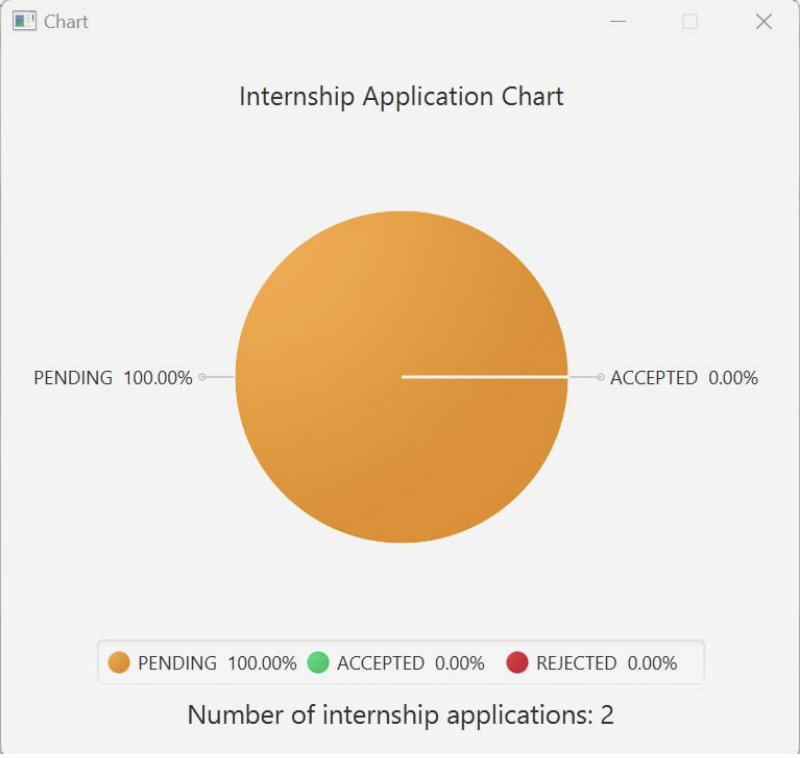

# HireMe Developer Guide

<!-- TOC -->
* [HireMe Developer Guide](#hireme-developer-guide)
  * [**Acknowledgements**](#acknowledgements)
  * [**Setting up, getting started**](#setting-up-getting-started)
  * [**Design**](#design)
    * [Architecture](#architecture)
    * [UI component](#ui-component)
    * [Logic component](#logic-component)
    * [Model component](#model-component)
    * [Storage component](#storage-component)
    * [Common classes](#common-classes)
  * [**Implementation**](#implementation)
    * [Getting help](#getting-help)
    * [Add new internship application](#add-new-internship-application)
    * [List all internship applications](#list-all-internship-applications)
    * [Delete an internship application](#delete-an-internship-application)
    * [Update the status of an internship application](#update-the-status-of-an-internship-application)
    * [Find internship applications](#find-internship-applications)
    * [Filter internship applications](#filter-internship-applications)
    * [Sort internship application list](#sort-internship-application-list)
    * [Clear](#clear)
    * [View chart](#view-chart)
    * [Close the application](#close-the-application)
  * [**Documentation, logging, testing, configuration, dev-ops**](#documentation-logging-testing-configuration-dev-ops)
  * [**Appendix: Requirements**](#appendix-requirements)
    * [Product scope](#product-scope)
    * [User stories](#user-stories)
    * [Use cases](#use-cases)
    * [Non-Functional Requirements](#non-functional-requirements)
    * [Glossary](#glossary)
  * [**Appendix: Instructions for manual testing**](#appendix-instructions-for-manual-testing)
    * [Launch](#launch)
    * [Help Window](#help-window)
    * [Adding an internship application](#adding-an-internship-application)
    * [Deleting an internship application](#deleting-an-internship-application)
    * [Sorting the list of internship applications](#sorting-the-list-of-internship-applications)
    * [Finding internship applications](#finding-internship-applications)
    * [Updating the status of an internship application](#updating-the-status-of-an-internship-application)
    * [Saving data](#saving-data)
    * [Exit HireMe](#exit-hireme-application)
  * [**Appendix: Planned Enhancements**](#appendix-planned-enhancements)
  * [**Appendix: Known Issues**](#appendix-known-issues)
<!-- TOC -->
<page-nav-print />

--------------------------------------------------------------------------------------------------------------------

## **Acknowledgements**
- HireMe is based on the AddressBook-Level3 project created by the SE-EDU initiative
- It incorporates the following third-party libraries: JavaFX, Jackson, JUnit5.

--------------------------------------------------------------------------------------------------------------------

## **Setting up, getting started**

Refer to the guide [_Setting up and getting started_](SettingUp.md).

--------------------------------------------------------------------------------------------------------------------

## **Design**

### Architecture

<puml src="diagrams/ArchitectureDiagram.puml" width="280" />

The ***Architecture Diagram*** given above explains the high-level design of the App.

Given below is a quick overview of main components and how they interact with each other.

**Main components of the architecture**

**`Main`** (consisting of classes [`Main`](https://github.com/AY2425S1-CS2103T-W09-3/tp/tree/master/src/main/java/seedu/hireme/Main.java) and [`MainApp`](https://github.com/AY2425S1-CS2103T-W09-3/tp/tree/master/src/main/java/seedu/hireme/MainApp.java)) is in charge of the app launch and shut down.
* At app launch, it initializes the other components in the correct sequence, and connects them up with each other.
* At shut down, it shuts down the other components and invokes cleanup methods where necessary.

The bulk of the app's work is done by the following four components:

* [**`UI`**](#ui-component): The UI of the App.
* [**`Logic`**](#logic-component): The command executor.
* [**`Model`**](#model-component): Holds the data of the App in memory.
* [**`Storage`**](#storage-component): Reads data from, and writes data to, the hard disk.

[**`Commons`**](#common-classes) represents a collection of classes used by multiple other components.

**How the architecture components interact with each other**

The *Sequence Diagram* below shows how the components interact with each other for the scenario where the user issues the command `/delete 1`.

<puml src="diagrams/ArchitectureSequenceDiagram.puml" width="574" />

> **_NOTE:_** The sequence diagram shows a simplified execution of the DeleteCommand.

  
Each of the four main components (also shown in the diagram above),

* defines its *API* in an `interface` with the same name as the Component.
* implements its functionality using a concrete `{Component Name}Manager` class which follows the corresponding API `interface` mentioned in the previous point.

For example, the `Logic` component defines its API in the `Logic.java` interface and implements its functionality using the `LogicManager.java` class which follows the `Logic` interface. Other components interact with a given component through its interface rather than the concrete class (reason: to prevent outside component's being coupled to the implementation of a component), as illustrated in the (partial) class diagram below.

<puml src="diagrams/ComponentManagers.puml" width="300" />

The sections below give more details of each component.

  

### UI component

The **API** of this component is specified in [`Ui.java`](https://github.com/AY2425S1-CS2103T-W09-3/tp/tree/master/src/main/java/seedu/hireme/ui/Ui.java).

<puml src="diagrams/UiClassDiagram.puml" alt="Structure of the UI Component"/>

The UI consists of a `MainWindow` that is made up of parts e.g.`CommandBox`, `ResultDisplay`, `InternshipApplicationListPanel`, `StatusBarFooter` etc. All these, including the `MainWindow`, inherit from the abstract `UiPart` class which captures the commonalities between classes that represent parts of the visible GUI.

The `UI` component uses the JavaFx UI framework. The layout of these UI parts are defined in matching `.fxml` files that are in the `src/main/resources/view` folder. For example, the layout of the [`MainWindow`](https://github.com/AY2425S1-CS2103T-W09-3/tp/tree/master/src/main/java/seedu/hireme/ui/MainWindow.java) is specified in [`MainWindow.fxml`](https://github.com/AY2425S1-CS2103T-W09-3/tp/tree/master/src/main/resources/view/MainWindow.fxml).

The `UI` component,

* executes user commands using the `Logic` component.
* listens for changes to `Model` data so that the UI can be updated with the modified data.
* keeps a reference to the `Logic` component, because the `UI` relies on the `Logic` to execute commands.
* depends on some classes in the `Model` component, as it displays `InternshipApplication` object residing in the `Model`.

The `HelpWindow` component is shown when you execute a help command. It contains a link to the detailed user and developer guide on this HireMe documentation website.

The `ChartWindow` component is shown when you execute a chart command. It contains a visual representation of the various statuses of your internship applications, in the form of a pie chart.

  

### Logic component

**API** : [`Logic.java`](https://github.com/AY2425S1-CS2103T-W09-3/tp/tree/master/src/main/java/seedu/hireme/logic/Logic.java)

Here's a (partial) class diagram of the `Logic` component:

<puml src="diagrams/LogicClassDiagram.puml" width="550"/>

How the `Logic` component works:

1. When `Logic` is called upon to execute a command, it is passed to an `AddressBookParser` object which in turn creates a parser (if necessary) that matches the command (e.g., `DeleteCommandParser`) and uses it to parse the command.
1. This results in a `Command` object (more precisely, an object of one of its subclasses e.g., `DeleteCommand`) which is executed by the `LogicManager`.
1. The command can communicate with the `Model` when it is executed (e.g. to delete an internship application). 
   Note that although this is shown as a single step in the diagram above (for simplicity), in the code it can take several interactions (between the command object and the `Model`) to achieve.
1. The result of the command execution is encapsulated as a `CommandResult` object which is returned back from `Logic`.

Here are the other classes in `Logic` (omitted from the class diagram above) that are used for parsing a user command:

<puml src="diagrams/ParserClasses.puml" width="600"/>

How the parsing works:
* When called upon to parse a user command, the `AddressBookParser` class creates an `XYZCommandParser` (`XYZ` is a placeholder for the specific command name e.g., `AddCommandParser`) which uses the other classes shown above to parse the user command and create a `XYZCommand` object (e.g., `AddCommand`) which the `AddressBookParser` returns back as a `Command` object.
* All `XYZCommandParser` classes (e.g., `AddCommandParser`, `DeleteCommandParser`, ...) inherit from the `Parser` interface so that they can be treated similarly where possible e.g, during testing.

  

### Model component
**API** : [`Model.java`](https://github.com/AY2425S1-CS2103T-W09-3/tp/tree/master/src/main/java/seedu/hireme/model/Model.java)

<puml src="diagrams/ModelClassDiagram.puml" width="450" />

The `Model` component,

* stores HireMe data i.e., all `InternshipApplication` objects (which are contained in a `UniqueList` object).
* stores the currently 'selected' `InternshipApplication` objects (e.g., results of a search query) as a separate _filtered_ list which is exposed to outsiders as an unmodifiable `ObservableList<InternshipApplication>` that can be 'observed' e.g. the UI can be bound to this list so that the UI automatically updates when the data in the list change.
* stores a `UserPref` object that represents the user’s preferences. This is exposed to the outside as a `ReadOnlyUserPref` objects.
* does not depend on any of the other three components (as the `Model` represents data entities of the domain, they should make sense on their own without depending on other components)
  

### Storage component

**API** : [`Storage.java`](https://github.com/AY2425S1-CS2103T-W09-3/tp/tree/master/src/main/java/seedu/hireme/storage/Storage.java)

<puml src="diagrams/StorageClassDiagram.puml" width="550" />

The `Storage` component,
* can save both address book data and user preference data in JSON format, and read them back into corresponding objects.
* inherits from both `AddressBookStorage` and `UserPrefStorage`, which means it can be treated as either one (if only the functionality of only one is needed).
* depends on some classes in the `Model` component (because the `Storage` component's job is to save/retrieve objects that belong to the `Model`)

  

### Common classes

Classes used by multiple components are in the `seedu.hireme.commons` package.

--------------------------------------------------------------------------------------------------------------------

## **Implementation**

This section describes some noteworthy details on how certain features are implemented.

### Getting help
The implementation of the command follows the convention of a normal command, where `AddressBookParser` is responsible for parsing the user input string into an executable command.
In this case, since there are no additional parameters for the help command, `AddressBookParser` does not create any parser object.

<puml src="diagrams/HelpSequenceDiagram.puml" alt="HelpSequenceDiagram" />

`AddressBookParser` ensures that there are no additional parameters provided. If there are parameters found, `AddressBookParser` throws a ParseException.
Otherwise, it creates a new instance of `HelpCommand`.

Upon execution, `HelpCommand` returns an instance of `CommandResult` which contains the help message.

> **_NOTE:_** `Model` is not invoked here but included for the sake of clarity.

  

### Add new internship application
The implementation of the add command follows the convention of a normal command, where `AddressBookParser` is responsible for parsing the user input string into an executable command.

In this case, `AddressBookParser` creates `AddCommandParser` to parse user input string.

<puml src="diagrams/AddSequenceDiagram.puml" alt="AddSequenceDiagram" />

`AddressBookParser` first obtains the values corresponding to the prefixes `n/`, `r/`, `e/` and `d/`.
`AddressBookParser` ensures that:
- All values corresponding to the prefixes are valid.
  If any of the above constraints are violated, `AddressBookParser` throws a ParseException. Otherwise, it creates a new instance of `AddCommand` that corresponds to the user input.
`AddCommand` comprises of the internship application to be added, which is an instance of `InternshipApplication`.

Upon execution, `AddCommand` first queries the supplied model if it contains a duplicate internship application. If no duplicate internship application exists, then `AddCommand` adds the internship application into the data.

> **_NOTE:_**  The sequence diagram shows a simplified execution of the AddCommand. HireMe identifies an entry as a duplicate if its `NAME`, `ROLE`, `EMAIL` and `DATE` match **(case-insensitive)** with those of an existing internship application entry. Attempting to add a duplicate will result in an error.

  

### List all internship applications
The implementation of the list command follows the convention of a normal command, where `AddressBookParser` is responsible for parsing the user input string into an executable command.

<puml src="diagrams/ListSequenceDiagram.puml" alt="ListSequenceDiagram" />

`AddressBookParser` creates `ListCommand.
Upon execution, `ListCommand` calls on `m::updateFilteredList` to show all internship applications.
> **_NOTE:_** The sequence diagram shows a simplified execution of the ListCommand.

  

### Delete an internship application

The implementation of the delete command follows the convention of a normal command, where `AddressBookParser` is responsible for parsing the user input string into an executable command.

In this case, `AddressBookParser` creates `DeleteCommandParser` to parse user input string.

<puml src="diagrams/DeleteSequenceDiagram.puml" alt="DeleteSequenceDiagram" />

`AddressBookParser` first obtains the index from the user's input.
`AddressBookParser` ensures that there is only one parameter found which is a number. If there is no valid parameter found, `AddressBookParser` throws a ParseException.
Otherwise, it creates a new instance of `DeleteCommand` that corresponds to the user input.
`DeleteCommand` comprises of a `targetIndex` which is the zero based index number of the internship application to be deleted.

Upon execution, `DeleteCommand` gets the internship application to be deleted and calls on `m::deleteItem` which deletes it from the list.
> **_NOTE:_** The sequence diagram shows a simplified execution of the DeleteCommand.

  

### Update the status of an internship application

The `StatusCommand` updates the status of an internship application to `PENDING`, `ACCEPTED`, or `REJECTED`, triggered by commands `/pending`, `/accept`, or `/reject` respectively. The implementation of the status command follows the convention of a normal command, where `AddressBookParser` is responsible for parsing the user input string into an executable command.

In this case, `AddressBookParser` creates `StatusCommandParser` to parse user input string.

<puml src="diagrams/StatusSequenceDiagram.puml" alt="StatusSequenceDiagram" />

The sequence diagram above illustrates the flow for the `/accept` command. Similar flows apply for `/reject` and `/pending`.

`AddressBookParser` first obtains the index from the user's input.  
`AddressBookParser` ensures that there is only one parameter found, which is a number. If no valid parameter is found, `AddressBookParser` throws a `ParseException`. Otherwise, it creates a new instance of `StatusCommand` based on the user input, with the `StatusCommand` containing the target index and specified status.

Upon execution, `StatusCommand` retrieves the internship application to be updated and calls `m::setItem` to update the status within the list.
> **_NOTE:_** The sequence diagram shows a simplified execution of the StatusCommand.

  
<puml src="diagrams/StatusActivityDiagram.puml" alt="StatusActivityDiagram" />

The activity diagram above outlines the detailed flow for the `StatusCommand`, showing the decision points and actions taken during the command execution.

  

### Find internship applications
The implementation of the find command follows the convention of a normal command, where `AddressBookParser` is responsible for parsing the user input string into an executable command.

In this case, `AddressBookParser` creates `FindCommandParser` to parse user input string.

<puml src="diagrams/FindSequenceDiagram.puml" alt="FindSequenceDiagram" />

`AddressBookParser` first obtains the keyword from the user's input.
`AddressBookParser` ensures that there is at least one keyword found. If there is no keyword found, `AddressBookParser` throws a ParseException.
Otherwise, it creates a new instance of `FindCommand` that corresponds to the user input.
  `FindCommand` comprises of a `NameContainsKeywordsPredicate`.

Upon execution, `FindCommand` calls on `m::updateFilteredList` which in turns calls on `filteredList::setPredicate`.
`setPredicate` updates the `filteredList` in `Model` to contain all the internship applications with company name that starts with the keyword.

  

### Filter internship applications

The implementation of the filter command follows the convention of a normal command, where `AddressBookParser` is responsible for parsing the user input string into an executable command.
`AddressBookParser` creates `FilterCommandParser` to parse user input string.

In this case, `AddressBookParser` creates `FilterCommandParser` to parse user input string.

<puml src="diagrams/FilterSequenceDiagram.puml" alt="FilterSequenceDiagram"/>

`AddressBookParser` first obtains the status from the user's input.
`AddressBookParser` ensures that the status is found. If there is no status found, `AddressBookParser` throws a ParseException.

Otherwise, it creates a new instance of `FilterCommand` that corresponds to the user input.
`FilterCommand` comprises of a `StatusPredicate`.

Upon execution, `FilterCommand` passes the instance of `StatusPredicate` to the model through the method `m::updateFilteredList`. The model then uses the predicate internally to update the displayed list of internship applications.

  

### Sort internship application list
The implementation of the command follows the convention of a normal command, where `AddressBookParser` is responsible for parsing the user input string into an executable command.

In this case, `AddressBookParser` creates `SortCommandParser` to parse user input string.

<puml src="diagrams/SortSequenceDiagram.puml" alt="SortSequenceDiagram" />

`AddressBookParser` first obtains the order from the user's input.
`AddressBookParser` ensures that there is only one parameter found which is the sorting order. If there is no valid parameter found, `AddressBookParser` throws a ParseException.
Otherwise, it creates a new instance of `SortCommand` that corresponds to the user input.
`SortCommand` comprises of a `DateComparator` which contains the sorting order, according to date of application, that the internship application list should be sorted by.

Upon execution, `SortCommand` calls on `m::sortFilteredList` which in turns calls on `addressBook::sortItems`which updates the `filteredList` in `Model` to sort the internship applications in the list according to the order specified by the user.

  

### Clear
The implementation of the command follows the convention of a normal command, where `AddressBookParser` is responsible for parsing the user input string into an executable command.

<puml src="diagrams/ClearSequenceDiagram.puml" alt="ClearSequenceDiagram" />

`AddressBookParser` creates `ClearCommand`. 
Upon execution, `ClearCommand` calls on `m::setAddressBook` with a new address book that has zero internship applications. Finally, `ClearCommand` generates a `CommandResult` with a confirmation message.
> **_NOTE:_** The sequence diagram shows a simplified execution of the ClearCommand.

  

### View chart
The implementation of the chart command follows the convention of a normal command, where `AddressBookParser` is responsible for parsing the user input string into an executable command.

<puml src="diagrams/ChartSequenceDiagram.puml" alt="ChartSequenceDiagram" />

`AddressBookParser` creates `ChartCommand`.
Upon execution, `ChartCommand` gets the chart data which is encapsulated in `CommandResult`.

  

### Close the application
The implementation of the command follows the convention of a normal command, where `AddressBookParser` is responsible for parsing the user input string into an executable command.

<puml src="diagrams/ExitSequenceDiagram.puml" alt="ExitSequenceDiagram" />

`AddressBookParser` creates `ExitCommand`.
Upon execution, `ExitCommand` encapsulates the intent to close the application in `CommandResult`.

> **_NOTE:_** `Model` is not invoked here but included for the sake of clarity.

  

--------------------------------------------------------------------------------------------------------------------

## **Documentation, logging, testing, configuration, dev-ops**

* [Documentation guide](Documentation.md)
* [Testing guide](Testing.md)
* [Logging guide](Logging.md)
* [Configuration guide](Configuration.md)
* [DevOps guide](DevOps.md)

--------------------------------------------------------------------------------------------------------------------

## **Appendix: Requirements**

### Product scope

**Target user profile**:

* studies Computer Science
* is constantly applying for internships
* has a need to keep track of significant number of internships
* can type fast
* prefers typing to mouse interaction
* is reasonably comfortable using CLI apps
* who doesn't have much time

**Value proposition**: HireMe is a free desktop application that helps you manage your extensive list of internship applications.

  

### User stories

Priorities: High (must have) - `* * *`, Medium (nice to have) - `* *`, Low (future plans) - `*`

| Priority | As a …​                     | I want to …​                                                                     | So that …​                                                               |
|----------|-----------------------------|----------------------------------------------------------------------------------|--------------------------------------------------------------------------|
| `* * *`  | CS Undergraduate            | list all the internship applications                                             | I can view all my past applications                                      |
| `* * *`  | Forgetful CS Undergraduate  | have a link to HireMe's user guide                                               | I can see all the different commands that I can use                      |
| `* * *`  | Efficient CS Undergraduate  | type the commands                                                                | I do not have to lift my fingers off the keyboard                        |
| `* * *`  | CS Undergraduate            | add an internship application                                                    | I can add on to the records of all the internships I have applied to     |
| `* * *`  | CS Undergraduate            | delete an internship application                                                 | I can remove invalid or irrelevant applications                          |
| `* * *`  | CS Undergraduate            | save the internship application data locally                                     | I will not lose my data when I exit the application                      |
| `* * *`  | CS Undergraduate            | load the internship from a saved file                                            | I can get back my data when I open the application                       |
| `* * *`  | CS Undergraduate            | clear the list of internship application I have saved                            | I can restart a new list in the next internship application cycle        |
| `* * *`  | CS Undergraduate            | update the status of an internship application to accepted, pending, or rejected | I can update the status of each application accurately                   |
| `* *`    | Meticulous CS Undergraduate | sort the list of internship applications by date of application                  | I can prioritize follow-ups with older applications                      |
| `* *`    | Curious CS Undergraduate    | see a chart that summarises the statuses of all my applications                  | I know the breakdown of each status                                      |
| `* * `   | CS Undergraduate            | find internship applications by company name                                     | I can quickly locate specific applications for review or updates         |
| `* * `   | CS Undergraduate            | filter internship applications by status                                         | I can quickly view all applications of a specific status to follow up    |
| `*`      | Organised CS Undergraduate  | view the interview dates for different internships applications                  | I can update my schedule accordingly                                     |
| `*`      | Efficient CS Undergraduate  | view my most desired internship applications by favouriting them                 | I can prioritize my time on checking up on these internship applications |
| `*`      | Forgetful CS Undergraduate  | remind myself of acceptance deadline                                             | I will not miss the deadline to accept                                   |
| `*`      | Organised CS Undergraduate  | filter internship applications by role                                           | I can find applications of certain role                                  |

  

### Use cases

**System**: HireMe application

**Use Case: UC01 - Add a new internship application**

**Actor**: User

**MSS (Main Success Scenario)**

1. The user requests to add a new internship application.
2. HireMe creates a new internship application.

   Use case ends.

**Extensions**

* 1a. The user has missing fields in input.
    * 1a1. HireMe shows an error message.

      Use case ends.

* 1b. The user provides some invalid input for field.
    * 1b1. HireMe shows an error message.

      Use case ends.
  
* 1c. The user provides multiple fields of the same type.
    * 1c1. HireMe shows an error message.

      Use case ends.

  
**System**: HireMe application

**Use Case: UC02 - Delete an internship application**

**Actor**: User

**MSS (Main Success Scenario)**

1. The user requests to delete a particular internship application.
2. HireMe deletes the application.

   Use case ends.

**Extensions**

* 1a. The user provides an invalid index.

    * 1a1. HireMe shows an error message.

      Use case ends.

  
**System**: HireMe application

**Use Case: UC03 - Sort internship applications list**

**Actor**: User

**MSS (Main Success Scenario)**

1. The user requests to sort the internship applications list.
2. HireMe shows the sorted list of internship applications.

   Use case ends.

**Extensions**

* 1a. The user provides an invalid number of parameters.
    * 1a1. HireMe shows an error message 
  
      Use case ends.

* 1b. The user provides an invalid order.
    * 1b1. HireMe shows an error message.
  
      Use case ends.
  
  
**System**: HireMe application

**Use Case: UC04 - Find internship applications by company name**

**Actor**: User

**MSS (Main Success Scenario)**

1. The user requests to find internship applications by entering a search pattern (e.g., `/find Goo`).
2. HireMe searches for internship applications with company names that contain words starting with the specified pattern.
3. HireMe shows a list of all matching internship applications.

   Use case ends.

**Extensions**

* 1a. The user provides an empty search pattern.

    * 1a1. HireMe shows an error message.

      Use case ends.

* 1b. The provides search pattern matches no company names.

    * 1b1. HireMe shows an empty list.

      Use case ends.

  
**System**: HireMe application

**Use Case: UC05 - Update the status of an internship application**

**Actor**: User

**MSS (Main Success Scenario)**

1. The user requests to change the status of an internship application by specifying an index and the desired status (e.g., `/accept 2`, `/reject 3`, `/pending 4`).
2. HireMe updates the status of the specified internship application to either `ACCEPTED`, `REJECTED`, or `PENDING`.

   Use case ends.

**Extensions**

* 1a. The user provides an invalid index.
  
    * 1a1. HireMe shows an error message.

      Use case ends.

  
**System**: HireMe application

**Use Case: UC06 - List all internship applications**

**Actor**: User

**MSS (Main Success Scenario)**

1. The user requests to list all internship applications.
2. HireMe shows all internship applications.

   Use case ends.

**Extensions**

* 1a. The user provides an invalid number of parameters.

    * 1a1. HireMe shows an error message

      Use case ends.

  
**System**: HireMe application

**Use Case: UC07 - Summarise all internship applications**

**Actor**: User

**MSS (Main Success Scenario)**

1. The user requests to view a summary of all internship applications.
2. HireMe shows a summary chart of all internship applications.

   Use case ends.

**Extensions**

* 1a. The user provides an invalid number of parameters.

    * 1a1. HireMe shows an error message.

      Use case ends.

  
**System**: HireMe application

**Use Case: UC08 - Filter internship applications by status**

**Actor**: User

**MSS (Main Success Scenario)**

1. The user requests to filter internship applications by status.
2. HireMe shows all internship applications with the provided status.

   Use case ends.

**Extensions**
* 1a. The user provides an invalid status.

    * 1a1. HireMe shows an error message.

      Use case ends.

  
**System**: HireMe application

**Use Case: UC09 - Clear internship application list**

**Actor**: User

**MSS (Main Success Scenario)**

1. The user requests to clear the internship application list.
2. HireMe clears the internship application list.

   Use case ends.

**Extensions**

* 1a. The user provides an invalid number of parameters.

    * 1a1. HireMe shows an error message.

      Use case ends.

  
**System**: HireMe application

**Use Case: UC10 - Exit HireMe application**

**Actor**: User

**MSS (Main Success Scenario)**

1. The user requests to exit the application.
2. HireMe application exits and auto-saves the file.

   Use case ends.

**Extensions**

* 1a. The user provides an invalid number of parameters.

    * 1a1. HireMe shows an error message.

      Use case ends.

  

### Non-Functional Requirements

1. **Performance**: The application should respond to user actions within **two seconds**.
2. **Reliability**: The application should be able to **perform effectively** over time without errors or failures.
3. **Scalability**: The application should handle **at least 500 internship applications** without any performance issues (e.g. lag or slowness).
4. **Cross-Platform Compatibility**: The application should run on any operating system that has **Java 17 or above** installed.
5. **User Accessibility**: The application should be usable by a **novice** with no prior experience using a CLI application, without much difficulty.
6. **Maintainability**: The application should log useful information together with any errors that occur. The logs should be **easily accessible** to enable easier debugging and monitoring.
7. **Data Persistence**: The application should ensure that data **persists** after the user closes the application.
8. **Data Integrity**: Upon reopening the application, the **loaded data** should be identical to the **last saved state** and should not be volatile.
9. **Efficiency**: The application **should not use too much memory** to prevent the user's computer from slowing down when using our application
10. **Documentation**: The application should be **well documented** for users, which include command-line operations usages, as well as support for installing and troubleshooting. The code base should be well documented for future developers, allowing them to maintain, debug, test, and scale the system easily.
11. **Testability**: The application's core features should be covered by **integration and unit tests**. Instructions should be included on how to conduct **manual testing**.
12. **Stability**: The application should be able to **recover from errors**. It should not be crashing or losing data.

  

### Glossary

- **Application Status**:
    - **PENDING**: The internship application is currently in progress.
    - **REJECTED**: The user has rejected or been rejected from this internship application.
    - **ACCEPTED**: The user has accepted the offer for this internship.

- **Action**: The task carried out by the HireMe application such as Add, Delete, Update entries.

- **Command Line Interface (CLI)**: The user interacts with the computer by typing text commands instead of using a mouse to click on buttons or icons. As if giving instructions to execute a desired action.

- **Command**: The string the user types into the HireMe application’s command bar to carry out a particular action.

- **Command Bar**: The input bar at the top of the HireMe application which allows users to type in a string command.

- **Company Email**: The email of the company that the user is applying for an internship role at.

- **Company Name**: The name of the company that the user is applying for an internship role at.

- **Graphical User Interface (GUI)**: The user interacts with the computer using visual elements like buttons, icons and windows. 

- **Index**: The application number of the internship application displayed in the list.

- **Role**: The role of the internship the user applied for.

--------------------------------------------------------------------------------------------------------------------

## **Appendix: Instructions for manual testing**

Given below are instructions to test the app manually.

<box type="info" seamless>

**Note:** These instructions only provide a starting point for testers to work on;
testers are expected to do more *exploratory* testing.

</box>

  

### Launch

1. Initial launch

   1. Download the jar file and copy into an empty folder

   2. Run `java -jar hireme.jar` in a terminal.  
      Expected: Shows the GUI with a set of sample internship applications. The window size may not be optimum.

2. Saving window preferences

   1. Resize the window to an optimum size. Move the window to a different location. Close the window.

   2. Re-launch the app by running `java -jar hireme.jar` in a terminal. 
       Expected: The most recent window size and location is retained.
      
  

### Help Window
1. Opening Help window via Command Line

   1. Prerequisite: Help window is not open.

   2. Test case: `/help`  
      Expected: Help window opens.

1. Opening Help window via `F1`

    1. Prerequisite: Help window is not open.

    2. Test case: Click the `F1` key on your keyboard.  
       Expected: Help window opens.

1. Opening Help window via Tool Bar

    1. Prerequisite: Help window is not open.

    2. Test case: Click on the `Help` button on the Tool Bar, and then click on the `Help F1` button on the drop down. 
       Expected: Help window opens.

1. Minimising the Help window

   1. Prerequisite: Help window is not open.

   2. Test case: `/help`  
      Expected: Help window opens.

   3. Test case: Click on the minimise button of the Help window. 
      Expected: Help window minimises.

   4. Test case: `/help` after the Help window is minimised. 
      Expected: Help window does not pop open.

1. Closing the Help window

   1. Prerequisite: Help window is open.

   2. Test case: Click on the close button on the Help window.  
      Expected: Help window closes.

  

### Clearing the internship application list
1. Clear the internship application list

    1. Prerequisites: Ensure that the list is not empty. 

    2. Test case: `/clear` 
       Expected: A success message stating that HireMe has been cleared.
   
    3. Test case: `/list` after the internship application list is cleared 
       Expected: The list of internship application remains empty.

   4. Test case: `/clear x` 
       Expected: An error message stating the valid use of the `/clear` command.

  

### Adding an internship application
1. Adding a valid internship application

   1. Prerequisite: The exact internship application should not already be in the list.

   2. Test case: `/add n/Google r/Software Engineer Intern e/google@gmail.com d/31/10/24` 
      Expected: An internship application is successfully added, with the company name, company email, role and date of application being `Google`, `google@gmail.com`, `Software Engineer Intern`, `31/10/24`, respectively. The status of newly added internship application would be `Pending`.

2. Adding another valid internship application

   1. Prerequisite: The exact internship application should not already be in the list.

   2. Test case: `/add n/Yahoo r/Clerk e/yahoo@yahoo.com d/31/10/24` 
      Expected: An internship application is successfully added, with the company name, company email, role and date of application being `Yahoo`, `yahoo@yahoo.com`, `Clerk`, `31/10/24`, respectively. The status of newly added internship application would be `Pending`.

3. Adding a duplicate internship application

   1. Prerequisite: The exact internship application should already be in the list.

   2. Test case: `/add n/Yahoo r/Clerk e/yahoo@yahoo.com d/31/10/24` 
      Expected: An error message stating that the internship application already exists in the list.

4. Adding internship application with invalid fields

   1. Missing/Invalid Company Name test case: `/add n/ r/Software Engineer Intern e/google@gmail.com d/31/10/24`  
      Expected: An error message stating what is considered a valid Company Name. 
      1. Other invalid Company Names include: `<oding lab`, `|-|appy Days`, `@pple`. 

   2. Missing/Invalid Role test case: `/add n/Google r/ e/google@gmail.com d/31/10/24`  
      Expected: An error message stating what is considered a valid Role. 
      1. Other invalid Roles include: `Software_Engineer_Intern`, `Cl-erk`. 

   3. Missing/Invalid Email test case: `/add n/Google r/Software Engineer Intern e/ d/31/10/24` 
      Expected: An error message stating what is considered a valid Email.
      1. Other invalid Emails include: `@gmail.com`, `google.com`, `domainLabelTooShort@gmail.x`. 

   4. Missing/Invalid Date test case: `/add n/Google r/Software Engineer Intern e/google@gmail.com d/` 
      Expected: An error message stating what is considered a valid Date.
      1. Other invalid Dates include: Dates in the future (Relative to device's clock), `30/02/2024`, `31/04/2024`. 

   5. Adding internship application with missing field(s)
      1. Test case: `/add n/Google r/Software Engineer Intern e/google@gmail.com` 
      Expected: An error message stating the valid use of the `/add` command.

  

### List
1. List all internship applications

    1. Prerequisites: Ensure that the list is not empty. 
   
    2. Test case: `/list` 
       Expected: The list should display all internship applications.

    3. Test case: `/list x` 
       Expected: An error message stating the valid use of the `/list` command.

  

### Deleting an internship application
1. Deleting an internship application while all internship applications are being shown

   1. Prerequisites: List all internship applications using the `/list` command. At least two internship applications in the list.

   2. Test case: `/delete 1` 
      Expected: First application is deleted from the list. Details of the deleted application shown.

   3. Test case: `/delete 0` 
      Expected: No internship application is deleted. An error message should be shown which explains how to use the delete command and what parameters are valid.

   4. Other incorrect delete commands to try: `/delete`, `/delete x`, `...`, `/delete a` (where x is larger than the list size) 
      Expected: An error message should be shown which explains how to use the delete command and what parameters are valid.

  

### Sorting the list of internship applications

1. Sort the entire list of internship applications

    1. Prerequisites: List all internship applications using the `/list` command. At least two internship applications in the list with different date of applications.

    2. Test case: `/sort earliest` 
       Expected: The list of internship applications should now be sorted in ascending order by the date of application. The earliest internship applications should be at the top
       of the list and as you go down the list, the date of applications should be at later dates.

    3. Test case: `/sort latest` 
       Expected: The list of internship applications should now be sorted in descending order by the date of application. The latest internship applications should be at the top
       of the list and as you go down the list, the date of applications should be at earlier dates.

    4. Other incorrect sort commands to try: `/sort`, `/sort test`, `/sort earliest latest`, `/sort 1` 
       Expected: An error message should be shown which explains how to use the sort command and what parameters are valid.

  

### Finding internship applications
1. Find using an exact match

    1. Prerequisites: The list should have only two internship applications added with company names such as "Google" and "Yahoo".
   
    2. Test case: `/find Google` 
       Expected: The internship application with the company name "Google" is displayed.

2. Find using a case-insensitive pattern

    1. Prerequisites: The list should have only two internship applications with company names like "Google" and "Yahoo".
   
    2. Test case: `/find google` 
       Expected: The internship application with the company name "Google" is displayed, showing that the search is case-insensitive.
   
    3. Test case: `/find YAHOO` 
       Expected: The internship application with the company name "Yahoo" is displayed.

3. Find with partial matches

    1. Prerequisites: The list should have only two internship applications with company names like "Google" and "Yahoo".
   
    2. Test case: `/find Goo` 
       Expected: The internship application with the company name "Google" is displayed.
   
    3. Test case: `/find Y` 
       Expected: The internship application with the company name "Yahoo" is displayed.

4. Find when no matches exist

    1. Prerequisites: The list contains only 2 applications, with company names "Google" and "Yahoo".
   
    2. Test case: `/find Microsoft` 
       Expected: The list of internship applications is empty

5. Find with an empty pattern
   
   1. Test case: `/find` 
       Expected: An error message should be shown which explains how to use the find command and what parameters are valid.

  

### Updating the status of an internship application
1. Update status to `ACCEPTED`

    1. Prerequisites: Ensure that internship application with the company name "Google" is at index 1 and internship application with the company name "Yahoo" is at index 2
   
    2. Test case: `/accept 1` 
       Expected: The status of the first application "Google" is updated to `ACCEPTED`.
   
    3. Test case: `/accept 0` 
       Expected: An error message should be shown which explains how to use the status command and what parameters are valid.

2. Update status to `PENDING`

    1. Prerequisites: Ensure that internship application with the company name "Google" is at index 1 and internship application with the company name "Yahoo" is at index 2
   
    2. Test case: `/pending 2` 
       Expected: The status of the second application "Yahoo" is updated to `PENDING`.

3. Update status to `REJECTED`

    1. Prerequisites: Ensure that internship application with the company name "Google" is at index 1 and internship application with the company name "Yahoo" is at index 2
   
    2. Test case: `/reject 1` 
       Expected: The status of the first application "Google" is updated to `REJECTED`.

  

### Chart Window
1. Open Chart window

    1. Prerequisites: List all internship applications using the `/list` command. Ensure that there are at least two internship applications with different statuses and the Chart window is not opened.
   
    2. Test case `/chart` 
       Expected: Chart window opens.

2. Open Chart window with invalid command format

    1. Prerequisites: List all internship applications using the `/list` command. Ensure that there are at least two internship applications with different statuses and the Chart window is not opened.
   
    2. Test case: `/chart x` 
       Expected: An error message stating the valid use of the `/chart` command.

3. Update Chart window by updating status

   1. Prerequisites: List all internship applications using the `/list` command. Ensure that the internship application at index 1 is of `PENDING` status and the Chart window is already opened.
   
   2. Test case: `/accept 1` 
      Expected: Pie chart on Chart window to update accordingly.

4. Update Chart window by adding an internship application

   1. Prerequisites: List all internship applications using the `/list` command. Ensure that there is at least one internship application, `Google` is not in list, and the Chart window is already opened.
   
   2. Test case: `/add n/Google r/Software Engineer Intern e/google@gmail.com d/31/10/24` 
      Expected: Pie chart on Chart window to update accordingly.

5. Update Chart window by deleting an internship application

   1. Prerequisites: List all internship applications using the `/list` command. Ensure that there are at least two internship applications and the Chart window is already opened.
   
   2. Test case: `/delete 1` 
      Expected: Pie chart on Chart window to update accordingly.

6. Close Chart window

   1. Prerequisites: Chart window is already opened.
   
   2. Test case: Click on the close button on the Chart window.  
      Expected: Chart window closes.

  

### Filtering internship applications
1. Filter with a valid status in uppercase

   1. Prerequisites: List all internship applications using the `/list` command. Ensure that there is at least one internship application with `PENDING` status.
   
   2. Test case `/filter PENDING` 
      Expected: The list of internship applications should only display entries with `PENDING` status.

2. Filter with a valid status in mixed case

   1. Prerequisites: List all internship applications using the `/list` command. Ensure that there is at least one internship application with `PENDING` status.
    
   2. Test case `/filter Pending` 
      Expected: The list of internship applications should only display entries with `PENDING` status.

3. Filter an empty list

    1. Prerequisites: Clear all internship applications using the `/clear` command.

    2. Test case `/filter PENDING` 
       Expected: The list of internship applications remains empty.
       
4. Filter with an invalid status

   1. Prerequisites: List all internship applications using the `/list` command. Ensure that the list is not empty.
   
   2. Test case `/filter approved` 
      Expected: An error message indicating that the status is invalid.

5. Filter with an empty status

   1. Prerequisites: Clear all internship applications using the `/list` command. Ensure that the list is not empty.
   
   2. Test case `/filter` 
      Expected: An error message indicating that the status is invalid.

  

### Saving data
1. Auto saves file

   1. Prerequisites: List all internship applications using the `/list` command. Ensure that the list is not empty.

   2. Test case: `/exit` and open the HireMe application again 
      Expected: The list of internship applications previously saved are displayed.

  

### Exit HireMe Application
1. Exit via Window's close button

   1. Test case: Close the window by clicking on the Window's close button. 
      Expected: The window should close.

2. Exit via exit command

   1. Test case: `/exit` to close the window. 
      Expected: The window should close.

--------------------------------------------------------------------------------------------------------------------

## **Appendix: Planned Enhancements**
The team consists of 5 members.
Given below are enhancements planned for future versions.  

1. **Make 'Role' and 'Company Name' in the `add` command less restrictive** 
   - Current behaviour: The current validator is too restrictive on what is allowed as `Role` and `Company Name`. Valid roles such as: C++ Developer, C# Developer, R&D Specialist are currently flagged as invalid by the validator. Similarly, valid company names such as: A*STAR, SK-II, Yahoo!, John's Bakery are also flagged as invalid by the validator.   
   - Planned enhancement: We plan to loosen the restrictions for roles and company names by adjusting the regular expressions allowed.   
   - Justification: This allows the command to be more inclusive of the possible roles and company names in the real world.   

2. **Improve consistency in `find` feature** 
   - Current behaviour: The find feature currently allows special characters (e.g., ~\`!@#) to be used as keywords, despite these characters being disallowed in `Company Name`. This inconsistency can lead to a confusing user experience, as searches with these special characters will not yield any results.   
   - Planned enhancement: Implement validation in the find feature to restrict keywords to only valid characters that are allowed in `Company Name`. This will ensure that users can only search using characters that are present in actual company names.   
   - Justification: By enforcing consistency between allowed characters in `Company Name` and the `find` feature, we improve the user experience by preventing ineffective searches and aligning expectations for valid search terms.   

3. **Make error message for `add` command more specific** 
   - Current behaviour: The error message provided when the user inputs an invalid `add` command is too generic.
     For example, `/add n/Google r/SWE d/01/01/24` will provide an error message stating `Invalid command format!`. It does not provide additional information to the user, 
on why the command is invalid. The error message could be more specific to state the email field is missing.
     
   - Planned enhancement: We plan to improve the validator to be able to detect specifically why the command is invalid, and provide a more specific error message. 
     
   - Justification: In doing so, users will have a clearer idea on what they did wrong when they typed in the command and they will be able to easily fix the issue. This enables the users to have a more pleasant experience when using HireMe.
     

4. **Improve UI to deal with long texts**
   - Current behaviour: The current application does not allow the user to scroll horizontally across the internship application card. Hence, very long text will be cut off and users are unable to see the full text.   
   - Planned enhancement: We plan to allow horizontal scrolling for an internship application card when there are long texts.   
   - Justification: This lets the user see the full text in application.   

5. **Improve the validator for `email`**
   - Current behaviour: Although the current email validator accepts most valid email addresses, there are still certain valid email addresses (e.g. `faceb__k@fb.com.sg`) that it might incorrectly flag out as invalid addresses.   
   - Planned enhancement: A fix for the email validator to accept valid emails with more combinations of special characters.   
   - Justification: Company emails with uncommon combinations of special characters in their email addresses will be considered invalid and hence, users will not be able to include such internship application in the HireMe tracking system.   

6. **Improve error messaging for `status` commands**
   - Current behaviour: The `/accept`, `/pending`, and `/reject` commands currently return the same generic error message when there’s an error, despite each command serving a distinct purpose. This shared error message does not provide clarity on which specific command failed, potentially confusing the user.   
   - Planned enhancement: Separate error messages for each command (`/accept`, `/pending`, and `/reject`) within the status command to clarify which specific action encountered an error. This will help users understand and correct command-specific errors more effectively.   
   - Justification: By providing distinct error messages for each command, we improve the user experience by making error feedback more specific and actionable. Users will be able to identify errors related to each command easily, reducing potential confusion and enhancing usability.   

7. **Improve chart UI**
   
   - Current behaviour: When there are multiple statuses with zero internship applications, not all status labels are shown.   
   - Planned enhancement: Remove chart labels for statuses with zero internship applications.   
   - Justification: This ensures a consistent and user-friendly chart view which makes it easier for users to interpret the chart.   
   
8. **Remove the use of popup windows in HireMe**
    - Current behaviour 1: When the HireMe application is in full screen and the help or chart window popup is closed, the entire HireMe application crashes. If it does not crash, repeating these steps a few times will cause the crash to occur.
      For example, when the HireMe application is in full screen, /help or /chart will open up a help or a chart window respectively. Closing the popup window when the application is in full screen will cause the entire HireMe application to crash.
        
    - Current behaviour 2: When the help or chart windows are minimized, executing /help or /chart will not reopen the popup windows respectively.
      For example, similarly, when a user types in /help, minimizes the help window and tries to open it with /help again, the help window does not reopen. This also occurs when the user carries out the same steps with the chart window.
        
    - Planned enhancement: We plan to display help and chart content directly in the main application window rather than as popups. Users can return to the main list by typing /list, eliminating these popup issues.
        
    - Justification: This change will prevent crashes, improve reliability and resolve the issues above, creating a smoother user experience in HireMe.
        
   
9. **User confirmation for `clear` command**
    - Current behaviour: The `clear` command clears all internship applications without asking for user confirmation.   
    - Planned enhancement: HireMe to prompt the user for confirmation on `clear` command. If the user confirms, then all internship applications will be cleared. Otherwise, no action will be taken and the internship applications remain.   
    - Justification: HireMe does not support any form of undo action and hence, there is no safety mechanism against accidental clearing of internship applications by the user. By having a confirmation, it ensures that `clear` is only carried out deliberately.   
   
10. **Backup file for storage**
    - Current behaviour: Internship applications data is stored in a single data file `hireme.json`.   
    - Planned enhancement: A backup file that replicates the data in `hireme.json`.   
    - Justification: Having only a single data file to store internship applications data means having a single point of failure when the data in corrupted or lost. A backup file that synchronously replicates the data in `hireme.json` ensures data redundancy.   

## **Appendix: Known Issues**

1. If the user opens the application on a first monitor, then moves the application window to a second monitor and closes the application, then when the user tries to open the application again, the application would not work after opening. The current work around is that the user will then have to move the application window back to the first monitor for the application to work. 
