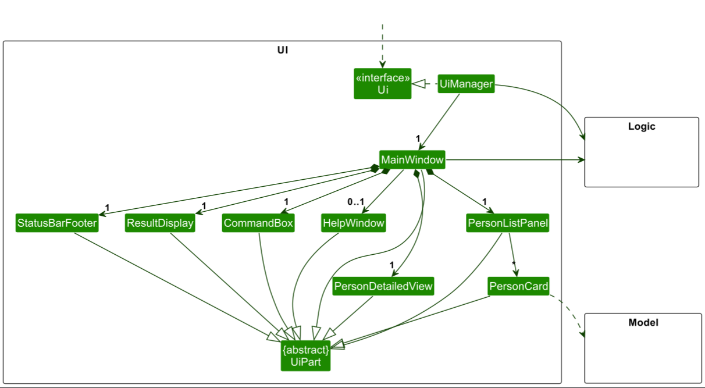
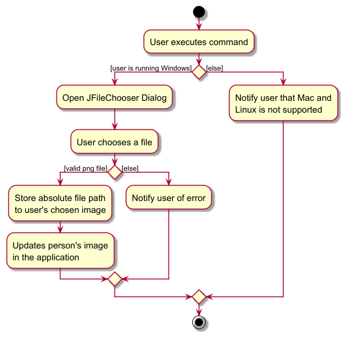

* Table of Contents
{:toc}

--------------------------------------------------------------------------------------------------------------------

## **Acknowledgements**

* The feature to filter file format for the Upload Command was adapted from this [StackOverflow post.](https://stackoverflow.com/questions/19302029/filter-file-types-with-jfilechooser) 

--------------------------------------------------------------------------------------------------------------------

## **Setting up, getting started**

Refer to the guide [_Setting up and getting started_](SettingUp.md).

--------------------------------------------------------------------------------------------------------------------

## **Design**

:bulb: **Tip:** The `.puml` files used to create diagrams in this document `docs/diagrams` folder. Refer to the [_PlantUML Tutorial_ at se-edu/guides](https://se-education.org/guides/tutorials/plantUml.html) to learn how to create and edit diagrams.

### Architecture

The ***Architecture Diagram*** given above explains the high-level design of the App.

Given below is a quick overview of main components and how they interact with each other.

**Main components of the architecture**

**`Main`** (consisting of classes [`Main`](https://github.com/AY2425S1-CS2103T-F14b-4/tp/blob/master/src/main/java/seedu/address/Main.java) and [`MainApp`](https://github.com/AY2425S1-CS2103T-F14b-4/tp/blob/master/src/main/java/seedu/address/MainApp.java)) is in charge of the app launch and shut down.
* At app launch, it initializes the other components in the correct sequence, and connects them up with each other.
* At shut down, it shuts down the other components and invokes cleanup methods where necessary.

The bulk of the app's work is done by the following four components:

* [**`UI`**](#ui-component): The UI of the App.
* [**`Logic`**](#logic-component): The command executor.
* [**`Model`**](#model-component): Holds the data of the App in memory.
* [**`Storage`**](#storage-component): Reads data from, and writes data to, the hard disk.

[**`Commons`**](#common-classes) represents a collection of classes used by multiple other components.

**How the architecture components interact with each other**

The *Sequence Diagram* below shows how the components interact with each other for the scenario where the user issues the command `delete 1`.

Each of the four main components (also shown in the diagram above),

* defines its *API* in an `interface` with the same name as the Component.
* implements its functionality using a concrete `{Component Name}Manager` class (which follows the corresponding API `interface` mentioned in the previous point.

For example, the `Logic` component defines its API in the `Logic.java` interface and implements its functionality using the `LogicManager.java` class which follows the `Logic` interface. Other components interact with a given component through its interface rather than the concrete class (reason: to prevent outside component's being coupled to the implementation of a component), as illustrated in the (partial) class diagram below.

The sections below give more details of each component.

### UI component

The **API** of this component is specified in [`Ui.java`](https://github.com/AY2425S1-CS2103T-F14b-4/tp/blob/master/src/main/java/seedu/address/ui/Ui.java)

The UI consists of a `MainWindow` that is made up of parts e.g.`CommandBox`, `ResultDisplay`, `PersonListPanel`, `StatusBarFooter`, `PersonDetailedView` etc. All these, including the `MainWindow`, inherit from the abstract `UiPart` class which captures the commonalities between classes that represent parts of the visible GUI.

The `UI` component uses the JavaFx UI framework. The layout of these UI parts are defined in matching `.fxml` files that are in the `src/main/resources/view` folder. For example, the layout of the [`MainWindow`](https://github.com/AY2425S1-CS2103T-F14b-4/tp/blob/master/src/main/java/seedu/address/ui/MainWindow.java) is specified in [`MainWindow.fxml`](https://github.com/AY2425S1-CS2103T-F14b-4/tp/blob/master/src/main/resources/view/MainWindow.fxml)

The `UI` component,

* executes user commands using the `Logic` component.
* listens for changes to `Model` data so that the UI can be updated with the modified data.
* keeps a reference to the `Logic` component, because the `UI` relies on the `Logic` to execute commands.
* depends on some classes in the `Model` component, as it displays `Person` object residing in the `Model`.

### Logic component

**API** : [`Logic.java`](https://github.com/AY2425S1-CS2103T-F14b-4/tp/blob/master/src/main/java/seedu/address/logic/Logic.java)

Here's a (partial) class diagram of the `Logic` component:

The sequence diagram below illustrates the interactions within the `Logic` component, taking `execute("delete 1")` API call as an example.

:information_source: **Note:** The lifeline for `DeleteCommandParser` should end at the destroy marker (X) but due to a limitation of PlantUML, the lifeline continues till the end of diagram.

How the `Logic` component works:

1. When `Logic` is called upon to execute a command, it is passed to an `AddressBookParser` object which in turn creates a parser that matches the command (e.g., `DeleteCommandParser`) and uses it to parse the command.
1. This results in a `Command` object (more precisely, an object of one of its subclasses e.g., `DeleteCommand`) which is executed by the `LogicManager`.
1. The command can communicate with the `Model` when it is executed (e.g. to delete a person). 
   Note that although this is shown as a single step in the diagram above (for simplicity), in the code it can take several interactions (between the command object and the `Model`) to achieve.
2. If the command is one that triggers a `ConfirmationHandler`, e.g. delete, clear, add (duplicate), the `ConfirmationHandler` object will handle whether the user confirms or cancels the action. 
1. The result of the command execution is encapsulated as a `CommandResult` object which is returned back from `Logic`.

Here are the other classes in `Logic` (omitted from the class diagram above) that are used for parsing a user command:

How the parsing works:
* When called upon to parse a user command, the `AddressBookParser` class creates an `XYZCommandParser` (`XYZ` is a placeholder for the specific command name e.g., `AddCommandParser`) which uses the other classes shown above to parse the user command and create a `XYZCommand` object (e.g., `AddCommand`) which the `AddressBookParser` returns back as a `Command` object.
* All `XYZCommandParser` classes (e.g., `AddCommandParser`, `DeleteCommandParser`, ...) inherit from the `Parser` interface so that they can be treated similarly where possible e.g, during testing.

### Model component
**API** : [`Model.java`](https://github.com/AY2425S1-CS2103T-F14b-4/tp/blob/master/src/main/java/seedu/address/model/Model.java)

The `Model` component,

* stores the address book data i.e., all `Person` objects (which are contained in a `UniquePersonList` object).
* stores the currently 'selected' `Person` objects (e.g., results of a search query) as a separate _filtered_ list which is exposed to outsiders as an unmodifiable `ObservableList<Person>` that can be 'observed' e.g. the UI can be bound to this list so that the UI automatically updates when the data in the list change.
* stores a `UserPref` object that represents the user’s preferences. This is exposed to the outside as a `ReadOnlyUserPref` objects.
* does not depend on any of the other three components (as the `Model` represents data entities of the domain, they should make sense on their own without depending on other components)

:information_source: **Note:** An alternative (arguably, a more OOP) model is given below. It has a `Tag` list in the `AddressBook`, which `Person` references. This allows `AddressBook` to only require one `Tag` object per unique tag, instead of each `Person` needing their own `Tag` objects. 

### Storage component

**API** : [`Storage.java`](https://github.com/AY2425S1-CS2103T-F14b-4/tp/blob/master/src/main/java/seedu/address/storage/Storage.java)

The `Storage` component,
* can save both address book data and user preference data in JSON format, and read them back into corresponding objects.
* inherits from both `AddressBookStorage` and `UserPrefStorage`, which means it can be treated as either one (if only the functionality of only one is needed).
* depends on some classes in the `Model` component (because the `Storage` component's job is to save/retrieve objects that belong to the `Model`)

### Common classes

Classes used by multiple components are in the `seedu.address.commons` package.

--------------------------------------------------------------------------------------------------------------------

## **Implementation**

This section describes some noteworthy details on how certain features are implemented.

### Upload Command
#### Implementation
The upload mechanism is facilitated by `JFileChooser` by the Java Swing toolkit. It extends ``Command`` and allows users to upload PNG images via saving
the file path of the picture.

Step 1: The user types ``upload INDEX`` which creates an `UploadCommand` after passing through `UploadCommandParser`.

Step 2: If the user is on Windows, a `JFileChooser` dialog opens for the user to select files, with a ``FileFilter``
for PNG files only. Else, the user will be notified that it is not supported for Mac/Linux.

Step 3: If a valid PNG file is chosen, the `File` path is recorded as a new `ProfilePicFilePath`. A new person is created
with the updated path. Else, it will throw an error message notifying of invalid file type.

An activity diagram for this feature is as follows:

--------------------------------------------------------------------------------------------------------------------

## **Documentation, logging, testing, configuration, dev-ops**

* [Documentation guide](Documentation.md)
* [Testing guide](Testing.md)
* [Logging guide](Logging.md)
* [Configuration guide](Configuration.md)
* [DevOps guide](DevOps.md)

--------------------------------------------------------------------------------------------------------------------

## **Appendix: Requirements**

### Product scope

**Target user profile**:

* Financial advisors who frequently or specialise primarily in client outreach
* prefer desktop apps over other types
* can type fast
* prefers typing to mouse interactions
* is reasonably comfortable using CLI apps

**Value proposition**:
* manage contacts faster than a typical mouse/GUI driven app
* Keep track of who has and has not been contacted recently
* Sort clients based on various categories
* Filter for clients by above categories

### User stories

Priorities: High (must have) - `* * *`, Medium (nice to have) - `* *`, Low (unlikely to have) - `*`

| Priority | As a …​                                            | I want to …​                                                               | So that I can…​                                          |
|----------|----------------------------------------------------|----------------------------------------------------------------------------|----------------------------------------------------------|
| `*`      | Forgetful Financial Advisor                        | Have a quick view of the contacts I need to contact                        | Keep track of them without using my own memory           |
| `**`     | Financial Advisor with many clients                | Note who I have contacted and have not contacted in a specific time period | Contact those who I have not reached out to recently     |
| `**`     | Financial Advisor with many clients                | Keep a template of catch-up messages to send to clients                    | Efficiently send messages to clients when necessary      |
| `*`      | Freshly registered Financial Advisor               | Import contacts from my phone via CSV file                                 | Have a starting list of contacts to work with            |
| `**`     | Forgetful Financial Advisor                        | Have automated reminders when I have not contacted a client in a while     | Be reminded to catch up with them                        |
| `***`    | Financial Advisor who just met someone new         | Add contacts                                                               | Have the contact in my list                              |
| `***`    | Retiring Financial Advisor                         | Delete contacts                                                            | Get rid of contacts that are no longer useful            |
| `*`      | Organised Financial Advisor                        | Create folders to group contacts under predetermined/self-created groups   | Sort my contacts accordingly                             |
| `**`     | Meticulous Financial Advisor                       | Edit contact details                                                       | Update when their details as necessary                   |
| `***`    | Meticulous Financial Advisor                       | Assign tags to my contacts                                                 | Easily sort my contacts by certain tags                  |
| `**`     | Financial Advisor who woke up with someone in mind | Filter my contacts based on attributes                                     | Find that one contact quickly                            |
| `*`      | Meticulous Financial Advisor                       | Add clients’ policies to their contact                                     | Keep track of what policies the client is under          |
| `***`    | Financially Struggling Financial Advisor           | Keep track of which clients have made payments                             | Keep track of commissions                                |
| `**`     | Boomer Financial Advisor                           | Run through a tutorial on how to use the app                               | Understand how the functions work                        |
| `*`      | Financial Advisor who just downloaded the app      | See sample data                                                            | See how a populated version of the app will look like    |
| `*`      | Meticulous Financial Advisor                       | Upload copies of clients’ PDF policies to their contact                    | Keep record of clients’ contracts for easy reference     |
| `**`     | Financial Advisor who is being chased by his boss  | Add reminders on when clients' contracts need to be renewed                | Ensure clients are always up to date on their contracts  |
| `*`      | Financial Advisor who just downloaded the app      | Delete sample/dummy data                                                   | Start using the app in a fresh state                     |
| `*`      | Financial Advisor with many clients                | Add profile pictures to my clients                                         | Recognize my clients when I meet them in person          |
| `*`      | Financial Advisor who does his job too well        | Attach my clients' likes/dislikes                                          | Connect with them on a more personal level               |
| `***`    | Lost Financial Advisor                             | See a help page of all commands                                            | Refer back to the page anytime I forget the instructions |
| `***`    | Forgetful Financial Advisor                        | See all my contacts                                                        | View my entire contact list                              |

*{More to be added}*

### Use cases

(For all use cases below, the **System** is `FART` and the **Actor** is the `user`, unless specified otherwise)

**Use case 1: Add a contact**

**MSS**

1.  User requests to add a new contact.
2.  FART adds new contact and shows a confirmation message.

    Use case ends.

**Extensions**

* 1a. FART detects an error in the provided details.

    * 1a1. FART shows an error message.

      Use case ends.

* 2a. FART detects the existence of a duplicate contact.

    * 2a1. FART requests for confirmation to add new contact.
        * 2a1a1. User confirms.
        * 2a1a2. FART adds the new contact and displays a confirmation message.

          Use case ends.

        * 2a1b1. User declines.
        * 2a1b2. FART displays a confirmation message.

          Use case ends.

**Use case 2: Find a contact**

**MSS**

1.  User requests to find a contact.
2.  FART shows a list of related contacts.

    Use case ends.

**Extensions**

* 1a. The list is empty.

  Use case ends.

**Use case 3: Mark a contact as paid or unpaid**

**MSS**

1.  User requests to mark or unmark a contact.
2.  FART marks or unmarks contact and shows a confirmation message.

    Use case ends.

**Extensions**

* 1a. The given index is invalid.

    * 1a1. FART shows an error message.

      Use case ends.

**Use case 4: Delete a contact**

**MSS**

1. User requests to delete a contact. 
2. FART requests confirmation. 
3. User confirms.
4. FART deletes the contact and shows a confirmation message.

    Use case ends.

**Extensions**

* 1a. The given index is invalid.

    * 1a1. FART shows an error message.

      Use case ends.

* 2a. User declines.

    * 2a1. FART shows a confirmation message.

      Use case ends.

**Use case 5: Edit a contact**

**MSS**

1.  User requests to edit a contact.
2.  FART edits contact and shows a confirmation message.

   Use case ends.

**Extensions**

* 1a. The given index is invalid.

    * 1a1. FART shows an error message.

      Use case ends.

* 2a. No prefix given or wrong prefix given

    * 2a1. FART shows an error message

      Use case ends.

*{More to be added}*

### Non-Functional Requirements

1. Should work on any _mainstream OS_ as long as it has Java `17` or above installed.
2. Should work without the usage of an external database.
3. Should work without any connection to a remote server or use of any cloud computing service.
4. A user with above average typing speed for regular English text (i.e. not code, not system admin commands) should be able to accomplish most of the tasks
5. The system should be able to handle storage of over 1000 contacts without a noticeable sluggishness in performance for typical usage.
6. The product is not required to have its own messaging service.
7. Queries to the system (find, list, paid etc.) should be responded to within 3 seconds.
8. The product should not use any images / comments / jokes deemed offensive to Financial Advisors.
9. The system should be usable by a novice with basic command-line knowledge.
10. Any lists or iterables should be 1-indexed assuming the user does not have programming experience.
11. The product is catered for use by a single user and interaction between users is not supported.
12. Data collected should be stored locally, and be human editable.
13. The product should be packaged in a single `jar` file without the need for other installers.
14. The GUI should be optimised for standard screen resolutions 1920x1080 and higher, and screen scales 100% and 125%.
15. The size of the product should not exceed 100mb.
16. Visuals and text should be a large enough size for clarity.

### Glossary

* **Mainstream OS**: Windows, Linux, Unix, MacOS
* **Private contact detail**: A contact detail that is not meant to be shared with others
* **Financial Advisor**: A professional who provides expertise for clients' decisions around money matters, personal finances, and investments
* **Client**: A financial advisor's contact
* **GUI**: Graphical User Interface, a type of user interface through which users interact with electronic devices via visual indicator representations
* **Payment frequency**: The frequency of which a Financial Advisor receives payments from their clients. Typically, every 3, 6, 9 or 12 months
* **Policy**: An agreement between the Financial Advisor and their client on the financial advisory services provided

--------------------------------------------------------------------------------------------------------------------

## **Appendix: Instructions for manual testing**

Given below are instructions to test the app manually.

:information_source: **Note:** These instructions only provide a starting point for testers to work on;
testers are expected to do more *exploratory* testing.

### Launch and shutdown

1. Initial launch

   1. Download the jar file and copy into an empty folder

   1. Double-click the jar file Expected: Shows the GUI with a set of sample contacts. The window size may not be optimum.

1. Saving window preferences

   1. Resize the window to an optimum size. Move the window to a different location. Close the window.

   1. Re-launch the app by double-clicking the jar file. 
       Expected: The most recent window size and location is retained.

1. _{ more test cases …​ }_

### Adding a person

1. Adding a person while all persons are being shown
   1. Test case: `add n/John Cena p/98765432 e/johncena@gmail.com b/10 01 1990` 
      Expected: A new person is added to the list. The new person is shown in the list.
   2. Test case: `add`  
      Expected: No person is added. Error details shown in status message. 
   4. Test case: `add n/John Cena p/98765432 e/johncena@gmail.com ` 
      Expected: No person is added. Error details shown in status message.
   5. Test case: `add n/John Cena p/98765432 b/10 01 1990` 
      Expected: No person is added. Error details shown in status message.
   6. Test case: `add n/John Cena e/johncena@gmail.com b/10 01 1990` 
      Expected: No person is added. Error details shown in status message.
   7. Test case: `add p/98765432 e/johncena@gmail.com b/10 01 1990` 
      Expected: No person is added. Error details shown in status message.

### Clearing all persons

1. Clearing all persons while all persons are being shown

   1. Test case: `clear`  
      Expected: UI box is shown to confirm that user wants to clear all contacts from addressbook. If user clicks yes, all contacts are removed from the list, otherwise it will cancel the operation.

### Opening help window

1. Opening help window while all persons are being shown

   1. Test case: `help` 
      Expected: A new window UI is opened showing the help page.

### Listing all persons

1. Listing all persons while all persons are being shown
   1. Test case: `list` 
      Expected: All persons are shown in the list.

### Deleting a person

1. Deleting a person while all persons are being shown

   1. Prerequisites: List all persons using the `list` command. Multiple persons in the list.

   1. Test case: `delete 1` 
      Expected: First contact is deleted from the list. Details of the deleted contact shown in the status message. 

   1. Test case: `delete 0` 
      Expected: No person is deleted. Error details shown in the status message. 

   1. Other incorrect delete commands to try: `delete`, `delete x`, `...` (where x is larger than the list size) 
      Expected: Similar to previous.

### Finding a person

1. Finding a person while all persons are being shown

   1. Prerequisites: List all persons using the `list` command. Multiple persons in the list.

   1. Test case: `find John` 
      Expected: Persons with name containing `John` are shown in the list.

   1. Test case: `find Cena` 
      Expected: Persons with name containing `Cena` are shown in the list.

   1. Test case: `find` 
      Expected: No person is found. Error details shown in the status message.

### Editing a person

1. Editing a person while all persons are being shown

   1. Prerequisites: List all persons using the `list` command. Multiple persons in the list.

   1. Test case: `edit 1 n/John Doe` 
      Expected: First contact’s name is changed to `John Doe`. Details of the edited contact shown in the status message. UI updates to the corrected name.
   1. Test case: `edit 0 n/John Doe` 
      Expected: No person is edited. Error details shown in the status message.
   2. Test case: `edit 1 n/Donald Trump p/96253647` 
      Expected: First contact’s name is changed to `Donald Trump` and phone number is changed to `96253647`. Details of the edited contact shown in the status message. UI updates to the corrected name and phone number.
   1. Other incorrect edit commands to try: `edit`, `edit x`, `...` (where x is larger than the list size) 
      Expected: Similar to previous.

### Marking a person as paid

1. Marking a person as paid while all persons are being shown

   1. Prerequisites: List all persons using the `list` command. Multiple persons in the list.

   1. Test case: `paid 1 f/1` 
      Expected: First contact is marked as paid. Details of the marked contact shown in the status message.
   1. Test case: `paid 0` 
      Expected: No person is marked as paid. Error details shown in the status message.
   2. Test case: `paid 1 f/0` 
      Expected: No person is marked as paid. Error details shown in the status message.
   2. Test case: `paid 1 f/100` 
         Expected: No person is marked as paid. Error details shown in the status message.
   3. Test case: `paid` 
      Expected: No person is marked as paid. Error details shown in the status message.

### Marking a person as unpaid

1. Marking a person as unpaid while all persons are being shown

   1. Prerequisites: List all persons using the `list` command. Multiple persons in the list.
   1. Test case: `unpaid 1` 
      Expected: First contact is marked as unpaid. Details of the marked contact shown in the status message.
   1. Test case: `unpaid` 
      Expected: No person is marked as unpaid. Error details shown in the status message.

### Exiting the app

1. Exiting the app while all persons are being shown

   1. Test case: `exit` 
      Expected: App window closes.

### Saving data

1. Dealing with missing data files

   1. To simulate missing file delete addressbook.json file located at data/addressbook.json before launching the app. 
   2. Launch the app
   3. The app should launch without any issues and show a list of sample contacts.
   4. Perform any command to create a new addressbook.json

2. Dealing with corrupted data files

   1. To simulate corrupted file, edit addressbook.json file located at data/addressbook.json and add some random text.
   2. Launch the app
   3. The app should launch without any contacts displayed.
   4. Close the app and delete addressbook.json file located at data/addressbook.json.
   5. Launch the app
   6. The app should launch without any issues and show a list of sample contacts.
   7Perform any command to create a new addressbook.json
