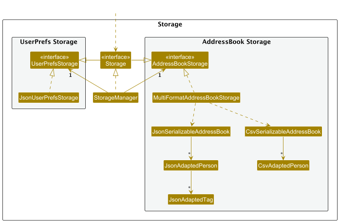
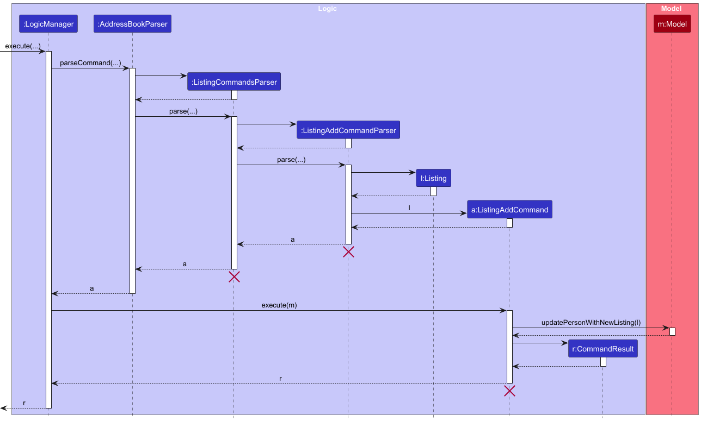

## Table of Contents
* [Acknowledgements](#acknowledgements)
* [Setting Up, Getting Started](#setting-up-getting-started)
* [Design](#design)
    * [Architecture](#architecture)
    * [Logic component](#logic-component)
    * [Model component](#model-component)
    * [Storage component](#storage-component)
    * [Common classes](#common-classes)
* [Implementation](#implementation)
    * [Add Client Feature](#add-client-feature)
    * [Add Listing Feature](#add-listing-feature)
    * [Sort Feature](#sort-feature)
* [Documentation, Logging, Testing, Configuration, Dev-Ops](#documentation-logging-testing-configuration-dev-ops)
* [Appendix-A: Requirements](#appendix-a-requirements)
    * [Product scope](#product-scope)
    * [User stories](#user-stories)
    * [Use cases](#use-cases)
    * [Non-Functional Requirements](#non-functional-requirements)
    * [Glossary](#glossary)
* [Appendix-B: Planned Enhancements](#appendix-b-planned-enhancements)
    * [Enhance Phone Numbers to Accept Special Characters](#1-enhance-phone-numbers-to-accept-special-characters)
    * [Enhance Search Flexibility](#2-enhance-search-flexibility)
    * [Enhance Export Feature to Handle Export Errors.](#3-enhance-export-feature-to-handle-export-errors)
* [Appendix-C: Instructions for Manual Testing](#appendix-c-instructions-for-manual-testing)
    * [Launch and shutdown](#launch-and-shutdown)
    * [Adding a client](#adding-a-client)
    * [Deleting a client](#deleting-a-client)

---

## **Acknowledgements**

This project was developed from [AddressBook-Level3](https://github.com/se-edu/addressbook-level3).

ChatGPT by OpenAI was used by [BuffWuff1712](https://github.com/BuffWuff1712) to generate the 
Tag Table and [Glossary](#glossary) sections within the Developer Guide, as well as the JavaDocs for code written by BuffWuff1712. 

ChatGPT was also used by [tayxuenye](https://github.com/tayxuenye) and cited in the code where applicable.

---

## **Setting Up, Getting Started**

Refer to the guide [_Setting up and getting started_](SettingUp.md).

--------------------------------------------------------------------------------------------------------------------

## **Design**

:bulb: **Tip:** The `.puml` files used to create diagrams in this document `docs/diagrams` folder. Refer to the [_PlantUML Tutorial_ at se-edu/guides](https://se-education.org/guides/tutorials/plantUml.html) to learn how to create and edit diagrams.

### Architecture

The ***Architecture Diagram*** given above explains the high-level design of the App.

Given below is a quick overview of main components and how they interact with each other.

**Main components of the architecture**

**`Main`** (consisting of classes [`Main`](https://github.com/AY2425S1-CS2103T-F15-3/tp/blob/master/src/main/java/seedu/address/Main.java) and [`MainApp`](https://github.com/AY2425S1-CS2103T-F15-3/tp/blob/master/src/main/java/seedu/address/MainApp.java)) is in charge of the app launch and shut down.

* At app launch, it initializes the other components in the correct sequence, and connects them up with each other.
* At shut down, it shuts down the other components and invokes cleanup methods where necessary.

The bulk of the app's work is done by the following four components:

* [**`UI`**](#ui-component): The UI of the App.
* [**`Logic`**](#logic-component): The command executor.
* [**`Model`**](#model-component): Holds the data of the App in memory.
* [**`Storage`**](#storage-component): Reads data from, and writes data to, the hard disk.

[**`Commons`**](#common-classes) represents a collection of classes used by multiple other components.

**How the architecture components interact with each other**

The *Sequence Diagram* below shows how the components interact with each other for the scenario where the user issues the command `delete 1`.

Each of the four main components (also shown in the diagram above),

* defines its *API* in an `interface` with the same name as the Component.
* implements its functionality using a concrete `{Component Name}Manager` class (which follows the corresponding API `interface` mentioned in the previous point.

For example, the `Logic` component defines its API in the `Logic.java` interface and implements its functionality using the `LogicManager.java` class which follows the `Logic` interface. Other components interact with a given component through its interface rather than the concrete class (reason: to prevent outside component's being coupled to the implementation of a component), as illustrated in the (partial) class diagram below.

The sections below give more details of each component.

### UI component

The **API** of this component is specified in [`Ui.java`](https://github.com/AY2425S1-CS2103T-F15-3/tp/blob/master/src/main/java/seedu/address/ui/Ui.java)

The UI consists of a `MainWindow` that is made up of parts e.g.`CommandBox`, `ResultDisplay`, `PersonListPanel`, `PersonPane`, `StatusBarFooter` etc. All these, including the `MainWindow`, inherit from the abstract `UiPart` class which captures the commonalities between classes that represent parts of the visible GUI.

The `UI` component uses the JavaFx UI framework. The layout of these UI parts are defined in matching `.fxml` files that are in the `src/main/resources/view` folder. For example, the layout of the [`MainWindow`](https://github.com/AY2425S1-CS2103T-F15-3/tp/blob/master/src/main/java/seedu/address/ui/MainWindow.java) is specified in [`MainWindow.fxml`](https://github.com/AY2425S1-CS2103T-F15-3/tp/blob/master/src/main/resources/view/MainWindow.fxml)

The `UI` component,

* executes user commands using the `Logic` component.
* listens for changes to `Model` data so that the UI can be updated with the modified data.
* keeps a reference to the `Logic` component, because the `UI` relies on the `Logic` to execute commands.
* depends on some classes in the `Model` component, as it displays `Person` object residing in the `Model`.

### Logic component

**API** : [`Logic.java`](https://github.com/AY2425S1-CS2103T-F15-3/tp/blob/master/src/main/java/seedu/address/logic/Logic.java)

Here's a (partial) class diagram of the `Logic` component:

The sequence diagram below illustrates the interactions within the `Logic` component, taking `execute("delete 1")` API call as an example.

:information_source: **Note:** The lifeline for `DeleteCommandParser` should end at the destroy marker (X) but due to a limitation of PlantUML, the lifeline continues till the end of diagram.

How the `Logic` component works:

1. When `Logic` is called upon to execute a command, it is passed to an `PROpertyParser` object which in turn creates a parser that matches the command (e.g., `DeleteCommandParser`) and uses it to parse the command.
2. This results in a `Command` object (more precisely, an object of one of its subclasses e.g., `DeleteCommand`) which is executed by the `LogicManager`.
3. The command can communicate with the `Model` when it is executed (e.g. to delete a client). 
   Note that although this is shown as a single step in the diagram above (for simplicity), in the code it can take several interactions (between the command object and the `Model`) to achieve.
4. The result of the command execution is encapsulated as a `CommandResult` object which is returned back from `Logic`.

Here are the other classes in `Logic` (omitted from the class diagram above) that are used for parsing a user command:

How the parsing works:

* When called upon to parse a user command, the `PROpertyParser` class creates an `XYZCommandParser` (`XYZ` is a placeholder for the specific command name e.g., `AddCommandParser`) which uses the other classes shown above to parse the user command and create a `XYZCommand` object (e.g., `AddCommand`) which the `PROpertyParser` returns back as a `Command` object.
* All `XYZCommandParser` classes (e.g., `AddCommandParser`, `DeleteCommandParser`, ...) inherit from the `Parser` interface so that they can be treated similarly where possible e.g, during testing.

### Model component

**API** : [`Model.java`](https://github.com/AY2425S1-CS2103T-F15-3/tp/blob/master/src/main/java/seedu/address/model/Model.java)

The `Model` component,

* stores the address book data i.e., all `Person` objects (which are contained in a `UniquePersonList` object).
* stores the currently 'selected' `Person` objects (e.g., results of a search query) as a separate _filtered_ list which is exposed to outsiders as an unmodifiable `ObservableList<Person>` that can be 'observed' e.g. the UI can be bound to this list so that the UI automatically updates when the data in the list change.
* stores a `UserPref` object that represents the user’s preferences. This is exposed to the outside as a `ReadOnlyUserPref` objects.
* does not depend on any of the other three components (as the `Model` represents data entities of the domain, they should make sense on their own without depending on other components)

:information_source: **Note:** An alternative (arguably, a more OOP) model is given below. It has a `Tag` list in the `PROperty`, which `Person` references. This allows `PROperty` to only require one `Tag` object per unique tag, instead of each `Person` needing their own `Tag` objects. 

### Storage component

**API** : [`Storage.java`](https://github.com/AY2425S1-CS2103T-F15-3/tp/blob/master/src/main/java/seedu/address/storage/Storage.java)

The `Storage` component,

* can save both address book data and user preference data in JSON format, and read them back into corresponding objects.
* inherits from both `AddressBookStorage` and `UserPrefStorage`, which means it can be treated as either one (if only the functionality of only one is needed).
* depends on some classes in the `Model` component (because the `Storage` component's job is to save/retrieve objects that belong to the `Model`).

### Common classes

Classes used by multiple components are in the `seedu.address.commons` package.

--------------------------------------------------------------------------------------------------------------------

## **Implementation**

This section describes some noteworthy details on how certain features are implemented.
    
### Add Client Feature

the AddCommand follows a typical command pattern where `LogicManager` orchestrates the parsing and execution process. 
When the user input is received, `LogicManager` calls `AddressBookParser` to interpret and parse the user input string into an executable command.
In this case, `AddressBookParser` creates `AddCommandParser` to parse user input string.

`AddressBookParser` first obtains the values corresponding to the prefixes `n/`, `p/`, `e/`, `a/`, `t/` and `r/`.
`AddressBookParser` ensures that:
- All values corresponding to the prefixes are valid
  If any of the above constraints are violated, `AddressBookParser` throws a ParseException. Otherwise, 
  `AddCommandParser` creates an `AddCommand` instance with a `Person` object representing the new client.

Upon execution, `AddCommand` first queries the supplied model if it contains a client. If no duplicate client exists, `AddCommand` then calls on `model::addPerson` to add the client into the contact list.

### Add Listing Feature

The ListingAddCommand follows a typical command pattern where `LogicManager` orchestrates the parsing and execution process.
When the user input is received, `LogicManager` calls `AddressBookParser` to interpret and parse the user input string into an executable command.
In this case, `AddressBookParser` creates `ListingCommandsParser` to parse user input string.

`ListingCommandsParser` first obtains the user input string and ensures that the suffix of the command matches 'add' or 'delete'. 
 If the suffix does not match either, `ListingCommandsParser` throws a ParseException. Otherwise,
 `ListingCommandsParser` creates `ListingAddCommandParser` to parse the arguments.

`ListingAddCommandParser` then extracts the index and the values corresponding to the prefixes `t/` and `a/`.
`ListingAddCommandParser` ensures that:
- Provided index is within a valid range, meaning it cannot be less than 1 or greater than the number of clients in the currently displayed list.
- All values corresponding to the prefixes are valid.

If any of the above constraints are violated, `ListingAddCommandParser` throws a ParseException. Otherwise,
`ListingAddCommandParser` creates an `ListingAddCommand` instance with a `Listing` object representing the new listing.

Upon execution, `ListingAddCommand` first attempts to add a listing in a `UniqueListingList`. If no duplicate listing exists,
`UniqueListingList` then adds the listing to its list. 

### Sort Feature

The sort feature in `PROperty` is implemented by adding sorting methods to the `UniquePersonList` class, which is responsible for managing the list of `Person` objects. Sorting is performed directly on the `internalList` by specific attributes such as `name` or `ID`, allowing users to organise clients in a meaningful order.

The feature includes the following operations:

- **`UniquePersonList#sortByName()`** — Sorts the `internalList` of `Person` objects alphabetically by name, using a `Comparator` that performs a case-insensitive comparison.
- **`UniquePersonList#sortByID()`** — Sorts the `internalList` by ID in ascending order, allowing users to organise clients based on their unique identifiers.

These operations are exposed in the `Model` interface as `Model#sortByName()` and `Model#sortByID()` respectively.

The following sequence diagram shows how an sort operation goes through the `Logic` component:

Similarly, the sorting process within the `Model` component is shown below:

--------------------------------------------------------------------------------------------------------------------

## **Documentation, logging, testing, configuration, dev-ops**

* [Documentation guide](Documentation.md)
* [Testing guide](Testing.md)
* [Logging guide](Logging.md)
* [Configuration guide](Configuration.md)
* [DevOps guide](DevOps.md)

--------------------------------------------------------------------------------------------------------------------

## **Appendix A: Requirements**

### Product scope

**Target user profile**:

* Property Agents who type fast

Their responsibilities include managing a large list of property listings,
coordinating with clients and potential buyers, conducting property viewings, negotiating deals,
and handling paperwork related to real estate transactions. They are often mobile, needing quick and easy
access to information, and manage a large client and property database.

**Value proposition**:
PROperty is useful for property agents because it saves their time by allowing easy tracking of contacts,
and easily filtering them according to tailor-made categories relevant to property agents in Singapore. It is much
simpler to use while being even more functional than alternatives on the market.

* Allows property agents to manage prospective and existing clients easily by sorting them into different
  categories such as by housing type or seller/buyer
* Keep track of the various landlords who own the houses
* Easy for agent to remember who to try to sell unit to
* Events for scheduling visits to houses - reminders for agents when they open the app on any upcoming visits

### User stories

Priorities: High (must have) - `* * *`, Medium (nice to have) - `* *`, Low (unlikely to have) - `*`

| Priority | As a …​                                 | I want to …​                                                | So that I can…​                                              |
|----------|-----------------------------------------|-------------------------------------------------------------|--------------------------------------------------------------|
| `* * *`  | new user                                | see usage instructions                                      | refer to instructions when I forget how to use the app       |
| `* * *`  | user                                    | add a client with their information                         | view them later                                              |
| `* * *`  | user                                    | delete a client                                             | remove entries that I no longer need                         |
| `* * *`  | user                                    | use a search bar to find my client                          | locate details without going through the entire list         |
| `* * *`  | user                                    | edit current client details                                 | keep the details updated                                     |
| `* * *`  | user                                    | search via tags                                             | filter by different groups of people                         |
| `* * *`  | user                                    | partially fill client details                               | add people who do not want to give full information          |
| `* * *`  | user                                    | find clients using their names                              | view their client details easily                             |
| `* * *`  | user with many things to remember       | add remarks/notes to some clients                           | remember things when I look up clients                       |
| `* *`    | user                                    | know some suggestions of types of tags                      | keep track of client preferences and interactions            |
| `* *`    | user                                    | set reminders linked to clients                             | follow up with clients on time                               |
| `* *`    | user                                    | have an undo feature when editing or deleting a client      | prevent accidental loss of information                       |
| `* *`    | new user                                | see a guide on what features there are and how to use them  | know what to do with the application                         |
| `* *`    | user                                    | have the option to auto-complete commands                   | not waste time typing the full command                       |
| `* *`    | user                                    | find commands by typing part of it                          | not have to remember exact commands                          |
| `* *`    | user                                    | see multiple attributes in the command box                  | know available commands without referring to help guide      |
| `* *`    | user                                    | have appropriate colour highlighting for each attribute     | see what I input more easily                                 |
| `* *`    | user                                    | see different colours for each attribute                    | classify information more easily                             |
| `* *`    | user                                    | see error messages clearly                                  | know what went wrong with my input                           |
| `* *`    | user                                    | see the exact reason an error is caused                     | input the correct command without wasting time               |
| `* *`    | user with many clients                  | tag certain clients to show at the top                      | find them easily with minimal steps                          |
| `* *`    | user with a busy schedule               | set reminders and see upcoming events                       | remind myself and stay on track                              |
| `* *`    | forgetful user                          | quickly reuse my last searches and view search history      | quickly trace back my activity                               |
| `* *`    | new user                                | explore all features and follow a guide                     | be oriented to the functionalities                           |
| `* *`    | user with many different friend groups  | manage all my tags                                          | better organize my clients                                   |
| `* *`    | user who likes to categorise everything | choose different colours for my tags                        | they don't all look the same                                 |
| `* *`    | impatient user                          | find and sort multiple tags at once                         | not have to search for each tag slowly                       |
| `* *`    | user                                    | sort my clients in different ways                           | view clients in different ways                               |
| `* *`    | user                                    | add and customise my own tags                               | personalise my address book                                  |
| `* *`    | user                                    | link property listings to specific clients                  | know who to market units to quickly                          |
| `*`      | user                                    | merge duplicate clients                                     | keep my address book clean and organised                     |
| `*`      | user                                    | export my clients to a CSV file                             | back up or share my client list                              |
| `*`      | user                                    | put my deleted clients in a recycle bin                     | keep my clients clean and restore them if it was an accident |
| `*`      | user with many social accounts          | save and link to client social pages and media handles      | connect with clients on social media easily                  |
| `*`      | user who changes devices often          | export and import clients on different devices easily       | not save everything manually again when I change devices     |
| `*`      | user with many categories of clients    | know who the clients I have put a particular tag on         | organise events                                              |
| `*`      | user with many clients                  | find and search client besides the name                     | find clients more easily with different kinds of input       |

### Use cases

(For all use cases below, the **System** is the `PROperty` and the **Actor** is the `user`, unless specified otherwise)

**Use case: Add a client**

**MSS**

1. User requests to add a new client by providing the client's details.

2. PROperty validates the input details.

3. PROperty adds the client to the client list.

4. PROperty displays a confirmation that the client has been added.
   
   Use case ends.

**Extensions**

- 2a. The input details are invalid or incomplete.
  
  - 2a1. PROperty shows an error message indicating the invalid fields.
  
  - 2a2. PROperty prompts the user to re-enter the details.
    
    Use case resumes at step 1.

- 2b. A client with the same details already exists.
  
  - 2b1. PROperty informs the user that the client already exists.
    
    Use case ends.

---

**Use case: Edit a client's details**

**MSS**

1. User requests to edit details of a specific client.

2. User inputs desired edits.

3. PROperty validates the new details.

4. PROperty saves the updated details.

5. PROperty confirms that the client's details have been updated.
   
   Use case ends.

**Extensions**

- 1a. The specified client does not exist.
  
  - 1a1. PROperty shows an error message.
    
    Use case ends.

- 3a. The new details are invalid.
  
  - 3a1. PROperty shows an error message indicating the invalid fields.
  
  - 3a2. PROperty prompts the user to re-enter the details.
    
    Use case resumes at step 2.

---

**Use case: Delete a client**

**MSS**

1. User requests to delete a specified client

2. PROperty deletes the specified client

3. PROperty saves the updated client list.

   Use case ends.

**Extensions**

- 1a. The specified client does not exist.

    - 1a1. PROperty shows an error message.

      Use case ends.

---

**Use case: Sort clients in alphabetical order**

**MSS**

1. User requests to sort clients.

2. PROperty sorts the client list in alphabetical order.

3. PROperty displays the sorted list.

   Use case ends.

---

**Use case: Add remarks to a client**

**MSS**

1. User selects a client to add a remark.

2. User enters the remark.

3. PROperty saves the remark to the client's details.

4. PROperty confirms that the remark has been added.
   
   Use case ends.

**Extensions**

- 1a. The specified client does not exist.
  
  - 1a1. PROperty shows an error message.
    
    Use case ends.

- 2a. The remark is empty.
  
  - 2a1. PROperty removes the remark from the specified client instead.

---

**Use case: Remove remarks from a client**

**MSS**

1. User selects a client to remove remark.

2. User enters empty remark.

3. PROperty removes the existing remark (if any) from the client's details.

4. PROperty confirms that the remark has been removed.

   Use case ends.

**Extensions**

- 1a. The specified client does not exist.

    - 1a1. PROperty shows an error message.

      Use case ends.

---

**Use case: Search for clients by tags**

**MSS**

1. User requests to search for clients using one or more tags.

2. PROperty filters the client list based on the specified tags.

3. PROperty displays a list of clients matching the tags.
   
   Use case ends.

**Extensions**

- 1a. No tags are specified.
  
  - 1a1. PROperty shows an error message prompting for at least one tag.
    
    Use case resumes at step 1.

- 3a. No clients match the specified tags.
  
  - 3a1. PROperty informs the user that there are 0 matches.
    
    Use case ends.

---

**Use case: Search for clients by client details**

**MSS**

1. User requests to search for clients using various client details.

2. PROperty filters the client list based on the search query.

3. PROperty displays a list of matching clients.

   Use case ends.

**Extensions**

- 1a. No search queries are specified.

    - 1a1. PROperty shows an invalid command format error message.

      Use case ends.

- 3a. No clients match the specified tags.

    - 3a1. PROperty informs the user that 0 clients were found.

      Use case ends.

---

**Use case: Manage tags**

**MSS**

1. User sees the tags assigned to a client in PROperty.

2. User selects to add, delete tags or both.

3. PROperty confirms that the tags have been updated.
   
   Use case ends.

**Extensions**

- 2a. User chooses to delete a tag.
  
  - 2a1. Tha tag is deleted off the client if it exists.
  
  - 2a2. Else, PROperty ignores the command silently.
  
  - 2a3. PROperty saves the changes.
    
    Use case resumes at step 3.

- 2b. User chooses to add a valid tag.
  
  - 2b1. User keys in the tag to delete.
  
  - 2b2. PROperty adds the tag to the client.
    
    Use case resumes at step 3.

- 2c. Any tag names provided are invalid for an add tag action (not in the list of allowed tags).
  
  - 2c1. PROperty shows an error message.
    
    Use case ends.

---

**Use case: View usage instructions**

**MSS**

1. User requests to view usage instructions.

2. PROperty displays the help guide with a list of available commands and features.
   
   Use case ends.

---

**Use case: Auto-complete commands**

**MSS**

1. User begins typing a command.

2. PROperty suggests the closest possible command based on the input.

3. User selects the suggestion by pressing [TAB] or continues typing.

4. PROperty auto-completes the command if user selects the suggestion.
   
   Use case ends.

**Extensions**

- 2a. No commands match the input.
  
  - 2a1. PROperty does not provide suggestions.
    
    Use case ends.

- 3a. User does not select the suggestion and enters an invalid command.
  
  - 3a1. PROperty shows an error message.
    
    Use case ends.

---

**Use case: Remove tags from clients easily**

**MSS**

1. User selects a client to modify tags.

2. PROperty displays current tags associated with the client.

3. User removes unwanted tags.

4. PROperty updates the client's tag list.

5. PROperty confirms that the tags have been updated.
   
   Use case ends.

**Extensions**

- 2a. User selects an invalid tag or non-existent tag to delete.
  
  - 2a1. PROperty continues silently and does not modify the invalid commands.
    
    Use case resumes at step 2.

---

**Use case: Show property listings of specific user**

**MSS**

1. User types command to show property listings of a client.

2. PROperty displays property listings of client.

   Use case ends.

**Extensions**

- 1a. User types in invalid index for client.

  - 1a1. PROperty informs user of invalid index.
   
    Use case ends.

- 1b. User types in invalid command format.

    - 1b1. PROperty informs user of invalid command format.

      Use case ends.

---

**Use case: Add property listings to a specific user**

**MSS**

1. User types command to add a property listing to a specified user.

2. PROperty updates the property listings of the user.

   Use case ends.

**Extensions**

- 1a. User types in invalid index for client.

    - 1a1. PROperty informs user of invalid index.

      Use case ends.

- 1b. User types in invalid command format.

    - 1b1. PROperty informs user of invalid command format.

      Use case ends.

- 1c. User types in a listing with a duplicate address.

    - 1c1. PROperty informs user of duplicate listing entry due to there being the same address.

      Use case ends.

---

**Use case: Delete property listings from a specific user**

**MSS**

1. User types command to delete a property listing from a specific user.

2. PROperty updates the property listings of the user.

   Use case ends.

**Extensions**

- 1a. User types in invalid index for client.

    - 1a1. PROperty informs user of invalid index.

      Use case ends.

- 1b. User types in invalid command format.

    - 1b1. PROperty informs user of invalid command format.

      Use case ends.

- 1c. User types in invalid property listing index for that client.

    - 1c1. PROperty informs user of invalid listing index.

      Use case ends.

---

**Use case: Export all client details from PROperty**

**MSS**

1. User types command to export all details stored.

2. PROperty creates a `.csv` with all the client details.

   Use case ends.

**Extensions**

- 1a. The export location or file is unavailable for any reason.

    - 1a1. PROperty fails silently.

      Use case ends.

### Non-Functional Requirements

1. Should work on any _mainstream OS_ as long as it has Java `17` or above installed.
2. Should be able to hold up to 1000 clients without a noticeable sluggishness in performance for typical usage.
3. A user with above average typing speed for regular English text (i.e. not code, not system admin commands) should be able to accomplish most of the tasks faster using commands than using the mouse.
4. Should work on any screen size from (`13'` laptop screens to `32'` widescreen monitors)
5. Should reliably store client information across different sessions with minimal chance of corruption
6. Should not contain any vulnerabilities, protect user data and ensure system integrity
7. Should be easy to maintain for developers to add new features and exensions in the future
8. Should have good contrast between colours to allow people to read text and information more easily

### Glossary

- **Auto-complete**: A feature that predicts and completes the rest of a word or command as the user types, often activated by pressing the `TAB` key.

- **Fuzzy Searching**: A search technique that finds approximate matches to the search terms, allowing users to find results without needing exact matches.

- **Recycle Bin**: A temporary storage area for deleted clients, allowing users to restore them if they were deleted accidentally.

- **Reminder/Event**: A scheduled notification linked to a client, alerting the user of upcoming tasks, appointments, or follow-ups.

- **Social Media Handles**: Usernames or profile links associated with a client's social media accounts.

- **Syntax Highlighting**: A feature that displays commands in different colors to differentiate between commands, attributes, and values for easier readability.

- **Tag**: A label assigned to a client to categorize or group clients for better organization.

- **Undo Feature**: A function that allows the user to reverse the last action taken, preventing accidental loss or changes to information.

- **Client**: An entry in the PROperty representing a client, including their personal and professional information.

- **Reminder/Event List**: A chronological list displaying upcoming reminders or events set by the user.

- **Search History**: A record of previous search queries entered by the user, allowing for quick reuse of past searches.

- **Highlighting Errors**: Visual cues provided by the application (such as underlines or color changes) to indicate mistakes in command input.

- **Priority Tagging**: The act of marking certain clients to appear at the top of the client list for quick access.

--------------------------------------------------------------------------------------------------------------------

## **Appendix B: Planned Enhancements**

**Team Size:** 5 members

As we continue to develop PROperty, we are focused on refining and expanding its capabilities to better meet user needs. 
Through identifying current limitations, we’re able to target areas that can benefit most from enhancement. 
This section highlights our planned improvements, showcasing the steps we're taking to deliver a more comprehensive and effective solution for property agents.

### 1. Enhance Phone Numbers to Accept Special Characters

**Feature Flaw in Current Implementation**

At present, phone numbers only accept numeric characters, excluding symbols such as `+` and dashes `-`. 
However, these characters are essential for supporting country and area codes, and dashes can improve readability by 
separating sections of a phone number (e.g., `+1-800-9087-2029`).

**Proposed Enhancement**

We plan to modify the phone number field to allow `+` symbols and dashes `-` so users can input phone numbers with country/area codes 
and use dashes for better readability. This enhancement will provide greater flexibility and accommodate a wider range of valid phone number formats.

### 2. Enhance Search Flexibility

**Feature Flaw in Current Implementation**

The current search functionality is limited when searching for strings containing alphanumeric characters followed by special characters (e.g. "29," in an address),
or special characters followed by alphanumeric characters (e.g "#03-02" in a unit number). 
Users may not find their intended client if they do not explicitly state the exact string due to this restriction
(e.g. using `find 29` to find a client with the address `Blk 30 Geylang Street 29, #06-40` will result in no clients being found).

**Proposed Enhancement**

We plan to enhance the search feature to allow partial matches on numeric values regardless of punctuation or spacing. 
This enhancement will improve the user experience by showing relevant client details even if the input includes numbers adjacent to punctuation marks.

### 3. Enhance Export Feature to Handle Export Errors.

**Feature Flaw in Current Implementation**

At present, the PROperty does not indicate to the user when an export fails (e.g. If the user exports a csv file and opens it, 
then edits information using the app and exports the csv again, 
the second export will cause an error and the new CSV file will not be correctly exported.
However, the PROperty GUI reflects that a second export command has been successfully executed, 
even though the console shows that an error has been thrown).

**Proposed Enhancement**

We plan to enhance the export feature by implementing error handling should there be a failed export. 
This enhancement will improve the user experience by informing the user when their export has failed,
and prevent confusion when the user checks their CSV file to find there has been no updates to its contents.

--------------------------------------------------------------------------------------------------------------------

## **Appendix C: Instructions for Manual Testing**

Given below are instructions to test the app manually.

:information_source: **Note:** These instructions only provide a starting point for testers to work on;
testers are expected to do more *exploratory* testing.

### Launch and shutdown

1. Initial launch
   
   1. Download the jar file and copy into an empty folder
   
   2. Double-click the jar file Expected: Shows the GUI with a set of sample clients. The window size may not be optimum.

2. Saving window preferences
   
   1. Resize the window to an optimum size. Move the window to a different location. Close the window.
   
   2. Re-launch the app by double-clicking the jar file. 
      
       Expected: The most recent window size and location is retained.

### Adding a client

1. Adding a new client to the client list

    1. Prerequisites: The client list is displayed, and the user has relevant details to add a new client.

    2. Test case: `add n/John Doe p/98765432 e/johndoe@example.com a/123 Clementi Road` 
       Expected: A new client with the name "John Doe" and provided details is added to the list. The status message in the outcome box confirms the addition.

    3. Test case: `add n/ p/ e/ a/` 
       Expected: No client is added. An error message appears, indicating that names should only contain alphanumeric characters and spaces, and it should not be blank.

    4. Other incorrect add commands to try: `add`, `add n/John Doe p/@456789`, `add n/Harry Kane p/88332255 e/harrykane.com a/123 Clementi Road` 
       Expected: Error message indicating invalid command, phone or email format, with no changes to the list.

### Deleting a client

1. Deleting a client while all clients are being shown
   
   1. Prerequisites: List all clients using the `list` command. Multiple clients in the list.
   
   2. Test case: `delete 1` 
      Expected: First client is deleted from the list. Details of the deleted client shown in the status message.
   
   3. Test case: `delete 0` 
      Expected: No client is deleted. Error details shown in the status message.
   
   4. Other incorrect delete commands to try: `delete`, `delete x`, `...` (where x is larger than the list size) 
      Expected: Similar to previous.

