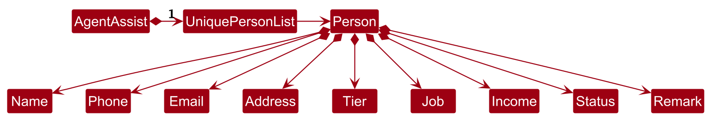

* Table of Contents
{:toc}

--------------------------------------------------------------------------------------------------------------------

## **Acknowledgements**

* {list here sources of all reused/adapted ideas, code, documentation, and third-party libraries -- include links to the original source as well}

--------------------------------------------------------------------------------------------------------------------

## **Setting up, getting started**

Refer to the guide [_Setting up and getting started_](SettingUp.md).

--------------------------------------------------------------------------------------------------------------------

## **Design**

<div markdown="span" class="alert alert-primary">

:bulb: **Tip:** The `.puml` files used to create diagrams in this document `docs/diagrams` folder. Refer to the [_PlantUML Tutorial_ at se-edu/guides](https://se-education.org/guides/tutorials/plantUml.html) to learn how to create and edit diagrams.
</div>

### Architecture


The ***Architecture Diagram*** given above explains the high-level design of the App.

Given below is a quick overview of main components and how they interact with each other.

**Main components of the architecture**

**`Main`** (consisting of classes [`Main`](https://github.com/se-edu/addressbook-level3/tree/master/src/main/java/seedu/address/Main.java) and [`MainApp`](https://github.com/se-edu/addressbook-level3/tree/master/src/main/java/seedu/address/MainApp.java)) is in charge of the app launch and shut down.
* At app launch, it initializes the other components in the correct sequence, and connects them up with each other.
* At shut down, it shuts down the other components and invokes cleanup methods where necessary.

The bulk of the app's work is done by the following four components:

* [**`UI`**](#ui-component): The UI of the App.
* [**`Logic`**](#logic-component): The command executor.
* [**`Model`**](#model-component): Holds the data of the App in memory.
* [**`Storage`**](#storage-component): Reads data from, and writes data to, the hard disk.

[**`Commons`**](#common-classes) represents a collection of classes used by multiple other components.

**How the architecture components interact with each other**

The *Sequence Diagram* below shows how the components interact with each other for the scenario where the user issues the command `delete 1`.


Each of the four main components (also shown in the diagram above),

* defines its *API* in an `interface` with the same name as the Component.
* implements its functionality using a concrete `{Component Name}Manager` class (which follows the corresponding API `interface` mentioned in the previous point.

For example, the `Logic` component defines its API in the `Logic.java` interface and implements its functionality using the `LogicManager.java` class which follows the `Logic` interface. Other components interact with a given component through its interface rather than the concrete class (reason: to prevent outside component's being coupled to the implementation of a component), as illustrated in the (partial) class diagram below.


The sections below give more details of each component.

### UI component

The **API** of this component is specified in [`Ui.java`](https://github.com/se-edu/addressbook-level3/tree/master/src/main/java/seedu/address/ui/Ui.java)


The UI consists of a `MainWindow` that is made up of parts e.g.`CommandBox`, `ResultDisplay`, `PersonListPanel`, `StatusBarFooter` etc. All these, including the `MainWindow`, inherit from the abstract `UiPart` class which captures the commonalities between classes that represent parts of the visible GUI.

The `UI` component uses the JavaFx UI framework. The layout of these UI parts are defined in matching `.fxml` files that are in the `src/main/resources/view` folder. For example, the layout of the [`MainWindow`](https://github.com/se-edu/addressbook-level3/tree/master/src/main/java/seedu/address/ui/MainWindow.java) is specified in [`MainWindow.fxml`](https://github.com/se-edu/addressbook-level3/tree/master/src/main/resources/view/MainWindow.fxml)

The `UI` component,

* executes user commands using the `Logic` component.
* listens for changes to `Model` data so that the UI can be updated with the modified data.
* keeps a reference to the `Logic` component, because the `UI` relies on the `Logic` to execute commands.
* depends on some classes in the `Model` component, as it displays `Person` object residing in the `Model`.

### Logic component

**API** : [`Logic.java`](https://github.com/se-edu/addressbook-level3/tree/master/src/main/java/seedu/address/logic/Logic.java)

Here's a (partial) class diagram of the `Logic` component:


The sequence diagram below illustrates the interactions within the `Logic` component, taking `execute("delete 1")` API call as an example.


<div markdown="span" class="alert alert-info">:information_source: **Note:** The lifeline for `DeleteCommandParser` should end at the destroy marker (X) but due to a limitation of PlantUML, the lifeline continues till the end of diagram.
</div>

How the `Logic` component works:

1. When `Logic` is called upon to execute a command, it is passed to an `AddressBookParser` object which in turn creates a parser that matches the command (e.g., `DeleteCommandParser`) and uses it to parse the command.
1. This results in a `Command` object (more precisely, an object of one of its subclasses e.g., `DeleteCommand`) which is executed by the `LogicManager`.
1. The command can communicate with the `Model` when it is executed (e.g. to delete a person).<br>
   Note that although this is shown as a single step in the diagram above (for simplicity), in the code it can take several interactions (between the command object and the `Model`) to achieve.
1. The result of the command execution is encapsulated as a `CommandResult` object which is returned back from `Logic`.

Here are the other classes in `Logic` (omitted from the class diagram above) that are used for parsing a user command:


How the parsing works:
* When called upon to parse a user command, the `AddressBookParser` class creates an `XYZCommandParser` (`XYZ` is a placeholder for the specific command name e.g., `AddCommandParser`) which uses the other classes shown above to parse the user command and create a `XYZCommand` object (e.g., `AddCommand`) which the `AddressBookParser` returns back as a `Command` object.
* All `XYZCommandParser` classes (e.g., `AddCommandParser`, `DeleteCommandParser`, ...) inherit from the `Parser` interface so that they can be treated similarly where possible e.g, during testing.

### Model component
**API** : [`Model.java`](https://github.com/se-edu/addressbook-level3/tree/master/src/main/java/seedu/address/model/Model.java)


The `Model` component,

* stores the address book data i.e., all `Person` objects (which are contained in a `UniquePersonList` object).
* stores the currently 'selected' `Person` objects (e.g., results of a search query) as a separate _filtered_ list which is exposed to outsiders as an unmodifiable `ObservableList<Person>` that can be 'observed' e.g. the UI can be bound to this list so that the UI automatically updates when the data in the list change.
* stores a `UserPref` object that represents the user’s preferences. This is exposed to the outside as a `ReadOnlyUserPref` objects.
* does not depend on any of the other three components (as the `Model` represents data entities of the domain, they should make sense on their own without depending on other components)

<div markdown="span" class="alert alert-info">:information_source: **Note:** An alternative (arguably, a more OOP) model is given below. It has a `Tag` list in the `AddressBook`, which `Person` references. This allows `AddressBook` to only require one `Tag` object per unique tag, instead of each `Person` needing their own `Tag` objects.<br>



</div>


### Storage component

**API** : [`Storage.java`](https://github.com/se-edu/addressbook-level3/tree/master/src/main/java/seedu/address/storage/Storage.java)


The `Storage` component,
* can save both address book data and user preference data in JSON format, and read them back into corresponding objects.
* inherits from both `AddressBookStorage` and `UserPrefStorage`, which means it can be treated as either one (if only the functionality of only one is needed).
* depends on some classes in the `Model` component (because the `Storage` component's job is to save/retrieve objects that belong to the `Model`)

### Common classes

Classes used by multiple components are in the `seedu.address.commons` package.

--------------------------------------------------------------------------------------------------------------------

## **Implementation**

This section describes some noteworthy details on how certain features are implemented.

### \[Proposed\] Undo/redo feature

#### Proposed Implementation

The proposed undo/redo mechanism is facilitated by `VersionedAddressBook`. It extends `AddressBook` with an undo/redo history, stored internally as an `addressBookStateList` and `currentStatePointer`. Additionally, it implements the following operations:

* `VersionedAddressBook#commit()` — Saves the current address book state in its history.
* `VersionedAddressBook#undo()` — Restores the previous address book state from its history.
* `VersionedAddressBook#redo()` — Restores a previously undone address book state from its history.

These operations are exposed in the `Model` interface as `Model#commitAddressBook()`, `Model#undoAddressBook()` and `Model#redoAddressBook()` respectively.

Given below is an example usage scenario and how the undo/redo mechanism behaves at each step.

Step 1. The user launches the application for the first time. The `VersionedAddressBook` will be initialized with the initial address book state, and the `currentStatePointer` pointing to that single address book state.


Step 2. The user executes `delete 5` command to delete the 5th person in the address book. The `delete` command calls `Model#commitAddressBook()`, causing the modified state of the address book after the `delete 5` command executes to be saved in the `addressBookStateList`, and the `currentStatePointer` is shifted to the newly inserted address book state.


Step 3. The user executes `add n/David …​` to add a new person. The `add` command also calls `Model#commitAddressBook()`, causing another modified address book state to be saved into the `addressBookStateList`.


<div markdown="span" class="alert alert-info">:information_source: **Note:** If a command fails its execution, it will not call `Model#commitAddressBook()`, so the address book state will not be saved into the `addressBookStateList`.

</div>

Step 4. The user now decides that adding the person was a mistake, and decides to undo that action by executing the `undo` command. The `undo` command will call `Model#undoAddressBook()`, which will shift the `currentStatePointer` once to the left, pointing it to the previous address book state, and restores the address book to that state.


<div markdown="span" class="alert alert-info">:information_source: **Note:** If the `currentStatePointer` is at index 0, pointing to the initial AddressBook state, then there are no previous AddressBook states to restore. The `undo` command uses `Model#canUndoAddressBook()` to check if this is the case. If so, it will return an error to the user rather
than attempting to perform the undo.

</div>

The following sequence diagram shows how an undo operation goes through the `Logic` component:


<div markdown="span" class="alert alert-info">:information_source: **Note:** The lifeline for `UndoCommand` should end at the destroy marker (X) but due to a limitation of PlantUML, the lifeline reaches the end of diagram.

</div>

Similarly, how an undo operation goes through the `Model` component is shown below:


The `redo` command does the opposite — it calls `Model#redoAddressBook()`, which shifts the `currentStatePointer` once to the right, pointing to the previously undone state, and restores the address book to that state.

<div markdown="span" class="alert alert-info">:information_source: **Note:** If the `currentStatePointer` is at index `addressBookStateList.size() - 1`, pointing to the latest address book state, then there are no undone AddressBook states to restore. The `redo` command uses `Model#canRedoAddressBook()` to check if this is the case. If so, it will return an error to the user rather than attempting to perform the redo.

</div>

Step 5. The user then decides to execute the command `list`. Commands that do not modify the address book, such as `list`, will usually not call `Model#commitAddressBook()`, `Model#undoAddressBook()` or `Model#redoAddressBook()`. Thus, the `addressBookStateList` remains unchanged.


Step 6. The user executes `clear`, which calls `Model#commitAddressBook()`. Since the `currentStatePointer` is not pointing at the end of the `addressBookStateList`, all address book states after the `currentStatePointer` will be purged. Reason: It no longer makes sense to redo the `add n/David …​` command. This is the behavior that most modern desktop applications follow.


The following activity diagram summarizes what happens when a user executes a new command:


#### Design considerations:

**Aspect: How undo & redo executes:**

* **Alternative 1 (current choice):** Saves the entire address book.
  * Pros: Easy to implement.
  * Cons: May have performance issues in terms of memory usage.

* **Alternative 2:** Individual command knows how to undo/redo by
  itself.
  * Pros: Will use less memory (e.g. for `delete`, just save the person being deleted).
  * Cons: We must ensure that the implementation of each individual command are correct.

_{more aspects and alternatives to be added}_

### \[Proposed\] Data archiving

_{Explain here how the data archiving feature will be implemented}_


--------------------------------------------------------------------------------------------------------------------

## **Documentation, logging, testing, configuration, dev-ops**

* [Documentation guide](Documentation.md)
* [Testing guide](Testing.md)
* [Logging guide](Logging.md)
* [Configuration guide](Configuration.md)
* [DevOps guide](DevOps.md)

--------------------------------------------------------------------------------------------------------------------

## **Appendix: Requirements**

### Product scope

**Target user profile**:

* has a need to manage a significant number of contacts
* prefer desktop apps over other types
* can type fast
* prefers typing to mouse interactions
* is reasonably comfortable using CLI apps

**Value proposition**: manage contacts faster than a typical mouse/GUI driven app


### User stories

Priorities: High (must have) - `* * *`, Medium (nice to have) - `* *`, Low (unlikely to have) - `*`

| Priority | As a …​                                    | I want to …​                     | So that I can…​                                                        |
| -------- | ------------------------------------------ | ------------------------------ | ---------------------------------------------------------------------- |
| `* * *`  | new user                                   | see usage instructions         | refer to instructions when I forget how to use the App                 |
| `* * *`  | user                                       | add a new person               |                                                                        |
| `* * *`  | user                                       | delete a person                | remove entries that I no longer need                                   |
| `* * *`  | user                                       | find a person by name          | locate details of persons without having to go through the entire list |
| `* *`    | user                                       | hide private contact details   | minimize chance of someone else seeing them by accident                |
| `*`      | user with many persons in the address book | sort persons by name           | locate a person easily                                                 |

*{More to be added}*

### Use cases

(For all use cases below, the **System** is the `AddressBook` and the **Actor** is the `user`, unless specified otherwise)

**Use case: Delete a person**

**MSS**

1.  User requests to list persons
2.  AddressBook shows a list of persons
3.  User requests to delete a specific person in the list
4.  AddressBook deletes the person

    Use case ends.

**Extensions**

* 2a. The list is empty.

  Use case ends.

* 3a. The given index is invalid.

    * 3a1. AddressBook shows an error message.

      Use case resumes at step 2.

### 1. **Feature: Add Contact**

**Purpose:**

The purpose of this feature is to allow users to add a new contact by specifying essential details such as name, phone number, physical address, birthday, email address, and optional social media handles.

### **Command Format:**

`add /name <Full Name> /phone <Phone Number> [/address <Physical Address>] [/birthday <Birthday>] [/email <Email Address>] [/instagram <IG Handle>]`

*Note: Fields in `[]` are optional.*

**Example Commands:**

- `add /name John Smith /phone +123456789 /address 123 Main Street, City, Country /birthday 1990-05-12 /email john.smith@email.com /instagram @johnsmith`
- `add /name Emily Davis /phone (555) 123-4567 /address 987 Elm St, Apt 5B, City /birthday 1985-07-22 /email emily.davis@email.com`
- `add /name Emily Davis /phone (555) 123-4567 /birthday 1985-07-22`

### **Main Success Scenario (MSS)**

1. The user issues the `add` command, specifying a full name and phone number as mandatory fields, with optional fields such as physical address, birthday, email, and Instagram handle.
2. The system validates the input parameters (e.g., name, phone number, etc.) for correctness.
3. The system adds the new contact to the contact list.
4. A success message is shown to the user: `Contact successfully added: <Name>`.
5. The newly added contact is displayed in the contact list.

   Use case ends.

---

### **Command Parameters:**

#### **Command “add”:**

**Acceptable Values:**
- The command must match the case exactly (i.e., no "Add", "ADD", etc.).

**Error Message:**
- Invalid Command: `Error: Invalid Command entered. Please provide a valid command.`

---

#### **Name:**

**Acceptable Values:**
- Must be a string containing alphabetic characters, with allowed spaces, hyphens, and apostrophes.
- Examples: `John Smith`, `Mary-Jane O'Neil`.
- Case-insensitive (e.g., `JOHN SMITH` is the same as `John Smith`).
- Leading/trailing spaces are ignored.

**Error Message:**
- If invalid: `Error: Name must only contain alphabetic characters, spaces, hyphens, or apostrophes.`

**Rationale:**
- This format accommodates common name variations while preventing the use of numeric or special characters.

---

#### **Phone Number:**

**Acceptable Values:**
- Must be in a valid phone number format, which includes numbers and may have spaces, parentheses, dashes, and a leading `+` for international codes.
- Examples: `+123456789`, `(555) 123-4567`, `555-123-4567`.
- Leading/trailing spaces are ignored.

**Error Message:**
- If invalid: `Error: Invalid phone number format.`

**Rationale:**
- This allows flexibility in formatting phone numbers while accounting for international and regional variations.

---

#### **Physical Address (Optional):**

**Acceptable Values:**
- A string containing alphanumeric characters, spaces, and common punctuation (e.g., commas, periods, hyphens).
- Examples: `123 Main Street, City, Country`, `987 Elm St., Apt 5B`.
- Case-insensitive and leading/trailing spaces are ignored.

**Error Message:**
- If invalid: `Error: Invalid address format. Only alphanumeric characters and basic punctuation are allowed.`

**Rationale:**
- This format supports common address structures while maintaining simplicity.

---

#### **Birthday (Optional):**

**Acceptable Values:**
- A valid date in the format `YYYY-MM-DD`.
- Examples: `1990-05-12`, `1985-07-22`.
- Leading/trailing spaces are ignored.

**Error Message:**
- If invalid: `Error: Invalid birthday format. Please use YYYY-MM-DD.`

**Rationale:**
- The standardized date format avoids ambiguity and ensures consistency.

---

#### **Email Address (Optional):**

**Acceptable Values:**
- Must be in a valid email address format following `name@domain.tld`.
- Examples: `john.smith@email.com`, `emily.davis@gmail.com`.
- Case-insensitive for the domain part, though the local part (before `@`) may be case-sensitive depending on the mail server.
- Leading/trailing spaces are ignored.

**Error Message:**
- If invalid: `Error: Invalid email address format.`

**Rationale:**
- Ensures that the email address is correctly formatted for communication.

---

#### **Social Media Handle (Optional):**

**Acceptable Values:**
- A string starting with `@`, followed by alphanumeric characters, with optional underscores or periods.
- Examples: `@johnsmith`, `@emily.davis`.
- Case-insensitive, and leading/trailing spaces are ignored.

**Error Message:**
- If invalid: `Error: Invalid social media handle. Use @ followed by alphanumeric characters.`

**Rationale:**
- Standardizing the input ensures consistency and recognizes the format of common social media handles.

---

### **Outputs:**

#### **Success:**
- Message: `Contact successfully added: <Name>`
- GUI Change: The contact's details are displayed in the contact list.

#### **Failure:**
**Error Message Examples:**
- Missing required parameters: `Error: Missing required parameters. Please provide name and phone number.`
- Invalid phone number format: `Error: Invalid phone number format.`
- Invalid birthday format: `Error: Invalid birthday format. Please use YYYY-MM-DD.`
- Multiple errors: `Error: Invalid name and phone number. Please check the format and try again.`

**Duplicate Handling:**
- Duplicate entries are allowed except for the phone number.
- If a duplicate name and address are detected, a warning message is shown: `Warning: Possible duplicate contact.`

---

### 2. **Feature: Search Contacts by Name**

**Purpose:**
To allow users to search through their contact list by entering part or all of a contact's name, helping filter and display relevant contacts based on the input.

#### **Command Format:**
`search <Name>`

**Example Commands:**
- `search John`
- `search Jane Doe`
- `search Emily`

### **Main Success Scenario (MSS):**

1. The user issues the `search` command with a name or partial name as the input.
2. The system filters the contact list to display all contacts matching the full or partial name.
3. The system displays a list of matching contacts.
4. The filtered contact list is shown in the GUI.

   Use case ends.

---

### **Parameters:**

#### **Name:**

**Acceptable Values:**
- Must be a string containing alphabetic characters, with optional spaces, hyphens, and apostrophes.
- Allows partial or full matches.
- Case-insensitive (e.g., `JOHN` is treated the same as `John`).
- Leading/trailing spaces are ignored.

**Error Message:**
- If invalid: `Error: Name must contain only alphabetic characters, spaces, hyphens, or apostrophes.`

**Rationale:**
- This format allows flexible searching, supporting both partial and full name searches while preventing invalid inputs.

---

### **Outputs:**

#### **Success:**
- Message: A list of matching contacts is displayed.
  Example:
  ```
  Search results for "John":
  1. John Smith - +123456789, john.smith@email.com
  2. Mary Johnson - +987654321, mary.johnson@email.com
  ```
- GUI Change: The filtered contact list is displayed based on the search input.

#### **Failure:**
- No matching contacts: `Error: No contacts found for "John".`
- Invalid input: `Error: Invalid name format. Please enter alphabetic characters only.`
- Empty input: `Error: No name provided. Please enter a name to search.`

---

### **Error Scenarios:**

- **Invalid Characters in Name:**  
  Example: `search John123`  
  `Error: Name must contain only alphabetic characters, spaces, hyphens, or apostrophes.`

- **No Matching Contacts:**  
  Example: `search Zyx`  
  `Error: No contacts found for "Zyx".`

- **Empty Search Input:**  
  Example: `search` (with no name provided)  
  `Error: No name provided. Please enter a name to search.`

---

### 3. **Feature: Alphabetical Sorting of Contact List by Name**

**Purpose:**
To allow users to sort their contact list in alphabetical order (A-Z or Z-A) based on the contact's name.

#### **Command Format:**
`sort <order>`  
*Default: Ascending order*

**Example Commands:**
- `sort asc` (to sort contacts in ascending order, A-Z)
- `sort desc` (to sort contacts in descending order, Z-A)

### **Main Success Scenario (MSS):**

1. The user issues the `sort` command, specifying either ascending or descending order.
2. The system reorders the contact list based on the specified order.
3. The sorted contact list is displayed.

   Use case ends.

---

### **Parameters:**

#### **Order:**

**Acceptable Values:**
- Must be either `asc` (ascending) or `desc` (descending).
- Case-insensitive (e.g., `ASC`, `Asc`, and `asc` are treated the same).
- Leading/trailing spaces are ignored.

**Error Message:**
- If invalid: `Error: Invalid sorting order. Use 'asc' for ascending or 'desc' for descending.`

**Rationale:**
- These sorting options are standard and user-friendly, making it easy for users to organize contacts.

---

### **Outputs:**

#### **Success:**
- Message: Contacts are sorted in the specified order.
  Example for ascending order:
  ```
  Contacts sorted A-Z:
  1. Emily Davis - +123456789, emily.davis@email.com
  2. John Smith - +987654321, john.smith@email.com
  ```
- GUI Change: The contact list is reordered alphabetically based on the specified order (A-Z or Z-A).

#### **Failure:**
- Invalid order parameter: `Error: Invalid sorting order. Use 'asc' for ascending or 'desc' for descending.`
- Missing order parameter: `Error: No sorting order provided. Please specify 'asc' or 'desc'.`

---

### **Error Scenarios:**

- **Invalid Sorting Order:**  
  Example: `sort ascending`  
  `Error: Invalid sorting order. Use 'asc' for ascending or 'desc' for descending.`

- **Missing Sorting Order:**  
  Example: `sort`  
  `Error: No sorting order provided. Please specify 'asc' or 'desc'.`

---

### 4. **Feature: Single Page View for Full Contact Details**

**Purpose:**
To provide a detailed view of a single contact’s information on a dedicated page, allowing users to view and review all details associated with that contact.

#### **Command Format:**
`view <ContactID>`

**Example Commands:**
- `view 123`
- `view 4567`

### **Main Success Scenario (MSS):**

1. The user issues the `view` command with a valid ContactID.
2. The system retrieves and displays the full details of the contact on a dedicated page.
3. The user views all available information on the contact.

   Use case ends.

---

### **Parameters:**

#### **ContactID:**

**Acceptable Values:**
- Must be a numeric identifier (integer) assigned to the contact.
- Case-insensitive.
- Leading/trailing spaces are ignored.
- Format: Must be a positive integer.

**Error Message:**
- If invalid: `Error: Invalid ContactID. Please provide a valid numeric identifier.`
- If contact does not exist: `Error: Contact not found. Please check the ContactID and try again.`

**Rationale:**
- Ensures that the contact is correctly identified and retrieved using a unique numeric ID, minimizing errors.

---

### **Outputs:**

#### **Success:**
- Message: The contact’s profile page is displayed.
- GUI Change: The contact’s detailed information is shown on a dedicated page.

#### **Failure:**
- Invalid ContactID: `Error: Invalid ContactID. Please provide a valid numeric identifier.`
- Contact Not Found: `Error: Contact not found. Please check the ContactID and try again.`
- Empty ContactID: `Error: No ContactID provided. Please specify a valid ContactID to view details.`

---

### **Error Scenarios:**

- **Invalid ContactID:**  
  Example: `view abc`  
  `Error: Invalid ContactID. Please provide a valid numeric identifier.`

- **Non-existent Contact:**  
  Example: `view 9999` (assuming 9999 does not exist)  
  `Error: Contact not found. Please check the ContactID and try again.`

- **Missing ContactID:**  
  Example: `view`  
  `Error: No ContactID provided. Please specify a valid ContactID to view details.`

### 5. **Feature: Support for Multiple Phone Numbers and Email Addresses for Each Contact**

**Purpose:**
To allow users to associate multiple phone numbers and email addresses with a single contact, accommodating various communication methods and preferences.

#### **Command Format:**
When creating a new contact, separate multiple values under the same field with a comma.

`add /name <Full Name> /phone <Phone Numbers> [/address <Physical Address>] [/birthday <Birthday>] [/email <Email Addresses>] [/instagram <IG Handle>]`

**Example Commands:**
- `add /name John Smith /phone +123456789, +987654321 /email john.smith@email.com, john.work@email.com /address 123 Main Street`
- `add /name Emily Davis /phone (555) 123-4567 /address 987 Elm St, Apt 5B /birthday 1985-07-22 /email emily.davis@email.com`
- `add /name Emily Davis /phone (555) 123-4567 /birthday 1985-07-22`

### **Main Success Scenario (MSS):**

1. The user issues the `add` command, specifying multiple phone numbers and/or email addresses.
2. The system validates each phone number and email for format correctness.
3. The contact is added with all provided phone numbers and email addresses.
4. A success message is displayed confirming that the contact was added.

   Use case ends.

---

### **Parameters:**

#### **Phone Numbers:**

**Acceptable Values:**
- Must be in valid phone number formats as described (e.g., `+123456789`, `(555) 123-4567`).
- Multiple phone numbers are separated by commas.

**Error Message:**
- If invalid: `Error: Invalid phone number format.`

**Rationale:**
- Multiple phone numbers allow flexibility in how contacts are stored, accounting for different personal, work, or alternate numbers.

#### **Email Addresses:**

**Acceptable Values:**
- Must be in a valid email format (e.g., `name@domain.tld`).
- Multiple email addresses are separated by commas.

**Error Message:**
- If invalid: `Error: Invalid email address format.`

**Rationale:**
- This feature allows users to store multiple emails, which is common for contacts with separate personal and work emails.

---

### **Outputs:**

#### **Success:**
- Message: `Contact successfully added: John Smith`
- GUI Change: The contact details are displayed in the contact list, including all phone numbers and emails.

#### **Failure:**
- Invalid phone number format: `Error: Invalid phone number format.`
- Invalid email format: `Error: Invalid email address format.`
- Multiple errors: `Error: Invalid phone number and email address. Please check the format and try again.`

---

### 6. **Feature: Undo Contact Deletion**

**Purpose:**
To allow users to recover a contact that was recently deleted, providing a grace period during which deletions can be reversed.

#### **Command Format:**
`undo <ContactID>`

**Example Commands:**
- `undo 123`
- `undo 4567`

### **Main Success Scenario (MSS):**

1. The user issues the `undo` command with a valid ContactID for a recently deleted contact.
2. The system restores the contact to the contact list.
3. A success message is displayed confirming the contact has been restored.

   Use case ends.

---

### **Parameters:**

#### **ContactID:**

**Acceptable Values:**
- Must be a numeric identifier (integer) assigned to the contact.
- Must reference a contact that was recently deleted.

**Error Message:**
- If invalid: `Error: Invalid ContactID. Please provide a valid numeric identifier.`
- If no recently deleted contact found: `Error: No recently deleted contact found with ID <ContactID>.`

**Rationale:**
- Ensures that only valid, recently deleted contacts are restored, preventing accidental recovery of the wrong contact.

---

### **Outputs:**

#### **Success:**
- Message: `Contact <ContactID> has been successfully restored.`
- GUI Change: The contact reappears in the contact list.

#### **Failure:**
- Invalid ContactID: `Error: Invalid ContactID. Please provide a valid numeric identifier.`
- No Recently Deleted Contact: `Error: No recently deleted contact found with ID <ContactID>.`
- Undo Not Possible: `Error: Cannot undo deletion. The grace period has expired or the contact does not exist.`

---

### **Error Scenarios:**

- **Invalid ContactID:**  
  Example: `undo abc`  
  `Error: Invalid ContactID. Please provide a valid numeric identifier.`

- **No Recently Deleted Contact:**  
  Example: `undo 9999` (assuming 9999 is not in the recent deletion history)  
  `Error: No recently deleted contact found with ID 9999.`

- **Undo Operation Not Possible:**  
  Example: `undo 123` (if the grace period has expired or the contact is no longer recoverable)  
  `Error: Cannot undo deletion. The grace period has expired or the contact does not exist.`

---

### 7. **Feature: Duplicate Contact Detection and Error Notification**

**Purpose:**
To identify and notify users when they attempt to add a contact that already exists in the contact list, preventing duplicate entries.

#### **Command Format:**
`add <ContactDetails>`

**Example Commands:**
- `add /name John Smith /phone +123456789 /email john.smith@email.com`

### **Main Success Scenario (MSS):**

1. The user issues the `add` command with contact details that match an existing contact in the contact list.
2. The system detects the duplicate based on the name, phone number, or email address.
3. The system displays a duplicate error message, and the contact is not added.

   Use case ends.

---

### **Parameters:**

#### **Contact Details:**

**Acceptable Values:**
- Must include one or more of the following fields: name, phone number, email address, or physical address.
- Only considered a duplicate if all provided fields match an existing contact.

**Error Message:**
- If a duplicate is detected: `Error: A contact with this name, phone number, and email address already exists. Please provide unique details.`

**Rationale:**
- This ensures that the contact list remains clean and free of redundant entries.

---

### **Outputs:**

#### **Success:**
- Message: `Contact successfully added.`
- GUI Change: The new contact appears in the contact list.

#### **Failure:**
- Duplicate Detected: `Error: A contact with this name, phone number, or email address already exists. Please provide unique details.`

---

### **Error Scenarios:**

- **Duplicate Contact Detected:**  
  Example:
  ```
  add /name John Smith /phone +123456789 /email john.smith@email.com  
  Error: A contact with this name, phone number, or email address already exists. Please provide unique details.
  ```

### 8. **Feature: "Favorite" Functionality to Prioritize Certain Contacts**

**Purpose:**
To allow users to mark certain contacts as "favorites" for easy access and prioritization, enhancing the management and retrieval of important or frequently contacted individuals.

#### **Command Format:**
`favorite <ContactID>`

**Example Commands:**
- `favorite 123`
- `favorite 4567`

### **Main Success Scenario (MSS):**

1. The user issues the `favorite` command with a valid ContactID.
2. The system marks the contact as a favorite.
3. A success message is displayed confirming that the contact has been added to the favorites list.
4. The contact is highlighted or moved to a "Favorites" section in the contact list.

   Use case ends.

---

### **Parameters:**

#### **ContactID:**

**Acceptable Values:**
- Must be a numeric identifier (integer) assigned to the contact.
- Case-insensitive.
- Leading/trailing spaces are ignored.
- Format: Must be a positive integer.

**Error Message:**
- If invalid: `Error: Invalid ContactID. Please provide a valid numeric identifier.`
- If contact not found: `Error: Contact not found. Please check the ContactID and try again.`
- If contact is already marked as a favorite: `Error: Contact is already marked as a favorite.`

**Rationale:**
- Ensures the correct identification of the contact to be marked as a favorite and prevents duplication.

---

### **Outputs:**

#### **Success:**
- Message: `Contact <ContactID> has been marked as a favorite.`
- GUI Change: The contact is highlighted or moved to the "Favorites" section for easy access.

#### **Failure:**
- Invalid ContactID: `Error: Invalid ContactID. Please provide a valid numeric identifier.`
- Contact Not Found: `Error: Contact not found. Please check the ContactID and try again.`
- Already a Favorite: `Error: Contact is already marked as a favorite.`

---

### **Error Scenarios:**

- **Invalid ContactID:**  
  Example: `favorite abc`  
  `Error: Invalid ContactID. Please provide a valid numeric identifier.`

- **Contact Not Found:**  
  Example: `favorite 9999` (assuming 9999 does not exist)  
  `Error: Contact not found. Please check the ContactID and try again.`

- **Already a Favorite:**  
  Example: `favorite 123` (if contact 123 is already marked as a favorite)  
  `Error: Contact is already marked as a favorite.`

---

### 9. **Feature: Interaction History Log for Each Contact**

**Purpose:**
To maintain a log of interactions (such as calls, messages, meetings) with each contact, allowing users to track and review their communication history.

#### **Command Format:**
`log <ContactID> /interaction <InteractionDetails>`

**Example Commands:**
- `log 123 /interaction "Called on 2024-09-15, discussed project updates"`
- `log 4567 /interaction "Meeting on 2024-09-16, reviewed quarterly report"`

### **Main Success Scenario (MSS):**

1. The user issues the `log` command with a valid ContactID and interaction details.
2. The system saves the interaction details to the contact’s history.
3. A success message is displayed confirming that the interaction has been logged.
4. The interaction details are added to the contact's profile.

   Use case ends.

---

### **Parameters:**

#### **ContactID:**

**Acceptable Values:**
- Must be a numeric identifier (integer) assigned to the contact.
- Case-insensitive.
- Leading/trailing spaces are ignored.
- Format: Must be a positive integer.

**Error Message:**
- If invalid: `Error: Invalid ContactID. Please provide a valid numeric identifier.`
- If contact not found: `Error: Contact not found. Please check the ContactID and try again.`

**Rationale:**
- Ensures the correct contact is updated with interaction details, preventing errors.

#### **Interaction Details:**

**Acceptable Values:**
- A free-form text field describing the interaction, including date, time, and nature of the interaction.
- Leading/trailing spaces are ignored.

**Error Message:**
- If missing: `Error: Interaction details are required. Please provide a description of the interaction.`

**Rationale:**
- Provides flexibility in recording different types of interactions.

---

### **Outputs:**

#### **Success:**
- Message: `Interaction logged for contact <ContactID>: "<InteractionDetails>"`
- GUI Change: The interaction details are added to the contact's interaction history log, which can be viewed or edited.

#### **Failure:**
- Invalid ContactID: `Error: Invalid ContactID. Please provide a valid numeric identifier.`
- Contact Not Found: `Error: Contact not found. Please check the ContactID and try again.`
- Missing Interaction Details: `Error: Interaction details are required. Please provide a description of the interaction.`

---

### **Error Scenarios:**

- **Invalid ContactID:**  
  Example: `log abc /interaction "Called on 2024-09-15"`  
  `Error: Invalid ContactID. Please provide a valid numeric identifier.`

- **Contact Not Found:**  
  Example: `log 9999 /interaction "Meeting on 2024-09-16"`  
  `Error: Contact not found. Please check the ContactID and try again.`

- **Missing Interaction Details:**  
  Example: `log 123`  
  `Error: Interaction details are required. Please provide a description of the interaction.`

---

### 10. **Feature: Reminder Notifications for Contact’s Birthday**

**Purpose:**
To store each contact's birthday and receive reminder notifications, enabling proactive engagement with clients on their special occasions.

#### **Command Format:**
`birthday <ContactID> /date <Birthday>`

**Example Commands:**
- `birthday 123 /date 09-25`
- `birthday 4567 /date 12-10`
- `birthday 4567 /date 2001-12-10`

### **Main Success Scenario (MSS):**

1. The user issues the `birthday` command with a valid ContactID and birthday date.
2. The system stores the birthday and links it to a reminder system.
3. A success message is displayed confirming that the birthday has been logged for the contact.

   Use case ends.

---

### **Parameters:**

#### **ContactID:**

**Acceptable Values:**
- Must be a numeric identifier (integer) assigned to the contact.
- Case-insensitive.
- Leading/trailing spaces are ignored.
- Format: Must be a positive integer.

**Error Message:**
- If invalid: `Error: Invalid ContactID. Please provide a valid numeric identifier.`
- If contact not found: `Error: Contact not found. Please check the ContactID and try again.`

**Rationale:**
- Ensures the correct contact is updated with the correct birthday format, preventing errors.

#### **Birthday Date:**

**Acceptable Values:**
- Must follow the format `yyyy-mm-dd` or `mm-dd` (for cases where the year is not required).

**Error Message:**
- If missing: `Error: Birthday date is required. Please provide one in the format yyyy-mm-dd or mm-dd.`
- If in incorrect format: `Error: Command format is incorrect. Please look at the User Guide for the appropriate format.`

**Rationale:**
- Supports flexible input while ensuring the date format is consistent for reminders.

---

### **Outputs:**

#### **Success:**
- Message: `Birthday logged for contact <ContactID>: <Birthday>`
- GUI Change: The birthday is added to the contact’s details and linked to the reminder system.

#### **Failure:**
- Invalid ContactID: `Error: Invalid ContactID. Please provide a valid numeric identifier.`
- Invalid Birthday Format: `Error: Invalid birthday format. Please provide a date in the format MM-DD.`
- Contact Not Found: `Error: Contact not found. Please check the ContactID and try again.`

---

### **Error Scenarios:**

- **Invalid ContactID:**  
  Example: `birthday abc /date 2000-09-15`  
  `Error: Invalid ContactID. Please provide a valid numeric identifier.`

- **Contact Not Found:**  
  Example: `birthday 9999 /date 2000-09-16`  
  `Error: Contact not found. Please check the ContactID and try again.`

- **Missing Birthday Date:**  
  Example: `birthday 123`  
  `Error: Birthday date is required. Please provide one in the format yyyy-mm-dd or mm-dd.`

- **Incorrect Birthday Format:**  
  Example: `birthday 123 /date 2012.31.12`  
  `Error: Command format is incorrect. Please look at the User Guide for the appropriate format.`

---

### 11. **Feature: Confirmation Prompt Before Deleting All Contacts**

**Purpose:**
To display a confirmation prompt ("Are you sure?") before allowing the user to delete all contacts, preventing accidental deletion of the entire address book.

#### **Command Format:**
`deleteAllContacts`

**Example Commands:**
- `deleteAllContacts`

### **Main Success Scenario (MSS):**

1. The user issues the `deleteAllContacts` command.
2. The system prompts the user with a confirmation message: "Are you sure you want to delete all contacts? This action cannot be undone. Confirm Y/N."
3. The user confirms the deletion by entering `Y`.
4. The system deletes all contacts and displays a success message.

   Use case ends.

---

### **User Interactions:**

#### **Confirmation Prompt:**

- **Text:** Are you sure you want to delete all contacts? This action cannot be undone. Confirm Y/N.

- **Expected Responses:**
    - `Y (Yes)` – Proceeds with deletion.
    - `N (No)` – Cancels the action.

---

### **Outputs:**

#### **Success:**
- Message: `All contacts have been deleted from the address book.`
- GUI Change: The contact list is cleared.

#### **Canceled:**
- Message: `Deletion canceled. No contacts have been deleted.`

#### **Failure:**
- Invalid response: `Error: Please respond with Y (Yes) or N (No).`

---

### **Error Scenarios:**

- **Invalid Response:**  
  Example: User enters `maybe` instead of `Y` or `N`  
  `Error: Please respond with Y (Yes) or N (No).`

---

### 12. **Feature: Create Tags for Contact Categorization**

**Purpose:**
To allow users to create custom tags for contacts, categorizing them based on certain characteristics, such as "high net worth," "first-time buyer," etc., for better organization and personalization of client interactions.

#### **Command Format:**
`ct <TagName> [create tag]`

**Example Commands:**
- `ct hnw`
- `ct ftb`

### **Main Success Scenario (MSS):**

1. The user issues the `ct` command with a tag name.
2. The system verifies if the tag already exists.
3. If the tag does not exist, it creates the new tag and displays a success message.
4. The new tag is added to the list of available tags for future use.

   Use case ends.

---

### **Parameters:**

#### **Tag Name:**

**Acceptable Values:**
- The tag must not already exist in the system.
- Must be a valid string with alphabetic characters, optionally including hyphens.

**Error Message:**
- If missing: `Error: Tag name is required. Please provide one from the pre-existing list.`
- If the tag already exists: `Error: The tag already exists.`

**Rationale:**
- Allows flexible creation of tags for categorizing contacts. Ensures tags are unique and useful.

---

### **Outputs:**

#### **Success:**
- Message: `The tag was successfully created.`
- GUI Change: The new tag appears in the tag list for future use.

#### **Failure:**
- Duplicate Tag Creation: `Error: The tag already exists.`

---

### **Error Scenarios:**

- **Duplicate Tag Creation:**  
  Example: User tries to create a tag that already exists:  
  `ct hnw`  
  `Error: The tag already exists.`

---

### 13. **Feature: Toggle Tag for Contact**

**Purpose:**
To allow users to add or remove tags from contacts, categorizing them under certain predefined categories (e.g., "high net worth") or removing those tags as needed.

#### **Command Format:**
`t <ContactID> <TagName>`

**Example Commands:**
- `t 42 hnw`
- `t 123 ftb`

### **Main Success Scenario (MSS):**

1. The user issues the `t` command with a ContactID and tag name.
2. The system checks whether the contact already has the tag.
3. If the tag exists, it is removed. If the tag does not exist, it is added to the contact.
4. A message is displayed confirming whether the tag was added or removed.

   Use case ends.

---

### **Parameters:**

#### **ContactID:**

**Acceptable Values:**
- Must be a numeric identifier (integer) assigned to the contact.

**Error Message:**
- If invalid: `Error: Invalid ContactID. Please provide a valid numeric identifier.`
- If the contact does not exist: `Error: Contact not found. Please check the ContactID and try again.`

**Rationale:**
- Ensures accurate identification of the contact to which the tag will be added or removed.

#### **Tag Name:**

**Acceptable Values:**
- Must be a valid, existing tag in the system.

**Error Message:**
- If missing: `Error: Tag name is required. Please provide one from the pre-existing list.`

**Rationale:**
- Ensures that only valid tags are used to categorize contacts.

---

### **Outputs:**

#### **Success:**
- Message: `Tag <TagName> added for contact <ContactID>.`  
  Or: `Tag <TagName> removed from contact <ContactID>.`
- GUI Change: The contact's tag list is updated accordingly.

#### **Failure:**
- Invalid ContactID: `Error: Invalid ContactID. Please provide a valid numeric identifier.`
- Contact Not Found: `Error: Contact not found. Please check the ContactID and try again.`
- Missing Tag: `Error: Tag name is required. Please provide one from the pre-existing list.`

---

### **Error Scenarios:**

- **Invalid ContactID:**  
  Example: `t abc hnw`  
  `Error: Invalid ContactID. Please provide a valid numeric identifier.`

- **Contact Not Found:**  
  Example: `t 9999 hnw` (assuming 9999 does not exist)  
  `Error: Contact not found. Please check the ContactID and try again.`

- **Missing Tag:**  
  Example: `t 42`  
  `Error: Tag name is required. Please provide one from the pre-existing list.`

---

### 14. **Feature: List All Tags**

**Purpose:**
To allow users to view all pre-existing tags that can be applied to contacts.

#### **Command Format:**
`lt`

**Example Commands:**
- `lt`

### **Main Success Scenario (MSS):**

1. The user issues the `lt` command.
2. The system displays a list of all available tags.

   Use case ends.

---

### **Outputs:**

#### **Success:**
- Message: `The following tags are in your list:`  
  `hnw`  
  `ftb`  
  `mi`
- If no tags exist: `There are no tags in your list at the moment.`

#### **Failure:**
- Invalid Command: `Error: Invalid Command entered. Please provide a valid command.`

---

### **Error Scenarios:**

- **Invalid Command:**  
  Example: `Lt` (incorrect capitalization)  
  `Error: Invalid Command entered. Please provide a valid command.`

---

### 15. **Feature: Find Function**

**Purpose:**
To enable users to search for clients by matching on specific fields (e.g., name, address, tag), allowing for efficient retrieval of client information based on various criteria.

#### **Command Format:**
`find [n/NAME] [a/ADDRESS] [t/TAG]...`

**Example Commands:**
- `find n/John p/65353535 a/Changi t/hnw`
- `find a/New York`

### **Main Success Scenario (MSS):**

1. The user issues the `find` command with specific search parameters (e.g., name, address, or tag).
2. The system retrieves contacts that match the search criteria.
3. A list of matching contacts is displayed.

   Use case ends.

---

### **Parameters:**

#### **Find Command:**

**Acceptable Values:**
- Command syntax must follow the exact format (e.g., `n/`, `a/`, `t/`).

**Error Message:**
- If incorrect format: `Error: Command format is incorrect. Please look at the User Guide for the appropriate format.`

**Rationale:**
- Allows flexible searches based on multiple fields for better filtering and retrieval of contact information.

---

### **Outputs:**

#### **Success:**
- Message: `3 contacts were found that match the inputted parameters:`
    - `ContactID: 23 Name: John Greene`
    - `ContactID: 42 Name: John Paul Sartre`
    - `ContactID: 88 Name: John Constantine`
- If no matches found: `No contacts were found matching those exact parameters.`

#### **Failure:**
- Invalid Command: `Error: Invalid command entered. Please provide a valid command.`
- Invalid Search Parameter: `Error: Invalid search parameter entered. Please ensure that the search parameters match the syntax requirements.`

---

### **Error Scenarios:**

- **Invalid Command:**  
  Example: `Find`  
  `Error: Invalid command entered. Please provide a valid command.`

- **Invalid Search Parameter:**  
  Example: `N/`  
  `Error: Invalid search parameter entered. Please ensure that the search parameters match the syntax requirements.`

---

*{More to be added}*

### Non-Functional Requirements

1.  Should work on any _mainstream OS_ as long as it has Java `17` or above installed.
2.  Should be able to hold up to 1000 persons without a noticeable sluggishness in performance for typical usage.
3.  A user with above average typing speed for regular English text (i.e. not code, not system admin commands) should be able to accomplish most of the tasks faster using commands than using the mouse.

*{More to be added}*

### Glossary

* **Mainstream OS**: Windows, Linux, Unix, MacOS
* **Private contact detail**: A contact detail that is not meant to be shared with others

--------------------------------------------------------------------------------------------------------------------

## **Appendix: Instructions for manual testing**

Given below are instructions to test the app manually.

<div markdown="span" class="alert alert-info">:information_source: **Note:** These instructions only provide a starting point for testers to work on;
testers are expected to do more *exploratory* testing.

</div>

### Launch and shutdown

1. Initial launch

   1. Download the jar file and copy into an empty folder

   1. Double-click the jar file Expected: Shows the GUI with a set of sample contacts. The window size may not be optimum.

1. Saving window preferences

   1. Resize the window to an optimum size. Move the window to a different location. Close the window.

   1. Re-launch the app by double-clicking the jar file.<br>
       Expected: The most recent window size and location is retained.

1. _{ more test cases …​ }_

### Deleting a person

1. Deleting a person while all persons are being shown

   1. Prerequisites: List all persons using the `list` command. Multiple persons in the list.

   1. Test case: `delete 1`<br>
      Expected: First contact is deleted from the list. Details of the deleted contact shown in the status message. Timestamp in the status bar is updated.

   1. Test case: `delete 0`<br>
      Expected: No person is deleted. Error details shown in the status message. Status bar remains the same.

   1. Other incorrect delete commands to try: `delete`, `delete x`, `...` (where x is larger than the list size)<br>
      Expected: Similar to previous.

1. _{ more test cases …​ }_

### Saving data

1. Dealing with missing/corrupted data files

   1. _{explain how to simulate a missing/corrupted file, and the expected behavior}_

1. _{ more test cases …​ }_
