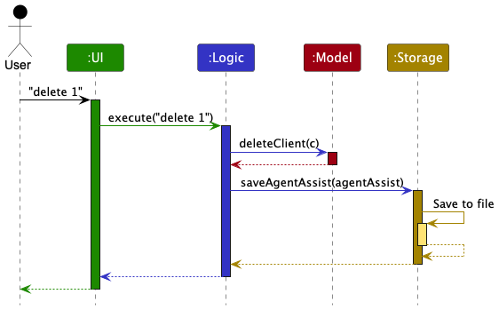
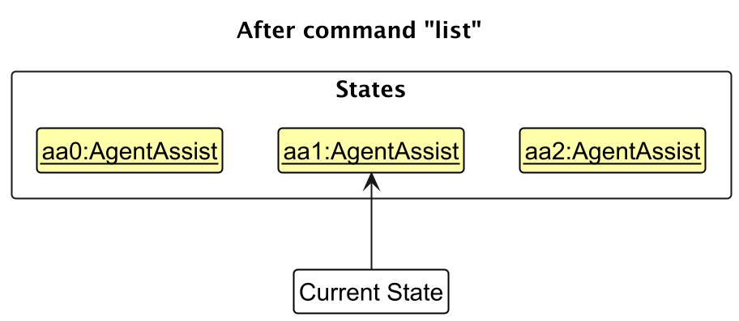

* Table of Contents
{:toc}

--------------------------------------------------------------------------------------------------------------------

## **Acknowledgements**

* {list here sources of all reused/adapted ideas, code, documentation, and third-party libraries -- include links to the original source as well}

--------------------------------------------------------------------------------------------------------------------

## **Setting up, getting started**

Refer to the guide [_Setting up and getting started_](SettingUp.md).

--------------------------------------------------------------------------------------------------------------------

## **Design**

:bulb: **Tip:** The `.puml` files used to create diagrams in this document `docs/diagrams` folder. Refer to the [_PlantUML Tutorial_ at se-edu/guides](https://se-education.org/guides/tutorials/plantUml.html) to learn how to create and edit diagrams.

### Architecture

The ***Architecture Diagram*** given above explains the high-level design of the App.

Given below is a quick overview of main components and how they interact with each other.

**Main components of the architecture**

**`Main`** (consisting of classes [`Main`](https://github.com/se-edu/addressbook-level3/tree/master/src/main/java/seedu/address/Main.java) and [`MainApp`](https://github.com/se-edu/addressbook-level3/tree/master/src/main/java/seedu/address/MainApp.java)) is in charge of the app launch and shut down.
* At app launch, it initializes the other components in the correct sequence, and connects them up with each other.
* At shut down, it shuts down the other components and invokes cleanup methods where necessary.

The bulk of the app's work is done by the following four components:

* [**`UI`**](#ui-component): The UI of the App.
* [**`Logic`**](#logic-component): The command executor.
* [**`Model`**](#model-component): Holds the data of the App in memory.
* [**`Storage`**](#storage-component): Reads data from, and writes data to, the hard disk.

[**`Commons`**](#common-classes) represents a collection of classes used by multiple other components.

**How the architecture components interact with each other**

The *Sequence Diagram* below shows how the components interact with each other for the scenario where the user issues the command `delete 1`.

Each of the four main components (also shown in the diagram above),

* defines its *API* in an `interface` with the same name as the Component.
* implements its functionality using a concrete `{Component Name}Manager` class (which follows the corresponding API `interface` mentioned in the previous point.

For example, the `Logic` component defines its API in the `Logic.java` interface and implements its functionality using the `LogicManager.java` class which follows the `Logic` interface. Other components interact with a given component through its interface rather than the concrete class (reason: to prevent outside component's being coupled to the implementation of a component), as illustrated in the (partial) class diagram below.

The sections below give more details of each component.

### UI component

The **API** of this component is specified in [`Ui.java`](https://github.com/se-edu/addressbook-level3/tree/master/src/main/java/seedu/address/ui/Ui.java)

The UI consists of a `MainWindow` that is made up of parts e.g.`CommandBox`, `ResultDisplay`, `PersonListPanel`, `StatusBarFooter` etc. All these, including the `MainWindow`, inherit from the abstract `UiPart` class which captures the commonalities between classes that represent parts of the visible GUI.

The `UI` component uses the JavaFx UI framework. The layout of these UI parts are defined in matching `.fxml` files that are in the `src/main/resources/view` folder. For example, the layout of the [`MainWindow`](https://github.com/se-edu/addressbook-level3/tree/master/src/main/java/seedu/address/ui/MainWindow.java) is specified in [`MainWindow.fxml`](https://github.com/se-edu/addressbook-level3/tree/master/src/main/resources/view/MainWindow.fxml)

The `UI` component,

* executes user commands using the `Logic` component.
* listens for changes to `Model` data so that the UI can be updated with the modified data.
* keeps a reference to the `Logic` component, because the `UI` relies on the `Logic` to execute commands.
* depends on some classes in the `Model` component, as it displays `Person` object residing in the `Model`.

### Logic component

**API** : [`Logic.java`](https://github.com/se-edu/addressbook-level3/tree/master/src/main/java/seedu/address/logic/Logic.java)

Here's a (partial) class diagram of the `Logic` component:

The sequence diagram below illustrates the interactions within the `Logic` component, taking `execute("delete John")` API call as an example.

:information_source: **Note:** The lifeline for `DeleteCommandParser` should end at the destroy marker (X) but due to a limitation of PlantUML, the lifeline continues till the end of diagram.

How the `Logic` component works:

1. When `Logic` is called upon to execute a command, it is passed to an `AddressBookParser` object which in turn creates a parser that matches the command (e.g., `DeleteCommandParser`) and uses it to parse the command.
1. This results in a `Command` object (more precisely, an object of one of its subclasses e.g., `DeleteCommand`) which is executed by the `LogicManager`.
1. The command can communicate with the `Model` when it is executed (e.g. to delete a person). 
   Note that although this is shown as a single step in the diagram above (for simplicity), in the code it can take several interactions (between the command object and the `Model`) to achieve.
1. The result of the command execution is encapsulated as a `CommandResult` object which is returned back from `Logic`.

Here are the other classes in `Logic` (omitted from the class diagram above) that are used for parsing a user command:

How the parsing works:
* When called upon to parse a user command, the `AddressBookParser` class creates an `XYZCommandParser` (`XYZ` is a placeholder for the specific command name e.g., `AddCommandParser`) which uses the other classes shown above to parse the user command and create a `XYZCommand` object (e.g., `AddCommand`) which the `AddressBookParser` returns back as a `Command` object.
* All `XYZCommandParser` classes (e.g., `AddCommandParser`, `DeleteCommandParser`, ...) inherit from the `Parser` interface so that they can be treated similarly where possible e.g, during testing.

### Model component
**API** : [`Model.java`](https://github.com/se-edu/addressbook-level3/tree/master/src/main/java/seedu/address/model/Model.java)

The `Model` component,

* stores the address book data i.e., all `Person` objects (which are contained in a `UniquePersonList` object).
* stores the currently 'selected' `Person` objects (e.g., results of a search query) as a separate _filtered_ list which is exposed to outsiders as an unmodifiable `ObservableList<Person>` that can be 'observed' e.g. the UI can be bound to this list so that the UI automatically updates when the data in the list change.
* stores a `UserPref` object that represents the user’s preferences. This is exposed to the outside as a `ReadOnlyUserPref` objects.
* does not depend on any of the other three components (as the `Model` represents data entities of the domain, they should make sense on their own without depending on other components)

:information_source: **Note:** An alternative (arguably, a more OOP) model is given below. It has a `Tag` list in the `AddressBook`, which `Person` references. This allows `AddressBook` to only require one `Tag` object per unique tag, instead of each `Person` needing their own `Tag` objects. 

### Storage component

**API** : [`Storage.java`](https://github.com/se-edu/addressbook-level3/tree/master/src/main/java/seedu/address/storage/Storage.java)

The `Storage` component,
* can save both address book data and user preference data in JSON format, and read them back into corresponding objects.
* inherits from both `AddressBookStorage` and `UserPrefStorage`, which means it can be treated as either one (if only the functionality of only one is needed).
* depends on some classes in the `Model` component (because the `Storage` component's job is to save/retrieve objects that belong to the `Model`)

### Common classes

Classes used by multiple components are in the `seedu.address.commons` package.

--------------------------------------------------------------------------------------------------------------------

## **Implementation**

This section describes some noteworthy details on how certain features are implemented.

### \[Proposed\] Undo/redo feature

#### Proposed Implementation

The proposed undo/redo mechanism is facilitated by `VersionedAddressBook`. It extends `AddressBook` with an undo/redo history, stored internally as an `addressBookStateList` and `currentStatePointer`. Additionally, it implements the following operations:

* `VersionedAddressBook#commit()` — Saves the current address book state in its history.
* `VersionedAddressBook#undo()` — Restores the previous address book state from its history.
* `VersionedAddressBook#redo()` — Restores a previously undone address book state from its history.

These operations are exposed in the `Model` interface as `Model#commitAddressBook()`, `Model#undoAddressBook()` and `Model#redoAddressBook()` respectively.

Given below is an example usage scenario and how the undo/redo mechanism behaves at each step.

Step 1. The user launches the application for the first time. The `VersionedAddressBook` will be initialized with the initial address book state, and the `currentStatePointer` pointing to that single address book state.

Step 2. The user executes `delete 5` command to delete the 5th person in the address book. The `delete` command calls `Model#commitAddressBook()`, causing the modified state of the address book after the `delete 5` command executes to be saved in the `addressBookStateList`, and the `currentStatePointer` is shifted to the newly inserted address book state.

Step 3. The user executes `add n/David …​` to add a new person. The `add` command also calls `Model#commitAddressBook()`, causing another modified address book state to be saved into the `addressBookStateList`.

:information_source: **Note:** If a command fails its execution, it will not call `Model#commitAddressBook()`, so the address book state will not be saved into the `addressBookStateList`.

Step 4. The user now decides that adding the person was a mistake, and decides to undo that action by executing the `undo` command. The `undo` command will call `Model#undoAddressBook()`, which will shift the `currentStatePointer` once to the left, pointing it to the previous address book state, and restores the address book to that state.

:information_source: **Note:** If the `currentStatePointer` is at index 0, pointing to the initial AddressBook state, then there are no previous AddressBook states to restore. The `undo` command uses `Model#canUndoAddressBook()` to check if this is the case. If so, it will return an error to the user rather
than attempting to perform the undo.

The following sequence diagram shows how an undo operation goes through the `Logic` component:

:information_source: **Note:** The lifeline for `UndoCommand` should end at the destroy marker (X) but due to a limitation of PlantUML, the lifeline reaches the end of diagram.

Similarly, how an undo operation goes through the `Model` component is shown below:

The `redo` command does the opposite — it calls `Model#redoAddressBook()`, which shifts the `currentStatePointer` once to the right, pointing to the previously undone state, and restores the address book to that state.

:information_source: **Note:** If the `currentStatePointer` is at index `addressBookStateList.size() - 1`, pointing to the latest address book state, then there are no undone AddressBook states to restore. The `redo` command uses `Model#canRedoAddressBook()` to check if this is the case. If so, it will return an error to the user rather than attempting to perform the redo.

Step 5. The user then decides to execute the command `list`. Commands that do not modify the address book, such as `list`, will usually not call `Model#commitAddressBook()`, `Model#undoAddressBook()` or `Model#redoAddressBook()`. Thus, the `addressBookStateList` remains unchanged.

Step 6. The user executes `clear`, which calls `Model#commitAddressBook()`. Since the `currentStatePointer` is not pointing at the end of the `addressBookStateList`, all address book states after the `currentStatePointer` will be purged. Reason: It no longer makes sense to redo the `add n/David …​` command. This is the behavior that most modern desktop applications follow.

The following activity diagram summarizes what happens when a user executes a new command:

#### Design considerations:

**Aspect: How undo & redo executes:**

* **Alternative 1 (current choice):** Saves the entire address book.
  * Pros: Easy to implement.
  * Cons: May have performance issues in terms of memory usage.

* **Alternative 2:** Individual command knows how to undo/redo by
  itself.
  * Pros: Will use less memory (e.g. for `delete`, just save the person being deleted).
  * Cons: We must ensure that the implementation of each individual command are correct.

_{more aspects and alternatives to be added}_

### \[Proposed\] Data archiving

_{Explain here how the data archiving feature will be implemented}_

--------------------------------------------------------------------------------------------------------------------

## **Documentation, logging, testing, configuration, dev-ops**

* [Documentation guide](Documentation.md)
* [Testing guide](Testing.md)
* [Logging guide](Logging.md)
* [Configuration guide](Configuration.md)
* [DevOps guide](DevOps.md)

--------------------------------------------------------------------------------------------------------------------

## **Appendix: Requirements**

### Product scope

**Target user profile**:

* Insurance agents tracking their clients
* Has a need to manage and track a significant number of clients with detailed insurance-related information.
* Frequently engages with clients, requiring automated reminders for appointments, renewals, and follow-ups.
* Prefers desktop apps that support fast and efficient data management over mobile or web alternatives.
* can type fast
* prefers typing to mouse interactions
* is reasonably comfortable using CLI apps

**Value proposition**:  provides quick and efficient access to client details, tailored for insurance agents who need a streamlined interface to manage contacts, track policy updates, and schedule client follow-ups.

### User stories

Priorities: High (must have) - `* * *`, Medium (nice to have) - `* *`, Low (unlikely to have) - `*`

| Priority | As a …​ | I want to …​                                       | So that I can…​                                                               |
|----------|---------|----------------------------------------------------|-------------------------------------------------------------------------------|
| `* * *`  | user    | add clients to my existing addressbook             | store their contacts and respective information                               |
| `* * *`  | user    | know if client has been added successfully         | so that I can proceed with the next steps or take corrective action if needed |
| `* * *`  | user    | know my last and next appointment dates            | remember to attend to the appointment                                         |
| `* * *`  | user    | update existing client details                     | keep their information up to date.                                            |
| `* * *`  | user    | record client's email address                      | contact them through email                                                    |
| `* * *`  | user    | sort clients by renewal dates                      | prioritize my outreach efforts                                                |
| `* * *`  | user    | remove clients should they change insurance agents |                                                                               |
| `* * *`  | user    | categorise my clients based on policies            | easily organise and filter my client list                                     |
| `* * *`  | user    | know when was my client's last appointment         | track when to follow up                                                       |
| `* * *`  | user    | know when is my client's birthday                  | reach out to build rapport                                                    |
| `* * *`  | user    | know when is my client's next insurance payment    | so that I can keep track of client's payment                                  |
*{More to be added}*

### Use cases

(For all use cases below, the **System** is the `AgentConnect` and the **Actor** is the `user`, unless specified otherwise)

**Use case: Add a person**

**MSS**

1.  User adds a new person by entering the command with name, phone number, email, address, insurance type, and appointment dates.
2.  AgentConnect validates the input.
3.  AgentConnect adds the new person with all the details provided.
4.  AgentConnect shows a success message confirming the person has been added.

    Use case ends.

**Extensions**

* 2a. Some fields are invalid (e.g., name, phone, email).
  * 2a1. AgentConnect shows an error message for the invalid fields.
  * 2a2. User corrects the fields and resubmits the command.
  * Use case resumes from step 2.

* 2b. Duplicate person detected (same name + address).
    * 2b1. AgentConnect shows a warning message about the duplicate entry.
    * 2b2. User decides whether to overwrite or cancel the operation.
    * Use case resumes at step 2 if user decides to proceed

**Use case: Delete a person**

**MSS**

1. User enters the delete command with the Index or Name of the person to be deleted.
2. AgentConnect validates the input.
3. AgentConnect confirms the deletion request by showing a confirmation dialog with the Name of the person to be deleted.
4. AgentConnect deletes the contact and shows a success message.

    Use case ends.

**Extensions**
* 2a. Contact not found (Invalid Index or Name).
  * 2a1. AgentConnect shows an error message indicating Index or Name is invalid.
  * 2a2. User can retry with a valid Index or valid Name.
  * Use case resumes from step 2.
* 2b. Duplicate Person detected (same name)
  * 2b1. AgentConnect updates the list in the GUI with the duplicates and prompts the user to delete by index.
  * 2b2. User selects the index to delete the duplicate person.
  * 2b3. Use case resumes from step 3.

**Use case: Delete a policy**

**MSS**

1. User enters the delete command with the index of the client and the index of the policy to be deleted.
2. AgentConnect validates the input.
3. AgentConnect deletes the policy and shows a success message.

    Use case ends.

**Extensions**
* 2a. Client not found (Invalid Index).
  * 2a1. AgentConnect shows an error message indicating Index is invalid.
  * 2a2. User can retry with a valid Index.
  * Use case resumes from step 2.
* 2b. Policy not found (Invalid policy Index).
  * 2b1. AgentConnect shows an error message indicating policy Index is invalid.
  * 2b2. User can retry with a valid policy Index.
  * Use case resumes from step 2.

**Use case: Undo a Delete Command**

**MSS**

1. User enters the undo command after deleting a person or policy.
2. AgentConnect validates the input.
3. AgentConnect restores the deleted person or policy.
4. AgentConnect shows a success message confirming the undo operation.

    Use case ends.

**Extensions**
* 2a. No delete operation to undo.
  * 2a1. AgentConnect shows an error message indicating no delete operation to undo.
  * Use case ends.

**Use case: Sort Clients**

**MSS**

1. User sort the clients by entering the sort command with a valid parameter and order.
2. AgentConnect validates the input.
3. AgentConnect retrieves the current client list from storage.
4. AgentConnect sorts the clients based on the specified parameter and order.
5. AgentConnect updates the client list in the GUI to reflect the new sorted order.
6. AgentConnect shows a success message confirming the clients have been sorted.

    Use case ends.

**Extensions**

* 2a. Sorting parameter are missing or invalid (e.g., name, insurance type, address, policy renewal date).
    * 2a1. AgentConnect shows an error message for the invalid sorting parameter.
    * 2a2. User corrects the sorting parameter and resubmits the command.
    * Use case resumes from step 2.

* 2b. Sorting order are missing or invalid (e.g., asc, desc).
    * 2a1. AgentConnect shows an error message for the invalid sorting order.
    * 2a2. User corrects the sorting order and resubmits the command.
    * Use case resumes from step 2.

**Use case: Edit Client Details**

**MSS**

1.  User edits some details for an existing person by entering the edit command with index of the person and new details.
2.  AgentConnect validates the input.
3.  AgentConnect update the corresponding details of the person with the new details provided.
4.  AgentConnect shows a success message confirming the details fo the person have been edited.

**Extensions**

* 2a. Some fields are invalid (e.g., name, phone, email).
    * 2a1. AgentConnect shows an error message for the invalid fields.
    * 2a2. User corrects the fields and resubmits the command.
    * Use case resumes from step 2.

* 2b. Person not found (Invalid index).
    * 2b1. AgentConnect shows a warning message indicating index is invalid.
    * 2b2. User resubmits the command with a valid index.
    * Use case resumes from step 2.

**Use case: Categorise client by policy**

**MSS**

1.  User requests to list clients.
2.  User selects a client to assign a policy.
3.  AgentConnect assigns the policy to the client.
4.  AgentConnect shows updated client information.
Use case ends.

**Extensions**

* 2a. Client does not exist.
    * 2a1. AgentConnect shows an error message for the invalid client.
    * 2a2. AgentConnect prompts the user to either enter a valid client name or add the client to AgentConnect.
    * Use case resumes from step 2.

* 2b. Policy type is not valid.
    * 2b1. AgentConnect shows an error message for the invalid policy type.
    * 2b2. AgentConnect prompts the user to enter a valid policy type.
    * Use case resumes from step 2.

**Use case: Retrieve appointment date**

**MSS**

1.  User requests to list clients.
2.  User requests to view a client’s appointment dates.
3.  AgentConnect retrieves and displays the requested appointment date.
Use case ends.

**Extensions**

* 2a. No appointment data available.
    * 2a1. AgentConnect shows a message indicating no appointment date available.
    * Use case ends.

* 2b. Invalid client name.
    * 2b1. AgentConnect shows an error message for the invalid client.
    * 2b2. AgentConnect prompts the user to either enter a valid client name or add the client to AgentConnect.
    * Use case resumes from step 1.

**Use case: Retrieve client's birthday**

**MSS**

1.  User requests to list clients.
2.  User requests to view a specific client’s birthday.
3.  AgentConnect retrieves and displays the client’s birthday.
Use case ends.

**Extensions**

* 2a. No birthday data available.
    * 2a1. AgentConnect shows a message indicating no birthday date available.
    * Use case ends.

* 2b. Invalid client name.
    * 2b1. AgentConnect shows an error message for the invalid client.
    * 2b2. AgentConnect prompts the user to either enter a valid client name or add the client to AgentConnect.
    * Use case resumes from step 1.

**Use case: Retrieve next payment date**

**MSS**

1.  User requests to list clients.
2.  User requests to view a client's payment date.
3.  AgentConnect retrieves and display the next payment date.
Use case ends.

**Extensions**

* 2a. No payment data available.
    * 2a1. AgentConnect shows a message indicating no payment data available.
    * Use case ends.

* 2b. Invalid client name.
    * 2b1. AgentConnect shows an error message for the invalid client.
    * 2b2. AgentConnect prompts the user to either enter a valid client name or add the client to AgentConnect.
    * Use case resumes from step 1.

*{More to be added}*

### Non-Functional Requirements

1.  Should be able to hold up to 1000 persons without noticeable lag for typical usage.
2.  A user with above-average typing speed for regular English text should be able to add a new contact (including insurance and appointment details) faster using commands than with the mouse.
3.  The system should provide real-time validation (e.g., when typing the phone number or email) to reduce error rates and ensure correct input formats.
4.  Novice users should be able to complete a typical workflow in under 5 minutes, without external help.
5.  The system codebase should allow for the introduction of new features with less than 10% of existing code modification.
6.  The system should validate all inputs (e.g., phone number, email, insurance details) according to predefined formats (e.g., email must follow a standard email format) to maintain data consistency and integrity.
7.  AgentConnect should detect and handle duplicate entries (based on client name + address) by prompting users to resolve conflicts before adding a new entry.
8.  If the system encounters an unexpected error, it should display a user-friendly error message without exposing technical details and allow the user to retry the action.
9.  The system should respond to common user actions (e.g., adding or deleting a person, sorting clients) within 1 second, ensuring a smooth and responsive experience.

### Glossary

* **Mainstream OS**: Windows, Linux, Unix, MacOS
* **Private contact detail**: A contact detail that is not meant to be shared with others
* **Appointment**: A scheduled meeting or event between the user and a client, managed within AgentConnect, with details like date and purpose.
* **Policy**: An insurance or financial agreement purchased by a client, which can be categorized based on its type (e.g., Life Insurance, Health Insurance, Home Insurance).
* **Client**: A person whose details (e.g., contact information, insurance policies, appointments) are stored and managed within AgentConnect.
* **Duplicate Entry**: When a person with identical details (e.g., same name and address) already exists in the system, the system will flag this as a potential duplicate to avoid redundancy.

--------------------------------------------------------------------------------------------------------------------

## **Appendix: Instructions for manual testing**

Given below are instructions to test the app manually.

:information_source: **Note:** These instructions only provide a starting point for testers to work on;
testers are expected to do more *exploratory* testing.

### Launch and shutdown

1. Initial launch

   1. Download the jar file and copy into an empty folder

   1. Double-click the jar file Expected: Shows the GUI with a set of sample contacts. The window size may not be optimum.

1. Saving window preferences

   1. Resize the window to an optimum size. Move the window to a different location. Close the window.

   1. Re-launch the app by double-clicking the jar file. 
       Expected: The most recent window size and location is retained.

1. _{ more test cases …​ }_

### Deleting a person

1. Deleting a person while all persons are being shown

   1. Prerequisites: List all persons using the `list` command. Multiple persons in the list.

   1. Test case: `delete 1` 
      Expected: First contact is deleted from the list. Details of the deleted contact shown in the status message. Timestamp in the status bar is updated.

   1. Test case: `delete 0` 
      Expected: No person is deleted. Error details shown in the status message. Status bar remains the same.

   1. Other incorrect delete commands to try: `delete`, `delete x`, `...` (where x is larger than the list size) 
      Expected: Similar to previous.

1. _{ more test cases …​ }_

### Saving data

1. Dealing with missing/corrupted data files

   1. _{explain how to simulate a missing/corrupted file, and the expected behavior}_

1. _{ more test cases …​ }_
