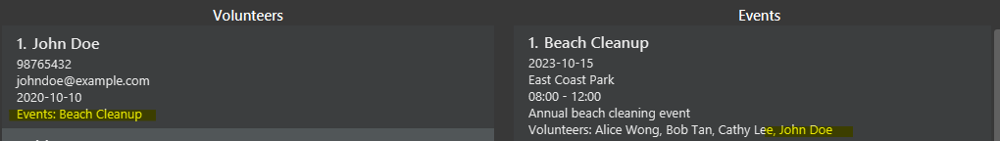

* Table of Contents
{:toc}

--------------------------------------------------------------------------------------------------------------------

## **Acknowledgements**

* Libraries used: [JavaFX](https://openjfx.io/), [Jackson](https://github.com/FasterXML/jackson), [JUnit5](https://junit.org/junit5/)

--------------------------------------------------------------------------------------------------------------------

## **Setting up, getting started**

Refer to the guide [Setting up and getting started](https://ay2425s1-cs2103t-w12-2.github.io/tp/SettingUp.html).

--------------------------------------------------------------------------------------------------------------------

## **Design**

:bulb: **Tip:** The `.puml` files used to create diagrams in this document `docs/diagrams` folder. Refer to the [_PlantUML Tutorial_ at se-edu/guides](https://se-education.org/guides/tutorials/plantUml.html) to learn how to create and edit diagrams.

### Architecture

The ***Architecture Diagram*** given above explains the high-level design of the App.

Given below is a quick overview of main components and how they interact with each other.

**Main components of the architecture**

**`Main`** (consisting of classes [`Main`](https://github.com/se-edu/addressbook-level3/tree/master/src/main/java/seedu/address/Main.java) and [`MainApp`](https://github.com/se-edu/addressbook-level3/tree/master/src/main/java/seedu/address/MainApp.java)) is in charge of the app launch and shut down.
* At app launch, it initializes the other components in the correct sequence, and connects them up with each other.
* At shut down, it shuts down the other components and invokes cleanup methods where necessary.

The bulk of the app's work is done by the following four components:

* [**`UI`**](#ui-component): The UI of the App.
* [**`Logic`**](#logic-component): The command executor.
* [**`Model`**](#model-component): Holds the data of the App in memory.
* [**`Storage`**](#storage-component): Reads data from, and writes data to, the hard disk.

[**`Commons`**](#common-classes) represents a collection of classes used by multiple other components.

**How the architecture components interact with each other**

The *Sequence Diagram* below shows how the components interact with each other for the scenario where the user issues the command `/e delete 1`.

Each of the four main components (also shown in the diagram above),

* defines its *API* in an `interface` with the same name as the Component.
* implements its functionality using a concrete `{Component Name}Manager` class (which follows the corresponding API `interface` mentioned in the previous point.

For example, the `Logic` component defines its API in the `Logic.java` interface and implements its functionality using the `LogicManager.java` class which follows the `Logic` interface. Other components interact with a given component through its interface rather than the concrete class (reason: to prevent outside component's being coupled to the implementation of a component), as illustrated in the (partial) class diagram below.

The sections below give more details of each component.

### UI component

The **API** of this component is specified in [`Ui.java`](https://github.com/se-edu/addressbook-level3/tree/master/src/main/java/seedu/address/ui/Ui.java)

The UI consists of a `MainWindow` that is made up of parts e.g.`CommandBox`, `ResultDisplay`, `EventListPanel`, `VolunteerListPanel`, `StatusBarFooter` etc. All these, including the `MainWindow`, inherit from the abstract `UiPart` class which captures the commonalities between classes that represent parts of the visible GUI.

The `UI` component uses the JavaFx UI framework. The layout of these UI parts are defined in matching `.fxml` files that are in the `src/main/resources/view` folder. For example, the layout of the [`MainWindow`](https://github.com/se-edu/addressbook-level3/tree/master/src/main/java/seedu/address/ui/MainWindow.java) is specified in [`MainWindow.fxml`](https://github.com/se-edu/addressbook-level3/tree/master/src/main/resources/view/MainWindow.fxml)

The `UI` component,

* executes user commands using the `Logic` component.
* listens for changes to `Model` data so that the UI can be updated with the modified data.
* keeps a reference to the `Logic` component, because the `UI` relies on the `Logic` to execute commands.
* depends on some classes in the `Model` component, as it displays `Event` and `Volunteer` objects residing in the `Model`.

### Logic component

**API** : [`Logic.java`](https://github.com/se-edu/addressbook-level3/tree/master/src/main/java/seedu/address/logic/Logic.java)

Here's a (partial) class diagram of the `Logic` component:

The sequence diagram below illustrates the interactions within the `Logic` component, taking `execute("delete 1")` API call as an example.

:information_source: **Note:** The lifeline for `DeleteCommandParser` should end at the destroy marker (X) but due to a limitation of PlantUML, the lifeline continues till the end of diagram.

How the `Logic` component works:

1. When `Logic` is called upon to execute a command, it is passed to an `AddressBookParser` object which in turn creates a parser that matches the command (e.g., `VolunteerDeleteCommandParser`) and uses it to parse the command.
   - However, if it is a command that creates a new event (e.g. /v new), AddressBookParser creates an instance of `VolunteerCommandParser`, which then creates the `VolunteerNewCommandParser` to parse the command.
2. This results in a `Command` object (more precisely, an object of one of its subclasses e.g., `DeleteCommand`) which is executed by the `LogicManager`.
3. The command can communicate with the `Model` when it is executed (e.g. to delete a volunteer). 
   Note that although this is shown as a single step in the diagram above (for simplicity), in the code it can take several interactions (between the command object and the `Model`) to achieve.
4. The result of the command execution is encapsulated as a `CommandResult` object which is returned back from `Logic`.

Here are the other classes in `Logic` (omitted from the class diagram above) that are used for parsing a user command:

How the parsing works:
* When called upon to parse a user command, the `AddressBookParser` class creates an `XYZCommandParser` (`XYZ` is a placeholder for the specific command name e.g., `AddCommandParser`) which uses the other classes shown above to parse the user command and create a `XYZCommand` object (e.g., `AddCommand`) which the `AddressBookParser` returns back as a `Command` object.
* All `XYZCommandParser` classes (e.g., `AddCommandParser`, `DeleteCommandParser`, ...) inherit from the `Parser` interface so that they can be treated similarly where possible e.g, during testing.

### Model component
**API** : [`Model.java`](https://github.com/se-edu/addressbook-level3/tree/master/src/main/java/seedu/address/model/Model.java)

The `Model` component,

* stores the address book data i.e., all `Event` and `Volunteer` objects (which are contained in a `UniqueEventList` and `UniqueVolunteerList` object respectively).
* stores the currently 'selected' `Event` and `Volunteer` objects (e.g., results of a search query) as a separate _filtered_ list which is exposed to outsiders as an unmodifiable `ObservableList<Event>` and `ObservableList<Volunteer` respectively, that can be 'observed' e.g. the UI can be bound to this list so that the UI automatically updates when the data in the list change.
* stores a `UserPref` object that represents the user’s preferences. This is exposed to the outside as a `ReadOnlyUserPref` objects.
* does not depend on any of the other three components (as the `Model` represents data entities of the domain, they should make sense on their own without depending on other components)

### Storage component

**API** : [`Storage.java`](https://github.com/se-edu/addressbook-level3/tree/master/src/main/java/seedu/address/storage/Storage.java)

The `Storage` component,
* can save both address book data and user preference data in JSON format, and read them back into corresponding objects.
* inherits from both `AddressBookStorage` and `UserPrefStorage`, which means it can be treated as either one (if only the functionality of only one is needed).
* depends on some classes in the `Model` component (because the `Storage` component's job is to save/retrieve objects that belong to the `Model`)

### Common classes

Classes used by multiple components are in the [`seedu.address.commons`](https://github.com/AY2425S1-CS2103T-W12-2/tp/tree/master/src/main/java/seedu/address/commons) package.

--------------------------------------------------------------------------------------------------------------------

## **Documentation, logging, testing, configuration, dev-ops**

* [Documentation guide](Documentation.md)
* [Testing guide](Testing.md)
* [Logging guide](Logging.md)
* [Configuration guide](Configuration.md)
* [DevOps guide](DevOps.md)

--------------------------------------------------------------------------------------------------------------------

## **Appendix: Requirements**

### Product scope

**Target user profile**:

* requires efficient management of extensive databases for volunteers and events.
* prefer desktop apps over other types
* can type fast
* prefers typing to mouse interactions
* is reasonably comfortable using CLI apps

**Value proposition**: This application serves to streamline volunteer and for volunteer organisations.
It provides essential tools to track volunteers and events efficiently, enabling organisations to
maintain accurate records and enhance their operational capabilities.

### User stories

Priorities: High (must have) - `* * *`, Medium (nice to have) - `* *`, Low (unlikely to have) - `*`

| Priority | As a …​                                  | I want to …​                           | So that I can…​                                                                      |
|----------|------------------------------------------|----------------------------------------|--------------------------------------------------------------------------------------|
| `* * *`  | HR department employee                   | Remove volunteers                      | Keep volunteer records up to date                                                    |
| `* * *`  | HR department employee                   | View volunteers                        | Quickly access and review the list of all volunteers                                 |
| `* * *`  | HR department employee                   | Export volunteer information           | Generate reports for internal use                                                    |
| `* * *`  | Events director                          | Create events                          | Organize new events to engage volunteers                                             |
| `* * *`  | Events director                          | Remove events                          | Keep the events list clean and up to date                                            |
| `* * *`  | Events director                          | View events                            | Get an overview of upcoming and past events                                          |
| `* * *`  | Events director                          | Add volunteer to event                 | Assign volunteers to specific events                                                 |
| `* * *`  | HR department employee                   | Add event to volunteer                 | Track the events a volunteer has participated in                                     |
| `* * *`  | Events director                          | Remove volunteer from event            | Keep the list of volunteers attending the event updated                              |
| `* * *`  | HR department employee                   | Remove event from volunteer            | Keep the events list for the volunteer clean and up to date                          |
| `* *`    | HR department employee                   | Edit volunteer information             | Update volunteer details such as availability, hours, etc.                           |
| `* *`    | Events director                          | Filter volunteers by availability      | Find available volunteers for a particular event                                     |
| `* *`    | Events director, HR department employee  | Search/filter event by name            | Locate specific events quickly                                                       |
| `* *`    | Events director                          | View volunteers for a particular event | Find out how many volunteers have signed up for the event                            |
| `* *`    | Events director, HR department employee  | Search volunteers by name              | Find a specific volunteer by their name                                              |
| `* *`    | HR department employee                   | Track volunteer hours                  | Monitor and log the hours each volunteer has worked                                  |
| `*`      | General user                             | View event details per volunteer       | See which events a volunteer participated in                                         |
| `*`      | HR department employee                   | View volunteer participation history   | Track volunteer engagement with past events                                          |
| `*`      | General user                             | Toggle view options for events         | Customize how events are displayed in the app                                        |
| `*`      | General user                             | Toggle Dark mode                       | Enhance the app's user experience for those who prefer a darker interface            |
| `*`      | General user                             | Toggle Accessibility features          | Improve usability for visually impaired users through larger fonts and color changes |

### Use cases

 
For the following use cases, the `Actors` are defined as the Management Staff of Volunteer Organisations, and the `System` is defined as VolunSync, unless specified otherwise.

#### UC01. Create Event

**Description**: Create a new event in the system.

**Preconditions**: NA

**MSS**:
1. User enters the event's details.
2. User submits the event's details to the system.
3. System checks if all required information is present, and that all information is valid.
4. System creates the new event and confirms creation to the user. 
  Use Case Ends.

**Extensions**:
- 3a. Information provided is incomplete or invalid.
  - 3ai. System displays error and returns to step 1.
      Use Case Ends.
- 4a. Event creation fails.
  - 4ai. System notifies user and the user can edit the event details, returning to step 2 afterward.
      Use Case Ends.

**Guarantees**:
- New event is stored in the system if all required information is present and valid.

#### UC02. Create Volunteer

**Description**: Create a new Volunteer in the system.

**Preconditions**: NA

**MSS**:
1. User enters the volunteer's details.
2. User submits the volunteer's details to the system.
3. System checks if all required information is present, and that all information is valid.
4. System creates the new event and confirms creation to the user.
     Use Case Ends.

**Extensions**:
- 3a. Information provided is incomplete or invalid.
   - 3ai. System displays error and returns to step 1.
       Use Case Ends.
- 4a. Volunteer creation fails.
   - 4ai. System notifies user and the user can edit the event details, returning to step 2 afterward.
       Use Case Ends.

**Guarantees**:
- New volunteer is stored in the system if all required information is present and valid.

#### UC03. Assign Volunteer to Event

**Description**: Assign a volunteer to a specific event.

**Preconditions**:
- Event exists in the system.
- Volunteer is registered in the system.

**MSS**:
1. User queries all volunteers and events.
2. System displays list of all volunteers and events.
3. User selects the desired volunteer and event to assign the volunteer to.
4. User submits the information to the system.
5. System adds the volunteer to the event and confirms addition. 
   Use Case Ends.

**Extensions**:
- 5a. Volunteer is already assigned to the event.
  - 5ai. System notifies user.
  - 5aii. Volunteer remains assigned to the event. 
    Use Case Ends.  
- 5b. Volunteer is assigned to another event occurring at the same time.
  - 5bi. System notifies user.
  - 5bii. Volunteer is not assigned to the event. 
    Use Case Ends.

**Guarantees**:
- Volunteer is associated with the event in the system if the volunteer is not assigned to another event occurring at the same time.

#### UC04. Find Event by Name

**Description**: Search for an event by their name.

**Preconditions**: There are some events in the system.

**MSS**:
1. User enters a keyword to search for.
2. System looks up all events with names containing the keyword.
3. System notifies the number of matches found and displays the list of events whose names contains the keyword. 
   Use Case Ends.

**Extensions**:
- 2a. No events with names containing the keyword are found.
    - 2ai. System notifies user and displays all events. 
      Use Case Ends.

#### UC05. Find Volunteer by Name

**Description**: Search for a volunteer by their name.

**Preconditions**: NA

**MSS**:
1. User enters a keyword to search for.
2. System looks up all volunteers whose names contain the keyword.
3. System notifies the number of matches found and displays the list of volunteers whose names contains the keyword. 
   Use Case Ends.

**Extensions**:
- 2a. No volunteers whose names contains the keyword are found.
  - 2ai. System notifies user and displays all volunteers. 
    Use Case Ends.

#### UML Use Case Diagram

This diagram shows the main actor (Management Staff) and their interactions with the three primary use cases we've defined. The arrows indicate the relationships between the actor and the use cases, as well as dependencies between use cases.

### Non-Functional Requirements

1. The system should work on any mainstream OS with Java 17 or above.
2. The system should be able to handle up to 1000 volunteers and events without noticeable performance degradation.
3. A user should be able to perform common tasks (add, delete, view) within 5 seconds for typical usage.
4. The system should have a simple and intuitive command-line interface that minimizes the learning curve for new users.
5. System response time for any action should be less than 1 second for all operations.
6. The system should be able to support concurrent users without data corruption or errors.
7. A user with above average typing speed for regular English text (i.e. not code, not system admin commands) should be able to accomplish most of the tasks faster using commands than using the mouse.
8. The system must comply with Personal Data Protection Act (PDPA) to protect volunteer information.
9. The application must include comprehensive logging and error handling to facilitate debugging and system maintenance.
10. The system should be capable of running efficiently on devices with limited resources (e.g., 8GB RAM, 4-core CPU).

11. *{More to be added}*

### Glossary

* **Volunteer**: An individual who participates in a community event without monetary compensation.
* **Event**: A planned activity organised by a community or non-profit organisation, requiring volunteer coordination.
* **Donor**: An individual or organization that contributes funds or resources to support community events.
* **Recurring Events**: Events that occur repeatedly on a set schedule.
* **CLI (Command-Line Interface)**: A text-based interface where users input commands to interact with the application.
* **NFR (Non-Functional Requirement)**: System attributes like performance, scalability, and usability that don’t affect specific functional behaviors.
* **Duplicate Handling**: A system feature that prevents the creation of identical entries.
* **MSS**: Main Success Scenario, the primary flow of events in a use case.

--------------------------------------------------------------------------------------------------------------------

## **Appendix: Instructions for manual testing**

Given below are instructions to test the app manually.

:information_source: **Note:** These instructions only provide a starting point for testers to work on;
testers are expected to do more *exploratory* testing.

### Launch and shutdown

1. Initial launch

   1. Download the jar file and copy into an empty folder

   2. Double-click the jar file to launch VolunSync.  
   Expected: The GUI is displayed with a set of sample contacts as shown below. The window size may not be optimal.
    

   3. Should double-clicking the jar file not launch the application, you may wish to try [running the jar file from the command line](UserGuide.md#quick-start)

2. Saving window preferences

   1. Resize the window to an optimum size. Move the window to a different location. Close the window.

   2. Re-launch the app by double-clicking the jar file.  
   Expected: The most recent window size and location should be retained.

3. Exiting the app

   1. Click the close button in the top right corner of the window or using the `exit` command. 
    Expected: The application should close without any errors.

   2. Upon re-launching the application, the window should appear in the same size and location as when the app was last closed.

### Adding an event

1. Adding an event while all events are being shown

    1. Prerequisites: List all events using the `list` command. Multiple events should be shown in the list.

    2. Test case: `/e new n/ Sail the Seven Seas s/ 19:00 e/ 21:00 d/ 2024-12-12 l/ Changi Beach des/ on board Queen Anns Revenge` 
       Expected: The new event is added to the end of the list. The status message should reflect the successful creation of the event.

    3. Test case: `/e new` 
       Expected: No event is deleted. Error details shown in the status message. Status bar remains the same.

    4. Other incorrect add commands to try: `new`, `/e new [missing fields]`, `...`, where missing fields represents user inputs with some fields (e.g. `n/`, `d/`) missing or left empty. 
       Expected: Similar to previous.

### Adding a volunteer

1. Adding a volunteer while all events are being shown

    1. Prerequisites: List all volunteers using the `list` command. Multiple volunteers should be shown in the list.

    2. Test case: `/v new n/ Aramado Salazar p/ 91234567 em/ getjaggusbarrow@gmail.com d/ 2024-02-02 s/ 00:10 e/ 23:59` 
       Expected: The new volunteer is added to the end of the list. The status message should reflect the successful creation of the volunteer.

    3. Test case: `/v new` 
       Expected: No volunteer is deleted. Error details shown in the status message. Status bar remains the same.

    4. Other incorrect add commands to try: `new`, `/v new [missing fields]`, `...`, where missing fields represents user inputs with some fields (e.g. `n/`, `d/`) missing or left empty. 
       Expected: Similar to previous.

### Deleting an event

1. Deleting an event while all events are being shown

    1. Prerequisites: List all events using the `list` command. Multiple events should be shown in the list.

    2. Test case: `/e del 1` 
       Expected: First event is deleted from the list. The status message should reflect the successful deletion of the event.

    3. Test case: `/e del 0` 
       Expected: No event is deleted. Error details shown in the status message. Status bar remains the same.

    4. Other incorrect delete commands to try: `del 1`, `/e del x`, `...` (where x is larger than the list size) 
       Expected: Similar to previous.

### Deleting a volunteer

1. Deleting a volunteer while all volunteers are being shown

   1. Prerequisites: List all volunteers using the `list` command. Multiple volunteers should be shown in the list.

   2. Test case: `/v del 1` 
      Expected: First volunteer is deleted from the list. The status message should reflect the successful deletion of the volunteer.

   3. Test case: `/v del 0` 
      Expected: No volunteer is deleted. Error details shown in the status message. Status bar remains the same.

   4. Other incorrect delete commands to try: `del 1`, `/v del x`, `...` (where x is larger than the list size) 
      Expected: Similar to previous.

### Assigning a volunteer to an event

1. Assigning a volunteer to an event while all volunteers and events are being shown

   1. Prerequisites: List all volunteers and events using the `list` command. Multiple volunteers and events should be shown in the list.

   2. Test case: `assign e/ 1 v/ 1` 
       Expected: The volunteer is assigned to the event. The status message should reflect the successful assignment of the volunteer to the event. The event should be reflected in the list of events of the volunteer, and the volunteer should be reflected in the list of volunteers of the event as shown below. 
       

   3. Test case: `assign e/ 1 v/ 0` 
       Expected: The volunteer is not assigned to the event. Error details shown in the status message. The event should not be reflected in the list of events of the volunteer, and the volunteer should not be reflected in the list of volunteers of the event as shown below. 
       

   4. Other incorrect assign commands to try: `assign`, `assign e/ 1`, `...` 
      Expected: Similar to previous.

### Un-assigning a volunteer from an event

1. Un-assigning a volunteer from an event while all volunteers and events are being shown

    1. Prerequisites: List all volunteers and events using the `list` command. Multiple volunteers and events should be shown in the list.

    2. Test case: `unassign e/ 1 v/ 1` 
       Expected: The volunteer is unassigned from the event. The status message should reflect the successful un-assignment of the volunteer from the event. The event should be removed from the list of events of the volunteer, and the volunteer should be removed from the list of volunteers of the event as shown below. 
       

   3. Test case: `unassign e/ 1 v/ 0` 
       Expected: The volunteer remains assigned to the event. Error details shown in the status message. The event should be reflected in the list of events of the volunteer, and the volunteer should be reflected in the list of volunteers of the event as shown below. 
       

   4. Other incorrect unassign commands to try: `unassign`, `unassign e/ 1`, `...` 
      Expected: Similar to previous.

### Finding an event by keyword

1. Finding event(s) with names containing a keyword

    1. Prerequisites: List all events using the `list` command. Multiple events should be shown in the list.

    2. Test case: `/e find n/ Sail` 
       Expected: The event with the name containing the keyword "Sail" is shown in the list. The status message should reflect the successful search for the event.

    3. Test case: `/e find n/ [non-existent keyword]` 
       Expected: No event is found. The status message should reflect the absence of any events with the keyword, and all events should be shown in the list.

    4. Other incorrect find commands to try: `find`, `/e find n/`, `...` 
       Expected: Similar to previous.

### Finding a volunteer by keyword

1. Finding volunteer(s) with names containing a keyword

    1. Prerequisites: List all volunteers using the `list` command. Multiple volunteers should be shown in the list.

    2. Test case: `/v find n/ Aramado` 
       Expected: The volunteer with the name containing the keyword "Aramado" is shown in the list. The status message should reflect the successful search for the volunteer.

    3. Test case: `/v find n/ [non-existent keyword]` 
       Expected: No volunteer is found. The status message should reflect the absence of any volunteers with the keyword, and all volunteers should be shown in the list.

    4. Other incorrect find commands to try: `find`, `/v find n/`, `...` 
       Expected: Similar to previous.

### Listing all Events And Volunteers

1. Test case: `list` 
   Expected: All events and volunteers are shown in the list. The status message should reflect the successful listing of all events and volunteers.

## **Appendix: Effort**

### Project Scope and Difficulty
This project was significantly more challenging than the Address Book 3 (AB3) reference project due to its broader scope and the complexity of managing multiple entity types. While AB3 focuses on a single entity type (Persons), our project, **VolunSync**, had to manage and integrate multiple entities such as **Volunteers** and **Events**. This increased the difficulty of implementing features such as assignment, scheduling, and cross-entity dependencies, requiring a robust data model and additional logic.

### Challenges Faced
- **Entity Relationships**: Implementing relationships between entities (e.g., assigning volunteers to events, tracking event participants) posed significant challenges, especially when ensuring data consistency and avoiding duplication.
- **User Experience**: Developing a command-line interface that is both intuitive and efficient for users with varying technical skills was a considerable effort.
- **Testing and Coverage**: Achieving high test coverage for a complex system with multiple interdependent features added to the project workload.

### Effort Required
The project involved **approximately 1.5x the effort required for AB3**, primarily due to the increased complexity of handling multiple entities and implementing advanced features such as:
- Filtering of volunteers based on availability
- Volunteer assignment with overlap checks.
- Listing information of volunteers involved in events and vice versa.
- Restructuring of UI to handle dynamic updating of information and new commands.

### Achievements
Despite the challenges, the team successfully:
- Developed a scalable and efficient system that meets the needs of nonprofit organizations.
- Achieved high test coverage for core functionalities.
- Implemented a user-friendly interface while maintaining fast response times for all operations.
- Added additional features like volunteer tracking and reporting, going beyond the base functionality of AB3.

### Reuse and Libraries
To save effort, the project reused several libraries, which provided critical functionality:
1. **JavaFX**: For building the graphical user interface. This significantly reduced the time required to implement the UI from scratch.
2. **Jackson**: For handling JSON serialization and deserialization, enabling faster development of the storage module.
3. **JUnit 5**: For unit testing, which streamlined the testing process and improved overall code quality.

For example, the **storage module** leverages Jackson for JSON parsing. Our work involved adapting Jackson to our specific data model (e.g., custom serializers/deserializers), as seen in classes like `JsonAdaptedVolunteer` and `JsonAdaptedEvent`. This saved an estimated **10-15% of effort** compared to building a storage parser from scratch.

### Conclusion
The project demonstrated a high level of effort and collaboration, resulting in a feature-rich and robust application that addresses the real-world challenges faced by nonprofit organizations. It serves as a testament to the team’s ability to deliver a product that is both scalable and user-focused.

## **Appendix: Planned Enhancements**

**Team size: 5**

The following planned enhancements address known feature flaws identified during the PE-D phase. Each enhancement specifically describes the feature flaw and the proposed solution, providing details on how the feature will be improved. This section lists 3 planned enhancements, adhering to the team size x 2 limit.

1. **Enhance Event List Sorting**
    - **Feature Flaw**: Events are currently displayed in the order they were added, making it difficult to find upcoming events.
    - **Proposed Fix**: Add sorting options to the event list, such as sorting by date, time, or location. Command example: `/e list sort/date`.
    - **Expected Outcome**: Improved usability for managing events.

2. **Enhance Search Functionality**
    - **Feature Flaw**: The current search command does not support searching for email or phone number.
    - **Proposed Fix**: Update the search functionality to allow for searching email and phone number. For example, searching for `93456` will return `David Ng`.
    - **Expected Outcome**: More flexible search results.

These planned enhancements aim to address known issues and improve the overall usability, reliability, and user experience of **VolunSync**.

