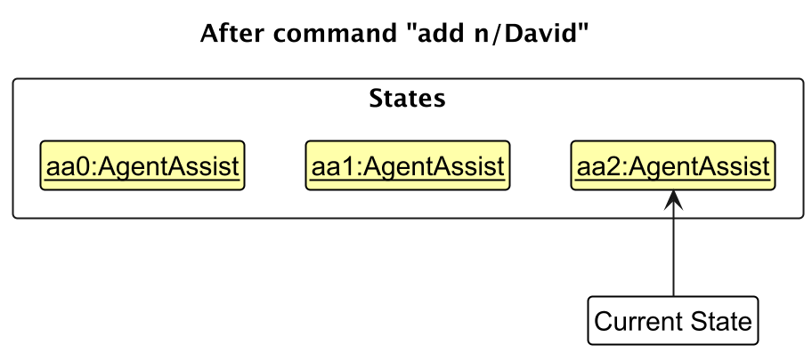

* Table of Contents
{:toc}

--------------------------------------------------------------------------------------------------------------------

## **Acknowledgements**

* {list here sources of all reused/adapted ideas, code, documentation, and third-party libraries -- include links to the original source as well}

--------------------------------------------------------------------------------------------------------------------

## **Setting up, getting started**

Refer to the guide [_Setting up and getting started_](SettingUp.md).

--------------------------------------------------------------------------------------------------------------------

## **Design**

:bulb: **Tip:** The `.puml` files used to create diagrams in this document `docs/diagrams` folder. Refer to the [_PlantUML Tutorial_ at se-edu/guides](https://se-education.org/guides/tutorials/plantUml.html) to learn how to create and edit diagrams.

### Architecture

The ***Architecture Diagram*** given above explains the high-level design of the App.

Given below is a quick overview of main components and how they interact with each other.

**Main components of the architecture**

**`Main`** (consisting of classes [`Main`](https://github.com/se-edu/addressbook-level3/tree/master/src/main/java/seedu/address/Main.java) and [`MainApp`](https://github.com/se-edu/addressbook-level3/tree/master/src/main/java/seedu/address/MainApp.java)) is in charge of the app launch and shut down.
* At app launch, it initializes the other components in the correct sequence, and connects them up with each other.
* At shut down, it shuts down the other components and invokes cleanup methods where necessary.

The bulk of the app's work is done by the following four components:

* [**`UI`**](#ui-component): The UI of the App.
* [**`Logic`**](#logic-component): The command executor.
* [**`Model`**](#model-component): Holds the data of the App in memory.
* [**`Storage`**](#storage-component): Reads data from, and writes data to, the hard disk.

[**`Commons`**](#common-classes) represents a collection of classes used by multiple other components.

**How the architecture components interact with each other**

The *Sequence Diagram* below shows how the components interact with each other for the scenario where the user issues the command `delete 1`.

Each of the four main components (also shown in the diagram above),

* defines its *API* in an `interface` with the same name as the Component.
* implements its functionality using a concrete `{Component Name}Manager` class (which follows the corresponding API `interface` mentioned in the previous point.

For example, the `Logic` component defines its API in the `Logic.java` interface and implements its functionality using the `LogicManager.java` class which follows the `Logic` interface. Other components interact with a given component through its interface rather than the concrete class (reason: to prevent outside component's being coupled to the implementation of a component), as illustrated in the (partial) class diagram below.

The sections below give more details of each component.

### UI component

The **API** of this component is specified in [`Ui.java`](https://github.com/se-edu/addressbook-level3/tree/master/src/main/java/seedu/address/ui/Ui.java)

The UI consists of a `MainWindow` that is made up of parts e.g.`CommandBox`, `ResultDisplay`, `PersonListPanel`, `StatusBarFooter` etc. All these, including the `MainWindow`, inherit from the abstract `UiPart` class which captures the commonalities between classes that represent parts of the visible GUI.

The `UI` component uses the JavaFx UI framework. The layout of these UI parts are defined in matching `.fxml` files that are in the `src/main/resources/view` folder. For example, the layout of the [`MainWindow`](https://github.com/se-edu/addressbook-level3/tree/master/src/main/java/seedu/address/ui/MainWindow.java) is specified in [`MainWindow.fxml`](https://github.com/se-edu/addressbook-level3/tree/master/src/main/resources/view/MainWindow.fxml)

The `UI` component,

* executes user commands using the `Logic` component.
* listens for changes to `Model` data so that the UI can be updated with the modified data.
* keeps a reference to the `Logic` component, because the `UI` relies on the `Logic` to execute commands.
* depends on some classes in the `Model` component, as it displays `Person` object residing in the `Model`.

### Logic component

**API** : [`Logic.java`](https://github.com/se-edu/addressbook-level3/tree/master/src/main/java/seedu/address/logic/Logic.java)

Here's a (partial) class diagram of the `Logic` component:

The sequence diagram below illustrates the interactions within the `Logic` component, taking `execute("delete 1")` API call as an example.

:information_source: **Note:** The lifeline for `DeleteCommandParser` should end at the destroy marker (X) but due to a limitation of PlantUML, the lifeline continues till the end of diagram.

How the `Logic` component works:

1. When `Logic` is called upon to execute a command, it is passed to an `AddressBookParser` object which in turn creates a parser that matches the command (e.g., `DeleteCommandParser`) and uses it to parse the command.
1. This results in a `Command` object (more precisely, an object of one of its subclasses e.g., `DeleteCommand`) which is executed by the `LogicManager`.
1. The command can communicate with the `Model` when it is executed (e.g. to delete a person). 
   Note that although this is shown as a single step in the diagram above (for simplicity), in the code it can take several interactions (between the command object and the `Model`) to achieve.
1. The result of the command execution is encapsulated as a `CommandResult` object which is returned back from `Logic`.

Here are the other classes in `Logic` (omitted from the class diagram above) that are used for parsing a user command:

How the parsing works:
* When called upon to parse a user command, the `AddressBookParser` class creates an `XYZCommandParser` (`XYZ` is a placeholder for the specific command name e.g., `AddCommandParser`) which uses the other classes shown above to parse the user command and create a `XYZCommand` object (e.g., `AddCommand`) which the `AddressBookParser` returns back as a `Command` object.
* All `XYZCommandParser` classes (e.g., `AddCommandParser`, `DeleteCommandParser`, ...) inherit from the `Parser` interface so that they can be treated similarly where possible e.g, during testing.

### Model component
**API** : [`Model.java`](https://github.com/se-edu/addressbook-level3/tree/master/src/main/java/seedu/address/model/Model.java)

The `Model` component,

* stores the address book data i.e., all `Person` objects (which are contained in a `UniquePersonList` object).
* stores the currently 'selected' `Person` objects (e.g., results of a search query) as a separate _filtered_ list which is exposed to outsiders as an unmodifiable `ObservableList<Person>` that can be 'observed' e.g. the UI can be bound to this list so that the UI automatically updates when the data in the list change.
* stores a `UserPref` object that represents the user’s preferences. This is exposed to the outside as a `ReadOnlyUserPref` objects.
* does not depend on any of the other three components (as the `Model` represents data entities of the domain, they should make sense on their own without depending on other components)

:information_source: **Note:** An alternative (arguably, a more OOP) model is given below. It has a `Tag` list in the `AddressBook`, which `Person` references. This allows `AddressBook` to only require one `Tag` object per unique tag, instead of each `Person` needing their own `Tag` objects. 

### Storage component

**API** : [`Storage.java`](https://github.com/se-edu/addressbook-level3/tree/master/src/main/java/seedu/address/storage/Storage.java)

The `Storage` component,
* can save both address book data and user preference data in JSON format, and read them back into corresponding objects.
* inherits from both `AddressBookStorage` and `UserPrefStorage`, which means it can be treated as either one (if only the functionality of only one is needed).
* depends on some classes in the `Model` component (because the `Storage` component's job is to save/retrieve objects that belong to the `Model`)

### Common classes

Classes used by multiple components are in the `seedu.address.commons` package.

--------------------------------------------------------------------------------------------------------------------

## **Implementation**

This section describes some noteworthy details on how certain features are implemented.

### \[Proposed\] Undo/redo feature

#### Proposed Implementation

The proposed undo/redo mechanism is facilitated by `VersionedAddressBook`. It extends `AddressBook` with an undo/redo history, stored internally as an `addressBookStateList` and `currentStatePointer`. Additionally, it implements the following operations:

* `VersionedAddressBook#commit()` — Saves the current address book state in its history.
* `VersionedAddressBook#undo()` — Restores the previous address book state from its history.
* `VersionedAddressBook#redo()` — Restores a previously undone address book state from its history.

These operations are exposed in the `Model` interface as `Model#commitAddressBook()`, `Model#undoAddressBook()` and `Model#redoAddressBook()` respectively.

Given below is an example usage scenario and how the undo/redo mechanism behaves at each step.

Step 1. The user launches the application for the first time. The `VersionedAddressBook` will be initialized with the initial address book state, and the `currentStatePointer` pointing to that single address book state.

Step 2. The user executes `delete 5` command to delete the 5th person in the address book. The `delete` command calls `Model#commitAddressBook()`, causing the modified state of the address book after the `delete 5` command executes to be saved in the `addressBookStateList`, and the `currentStatePointer` is shifted to the newly inserted address book state.

Step 3. The user executes `add n/David …​` to add a new person. The `add` command also calls `Model#commitAddressBook()`, causing another modified address book state to be saved into the `addressBookStateList`.

:information_source: **Note:** If a command fails its execution, it will not call `Model#commitAddressBook()`, so the address book state will not be saved into the `addressBookStateList`.

Step 4. The user now decides that adding the person was a mistake, and decides to undo that action by executing the `undo` command. The `undo` command will call `Model#undoAddressBook()`, which will shift the `currentStatePointer` once to the left, pointing it to the previous address book state, and restores the address book to that state.

:information_source: **Note:** If the `currentStatePointer` is at index 0, pointing to the initial AddressBook state, then there are no previous AddressBook states to restore. The `undo` command uses `Model#canUndoAddressBook()` to check if this is the case. If so, it will return an error to the user rather
than attempting to perform the undo.

The following sequence diagram shows how an undo operation goes through the `Logic` component:

:information_source: **Note:** The lifeline for `UndoCommand` should end at the destroy marker (X) but due to a limitation of PlantUML, the lifeline reaches the end of diagram.

Similarly, how an undo operation goes through the `Model` component is shown below:

The `redo` command does the opposite — it calls `Model#redoAddressBook()`, which shifts the `currentStatePointer` once to the right, pointing to the previously undone state, and restores the address book to that state.

:information_source: **Note:** If the `currentStatePointer` is at index `addressBookStateList.size() - 1`, pointing to the latest address book state, then there are no undone AddressBook states to restore. The `redo` command uses `Model#canRedoAddressBook()` to check if this is the case. If so, it will return an error to the user rather than attempting to perform the redo.

Step 5. The user then decides to execute the command `list`. Commands that do not modify the address book, such as `list`, will usually not call `Model#commitAddressBook()`, `Model#undoAddressBook()` or `Model#redoAddressBook()`. Thus, the `addressBookStateList` remains unchanged.

Step 6. The user executes `clear`, which calls `Model#commitAddressBook()`. Since the `currentStatePointer` is not pointing at the end of the `addressBookStateList`, all address book states after the `currentStatePointer` will be purged. Reason: It no longer makes sense to redo the `add n/David …​` command. This is the behavior that most modern desktop applications follow.

The following activity diagram summarizes what happens when a user executes a new command:

#### Design considerations:

**Aspect: How undo & redo executes:**

* **Alternative 1 (current choice):** Saves the entire address book.
  * Pros: Easy to implement.
  * Cons: May have performance issues in terms of memory usage.

* **Alternative 2:** Individual command knows how to undo/redo by
  itself.
  * Pros: Will use less memory (e.g. for `delete`, just save the person being deleted).
  * Cons: We must ensure that the implementation of each individual command are correct.

_{more aspects and alternatives to be added}_

### \[Proposed\] Data archiving

_{Explain here how the data archiving feature will be implemented}_

--------------------------------------------------------------------------------------------------------------------

## **Documentation, logging, testing, configuration, dev-ops**

* [Documentation guide](Documentation.md)
* [Testing guide](Testing.md)
* [Logging guide](Logging.md)
* [Configuration guide](Configuration.md)
* [DevOps guide](DevOps.md)

--------------------------------------------------------------------------------------------------------------------

## **Appendix: Requirements**

### Product scope

**Target user profile**:

* has a need to manage a significant number of contacts
* prefer desktop apps over other types
* can type fast
* prefers typing to mouse interactions
* is reasonably comfortable using CLI apps

**Value proposition**: manage contacts faster than a typical mouse/GUI driven app

### User stories

Priorities: High (must have) - `* * *`, Medium (nice to have) - `* *`, Low (unlikely to have) - `*`

| Priority | As a …​                                    | I want to …​                     | So that I can…​                                                        |
| -------- | ------------------------------------------ | ------------------------------ | ---------------------------------------------------------------------- |
| `* * *`  | new user                                   | see usage instructions         | refer to instructions when I forget how to use the App                 |
| `* * *`  | user                                       | add a new person               |                                                                        |
| `* * *`  | user                                       | delete a person                | remove entries that I no longer need                                   |
| `* * *`  | user                                       | find a person by name          | locate details of persons without having to go through the entire list |
|`* * *`   | user                                       | add a subject to a student     | track what subject students are taking                                 |
| `* *`    | user                                       | hide private contact details   | minimize chance of someone else seeing them by accident                |
| `*`      | user with many persons in the address book | sort persons by name           | locate a person easily                                                 |

*{More to be added}*

# Use cases

(For all use cases below, the **System** is the `EduLog` and the **Actor** is the `Teacher`, unless specified otherwise)

## UC1: Add a class
* Postcondition: A class, with at least a name, date, and time is created

**MSS**

1.  Teacher initiates the process to add a new class in EduLog
2.  System provides the required fields for class information
3.  Teacher supplies the information
4.  System validates the provided information to ensure it meets any specified criteria (e.g., uniqueness).
5. System confirms that class has been added

### **Extension:**

* 2a. Teacher wants to abort the ‘add class’ process

  * 2a1. Teacher can clear fields and exit the procedure
  
    Use case ends.

* 4a. Class with description already exists

    * 4a1. System alerts the teacher that the class exists and displays its details

      Use case ends.

* 4b. Invalid class details (see features)

    * 4b1. System alerts the teacher and prompts them to correct the invalid information

      Use case ends.

## UC2: Delete a class**

* Postcondition: An existing class is deleted

**MSS**

1.  Teacher initiates the process to delete a new class in EduLog
2.  System provides the required fields for class information
3.  Teacher supplies the information
4.  System validates the provided information to ensure it meets any specified criteria.
5. System confirms that class has been deleted

    Use case ends.

### **Extension:**

* 2a. Teacher wants to abort the ‘delete class’ process

  * 2a1. Teacher can clear fields and exit the procedure
  
  Use case ends.

* 4a. Class with description does not exist

    * 4a1. System alerts the teacher that the class does not exist, and prompts user to check again

      Use case ends.

* 4b. Invalid class details (see features)

    * 4b1. System alerts the teacher and prompts them to correct the invalid information

      Use case ends.

## UC3: Add student

**System**: EduLog  
**Actor**: Teacher  
**Postcondition**: A student, with at least a name, is successfully enrolled in at least one class

**MSS:**
1. Teacher initiates the process to add a new student in EduLog.
2. System provides the required fields for student information.
3. Teacher supplies the information.
4. System validates the provided information to ensure it meets any specified criteria (e.g., uniqueness).
5. System confirms that the student has been added.

### **Extension:**

- **2a. Teacher wants to abort the ‘add student’ process**  
  Teacher can clear fields and exit the procedure.

- **4a. Student with the same name already exists**  
  System alerts the teacher that the student exists and displays their details.

- **4b. Invalid student details**  
  System alerts the teacher and prompts them to correct the invalid information.

- **4c. Subject does not exist**  
  System prompts the teacher to first create the tag using <u>UC7: Create a Subject</u>.

- **4d. Class does not exist**  
  System prompts the teacher to first create the class using <u>UC1: Add a Class</u>.

- **4e. Tag does not exist**  
  System prompts the teacher to first create the tag using <u>UC5: Create a Tag</u>.

## UC4: Edit student

**System**: EduLog  
**Actor**: Teacher  

**MSS:**
1. Teacher initiates the process to edit an existing student in EduLog.
2. System provides the required fields for student information.
3. Teacher supplies the updated information.
4. System validates the provided information to ensure it meets any specified criteria (e.g., uniqueness).
5. System confirms that the student has been successfully updated.

### **Extension:**
- **2a. Teacher wants to abort the ‘edit student’ process:**  
  Teacher can clear fields and exit the procedure.

- **4a. Student with new name already exists**  
  System alerts the teacher that the student exists and displays their details.

- **4b. Invalid student details (see features):**  
  System alerts the teacher and prompts them to correct the invalid information.

- **4c. Subject does not exist**  
  System prompts the teacher to first create the tag using <u>UC7: Create a Subject</u>.

- **4d. Class does not exist**  
  System prompts the teacher to first create the class using <u>UC1: Add a Class</u>.

- **4e. Tag does not exist**  
  System prompts the teacher to first create the tag using <u>UC5: Create a Tag</u>.

## UC5: Create Tag

**System**: EduLog  
**Actor**: Teacher

**MSS:**
1. Teacher initiates the process to create a new tag.
2. System displays the required fields for tag creation.
3. Teacher supplies the necessary information for the new tag.
4. System validates the provided information to ensure it meets specified criteria.
5. System confirms that the tag has been successfully created and is available for use.

### **Extension:**
- **2a. Teacher wants to abort the ‘create tag’ process:**  
  Teacher clears the fields and exits the procedure without saving any data.

- **3a. Tag with the same name already exists**  
  System alerts the teacher that the tag exists and no new tag is created.

- **3b. Invalid tag details:**  
  System alerts the teacher if any of the entered details are invalid.  
  System prompts the teacher to correct the information before proceeding.

## UC6: Edit tag

**System**: EduLog  
**Actor**: Teacher

**MSS:**
1. Teacher initiates the process to edit an existing tag.
2. System displays the required fields for tag editing.
3. Teacher supplies the necessary information for the updated tag.
4. System validates the provided information to ensure it meets specified criteria.
5. System confirms that the tag has been successfully updated and is available for use.

### **Extension:**
- **2a. Teacher wants to abort the ‘edit tag’ process:**  
  Teacher clears the fields and exits the procedure without saving any data.

- **3a. Tag with new name already exists**  
  System alerts the teacher that the tag exists.  
  System requests to add another name.

- **3b. Invalid tag details (see features):**  
  System alerts the teacher if any of the entered details are invalid.  
  System prompts the teacher to correct the information before proceeding.

## UC7: Delete tag

**System**: EduLog  
**Actor**: Teacher

**MSS:**
1. Teacher selects a tag to delete.
2. System prompts the teacher for confirmation before permanently deleting the tag.
3. System deletes the tag.

### **Extension:**

- **1a. Tag does not exist**  
  System alerts the teacher that the tag does not exist and cannot be deleted.

- **2a. Teacher wants to abort the ‘delete tag’ process:**  
  Teacher cancels the operation and exits the procedure without deleting the tag.

## UC8: View students (Nikhil)

**System:** EduLog  
**Actor:** Teacher  
**Precondition:** The teacher is logged into the app.

**MSS:**

1. Teacher requests to see students enrolled under him/her.  
2. System displays the students enrolled under her.  
   Use case ends.

### **Extension:**

**1a.** **Teacher requested to view invalid student**

**1a1.** System notifies the teacher that the student is not present in her set of students.

**1a2.** System requests the teacher for the correct student name.

Steps 1a1-1a2 are repeated until an existing student is selected.

Use case resumes from Step 2.

## UC9: Remove student (Nikhil)

**System:** EduLog  
**Actor:** Teacher  
**Precondition:** The teacher is logged into the app, the student is present in the list of students enrolled under the teacher.  
**Postcondition:** The student is removed from the teacher’s list of students.

**MSS:**

1. Teacher views the students enrolled under him/her through U1. View Students  
2. Teacher selects a student to delete.  
3. Teacher requests to delete the student.  
4. System confirms that the student has been removed.  
   Teacher repeats steps 3-5 for any remaining students they wish to remove.  
   Use case ends.

### **Extension:**

**3a.** **Student no longer exists in the list of the teacher’s students:**

**3a1.** System notifies the teacher that the student is not present in her set of students.

Use case ends.

### Non-Functional Requirements

1. Edulog should work on any mainstream OS, as long as the system has `java 17 jdk` installed.
2. The app should work on any mainstream computer architecture.
3. The app should also work on 32-bit and 64-bit architecture.
4.  Any command inputted by the user must be resolved within 1 second.
5. The app should be able to store 1000 student entries without any noticeable lag.
6. The app should not need any additional installation steps to run. The user only needs to run `java -jar Edulog.jar` to run the app.
7. The app should work without internet connection.
8. The app should work in devices with at least 4 GB of RAM and 64G of storage.
9. The app should take up at most 100MB of space, but this does not include user data.
10. The user needs only a keyboard to utilise all functionalities of the app.
11. Any external libraries used must be open sourced.
12. The app must not use a DBMS to store user data.
13. The GUI must work well (i.e everything displayed appropriately) for screen resolutions of 1920X1080 and higher.

### Glossary

1. Mainstream OS: Ubuntu, Mint, Windows, MacOS
2. Mainstream computer architecture: x86\_64, arm64
3. Java 17 jdk: The java 17 development kit, which runs a java 17 program in a virtual environment
4. CLI: command line interface
5. MSS: Main success scenario
6. 32-bit, 64-bit: refers to how many bits a cpu can process
7. RAM: random access memory
8. DBMS: Database management system
9. GUI: Graphic user interface
--------------------------------------------------------------------------------------------------------------------

## **Appendix: Instructions for manual testing**

Given below are instructions to test the app manually.

:information_source: **Note:** These instructions only provide a starting point for testers to work on;
testers are expected to do more *exploratory* testing.

### Launch and shutdown

1. Initial launch

   1. Download the jar file and copy into an empty folder

   1. Double-click the jar file Expected: Shows the GUI with a set of sample contacts. The window size may not be optimum.

1. Saving window preferences

   1. Resize the window to an optimum size. Move the window to a different location. Close the window.

   1. Re-launch the app by double-clicking the jar file. 
       Expected: The most recent window size and location is retained.

1. _{ more test cases …​ }_

### Deleting a person

1. Deleting a person while all persons are being shown

   1. Prerequisites: List all persons using the `list` command. Multiple persons in the list.

   1. Test case: `delete 1` 
      Expected: First contact is deleted from the list. Details of the deleted contact shown in the status message. Timestamp in the status bar is updated.

   1. Test case: `delete 0` 
      Expected: No person is deleted. Error details shown in the status message. Status bar remains the same.

   1. Other incorrect delete commands to try: `delete`, `delete x`, `...` (where x is larger than the list size) 
      Expected: Similar to previous.

1. _{ more test cases …​ }_

### Saving data

1. Dealing with missing/corrupted data files

   1. _{explain how to simulate a missing/corrupted file, and the expected behavior}_

1. _{ more test cases …​ }_
