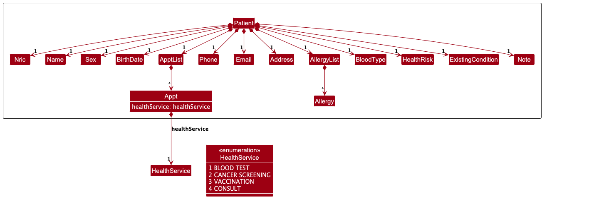
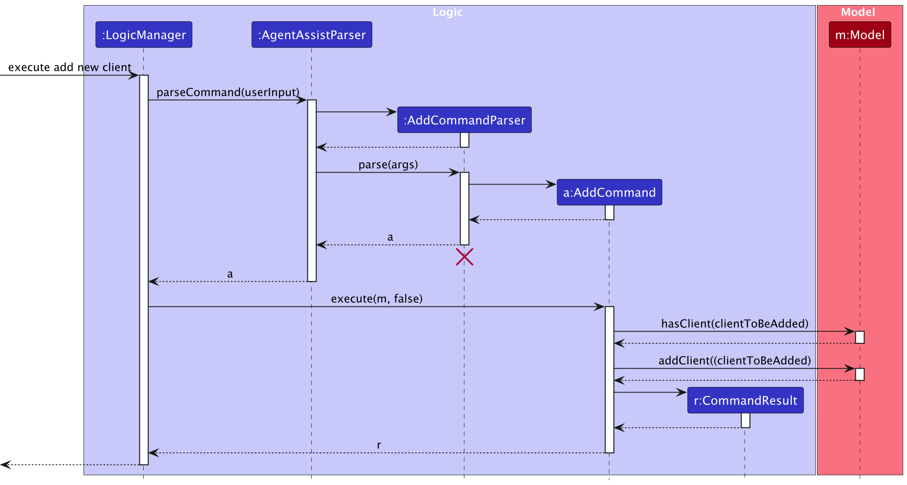
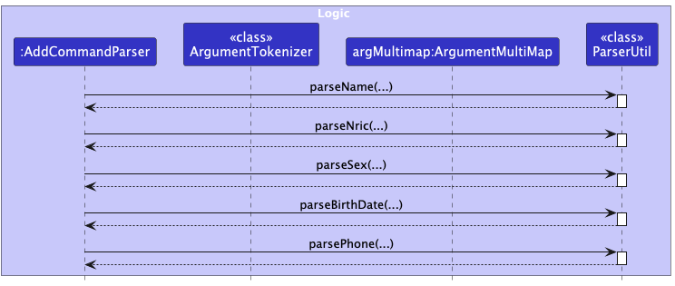
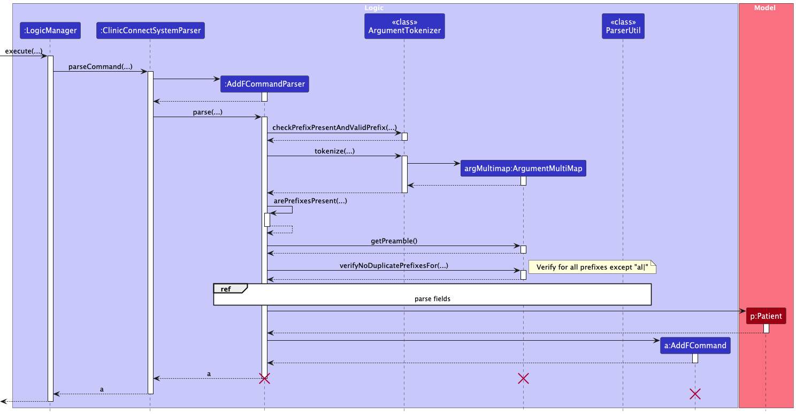
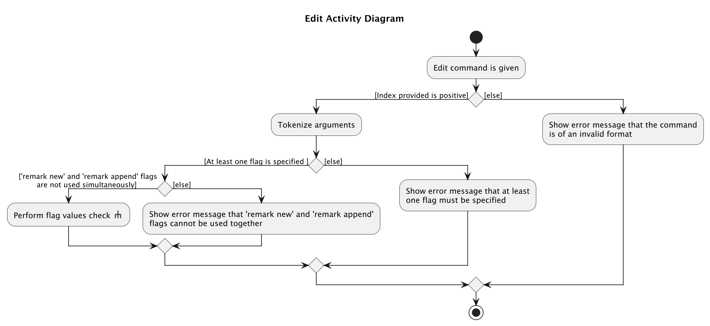
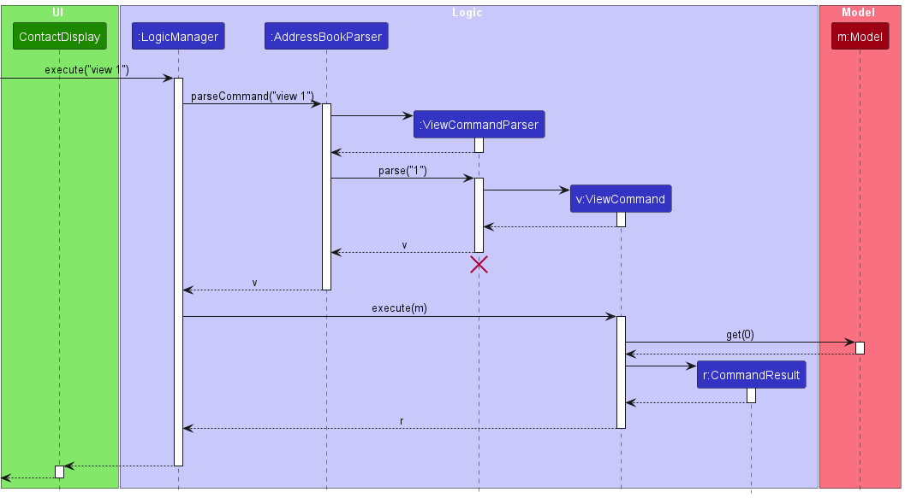
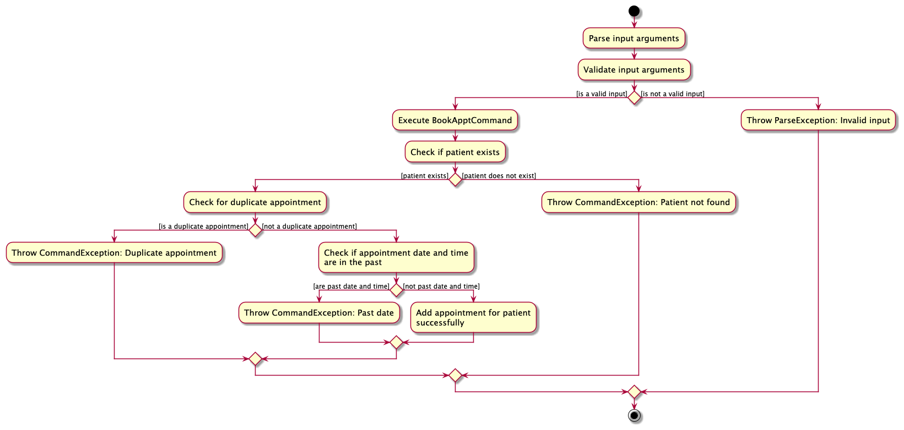
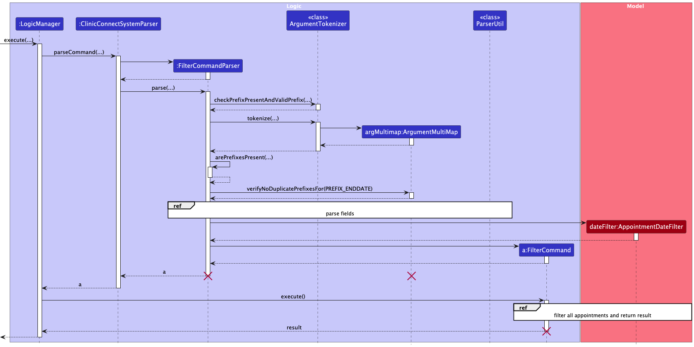

## Table of Contents
1. [Acknowledgements](#acknowledgements)
2. [Setting up, getting started](#setting-up-getting-started)
3. [Design](#design)
   * [Architecture](#architecture)
   * [UI component](#ui-component)
   * [Logic component](#logic-component)
   * [Model component](#model-component)
   * [Storage component](#storage-component)
   * [Common classes](#common-classes)
4. [Implementation](#implementation)
   * [General Features](#general-features)
     * [Help Command : `help`](#help-command--help)
     * [Home Command : `home`](#home-command--home)
     * [Clear Command : `clear`](#clear-command--clear)
     * [Exit Command : `exit`](#exit-command--exit)
   * [Patient Management Features](#patient-management-features)
     * [Add Command : `add`](#add-command--add)
     * [Add Full Command : `addf`](#add-full-command--addf)
     * [Edit Command : `edit`](#edit-command--edit)
     * [Delete Command : `delete`](#delete-command--delete)
     * [View Command : `view`](#view-command--view)
   * [Appointment Management Features](#appointment-management-features)
     * [Book Appointment : `bookappt`](#book-appointment--bookappt)
     * [Delete Appointment : `deleteappt`](#delete-appointment--deleteappt)
     * [Filter Appointment : `filter`](#filter-appointment--filter)
5. [Documentation, logging, testing, configuration, dev-ops](#documentation-logging-testing-configuration-dev-ops)
6. [Appendix](#appendix)
   * [Appendix A: Product Scope](#appendix-a-product-scope)
   * [Appendix B: User Stories](#appendix-b-user-stories)
   * [Appendix C: Use Cases](#appendix-c-use-cases)
   * [Appendix D: Non-Functional Requirements](#appendix-d-non-functional-requirements)
   * [Appendix E: Glossary](#appendix-e-glossary)
   * [Appendix F: Instructions for manual testing](#appendix-f-instructions-for-manual-testing)
   * [Appendix G: Planned Enhancements](#appendix-g-planned-enhancements)
   * [Appendix H: Effort](#appendix-h-effort)

--------------------------------------------------------------------------------------------------------------------

## **Acknowledgements**

Our project was made with AI assistance from [GitHub Copilot](https://github.com/features/copilot/) to finish small snippets of code and to provide suggestions.

--------------------------------------------------------------------------------------------------------------------

## **Setting up, getting started**

Refer to the guide [_Setting up and getting started_](SettingUp.md).

--------------------------------------------------------------------------------------------------------------------

## **Design**

### Architecture

The ***Architecture Diagram*** given above explains the high-level design of the App.

Given below is a quick overview of main components and how they interact with each other.

**Main components of the architecture**

**`Main`** (consisting of classes [`Main`](https://github.com/AY2425S1-CS2103T-F10-2/tp/tree/master/src/main/java/seedu/address/Main.java) and [`MainApp`](https://github.com/AY2425S1-CS2103T-F10-2/tp/tree/master/src/main/java/seedu/address/MainApp.java)) is in charge of the app launch and shut down.
* At app launch, it initializes the other components in the correct sequence, and connects them up with each other.
* At shut down, it shuts down the other components and invokes cleanup methods where necessary.

The bulk of the app's work is done by the following four components:

* [**`UI`**](#ui-component): The UI of the App.
* [**`Logic`**](#logic-component): The command executor.
* [**`Model`**](#model-component): Holds the data of the App in memory.
* [**`Storage`**](#storage-component): Reads data from, and writes data to, the hard disk.

[**`Commons`**](#common-classes) represents a collection of classes used by multiple other components.

**How the architecture components interact with each other**

The *Sequence Diagram* below shows how the components interact with each other for the scenario where the user issues the command `delete T0123456A`.

Each of the four main components (also shown in the diagram above),

* defines its *API* in an `interface` with the same name as the Component.
* implements its functionality using a concrete `{Component Name}Manager` class (which follows the corresponding API `interface` mentioned in the previous point.

For example, the `Logic` component defines its API in the `Logic.java` interface and implements its functionality using the `LogicManager.java` class which follows the `Logic` interface. Other components interact with a given component through its interface rather than the concrete class (reason: to prevent outside component's being coupled to the implementation of a component), as illustrated in the (partial) class diagram below.

The sections below give more details of each component.

### UI component

The **API** of this component is specified in [`Ui.java`](https://github.com/AY2425S1-CS2103T-F10-2/tp/tree/master/src/main/java/seedu/address/ui/Ui.java)

The UI consists of a `MainWindow` that is made up of parts e.g.`CommandBox`, `ResultDisplay`, `PatientListPanel`, `StatusBarFooter` etc. All these, including the `MainWindow`, inherit from the abstract `UiPart` class which captures the commonalities between classes that represent parts of the visible GUI.

The `UI` component uses the JavaFx UI framework. The layout of these UI parts are defined in matching `.fxml` files that are in the `src/main/resources/view` folder. For example, the layout of the [`MainWindow`](https://github.com/AY2425S1-CS2103T-F10-2/tp/tree/master/src/main/java/seedu/address/ui/MainWindow.java) is specified in [`MainWindow.fxml`](https://github.com/AY2425S1-CS2103T-F10-2/tp/tree/master/src/main/resources/view/MainWindow.fxml)

The `UI` component,

* executes user commands using the `Logic` component.
* listens for changes to `Model` data so that the UI can be updated with the modified data.
* keeps a reference to the `Logic` component, because the `UI` relies on the `Logic` to execute commands.
* depends on some classes in the `Model` component, as it displays `Patient` object residing in the `Model`.

### Logic component

**API** : [`Logic.java`](https://github.com/AY2425S1-CS2103T-F10-2/tp/tree/master/src/main/java/seedu/address/logic/Logic.java)

Here's a (partial) class diagram of the `Logic` component:

The sequence diagram below illustrates the interactions within the `Logic` component, taking `execute("delete T0123456A")` API call as an example.

:information_source: **Note:** The lifeline for `DeleteCommandParser` should end at the destroy marker (X) but due to a limitation of PlantUML, the lifeline continues till the end of diagram.

How the `Logic` component works:

1. When `Logic` is called upon to execute a command, it is passed to an `ClinicConnectSystemParser` object which in turn creates a parser that matches the command (e.g., `DeleteCommandParser`) and uses it to parse the command.
1. This results in a `Command` object (more precisely, an object of one of its subclasses e.g., `DeleteCommand`) which is executed by the `LogicManager`.
1. The command can communicate with the `Model` when it is executed (e.g. to delete a patient). 
   Note that although this is shown as a single step in the diagram above (for simplicity), in the code it can take several interactions (between the command object and the `Model`) to achieve.
1. The result of the command execution is encapsulated as a `CommandResult` object which is returned back from `Logic`.

Here are the other classes in `Logic` (omitted from the class diagram above) that are used for parsing a user command:

How the parsing works:
* When called upon to parse a user command, the `ClinicConnectSystemParser` class creates an `XYZCommandParser` (`XYZ` is a placeholder for the specific command name e.g., `AddCommandParser`) which uses the other classes shown above to parse the user command and create a `XYZCommand` object (e.g., `AddCommand`) which the `ClinicConnectSystemParser` returns back as a `Command` object.
* All `XYZCommandParser` classes (e.g., `AddCommandParser`, `DeleteCommandParser`, ...) inherit from the `Parser` interface so that they can be treated similarly where possible e.g, during testing.

### Model component
**API** : [`Model.java`](https://github.com/AY2425S1-CS2103T-F10-2/tp/tree/master/src/main/java/seedu/address/model/Model.java)

  

The `Model` component,

* stores the ClinicConnect system data i.e., all `Patient` objects (which are contained in a `UniquePatientList` object).
* stores all `FilteredAppointment` objects
* stores the currently 'selected' `Patient` objects (e.g., results of a search query) as a separate _filtered_ list which is exposed to outsiders as an unmodifiable `ObservableList<Patient>` that can be 'observed' e.g. the UI can be bound to this list so that the UI automatically updates when the data in the list change.
* stores a `UserPref` object that represents the user’s preferences. This is exposed to the outside as a `ReadOnlyUserPref` objects.
* does not depend on any of the other three components (as the `Model` represents data entities of the domain, they should make sense on their own without depending on other components)

### Storage component

**API** : [`Storage.java`](https://github.com/AY2425S1-CS2103T-F10-2/tp/tree/master/src/main/java/seedu/address/storage/Storage.java)

The `Storage` component,
* can save both ClinicConnect system data and user preference data in JSON format, and read them back into corresponding objects.
* inherits from both `ClinicConnectSystemStorage` and `UserPrefStorage`, which means it can be treated as either one (if only the functionality of only one is needed).
* depends on some classes in the `Model` component (because the `Storage` component's job is to save/retrieve objects that belong to the `Model`)

### Common classes

Classes used by multiple components are in the `seedu.address.commons` package.

--------------------------------------------------------------------------------------------------------------------

## **Implementation**

### General Features
This section describes some noteworthy details on how certain features are implemented.

#### Help Command : `help`
The `help` command opens a separate help window detailing a summary of the commands available and their functions.  

The user can optionally provide a `COMMAND_KEYWORD` which opens a separate help window showing more information about the specified command.  

##### Parsing User Input
The `HelpCommmandParser` class is responsible for parsing user input to extract the `COMMAND_KEYWORD` which determines which help window to display.
It uses the `trim` method to remove any leading and trailing white-space characters from the user input.
If the user input is empty, the parser creates a `HelpCommand()` object. Alternatively, if a `COMMAND_KEYWORD` is provided, a `HelpCommand(COMMAND_KEYWORD)` object is instantiated, provided the keyword is valid.
The parser verifies the validity of the `COMMAND_KEYWORD` by ensuring it matches one of the command keywords supported by the application.

##### Executing the Command
The `HelpCommand` creates a `KeywordCommandResult` object which is handled in `MainWindow.java` to display the appropriate help window.

##### Activity Diagram
The following activity diagram illustrates the workflow of the execution of the `help` command:

##### Design Considerations
The `help` command is designed to provide a quick summary of all the commands available in our application. Users can also use `help [COMMAND_KEYWORD]` to get more detailed information about a specific command.
Additionally, our help windows are designed to stay open, allowing users to refer to them while continuing to use the application.
For convenience, users can press the `esc` key to close the help windows easily, without needing to use the mouse to navigate to the close button.

#### Home Command : `home`
The `home` command returns the user to the home UI where all the patients are displayed.

##### Executing the Command
The `HomeCommand` sets the `filteredPatientList` to include all patients in the `Model` component and returns a `DefaultCommandResult`.
When the `MainWindow` is refreshed it then sets the view to be the default view which is the home UI where all the patients are displayed.

##### Design Considerations
We designed the `home` command to display all the patients as we wanted the user to have easy access to an overview of all the patients. This is useful because the UI changes often with the various commands used.

We also display the total number of patients in the system, providing users with a clearer overview of the clinic's customers.

#### Clear Command : `clear`
The `clear` command allows the user to delete all the patients and appointments from the ClinicConnect system.

##### Executing the Command
The `ClearCommand` sets the `ClinicConnectSystem` of the `Model` to be a new `ClinicConnectSystem` object. By doing so, there is no longer any reference to the previous `ClinicConnectSystem` object, effectively deleting all the patient and appointment records.

##### Design Considerations
The `clear` command was implemented so that users can easily remove the sample data and start afresh.

#### Exit Command : `exit`
The `exit` command allows the user to close all the tabs of the ClinicConnect system.

##### Executing the Command
The `ExitCommand` returns a `ExitCommandResult` which will eventually invoke the `handleExit` method in the `MainWindow` class causing all the windows (including help windows) to close.

##### Design Considerations
To stay true to the nature of a CLI-based application, we implemented the `exit` command so that the user can simply just type `exit` and close the application.

Furthermore, the `help` command opens a new window for each `COMMAND_KEYWORD`. Therefore, after a using the application, if the user wants to close the application, he/she will have to close each help window one by one.
To make this more convenient for the user, we made the `exit` command close all the help windows as well.

### Patient Management Features

#### Add Command : `add`
The `add` command is used to add a patient to the patient list quickly with only necessary details.

The user has to specify the patient's:
* NRIC (`Nric`)
* Name (`Name`)
* Date-of-Birth (`Birthdate`)
* Phone number (`Phone`)
* Sex (`Sex`)

##### Parsing User Input
The `AddCommandParser` class parses the user input to extract the various parameters that have been specified.
It first makes use of the `ArgumentTokenizer` class to ensure that the correct prefixes are present and then tokenizes all the input arguments. This returns an `ArgumentMultiMap` object which has extracted all the prefixes and their corresponding values.
The `ArgumentMultiMap` object is then used to ensure that all the required fields have been specified and ensure that there are no duplicate prefixes.

The sequence diagram below illustrates the process behind the parsing of the user input.
In this example, it takes an `add` command: `execute(add n|Abraham Tan i|S9758366N s|M d|1997-10-27 p|87596666)`

:information_source: **Note:** The lifeline for <code>AddCommandParser</code>,<code>ArgumentMultiMap</code> and <code>AddCommand</code> should end at the destroy marker (X) but due to a limitation of PlantUML, the lifeline reaches the end of diagram.

The parsing of the fields is as follows:

##### Executing the Command
The `AddCommand` class is initialized with a new `Patient` object created from the parsed input. The `Patient` object is then added to the `UniquePatientList` through the `addPatient` method in the `Model` component.

The activity diagram below illustrates the workflow behind the execution of the `add` command:

##### Design Considerations
**Using `Nric` as a unique identifier**  
Patients may have the same names and other fields. Therefore, unique NRICs will be used to distinguish between patients to prevent administrative errors.

#### Add Full Command : `addf`
The `addf` command is used to add a patient to the patient list.

The user has to specify the patient's:
* NRIC (`Nric`)
* Name (`Name`)
* Date-of-Birth (`Birthdate`)
* Phone number (`Phone`)
* Sex (`Sex`)

Additionally, the user can provide additional information for the following optional fields:
* Address (`Address`)
* Blood type (`BloodType`)
* Email (`Email`)
* Existing condition (`ExistingCondition`)
* Risk level (`HealthRisk`)
* Note (`Note`)
* Next-of-Kin name (`Name`)
* Next-of-Kin phone number (`Phone`)
* and Allergies (`Allergy`)

##### Parsing User Input
The `AddFCommandParser` class parses the user input to extract the various parameters that have been specified.
It first makes use of the `ArgumentTokenizer` class to ensure that the correct prefixes are present and then tokenizes all the input arguments. This returns an `ArgumentMultiMap` object which has extracted all the prefixes and their corresponding values.
The `ArgumentMultiMap` object is then used to ensure that all the required fields have been specified and ensure that there are no duplicate prefixes (except for `al` which is used for allergy).

The sequence diagram below illustrates the process behind the parsing of the user input.
In this example, it takes an `addf` command: `execute(addf n|Abraham Tan i|S9758366N s|M d|1997-10-27 p|87596666 e|abramhamtan@gmail.com a|Blk 123, NUS Road, S123123 b|A+ nokn|Licoln Tan nokp|91234567 al|nuts al|shellfish rl|HIGH ec|Diabetes no|Patient needs extra care)`

:information_source: **Note:** The lifeline for <code>AddFCommandParser</code>,<code>ArgumentMultiMap</code> and <code>AddFCommand</code> should end at the destroy marker (X) but due to a limitation of PlantUML, the lifeline reaches the end of diagram.

The parsing of the fields is as follows:

##### Executing the Command
The `AddFCommand` class is initialized with a new `Patient` object created from the parsed input. The `Patient` object is then added to the `UniquePatientList` through the `addPatient` method in the `Model` component.

The activity diagram below illustrates the workflow behind the execution of the `addf` command:

##### Design Considerations
**Using `Nric` Field as a unique identifier** 
Following the reasoning of why `Nric` is used as a unique identifier in `add` command, it is also used as a unique identifier in the `addf` command since both commands are fundamentally similar.

**Compulsory and Non-Compulsory Fields** 
The following fields are required as they are essential details that the clinic needs to know to serve a patient.
* NRIC (`Nric`)
* Name (`Name`)
* Date-of-Birth (`Birthdate`)
* Phone number (`Phone`)
* Sex (`Sex`)

The following fields are optional as they are not essential in serving a patient.
* Address (`Address`)
* Blood type (`BloodType`)
* Email (`Email`)
* Existing condition (`ExistingCondition`)
* Risk level (`HealthRisk`)
* Note (`Note`)
* Next-of-Kin name (`Name`)
* Next-of-Kin phone number (`Phone`)
* and Allergies (`Allergy`)

#### Edit Command : `edit`
The `edit` command allows a user to edit the details of an existing patient.

The user has to specify the patient's:
* NRIC (`NRIC`)

and provide at least one of these fields to edit:
* Name (`Name`)
* NRIC (`Nric`)
* Sex (`Sex`)
* Date-of-Birth (`Birthdate`)
* Phone number (`Phone`)
* Email (`Email`)
* Address (`Address`)
* Blood type (`BloodType`)
* Next-of-Kin name (`Name`)
* Next-of-Kin phone number (`Phone`)
* Allergies to be added (`Allergy`)
* Allergies to be removed (`Allergy`)
* Risk level (`HealthRisk`)
* Existing condition (`ExistingCondition`)
* Note (`Note`)

##### Parsing User Input
The `EditCommandParser` class parses the user input to extract the NRIC of the patient to be edited and the new details of the patient.
It first makes use of the `ArgumentTokenizer` class to ensure that the correct prefixes are present and then tokenizes all the input arguments.
This returns an `ArgumentMultiMap` object which has extracted the NRIC of the patient to be edited and all values associated with each prefix.
After `EditCommandParser` ensures that the extracted NRIC is not empty and valid,
the `ArgumentMultiMap` object is then used to ensure that there are no duplicate prefixes (except for `al` and `rmal` which are used for adding and removing allergies).
`EditCommandParser` then calls the `createEditPatientDescriptor()` method which checks the presence of values for each prefix and parse them accordingly to populate the fields to be updated.
This returns an `EditPatientDescriptor` object which is used to create an `EditCommand` object.

The sequence diagram below illustrates the process behind the parsing of the user input.
In this example, it takes an `edit` command: `execute(edit T0123456A n|Abraham Tan i|S9758366N s|M d|1997-10-27 p|87596666 e|abramhamtan@gmail.com a|Blk 123, NUS Road, S123123 b|A+ nokn|Licoln Tan nokp|91234567 al|nuts al|shellfish rmal|wheat rl|HIGH ec|Diabetes no|Patient needs extra care)`

:information_source: **Note:** The lifeline for <code>EditCommandParser</code>,<code>ArgumentMultiMap</code> and <code>EditCommand</code> should end at the destroy marker (X) but due to a limitation of PlantUML, the lifeline reaches the end of diagram.

The sequence diagram below illustrates the process behind creating an `EditPatientDescriptor`:

##### Executing the Command
The `execute` method in `EditCommand` class first searches the system to ensure that the NRIC of the patient to edit exists in the system.
It then calls `createEditedPatient` method to create a new `editedPatient` object with the updated details from `editPersonDescriptor`.
The `editedPatient` object is checked against the system to ensure that the edited patient is not a duplicate.
It is then used to replace the patient to edit through the `setPatient` method in the `Model` component.

The activity diagram below illustrates the workflow behind the execution of the `edit` command:

##### Design Consideration
**Using `Nric` Field as a Unique Identifier** 
Following the reasoning of why `Nric` is used as a unique identifier in `add` command, it is also used as a unique identifier in the `edit` command since both commands are fundamentally similar.

**Adding prefixes to add and remove allergies** 
We decided to use the `al` prefix to add allergies and `rmal` to remove allergies as this simplifies the process of updating a patient's allergies.
Instead of requiring the user to retype all current allergies whenever they want to edit the patient, we allow for cumulative updating of allergies.
This design reduces redundant data entry, minimises input errors, and aligns with the fact that allergies typically do not go away.

#### Delete Command : `delete`
The `delete` command is used to delete a patient entry from the patient list.

The user has to specify the target patient's:
* NRIC (`Nric`)

##### Parsing User Input
The `DeleteCommandParser` class parses the user input to extract the NRIC parameter that has been specified.

##### Executing the Command
The `DeleteCommand` class is initialized and the `Patient` object with a matching NRIC with the argument is retrieved. The `Patient` object is then deleted from the `UniquePatientList` through the `deletePatient` method in the `Model` component.

##### Sequence Diagram
The sequence diagram below illustrates the process behind the parsing and execution of the user input.
In this example, it takes a `delete` command: `delete T0123456A`

:information_source: **Note:** The lifeline for <code>DeleteCommandParser</code> and <code>DeleteCommand</code> should end at the destroy marker (X) but due to a limitation of PlantUML, the lifeline reaches the end of diagram.

##### Design Considerations
**Using `Nric` Field as a Unique Identifier** 
Following the reasoning of why `Nric` is used as a unique identifier in `add` command, it is also used as a unique identifier in the `delete` command since both commands are fundamentally similar.

**Compulsory and Non-Compulsory Fields** 
The following fields are required as they are essential details that the clinic needs to know to identify and delete a patient entry.
* NRIC (`Nric`)

#### View Command : `view`
The `view` command is used to display detailed information of a patient.

The user has to specify the target patient's:
* NRIC (`Nric`)

##### Parsing User Input
The `ViewCommandParser` class parses the user input to extract the NRIC parameter that has been specified.

##### Executing the Command
The `ViewCommand` class is initialized and the `Patient` object with a matching NRIC with the argument is retrieved. A `PatientInfoPanel` containing detailed information about the patient entry is then displayed in the `guiPanelPlaceholder` section of the UI.

##### Sequence Diagram
The sequence diagram below illustrates the process behind the parsing and execution of the user input.
In this example, it takes a `view` command: `view T0123456A`

:information_source: **Note:** The lifeline for <code>ViewCommandParser</code> and <code>ViewCommand</code> should end at the destroy marker (X) but due to a limitation of PlantUML, the lifeline reaches the end of diagram.

##### Design Considerations
**Using `Nric` Field as a Unique Identifier** 
Following the reasoning of why `Nric` is used as a unique identifier in `add` command, it is also used as a unique identifier in the `view` command.

**Compulsory and Non-Compulsory Fields** 
The following fields are required as they are essential details that the clinic needs to know to identify and delete a patient entry.
* NRIC (`Nric`)

### Appointment Management Features

#### Book Appointment : `bookappt`
The `bookappt` command is used to book an upcoming appointment for the patient with the corresponding NRIC.

The user has to specify:
* Patient's NRIC (`Nric`)
* Upcoming appointment date and time to be booked (`LocalDateTime`)
* Health service the patient is receiving (`Healthservice`)

##### Parsing User Input
The `BookApptCommandParser` class parses the user input to extract the various parameters that have been specified.
It first makes use of the `ArgumentTokenizer` class to ensure that the correct prefixes are present and then tokenizes all the input arguments. This returns an `ArgumentMultiMap` object which has extracted the NRIC before any prefixes, all the prefixes and their corresponding values.
The `ArgumentMultiMap` object is then used to ensure that all the required fields have been specified and ensure that there are no duplicate prefixes.

##### Executing the Command
The `BookApptCommand` class is initialized with a new `Appt` object, which represents appointment, created from the parsed input. With the NRIC input, a validity check is conducted, after which the `Patient` with the corresponding NRIC is then identified. After checking for duplicates in appointment and whether the date and time inputs are past today's date, the `Appt` object is then added to the `Patient` identified.

##### Activity Diagram
The activity diagram below illustrates the workflow behind the execution of the `bookappt` command:

##### Design Considerations
The `bookappt` command uses `Nric` as a unique identifier to book an upcoming appointment for the patient identified. `LocalDateTime` and `Healthservice` are required fields to ensure that each upcoming appointment added for the `Patient` is unique.

#### Delete Appointment : `deleteappt`
The `deleteappt` command is used to delete an appointment for the patient with the corresponding NRIC.

The user has to specify:
* Patient's NRIC (`Nric`)
* Appointment date and time to be deleted (`LocalDateTime`)

##### Parsing User Input
The `DeleteApptCommandParser` class parses the user input to extract the various parameters that have been specified.
It first makes use of the `ArgumentTokenizer` class to ensure that the correct prefixes are present and then tokenizes all the input arguments. This returns an `ArgumentMultiMap` object which has extracted the NRIC before any prefixes, the `dt` prefix and its corresponding value.
The `ArgumentMultiMap` object is then used to ensure that all the required fields have been specified and ensure that there are no duplicate prefixes.

##### Executing the Command
In `DeleteApptCommand`, with the NRIC input, a validity check is conducted, after which the `Patient` with the corresponding NRIC is then identified. The `Appt` object, which represents appointment, with the corresponding date and time is then identified. After checking for the validity of the appointment, the `Appt` object is then deleted from the `Patient` identified.

##### Activity Diagram
The activity diagram below illustrates the workflow behind the execution of the `deleteappt` command:

##### Design Considerations
The `deleteappt` command uses `Nric` as a unique identifier to delete an appointment for the patient identified. `LocalDateTime` is the required field to ensure that a unique appointment is deleted from the `Patient`.

#### Filter Appointment : `filter`

The `filter` command lets users search for a list of patients' appointments based on a date range and health service.

The user can specify the
* end date of the date range (`LocalDate`)

and optionally provide the
* start date of the date range (`LocalDate`)
* Health Service that matches the purpose of the appointment (`HealthService`)

If the start date is not provided, the start date is set to today's date. Furthermore, if health service is not provided, all appointments in
the date range will be shown.

##### Parsing User Input

The `FilterCommandParser` class is responsible for parsing user input to extract the details of the date range and
health service to be added. It uses the `ArgumentTokenizer` to tokenize the input string, extracting prefixes and their associated values.
It returns an `ArgumentMultiMap` object which is used to create a `AppointmentDateFilter` object with the start and end date
and `HealthService`.

##### Sequence Diagram

The sequence diagram below illustrates the process behind the parsing of the user input.
In this example, it takes a `filter` command: `execute(filter sd|2022-10-01 ed|2022-11-01 h|Blood Test)`

:information_source: **Note:** The lifeline for <code>FilterCommandParser</code>,<code>ArgumentMultiMap</code> and <code>FilterCommand</code> should end at the destroy marker (X) but due to a limitation of PlantUML, the lifeline reaches the end of diagram.

The parsing of the fields is as follows:

##### Executing the Command

The `FilterCommand` class then filters through all the appointments in the `Model` component and selects those which lie within the date range and matches the healthservice.
This is done though the `filterAppts` method in the `Model` component. This method iterates through all patients and checks if
each appointment falls within the date range and matches the `HealthService` if provided.

The filtered appointments are then sorted and stored in the model.

##### Design Considerations

The `filter` command is designed such that the user has versatility in filtering appointments.

1. If the user specifies all fields, the appointments that lie within the date range and matches the `HealthService` will be returned.
2. If the user specifies the end date and health service, the appointment that lies from today's date to the end date and matches the `HealthService` will be displayed.
3. If the user specifies the start and end date, all appointments that lies from start to the end date will be shown.
4. If the user only specifies end date, all appointments that lie from today's date to the end date will be displayed.
5. If the user wants to show appointments on a single day, the user can specify the start and end date to be the same date.

--------------------------------------------------------------------------------------------------------------------

## **Documentation, logging, testing, configuration, dev-ops**

* [Documentation guide](Documentation.md)
* [Testing guide](Testing.md)
* [Logging guide](Logging.md)
* [Configuration guide](Configuration.md)
* [DevOps guide](DevOps.md)

--------------------------------------------------------------------------------------------------------------------

## Appendix

### Appendix A: Product Scope

**Target user profile:** 
**Name:** Jane 
**Age:** 32 
**Occupation:** Clinic assistant
* works in a private health screening clinic as a clinic assistant
* attends to new and existing patients who come to the clinic for health screening purposes
* has a need to manage a significant number of patient details
* can type fast
* prefers typing to mouse interactions
* is reasonably comfortable using CLI apps

**Value proposition**:
* allow clinic assistants to perform many clinic-related tasks in one place
* contain specific fields unique to healthcare screening clinics which clinic assistants can gain easy access to, such as patient screening dates, patient screening packages, payment dues, insurance providers, insurance processing status
* provide fast access to patient information through smart search and filter capabilities
* automate reminder messages for patient consultations and sending of patients' Test/Scan results
* provide different GUI views for different clinic concerns

### Appendix B: User Stories

Priorities: High (must have) - `* * *`, Medium (nice to have) - `* *`, Low (unlikely to have) - `*`

| Priority | As a …​                                     | I want to …​                                                                        | So that I can…​                                                         |
| -------- | ------------------------------------------ | ---------------------------------------------------------------------------------- | ---------------------------------------------------------------------- |
| `* * *`  | clinic assistant                           | view all patients' data                                                            | perform administrative tasks                                           |
| `* * *`  | clinic assistant                           | add a new patient                                                                  | register new patients                                                  |
| `* * *`  | clinic assistant                           | delete a patient                                                                   | remove patient details that I no longer need                           |
| `* * *`  | clinic assistant                           | have a user guide to orientate me around the platform                              | understand how to use the platform                                     |
| `* * *`  | clinic assistant                           | be stopped from creating a patient entry for a patient who has registered before   | there are no duplicate records                                         |
| `* * *`  | clinic assistant                           | have a standardized format for recording patient details and records               | variations in recording methods do not hinder administrative processes |
| `* * *`  | clinic assistant                           | get information on a patient's visits                                              | i can contact their insurance company for claims                       |
| `* * *`  | clinic assistant                           | get past existing conditions of a patient                                               | assist in the diagnosis of the patient during screening                |
| `* * *`  | clinic assistant                           | know what package a patient is coming in for                                       | prepare the patients for their tests                                   |
| `* * *`  | clinic assistant                           | know what tests a patient did                                                      | provide patients a tentative date for the release of their results     |
| `* *`    | clinic assistant                           | be able to input notes and information in patient's particulars                    | refer to the notes and settle administrative matters more smoothly     |
| `* *`    | clinic assistant                           | input a priority level for the patients at high risk                               | ensure that they will be attended to properly and in time              |
| `* *`    | clinic assistant                           | view list of patients with matching parts of names as what I typed in search bar   | locate details of patients without having to go through the entire list |
| `* *`    | clinic assistant                           | restrict access to sensitive patient details from part-time clinic staff           | minimize chance of someone else seeing them by accident                |
| `*`      | clinic assistant                           | check the payment balance of the customers                                         | remind them to pay their outstanding bills                             |
| `*`      | clinic assistant                           | see a summary of the patient when i click on the profile                           | save time scrolling through their profiles                             |

### Appendix C: Use Cases

(For all use cases below, the **System** is the `ClinicConnect` and the **Actor** is the `user`, unless specified otherwise)

#### Use case: UC01 - Add a patient
**Guarantees:** 
A patient will be added to the system if the patient is not already in the system.

**MSS:**

1.  User types command to add patient and inputs details for the new patient.
2.  ClinicConnect adds the patient to the system successfully.

    Use case ends.

**Extensions**

* 1a. User inputs an invalid prefix.
    * 1a1. ClinicConnect shows an error message stating that the prefix is invalid. 
      Step 1a1 is repeated until the input entered only contains valid prefixes. 
      Use case resumes from step 2.
       
       

* 1b. User does not input all the required parameters.
    * 1b1. ClinicConnect shows an error message saying 'Invalid command format!'. 
      Step 1b1 is repeated until the input entered is valid containing all the required parameters. 
      Use case resumes from step 2.
       
       

* 1c. User inputs a field in the wrong format.
    * 1c1. ClinicConnect prompts the user to fix the field that is wrong and shows the correct format. 
      Step 1c1 is repeated until the field is in the correct format. 
      Use case resumes from step 2.
 
 

* 1d. User inputs duplicate prefixes.
    * 1d1. ClinicConnect shows an error message stating that there is a duplicate prefix. 
      Step 1d1 is repeated until the input entered has distinct prefixes. 
      Use case resumes from step 2.
 
 

* 1e. User inputs an NRIC that already exists in the system.
    * 1e1. ClinicConnect shows an error message saying the patient already exists in the system. 
      Step 1e1 is repeated until a new NRIC that is not in the system is inputted. 
      Use case resumes from step 2.

#### Use case: UC02 - Add a patient with all fields
**Guarantees:** 
A patient will be added to the system if the patient is not already in the system.

**MSS:**

1.  User types command to add patient and inputs details for the new patient.
2.  ClinicConnect adds the patient to the system.

    Use case ends.

**Extensions**

* 1a. User inputs an invalid prefix.
    * 1a1. ClinicConnect shows an error message stating that the prefix is invalid. 
      Step 1a1 is repeated until the input entered only contains valid prefixes. 
      Use case resumes from step 2.
       
       

* 1b. User does not input all the required parameters.
    * 1b1. ClinicConnect shows an error message saying 'Invalid command format!'. 
      Step 1b1 is repeated until the input entered is valid containing all the required parameters. 
      Use case resumes from step 2.
       
       

* 1c. User inputs a field in the wrong format.
    * 1c1. ClinicConnect prompts the user to fix the field that is wrong and shows the correct format. 
      Step 1c1 is repeated until the field is in the correct format. 
      Use case resumes from step 2.
       
       

* 1d. User inputs duplicate prefixes (except for `al`).
    * 1d1. ClinicConnect shows an error message stating that there is a duplicate prefix. 
      Step 1d1 is repeated until the input entered has distinct prefixes. 
      Use case resumes from step 2.
       
       

* 1e. User inputs an NRIC that already exists in the system.
    * 1e1. ClinicConnect shows an error message saying the patient already exists in the system. 
      Step 1e1 is repeated until a new NRIC that is not in the system is inputted. 
      Use case resumes from step 2.

#### Use case: UC03 - Book an upcoming appointment for a patient
**Precondition:** The patient with the corresponding NRIC is already registered in the system. 
**Guarantee:** Appointments only will be booked if they consist of valid date and time in the future.

**MSS**

1.  User types the command to book an upcoming appointment for the patient with the corresponding NRIC.
2.  ClinicConnect books an upcoming appointment for the patient successfully.

    Use case ends.

**Extensions**

* 1a. User inputs an invalid prefix.
    * 1a1. ClinicConnect shows an error message saying the prefix is invalid. 
      Step 1a1 is repeated until the input entered only contains valid prefixes. 
      Use case resumes from step 2.
       
       

* 1b. User does not input all the required parameters.
    * 1b1. ClinicConnect shows an error message saying 'Invalid command format!'. 
      Step 1b1 is repeated until the input entered is valid containing all the required parameters. 
      Use case resumes from step 2.
       
       

* 1c. User inputs a field in the wrong format.
    * 1c1. ClinicConnect prompts the user to fix the field that is wrong and shows the correct format. 
      Step 1c1 is repeated until the field is in the correct format. 
      Use case resumes from step 2.
       
       

* 1d. User inputs an NRIC that does not exist in the system due to a typo.
    * 1d1. ClinicConnect shows an error message and prompts the user to input a valid NRIC of an existing patient in the system. 
      Step 1d1 is repeated until a valid NRIC that is in the system is inputted. 
      Use case resumes from step 2.
       
       

* 1e. User inputs duplicate appointments.
    * 1e1. ClinicConnect shows an error message and prompts the user to input a valid appointment that is not in the patient's list of appointments. 
      Step 1e1 is repeated until a valid appointment that is not in the patient's list of appointments is inputted. 
      Use case resumes from step 2.
       
       

* 1f. User inputs date and time that are in the past.
    * 1f1. ClinicConnect shows an error message and prompts the user to input date and time that are not in the past. 
      Step 1f1 is repeated until future date and time are inputted. 
      Use case resumes from step 2.

#### Use case: UC04 - Delete an appointment for a patient
**Precondition:** 
The patient with the corresponding NRIC is already registered in the system. 
**Guarantee:** 
Valid appointments will be deleted if they are already in the patient's list of appointments.

**MSS**

1.  User types the command to delete an appointment for the patient with the corresponding NRIC.
2.  ClinicConnect deletes an appointment for the patient successfully.

    Use case ends.

**Extensions**

* 1a. User inputs an invalid prefix.
    * 1a1. ClinicConnect shows an error message saying the prefix is invalid. 
      Step 1a1 is repeated until the input entered only contains valid prefixes. 
      Use case resumes from step 2.
       
       

* 1b. User does not input all the required parameters.
    * 1b1. ClinicConnect shows an error message saying 'Invalid command format!'. 
      Step 1b1 is repeated until the input entered is valid containing all the required parameters. 
      Use case resumes from step 2.
       
       

* 1c. User inputs a field in the wrong format.
    * 1c1. ClinicConnect prompts the user to fix the field that is wrong and shows the correct format. 
      Step 1c1 is repeated until the field is in the correct format. 
      Use case resumes from step 2.
       
       

* 1d. User inputs an NRIC that does not exist in the system due to a typo.
    * 1d1. ClinicConnect shows an error message and prompts the user to input a valid NRIC of an existing patient in the system. 
      Step 1d1 is repeated until a valid NRIC that is in the system is inputted. 
      Use case resumes from step 2.
       
       

* 1e. User inputs an appointment that is not found in the patient's list of appointments.
    * 1e1. ClinicConnect shows an error message and prompts the user to input a valid appointment that is in the patient's list of appointments. 
      Step 1e1 is repeated until a valid appointment in the patient's list of appointments is inputted. 
      Use case resumes from step 2.

#### Use case: UC05 - Open the help window with a command keyword
**Guarantee:**  The help window corresponding to the specified command keyword will be displayed if the command keyword is valid.

**MSS:**

1. User types the command to open the help window, together with the command keyword.
2. ClinicConnect displays the help window corresponding to the specified command keyword.

    Use case ends.

**Extensions**

* 1a. User inputs an invalid command keyword or multiple command keywords.
    * 1a1. ClinicConnect shows an invalid command format error. 
      Step 1a1 is repeated until the help command is inputted with a valid command keyword. 
      Use case resumes from step 2.

#### Use case: UC06 - Open the help window without a command keyword

**MSS:**

1. User types the command to open the help window, without any command keywords.
2. ClinicConnect displays the main help window.

    Use case ends.

#### Use case: UC07 - Delete a patient
**Guarantee:** 
A patient will be deleted from the system if the patient is already in the system.

**MSS:**

1.  User types the command to delete a patient with the corresponding NRIC.
2.  ClinicConnect deletes the patient from the system successfully.

    Use case ends.

**Extensions**

* 1a. User does not input the NRIC of a patient or inputs the patient's NRIC in the wrong format.
    * 1a1. ClinicConnect shows an error message saying 'Invalid command format!'. 
      Step 1a1 is repeated until the input entered is a valid NRIC of a patient in the system. 
      Use case resumes from step 2.
 
 

* 1b. User inputs any prefix.
    * 1b1. ClinicConnect shows an error message saying the prefix is invalid. 
      Step 1b1 is repeated until the input does not contain any prefixes. 
      Use case resumes from step 2.
 
 

* 1d. User inputs an NRIC that does not exist in the system.
    * 1d1. ClinicConnect shows an error message saying the patient is not found in the system. 
      Step 1d1 is repeated until a valid NRIC that is in the system is inputted. 
      Use case resumes from step 2.

#### Use case: UC08 - View detailed information of a patient
**Guarantee:** 
Detailed information of a patient will be displayed if the patient exists in the system.

**MSS:**

1. User types command to view detailed information of a patient and inputs the patient's NRIC.
2. ClinicConnect displays the detailed information of the patient.

    Use case ends.

**Extensions:**

* 1a. User inputs the patient's NRIC in the wrong format or a blank NRIC.
    * 1a1. ClinicConnect shows an error message saying 'Invalid command format!'. 
      Step 1a1 is repeated until the input entered is valid containing the NRIC of an existing patient in the system. 
      Use case resumes from step 2.
 
 

* 1b. User inputs an NRIC that does not exist in the system
    * 1b1. ClinicConnect shows an error message saying the patient with the specified NRIC does not exist. 
      Step 1b1 is repeated until a valid NRIC that exists in the system is inputted. 
      Use case resumes from step 2.

#### Use case: UC09 - Edit a patient
**Precondition:** 
The patient with the corresponding NRIC is already registered in the system. 
**Guarantee:** 
At least one field of the patient will be edited.

**MSS:**

1.  User types command to edit a patient.
2.  ClinicConnect edits the patient in the system.

    Use case ends.

**Extensions**

* 1a. User inputs an invalid prefix.
    * 1a1. ClinicConnect shows an error message stating that the prefix is invalid. 
      Step 1a1 is repeated until the input entered only contains valid prefixes. 
      Use case resumes from step 2.
       
       

* 1b. User does not input a field to be edited.
    * 1b1. ClinicConnect shows an error message stating 'No valid prefixes found'. 
      Step 1b1 is repeated until the input entered is valid containing all the required parameters. 
      Use case resumes from step 2.
       
       

* 1c. User inputs a field in the wrong format.
    * 1c1. ClinicConnect prompts the user to fix the field that is wrong and shows the correct format. 
      Step 1c1 is repeated until the field is in the correct format. 
      Use case resumes from step 2.
       
       

* 1d. User inputs duplicate prefixes (except for `al` and `rmal`).
    * 1d1. ClinicConnect shows an error message stating that there is a duplicate prefix. 
      Step 1d1 is repeated until the input entered has distinct prefixes. 
      Use case resumes from step 2.
       
       

* 1e. User inputs an invalid NRIC.
    * 1e1. ClinicConnect prompts the user to fix the NRIC and shows the correct format. 
      Step 1e1 is repeated until NRIC is in the correct format. 
      Use case resumes from step 2.
       
       

* 1f. User inputs an NRIC that is not in the system.
    * 1f1. ClinicConnect shows an error message stating that a patient with that NRIC does not exist. 
      Step 1f1 is repeated until a patient corresponding to the NRIC exists in the system. 
      Use case resumes from step 2.
       
       

* 1g. User attempts to add an allergy that already exists.
    * 1g1. ClinicConnect shows an error message stating that the allergy already exists. 
      Step 1g1 is repeated until the allergy to be added does not already exist for the patient. 
      Use case resumes from step 2.
       
       

* 1h. User attempts to remove an allergy that does not exist.
    * 1h1. ClinicConnect shows an error message stating that the allergy does not exist for the patient. 
      Step 1h1 is repeated until the allergy to be removed exists. 
      Use case resumes from step 2.
       
       

* 1i. User attempts to change the patient's NRIC to another NRIC that exists in the system.
    * 1i1. ClinicConnect shows an error message stating that this patient already exists in the system. 
      Step 1i1 is repeated until the NRIC to be changed to does not exist in the system. 
      Use case resumes from step 2.

#### Use case: UC10 - Return to homepage

**MSS:**

1.  User types command to return to homepage
2.  ClinicConnect returns to homepage

    Use case ends.

#### Use case: UC11 - Filter appointments with only end date
**Guarantee:** 
Displays all appointments that falls between today's date and the specified end date inclusive, if any.

**MSS:**

1.  User types command to filter appointments and inputs the end date.
2.  ClinicConnect parses the inputs, filters all appointments based on the conditions specified by the user and displays them.

    Use case ends.

**Extensions**

* 1a. User inputs invalid end date that doesn't follow the format YYYY-MM-DD.
    * 1a1. ClinicConnect prompts the user to fix the date field that it should follow the specific format. 
      Step 1a1 is repeated until the input entered has entered valid dates that follows the specified format. 
      Use case resumes from step 2.
       
       

* 1b. User inputs an end date that is earlier than today's date.
    * 1b1. ClinicConnect prompts the user to fix the end date by stating that end date should be after today's date. 
      Step 1b1 is repeated until the input entered has entered valid dates that follows the specified format. 
      Use case resumes from step 2.
       

#### Use case: UC12 - Filter appointments with start date and end date
**Guarantee:** 
Displays all appointments that lies in the date range, if any.

**MSS:**

1.  User types command to filter appointments and inputs the start date and end date.
2.  ClinicConnect parses the inputs, filters all appointments based on the conditions specified by the user and displays them.

      Use case ends.

**Extensions**

* 1a. User inputs invalid start or end date that doesn't follow the format YYYY-MM-DD.
    * 1a1. ClinicConnect prompts the user to fix the date field that it should follow the specific format. 
      Step 1d1 is repeated until the input entered has entered valid dates that follows the specified format. 
      Use case resumes from step 2.
       

* 1b. User inputs an end date that is earlier than the start date.
    * 1b1. ClinicConnect prompts the user to fix the start and end date by stating that end date should be after start date. 
      Step 1g1 is repeated until the input entered has entered valid dates that follows the specified format. 
      Use case resumes from step 2.
       

#### Use case: UC13 - Filter appointments with an additional health service parameter
**Guarantee:** 

Displays appointments that matches with the specified `HealthService`.

**MSS:**

1.  User inputs the start and end date [[UC12](#use-case-uc12---filter-appointments-with-start-date-and-end-date)]
2.  User adds the parameter `HealthService`.
3.  ClinicConnect parses the inputs, filters all appointments based on the conditions specified by the user and displays them.

    Use case ends.

**Extensions**

* 2a. User inputs an invalid `HealthService` that does not belong to the present enum.
    * 2a1. ClinicConnect prompts the user to choose a `HealthService` that is provided by the clinic. 
      Step 2a1 is repeated until the user inputs a valid `HealthService` that is offered by the clinic. 
      Use case resumes from step 3.
       

#### Use case: UC14 - Clear data in ClinicConnect

**MSS:**

1.  User types the command to clear all patient records in ClinicConnect.
2.  ClinicConnect deletes all the patient records from the system successfully.

    Use case ends.

#### Use case: UC15 - Exit ClinicConnect

**MSS:**

1.  User types the command to exit ClinicConnect.
2.  All ClinicConnect windows close successfully.

    Use case ends.

### Appendix D: Non-Functional Requirements

1.  The system should work on any _mainstream OS_ as long as it has Java `17` or above installed.
2.  The system should be able to hold up to 1000 patients without a noticeable sluggishness in performance for typical usage.
3.  A user with above average typing speed for regular English text (i.e. not code, not system admin commands) should be able to accomplish most of the tasks faster using commands than using the mouse.
4.  Should be able to perform all of its functions without depending on external APIs.
5.  Should start up in less than 5 seconds on an average device running any _mainstream OS_ with Java `17` or above installed.
8.  A first-time user should be able to navigate and perform basic tasks (e.g. adding a patient, searching for records) within 10 minutes of using the platform without prior training.
9.  The system should maintain comprehensive logs of all user actions, especially concerning patient record access, modifications, and deletions. These logs should be easily accessible for auditing purposes and stored for at least 5 years.

### Appendix E: Glossary

* **API (Application Programming Interface)**: A set of rules and tools that allows one piece of software to communicate with another.
* **Component**: A modular part of a software system that has a well-defined purpose.
* **Command**: A specific instruction given to the system to perform an action.
* **Mainstream OS**: Windows, Linux, Unix, MacOS.
* **Private contact detail**: A contact detail that is not meant to be shared with others.
* **Health Service**: Health screening services provided by health screening clinics.
* **Next-of-Kin**: A contact person to be contacted in the event of an accident, illness, or decline in a patient's condition.
* **Appointment**: A scheduled time for a patient to undergo a specified health service.
* **Note**: Helpful information about the patient that does not fit into any of the other information categories.

--------------------------------------------------------------------------------------------------------------------

### Appendix F: Instructions for manual testing

Given below are instructions to test the app manually.

:information_source: **Note:** These instructions only provide a starting point for testers to work on;
testers are expected to do more *exploratory* testing.

#### Launch and shutdown

1. Initial launch.

   * **Test case:** Launching the app for the first time.
     1. Download the jar file and copy into an empty folder.
     2. Open Terminal and type the following:
     `java -jar ClinicConnect.jar`
   * **Expected:** Shows the GUI with a set of sample patients. The window size may not be optimal.  

2. Saving window preferences.

   * **Prerequisites:**
     * Launch the app.
     * Resize the window.
     * Shift the window around.
     * Close the app.

   * **Test case:** Launch the app.
   * **Expected:** The most recent window size and location is retained.  

3. Shutdown.

   * **Test case:** `exit`
   * **Expected:** All ClinicConnect windows closes and the application exits.

#### Saving Data

1. Saving of data.

   * **Prerequisite:** The app is a clean state.
   * **Test case:** Launch and exit the app.
   * **Expected:** A new `data/ClinicConnect.json` file is created. This is the storage file.  

2. Dealing with missing or corrupted data files.

   * **Prerequisites:** There is an existing storage file in the default location.
   * **Test case:** Delete the storage file, then launch and exit the app.
   * **Expected:** A new `data/ClinicConnect.json` file populated with sample data is created.

   * **Test case:** Corrupt the `data/ClinicConnect.json` file by adding random text to it.
   * **Expected:** The app should ignore the corrupted file and create a new empty `data/ClinicConnect.json` file when launchd and interacted with.

#### Getting help: `help`

**Command:** `help`

1. Getting more information on the commands ClinicConnect provide.

   * **Test case:** `help`
   * **Expected:** A help window detailing a summary of the commands available and their functions is displayed.  

2. Getting more information on specific commands.

   * **Test case:** `help edit`
   * **Expected:** A help window showing more information about `edit` is displayed. This includes description, parameters, usage and example of the command.  

3. Entering wrong command keyword.

   * **Test case:** `help efit`
   * **Expected:** An error message is shown to fix the command keyword typo.

#### Adding a Patient: `add`

**Command:** `add`

1. Adding a patient with valid fields

    * **Prerequisites:**
        * Launch the app.
        * No patients in the app.
    * **Test case:** `add n|Jane i|T0123456B p|90901282 s|F d|2002-10-10`
    * **Expected:** A patient with the following fields is added to the system:
        * Name: `Jane`
        * NRIC: `T0123456B`
        * Phone: `90901282`
        * Sex: `F`
        * BirthDate: `2002-10-10`  

2. Adding a patient with invalid `Nric`

    * **Prerequisites:**
        * Launch the app.
        * No patients in the app.
    * **Test case (invalid `Nric` field):** `add n|Jane i|T012345X p|90901282 s|F d|2002-10-10`
    * **Expected:** An error message is shown indicating that the `Nric` field is invalid and a prompt of what a valid `Nric` should be.

#### Adding a patient with all fields: `addf`

**Command:** `addf`

1. Adding a patient with all required and optional fields

    * **Prerequisites:** No patients in the list
    * **Test case:** `addf n|Jake Tio i|T0171281N s|M d|2001-10-27 p|98178571 e|jakejake@gmail.com a|Blk 555, Clementi Avenue, S123555 b|O+ nokn|Tio Wei Hsein nokp|91874918 al|Nuts al|Shellfish rl|LOW ec|High Blood Pressure no|Patient has anger management issues`
    * **Expected:** A patient with the following fields is added to the system
        * Name: `Jake Tio`
        * NRIC: `T0171281N`
        * Sex: `M`
        * Date-of-Birth: `2001-10-27`
        * Phone Number: `98178571`
        * Email: `jakejake@gmail.com`
        * Address: `Blk 555, Clementi Avenue, S123555`
        * Blood Type: `O+`
        * Next-of-Kin Name: `Tio Wei Hsein`
        * Next-of-Kin Phone: `91874918`
        * Allergies: `Nuts` & `Shellfish`
        * Health Condition: `LOW`
        * Existing Condition: `High Blood Pressure`
        * Note: `Patient has anger management issues`  

2. Adding a patient with only the required fields

    * **Prerequisites:** No patients in the list
    * **Test case:** `addf n|Jake Tio i|T0171281N s|M d|2001-10-27 p|98178571`
    * **Expected:** A patient with the following fields is added to the system
        * Name: `Jake Tio`
        * NRIC: `T0171281N`
        * Sex: `M`
        * Date-of-Birth: `2001-10-27`
        * Phone Number: `98178571`  

3. Adding a patient with all the required fields and 1 optional field

    * **Prerequisites:** No patients in the list
    * **Test case:** `addf n|Jake Tio i|T0171281N s|M d|2001-10-27 p|98178571 e|jakejake@gmail.com`
    * **Expected:** A patient with the following fields is added to the system
        * Name: `Jake Tio`
        * NRIC: `T0171281N`
        * Sex: `M`
        * Date-of-Birth: `2001-10-27`
        * Phone Number: `98178571`
        * Email: `jakejake@gmail.com`  

4. Adding a patient with missing required fields

    * **Prerequisites:** No patients in the list
    * **Test case:** `addf n|Jake Tio i|T0171281N s|M d|2001-10-27`
    * **Expected:** An error is shown stating `Invalid commmand format`

#### Editing a Patient: `edit`

**Command:** `edit`

1. Editing a patient with all fields (except remove allergies)

   * **Prerequisites:** Start with the provided sample data.
   * **Test case:** `edit T0123456A n|Linda Tan i|T0987654Y s|F d|2009-10-10 p|87496969 e|lindatan@email.com a|Potong Pasir b|O+ nokn|Lincoln Tan nokp|97989999 al|wheat al|eggs rl|LOW ec|diabetes, cholesterol no|Patient is a fall risk`
   * **Expected:** Patient with NRIC T0123456A details are updated with all the new values.  

2. Editing a patient with repeated prefixes (except `al|` `rmal|`)

   * **Prerequisites:** Start with the provided sample data.
   * **Test case (repeated `n|` prefix):** `edit T0123456A n|Thomas Tan n|Darius Quek p|87659999`
   * **Expected:** An error message is shown indicating that multiple values specified for `n|`.

   * **Other incorrect `edit` commands to try:** Commands with repeated `i|`, `s|`, `d|`, `p|`, `e|`, `a|`, `b|`, `nokn|`, `nokp|`, `rl|`, `ec|`, `no|`
   * **Expected:** Similar to previous.  

3. Editing a patient NRIC to an existing NRIC

   * **Prerequisites:** Start with the provided sample data.
   * **Test case:** `edit T0123456A i|S0123456B`
   * **Expected:** An error message is shown indicating that the patient already exists in the ClinicConnect system.

#### Deleting a patient: `delete`

**Command:** `delete`

1. Deleting a patient with a valid NRIC found in the patient list.

   * **Prerequisites:** The patient list contains a patient entry with the NRIC "T0123456A".
   * **Test case:** `delete T0123456A`.
   * **Expected:** The patient entry with the corresponding NRIC is deleted from the patient list. Details of the deleted contact shown in the status message.  

2. No patient with the corresponding valid NRIC found in the patient list when deleting a patient.

   * **Prerequisites:** The patient list contains no patient entries with the NRIC "S0000001X".
   * **Test case:** `delete S0000001X`.
   * **Expected:** No patient is deleted. Patient not found error details shown in the status message.  

3. Keying in an invalid NRIC when deleting a patient.

   * **Test case:** `delete T000001X`.
   * **Expected:** No patient is deleted. Invalid command error details shown in the status message.  

4. No NRIC keyed in when deleting a patient.

   * **Test case:** `delete`.
   * **Expected:** No patient is deleted. Invalid command error details shown in the status message.

#### Booking an upcoming appointment: `bookappt`

**Command:** `bookappt`

1. Booking an upcoming appointment for a patient successfully.

    * **Prerequisite:** Patient with the corresponding NRIC should already be registered in the system. Appointment date and time entered must be valid.
    * **Test case:** `bookappt T0123456A dt|2024-12-29 13:00 h|Consult`
    * **Expected:** Success message is generated and the valid appointment is added to the patient with NRIC T0123456A.  

2. Booking an appointment with an invalid NRIC.

    * **Prerequisite:** Patient with the corresponding NRIC should already be registered in the system.
    * **Test case:** `bookappt T01234567A dt|2024-12-29 13:00 h|Consult`
    * **Expected:** Error message is generated to show invalid NRIC format.  

3. Booking an appointment with an invalid date and time.

    * **Prerequisite:** Patient with the corresponding NRIC should already be registered in the system. The health service entered must be valid.
    * **Test case:** `bookappt T0123456A dt|2024-12-32 13:00 h|Consult`
    * **Expected:** Error message is generated to show invalid date and time format.  

4. Booking an appointment with an invalid health service.

    * **Prerequisite:** Patient with the corresponding NRIC should already be registered in the system. The appointment date and time entered must be valid.
    * **Test case:** `bookappt T0123456A dt|2024-12-29 13:00 h|Con`
    * **Expected:** Error message is generated to show invalid health service.  

5. Booking an appointment with no parameters.

    * **Prerequisite:** Patient with the corresponding NRIC should already be registered in the system.
    * **Test case:** `bookappt `
    * **Expected:** Error message is generated to show no valid parameters.

#### Deleting an appointment: `deleteappt`

**Command:** `deleteappt`

1. Deleting an appointment for a patient successfully.

    * **Prerequisite:** Patient with the corresponding NRIC should already be registered in the system. The appointment to be deleted must be an existing appointment of the patient.
    * **Test case:** `deleteappt T0123456A dt|2024-12-29 13:00`
    * **Expected:** Success message is generated and the valid appointment is deleted for the patient with NRIC T0123456A.  

2. Deleting an appointment with an invalid NRIC.

    * **Prerequisite:** The appointment to be deleted must be an existing appointment of the patient.
    * **Test case:** `deleteappt T01234567A dt|2024-12-29 13:00 h|Consult`
    * **Expected:** Error message is generated to show invalid NRIC format.  

3. Deleting an appointment with an invalid date and time.

    * **Prerequisite:** Patient with the corresponding NRIC should already be registered in the system.
    * **Test case:** `deleteappt T0123456A dt|2024-12-32 13:00`
    * **Expected:** Error message is generated to show invalid date and time format.  

4. Deleting an appointment with an invalid prefix.

    * **Prerequisite:** Patient with the corresponding NRIC should already be registered in the system.
    * **Test case:** `deleteappt T0123456A dt|2024-12-29 13:00 h|consult`
    * **Expected:** Error message is generated to show invalid prefix entered.

#### Filtering Appointments: `filter`

**Command:** `filter`

1. Filtering appointments with all valid fields

    * **Prerequisites:** Launch the app.
    * **Test case:** `filter ed|2002-10-10 sd|2002-11-10 h|Blood Test`
    * **Expected:** Blood Test appointments from Oct 10 2002 to Nov 10 2002 inclusive are displayed.  

2. Filtering appointments with invalid end date

    * **Prerequisites:** Launch the app.
    * **Test case (invalid end date):** `filter ed|2027/10-10`
    * **Expected:** An error message saying that the date entered is invalid and should follow the format of YYYY-MM-DD.

#### Viewing detailed information on a patient: `view`

**Command:** `view`

1. Viewing detailed information on a patient with a valid NRIC found in the patient list.

    * **Prerequisites:** The patient list contains a patient entry with the NRIC "T0123456A".
    * **Test case:** `view T0123456A`
    * **Expected:** Detailed information on the patient entry with the corresponding NRIC is shown. Command success message shown in the status message.  

2. No patient with the corresponding valid NRIC found in the patient list when viewing detailed information on a patient.

    * **Prerequisites:** The patient list contains no patient entries with the NRIC "S0000001X".
    * **Test case:** `view S0000001X`
    * **Expected:** Detailed information is not shown. Patient not found error details shown in the status message.  

3. Keying in an invalid NRIC when viewing detailed information on a patient.

    * **Test case:** `view T000001X`
    * **Expected:** Detailed information is not shown. Invalid command error details shown in the status message.  

4. No NRIC keyed in when viewing detailed information on a patient.

    * **Test case:** `view`
    * **Expected:** Detailed information is not shown. Invalid command error details shown in the status message.

---

### Appendix G: Planned Enhancements

Team size: 5

1. The current system does not accept special characters in names. We plan to widen the acceptance of special characters e.g. Yugan S/O Murali.
* Currently, our prefixes use `\|` instead of `/`. Therefore, we can broaden the validity checks for names to include 3 special characters `/`, `-` and `,` due to our personal experience names which include these special characters.
2. A more comprehensive NRIC validity check could be performed to ensure proper correspondence between birthdate and NRIC.
* There are publicly available NRIC validity checking algorithms which may reduce the likelihood of invalid NRICs being inputted accidentally.
3. Allowing NRIC to be parsed case-insensitively for all commands.
* This would be a straightforward enhancement which increases the ease of the users.
4. More specific error messages based on users' input.
* By tailoring error messages based on their input, they can be prompted to change the erroneous parts of their input. The exceptions can be made to be thrown at various parts of the parsing of the input to give a more specific prompt.
5. For `edit`, `ec` and `no`, prefixes can allow empty existing conditions and notes respectively to delete those fields.
* The parsing can now allow `ec` and `no` to be empty instead of ensuring that all prefixes are non-empty. 
6. For `add`, names should have a character limit.
* This prevents the issue of the ClinicConnect app to throw an inaccurate error when a patient with a long name is being added. 
7. For `al` and `rmal` prefixes, we plan to ensure that case-insensitive, singular and plural forms of the allergy are considered to be the same.
* We can allow all allergies to be in lowercase to allow case-insensitive inputs to be parsed as the same. For allowing singular and plural forms of the allergy to be considered the same, libraries such as  can be
used to check if plural or singular versions of the allergies have already been added.

---

### Appendix H: Effort

#### Difficulty Level

ClinicConnect introduced many new fields to the Person class to make it more tailored towards clinic assistants, such as appointments, allergies, health risk, NRIC etc. This required quite a considerable overhaul of AB3's original features to allow these features to suit our needs better. For example, we changed how patients were identified in the commands, from using names to NRIC. We also had to create 2 different versions of the add function to accommodate the vast number of fields that the Patient object has - one add function only took in the most important parameters, while another took in all parameters. These fields also came in many different forms with many different constraints, from hashsets for allergies to DateTime objects for appointments to Strings of certain patterns for NRICs. This caused quite a headache for us in ensuring that all fields were implemented properly and fit their constraints, especially for edge cases. We also had features that tampered heavily with the UI, such as the help feature which creates popup windows, the view feature and the filter feature, which replaces the PatientListPanel object in the UI. This required us to dive in deep and understand how AB3's UI works in depth, develop a strong understanding of FXML, and even create our own UI classes, further complicating our project and making it much harder than we initially thought it would be.

#### Challenges Faced

We faced a variety of challenges throughout the duration of the tp. For one, none of the team has had experience dealing with such a large codebase before this. As a result, we had a really hard time just trying to understand the codebase and how each feature works. This was especially concerning at the time as our code rather heavily focused on including parameters of different forms to the Patient object, which required us to modify the already existing functions of AB3, which requires a good understanding of the internal workings of the code. Then, we also had to figure out learn how to test all of these parameters and how to manage edge cases for all of the parameters, which took considerable effort. Finally, we also had to learn how the UI worked and learn FXML properly to be able to edit the UI for features such as filter, help and view. These were the three largest challenges that our team faced working on the tp.

#### Effort Required

Adding so many fields to the Patient object required a lot of effort tracing through and modifying existing code, testing each parameter and handling edge cases and errors for each parameter. We also implemented various new features such a whole appointment booking system (bookappt, deleteappt, filter), majorly overhauled previous AB3 features (help, add, addf, edit) and made some rather big tweaks to the UI. Overall, my group thinks that we have put in more than average hours and a lot of effort into this project.

#### Achievements

Our group managed to implement all of our planned features, even though they were much harder to implement than previously thought.
We also managed to properly identify and address many flaws and bugs in our implementation, such as changing the "/" symbol separating prefixes to "\|" to ensure that people having the "/" symbol in their names and addresses are not inconvenienced. For a group of first time software developers, we think that we tried our best, learnt a lot from this project, and ultimately managed to produce a pretty good, stable product.
