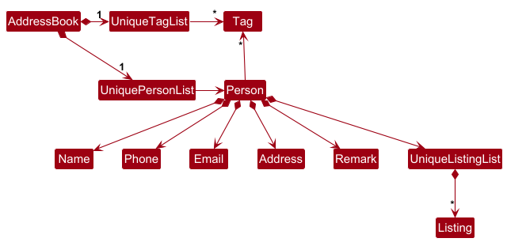
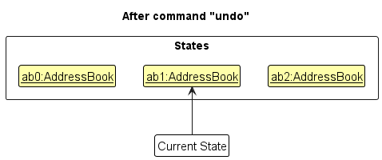

* Table of Contents
  {:toc}

-----------------------------------------------------------------------------------------------------------------
---

## **Acknowledgements**

* {list here sources of all reused/adapted ideas, code, documentation, and third-party libraries -- include links to the original source as well} 
* ChatGPT by OpenAI was used by BuffWuff1712 to generate the Tag Table and Glossary sections within the Developer Guide, as well as the JavaDocs for code written by BuffWuff1712
--------------------------------------------------------------------------------------------------------------------

## **Setting up, getting started**

Refer to the guide [_Setting up and getting started_](SettingUp.md).

--------------------------------------------------------------------------------------------------------------------

## **Design**

:bulb: **Tip:** The `.puml` files used to create diagrams in this document `docs/diagrams` folder. Refer to the [_PlantUML Tutorial_ at se-edu/guides](https://se-education.org/guides/tutorials/plantUml.html) to learn how to create and edit diagrams.

### Architecture

The ***Architecture Diagram*** given above explains the high-level design of the App.

Given below is a quick overview of main components and how they interact with each other.

**Main components of the architecture**

**`Main`** (consisting of classes [`Main`](https://github.com/AY2425S1-CS2103T-F15-3/tp/blob/master/src/main/java/seedu/address/Main.java) and [`MainApp`](https://github.com/AY2425S1-CS2103T-F15-3/tp/blob/master/src/main/java/seedu/address/MainApp.java)) is in charge of the app launch and shut down.

* At app launch, it initializes the other components in the correct sequence, and connects them up with each other.
* At shut down, it shuts down the other components and invokes cleanup methods where necessary.

The bulk of the app's work is done by the following four components:

* [**`UI`**](#ui-component): The UI of the App.
* [**`Logic`**](#logic-component): The command executor.
* [**`Model`**](#model-component): Holds the data of the App in memory.
* [**`Storage`**](#storage-component): Reads data from, and writes data to, the hard disk.

[**`Commons`**](#common-classes) represents a collection of classes used by multiple other components.

**How the architecture components interact with each other**

The *Sequence Diagram* below shows how the components interact with each other for the scenario where the user issues the command `delete 1`.

Each of the four main components (also shown in the diagram above),

* defines its *API* in an `interface` with the same name as the Component.
* implements its functionality using a concrete `{Component Name}Manager` class (which follows the corresponding API `interface` mentioned in the previous point.

For example, the `Logic` component defines its API in the `Logic.java` interface and implements its functionality using the `LogicManager.java` class which follows the `Logic` interface. Other components interact with a given component through its interface rather than the concrete class (reason: to prevent outside component's being coupled to the implementation of a component), as illustrated in the (partial) class diagram below.

The sections below give more details of each component.

### UI component

The **API** of this component is specified in [`Ui.java`](https://github.com/AY2425S1-CS2103T-F15-3/tp/blob/master/src/main/java/seedu/address/ui/Ui.java)

The UI consists of a `MainWindow` that is made up of parts e.g.`CommandBox`, `ResultDisplay`, `PersonListPanel`, `PersonPane`, `StatusBarFooter` etc. All these, including the `MainWindow`, inherit from the abstract `UiPart` class which captures the commonalities between classes that represent parts of the visible GUI.

The `UI` component uses the JavaFx UI framework. The layout of these UI parts are defined in matching `.fxml` files that are in the `src/main/resources/view` folder. For example, the layout of the [`MainWindow`](https://github.com/AY2425S1-CS2103T-F15-3/tp/blob/master/src/main/java/seedu/address/ui/MainWindow.java) is specified in [`MainWindow.fxml`](https://github.com/AY2425S1-CS2103T-F15-3/tp/blob/master/src/main/resources/view/MainWindow.fxml)

The `UI` component,

* executes user commands using the `Logic` component.
* listens for changes to `Model` data so that the UI can be updated with the modified data.
* keeps a reference to the `Logic` component, because the `UI` relies on the `Logic` to execute commands.
* depends on some classes in the `Model` component, as it displays `Person` object residing in the `Model`.

### Logic component

**API** : [`Logic.java`](https://github.com/AY2425S1-CS2103T-F15-3/tp/blob/master/src/main/java/seedu/address/logic/Logic.java)

Here's a (partial) class diagram of the `Logic` component:

The sequence diagram below illustrates the interactions within the `Logic` component, taking `execute("delete 1")` API call as an example.

:information_source: **Note:** The lifeline for `DeleteCommandParser` should end at the destroy marker (X) but due to a limitation of PlantUML, the lifeline continues till the end of diagram.

How the `Logic` component works:

1. When `Logic` is called upon to execute a command, it is passed to an `PROpertyParser` object which in turn creates a parser that matches the command (e.g., `DeleteCommandParser`) and uses it to parse the command.
2. This results in a `Command` object (more precisely, an object of one of its subclasses e.g., `DeleteCommand`) which is executed by the `LogicManager`.
3. The command can communicate with the `Model` when it is executed (e.g. to delete a person). 
   Note that although this is shown as a single step in the diagram above (for simplicity), in the code it can take several interactions (between the command object and the `Model`) to achieve.
4. The result of the command execution is encapsulated as a `CommandResult` object which is returned back from `Logic`.

Here are the other classes in `Logic` (omitted from the class diagram above) that are used for parsing a user command:

How the parsing works:

* When called upon to parse a user command, the `PROpertyParser` class creates an `XYZCommandParser` (`XYZ` is a placeholder for the specific command name e.g., `AddCommandParser`) which uses the other classes shown above to parse the user command and create a `XYZCommand` object (e.g., `AddCommand`) which the `PROpertyParser` returns back as a `Command` object.
* All `XYZCommandParser` classes (e.g., `AddCommandParser`, `DeleteCommandParser`, ...) inherit from the `Parser` interface so that they can be treated similarly where possible e.g, during testing.

### Model component

**API** : [`Model.java`](https://github.com/AY2425S1-CS2103T-F15-3/tp/blob/master/src/main/java/seedu/address/model/Model.java)

The `Model` component,

* stores the address book data i.e., all `Person` objects (which are contained in a `UniquePersonList` object).
* stores the currently 'selected' `Person` objects (e.g., results of a search query) as a separate _filtered_ list which is exposed to outsiders as an unmodifiable `ObservableList<Person>` that can be 'observed' e.g. the UI can be bound to this list so that the UI automatically updates when the data in the list change.
* stores a `UserPref` object that represents the user’s preferences. This is exposed to the outside as a `ReadOnlyUserPref` objects.
* does not depend on any of the other three components (as the `Model` represents data entities of the domain, they should make sense on their own without depending on other components)

:information_source: **Note:** An alternative (arguably, a more OOP) model is given below. It has a `Tag` list in the `PROperty`, which `Person` references. This allows `PROperty` to only require one `Tag` object per unique tag, instead of each `Person` needing their own `Tag` objects. 

### Storage component

**API** : [`Storage.java`](https://github.com/AY2425S1-CS2103T-F15-3/tp/blob/master/src/main/java/seedu/address/storage/Storage.java)

The `Storage` component,

* can save both address book data and user preference data in JSON format, and read them back into corresponding objects.
* inherits from both `PROpertyStorage` and `UserPrefStorage`, which means it can be treated as either one (if only the functionality of only one is needed).
* depends on some classes in the `Model` component (because the `Storage` component's job is to save/retrieve objects that belong to the `Model`)

### Common classes

Classes used by multiple components are in the `seedu.address.commons` package.

--------------------------------------------------------------------------------------------------------------------

## **Implementation**

This section describes some noteworthy details on how certain features are implemented.

### \[Proposed\] Undo/redo feature

#### Proposed Implementation

The proposed undo/redo mechanism is facilitated by `VersionedPROperty`. It extends `PROperty` with an undo/redo history, stored internally as an `addressBookStateList` and `currentStatePointer`. Additionally, it implements the following operations:

* `VersionedPROperty#commit()` — Saves the current address book state in its history.
* `VersionedPROperty#undo()` — Restores the previous address book state from its history.
* `VersionedPROperty#redo()` — Restores a previously undone address book state from its history.

These operations are exposed in the `Model` interface as `Model#commitPROperty()`, `Model#undoPROperty()` and `Model#redoPROperty()` respectively.

Given below is an example usage scenario and how the undo/redo mechanism behaves at each step.

Step 1. The user launches the application for the first time. The `VersionedPROperty` will be initialized with the initial address book state, and the `currentStatePointer` pointing to that single address book state.

Step 2. The user executes `delete 5` command to delete the 5th person in the address book. The `delete` command calls `Model#commitPROperty()`, causing the modified state of the address book after the `delete 5` command executes to be saved in the `addressBookStateList`, and the `currentStatePointer` is shifted to the newly inserted address book state.

Step 3. The user executes `add n/David …​` to add a new person. The `add` command also calls `Model#commitPROperty()`, causing another modified address book state to be saved into the `addressBookStateList`.

:information_source: **Note:** If a command fails its execution, it will not call `Model#commitPROperty()`, so the address book state will not be saved into the `addressBookStateList`.

Step 4. The user now decides that adding the person was a mistake, and decides to undo that action by executing the `undo` command. The `undo` command will call `Model#undoPROperty()`, which will shift the `currentStatePointer` once to the left, pointing it to the previous address book state, and restores the address book to that state.

:information_source: **Note:** If the `currentStatePointer` is at index 0, pointing to the initial PROperty state, then there are no previous PROperty states to restore. The `undo` command uses `Model#canUndoPROperty()` to check if this is the case. If so, it will return an error to the user rather
than attempting to perform the undo.

The following sequence diagram shows how an undo operation goes through the `Logic` component:

:information_source: **Note:** The lifeline for `UndoCommand` should end at the destroy marker (X) but due to a limitation of PlantUML, the lifeline reaches the end of diagram.

Similarly, how an undo operation goes through the `Model` component is shown below:

The `redo` command does the opposite — it calls `Model#redoPROperty()`, which shifts the `currentStatePointer` once to the right, pointing to the previously undone state, and restores the address book to that state.

:information_source: **Note:** If the `currentStatePointer` is at index `addressBookStateList.size() - 1`, pointing to the latest address book state, then there are no undone PROperty states to restore. The `redo` command uses `Model#canRedoPROperty()` to check if this is the case. If so, it will return an error to the user rather than attempting to perform the redo.

Step 5. The user then decides to execute the command `list`. Commands that do not modify the address book, such as `list`, will usually not call `Model#commitPROperty()`, `Model#undoPROperty()` or `Model#redoPROperty()`. Thus, the `addressBookStateList` remains unchanged.

Step 6. The user executes `clear`, which calls `Model#commitPROperty()`. Since the `currentStatePointer` is not pointing at the end of the `addressBookStateList`, all address book states after the `currentStatePointer` will be purged. Reason: It no longer makes sense to redo the `add n/David …​` command. This is the behavior that most modern desktop applications follow.

The following activity diagram summarizes what happens when a user executes a new command:

#### Design considerations:

**Aspect: How undo & redo executes:**

* **Alternative 1 (current choice):** Saves the entire address book.
  
  * Pros: Easy to implement.
  * Cons: May have performance issues in terms of memory usage.

* **Alternative 2:** Individual command knows how to undo/redo by
  itself.
  
  * Pros: Will use less memory (e.g. for `delete`, just save the person being deleted).
  * Cons: We must ensure that the implementation of each individual command are correct.

    
### Sort Feature

### Implementation

The sort feature in `PROperty` is implemented by adding sorting methods to the `UniquePersonList` class, which is responsible for managing the list of `Person` objects. Sorting is performed directly on the `internalList` by specific attributes such as `name` or `ID`, allowing users to organise contacts in a meaningful order.

The feature includes the following operations:

- **`UniquePersonList#sortByName()`** — Sorts the `internalList` of `Person` objects alphabetically by name, using a `Comparator` that performs a case-insensitive comparison.
- **`UniquePersonList#sortByID()`** — Sorts the `internalList` by ID in ascending order, allowing users to organise contacts based on their unique identifiers.

These operations are exposed in the `Model` interface as `Model#sortByName()` and `Model#sortByID()` respectively.

The following sequence diagram shows how an sort operation goes through the `Logic` component:

Similarly, the sorting process within the `Model` component is shown below:

--------------------------------------------------------------------------------------------------------------------

## **Documentation, logging, testing, configuration, dev-ops**

* [Documentation guide](Documentation.md)
* [Testing guide](Testing.md)
* [Logging guide](Logging.md)
* [Configuration guide](Configuration.md)
* [DevOps guide](DevOps.md)

--------------------------------------------------------------------------------------------------------------------

## **Appendix: Requirements**

### Product scope

**Target user profile**:

* Property Agents who type fast

Their responsibilities include managing a large list of property listings,
coordinating with clients and potential buyers, conducting property viewings, negotiating deals,
and handling paperwork related to real estate transactions. They are often mobile, needing quick and easy
access to information, and manage a large client and property database.

**Value proposition**:
Agents often have difficulty keeping track of the large client and property database.
Our address book allows property agents to manage prospective and existing customers by sorting them into
different categories including housing type and income level.
Moreover, they can keep track of house visits via an events management system.

* Allows property agents to manage prospective and existing customers easily by sorting them into different
  categories such as by housing type, income level, rent/sell/buy
* Agents can sort by customer status: unresponsive,
* Keep track of the various landlords who own the houses
* Easy for agent to remember who to try to sell unit to
* Events for scheduling visits to houses - reminders for agents when they open the app on any upcoming visits

### User stories

Priorities: High (must have) - `* * *`, Medium (nice to have) - `* *`, Low (unlikely to have) - `*`

| Priority | As a …​                                 | I want to …​                                                | So that I can…​                                               |
| -------- | --------------------------------------- | ----------------------------------------------------------- | ------------------------------------------------------------- |
| `* * *`  | new user                                | see usage instructions                                      | refer to instructions when I forget how to use the App        |
| `* * *`  | user                                    | add a contact with their information                        | view them later                                               |
| `* * *`  | user                                    | delete a person                                             | remove entries that I no longer need                          |
| `* * *`  | user                                    | use a search bar to find my contact                         | locate details without going through the entire list          |
| `* * *`  | user                                    | edit current contact details                                | keep the details updated                                      |
| `* * *`  | user                                    | search via tags                                             | filter by different groups of people                          |
| `* * *`  | user                                    | partially fill contacts                                     | add people who do not want to give full information           |
| `* * *`  | user                                    | find contacts using their names                             | view their contact details easily                             |
| `* * *`  | user with many things to remember       | add remarks/notes to some users                             | remember things when I look up their contacts                 |
| `* *`    | user                                    | know some suggestions of types of tags                      | keep track of client preferences and interactions             |
| `* *`    | user                                    | set reminders linked to contacts                            | follow up with clients on time                                |
| `* *`    | user                                    | have an undo feature when editing or deleting a contact     | prevent accidental loss of information                        |
| `* *`    | new user                                | see a guide on what features there are and how to use them  | know what to do with the application                          |
| `* *`    | user                                    | press [TAB] to auto-complete commands                       | not waste time typing the full command                        |
| `* *`    | user                                    | find commands by typing part of it                          | not have to remember exact commands                           |
| `* *`    | user                                    | press [TAB] to auto-suggest attributes                      | not waste time typing full command                            |
| `* *`    | user                                    | see multiple attributes in the command box                  | know available commands without referring to help guide       |
| `* *`    | user                                    | press [TAB] to auto-suggest values                          | save time figuring out command types                          |
| `* *`    | user                                    | have appropriate colour highlighting for each attribute     | see what I input more easily                                  |
| `* *`    | user                                    | see different colours for each attribute                    | classify information more easily                              |
| `* *`    | user                                    | see error messages clearly                                  | know what went wrong with my input                            |
| `* *`    | user                                    | see the exact reason an error is caused                     | input the correct command without wasting time                |
| `* *`    | user with many contacts                 | tag certain contacts to show at the top                     | find them easily with minimal steps                           |
| `* *`    | user with a busy schedule               | set reminders and see upcoming events                       | remind myself and stay on track                               |
| `* *`    | forgetful user                          | quickly reuse my last searches and view search history      | quickly trace back my activity                                |
| `* *`    | new user                                | explore all features and follow a guide                     | be oriented to the functionalities                            |
| `* *`    | user with many different friend groups  | manage all my tags                                          | better organize my contacts                                   |
| `* *`    | user who likes to categorise everything | choose different colours for my tags                        | they don't all look the same                                  |
| `* *`    | impatient user                          | find and sort multiple tags at once                         | not have to search for each tag slowly                        |
| `* *`    | user                                    | sort my contacts in different ways                          | view contacts in different ways                               |
| `* *`    | user                                    | add and customise my own tags                               | personalise my address book                                   |
| `* *`    | user                                    | link property listings to specific contacts                 | know who to market units to quickly                           |
| `*`      | user                                    | merge duplicate contacts                                    | keep my address book clean and organised                      |
| `*`      | user                                    | export my contacts to a CSV file                            | back up or share my contact list                              |
| `*`      | beginner                                | know some suggestions of types of tag                       | have an idea on how to sort my customers                      |
| `*`      | user                                    | put my deleted contacts in a recycle bin                    | keep my contacts clean and restore them if it was an accident |
| `*`      | user                                    | auto-complete or suggest commands if multiple are available | complete commands more easily                                 |
| `*`      | user                                    | use "fuzzy searching" when using "find" command             | not need to remember the exact words                          |
| `*`      | user with many social accounts          | save and link to contact social pages and media handles     | connect with clients on social media easily                   |
| `*`      | user who changes devices often          | export and import contacts on different devices easily      | not save everything manually again when I change devices      |
| `*`      | user with many groups of friends        | know who the contacts I have put a particular tag on        | organise events                                               |
| `*`      | user with many hobbies                  | remove the tag for contacts easily                          | remove their tags if not useful anymore                       |
| `*`      | user                                    | search up other contact information other than name         | find contacts based on other information                      |
| `*`      | user with many contacts                 | find and search contact besides the name                    | find contacts more easily with different kinds of input       |

### Use cases

(For all use cases below, the **System** is the `PROperty` and the **Actor** is the `user`, unless specified otherwise)

**Use case: Add a person**

**MSS**

1. User requests to add a new person by providing the person's details.

2. PROperty validates the input details.

3. PROperty adds the person to the contact list.

4. PROperty displays a confirmation that the person has been added.
   
   Use case ends.

**Extensions**

- 2a. The input details are invalid or incomplete.
  
  - 2a1. PROperty shows an error message indicating the invalid fields.
  
  - 2a2. PROperty prompts the user to re-enter the details.
    
    Use case resumes at step 1.

- 2b. A person with the same details already exists.
  
  - 2b1. PROperty informs the user that the person already exists.
    
    Use case ends.

---

**Use case: Edit a person's details**

**MSS**

1. User requests to edit details of a specific person.

2. User inputs desired edits.

3. PROperty validates the new details.

4. PROperty saves the updated details.

5. PROperty confirms that the person's details have been updated.
   
   Use case ends.

**Extensions**

- 1a. The specified person does not exist.
  
  - 1a1. PROperty shows an error message.
    
    Use case ends.

- 3a. The new details are invalid.
  
  - 3a1. PROperty shows an error message indicating the invalid fields.
  
  - 3a2. PROperty prompts the user to re-enter the details.
    
    Use case resumes at step 2.

---

**Use case: Add remarks to a person**

**MSS**

1. User selects a person to add a remark.

2. User enters the remark.

3. PROperty saves the remark to the person's details.

4. PROperty confirms that the remark has been added.
   
   Use case ends.

**Extensions**

- 1a. The specified person does not exist.
  
  - 1a1. PROperty shows an error message.
    
    Use case ends.

- 2a. The remark is empty.
  
  - 2a1. PROperty removes the remark from the specified person instead.

---

**Use case: Remove remarks from a person**

**MSS**

1. User selects a person to remove remark.

2. User enters empty remark.

3. PROperty removes the existing remark (if any) from the person's details.

4. PROperty confirms that the remark has been removed.

   Use case ends.

**Extensions**

- 1a. The specified person does not exist.

    - 1a1. PROperty shows an error message.

      Use case ends.

---

**Use case: Search for persons by tags**

**MSS**

1. User requests to search for persons using one or more tags.

2. PROperty filters the contact list based on the specified tags.

3. PROperty displays a list of persons matching the tags.
   
   Use case ends.

**Extensions**

- 1a. No tags are specified.
  
  - 1a1. PROperty shows an error message prompting for at least one tag.
    
    Use case resumes at step 1.

- 2a. No persons match the specified tags.
  
  - 2a1. PROperty informs the user that no matches were found.
    
    Use case ends.

---

**Use case: Manage tags**

**MSS**

1. User requests to view all existing tags.

2. PROperty displays a list of all tags.

3. User selects an option to add, edit, or delete tags.

4. PROperty performs the selected action.

5. PROperty confirms that the tags have been updated.
   
   Use case ends.

**Extensions**

- 3a. User chooses to add a new tag.
  
  - 3a1. User provides the tag name and optional color.
  
  - 3a2. PROperty adds the new tag.
    
    Use case resumes at step 5.

- 3b. User chooses to edit an existing tag.
  
  - 3b1. User selects the tag to edit.
  
  - 3b2. User updates the tag's name or color.
  
  - 3b3. PROperty saves the changes.
    
    Use case resumes at step 5.

- 3c. User chooses to delete a tag.
  
  - 3c1. User selects the tag to delete.
  
  - 3c2. PROperty removes the tag from all associated contacts.
    
    Use case resumes at step 5.

- 3d. The tag name provided already exists (for add/edit).
  
  - 3d1. PROperty shows an error message.
    
    Use case resumes at step 3.

---

**Use case: Set reminders linked to contacts**

**MSS**

1. User selects a contact to set a reminder for.

2. PROperty prompts the user to enter reminder details (date, time, message).

3. User enters the reminder details.

4. PROperty saves the reminder linked to the contact.

5. PROperty confirms that the reminder has been set.
   
   Use case ends.

**Extensions**

- 1a. The specified contact does not exist.
  
  - 1a1. PROperty shows an error message.
    
    Use case ends.

- 3a. The reminder details are incomplete or invalid.
  
  - 3a1. PROperty shows an error message indicating the issue.
  
  - 3a2. PROperty prompts the user to re-enter the reminder details.
    
    Use case resumes at step 2.

---

**Use case: View upcoming reminders/events**

**MSS**

1. User requests to view upcoming reminders/events.

2. PROperty retrieves reminders/events sorted by date and time.

3. PROperty displays the list of upcoming reminders/events.
   
   Use case ends.

**Extensions**

- 2a. There are no upcoming reminders/events.
  
  - 2a1. PROperty informs the user that there are no upcoming reminders/events.
    
    Use case ends.

---

**Use case: Undo an action**

**MSS**

1. User requests to undo the last action.

2. PROperty reverses the last action performed.

3. PROperty confirms that the action has been undone.
   
   Use case ends.

**Extensions**

- 1a. There is no action to undo.
  
  - 1a1. PROperty informs the user that there is nothing to undo.
    
    Use case ends.

- 2a. The last action cannot be undone (e.g., permanent changes).
  
  - 2a1. PROperty informs the user that the action cannot be undone.
    
    Use case ends.

---

**Use case: View usage instructions**

**MSS**

1. User requests to view usage instructions.

2. PROperty displays the help guide with a list of available commands and features.
   
   Use case ends.

**Extensions**

- 2a. The help guide fails to load.
  
  - 2a1. PROperty shows an error message.
    
    Use case ends.

---

**Use case: Auto-complete commands**

**MSS**

1. User begins typing a command.

2. PROperty suggests possible commands based on the input.

3. User selects a suggested command or continues typing.

4. PROperty auto-completes the command.
   
   Use case ends.

**Extensions**

- 2a. No commands match the input.
  
  - 2a1. PROperty does not provide suggestions.
    
    Use case ends.

- 3a. User does not select a suggestion and enters an invalid command.
  
  - 3a1. PROperty shows an error message.
    
    Use case ends.

---

**Use case: Highlight syntax and errors**

**MSS**

1. User types a command with attributes.

2. PROperty highlights different parts of the command (e.g., commands, attributes, values) in different colors.

3. If there's a syntax error, PROperty underlines or marks the error.

4. PROperty provides real-time feedback to the user.
   
   Use case ends.

**Extensions**

- 3a. The command has multiple errors.
  
  - 3a1. PROperty highlights all errors.
    
    Use case ends.

---

**Use case: View error messages with exact causes**

**MSS**

1. User executes a command.

2. PROperty detects an error in the command.

3. PROperty displays an error message clearly indicating the cause.

4. User reviews the error message and corrects the command.
   
   Use case ends.

**Extensions**

- 3a. Error message is too generic.
  
  - 3a1. User requests more details.
  
  - 3a2. PROperty provides additional information about the error.
    
    Use case resumes at step 4.

---

**Use case: Sort contacts in different ways**

**MSS**

1. User requests to sort contacts by a specific attribute (e.g., name, date added, tag).

2. PROperty sorts the contact list based on the selected attribute.

3. PROperty displays the sorted list.
   
   Use case ends.

**Extensions**

- 1a. The specified attribute is invalid.
  
  - 1a1. PROperty shows an error message.
    
    Use case ends.

---

**Use case: Reuse last searches and view search history**

**MSS**

1. User requests to view search history.

2. PROperty displays a list of recent searches.

3. User selects a previous search to reuse.

4. PROperty performs the search and displays the results.
   
   Use case ends.

**Extensions**

- 2a. There is no search history.
  
  - 2a1. PROperty informs the user that there is no search history.
    
    Use case ends.

---

**Use case: Customize tags with colors**

**MSS**

1. User selects a tag to customize.

2. PROperty prompts the user to choose a color.

3. User selects a color for the tag.

4. PROperty updates the tag with the chosen color.

5. PROperty confirms that the tag has been updated.
   
   Use case ends.

**Extensions**

- 2a. The color selected is already in use by another tag.
  
  - 2a1. PROperty warns the user about the duplicate color.
  
  - 2a2. User chooses to proceed or select a different color.
    
    Use case resumes at step 3.

---

**Use case: Set and view suggestions for tags**

**MSS**

1. User requests suggestions for types of tags.

2. PROperty analyzes existing contacts and interactions.

3. PROperty provides a list of suggested tags.

4. User reviews and applies relevant tags to contacts.
   
   Use case ends.

**Extensions**

- 2a. PROperty lacks sufficient data to provide suggestions.
  
  - 2a1. PROperty informs the user and suggests manual tag creation.
    
    Use case ends.

---

**Use case: View a guide on application features**

**MSS**

1. New user requests to view a guide on application features.

2. PROperty displays a comprehensive guide detailing all features and how to use them.
   
   Use case ends.

**Extensions**

- 2a. The guide fails to load or is unavailable.
  
  - 2a1. PROperty shows an error message.
    
    Use case ends.

---

**Use case: Find and sort multiple tags at once**

**MSS**

1. User requests to search for contacts using multiple tags.

2. PROperty filters contacts that match all specified tags.

3. User requests to sort the filtered contacts by a chosen attribute.

4. PROperty sorts and displays the contacts.
   
   Use case ends.

**Extensions**

- 2a. No contacts match all the specified tags.
  
  - 2a1. PROperty informs the user that no contacts were found.
    
    Use case ends.

- 3a. The sorting attribute is invalid.
  
  - 3a1. PROperty shows an error message.
    
    Use case ends.

---

**Use case: Press TAB to auto-suggest commands and attributes**

**MSS**

1. User begins typing a command or attribute.

2. User presses the TAB key.

3. PROperty auto-completes or suggests possible commands/attributes.

4. User selects a suggestion or continues typing.
   
   Use case ends.

**Extensions**

- 2a. Multiple suggestions are available.
  
  - 2a1. PROperty displays a list of suggestions.
  
  - 2a2. User selects from the list.
    
    Use case resumes at step 4.

- 2b. No suggestions are available.
  
  - 2b1. PROperty does not auto-complete.
    
    Use case ends.

---

**Use case: See multiple attributes in the command box**

**MSS**

1. User initiates a command that requires multiple attributes.

2. PROperty displays placeholders or prompts for each required attribute.

3. User fills in the attributes as guided.

4. PROperty executes the command with the provided attributes.
   
   Use case ends.

**Extensions**

- 2a. User skips an attribute.
  
  - 2a1. PROperty prompts the user to fill in the missing attribute.
    
    Use case resumes at step 3.

- 3a. An attribute value is invalid.
  
  - 3a1. PROperty shows an error message indicating the invalid attribute.
  
  - 3a2. User corrects the attribute.
    
    Use case resumes at step 3.

---

**Use case: Have appropriate color highlighting for attributes**

**MSS**

1. User types a command with attributes in the command box.

2. PROperty highlights each attribute and its value in different colors.

3. User easily identifies each part of the command.
   
   Use case ends.

**Extensions**

- 2a. The color scheme is not suitable for the user.
  
  - 2a1. User adjusts the color settings in preferences.
    
    Use case resumes at step 1.

---

**Use case: See error messages clearly**

**MSS**

1. User executes a command.

2. PROperty detects an error.

3. PROperty displays the error message prominently and clearly.

4. User reads the error message and takes corrective action.
   
   Use case ends.

**Extensions**

- 3a. Error message overlaps with other interface elements.
  
  - 3a1. PROperty adjusts the layout to ensure visibility.
    
    Use case resumes at step 3.

---

**Use case: Tag certain contacts to show at the top**

**MSS**

1. User selects contacts to prioritize.

2. User tags them with a special tag (e.g., "Favorite").

3. PROperty adjusts the contact list to display tagged contacts at the top.
   
   Use case ends.

**Extensions**

- 2a. User wants to prioritize multiple tags.
  
  - 2a1. PROperty allows setting priority levels for tags.
    
    Use case resumes at step 3.

---

**Use case: Manage multiple customer groups**

**MSS**

1. User creates tags for different customer groups.

2. User assigns contacts to these tags.

3. User filters or views contacts based on these tags.
   
   Use case ends.

**Extensions**

- 1a. User attempts to create a duplicate tag.
  
  - 1a1. PROperty informs the user and prevents duplication.
    
    Use case resumes at step 1.

- 2a. User wants to assign a contact to multiple groups.
  
  - 2a1. PROperty allows multiple tags per contact.
    
    Use case resumes at step 3.

---

**Use case: Set and see upcoming appointments**

**MSS**

1. User adds appointments linked to contacts or tags.

2. PROperty saves the appointments with dates and times.

3. User requests to view upcoming events.

4. PROperty displays events in chronological order.
   
   Use case ends.

**Extensions**

- 1a. Event details are incomplete.
  
  - 1a1. PROperty prompts the user to complete all required fields.
    
    Use case resumes at step 1.

- 3a. No upcoming events are scheduled.
  
  - 3a1. PROperty informs the user.
    
    Use case ends.

---

**Use case: Find commands by typing part of it**

**MSS**

1. User types a partial command.

2. PROperty searches for commands matching the input.

3. PROperty suggests possible commands.

4. User selects a command from the suggestions.
   
   Use case ends.

**Extensions**

- 2a. No commands match the partial input.
  
  - 2a1. PROperty informs the user and suggests using the help guide.
    
    Use case ends.

---

**Use case: Press TAB to auto-suggest values**

**MSS**

1. User types a command requiring specific values (e.g., tag names).

2. User presses TAB key.

3. PROperty suggests existing values that match the input.

4. User selects a value from the suggestions.
   
   Use case ends.

**Extensions**

- 3a. No values match the input.
  
  - 3a1. PROperty does not provide suggestions.
    
    Use case ends.

---

**Use case: Reuse last searches and view search history**

**MSS**

1. User accesses the search history feature.

2. PROperty displays a list of recent searches.

3. User selects a previous search.

4. PROperty executes the search and displays results.
   
   Use case ends.

**Extensions**

- 2a. Search history is empty.
  
  - 2a1. PROperty informs the user.
    
    Use case ends.

---

**Use case: Remove tags from contacts easily**

**MSS**

1. User selects a contact to modify tags.

2. PROperty displays current tags associated with the contact.

3. User deselects or removes unwanted tags.

4. PROperty updates the contact's tag list.

5. PROperty confirms that the tags have been updated.
   
   Use case ends.

**Extensions**

- 2a. Contact has no tags.
  
  - 2a1. PROperty informs the user.
    
    Use case ends.

---

**Use case: View multiple attributes in the command box**

**MSS**

1. User starts typing a command that accepts multiple attributes.

2. PROperty displays a dynamic template showing all possible attributes.

3. User fills in the attributes as needed.

4. PROperty validates and executes the command.
   
   Use case ends.

**Extensions**

- 3a. User skips optional attributes.
  
  - 3a1. PROperty proceeds with the provided attributes.
    
    Use case resumes at step 4.

- 4a. Required attributes are missing.
  
  - 4a1. PROperty shows an error message.
  
  - 4a2. User adds the missing attributes.
    
    Use case resumes at step 3.

---

**Use case: Set reminders and see upcoming events**

**MSS**

1. User sets a reminder or schedules an event linked to a contact.

2. PROperty saves the reminder/event details.

3. User requests to view upcoming reminders/events.

4. PROperty displays a chronological list.
   
   Use case ends.

**Extensions**

- 2a. Reminder/event details are invalid.
  
  - 2a1. PROperty shows an error message.
  
  - 2a2. User corrects the details.
    
    Use case resumes at step 1.

- 3a. No upcoming reminders/events.
  
  - 3a1. PROperty informs the user.
    
    Use case ends.

---

**Use case: Show property listings of specific user**

**MSS**

1. User types command to show property listings of a contact.

2. PROperty displays property listings of contact.

   Use case ends.

**Extensions**

- 1a. User types in invalid index for contact

  - 1a1. PROperty informs user of invalid index.
   
    Use case ends.

- 1b. User types in invalid command format

    - 1b1. PROperty informs user of invalid command format.

      Use case ends.

### Non-Functional Requirements

1. Should work on any _mainstream OS_ as long as it has Java `17` or above installed.
2. Should be able to hold up to 1000 persons without a noticeable sluggishness in performance for typical usage.
3. A user with above average typing speed for regular English text (i.e. not code, not system admin commands) should be able to accomplish most of the tasks faster using commands than using the mouse.
4. Should work on any screen size from (`13'` laptop screens to `32'` widescreen monitors)
5. Should reliably store contact information across different sessions with minimal chance of corruption
6. Should not contain any vulnerabilities, protect user data and ensure system integrity
7. Should be easy to maintain for developers to add new features and exensions in the future
8. Should have good contrast between colours to allow people to read text and information more easily

### Glossary

- **Auto-complete**: A feature that predicts and completes the rest of a word or command as the user types, often activated by pressing the `TAB` key.

- **Fuzzy Searching**: A search technique that finds approximate matches to the search terms, allowing users to find results without needing exact matches.

- **Recycle Bin**: A temporary storage area for deleted contacts, allowing users to restore them if they were deleted accidentally.

- **Reminder/Event**: A scheduled notification linked to a contact, alerting the user of upcoming tasks, appointments, or follow-ups.

- **Social Media Handles**: Usernames or profile links associated with a person's social media accounts.

- **Syntax Highlighting**: A feature that displays commands in different colors to differentiate between commands, attributes, and values for easier readability.

- **Tag**: A label assigned to a contact to categorize or group contacts for better organization.

- **Undo Feature**: A function that allows the user to reverse the last action taken, preventing accidental loss or changes to information.

- **Attribute Placeholder**: A prompt or template shown in the command box that indicates where the user should input specific information in a command.

- **Contact**: An entry in the PROperty representing a person, including their personal and professional information.

- **Reminder/Event List**: A chronological list displaying upcoming reminders or events set by the user.

- **Search History**: A record of previous search queries entered by the user, allowing for quick reuse of past searches.

- **Highlighting Errors**: Visual cues provided by the application (such as underlines or color changes) to indicate mistakes in command input.

- **Attribute Placeholder**: A visual guide in the command box showing the required and optional attributes for a command.

- **Priority Tagging**: The act of marking certain contacts to appear at the top of the contact list for quick access.

--------------------------------------------------------------------------------------------------------------------

## **Appendix: Instructions for manual testing**

Given below are instructions to test the app manually.

:information_source: **Note:** These instructions only provide a starting point for testers to work on;
testers are expected to do more *exploratory* testing.

### Launch and shutdown

1. Initial launch
   
   1. Download the jar file and copy into an empty folder
   
   2. Double-click the jar file Expected: Shows the GUI with a set of sample contacts. The window size may not be optimum.

2. Saving window preferences
   
   1. Resize the window to an optimum size. Move the window to a different location. Close the window.
   
   2. Re-launch the app by double-clicking the jar file. 
      
       Expected: The most recent window size and location is retained.

3. _{ more test cases …​ }_

### Deleting a person

1. Deleting a person while all persons are being shown
   
   1. Prerequisites: List all persons using the `list` command. Multiple persons in the list.
   
   2. Test case: `delete 1` 
      Expected: First contact is deleted from the list. Details of the deleted contact shown in the status message. Timestamp in the status bar is updated.
   
   3. Test case: `delete 0` 
      Expected: No person is deleted. Error details shown in the status message. Status bar remains the same.
   
   4. Other incorrect delete commands to try: `delete`, `delete x`, `...` (where x is larger than the list size) 
      Expected: Similar to previous.

2. _{ more test cases …​ }_

### Saving data

1. Dealing with missing/corrupted data files
   
   1. _{explain how to simulate a missing/corrupted file, and the expected behavior}_

2. _{ more test cases …​ }_
