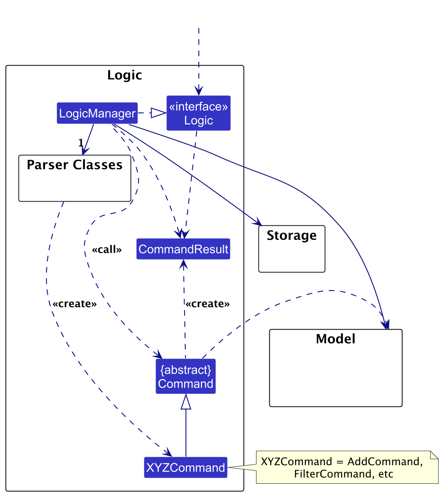

- Table of Contents

1. [Acknowledgements](#acknowledgements)
2. [Setting up, getting started](#setting-up-getting-started)
3. [Design](#design)
   1. [Architecture](#architecture)
   2. [UI component](#ui-component)
   3. [Logic component](#logic-component)
   4. [Model component](#model-component)
   5. [Storage component](#storage-component)
   6. [Common classes](#common-classes)
4. [Implementation](#implementation)
   1. [Proposed Undo/redo feature](#proposed-undoredo-feature)
      1. [Proposed Implementation](#proposed-implementation)
      2. [Design considerations](#design-considerations)
   2. [Proposed Data archiving](#proposed-data-archiving)
5. [Documentation, logging, testing, configuration, dev-ops](#documentation-logging-testing-configuration-dev-ops)
6. [Appendix: Requirements](#appendix-requirements)
   1. [Product scope](#product-scope)
   2. [User Stories](#user-stories)
   3. [Use cases](#use-cases)
   4. [Non-Functional Requirements](#non-functional-requirements)
   5. [Glossary](#glossary)
7. [Appendix: Instructions for manual testing](#appendix-instructions-for-manual-testing)
   1. [Launch and shutdown](#launch-and-shutdown)
   2. [Deleting a person](#deleting-a-person)
   3. [Saving data](#saving-data)

---

## **Acknowledgements**

- {list here sources of all reused/adapted ideas, code, documentation, and third-party libraries -- include links to the
  original source as well}

- **Third-party libraries**
- opencsv Library
- org json Library

## **Setting up, getting started**

Refer to the guide [_Setting up and getting started_](SettingUp.md).

---

## **Design**

:bulb: **Tip:** The `.puml` files used to create diagrams in this document `docs/diagrams` folder. Refer to the [
_PlantUML Tutorial_ at se-edu/guides](https://se-education.org/guides/tutorials/plantUml.html) to learn how to create
and edit diagrams.

### Architecture

The **_Architecture Diagram_** given above explains the high-level design of the App.

Given below is a quick overview of main components and how they interact with each other.

**Main components of the architecture**

**`Main`** (consisting of
classes [`Main`](https://github.com/se-edu/addressbook-level3/tree/master/src/main/java/seedu/address/Main.java)
and [`MainApp`](https://github.com/se-edu/addressbook-level3/tree/master/src/main/java/seedu/address/MainApp.java)) is
in charge of the app launch and shut down.

- At app launch, it initializes the other components in the correct sequence, and connects them up with each other.
- At shut down, it shuts down the other components and invokes cleanup methods where necessary.

The bulk of the app's work is done by the following four components:

- [**`UI`**](#ui-component): The UI of the App.
- [**`Logic`**](#logic-component): The command executor.
- [**`Model`**](#model-component): Holds the data of the App in memory.
- [**`Storage`**](#storage-component): Reads data from, and writes data to, the hard disk.

[**`Commons`**](#common-classes) represents a collection of classes used by multiple other components.

**How the architecture components interact with each other**

The _Sequence Diagram_ below shows how the components interact with each other for the scenario where the user issues
the command `delete 1`.

Each of the four main components (also shown in the diagram above),

- defines its _API_ in an `interface` with the same name as the Component.
- implements its functionality using a concrete `{Component Name}Manager` class (which follows the corresponding
  API `interface` mentioned in the previous point.

For example, the `Logic` component defines its API in the `Logic.java` interface and implements its functionality using
the `LogicManager.java` class which follows the `Logic` interface. Other components interact with a given component
through its interface rather than the concrete class (reason: to prevent outside component's being coupled to the
implementation of a component), as illustrated in the (partial) class diagram below.

The sections below give more details of each component.

### UI component

The **API** of this component is specified
in [`Ui.java`](https://github.com/se-edu/addressbook-level3/tree/master/src/main/java/seedu/address/ui/Ui.java)

The UI consists of a `MainWindow` that is made up of parts
e.g.`CommandBox`, `ResultDisplay`, `PersonListPanel`, `StatusBarFooter` etc. All these, including the `MainWindow`,
inherit from the abstract `UiPart` class which captures the commonalities between classes that represent parts of the
visible GUI.

The `UI` component uses the JavaFx UI framework. The layout of these UI parts are defined in matching `.fxml` files that
are in the `src/main/resources/view` folder. For example, the layout of
the [`MainWindow`](https://github.com/se-edu/addressbook-level3/tree/master/src/main/java/seedu/address/ui/MainWindow.java)
is specified
in [`MainWindow.fxml`](https://github.com/se-edu/addressbook-level3/tree/master/src/main/resources/view/MainWindow.fxml)

The `UI` component,

- executes user commands using the `Logic` component.
- listens for changes to `Model` data so that the UI can be updated with the modified data.
- keeps a reference to the `Logic` component, because the `UI` relies on the `Logic` to execute commands.
- depends on some classes in the `Model` component, as it displays `Person` object and `Group` object residing in the
  `Model`.

### Logic component

**API
** : [`Logic.java`](https://github.com/se-edu/addressbook-level3/tree/master/src/main/java/seedu/address/logic/Logic.java)

Here's a (partial) class diagram of the `Logic` component:

The sequence diagram below illustrates the interactions within the `Logic` component, taking `execute("delete 1")` API
call as an example.

:information_source: **Note:** The lifeline for `DeleteCommandParser` should end at the destroy marker (X) but due to a limitation of PlantUML, the lifeline continues till the end of diagram.

How the `Logic` component works:

1. When `Logic` is called upon to execute a command, it is passed to an `AddressBookParser` object which in turn creates
   a parser that matches the command (e.g., `DeleteCommandParser`) and uses it to parse the command.
1. This results in a `Command` object (more precisely, an object of one of its subclasses e.g., `DeleteCommand`) which
   is executed by the `LogicManager`.
1. The command can communicate with the `Model` when it is executed (e.g. to delete a person). 
   Note that although this is shown as a single step in the diagram above (for simplicity), in the code it can take
   several interactions (between the command object and the `Model`) to achieve.
1. The result of the command execution is encapsulated as a `CommandResult` object which is returned back from `Logic`.

Here are the other classes in `Logic` (omitted from the class diagram above) that are used for parsing a user command:

How the parsing works:

- When called upon to parse a user command, the `AddressBookParser` class creates an `XYZCommandParser` (`XYZ` is a
  placeholder for the specific command name e.g., `AddCommandParser`) which uses the other classes shown above to parse
  the user command and create a `XYZCommand` object (e.g., `AddCommand`) which the `AddressBookParser` returns back as
  a `Command` object.
- All `XYZCommandParser` classes (e.g., `AddCommandParser`, `DeleteCommandParser`, ...) inherit from the `Parser`
  interface so that they can be treated similarly where possible e.g, during testing.

### Model component

**API
** : [`Model.java`](https://github.com/se-edu/addressbook-level3/tree/master/src/main/java/seedu/address/model/Model.java)

The `Model` component,

- stores the address book data i.e., all `Person` objects (which are contained in a `UniquePersonList` object).
- stores the currently 'selected' `Person` objects (e.g., results of a search query) as a separate _filtered_ list which
  is exposed to outsiders as an unmodifiable `ObservableList<Person>` that can be 'observed' e.g. the UI can be bound to
  this list so that the UI automatically updates when the data in the list change.
- stores the currently 'selected' `Group` objects (e.g., results of a search query) as a separate _filtered_ list which
  is exposed to outsiders as an unmodifiable `ObservableList<Group>` that can be 'observed' e.g. the UI can be bound to
  this list so that the UI automatically updates when the data in the list change.

- stores a `UserPref` object that represents the user’s preferences. This is exposed to the outside as
  a `ReadOnlyUserPref` objects.
- does not depend on any of the other three components (as the `Model` represents data entities of the domain, they
  should make sense on their own without depending on other components)

:information_source: **Note:** An alternative (arguably, a more OOP) model is given below. It has a `Tag` list in the `AddressBook`, which `Person` references. This allows `AddressBook` to only require one `Tag` object per unique tag, instead of each `Person` needing their own `Tag` objects. 

### Storage component

**API
** : [`Storage.java`](https://github.com/se-edu/addressbook-level3/tree/master/src/main/java/seedu/address/storage/Storage.java)

The `Storage` component,

- can save both address book data and user preference data in JSON format, and read them back into corresponding
  objects.
- inherits from both `AddressBookStorage` and `UserPrefStorage`, which means it can be treated as either one (if only
  the functionality of only one is needed).
- depends on some classes in the `Model` component (because the `Storage` component's job is to save/retrieve objects
  that belong to the `Model`)

### Common classes

Classes used by multiple components are in the `seedu.address.commons` package.

---

## **Implementation**

This section describes some noteworthy details on how certain features are implemented.

### \[Proposed\] Undo/redo feature

#### Proposed Implementation

The proposed undo/redo mechanism is facilitated by `VersionedAddressBook`. It extends `AddressBook` with an undo/redo
history, stored internally as an `addressBookStateList` and `currentStatePointer`. Additionally, it implements the
following operations:

- `VersionedAddressBook#commit()`— Saves the current address book state in its history.
- `VersionedAddressBook#undo()`— Restores the previous address book state from its history.
- `VersionedAddressBook#redo()`— Restores a previously undone address book state from its history.

These operations are exposed in the `Model` interface as `Model#commitAddressBook()`, `Model#undoAddressBook()`
and `Model#redoAddressBook()` respectively.

Given below is an example usage scenario and how the undo/redo mechanism behaves at each step.

Step 1. The user launches the application for the first time. The `VersionedAddressBook` will be initialized with the
initial address book state, and the `currentStatePointer` pointing to that single address book state.

Step 2. The user executes `delete 5` command to delete the 5th person in the address book. The `delete` command
calls `Model#commitAddressBook()`, causing the modified state of the address book after the `delete 5` command executes
to be saved in the `addressBookStateList`, and the `currentStatePointer` is shifted to the newly inserted address book
state.

Step 3. The user executes `add n/David …​` to add a new person. The `add` command also
calls `Model#commitAddressBook()`, causing another modified address book state to be saved into
the `addressBookStateList`.

:information_source: **Note:** If a command fails its execution, it will not call `Model#commitAddressBook()`, so the address book state will not be saved into the `addressBookStateList`.

Step 4. The user now decides that adding the person was a mistake, and decides to undo that action by executing
the `undo` command. The `undo` command will call `Model#undoAddressBook()`, which will shift the `currentStatePointer`
once to the left, pointing it to the previous address book state, and restores the address book to that state.

:information_source: **Note:** If the `currentStatePointer` is at index 0, pointing to the initial AddressBook state, then there are no previous AddressBook states to restore. The `undo` command uses `Model#canUndoAddressBook()` to check if this is the case. If so, it will return an error to the user rather
than attempting to perform the undo.

The following sequence diagram shows how an undo operation goes through the `Logic` component:

:information_source: **Note:** The lifeline for `UndoCommand` should end at the destroy marker (X) but due to a limitation of PlantUML, the lifeline reaches the end of diagram.

Similarly, how an undo operation goes through the `Model` component is shown below:

The `redo` command does the opposite — it calls `Model#redoAddressBook()`, which shifts the `currentStatePointer` once
to the right, pointing to the previously undone state, and restores the address book to that state.

:information_source: **Note:** If the `currentStatePointer` is at index `addressBookStateList.size() - 1`, pointing to the latest address book state, then there are no undone AddressBook states to restore. The `redo` command uses `Model#canRedoAddressBook()` to check if this is the case. If so, it will return an error to the user rather than attempting to perform the redo.

Step 5. The user then decides to execute the command `list`. Commands that do not modify the address book, such
as `list`, will usually not call `Model#commitAddressBook()`, `Model#undoAddressBook()` or `Model#redoAddressBook()`.
Thus, the `addressBookStateList` remains unchanged.

Step 6. The user executes `clear`, which calls `Model#commitAddressBook()`. Since the `currentStatePointer` is not
pointing at the end of the `addressBookStateList`, all address book states after the `currentStatePointer` will be
purged. Reason: It no longer makes sense to redo the `add n/David …​` command. This is the behavior that most modern
desktop applications follow.

The following activity diagram summarizes what happens when a user executes a new command:

#### Design considerations:

**Aspect: How undo & redo executes:**

- **Alternative 1 (current choice):** Saves the entire address book.

  - Pros: Easy to implement.
  - Cons: May have performance issues in terms of memory usage.

- **Alternative 2:** Individual command knows how to undo/redo by
  itself.
  - Pros: Will use less memory (e.g. for `delete`, just save the person being deleted).
  - Cons: We must ensure that the implementation of each individual command are correct.

---

## **Documentation, logging, testing, configuration, dev-ops**

- [Documentation guide](Documentation.md)
- [Testing guide](Testing.md)
- [Logging guide](Logging.md)
- [Configuration guide](Configuration.md)
- [DevOps guide](DevOps.md)

---

## **Appendix: Requirements**

### Product scope

**Target user profile**:

- educators who need to micromanage multiple students
- prefer desktop apps over other types
- can type fast
- prefers typing to mouse interactions
- is reasonably comfortable using CLI apps

**Value proposition**: Goon Book is specialised to help educators with keeping track of their students. It can be used
to record their students with their details, and access relevant information easily and conveniently

### User Stories

| Priority | As a …​  | I want to …​                                                               | So that I can…​                                                                                                |
| -------- | -------- | -------------------------------------------------------------------------- | -------------------------------------------------------------------------------------------------------------- | --- |
| `* * *`  | educator | add a new student                                                          | include all students I have currently in my app                                                                |
| `* * *`  | educator | delete a student                                                           | keep my database of students concise with only currently relevant students                                     |
| `* * *`  | educator | search for students by name                                                | find information about specific students                                                                       |
| `* * *`  | educator | group students                                                             | efficiently manage classes, group-based activities, assignments, and projects                                  |
| `* * *`  | educator | delete groups                                                              | correct mistakes by deleting a group                                                                           |
| `* * *`  | educator | import and export student data from other systems                          | streamline data management and avoid manual entry, ensuring compatibility with school databases or grade books |     |
| `* *`    | educator | search for groups by name                                                  | find information about specific groups of students                                                             |
| `* *`    | educator | store additional information about students on grades, attendance or notes | better access and organise student information                                                                 |
| `* *`    | educator | edit a student’s details                                                   | correct mistakes or update new information about the student                                                   |
| `* *`    | educator | filter searched students by name                                           | quickly find specific students                                                                                 |
| `*`      | educator | use security measures for student data                                     | protect sensitive information and control access to parental data                                              |

### Use cases

(For all use cases below, the **System** is the `GoonBook` and the **Actor** is the `Educator`, unless specified
otherwise)

---

#### **Use Case: UC01 - Add a New Student**

**Main Success Scenario (MSS):**

1. Educator chooses to add a new student.
2. System prompts for the student's name, class, and contact information.
3. Educator enters the student's name, class, and contact information.
4. System validates the input.
5. System adds the new student to the student list.
6. System displays a confirmation message.

   Use case ends.

**Extensions:**

- **2a.** Educator submits the form without entering the class or contact information.

  - **2a1.** System detects the missing class or contact information and returns an invalid command format message.
  - **2a2.** Educator provides the missing information.

    Use case resumes from step 3.

- **3a.** System detects that the entered student is a duplicate.

  - **3a1.** System informs the educator that the student already exists and cancels the addition.

    Use case ends.

- **3b.** System detects invalid characters in the student's name (e.g., non-alphabetic characters).

  - **3b1.** System requests the educator to enter a valid name.
  - **3b2.** Educator enters a valid name.

    Steps 3b1-3b2 are repeated until the input is valid.

    Use case resumes from step 4.

- **3c.** System detects invalid input in the contact information (e.g., non-numeric characters).

  - **3c1.** System requests the educator to enter a valid contact number.
  - **3c2.** Educator enters a valid contact number.

    Steps 3c1-3c2 are repeated until the input is valid.

    Use case resumes from step 4.

---

#### **Use Case: UC02 - Search for a Student**

**Main Success Scenario (MSS):**

1. Educator chooses to search for a student.
2. System prompts for the student's name or keywords.
3. Educator enters the student's name or search keywords.
4. System searches for matching students.
5. System displays the list of matching students with their contact and class information.

   Use case ends.

**Extensions:**

- **4a.** No students match the search criteria.

  - **4a1.** System informs the educator that no matching students were found.

    Use case ends.

---

#### **Use Case: UC03 - Delete a Student**

**Main Success Scenario (MSS):**

1. Educator chooses to delete a student.
2. System prompts for the student's index in the list.
3. Educator enters the student's index.
4. System deletes the student from the student list.
5. System displays a confirmation message.

   Use case ends.

**Extensions:**

- **3a.** The specified index is invalid.

  - **3a1.** System informs the educator of the invalid index.
  - **3a2.** Educator enters a valid index.

    Use case resumes from step 4.

---

#### **Use Case: UC04 - Edit a Student**

**Main Success Scenario (MSS):**

1. Educator chooses to edit a student.
2. Educator enters the student's index and new details to update.
3. System validates the new input.
4. System updates the student's information.
5. System displays a confirmation message.

   Use case ends.

**Extensions:**

- **3a.** The specified index is invalid.

  - **3a1.** System informs the educator of the invalid index.
  - **3a2.** Educator enters a valid index.

    Use case resumes from step 4.

- **3b.** System detects invalid input in the new details.

  - **3b1.** System requests the educator to correct the invalid input.
  - **3b2.** Educator enters valid details.

    Use case resumes from step 4.

---

#### **Use Case: UC05 - List All Students**

**Main Success Scenario (MSS):**

1. Educator chooses to list all students.
2. System retrieves the list of all students.
3. System displays the list with students' names, classes, and contact information.

   Use case ends.

---

#### **Use Case: UC06 - List All Groups**

**Main Success Scenario (MSS):**

1. Educator chooses to list all groups.
2. System retrieves the list of all groups.
3. System displays the list with group names and member information.

   Use case ends.

---

#### **Use Case: UC07 - Group Students Together**

**Main Success Scenario (MSS):**

1. Educator chooses to create a new group.
2. System prompts for the group name.
3. Educator enters the group name.
4. System prompts to select students to add to the group.
5. Educator selects students from the student list.
6. System validates the group name and selected students.
7. System creates the new group with the selected students.
8. System displays a confirmation message.

   Use case ends.

**Extensions:**

- **3a.** Educator enters a group name that already exists.

  - **3a1.** System informs the educator of the duplicate group name.
  - **3a2.** Educator enters a unique group name.

    Use case resumes from step 4.

- **5a.** Educator does not select any students.

  - **5a1.** System informs the educator that at least one student must be added to the group.

    Use case resumes from step 4.

- **6a.** System detects invalid characters in the group name.

  - **6a1.** System requests the educator to enter a valid group name.
  - **6a2.** Educator enters a valid group name.

    Use case resumes from step 6.

---

#### **Use Case: UC08 - Locate Groups by Name**

**Main Success Scenario (MSS):**

1. Educator chooses to search for groups.
2. System prompts for the group name or keywords.
3. Educator enters the group name or search keywords.
4. System searches for matching groups.
5. System displays the list of matching groups.

   Use case ends.

**Extensions:**

- **4a.** No groups match the search criteria.

  - **4a1.** System informs the educator that no matching groups were found.

    Use case ends.

---

#### **Use Case: UC09 - Delete a Group**

**Main Success Scenario (MSS):**

1. Educator chooses to delete a group.
2. System prompts for the group name.
3. Educator enters the group name.
4. System deletes the group from the group list.
5. System displays a confirmation message.

   Use case ends.

**Extensions:**

- **3a.** The specified group name does not exist.

  - **3a1.** System informs the educator that the group was not found.
  - **3a2.** Educator enters a valid group name.

    Use case resumes from step 4.

---

#### **Use Case: UC10 - Add a Tag to a Student**

**Main Success Scenario (MSS):**

1. Educator chooses to add a tag to a student.
2. System prompts for the student's index and the tag name.
3. Educator enters the student's index and tag name.
4. System validates the input.
5. System adds the tag to the student.
6. System displays a confirmation message.

   Use case ends.

**Extensions:**

- **2a.** The specified student index is invalid.

  - **2a1.** System informs the educator of the invalid index.
  - **2a2.** Educator enters a valid index.

    Use case resumes from step 3.

- **3a.** The tag name is invalid or already exists for the student.

  - **3a1.** System informs the educator of the invalid or duplicate tag.
  - **3a2.** Educator enters a valid and unique tag name.

    Use case resumes from step 4.

---

#### **Use Case: UC11 - Delete a Tag from a Student**

**Main Success Scenario (MSS):**

1. Educator chooses to delete a tag from a student.
2. System prompts for the student's index and the tag name.
3. Educator enters the student's index and tag name.
4. System validates the input.
5. System removes the tag from the student.
6. System displays a confirmation message.

   Use case ends.

**Extensions:**

- **2a.** The specified student index is invalid.

  - **2a1.** System informs the educator of the invalid index.
  - **2a2.** Educator enters a valid index.

    Use case resumes from step 3.

- **3a.** The tag does not exist for the student.

  - **3a1.** System informs the educator that the tag was not found.
  - **3a2.** Educator enters a valid tag name.

    Use case resumes from step 4.

---

#### **Use Case: UC12 - Import Students**

**Main Success Scenario (MSS):**

1. Educator chooses to import students from a CSV file.
2. System prompts for the CSV file location.
3. Educator provides the file location.
4. System validates the file location and format.
5. System reads student data from the CSV file.
6. System adds new, non-duplicate students to the student list.
7. System displays a summary of the import process, including the number of students imported and any duplicates found.

   Use case ends.

**Extensions:**

- **3a.** The file location is invalid or the file does not exist.

  - **3a1.** System informs the educator that the file was not found.
  - **3a2.** Educator provides a valid file location.

    Use case resumes from step 4.

- **4a.** The file format is invalid or corrupted.

  - **4a1.** System informs the educator of the invalid file format.

    Use case ends.

---

#### **Use Case: UC13 - Export Students**

**Main Success Scenario (MSS):**

1. Educator chooses to export students to a CSV file.
2. System exports all student data to a CSV file at a default location.
3. System displays a confirmation message with the file location.

   Use case ends.

---

#### **Use Case: UC14 - Clear All Entries**

**Main Success Scenario (MSS):**

1. Educator chooses to clear all entries.
2. System deletes all student and group data.
3. System displays a confirmation message.

   Use case ends.

---

### Non-Functional Requirements

1. Should work on any _mainstream OS_ as long as it has Java `17` or above installed.
2. Should be able to hold up to 1000 persons without a noticeable sluggishness in performance for typical usage.
3. A user with above average typing speed for regular English text (i.e. not code, not system admin commands) should be
   able to accomplish most of the tasks faster using commands than using the mouse.
4. Should be usable by an Educator who has never used a command line interface.
5. Should not terminate unless exit command given.

### Glossary

- **Mainstream OS**: Windows, Linux, Unix, MacOS
- **Educator**: Primary, secondary, JC, poly teacher
- **Duplicate**: Student with the same name and contact number

---

## **Appendix: Instructions for manual testing**

Given below are instructions to test the app manually.

:information_source: **Note:** These instructions only provide a starting point for testers to work on;
testers are expected to do more *exploratory* testing.

### Launch and shutdown

1. Initial launch

   1. Download the jar file and copy into an empty folder

   1. Double-click the jar file Expected: Shows the GUI with a set of sample contacts. The window size may not be
      optimum.

1. Saving window preferences

   1. Resize the window to an optimum size. Move the window to a different location. Close the window.

   1. Re-launch the app by double-clicking the jar file. 
      Expected: The most recent window size and location is retained.

1. _{ more test cases …​ }_

### Deleting a person

1. Deleting a person while all persons are being shown

   1. Prerequisites: List all persons using the `list` command. Multiple persons in the list.

   1. Test case: `delete 1` 
      Expected: First contact is deleted from the list. Details of the deleted contact shown in the status message.
      Timestamp in the status bar is updated.

   1. Test case: `delete 0` 
      Expected: No person is deleted. Error details shown in the status message. Status bar remains the same.

   1. Other incorrect delete commands to try: `delete`, `delete x`, `...` (where x is larger than the list size) 
      Expected: Similar to previous.

1. _{ more test cases …​ }_

### Saving data

1. Dealing with missing/corrupted data files

   1. _{explain how to simulate a missing/corrupted file, and the expected behavior}_

1. _{ more test cases …​ }_

### Planned enchancments
1. Ability to export explicit groups to csv files
  - Support for users to choose specific group or groups to export to csv file
2. Ability to change export filename or file path
  - Support for users to type in their own filename for the exported data or specific absolute file path
3. Ability to import groups
  - New importGroup command which creates group(s) based on the data inside the csv file
  - Would create students in groups who are not in database
  - Would use existing students in database
4. Better student duplication handling
  - Students can have the same name we will be migrating to a different primary key for    students in the future.
5. Support for special characters in name and class fields
  - Students may legally have special characters in their name thus we will be adding support for special characters in the future.
6. Increasing support to host more student information
  - Students grades, key notes about them and guardian information to be added as fields
7. Increased filter options for students
  - Ability to filter students based on grades, attendance, class etc.
8. Support for precise student name searching
  - Currently find cannot search keywords with white space inbetween. Support to solve this issue so users can search for students names with space's such as Gong Yi will be added.

### Known Issues
