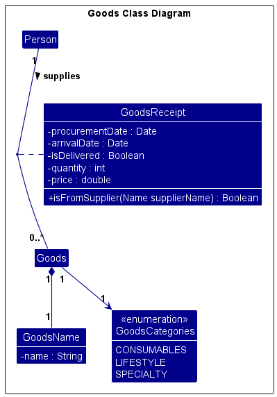

## Table of Contents
<!-- TOC -->
  * [Table of Contents](#table-of-contents)
  * [**Acknowledgements**](#acknowledgements)
  * [**Setting up, getting started**](#setting-up-getting-started)
  * [**Design**](#design)
    * [Architecture](#architecture)
    * [UI component](#ui-component)
    * [Logic component](#logic-component)
    * [Model component](#model-component)
    * [Storage component](#storage-component)
    * [Common classes](#common-classes)
    * [SupplyCentral: Goods Classes](#supplycentral-goods-classes)
  * [**Implementation**](#implementation)
    * [Export](#export-)
    * [Observable views of suppliers with supplier goods information.](#observable-views-of-suppliers-with-supplier-goods-information)
  * [**Documentation, logging, testing, configuration, dev-ops**](#documentation-logging-testing-configuration-dev-ops)
  * [**Appendix: Requirements**](#appendix-requirements)
    * [Product scope](#product-scope)
    * [User stories](#user-stories)
    * [Use cases](#use-cases)
      * [UC1: Add a supplier](#uc1-add-a-supplier)
      * [UC2: Delete all suppliers](#uc2-delete-all-suppliers)
      * [UC3: Delete a supplier](#uc3-delete-a-supplier)
      * [UC4: Edit a supplier](#uc4-edit-a-supplier)
      * [UC5: Find suppliers](#uc5-find-suppliers)
      * [UC6: List suppliers](#uc6-list-suppliers)
      * [UC7: Display help menu](#uc7-display-help-menu)
      * [UC8: Add a goods to a supplier](#uc8-add-a-goods-to-a-supplier)
      * [UC9: Delete a goods from a supplier](#uc9-delete-a-goods-from-a-supplier)
      * [UC10: View goods](#uc10-view-goods)
      * [UC11: Export goods data](#uc11-export-goods-data)
    * [Non-Functional Requirements](#non-functional-requirements)
    * [Glossary](#glossary)
  * [**Appendix: Instructions for manual testing**](#appendix-instructions-for-manual-testing)
    * [Launch and shutdown](#launch-and-shutdown)
    * [Adding a person](#adding-a-person)
    * [Deleting a person](#deleting-a-person)
    * [Adding Goods to the system](#adding-goods-to-the-system)
    * [Deleting Goods from the system](#deleting-goods-from-the-system)
    * [Saving data](#saving-data)
  * [**Appendix: Effort**](#appendix-effort)
    * [Effort Summary](#effort-summary)
    * [Goods Storage](#goods-storage)
    * [Main Challenges Faced](#main-challenges-faced)
    * [Empathising with our Persona: Non-Tech Savvy Business Owner](#empathising-with-our-persona-non-tech-savvy-business-owner)
  * [**Appendix: Planned Enhancements**](#appendix-planned-enhancements)
<!-- TOC -->

--------------------------------------------------------------------------------------------------------------------

## **Acknowledgements**

* [`OpenCSV`](https://mvnrepository.com/artifact/com.opencsv/opencsv/5.7.1) is used in this project for Goods related features.
* This project is based on the [Address-Book-Level3 (AB3)](https://github.com/se-edu/addressbook-level3) project.
* `GitHub Copilot` was used by teammate, Leong Soon Mun Stephane, as a troubleshooting and auto-complete tool for coding, testing, and documentation for this project.

--------------------------------------------------------------------------------------------------------------------

## **Setting up, getting started**

Refer to the guide [_Setting up and getting started_](SettingUp.md).

--------------------------------------------------------------------------------------------------------------------
<div style="page-break-after: always;"></div>

## **Design**

<div markdown="span" class="alert alert-primary">

:bulb: **Tip:** The `.puml` files used to create diagrams in this document `docs/diagrams` folder. Refer to the [_PlantUML Tutorial_ at se-edu/guides](https://se-education.org/guides/tutorials/plantUml.html) to learn how to create and edit diagrams.
</div>

### Architecture


The ***Architecture Diagram*** given above explains the high-level design of the App.

Given below is a quick overview of main components and how they interact with each other.

**Main components of the architecture**

**`Main`** (consisting of classes [`Main`](https://github.com/se-edu/addressbook-level3/tree/master/src/main/java/seedu/address/Main.java) and [`MainApp`](https://github.com/se-edu/addressbook-level3/tree/master/src/main/java/seedu/address/MainApp.java)) is in charge of the app launch and shut down.
* At app launch, it initializes the other components in the correct sequence, and connects them up with each other.
* At shut down, it shuts down the other components and invokes cleanup methods where necessary.

The bulk of the app's work is done by the following four components:

* [**`UI`**](#ui-component): UI of the application.
* [**`Logic`**](#logic-component): Executes & parses commands.
* [**`Model`**](#model-component): Data of the application is stored here.
* [**`Storage`**](#storage-component): Reads/Writes data to the disk.

[**`Commons`**](#common-classes) represents a collection of classes used by multiple other components.

**How the architecture components interact with each other**

The *Sequence Diagram* below shows how the components interact with each other for the scenario where the user issues the command `delete Alice`.


Each of the four main components (also shown in the diagram above),

* defines its *API* in an `interface` with the same name as the Component.
* implements its functionality using a concrete `{Component Name}Manager` class (which follows the corresponding API `interface` mentioned in the previous point.

For example, the `Logic` component defines its API in the `Logic.java` interface and implements its functionality using the `LogicManager.java` class which follows the `Logic` interface. Other components interact with a given component through its interface rather than the concrete class (reason: to prevent outside component's being coupled to the implementation of a component), as illustrated in the (partial) class diagram below.


The sections below give more details of each component.

### UI component

The **API** of this component is specified in [`Ui.java`](https://github.com/se-edu/addressbook-level3/tree/master/src/main/java/seedu/address/ui/Ui.java)


The UI consists of a `MainWindow` that is made up of parts e.g.`CommandBox`, `ResultDisplay`, `PersonListPanel`, `StatusBarFooter` etc. All these, including the `MainWindow`, inherit from the abstract `UiPart` class which captures the commonalities between classes that represent parts of the visible GUI.

The `UI` component uses the JavaFx UI framework. The layout of these UI parts are defined in matching `.fxml` files that are in the `src/main/resources/view` folder. For example, the layout of the [`MainWindow`](https://github.com/se-edu/addressbook-level3/tree/master/src/main/java/seedu/address/ui/MainWindow.java) is specified in [`MainWindow.fxml`](https://github.com/se-edu/addressbook-level3/tree/master/src/main/resources/view/MainWindow.fxml)

The `UI` component,

* executes user commands using the `Logic` component.
* listens for changes to `Model` data so that the UI can be updated with the modified data.
* keeps a reference to the `Logic` component, because the `UI` relies on the `Logic` to execute commands.
* depends on some classes in the `Model` component, as it displays the `Person`, `Goods` and `GoodsReceipt` objects residing in the `Model`.

### Logic component

**API** : [`Logic.java`](https://github.com/se-edu/addressbook-level3/tree/master/src/main/java/seedu/address/logic/Logic.java)

Here's a (partial) class diagram of the `Logic` component:


The sequence diagram below illustrates the interactions within the `Logic` component, taking `execute("delete Alice")` API call as an example.


**Note:** The lifeline for `DeleteCommandParser` should end at the destroy marker (X) but due to a limitation of PlantUML, the lifeline continues till the end of diagram.

How the `Logic` component works:

1. When `Logic` is called upon to execute a command, it is passed to an `AddressBookParser` object which in turn creates a parser that matches the command (e.g., `DeleteCommandParser`) and uses it to parse the command.
1. This results in a `Command` object (more precisely, an object of one of its subclasses e.g., `DeleteCommand`) which is executed by the `LogicManager`.
1. The command can communicate with the `Model` when it is executed (e.g. to delete a person).<br>
   Note that although this is shown as a single step in the diagram above (for simplicity), in the code it can take several interactions (between the command object and the `Model`) to achieve.
1. The result of the command execution is encapsulated as a `CommandResult` object which is returned back from `Logic`.

Here are the other classes in `Logic` (omitted from the class diagram above) that are used for parsing a user command:


How the parsing works:
* When called upon to parse a user command, the `AddressBookParser` class creates an `XYZCommandParser` (`XYZ` is a placeholder for the specific command name e.g., `AddCommandParser`) which uses the other classes shown above to parse the user command and create a `XYZCommand` object (e.g., `AddCommand`) which the `AddressBookParser` returns back as a `Command` object.
* All `XYZCommandParser` classes (e.g., `AddCommandParser`, `DeleteCommandParser`, ...) inherit from the `Parser` interface so that they can be treated similarly where possible e.g, during testing.

### Model component
**API** : [`Model.java`](https://github.com/se-edu/addressbook-level3/tree/master/src/main/java/seedu/address/model/Model.java)


The `Model` component,

* stores the address book data i.e., all `Person` objects (which are contained in a `UniquePersonList` object).
* stores the currently 'selected' `Person` objects (e.g., results of a search query) as a separate _filtered_ list which is exposed to outsiders as an unmodifiable `ObservableList<Person>` that can be 'observed' e.g. the UI can be bound to this list so that the UI automatically updates when the data in the list change.
* stores a `UserPref` object that represents the user’s preferences. This is exposed to the outside as a `ReadOnlyUserPref` objects.
* does not depend on any of the other three components (as the `Model` represents data entities of the domain, they should make sense on their own without depending on other components)

**Note:** An alternative (arguably, a more OOP) model is given below. It has a `Tag` list in the `AddressBook`, which `Person` references. This allows `AddressBook` to only require one `Tag` object per unique tag, instead of each `Person` needing their own `Tag` objects.<br>


### Storage component

**API** : [`Storage.java`](https://github.com/se-edu/addressbook-level3/tree/master/src/main/java/seedu/address/storage/Storage.java)


The `Storage` component,
* can save both address book data and user preference data in JSON format, and read them back into corresponding objects.
* can save goods data in CSV format, and read them back into corresponding objects.
* inherits from both `AddressBookStorage`, `GoodsStorage`, and `UserPrefStorage`, which means it can be treated as either one (if only the functionality of only one is needed).
* depends on some classes in the `Model` component (because the `Storage` component's job is to save/retrieve objects that belong to the `Model`)
* `CsvConverters` are used to convert between the model objects fields and the CSV fields.
* `CsvGoodsStorage` and `CsvConverters` use OpenCSV to read and write CSV files.

### Common classes

Classes used by multiple components are in the `seedu.address.commons` package.

<div style="page-break-after: always;"></div>

### SupplyCentral: Goods Classes



Goods classes are specific for SupplyCentral, where many convenience functions will be built in the application to cater to specific suppliers.
Person (Suppliers) will,
* be able to supply multiple Goods to the user
* will be tracked with a unique Goods Receipt, which contains more useful information related to the transaction

--------------------------------------------------------------------------------------------------------------------

## **Implementation**

This section describes some noteworthy details on how certain features are implemented.

### Export 

1. The export command modifies ```UserPrefs#exportFilterGoods``` to true when called.
2. When the command is executed, ```LogicManager``` will check this variable.
3. If the variable is true, ```LogicManager``` will call ```Storage#saveFilteredGoods``` from the storage class.
4. Effectively creating/updating the ```filteredGoods.csv``` file by writing the currently displayed goods list into it.
5. ```LogicManager``` then calls ```Model#setExportFilterGoodsToFalse``` to set ```UserPrefs#exportFilterGoods``` to false.
6. The filtered file is thus created when the export command is used.

### Observable views of suppliers with supplier goods information.

As per the MVC architecture, the underlying data containers are stored as observable lists, which allows the UI to listen for changes to the data model and update its view. Our current implementation aggregates suppliers and goods separately, which means that suppliers and goods are stored in separate observable lists. This means that rather than having a reference from the supplier to his/her goods (i.e. the supplier stores his/her goods), the relationship is reversed (the supplier is stored in each of his/her goods).

Typically, this isn't too much of a problem if the UI suppliers view does not use information from the goods, as it is vice versa, as none of them would know any underlying data changes from the other side. However, this initial assumption does not hold for a case of a feature which is to tag goods categories for suppliers based on the goods they have (e.g. if alice has a good with goods category 'consumables', then a tag of 'consumables' will be present in alice card in the UI view of suppliers). This means adding a new goods would inevitably require updating the UI view of the supplier.

One approach could be to update the supplier tags every time a new goods is added (and then updating the observable view of suppliers), but this is error-prone as it causes duplication of information.

How this is actually accomplished, is by creating a new observable list (that the suppliers listview of the UI will use) that observes the two observable lists of suppliers and goods. Any changes from either the suppliers or goods lists will be observed in this joint observable list which will allow the UI to update accordingly. Not only does this allow for dynamic updates of the supplier listview whenever the goods observable list is updated, but also mitigate the issue of having to constantly update the (original) suppliers list.

The diagrams below illustrates the implementation of the observer pattern. Note that these diagrams are only for conceptual understanding and the names of the classes may be different from what is actually present in the code.

Before:


After:


--------------------------------------------------------------------------------------------------------------------

<div style="page-break-after: always;"></div>

## **Documentation, logging, testing, configuration, dev-ops**

* [Documentation guide](Documentation.md)
* [Testing guide](Testing.md)
* [Logging guide](Logging.md)
* [Configuration guide](Configuration.md)
* [DevOps guide](DevOps.md)

--------------------------------------------------------------------------------------------------------------------

## **Appendix: Requirements**

### Product scope

**Target user profile**: A business owner managing a small business who frequently procures goods from suppliers.

**Persona**: Ms. Balakrishnan is a business owner of a small convenience store (mama shop) located in Tampines. She finds it difficult to track her procurements, and is bad with numbers.

* has a need to manage a significant number of contacts
* prefer desktop apps over other types
* can type fast
* prefers typing to mouse interactions
* is reasonably comfortable using CLI apps
* needs to associate many goods with many contacts

**Value proposition**: To be able to manage contacts faster than a typical mouse/GUI driven app, and able to associate goods to contacts and suppliers for an easier and more comprehensive business management experience.

<div style="page-break-after: always;"></div>

### User stories

Priorities: High (must have) - `* * *`, Medium (nice to have) - `* *`, Low (unlikely to have) - `*`

| Priority | As a …​                              | I want to …​                                                                 | So that I can…​                                                                               |
| -------- |--------------------------------------|------------------------------------------------------------------------------|-----------------------------------------------------------------------------------------------|
| `* * *`  | business owner                       | add suppliers and clients                                                    | a. view them later<br/>b. view information related to the contact                             |
| `* * *`  | business owner                       | list contacts of whom I added                                                | see the full list of suppliers I am in contact with                                           |
| `* * *`  | business owner                       | see the contacts which I added even after I exit and restart the application | access supplier information without needing to re-enter information each time I open the app. |
| `* * *`  | business owner                       | delete a contact                                                             | remove suppliers that are no longer relevant to me                                            |
| `* *`    | business owner                       | add extra relevant information to the contact                                | view more details of the supplier                                                             |
| `*`      | business owner who has many contacts | search for contacts by name and category of goods and services               | locate the relevant supplier easily                                                           |
| `* * *`  | business owner                       | add procured goods under my suppliers                                        | keep track of my transacted goods                                                             |
| `* * *`  | business owner                       | view a list of procured goods                                                | look at their details                                                                         |
| `* *`    | business owner                       | delete erroneous goods data                                                  | ensure the data integrity of my goods information                                             |
| `*`      | business owner                       | view my pending deliveries                                                   | see what goods I should be expecting to arrive                                                |
| `*`      | business owner who is bad at numbers | get statistical data for my goods                                            | do my cost and profit calculations                                                            |

<div style="page-break-after: always;"></div>

### Use cases

(For all use cases below, the **System** is `SupplyCentral` and the **Actor** is the `User`, unless specified otherwise.)

#### UC1: Add a supplier

**MSS**
1. User enters details to add a supplier.
2. System adds the supplier.  
Use case ends.

**Extensions**
- 1a. Details are not properly formatted or complete.
  - 1a1. System shows an error message.  
  Use case ends.
- 1b. The supplier to add already exist in the system.
  - 1bi. System shows an error message.  
  Use case ends.

#### UC2: Delete all suppliers

**MSS**
1. User requests to delete all suppliers.
2. System deletes all suppliers and their goods.  
Use case ends.

#### UC3: Delete a supplier

**MSS**
1. User enters details to delete a supplier.
2. System deletes the supplier and the supplier's goods.  
Use case ends.

**Extensions**
- 1a. Details are not properly formatted or complete.
  - 1ai. System displays an error message.   
  Use case ends.
- 1b. Supplier does not exist.
  - 1bi. System displays an error message.  
  Use case ends.

#### UC4: Edit a supplier

**MSS**
1. User enters details to edit a supplier.
2. System edits the supplier.  
Use case ends.

**Extensions**
- 1a. Details are not properly formatted or complete.
  - 1ai. System displays an error message.  
  Use case ends.

#### UC5: Find suppliers

**MSS**
1. User enters details to find suppliers.
2. System displays a list of suppliers filtered by the details.  
Use case ends.

**Extensions**
- 1a. Details are not properly formatted or complete.
  - 1ai. System displays an error message.  
  Use case ends.

#### UC6: List all suppliers

**MSS**
1. User requests to view all suppliers.
2. System displays a view of all suppliers.  
  Use case ends.

#### UC7: Display help menu

**MSS**
1. User requests a help menu.
2. System displays the help menu.  
  Use case ends.

#### UC8: Add a goods to a supplier

**MSS**
1. User enters details to add a goods to a supplier.
2. System adds the good to the supplier.  
Use case ends.

**Extensions**
- 1a. Details are not properly formatted or complete.
  - 1ai. System displays an error message.  
  Use case ends.
- 1b. The supplier does not exist.
  - 1bi. System displays an error message.  
  Use case ends.
- 1c. The exact goods to be added already exists with the supplier.
  - 1ci. System display an error message.  
  Use case ends.

#### UC9: Delete a goods from a supplier

**MSS**
1. User enters details to delete a goods from a supplier.
2. System deletes the goods from the supplier.  
Use case ends.

**Extensions**
- 1a. Details are not properly formatted or complete.
  - 1ai. System displays an error message.   
  Use case ends.
- 1b. The supplier does not exist.
  - 1bi. System displays an error message.  
  Use case ends.
- 1c. The goods from the supplier does not exist.
  - 1ci. System displays an error message.  
  Use case ends.

#### UC10: View goods

**MSS**
1. User enters details to view goods.
2. System displays a filtered view of goods as specified by the details.  
Use case ends.

**Extensions**
- 1a. Details are not properly formatted or complete.
  - 1ai. System displays an error message.   
  Use case ends.
- 1b. No goods are found.
  - 1bi. System displays an empty list of goods.
  - 1bii. System displays a feedback saying that no goods are found.  
  Use case ends.

#### UC11: Export goods data

**MSS**
1. User requests to export goods data.
2. System generates a csv based on the goods displayed to the user.  
Use case ends.

### Non-Functional Requirements

1. Should work on any _mainstream OS_ as long as it has Java `17` or above installed.
2. Should be able to store up to 1000 contacts persistently.
3. Should be able to hold up to 1000 persons without a noticeable sluggishness in performance for typical usage.
4. Should be able to store up to 10000 goods persistently.
5. Updating persistent storage should not result in unnecessary data modifications.
6. Startup time for the application should be less than 3 seconds on all _mainstream OS_.
7. The system should perform commands within 3 seconds on all _mainstream OS_.
8. The system should be not crash unexpectedly on all _mainstream OS_ during the performing of commands.
9. All error messages should be readable (in layman's terms) and provide corrective actions whenever possible.
10. The application must be able to export data in _commonly used formats_.
11. The application must not require any internet connection to function.
12. The project is not required to handle any messaging functions between users and contacts.
13. Key functions in the project should be tested with JUnit, with a minimal coverage of 75%.
14. Price of goods should not be negative.
15. Quantity of goods should not be negative.
16. Arrival date of goods should not be earlier than or equal to the current date.

### Glossary

* **Mainstream OS**: Windows, Linux, Unix, MacOS
* **Commonly Used Formats**: Text Files, CSV Files
* **Help System**: The built-in documentation or command that provides guidance on using the application, including descriptions of commands and examples.
* **Goods**: A commodity that is sold to the user.
* **Goods Receipt**: Receipt that contains data about the delivery information (e.g. procurement date, arrival date, delivery status).
* **Supplier**: Someone who is selling goods to the user. For this application, they are the contacts.
* **Procurement Date**: The date in which the order for the goods have been made.
* **Arrival Date**: The expected date of delivery for the goods.
* **Tag**: A note for the contact written by the user.

--------------------------------------------------------------------------------------------------------------------

## **Appendix: Instructions for manual testing**

Given below are instructions to test the app manually.

**Note:** These instructions only provide a starting point for testers to work on;
testers are expected to do more *exploratory* testing.

### Launch and shutdown

1. Initial launch

   1. Download the jar file and copy into an empty folder

   1. Double-click the jar file Expected: Shows the GUI with a set of sample contacts. The window size may not be optimum.

1. Saving window preferences

   1. Resize the window to an optimum size. Move the window to a different location. Close the window.

   1. Re-launch the app by double-clicking the jar file.<br>
       Expected: The most recent window size and location is retained.

### Adding a person

1. Adding a person to SupplyCentral.

   1. Prerequisites: -

   1. Test case: `add n/John Doe p/98765432 a/John street, Block 123, #01-01`<br>
      Expected: Contact `John Doe` is added to the list and shown, with the relevant details.

   1. Incorrect add commands to try: `add n/John Doe`, `add n/1001` (where n is provided as a number)
      Expected: System will provide an error message indicating correct usage. 

### Deleting a person

1. Deleting a person from SupplyCentral.

   1. Prerequisites: -

   1. Test case: `delete Amy`<br>
      Expected: Contact `Amy` is deleted from the list if `Amy` is an existing contact. Details of the deleted contact shown in the status message.

   1. Incorrect delete commands to try: `delete`, `delete x`, `...` (where x is a number or a name that is not registered)<br>
      Expected: System will provide an error message indicating correct usage.

### Adding Goods to the system

1. Adding goods to SupplyCentral.

   1. Prerequisites: At least one supplier (e.g. Alex Yeoh) must be registered in SupplyCentral.

   1. Test case: `addgoods gn/Gardenia Milk Bread q/2 p/5 c/CONSUMABLES pd/2024-08-08 11:00 ad/2024-11-11 11:00 n/Alex Yeoh`
      Expected: Goods `Gardenia Milk Bread` is added under the supplier `Alex Yeoh`.

   1. Incorrect add goods commands to try: `addgoods`, `addgoods gn/Gardenia Bread q/-1 p/5 c/CONSUMABLES pd/2024-08-08 11:00 ad/2024-11-11 11:00 n/Alex Yeoh`
      Expected: System will provide an error message indicating correct usage.

### Deleting Goods from the system

1. Deleting goods from SupplyCentral.

   1. Prerequisites: At least one supplier (e.g. Alex Yeoh) must be registered in SupplyCentral.

   1. Test case: `deletegoods n/Alex Yeoh gn/Gardenia Milk Bread`
      Expected: Goods `Gardenia Milk Bread` is deleted from the supplier `Alex Yeoh` if the record exists.

   1. Incorrect delete goods commands to try: `deletegoods`, `deletegoods gn/Gardenia Bread`, `deletegoods n/Alex Yeoh`
      Expected: System will provide an error message indicating the correct usage.

--------------------------------------------------------------------------------------------------------------------
<div style="page-break-after: always;"></div>

## **Appendix: Effort**

### Effort Summary
Difficulty level for the project was high as we increased the complexity of our use case by handling another entity `Goods` in addition to the suppliers. As we strived to tackle the pain points faced by our persona, we had to add goods tracking and other important features for our persona. This app thus handles two different entities in two different data types, while ensuring smooth integration between both. We believe that we have been able to build a comprehensive application that we believe can help to alleviate the pain points of our persona. 

### Goods Storage
OpenCSV was used to handle working with CSV files. Hence, we are handling another file type besides the JSON that AB3 uses. Integrating this library made it easier to implement CSV-related functions. However, we did have to learn to use this library effectively and in a way that could make the application bug-free even with unintended incorrect usage. This resulted in quite some time and effort being used to ensure the testability of the integration of the project with OpenCSV.

### Main Challenges Faced
Besides ensuring that any bugs with OpenCSV are handled correctly, we also had to:
* Ensure duplication checks are done according to real-life scenarios (*e.g.* where it is possible for two transactions for the same goods to be present with the same supplier with just minor differences)
* Ensure that proper business rules are enforced throughout the application (*e.g.* quantity of the goods cannot be negative)
* Consider the needs of our persona, and develop features accordingly (*e.g.* addition of statistical data when viewing a desired list of goods)
* Adding minor GUI fixes for better display formats

### Empathising with our persona: A Non-Tech Savvy Business Owner
In efforts to cater to our persona, we have added features that would be useful for a business owner who is not tech-savvy. We have added and modified features such as:
* Deleting based on name instead of index.
* Finding suppliers based on the category of goods they supply as well.
* **Automatically** marks goods as delivered when the time has passed without the need for any user actions.

--------------------------------------------------------------------------------------------------------------------
<div style="page-break-after: always;"></div>

## **Appendix: Planned Enhancements**

Team Size: 5

1. Make the error message for adding of goods more detailed. The current error message is too general and can be improved upon by mentioning which field is failing the sanity check and reflecting that to the user.
2. Add a feature to allow the user to sort the goods by price, quantity, and arrival date. This will allow the user to better manage their goods.
3. Bound the unit level and unit number in the address field for the relevant commands. Currently, the commands allow an unrestricted unit level and number, resulting in unrealistic inputs such as `421 Marina Bay Road #123222222222-34444444444444 Tan Kim PTE Building Singapore 123456` to be accepted as valid inputs.
4. Allow for automatic capitalization for supplier names. Currently, inputting a lower cased supplier name into the relevant commands (*e.g.* addgoods) does not automatically capitalize it appropriately.
5. Add case insensitivity for tags. Currently, identical tags that differ only in letter casing are considered as unique tags.
6. Enhance error handling for the address parameter by providing specific feedback on which part of the input is invalid. The error message should clearly inform the user about the exact issue, such as incorrect street name, invalid postal code, or missing building name information.
7. Update the error message for adding goods to clarify that the quantity must be a positive integer excluding 0. Currently, it states that the quantity must be a non-negative integer, but the program does not accept 0 as a valid quantity. Error message should be adjusted to accurately reflect this business requirement.
8. Modify categories to be case-insensitive in the related commands for ease of use. Currently, the program only considers strictly fully upper-cased categories to be valid inputs.
9. Modify adding of good and suppliers to accept special characters for real-world applicability. Current functionality does not allow a goods name or supplier name with special characters even though this may be a realistic use case.
10. Add a maximum amount that the UI elements can be expanded/minimized to. Current functionality allows users to fully maximize/minimize UI elements which may impact the user experience negatively.
11. Adjust the colors of the supplier and category tags to be distinct, as using the same color for both may cause confusion for users.
12. Modify `addgoods` to refresh the goods view to show all the goods. Current functionality does not refresh the goods view after adding a good.
13. Optimize the address parameter to automatically include compulsory aspects (e.g. a `Singapore` to precede the postal code and the hash symbol `#` to prefix the unit level).
14. Allow the address parameter to omit the unit level, unit number and block number as some buildings/locations do not include them.
