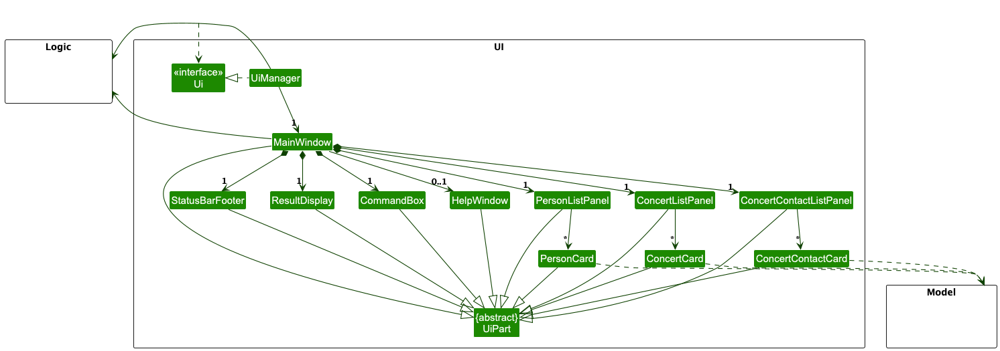

## Table of Contents

1. [Acknowledgements](#acknowledgements)
2. [Setting up, getting started](#setting-up-getting-started)
3. [Design](#design)
   1. [Architecture](#architecture)
   2. [UI component](#ui-component)
   3. [Logic component](#logic-component)
   4. [Model component](#model-component)
   5. [Storage component](#storage-component)
   6. [Common classes](#common-classes)
4. [Documentation, logging, testing, configuration, dev-ops](#documentation-logging-testing-configuration-dev-ops)
5. [Appendix: Requirements](#appendix-requirements)
   1. [Product scope](#product-scope)
   2. [User stories](#user-stories)
   3. [Use cases](#use-cases)
   4. [Non-Functional Requirements](#non-functional-requirements)
   5. [Glossary](#glossary)
6. [Appendix: Instructions for manual testing](#appendix-instructions-for-manual-testing)
   1. [Launch and shutdown](#launch-and-shutdown)
   2. [Deleting a person](#deleting-a-person)

---

## **Acknowledgements**

This project is based on the AddressBook-Level3 project created by the [SE-EDU initiative](https://se-education.org).

---

## **Setting up, getting started**

Refer to the guide [_Setting up and getting started_](SettingUp.md).

---

## **Design**

:bulb: **Tip:** The `.puml` files used to create diagrams in this document `docs/diagrams` folder. Refer to the [_PlantUML Tutorial_ at se-edu/guides](https://se-education.org/guides/tutorials/plantUml.html) to learn how to create and edit diagrams.

### Architecture

The **_Architecture Diagram_** given above explains the high-level design of the App.

Given below is a quick overview of main components and how they interact with each other.

**Main components of the architecture**

**`Main`** (consisting of classes [`Main`](https://github.com/AY2425S1-CS2103T-F11-1/tp/blob/master/src/main/java/seedu/address/Main.java) and [`MainApp`](https://github.com/AY2425S1-CS2103T-F11-1/tp/blob/master/src/main/java/seedu/address/MainApp.java)) is in charge of the app launch and shut down.

- At app launch, it initializes the other components in the correct sequence, and connects them up with each other.
- At shut down, it shuts down the other components and invokes cleanup methods where necessary.

The bulk of the app's work is done by the following four components:

- [**`UI`**](#ui-component): The UI of the App.
- [**`Logic`**](#logic-component): The command executor.
- [**`Model`**](#model-component): Holds the data of the App in memory.
- [**`Storage`**](#storage-component): Reads data from, and writes data to, the hard disk.

[**`Commons`**](#common-classes) represents a collection of classes used by multiple other components.

**How the architecture components interact with each other**

The _Sequence Diagram_ below shows how the components interact with each other for the scenario where the user issues the command `deletep 1`.

Each of the four main components (also shown in the diagram above),

- defines its _API_ in an `interface` with the same name as the Component.
- implements its functionality using a concrete `{Component Name}Manager` class (which follows the corresponding API `interface` mentioned in the previous point.

For example, the `Logic` component defines its API in the `Logic.java` interface and implements its functionality using the `LogicManager.java` class which follows the `Logic` interface. Other components interact with a given component through its interface rather than the concrete class (reason: to prevent outside component's being coupled to the implementation of a component), as illustrated in the (partial) class diagram below.

The sections below give more details of each component.

### UI component

The **API** of this component is specified in [`Ui.java`](https://github.com/AY2425S1-CS2103T-F11-1/tp/blob/master/src/main/java/seedu/address/ui/Ui.java)

The UI consists of a `MainWindow` that is made up of parts e.g.`CommandBox`, `ResultDisplay`, `PersonListPanel`, `ConcertListPanel`, `StatusBarFooter` etc. All these, including the `MainWindow`, inherit from the abstract `UiPart` class which captures the commonalities between classes that represent parts of the visible GUI.

The `UI` component uses the JavaFx UI framework. The layout of these UI parts are defined in matching `.fxml` files that are in the `src/main/resources/view` folder. For example, the layout of the [`MainWindow`](https://github.com/AY2425S1-CS2103T-F11-1/tp/blob/master/src/main/java/seedu/address/ui/MainWindow.java) is specified in [`MainWindow.fxml`](https://github.com/AY2425S1-CS2103T-F11-1/tp/blob/master/src/main/resources/view/MainWindow.fxml)

The `UI` component,

- executes user commands using the `Logic` component.
- listens for changes to `Model` data so that the UI can be updated with the modified data.
- keeps a reference to the `Logic` component, because the `UI` relies on the `Logic` to execute commands.
- depends on some classes in the `Model` component, as it displays `Person`, `Concert` and `ConcertContact` objects residing in the `Model`.

### Logic component

**API** : [`Logic.java`](https://github.com/AY2425S1-CS2103T-F11-1/tp/blob/master/src/main/java/seedu/address/logic/Logic.java)

Here's a (partial) class diagram of the `Logic` component:

The sequence diagram below illustrates the interactions within the `Logic` component, taking `execute("deletep 1")` API call as an example.

:information_source: **Note:** The lifeline for `DeleteCommandParser` should end at the destroy marker (X) but due to a limitation of PlantUML, the lifeline continues till the end of diagram.

How the `Logic` component works:

1. When `Logic` is called upon to execute a command, it is passed to an `AddressBookParser` object which in turn creates a parser that matches the command (e.g., `DeletePersonCommandParser`) and uses it to parse the command.
1. This results in a `Command` object (more precisely, an object of one of its subclasses e.g., `DeletePersonCommand`) which is executed by the `LogicManager`.
1. The command can communicate with the `Model` when it is executed (e.g. to delete a person). 
   Note that although this is shown as a single step in the diagram above (for simplicity), in the code it can take several interactions (between the command object and the `Model`) to achieve.
1. The result of the command execution is encapsulated as a `CommandResult` object which is returned back from `Logic`.

Here are the other classes in `Logic` (omitted from the class diagram above) that are used for parsing a user command:

How the parsing works:

- When called upon to parse a user command, the `AddressBookParser` class creates an `XYZCommandParser` (`XYZ` is a placeholder for the specific command name e.g., `AddPersonCommandParser`) which uses the other classes shown above to parse the user command and create a `XYZCommand` object (e.g., `AddPersonCommand`) which the `AddressBookParser` returns back as a `Command` object.
- All `XYZCommandParser` classes (e.g., `AddPersonCommandParser`, `DeletePersonCommandParser`, ...) inherit from the `Parser` interface so that they can be treated similarly where possible e.g, during testing.

### Model component

**API** : [`Model.java`](https://github.com/AY2425S1-CS2103T-F11-1/tp/blob/master/src/main/java/seedu/address/model/Model.java)

:information_source: **Note:** ConcertContact is an Association Class between Person and Concert.

The `Model` component,

- stores the address book data i.e., all `Person`, `Concert` and `ConcertContact` objects (which are contained in a `UniquePersonList`, `UniqueConcertList` and `UniqueConcertContactList` object respectively).
- stores the currently 'selected' `Person` objects (e.g., results of a search query) as a separate _filtered_ list which is exposed to outsiders as an unmodifiable `ObservableList<Person>` that can be 'observed' e.g. the UI can be bound to this list so that the UI automatically updates when the data in the list change.
- stores the currently 'selected' `Concert` objects (e.g., results of a search query) as a separate _filtered_ list which is exposed to outsiders as an unmodifiable `ObservableList<Concert>` that can be 'observed' e.g. the UI can be bound to this list so that the UI automatically updates when the data in the list change.
- stores the currently 'selected' `ConcertContact` objects (e.g., results of a search query) as a separate _filtered_ list which is exposed to outsiders as an unmodifiable `ObservableList<ConcertContact>` that can be 'observed' e.g. the UI can be bound to this list so that the UI automatically updates when the data in the list change.
- stores a `UserPref` object that represents the user’s preferences. This is exposed to the outside as a `ReadOnlyUserPref` objects.
- does not depend on any of the other three components (as the `Model` represents data entities of the domain, they should make sense on their own without depending on other components)

:information_source: **Note:** An alternative (arguably, a more OOP) model is given below. It has a `Tag` list in the `AddressBook`, which `Person` references. This allows `AddressBook` to only require one `Tag` object per unique tag, instead of each `Person` needing their own `Tag` objects. 

### Storage component

**API** : [`Storage.java`](https://github.com/AY2425S1-CS2103T-F11-1/tp/blob/master/src/main/java/seedu/address/storage/Storage.java)

The `Storage` component,

- can save both address book data and user preference data in JSON format, and read them back into corresponding objects.
- inherits from both `AddressBookStorage` and `UserPrefStorage`, which means it can be treated as either one (if only the functionality of only one is needed).
- depends on some classes in the `Model` component (because the `Storage` component's job is to save/retrieve objects that belong to the `Model`)

### Common classes

Classes used by multiple components are in the `seedu.address.commons` package.

---

## **Documentation, logging, testing, configuration, dev-ops**

- [Documentation guide](Documentation.md)
- [Testing guide](Testing.md)
- [Logging guide](Logging.md)
- [Configuration guide](Configuration.md)
- [DevOps guide](DevOps.md)

---

## **Appendix: Requirements**

### Product scope

**Target user profile**:

- concert organisers who manage many different groups of contacts
- for different concerts
- prefer desktop apps over other types
- can type fast
- prefers typing to mouse interactions
- is reasonably comfortable using CLI apps

**Value proposition**: ConcertPhonebook allows concert organisers to add, delete and quickly sift through many contacts, from whom to obtain required resources or fulfill their professional obligations. Contacts will include roles, such as promoter, logistics, sound technician, etc. It provides an efficient CLI optimised for fast typists, complemented by a GUI for convenience.

### User stories

Priorities: High (must have) - `* * *`, Medium (nice to have) - `* *`, Low (unlikely to have) - `*`

| Priority | As a …​           | I want to …​                           | So that I can…​                                                        |
| -------- | ----------------- | -------------------------------------- |------------------------------------------------------------------------|
| `* * *`  | new user          | see usage instructions                 | refer to instructions when I forget how to use the App                 |
| `* * *`  | concert organiser | add a new person                       |                                                                        |
| `* * *`  | concert organiser | delete a person                        | remove entries that I no longer need                                   |
| `* * *`  | concert organiser | view a person by name                  | locate details of persons without having to go through the entire list |
| `* * *`  | concert organiser | assign roles to people                 | categorise each contact by what they do                                |
| `* * *`  | concert organiser | edit a contact                         | have the most updated contact details                                  |
| `* * *`  | concert organiser | view people by their roles             | easily contact the personnel I need for a concert                      |
| `* * *`  | concert organiser | create a new concert                   | manage the personnel involved in the concert                           |
| `* * *`  | concert organiser | view a list of personnel for a concert | view everyone involved in a concert easily                             |
| `* * *`  | concert organiser | view a list of bands for a concert     | view the concert lineup easily                                         |
| `* * *`  | concert organiser | add a contact to a concert             | collate the list of personnel for the concert                          |
| `* * *`  | concert organiser | remove a contact from a concert        | have the most updated list of personnel for the concert                |
| `* *`    | concert organiser | edit a concert                         | have the most updated concert details                                  |
| `* `     | concert organiser | favourite a contact                    | quickly contact the people I favourite                                 |
| `*`      | concert organiser | write a review for a contact           | describe past experiences with the contact                             |
| `* `     | concert organiser | leave a rating for a contact           | generalise past experiences with the contact                           |
| `* `     | concert organiser | find people by their roles             | easily contact the personnel I need for a concert                      |

### Use cases

(For all use cases below, the **System** is the `ConcertPhonebook` and the **Actor** is the `user`, unless specified otherwise)

**Use case: UC1 - Delete a person**

**MSS**

1.  User requests to list persons
2.  ConcertPhonebook shows a list of persons
3.  User requests to delete a specific person in the list
4.  ConcertPhonebook deletes the person

    Use case ends.

**Extensions**

- 2a. The list is empty.

  Use case ends.

- 3a. The given index is invalid.

  - 3a1. ConcertPhonebook shows an error message.

    Use case resumes at step 2.

---

**Use case: UC2 - Add a person**

**MSS**

1.  User requests to list persons
2.  ConcertPhonebook shows a list of persons
3.  User requests to add a person
4.  ConcertPhonebook adds the person

    Use case ends.

**Extensions**

- 3a. The list already contains the person.

  - 3a1. ConcertPhonebook shows an error message.

    Use case ends.

- 3b. The given person details is invalid.

  - 3b1. ConcertPhonebook shows an error message.

    Use case resumes at step 2.

---

**Use case: UC3 - Edit a person**

**MSS**

1.  User requests to list persons
2.  ConcertPhonebook shows a list of persons
3.  User requests to edit a person in the list
4.  ConcertPhonebook edits the person

    Use case ends.

**Extensions**

- 2a. The list does not contain the person.

  - 2a1. ConcertPhonebook shows an error message.

    Use case ends.

- 3a. The given contact details/index is invalid.

  - 3a1. ConcertPhonebook shows an error message.

    Use case resumes at step 2.

---

**Use case: UC4 - Delete a concert**

**MSS**

1.  User requests to list concerts
2.  ConcertPhonebook shows a list of concerts
3.  User requests to delete a concert in the list
4.  ConcertPhonebook deletes the concert

    Use case ends.

**Extensions**

- 2a. The list is empty.

  Use case ends.

- 3a. The given index is invalid.

  - 3a1. ConcertPhonebook shows an error message.

    Use case resumes at step 2.

---

**Use case: UC5 - Add a concert**

**MSS**

1.  User requests to list concerts
2.  ConcertPhonebook shows a list of concerts
3.  User requests to add a concert not in the list
4.  ConcertPhonebook adds the concert

    Use case ends.

**Extensions**

- 2a. The list contains the concert.

  Use case ends.

- 3a. The given concert details is invalid.

  - 3a1. ConcertPhonebook shows an error message.

    Use case resumes at step 2.

---

**Use case: UC6 - Edit a concert**

**MSS**

1.  User requests to list concerts
2.  ConcertPhonebook shows a list of concerts
3.  User requests to edit a concert in the list
4.  ConcertPhonebook edits the concert

    Use case ends.

**Extensions**

- 2a. The list does not contain the concert.

  Use case ends.

- 3a. The given concert details/index is invalid.

  - 3a1. ConcertPhonebook shows an error message.

    Use case resumes at step 2.

---

**Use case: UC7 - Assign person to a concert**

**MSS**

1.  User requests to list concerts and persons
2.  ConcertPhonebook shows a list of concerts and persons
3.  User requests to assign a person to a concert in the list
4.  ConcertPhonebook assigns the person to the concert

    Use case ends.

**Extensions**

- 2a. The list does not contain the concert/person.

  Use case ends.

- 3a. The given person/concert is invalid.

  - 3a1. ConcertPhonebook shows an error message.

    Use case resumes at step 2.

---

**Use case: UC8 - Unassign person from concert**

**MSS**

1. User requests to list concert contacts
2. ConcertPhonebook shows a list of concert contacts
3. User requests to unassign a person from a concert in the list
4. ConcertPhonebook unassigns the person from the concert

Use case ends

**Extensions**

- 2a. The list does not contain the concert contact.

  Use case ends.

- 3a. The given concert contact is invalid.

  - 3a1. ConcertPhonebook shows an error message.

    Use case resumes at step 2.

---

**Use case: UC9 - Find person**

**MSS**

1. User request to find a person based on name/role
2. ConcertPhonebook shows a list matched persons

   Use case ends.

**Extensions**

- 1a. The given search keywords are invalid

  Use case resumes at step 1.

---

**Use case: UC10 - Find concert**

**MSS**

1. User request to find a concert based on name
2. ConcertPhonebook shows a list matched concerts.

   Use case ends.

**Extensions**

- 1a. The given search keywords are invalid

  Use case resumes at step 1.

---

**Use case: UC11 - Find concert contact**

**MSS**

1. User request to find a concert contact based on person/concert.
2. ConcertPhonebook shows a list matched concert contacts.

   Use case ends.

**Extensions**

- 1a. The given person/concert is invalid.

  Use case resumes at step 1.

---

### Non-Functional Requirements

1.  Should work on any _mainstream OS_ as long as it has Java `17` or above installed.
2.  Should be able to hold up to 1000 persons without a noticeable sluggishness in performance for typical usage.
3.  A user with above average typing speed for regular English text (i.e. not code, not system admin commands) should be able to accomplish most of the tasks faster using commands than using the mouse.
4.  The user interface should be intuitive enough for users who are not IT-savvy.
5.  The product is offered as a free _offline_ service.
6.  The response to any action should become visible within 5 seconds.
7.  The source code should be open source.
8.  Major bug fixes should be accompanied with a new release.
9.  The app should not have any offensive UI elements.
10. Features should complement each other soundly.

### Glossary

- **Mainstream OS**: Windows, Linux, Unix, MacOS
- **Private contact detail**: A contact detail that is not meant to be shared with others
- **GUI**: Graphical User Interface
- **CLI**: Command Line Interface
- **ConcertPhonebook**: Refers to the application
- **Concert contact**: Link between between an existing Person and a particular Concert in the ConcertPhonebook

---

## **Appendix: Instructions for manual testing**

Given below are instructions to test the app manually.

:information_source: **Note:** These instructions only provide a starting point for testers to work on;
testers are expected to do more *exploratory* testing.

### Launch and shutdown

1. Initial launch

   1. Download the jar file and copy into an empty folder

   2. Double-click the jar file Expected: Shows the GUI with a set of sample contacts. The window size may not be optimum.

2. Saving window preferences

   1. Resize the window to an optimum size. Move the window to a different location. Close the window.

   2. Re-launch the app by double-clicking the jar file. 
      Expected: The most recent window size and location is retained.

### Deleting a person

1. Deleting a person while all persons are being shown

   1. Prerequisites: List all persons using the `listp` command. Multiple persons in the list.

   2. Test case: `deletep 1` 
      Expected: First contact is deleted from the list. Details of the deleted contact shown in the status message. Timestamp in the status bar is updated.

   3. Test case: `deletep 0` 
      Expected: No person is deleted. Error details shown in the status message. Status bar remains the same.

   4. Other incorrect delete commands to try: `deletep`, `deletep x`, `...` (where x is larger than the list size) 
      Expected: Similar to previous.

2. Cases for deleting concert contacts as well as concerts follow similarly to that of deleting a person.
