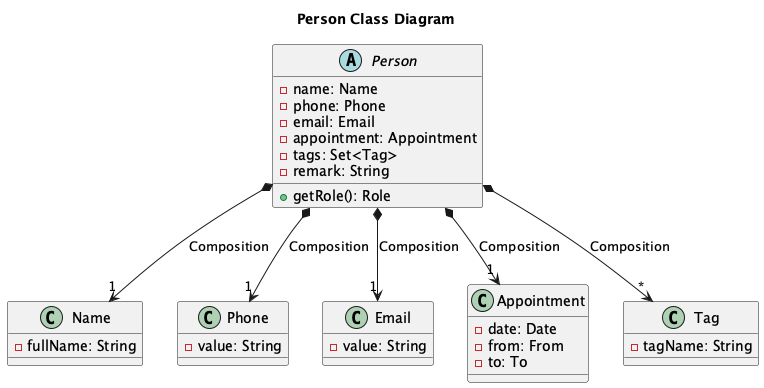
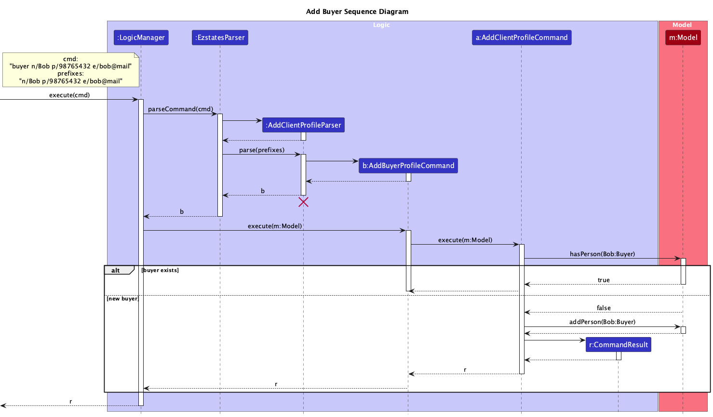

**Team**: F11-04
**Name**: EZSTATES

**User Target Profile**:
This product is for real estate agents who have to manage numerous client information and their relevant property transactions.
It caters to those who need a fast, efficient tool to organize all their client data, track listings, and wish to streamline their workflow through command-line operations.

**Value Proposition**:
EZSTATES provides freelance real estate agents quick access to client details, categorized by their property’s needs and interests through a user-friendly CLI, streamlining operations by enabling swift and intuitive command-line interactions. 
This simplifies their workflow, boosts efficiency, and enhances their client service.

* Table of Contents
{:toc}

## Acknowledgements

This project is adapted from the AddressBook-Level3 project created by the [SE-EDU initiative](https://se-education.org/)

## Getting started

### Setting up

<div class="note" markdown="span"> 
If you would like test our EZSTATES, you can refer to our [quick start](userguide.md#quick-start) in our user guide.
</div>

In order to develop for EZSTATES you can follow the steps we have provided below:

Ensure that the project is set up locally:

1. Create a fork of the GitHub repository
2. Clone the fork

    ```bash
    git clone https://github.com/<your Github username>/tp.git
    ```
3. Change to the fork local directory

    ```bash
    cd tp/
    ```
4. Build the project

    ```bash
    ./gradlew build
    ```
5. Run the project

    ```bash
    ./gradlew run
    ```
   
The Gradle instructions provided are for macOS and Linux users. If you are using Windows, please refer to the [official documentation](https://docs.gradle.org/current/userguide/gradle_wrapper.html#sec:using_wrapper) on using the Gradle Wrapper  (i.e. `./gradlew`) on Windows.

## Development Milestones

### Milestone v1.1
**General Update**
- Add individual photos
- Update AboutUs.md

### Milestone v1.2
**Deciding MVP features**
- Divided features amongst group mates

### Milestone v1.3
**Minimum Viable Product**
- Creating clients
- Deleting clients
- Editing clients
- Creating appointments
- Deleting appointments

### Milestone v1.4
**Alpha Release**
- Create Buyer
- Create seller
- Listings
- Help Bot
- Git Commit script

### Milestone v1.5
**Beta Release**

## Design Overview

<div markdown="span" class="alert alert-primary">

:bulb: **Tip:** The `.puml` files used to create diagrams in this document `docs/diagrams` folder. Refer to the [_PlantUML Tutorial_ at se-edu/guides](https://se-education.org/guides/tutorials/plantUml.html) to learn how to create and edit diagrams.
</div>

### Architecture


The ***Architecture Diagram*** given above explains the high-level design of the App. EZSTATES utilises the existing architecture from
AB3 and adds its own features and components to facilitate client and listing management.

Given below is a quick overview of main components and how they interact with each other.

**Main components of the architecture**

**`Main`** (consisting of classes [`Main`](https://github.com/AY2425S1-CS2103T-F11-4/tp/blob/master/src/main/java/seedu/address/Main.java) and [`MainApp`](https://github.com/AY2425S1-CS2103T-F11-4/tp/blob/master/src/main/java/seedu/address/MainApp.java)) is in charge of the app launch and shut down.
* At app launch, it initializes the other components in the correct sequence, and connects them up with each other.
* At shut down, it shuts down the other components and invokes cleanup methods where necessary.

The bulk of the app's work is done by the following four components:

* [**`UI`**](#ui-component): The UI of the App.
* [**`Logic`**](#logic-component): The command executor.
* [**`Model`**](#model-component): Holds the data of the App in memory.
* [**`Storage`**](#storage-component): Reads data from, and writes data to, the hard disk.

[**`Commons`**](#common-classes) represents a collection of classes used by multiple other components.

<!--[**How the architecture components interact with each other**

The *Sequence Diagram* below shows how the components interact with each other for the scenario where the user issues the command `delete 1`.


Each of the four main components (also shown in the diagram above),

* defines its *API* in an `interface` with the same name as the Component.
* implements its functionality using a concrete `{Component Name}Manager` class (which follows the corresponding API `interface` mentioned in the previous point.)

For example, the `Logic` component defines its API in the `Logic.java` interface and implements its functionality using the `LogicManager.java` class which follows the `Logic` interface. Other components interact with a given component through its interface rather than the concrete class (reason: to prevent outside component's being coupled to the implementation of a component), as illustrated in the (partial) class diagram below.


The sections below give more details of each component.]-->

### UI component

The **API** of this component is specified in [`Ui.java`](https://github.com/AY2425S1-CS2103T-F11-4/tp/blob/master/src/main/java/seedu/address/ui/Ui.java)

The `UI` component uses the JavaFx UI framework. The layout of these UI parts are defined in matching `.fxml` files that are in the `src/main/resources/view` folder. For example, the layout of the [`MainWindow`](https://github.com/se-edu/addressbook-level3/tree/master/src/main/java/seedu/address/ui/MainWindow.java) is specified in [`MainWindow.fxml`](https://github.com/se-edu/addressbook-level3/tree/master/src/main/resources/view/MainWindow.fxml)

The `UI` component,

* executes user commands using the `Logic` component.
* listens for changes to `Model` data so that the UI can be updated with the modified data.
* keeps a reference to the `Logic` component, because the `UI` relies on the `Logic` to execute commands.
* depends on some classes in the `Model` component, as it displays `Person` object residing in the `Model`.

### UI layout

EZSTATES is built for users who prefer using their keyboard. Hence, all commands are accessible through CLI interactions.

When the app is first opened, the user is able to immediately see the `MainWindow`.
EZSTATES displays a default message in the `ResultDisplay` which helps new users navigate
the application.

**PICTURE**

For developers, there are 5 main UI components that are essential in understanding the design and implementation of
EZSTATES, which will be elaborated in the [UI Components](#ui-components) section.

### UI Components

EZSTATES contains 4 main UI components: 
1. MainWindow
    - [MainWindow Design](#mainwindow-design)
    - [MainWindow Implementation](#mainwindow-implementation)
2. HelpWindow 
    - [HelpWindow Design](#helpwindow-design)
    - [HelpWindow Implementation](#helpwindow-implementation)
3. Chat Window
    - [ChatWindow Design](#chatwindow-design)
    - [ChatWindow Implementation](#chatwindow-implementation)
4. MoreInfo Window
    - [MoreInfoWindow Design](#moreinfowindow-design)
    - [MoreInfoWindow Implementation](#moreinfowindow-implementation)
5. Confirmation Dialog
    - [Confirmation Dialog Design](#moreinfowindow-design)
    - [Confirmation Dialog Implementation](#moreinfowindow-implementation)

#### MainWindow Design


`MainWindow` consists of five main components `CommandBox`, `ResultDisplay`, `PersonListPanel`,`ListingListPanel`, `StatusBarFooter`.

The `CommandBox` allows users to enter commands into the application.

The `ResultDisplay` displays the result from entering a command.

The `PersonListPanel` is a scrollable list of clients. This list is updated when a user executes a command that interacts
with his list of `clients` such as `buyer`, `seller`, `deleteclient` and `showclients`. 

The `ListingListPanel` is a scrollable list of listings. This list is updated when a user executes a command that interacts
with his list of `listings` such as `listing`, `deletelisting`, `deletelisting` and `showlistings`.

The `StatusBarFooter` is a pane which contains the `ChatWindow`.

#### MainWindow Implementation

These 5 components form the `MainWindow`: 
1. `CommandBox`: Command input box
2. `ResultDisplay`: Command results box
3. `PersonListPanel`: Person list pane
4. `ListingListPane`: Listing list pane
5. `StatusBarFooter`: Contains the `ChatWindow` button

All these, including the `MainWindow`, inherit from the abstract `UiPart` class which captures the commonalities between classes that represent parts of the visible GUI.

The `UI` components utilise JavaFx to render the components. The layout of these components are defined in their
matching .fxml files in `src/main/resources/view` folder. For example, the layout for `CommandBox` is found in
`CommandBox.fxml`.

This section will go through some additional information about each component in the `MainWindow`.

1. Command Box
- The `CommandBox` is the main method by which the user interacts with EZSTATES.
- The user types inputs into the `CommandBox` and hits `ENTER` to give a command to EZSTATES.
- At any point in time, the user can press the `UP` and `DOWN` arrow keys to navigate the history of past inputs. 

<div class="note" markdown="span"> 
:bulb: The history of past inputs is refreshed every single time EZSTATES is closed and re-opened. 
<br>
Additionally, the history preserves
all inputs given by the user, including duplicate and invalid inputs.
</div>

2. Result Display
- The `ResultDisplay` provides feedback to the user.
- The `ResultDisplay` is scrollable if the output message is too long.

3. PersonListPanel
- The `PersonListPanel` contains the `clients` stored in EZSTATES.
- The information of a relevant `client` is displayed using the `PersonCard` component
- The `PersonListPanel` is a view of `PersonCard` components.
- Commands such as `find` will filter the `PersonListPanel` to show certain `clients` based on a given predicate. Commands
such as `showclients` displays all possible `clients` in the `PersonListPanel`.
A newly added `client` is added to the bottom of the `PersonListPanel`.

> **PersonCard**
> - The `PersonCard` is the component that displays the essential information of a `client`.
> - `Client ID`
  >   - The `Client ID` specifies the `INDEX` value associated with the specific `client`, relative to the position of the `PersonCard` in the `PersonListPanel`.
>   - The user will utilize the `Client ID` as an argument to run certain commands, such as `deleteclient` and `editclient`.
> - `Client Name`
  >   - This box specifies the `name` of the `client`.
> - `Client Phone Number`
  >   - This box specifies the `phone` number of the `client`.
> - `Client Email`
  >   - This box specifies the `email` of the `client`.
> - `Client Appointment`
  >   - This box specifies the `Date` and `Time` of an `Appointment` with the relevant `client`.
> - `Client Tags`
  >   - The green ribbons in the box define a tag for the c


<div class="note" markdown="span"> 
Certain fields that the user can input in EZSTATES are allowed values that can exceed the UI's ability to fully
display them. This design choice can be seen in fields such as the `client name`.
<br>
IMAGE HERE LOLOLOL
<br>
Our team has accounted for this as we do not wish to enforce arbitrary limits on the user. To account for this, we have 
implemented proper UI/UX design to wrap the overflown text. Additionally, the `moreinfo` command allows users to view the 
fully expanded details of their client.
</div>    

4. ListingListPanel
- This component mirrors the design implementation of `PersonListPanel`.
- The `ListingListPanel` contains the `listings` stored in EZSTATES.
- The information of a relevant `listing` is displayed using the `ListingCard` component
- The `ListingListPanel` is a view of `ListingCard` components.
- Commands such as `showlistings` displays all possible `listings` in the `ListingsListPanel`.
- A newly added `listing` is added to the bottom of the `ListingListPanel`.
    
  
  > **ListingCard**
  > 
  >- The `ListingCard` is the component that displays the essential information of a `listing`.
  >- `Listing ID`
  >    - The `Listing ID` specifies the `INDEX` value associated to the specific `listing` relative to the position of
  >      the `ListingCard` in the `ListingListPanel`.
  >    - The user will utilise the `Listing ID` as an argument to run certain commands such as `deletelisting` and `editlisting`.
  >- `Listing Name`
  >    - This box specifies the `name` of the `listing`.
  >- `Listing Price`
  >    - This box specifies the `price` of the `listing`.
  >- `Listing Area`
  >    - This box specifies the `area` of the `listing`.
  >- `Listing Address`
  >    - This box specifies the `address` of the `listing`.
  >- `Listing Seller`
  >    - This box specifies the `seller` of the `listing`.
  >    - There can be only one `seller` for each `listing`.
  >    - Every `listing` must have one `seller`.
  >- `Listing Buyers`
  >    - This box specifies the `buyers` of the `listing`. 
  >    - There can be more than one `buyer` for each `listing`.
  >- `Listing Region`
  >    - This box specifies the `region` of the `listing`.

<div class="note" markdown="span"> 
The `Listing Region` color pattern follows the same colour scheme as the Mass Transportation System (MRT) in
Singapore. 
</div>       

5. Status Bar Footer
- This component is a visual element located at the bottom of the `MainWindow`
- The `StatusBarFooter` contains a button to access the `ChatWindow` via GUi means.

#### HelpWindow Design

The `HelpWindow` can be accessed by pressing the `F1` keyboard shortcut or by utilising the `help` command in the
`CommandBox`.

The window is split into two areas. One area is the link to the EZSTATES user guide. The other area displays a scrollable
view of the common commands in EZSTATES.

**IMAGE**

#### HelpWindow Implementation

The `HelpWindow` is a view that contains the User Guide Link and displays some Common Commands.

1. User Guide Link
- The text on the left of the buttons contains the relevant `HELP_MESSAGE` which is a link to the EZSTATES user guide.
- The first `Button` which writes `Copy URL` copies the URL of the link in the `HELP_MESSAGE` onto the user's clipboard.
- The second `Button` which writes `Open in Browser` opens the link in the `HELP_MESSAGE` in the user's default browser.

2. Common Commands
- This scrollable view below the User Guide Link describes the common commands of EZSTATES in a `TextArea`.

#### ChatWindow Design

The `ChatWindow` is a chatbot that can be opened by entering the `chatbot` command or by pressing the `Chat with us!` button
in the bottom right corner of the application.

Upon accessing this feature, a new window opens with 3 main components:`chatArea`, `userInput` and `Send`.

**IMAGE**

The `chatArea` displays the conversation between the user, identified by the header `You:` at the front of each sentence, and
the chatbot, identified by the `Assistant: ` at the front of each sentence.

The `userInput` is an input field where the user can enter a prompt to the chatbot. The prompt can be sent to the chatbot
either by pressing `ENTER` on the keyboard or by pressing the `Send` button.

The `Send` button sends the prompt written in the `userInput` to the chatbot. The button does not send empty inputs to the 
chatbot.

<div class="note" markdown="span"> 
To facilitate the target audience which prefers CLI-focused interactions, the user can interact with all functions of the 
chatbot using only keyboard inputs. This is achieved in two ways. 
<br>
Firstly, when the `ChatWindow` is opened, the user can immediately start typing in the `userInput` without having to
click on the `inputArea`. This works for subsequent prompts as well. 
<br>
Secondly, the chatbot can be closed by prompting the bot with a `bye` message.
</div>     

#### ChatWindow Implementation

1. `chatArea`
   - Utilises if-else logic and validity checks to determine what response the chatbot
   should reply to a certain prompt. The logic that is reponsible for the chatbot's response is `getResponse()`.
2. `getResponse()`
   - Method in `ChatWindow` that returns a response based on the user's input.
   - The method utilises regular expressions to identify specific keywords and actions within the 
   user's message.
   - For each command, the method provides a usage example and syntax as a response.
   - The full logic can be found [here]().
3. `userInput`
    - A `TextField` that sends the user prompt to the `getResponse()` method.
4. `Send`
    - A button to send the `userInput` through GUI means.

#### MoreInfoWindow Design

The `MoreInfoWindow` provides additional information to the user. The window can be accessed using the `moreinfo` command
and an appropriate `INDEX` argument. The window can be closed by entering the `ESC` button or by closing the window using 
the cursor.

When opened, this window shows the same fields in the `PersonCard` but in greater detail. This is achieved 
by displaying the fields with greater length to provide a complete overview of the `client` details
to the user.

**IMAGE** 

Additionally, there is a `clientRemarksLabel` and `remarkInput` which provides users with another field
to specify characteristics or information about their `client` which can be hidden from the `MainWindow` as this 
remark is only displayed within the `MoreInfoWindow`.

<div class="note" markdown="span"> 
The `clientRemarksLabel` allows a maximum of 400 characters to be entered. This was chosen due to the small space
allocated for the remarks, which is a trade-off made to display other relevant `client` information.
<br>
<br>
Additionally, the `clientRemarksLabel` is saved in EZSTATES when the application is closed and preserved when it is opened.
</div> 

#### MoreInfoWindow Implementation

`MoreInfoWindow` utilises the `MoreInfoController` class to handle the logic and UI rendering of the window.

`MoreInfoWindow` sets up a new `Stage` to display the client details in a separate window, loads the .FXML file and binds
it to the `MoreInfoController`. `MoreInfoWindow` then passes the `client` to the `MoreInfoController`.

`MoreInfoController` handles `client` fields, the `client` picture and the user's `remarkInput`.

#### ConfirmationDialog Design

The `ConfirmationDialog` is a window that opens when the user utilises the `deleteclient` command. 

This window requests the user to make a Yes/No decision to confirm the deletion of the `client`.

The window displays the `name` of the `client` and that the `client` has an active `listing`. A `client` has an active listing
if he/she is a `seller` of a `listing`.

<div markdown="span" class="alert alert-primary">
A `client` without an active listing will not open a `ConfirmationDialog` window upon deletion.
</div>

This window is developed as a fail-safe for users to protect against deletions of `clients` that is a `seller` of a `listing`
since a `listing` cannot exist without its `seller`.

<div class="note" markdown="span"> 
To facilitate the target audience which prefers CLI-focused interactions, the `ConfirmationDialog` window can be interacted with fully
keyboard-only inputs. 
<br>
<br>
In the window, the user can navigate between the Yes/No buttons using the `LEFT ARROW <` and `RIGHT ARROW >` keys. To confirm their
decision, they can do so by pressing `ENTER`. Additionally, they can also exit the window by using the `ESC` key.
</div>

#### ConfirmationDialog Implementation

Similar to the `MoreInfoWindow` implementation, the `ConfirmationDialog` utilises the `ConfirmationDialogController` to handle the logic
and UI rendering of the window.

`ConfirmationDialog` sets up a new `Stage` to display the delete confirmation in a separate window, loads the .FXML file and binds
it to the `ConfirmationDialogController`. `Window` then passes the `client` to the `MoreInfoController`.

`MoreInfoController` handles the logic for which button has been pressed by the user and displays the `client` name in the window.

<div class="note" markdown="span"> 
Why is it beneficial to create a Controller class?
<br>
<br>
This approach keeps the code modular and organized through the **Separation of Concerns** design principle. 
<br>
<br>
The `Window` class handles the window setup and layout loading exclusively while the `Controller` class manages all
UI interactions and dynamically updates the UI utilising `set` methods. By dividing responsibilities between classes, this
simplifies code, improves maintainability and enhances reusability.
</div>

### Logic component

**API** : [`Logic.java`](https://github.com/AY2425S1-CS2103T-F11-4/tp/blob/master/src/main/java/seedu/address/logic/Logic.java)

Here's a (partial) class diagram of the `Logic` component:


The sequence diagram below illustrates the interactions within the `Logic` component, taking `execute("deleteclient 1")` API call as an example.


<div markdown="span" class="alert alert-info">:information_source: **Note:** The lifeline for `DeleteCommandParser` should end at the destroy marker (X) but due to a limitation of PlantUML, the lifeline continues till the end of diagram.
</div>

How the `Logic` component works:

1. When `Logic` is called upon to execute a command, it is passed to an `EzstatesParser` object which in turn 
creates a parser that matches the command (e.g., `DeleteClientProfileCommandParser`) and uses it to parse the command.
2. This results in a `Command` object (more precisely, an object of one of its subclasses e.g., `DeleteClientProfileCommand`) which is executed by the `LogicManager`.
3. The command can communicate with the `Model` when it is executed (e.g. to delete a person).<br>
   Note that although this is shown as a single step in the diagram above (for simplicity), in the code it can take several interactions (between the command object and the `Model`) to achieve.
4. The result of the command execution is encapsulated as a `CommandResult` object which is returned back from `Logic`.

Here are the other classes in `Logic` (omitted from the class diagram above) that are used for parsing a user command:


How the parsing works:
* When called upon to parse a user command, the `EzstatesParser` class creates an `XYZCommandParser` (`XYZ` is a placeholder for the specific command name e.g., `AddListingCommandParser`) which uses the other classes shown above to parse the user command and create a `XYZCommand` object (e.g., `ListingCommand`) which the `AddressBookParser` returns back as a `Command` object.
* All `XYZCommandParser` classes (e.g., `AddCommandParser`, `DeleteCommandParser`, ...) inherit from the `Parser` interface so that they can be treated similarly where possible e.g, during testing.

### Model component
**API** : [`Model.java`](https://github.com/AY2425S1-CS2103T-F11-4/tp/blob/master/src/main/java/seedu/address/model/Model.java)


The `Model` component,

* stores the EZSTATES data i.e., all `Person` objects (which are contained in a `UniquePersonList` object) and all `Listing` objects (which are contained in a `UniqueListingList` object).
* stores the currently 'selected' `Person` objects (e.g., results of a search query) as a separate _filtered_ list which is exposed to outsiders as an unmodifiable `ObservableList<Person>` that can be 'observed' e.g. the UI can be bound to this list so that the UI automatically updates when the data in the list change.
* stores a `UserPref` object that represents the user’s preferences. This is exposed to the outside as a `ReadOnlyUserPref` objects.
* does not depend on any of the other three components (as the `Model` represents data entities of the domain, they should make sense on their own without depending on other components)

<div markdown="span" class="alert alert-info">:information_source: **Note:** An alternative (arguably, a more OOP) model is given below. It has a `Tag` list in the `AddressBook`, which `Person` references. This allows `AddressBook` to only require one `Tag` object per unique tag, instead of each `Person` needing their own `Tag` objects.<br>


</div>

### Storage component

**API** : [`Storage.java`](https://github.com/AY2425S1-CS2103T-F11-4/tp/blob/master/src/main/java/seedu/address/storage/Storage.java)


The `Storage` component,
* can save both address book data and user preference data in JSON format, and read them back into corresponding objects.
* inherits from both `AddressBookStorage` and `UserPrefStorage`, which means it can be treated as either one (if only the functionality of only one is needed).
* depends on some classes in the `Model` component (because the `Storage` component's job is to save/retrieve objects that belong to the `Model`)

### Common classes

Classes used by multiple components are in the `seedu.address.commons` package.

## Continuous Integration (CI)

Continuous Integration in this project is done through 4 means: 
1. Unit testing
2. Automated UI testing
3. Automated Github testing
4. Code coverage reports

<div class="note" markdown="span"> 
EZSTATES utilises **Github Actions** for the project's Continuous Integration and Continuous Deployment (CI/CD) workflow, 
automating tasks such as testing, building and deployment with each code update on Github.
<br><br> 
Github Actions utilises `.yaml` configuration files and can be found in the `.github/workflows` folder.
<br><br>
Github Actions operate in this manner: 
<br>

1. Trigger: Github Actions workflows are triggered but events such as `push` and `pull_request`.<br>
2. Jobs and Runners: A workflow consists of one or more jobs, each containing a series of steps.
Each job runs on a Github-hosted runner (a virtual machine or environment) to perform the defined tasks.<br>
3. Steps: Within each job, steps are defined to execute certain tasks, such as installing dependencies, running tests, or 
building the application.<br>
4. Feedback: After a workflow completes, Github Actions provide feedback on the success or failure of each job.
Developers receive notifications for failed workflows, allowing them to quickly address issues before merging or deploying code.<br>
5. Deployment: Once a workflow has succeeded, Github Actions can deploy the application, ensuring that only thoroughly tested
code reaches users.

By utilising Github Actions, EZSTATES maintains high code quality and reliability, facilitating efficient collaboration
and timely deployment of updates.
</div>

### Unit testing
Unit testing covers non-UI related components of EZSTATES, such as `model`, `storage`, `logic` and `utility` classes.

The dependencies used for Unit Testing is [JUnit 5]().

### Automated UI testing
Automated UI testing helps to simulate user interactions, ensuring that the UI is working as intended.

The dependencies used for automated UI testing is [JUnit 5]() and [TestFX]().

### Automated Github testing

Automated Github testing is trigged or every push and pull request made to the Github remote repository and is conducted
on all 3 major OSes: MacOS, Windows and Ubuntu. 

<div markdown="span" class="alert alert-info">:information_source: 
**Note:** Automated UI testing is disabled for Ubunutu on the Github Testing workflow due to the inability to create a virtual testin
environment.
</div>

### Code coverage reports

Code coverage reports are provided to developers in two methods: JaCoCoTest reports and CodeCov reports.

JaCoCoTest reports are generated using `build.gradle` and CodeCov reports are generated on every Github Workflow.

As of v1.5.2 release, the test coverage for EZSTATES is [95%]().

Usage: 
1. JaCoCoTest reports
- Configuration: The JaCoCo plugin is configured in `build.gradle`.
- Running reports: To generate a JaCoCo report, run either of these commands in your terminal:
<br>
    ```.gradlew/ jacocoTestReport``` to run all unit tests and automated UI tests
    <br>**OR**<br>
    ```.graldew/ build ``` which runs all tests, incuding unit tests, autoamted UI tests and checkstyle tests.
- Usage: JaCoCo reports offer a local overview of which classes and methods are covered. Developers are encouraged to review these reports after each
set of tests, especially before merging any significant changes. The HTML report highlights area needing additional tests.

2. CodeCov reports
- Configuration: To configure CodeCov, a `.yaml` workflow file is set up within the `.github/workflows` directory of the repository.
- Running reports: CodeCov reports are automatically generated and uploaded with each push or pull_request event as configured in the GitHub Actions workflow. 
After each run, the workflow will produce a detailed reporton CodeCov, accessible through links provided in the Github pull request page.
- Usage: CodeCov reports provide information on whether coverage has improved or decreased and highlight specific lines or files affected by new or modified code.
Additionally, CodeCov offers visualization tools for in-depth inspection of coverage across functions and classes, allowing developers to target untested areas in their testing efforts.
<br><br>
<div class="note" markdown="span"> 
A CodeCov token is required to set up CodeCov reports on Github and it should be stored as a Github Secret
for authentication. 
</div>
## Features and Implementation

### Client Management



All clients are `Persons` in EZSTATES. A `Person` is an abstract class which consists of 6 essential fields and 1
essential abstract method `getRole()`.

**Role**
- The `Role` class specifies what responsibilites a client has.
- The class is designed using Enumerations.
- As of v1.5.2, EZSTATES supports 2 `Roles`: `BUYER` and `SELLER`.

**Essential Fields**: 
1. `name`: The name of a Person, defined by the `Name` class.
2. `phone`: The phone number of a Person, defined by the `Phone` class.
3. `email`: The email address of a Person, defined by the `Email` class.
4. `appointment`: An expected appointment the user has with a Person, defined by the `Appointment` class.
5. `tags`: A collection of short comments or descriptions of a Person, defined by a set of `Tags`.
6. `remark`: A string which represents an additional remark about a Person. This field is used in the `MoreInfo` feature.

**Essential Methods**:
1. `getRole()`: Classes that represent clients must inherit the abstract `Person` class and are required to implement the `getRole()` method. 
This ensures that all clients have a specified `role`. `Roles` help developers differentiate various tasks and associations
with features such as `listings` and `getRole()` is a basic getter to facilitate this logic.

#### Add client

As mentioned in the [`Logic`](#logic-component) segment, a command is passed to the `LogicManager` and then parsed in the
`EzstatesParser` where the relevant `XYZCommandParser` is created and subsequently the `XYZCommand` is created. To facilitate
the usage of `roles`, a centralized `AddClientProfileParser` and `AddClientProfileCommand` is used when a client with any role is being
created.

1. #### Add buyer
    **Overview**
    <br><br>
    
    The `buyer` command adds a `Buyer` to EZSTATES. `Buyer` inherits the `Person` class and is associated with a 
    `BUYER` role.
    <br><br>
    **Implementation**
   
   <br>
   <br>
   
   1. User runs a `buyer` command with valid inputs.  
   2. Command is parsed by `EzstatesParser` and a `AddClientProfileParser` is created to parse the `buyer` command which creates a 
   `AddBuyerProfileCommand` that implicitly creates `AddClientProfileCommand`. 
   3. `AddClientProfileCommand` handles the logic to detect duplicate `Buyer`. A `buyer` is added to the `Model` if it is a new `buyer`, else a 
   `CommandException` is thrown.
   4. Finally, `AddClientProfileCommand` returns a `CommandResult`, which encapsulates a response to the user's input.

   2. #### Add seller
      **Overview**
      <br>
       The `seller` command adds a `Seller` to EZSTATES. `Seller` inherits the `Person` class and is associated with a 
       `SELLER` role.
       <br><br>
      **Implementation**
       <br>
       The execution of `seller` command mirrors the execution of the `buyer` command.
      1. User runs a `seller` command with valid inputs.
      2. Command is parsed by `EzstatesParser` and a `AddClientProfileParser` is created to parse the `buyer` command which creates a
      `AddSellerProfileCommand` that implicitly creates `AddSellerProfileCommand`.
      3. `AddClientProfileCommand` handles the logic to detect duplicate `Seller`. A `seller` is added to the `Model` if it is a new `seller`, else a
         `CommandException` is thrown.
      4. Finally, `AddClientProfileCommand` returns a `CommandResult` with a corresponding success message.

#### Edit client

**Overview**
The `editclient` command edits a `client`. 

**Implementation**


1. User runs a `editclient` command with valid `INDEX` and valid prefixes.
2. Command is parsed by `EzstatesParser` and a `EditClientCommandParser` is created to parse the `editclient` command which 
creates `EditClientCommand`.
3. `EditClientCommand` retrives the list of `Persons` from `Model` and attempts to set a new `Person` using
`setPerson()`.
4. `setPerson()` creates a new edited `Person` with the edited fields. If this new `Person` already exists, a `CommandException`
is thrown, else it the original `Person` is removed from the `Model` and the new one is added.
5. Finally, `EditClientCommand` returns a `CommandResult` with a corresponding successs message.

<div class="note" markdown="span"> 

Why create a new `Person` instead of editing the original `Person`? 

All objects including `Person` objects in EZSTATES are desgined to be **immutable**. 

When objects are **immutable**, modifying one instance does not risk unintentionally 
altering other references to that instance elsewhere in the program. 
This behavior prevents side effects, especially when other components hold references to `Person` objects,
as modifying shared instances can lead to unexpected and hard-to-track bugs.
This also ensures that intended side effects are accounted for, such as editing a client who is associated to 
a listing.
</div>

#### Find client

**Overview**
<br>
The `find` command finds and lists all `Persons` whose name contains any of the input keywords.

**Implementation**


1. User runs a `find` command with keywords.
2. Command is parsed by `EzstatesParser` and a `FindClientCommandParser` is created to parse the keywords which creates
`FindClientCommand` and a `NameContainsKeyWordsPredicate`, that contains a list of the user's keywords.
3. `FindClientCommand` updates the `Model` with the given predicate to filter the list of `Persons` that contain any of the keywords.
4. Finally, `FindClientCommand` returns a `CommandResult` with a corresponding success message.

#### Delete client
**Overview**
<br>
The `deleteclient` command deletes a `Person` according to the `INDEX` that is on the `PersonListPanel`.

**Implementation**


1. User runs a `deleteclient` command with an `INDEX` as argument.
2. Command is parsed by `EzstatesParser` and a `DeleteClientCommandParser` is created to parse the argument which creates
a `DeleteClientCommand`.
3. `DeleteClientCommand` retrieves the list of `Persons` from `Model` and checks if the specified `Person` 
exists and then deletes the `Person` once the user confirms his deletion.
4. Finally, `DeleteClientCommand` returns a `CommandResult` with a corresponding success message.

#### Show client
**Overview**
<br>
The `showclient` command displays all clients in EZSTATES to the user.

**Implementation**


1. User runs a `showclient` command.
2. Command is parsed by `EzstatesParser`, which creates a `ShowClientCommand`, skipping the creation of a specific `Parser` instance.
3. `ShowClientCommand` retrieves the list of `Persons` from the `Model` with `PREDIATE_SHOW_ALL_PERSONS` such that the `Model` returns
all `Persons`.
4. If there are no `Persons` in the list, a `CommandException` is thrown, else a `CommandResult` is returned with a 
corresponding success message.

#### Clear 
**Overview**
<br>
The `clear` command clears all `Persons` and `Listings` from EZSTATES.

**Implementation**


1. User runs a `clear` command.
2. Command is parsed by `EzstatesParser`, which creates a `CLearCommand`, skipping the creation of a specific `Parser` instance.
3. `ClearCommand` always sets the `Model's` storage to a new `AddressBook` which stores `Persons` and a new `Listings` which stores `Listings`.
4. A `CommandResult` is returned with a corresponding success message.

### Appointment Management
<br>


The `Appointment` class represents an appointment in the address book. 

`Appointment` comprises of one `Date`, `From` and `To` each. Each of these classes represent the date of an appointment, the start time
of an appointment and the end time of an appointment respectively. 

#### Add appointment
**Overview**

An `Appointment` can be added to a `Person` using the `apt` command.

**Implementation**


1. User runs a `apt` command with a valid index.
2. Command is parsed by `EzstatesParser` which creates a `AddAppointmentCommandParser` that parses the user's arguments. 
Parsing a valid input creates `AddAppointmentCommand` with the relevant arguments.
3. The `AddAppointmentCommand` retrieves the relevant `Person` from the `Model` and creates a new `Person` with the user's `Appointment`.
4. The original `Person` is removed and the new `Person` is added in its place.
4. Finally, `AddAppointmentCommand` returns a `CommandResult` with the corresponding success message.

<div class="note" markdown="span"> 

What is the point of the static EMPTY fields in `Appointment`, `Date`, `From` and `To`? 

Every `Person` is created without an `Appointment`. 

The static EMPTY fields, such as `EMPTY_APPOINTMENT` in `Appointment`, follow the **Singleton pattern** 
to represent a `null` or empty state, providing a single, globally accessible instance for cases where an `Appointment` is absent.
</div>

#### Delete appointment
**Overview**
<br>
The `deleteapt` command deletes an `Appointment` from a `Person`.

**Implementation**


1. User runs a `deleteapt` command with an `INDEX` as argument.
2. Command is parsed by `EzstatesParser` and a `DeleteAppointmentCommandParser` is created to parse the argument which creates
   a `DeleteAppointmentCommand`.
3. `DeleteAppointmentCommand` retrieves the list of `Persons` from `Model` and checks if the specified `Person` exists and creates a
new `Person` with the `EMPTY_APPOINTMENT` singleton.
4. The original `Person` is deleted and new `Person` is added to the list of `Persons`.
5. Finally, `DeleteAppointmentCommand` returns a `CommandResult` with a corresponding success message.

#### Today
**Overview**
<br>
The `today` command lists all the `Appointments` that the user has made today.
Today is defined as the current time on the user's operating system.

**Implementation**


1. User runs a `today` command.
2. Command is parsed by `EzstatesParser`, which creates a `TodayCommand`, skipping the creation of a specific `Parser` instance.
3. `TodayCommand` retrieves the list of `Persons` from the `Model` with a `HasAppointmentTodayPredicate` which returns a list of `Persons`
with appointments scheduled for today.
4. If there are no `Persons` in this list, a `CommandException` is thrown, else a `CommandResult` is returned with a
   corresponding success message.

### Listing Management


A `Listing` contains the necessary information of a property made by a `Seller`. 

A `Listing` contains the mandatory fields: 
1. `name`: The name of a `listing`, defined by the `Name` class.
2. `price`: The price of a `listing`, defined by the `Price` class.
3. `area`: The area of the property in the `listing` , defined by the `Area` class.
4. `region`: The `region` of the property in the `listing`, defined by the `Region` enumerations.
5. `address`: The `address` of the property in the `listing`, definted by the `Address` class.
6. `seller`: The `seller` of the property in the `listing`.

A `listing` can also contain `buyers`, but can have any non-negative amount of `buyers`.

#### Add listing
**Overview**
<br>
The `listing` command adds a `listing` to EZSTATES.

**Implementation**


#### Edit listing
**Overview**
<br>
The `editlisting` edits a `listing`.

**Implementation**

#### Add buyers to listing
**Overview**
<br>
The `addlistingbuyers` command adds buyers to a `listing`.

**Implementation**

#### Remove buyers from listing
**Overview**
<br>
The `removelistingbuyers` command adds buyers to a `listing`.

**Implementation**

#### Delete listing
**Overview**
<br>
The `deletelistings` command deletes a `listing`.

**Implementation**

#### Show listing
**Overview**
<br>
The `showlistings` command shows all `listings`.

**Implementation**

#### Clear listing
**Overview**
<br>
The `clearlisting` clears all `listings`.

**Implementation**

### Utility

#### Chat Window
**Overview**
<br>
The `editclient` edits a `client`.

**Implementation**
#### Help
**Overview**
<br>
The `editclient` edits a `client`.

**Implementation**
#### Exit
**Overview**
<br>
The `editclient` edits a `client`.

**Implementation**

## Git Commit Script

This section describes some noteworthy details on how certain features are implemented.

## Documentation, logging, testing, configuration, dev-ops

* [Documentation guide](Documentation.md)
* [Testing guide](Testing.md)
* [Logging guide](Logging.md)
* [Configuration guide](Configuration.md)
* [DevOps guide](DevOps.md)

## Appendix

## Appendix: Requirements

### Product scope

**Target user profile**:

* free-lance real estate agents
* has to manage a large number of clients with varying details
* has to make multiple appointments with various clients
* has to manage multiple listings
* can type fast
* prefers typing to mouse interactions
* is reasonably comfortable using CLI apps

**Value proposition**: manage client contacts faster than a typical mouse/GUI driven app


### User stories

Priorities: High (must have) - `* * *`, Medium (nice to have) - `* *`, Low (unlikely to have) - `*`

| Priority  | As a …​                     | I want to …​                                                       | So that I can…​                                         |
|-----------|-----------------------------|--------------------------------------------------------------------|---------------------------------------------------------|
| `* * *`   | tech-savvy property agent   | have a place to store my client details                            | manage my large number of client details                |
| `* * *`   | tech-savvy property agent   | create a new client profile                                        | store new clients                                       |
| `* * *`   | tech-savvy property agent   | delete a client profile                                            | remove clients I no longer serve                        |
| `* * *`   | tech-savvy property agent   | search for a client by name                                        | quickly access the profile of the client of interest    |
| `* * *`   | tech-savvy property agent   | be able to add my client's phone number and email to their profile | know how to contact him/her                             |
| `* * *`   | tech-savvy property agent   | create appointments with my clients                                | manage my appointments with my clients                  |
| `* * *`   | tech-savvy property agent   | delete appointments                                                | remove appointments I have already cleared              |
| `* *`     | tech-savvy property agent   | assign a status to a client                                        | easily categorise clients by priority                   |
| `* *`     | tech-savvy property agent   | search by appointments                                             | pinpoint which client I am serving for that appointment |
| `* *`     | tech-savvy property agent   | be able to keep track of all my appointments                       | plan out my schedule efficiently                        |
| `* *`     | tech-savvy property agent   | be able to know what appointments I have for the day               | make immediate changes to my schedule                   |


*{More to be added}*

### Use cases

(For all use cases below, the **System** is `EZSTATES` and the **Actor** is the `User`, unless specified otherwise)


#### Use Case: Add Buyer

**MSS**:
1. User chooses to add a new buyer.
2. System requests buyer details (name, contact info, property interest, etc.).
3. User enters the required information.
4. System confirms the details and creates the profile.
5. System displays a success message.
    - Use case ends.

**Extensions**:
- **3a.** System detects missing or incorrect data:
    - **3a1.** System displays am error and requests valid inputs.
    - **3a2.** User enters the correct data.
    - Steps 3a1–3a2 are repeated until all data is valid.
    - Use case resumes from step 4.


#### Use Case: Add Seller

**MSS**:
1. User chooses to add a new seller profile.
2. System requests seller details (name, contact info, property interest, etc.).
3. User enters the required information.
4. System confirms the details and creates the profile.
5. System displays a success message.
    - Use case ends.

**Extensions**:
- **3a.** System detects missing or incorrect data:
    - **3a1.** System displays am error and requests valid inputs.
    - **3a2.** User enters the correct data.
    - Steps 3a1–3a2 are repeated until all data is valid.
    - Use case resumes from step 4.


#### Use Case: Edit Client Profile

**MSS**:
1. User selects an existing client profile to edit.
2. System displays the client’s current information.
3. User updates the desired fields.
4. System confirms the changes and updates the profile.
5. System displays a success message.
    - Use case ends.

**Extensions**:
- **3a.** User tries to edit a field with invalid data:
    - **3a1.** System displays an error and requests valid data.
    - **3a2.** User corrects the data.
    - Steps 3a1–3a2 repeat until all data is valid.
    - Use case resumes from step 4.


#### Use Case: Delete Client Profile

**MSS**:
1. User chooses to delete a client profile.
2. System asks for confirmation.
3. User confirms the deletion.
4. System removes the client profile from the database.
5. System displays a success message.
    - Use case ends.

**Extensions**:
- **2a.** User cancels the deletion:
    - **2a1.** System aborts the deletion process.
    - Use case ends.


#### Use Case: Add Appointment

**MSS**:
1. User chooses to schedule an appointment for a client.
2. System requests appointment details (date, time, location).
3. User enters the requested details.
4. System confirms the details and saves the appointment.
5. System displays a success message.
    - Use case ends.

**Extensions**:
- **3a.** System detects a scheduling conflict:
    - **3a1.** System notifies the user of the conflict.
    - **3a2.** User chooses a new date/time.
    - Use case resumes from step 3.


#### Use Case: Delete Appointment

**MSS**:
1. User selects an appointment to delete.
2. System requests confirmation.
3. User confirms deletion.
4. System removes the appointment from the schedule.
5. System displays a success message.
    - Use case ends.

**Extensions**:
- **2a.** User cancels the deletion:
    - **2a1.** System stops the deletion process.
    - Use case ends.


#### Use Case: List Clients

**MSS**:
1. User chooses to view a list of all clients.
2. System retrieves and displays the client list.
    - Use case ends.


#### Use Case: Find Client by Name

**MSS**:
1. User chooses to search for a client by name.
2. System requests the client’s name.
3. User enters the name.
4. System retrieves and displays matching client profiles.
    - Use case ends.

**Extensions**:
- **4a.** System finds no clients matching the entered name:
    - **4a1.** System displays a “No clients found” message.
    - Use case ends.


#### Use Case: List Appointments

**MSS**:
1. User chooses to view all appointments.
2. System retrieves and displays the list of appointments.
    - Use case ends.


#### Use Case: Add Listing

**MSS**:
1. User chooses to add a new property listing.
2. System requests details for the listing (name, price, area, address, region, etc.).
3. User enters the required information.
4. System confirms the details and creates the listing.
5. System displays a success message.
    - Use case ends.

**Extensions**:
- **3a.** System detects missing or incorrect data:
    - **3a1.** System prompts for the correct information.
    - **3a2.** User enters the correct data.
    - Steps 3a1–3a2 repeat until all data is valid.
    - Use case resumes from step 4.


#### Use Case: Show Listings

**MSS**:
1. User chooses to view all available listings.
2. System retrieves and displays the list of property listings.
    - Use case ends.


#### Use Case: Find Listings

**MSS**:
1. User chooses to search for listings by keyword.
2. System requests keywords for the search.
3. User enters the keyword(s).
4. System retrieves and displays matching listings.
    - Use case ends.

**Extensions**:
- **4a.** System finds no listings matching the entered keywords:
    - **4a1.** System displays a “No listings found” message.
    - Use case ends.


#### Use Case: Edit Listing

**MSS**:
1. User selects an existing listing to edit.
2. System displays the listing’s current details.
3. User updates the desired fields.
4. System confirms the changes and updates the listing.
5. System displays a success message.
    - Use case ends.

**Extensions**:
- **3a.** User tries to edit a field with invalid data:
    - **3a1.** System displays an error and requests valid data.
    - **3a2.** User corrects the data.
    - Steps 3a1–3a2 repeat until all data is valid.
    - Use case resumes from step 4.


#### Use Case: Add Buyers to Listing

**MSS**:
1. User chooses to add buyer(s) to an existing listing.
2. System requests the buyer index for the listing.
3. User enters the buyer index.
4. System adds the buyer(s) to the listing.
5. System displays a success message.
    - Use case ends.

**Extensions**:
- **3a.** System detects invalid buyer index:
    - **3a1.** System prompts for a valid index.
    - **3a2.** User enters a valid index.
    - Use case resumes from step 4.


#### Use Case: Remove Buyers from Listing

**MSS**:
1. User chooses to remove buyer(s) from a listing.
2. System requests the buyer index for the listing.
3. User enters the buyer index.
4. System removes the buyer(s) from the listing.
5. System displays a success message.
    - Use case ends.

**Extensions**:
- **3a.** System detects invalid buyer index:
    - **3a1.** System prompts for a valid index.
    - **3a2.** User enters a valid index.
    - Use case resumes from step 4.


#### Use Case: Delete Listing

**MSS**:
1. User selects a listing to delete.
2. System requests confirmation.
3. User confirms deletion.
4. System removes the listing.
5. System displays a success message.
    - Use case ends.

**Extensions**:
- **2a.** User cancels the deletion:
    - **2a1.** System stops the deletion process.
    - Use case ends.


#### Use Case: Clear Listings

**MSS**:
1. User chooses to clear all listings.
2. System requests confirmation.
3. User confirms the action.
4. System clears all listings from the system.
5. System displays a success message.
    - Use case ends.


#### Use Case: More Info

**MSS**:
1. User requests more information on a specific listing.
2. System requests the listing index.
3. User enters the index of the listing.
4. System displays detailed information for the listing.
    - Use case ends.


#### Use Case: Chat Window

**MSS**:
1. User chooses to open the chat window.
2. System displays the chat interface.
3. User can interact with the chatbot for assistance with commands and inquiries.
    - Use case ends.


#### Use Case: Help

**MSS**:
1. User requests help.
2. System displays general instructions for using the application.
    - Use case ends.


#### Use Case: Exit Application

**MSS**:
1. User chooses to exit the application.
2. System prompts for confirmation.
3. User confirms the exit.
4. System closes the application.
    - Use case ends.

**Extensions**:
- **2a.** User cancels the exit:
    - **2a1.** System returns to the previous screen.
    - Use case ends.

### Non-Functional Requirements

1.  Should work on any _mainstream OS_ as long as it has Java `17` or above installed.
2.  Should be able to hold up to 1000 persons without a noticeable sluggishness in performance for typical usage.
3.  A user with above average typing speed for regular English text (i.e. not code, not system admin commands) should be able to accomplish most of the tasks faster using commands than using the mouse.
4.  The app should be intuitive and require no more than three user actions to perform any major task.
5.  The codebase should adhere to clear coding principles to allow easy updates and bug fixes.
6.  The application achieves at least 85% test coverage.
7.  The user should not require an internet connection to use the application.
8.  The user should not experience sluggish operations when using the application.
9.  The user guide should be well-documentated and user-friendly such that a new user can use the application efficiently.

*{More to be added}*

### Appendix: Instructions for manual testing

Given below are instructions to test the app manually.

<div markdown="span" class="alert alert-info">:information_source: **Note:** These instructions only provide a starting point for testers to work on;
testers are expected to do more *exploratory* testing.

</div>

### Launch

1. Initial launch

   1. Download the `.jar` file and copy into an empty folder

   1. Double-click the jar file Expected: Shows the GUI with a set of sample clients. The window size may not be optimum.

1. Saving window preferences

   1. Resize the window to an optimum size. Move the window to a different location. Close the window.

   1. Re-launch the app by double-clicking the jar file.<br>
       Expected: The most recent window size and location is retained.

### Command Summary


1. **Adding a Buyer Profile**  
   **Use**: `buyer n/John Doe p/91234567 e/johndoe@example.com`  
   **Expected output**: Buyer profile is added, and a success message is displayed.


2. **Adding a Seller Profile**  
   **Use**: `seller n/Jane Smith p/98765432 e/janesmith@example.com a/456 Oak Ave`  
   **Expected output**: Seller profile is added, and a success message is displayed.


3. **Editing a Client Profile**  
   **Use**: `editclient 1 n/Jane Doe p/98765432`  
   **Expected output**: Client profile is edited, and a success message is displayed.


4. **Deleting a Client Profile**  
   **Use**: `deleteclient 1`  
   **Expected output**: Client profile is deleted, and a success message is displayed.


5. **Adding a Listing**  
   **Use**: `listing n/Greenwood House pr/500000 ar/1200 add/456 Elm St reg/central sel/3 buy/2`  
   **Expected output**: Listing is added, and a success message is displayed.


6. **Editing a Listing**  
   **Use**: `d`  
   **Expected output**: Listing is edited, and a success message is displayed.


7. **Deleting a Listing**  
   **Use**: `deletelisting 1`  
   **Expected output**: Listing is deleted, and a success message is displayed.


8. **Adding Buyers to Listing**  
   **Use**: `addlistingbuyers 1 buy/2 buy/3`  
   **Expected output**: Buyers are added to the listing, and a success message is displayed.


9. **Removing Buyers from Listing**  
   **Use**: `removelistingbuyers 1 buy/2`  
   **Expected output**: Buyers are removed from the listing, and a success message is displayed.


10. **Listing All Clients**  
    **Use**: `showclients`  
    **Expected output**: All clients are displayed.


11. **Listing All Listings**  
    **Use**: `showlistings`  
    **Expected output**: All listings are displayed.


12. **Finding Clients by Name**  
    **Use**: `find David`  
    **Expected output**: All clients matching the specified name are displayed.


13. **Finding Listings by Keyword**  
    **Use**: `findlisting Greenwood`  
    **Expected output**: All listings matching the specified keyword are displayed.


14. **Getting More Information on a Listing**  
    **Use**: `moreinfo 1`  
    **Expected output**: Detailed information about the listing is displayed.


15. **Clearing All Listings**  
    **Use**: `clearlistings`  
    **Expected output**: All listings are cleared, and a success message is displayed.


16. **Clearing All Data**  
    **Use**: `clear`  
    **Expected output**: All data (clients, listings, etc.) is cleared, and a success message is displayed.


17. **Help**  
    **Use**: `help`  
    **Expected output**: General instructions for using the application are displayed.


18. **Opening the Chat Window**  
    **Use**: `chatbot`  
    **Expected output**: The chat window is opened, allowing interaction with the chatbot.


19. **Exiting the Application**  
    **Use**: `exit`  
    **Expected output**: The application is closed.


### Saving data

1. Dealing with missing/corrupted data files

   1. _{explain how to simulate a missing/corrupted file, and the expected behavior}_

### Future Enhancements

1. **Customizable Command Aliases**: Allow users to define their own aliases for commands, making it easier to personalize the command-line experience and speed up common tasks.

2. **AI-Driven Insights**: Introduce AI-driven analytics accessible through CLI commands to help agents identify property trends, set optimal pricing, and predict client needs. This would turn EZSTATES into a strategic assistant, offering data insights directly within the app.

3. **Command Auto-Completion**: Add an auto-completion feature that suggests commands and arguments as users type, reducing typing time and minimizing errors.

4. **Automated Follow-Up Reminders**: Implement a feature to set reminders for client follow-ups. Agents could schedule reminders directly within the CLI to stay on top of leads without needing separate reminders.

5. **Dual Role for Clients**: Allow a client to be designated as both a buyer and a seller. This would enable agents to manage clients with multiple roles within a single profile, simplifying interactions and reducing redundancy.

6. **Calendar Integration**: Provide a command to sync appointments with external calendar apps (e.g., Google Calendar), so agents can manage schedules within EZSTATES while keeping appointments visible across platforms.

7. **In-App Reporting Tools**: Develop simple CLI commands to generate reports on client activities, property listings, and market insights. Reports would be displayed within the CLI, offering agents a quick overview of key metrics without leaving the app.


### Appendix: Known Bugs

1. **When using multiple screens**, if you move the application to a secondary screen, and later switch to using only the primary screen, the GUI will open off-screen. The remedy is to delete the `preferences.json` file created by the application before running the application again.

2. **If you minimize the Help Window** and then run the `help` command (or use the Help menu, or the keyboard shortcut `F1`) again, the original Help Window will remain minimized, and no new Help Window will appear. The remedy is to manually restore the minimized Help Window.

3. **For the n/ prefix**, users are not able to put slashes in their names (e.g., Kumar S/O Navareen). A temporary workaround is to input `son of` or `so` or `s o` until this issue has been rectified.

4. **For the add/ prefix**, addresses are case-sensitive. As a result, `add/123 Clementi Ave` and `add/123 clementi ave` will be treated as distinct addresses, which may lead to unintentional duplicates.

5. **For the Edit Listing command**, users can modify listings to assign a buyer as the seller of a listing.

6. **For the Add Buyers to Listing command**, the Result Display displays an incorrect error message.

7. **For the MoreInfo command**, the `Output` for User Error #2 has a missing `parameters` line where the CLIENT_INDEX should be. Refer to the Special Comments section under More Info for more clarification.

8. **For the Chatbot**, the text input field appears in black, which does not contrast well with its gray background.
