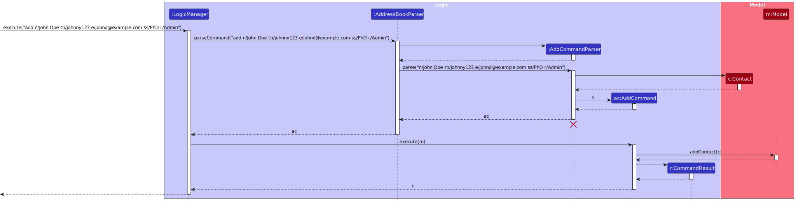
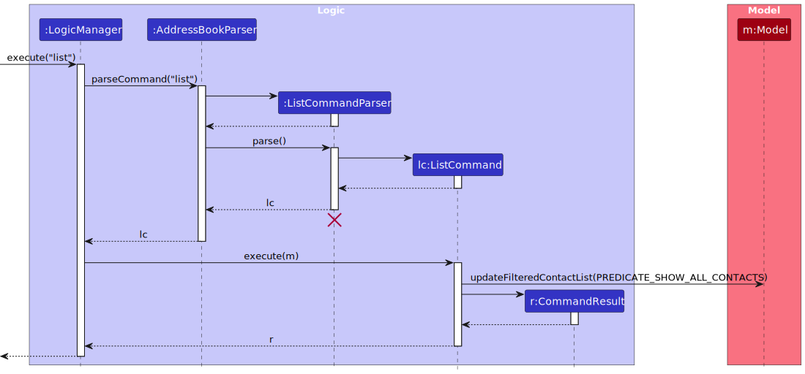
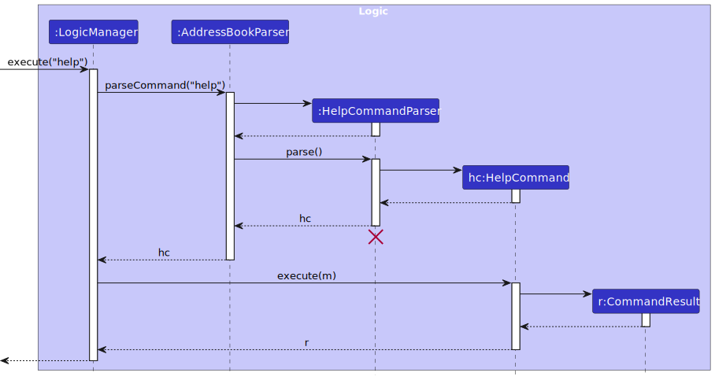

# data_coNdUctorS Developer Guide

## Table of Contents
- [Acknowledgements](#acknowledgements)
- [Setting up, getting started](#setting-up-getting-started)
- [Design](#design)
  - [Architecture](#architecture)
  - [UI Component](#ui-component)
  - [Logic Component](#logic-component)
  - [Model Component](#model-component)
  - [Storage Component](#storage-component)
  - [Common Classes](#common-classes)
- [Implementation](#implementation)
  - [Pagination](#pagination)
    - [Implementation of Constructor](#implementation-of-constructor)
    - [Steps to Update the List when there is a Change](#steps-to-update-the-list-when-there-is-a-change)
  - [Status Bar Footer](#status-bar-footer-how-to-reflect-the-total-number-of-contacts)
- [Documentation, Logging, Testing, Configuration, Dev-Ops](#documentation-logging-testing-configuration-dev-ops)
- [Appendix: Requirements](#appendix-requirements)
  - [Product Scope](#product-scope)
  - [User Stories](#user-stories)
  - [Use Cases](#use-cases)
    - [Add a Contact](#use-case-add-a-contact)
    - [Listing All Contacts](#use-case-listing-all-contacts)
    - [Deleting a Contact](#use-case-deleting-a-contact)
    - [Deleting a Contact in a Filtered List](#use-case-deleting-a-contact-in-a-filtered-list)
    - [Editing a Contact](#use-case-editing-a-contact)
    - [Editing a Contact in a Filtered List](#use-case-editing-a-contact-in-a-filtered-list)
    - [Finding a Contact by Details](#use-case-finding-a-contact-by-details)
    - [Clearing All Contacts](#use-case-clearing-all-contacts)
    - [Help Information](#use-case-help-information)
  - [Non-Functional Requirements](#non-functional-requirements)
  - [Glossary](#glossary)
- [Appendix: Instructions for Manual Testing](#appendix-instructions-for-manual-testing)
  - [Launch and Shutdown](#launch-and-shutdown)
  - [Adding a Contact](#adding-a-contact)
  - [Listing All Contacts](#listing-all-contacts)
  - [Deleting a Contact](#deleting-a-contact)
  - [Editing a Contact](#editing-a-contact)
  - [Finding a Contact](#finding-a-contact)
  - [Help Command](#help-command)
  - [Saving Data](#saving-data)
  - [GUI Components](#gui-components)
  - [Additional Notes](#additional-notes)
- [Appendix: Planned Enhancements](#appendix-planned-enhancements)
  - [Advanced Error Messages](#advanced-error-messages)
  - [Case Insensitivity for All Contact Fields](#case-insensitivity-for-all-contact-fields)
  - [Display Index of Newly Added Contact](#display-index-of-newly-added-contact)
- [Appendix: Effort](#appendix-effort)
  - [Difficulty Level](#difficulty-level)
  - [Challenges Faced](#challenges-faced)
  - [Effort Required](#effort-required)
  - [Achievements](#achievements)

--------------------------------------------------------------------------------------------------------------------
<div style="page-break-after: always;"></div>


## **Acknowledgements**

- Sample data for testing purpose developed by [Wu Zengfu](AboutUs.md#wu-zengfu): https://github.com/wuzengfu/tp_util
- JavaFX Pagination documentation: https://docs.oracle.com/javase/8/javafx/api/javafx/scene/control/Pagination.html
- Inspired by Code given for camel Case conversion (Chua Tse Hui uses it): https://www.baeldung.com/java-string-to-camel-case 
- Understands how to sort a set for implementing a set of Roles (Chua Tse Hui uses it): https://stackoverflow.com/questions/17826854/creating-a-sorted-set
- ChatGPT used to assist in many ways (Chua Tse Hui, Winston, Ernest uses it)

### ChatGPT usage - Winston and Ernest
- To assist in writing Javadocs. 
- To assist in writing parts of User Guide and Developer Guide and test code 

### ChatGPT usage - Tse Hui
**Used to assist in writting a snippet of code in `ContactCard.java`** <br>
Input: 
> add a listener that says when the label width exceeds the current card pane, increase the label width size to the current card pane width

A snippet of the Output:
> To implement a listener that adjusts the width of a `Label` to match the width of its container ( `CardPane` or any parent `Pane` ) when the `Label` exceeds the current width of the container, you can follow these steps: 
> 1. **Add a listener to the parent container's width.** When the width of the parent changes, check if the `Label` exceeds it, and if so, set the `Label`'s width to match the parent's width. 
> 2. Use `widthProperty()` to monitor changes in the width of the parent container (e.g., `CardPane` or `Pane`)

```
public class LabelResizeExamp1e extends Application { 
@Override 
public void start(Stage primaryStage) { 
    // Create a Label with initial text 
    Label label = new Label("Hello, JavaFX!"); 
    label.setSty1e("-fx-background-color: lightblue;"); 

    // Create a CardPane (or any parent container) 
    StackPane cardPane = new StackPane();
    cardPane.setPrefSize(300, 200); // Set an initial size for the card pane 
    cardPane.getChi1dren().add(label);
     
    // Add a Listener to monitor the width of the cardPane (parent container) 
    cardPane.widthProperty().addListener(new ChangeListener<Number>() { 
        @Override
        public void changed(ObservableValue<? extends Number> observable, 
                Number oldValue, Number newValue) {
            double parentWidth = newValue.doubleValue(); // Get the new width of the card pane
            double labelWidth = label.getWidth(); // Get the current width of the card pane
            
                // Check if the label's with exceeds the parent width, and adjust if necessary
                if (labelWidth > parentWidth) {
                    label.setPrefWidth(parentWidth); // Set the label width to match the parent width
                    }
                });
            }
        });

        // Simulate dynamically resizing the CardPane after a short delay 
        new Thread(() -> { 
            try { 
                Thread. sleep(2000); // Wait for 2 seconds 
            // Change the width of the cardPane (simulate resizing) 
            cardPane. setPrefWidth(500) ; 
            } catch (InterruptedException e) { 
                e.printStackTrace(); 
            }
        }).start(); 

    // Set up the Scene and Stage 
    Scene scene = new Scene(cardPane); 
    primaryStage.set Title("Label Width Adjustment Example"); 
    primaryStage.setScene(scene); 
    primaryStage.show(); 
    public static void main(String[] args) { 
        launch(args); 
    }
}
```
<br>**Used to assist in writting a Regex in `Name.java`** <br>

Input: <br>
> how to do open bracket regex

Snippet of output: <br>
> **In Java:** <br>
If you're using this regex in Java, you'll need to escape the backslash itself because Java string literals treat backslashes as escape characters. This means that in Java, you would need to use:
```"\\("```
<br> This escapes the backslash properly so that it matches a literal open parenthesis.

Input: <br>
> how to do alphabets with whitespaces regex 
 
Snippet of output:<br>
> 4. Example in Java:<br>
> In Java, you would write the regex as a string, and because backslashes are escape characters in Java string literals, you need to escape each backslash by adding another backslash:
<br> ```String regex = "^[A-Za-z\\s]+$";```

<br>**Used to assist in drawing class diagram in the via PlantUML files before further processing** <br>
Input: <br>
> how to use plantUML to create class diagram

<br> Snippet of Output: <br>
> Here are examples for some common UML diagrams: <br>
> **Class Diagram**

```
@startuml
class Car {
  - String model
  - int year
  + void drive()
  + void stop()
}

class Engine {
  - String type
}

Car "1" -- "1" Engine : has
@enduml
```

> `@startuml` and `@enduml` are used to define the start and end of the PlantUML diagram.
class defines a class, and you can use modifiers like `-` for private and `+` for public.
`"1" -- "1"` represents a relationship between `Car` and `Engine` (like a one-to-one relationship).

--------------------------------------------------------------------------------------------------------------------

<div style="page-break-after: always;"></div>

## **Setting up, getting started**

Refer to the guide [_Setting up and getting started_](SettingUp.md).

--------------------------------------------------------------------------------------------------------------------

## **Design**

### Architecture

<puml src="diagrams/ArchitectureDiagram.puml" width="360" />

The ***Architecture Diagram*** given above explains the high-level design of the App.

Given below is a quick overview of main components and how they interact with each other.

**Main components of the architecture**

**`Main`** (consisting of classes [`Main`](https://github.com/se-edu/addressbook-level3/tree/master/src/main/java/seedu/address/Main.java) and [`MainApp`](https://github.com/se-edu/addressbook-level3/tree/master/src/main/java/seedu/address/MainApp.java)) is in charge of the app launch and shut down.
* At app launch, it initializes the other components in the correct sequence, and connects them up with each other.
* At shut down, it shuts down the other components and invokes cleanup methods where necessary.

The bulk of the app's work is done by the following four components:

* [**`UI`**](#ui-component): The UI of the App.
* [**`Logic`**](#logic-component): The command executor.
* [**`Model`**](#model-component): Holds the data of the App in memory.
* [**`Storage`**](#storage-component): Reads data from, and writes data to, the hard disk.

[**`Commons`**](#common-classes) represents a collection of classes used by multiple other components.

<div style="page-break-after: always;"></div>

**How the architecture components interact with each other**

The *Sequence Diagram* below shows how the components interact with each other for the scenario where the user issues the command `delete 1`.

<puml src="diagrams/ArchitectureSequenceDiagram.puml" width="574" />

Each of the four main components (also shown in the diagram above),

* defines its *API* in an `interface` with the same name as the Component.
* implements its functionality using a concrete `{Component Name}Manager` class (which follows the corresponding API `interface` mentioned in the previous point.

For example, the `Logic` component defines its API in the `Logic.java` interface and implements its functionality using the `LogicManager.java` class which follows the `Logic` interface. Other components interact with a given component through its interface rather than the concrete class (reason: to prevent outside component's being coupled to the implementation of a component), as illustrated in the (partial) class diagram below.

<puml src="diagrams/ComponentManagers.puml" width="300" />

The sections below give more details of each component.

<div style="page-break-after: always;"></div>

### UI Component

The **API** of this component is specified in [`Ui.java`](https://github.com/se-edu/addressbook-level3/tree/master/src/main/java/seedu/address/ui/Ui.java)

<puml src="diagrams/UiClassDiagram.puml" alt="Structure of the UI Component"/>

The UI consists of a `MainWindow` that is made up of parts e.g.`CommandBox`, `ResultDisplay`, `ContactListPanel`, `StatusBarFooter` etc. All these, including the `MainWindow`, inherit from the abstract `UiPart` class which captures the commonalities between classes that represent parts of the visible GUI.

The `UI` component uses the JavaFx UI framework. The layout of these UI parts are defined in matching `.fxml` files that are in the `src/main/resources/view` folder. For example, the layout of the [`MainWindow`](https://github.com/se-edu/addressbook-level3/tree/master/src/main/java/seedu/address/ui/MainWindow.java) is specified in [`MainWindow.fxml`](https://github.com/se-edu/addressbook-level3/tree/master/src/main/resources/view/MainWindow.fxml)

The `UI` component,

* executes user commands using the `Logic` component.
* listens for changes to `Model` data so that the UI can be updated with the modified data.
* keeps a reference to the `Logic` component, because the `UI` relies on the `Logic` to execute commands.
* depends on some classes in the `Model` component, as it displays `Contact` object residing in the `Model`.

<div style="page-break-after: always;"></div>

### Logic Component

**API** : [`Logic.java`](https://github.com/se-edu/addressbook-level3/tree/master/src/main/java/seedu/address/logic/Logic.java)

Here's a (partial) class diagram of the `Logic` component:

<puml src="diagrams/LogicClassDiagram.puml" width="450"/>

The sequence diagram below illustrates the interactions within the `Logic` component, taking `execute("delete 1")` API call as an example.

<puml src="diagrams/DeleteSequenceDiagram.puml" alt="Interactions Inside the Logic Component for the `delete 1` Command" />

<box type="info" seamless>

**Note:** The lifeline for `DeleteCommandParser` should end at the destroy marker (X) but due to a limitation of PlantUML, the lifeline continues till the end of diagram.
</box>

<div style="page-break-after: always;"></div>

How the `Logic` component works:

1. When `Logic` is called upon to execute a command, it is passed to an `AddressBookParser` object which in turn creates a parser that matches the command (e.g., `DeleteCommandParser`) and uses it to parse the command.
1. This results in a `Command` object (more precisely, an object of one of its subclasses e.g., `DeleteCommand`) which is executed by the `LogicManager`.
1. The command can communicate with the `Model` when it is executed (e.g. to delete a contact).<br>
   Note that although this is shown as a single step in the diagram above (for simplicity), in the code it can take several interactions (between the command object and the `Model`) to achieve.
1. The result of the command execution is encapsulated as a `CommandResult` object which is returned back from `Logic`.

Here are the other classes in `Logic` (omitted from the class diagram above) that are used for parsing a user command:

<puml src="diagrams/ParserClasses.puml" width="750"/>

How the parsing works:
* When called upon to parse a user command, the `AddressBookParser` class creates an `XYZCommandParser` (`XYZ` is a placeholder for the specific command name e.g., `AddCommandParser`) which uses the other classes shown above to parse the user command and create a `XYZCommand` object (e.g., `AddCommand`) which the `AddressBookParser` returns back as a `Command` object.
* All `XYZCommandParser` classes (e.g., `AddCommandParser`, `DeleteCommandParser`, ...) inherit from the `Parser` interface so that they can be treated similarly where possible e.g, during testing.

<div style="page-break-after: always;"></div>

### Model Component
**API** : [`Model.java`](https://github.com/se-edu/addressbook-level3/tree/master/src/main/java/seedu/address/model/Model.java)

<puml src="diagrams/ModelClassDiagram.puml" width="750" />


The `Model` component,

* stores the address book data i.e., all `Contact` objects (which are contained in a `UniqueContactList` object).
* stores the currently 'selected' `Contact` objects (e.g., results of a search query) as a separate _filtered_ list which is exposed to outsiders as an unmodifiable `ObservableList<Contact>` that can be 'observed' e.g. the UI can be bound to this list so that the UI automatically updates when the data in the list change.
* stores a `UserPref` object that represents the user’s preferences. This is exposed to the outside as a `ReadOnlyUserPref` objects.
* does not depend on any of the other three components (as the `Model` represents data entities of the domain, they should make sense on their own without depending on other components)

<div style="page-break-after: always;"></div>

### Storage Component

**API** : [`Storage.java`](https://github.com/se-edu/addressbook-level3/tree/master/src/main/java/seedu/address/storage/Storage.java)

<puml src="diagrams/StorageClassDiagram.puml" width="720" />

The `Storage` component,
* can save both address book data and user preference data in JSON format, and read them back into corresponding objects.
* inherits from both `AddressBookStorage` and `UserPrefStorage`, which means it can be treated as either one (if only the functionality of only one is needed).
* depends on some classes in the `Model` component (because the `Storage` component's job is to save/retrieve objects that belong to the `Model`)

### Common Classes

Classes used by multiple components are in the `seedu.address.commons` package.

--------------------------------------------------------------------------------------------------------------------

<div style="page-break-after: always;"></div>


## **Implementation**

This section describes some noteworthy details on how certain features are implemented.

### Pagination

The pagination makes use of `javafx.scene.control.Pagination` component which is inherited by `PaginationPanel`.
The `PaginationPanel.java` stores all logic and attributes related to Pagination.

The `PaginationPanel` contains the following member/class variables:

* `ROWS_PER_PAGE`: Represents the number of items to display in a single page.
* `currentPageIndex`: Represents the index (0-indexed) of the current page, it is shared among all instances and hence `static`.
* `contactList`: A **reference** of `ObservableList<Person>` from `Logic` during the initialization of UI.

#### Implementation of Constructor

The constructor of `PaginationPanel` takes in a reference of `ObservableList<Person>` and stores it as a member variable.
Since it is _observable_, the pagination listens to the event when there is an update of `contactList`, this is implemented by
`this.contactList.addListener(this::onListItemsChanged)`. Then the constructor initializes the pagination component.


#### Steps to Update the List when there is a Change

Since the constructor adds a listener that listens to `onListItemsChanged` event on `contactList`.
The `onListItemsChanged` simply invokes `initPagination` to re-render the list displayed.
It takes the following steps to make the update:

1. Calculate the number of pages by `contactList.size()` and `ROWS_PER_PAGE`. The `Math::max` ensures that there is **at least one** page
even when there is no item. Then it updates the page count of the pagination.
2. Calculate the starting index of sublist from `contactList`.
3. Calculate the end index of sublist from `contactList`. The `Math::min` makes sure that the index does not go beyond the list size. Hence,
when there is less than the default `ROWS_PER_PAGE` number of items to render, it can correctly render all remaining items without the risk of
triggering `ArrayIndexOutOfBoundException`.
4. Get the sublist to be rendered based on the calculated `fromIndex` and `endIndex`.
5. Render the updated sublist.

### Status Bar Footer: how to reflect the total number of contacts 
The `ModelManager` class also stores `allContacts` attribute, on top of the `filteredList` attribute present initially. It represents the full list of contacts which the model can keep track on. 
A listener is added to allow StatusBarFooter to indirectly listen for any changes made to the `allContacts`. If changes are detected, the StatusBarFooter can update the total number of contacts accordingly.


--------------------------------------------------------------------------------------------------------------------

<div style="page-break-after: always;"></div>

## **Documentation, Logging, Testing, Configuration, Dev-Ops**

Please refer to the following documents for further information:
* [Documentation guide](Documentation.md)
* [Testing guide](Testing.md)
* [Logging guide](Logging.md)
* [Configuration guide](Configuration.md)
* [DevOps guide](DevOps.md)

--------------------------------------------------------------------------------------------------------------------

## **Appendix: Requirements**

### Product Scope

**Target User Profile**:

Administrative Directors of CCAs in NUS who wish to manage a database of the CCA members more effectively.
The database size is around 50 students. These directors are tech savvy who can type fast.


**Value Proposition**: Enables users to efficiently and easily manage large CCA membership database
(including creation, edition, and deletion of data entries).

--------------------------------------------------------------------------------------------------------------------

### User Stories

Priorities: High (must have) - `* * *`, Medium (nice to have) - `* *`, Low (unlikely to have) - `*`

| Priority | As a …​                      | I want to …​                                                                                                                                                                             | So that I can…​                             -                                                                                    |
|----------|------------------------------|------------------------------------------------------------------------------------------------------------------------------------------------------------------------------------------|----------------------------------------------------------------------------------------------------------------------------------|
| `* * *`  | new user                     | search the contact information of a CCA member by his/her name or other fields                                                                                                           | find the information of this member quickly.                                                                                     |
| `* * *`  | user                         | delete a member from the address book                                                                                                                                                    | update the address book accordingly if he is no longer in the club                                                               |
| `* * *`  | user                         | use this app to populate the member’s details into the app database                                                                                                                      | save their details into the database for future reference                                                                        |
| `* * *`  | user                         | edit an existing member's particulars                                                                                                                                                    | easily update the particular without re-creating.                                                                                |
| `* * *`  | user                         | know the CCA members' name, email, roles, telegram handle, student status and nickname                                                                                                   | I can identify and know more about each member.                                                                                  |
| `* *`    | intermediate user            | automatically register members' details into the database when the academic year starts                                                                                                  | maintain efficient processes.                                                                                                    |
| `* *`    | intermediate user            | automatically update particulars (year of study, graduation status, on exchange) when necessary, especially at the beginning of a new semester                                           | ensure data accuracy with minimal manual effort.                                                                                 |
| `* *`    | intermediate user            | generate a custom list of selected member information with only the needed details                                                                                                       | easily retrieve the specific data required.                                                                                      |
| `* *`    | user                         | have a pagination for the list                                                                                                                                                           | I do not have to keep scrolling the list to find a contact.                                                                      |
| `* *`    | user                         | know the total number of contacts displayed in the list                                                                                                                                  | I can easily know how many contacts are found.                                                                                   |
| `* *`    | new user                     | know the usage of each command                                                                                                                                                           | I can quickly adapt to the new app.                                                                                              |
| `* *`    | user                         | see a demonstration or tutorial for me to get started                                                                                                                                    | know how to use the app                                                                                                          |
| `* *`    | user                         | collate a list of Telegram handles of members under a particular group when I specify a category                                                                                         | quickly send relevant messages, such as instructions or job opportunities.                                                       |
| `* *`    | user who values efficiency   | gather all the emails of the members                                                                                                                                                     | quickly send semester newsletters or updates to all members via email.                                                           |
| `* *`    | efficient user               | retrieve contact details of a selected group of members interested in a specific industry (e.g., semicon company)                                                                        | provide these details to companies.                                                                                              |
| `* *`    | user                         | verify whether the member's details in the database are the most updated                                                                                                                 | confidently send them to third parties knowing that the data sent is correct.                                                    |
| `* *`    | user                         | sort the members' details                                                                                                                                                                | view the full list of details with ease if needed.                                                                               |
| `* *`    | user                         | I want to be warned with error messages when typing in a wrong command                                                                                                                   | I can know what the correct usage of the command is.                                                                             |
| `*`      | user that values efficiency  | “manipulate” member’s data entries in batches                                                                                                                                            | can do things efficiently (Manipulate includes: Edit, Delete and Add)                                                            |
| `*`      | intermediate user            | generate a list of selected member information easily                                                                                                                                    | observe only the information I need                                                                                              |
| `*`      | user                         | archive data from past members / alumni to somewhere else                                                                                                                                | use them in the future when the need arises, such as passing the details to comapnies who may only wish to invite graduates only |
| `*`      | expert user                  | train another new user to take over my role and responsibility in the CCA                                                                                                                | hand over the attendance tracking process easily                                                                                 |
| `*`      | frequent user                | indicate whether a member has attended a training/event                                                                                                                                  | keep track of the participation status (how active it is) of each member                                                         |
| `*`      | frequent user                | search for member's details based on active participation status                                                                                                                         | have a better sensing on member's involvement to choose for the next ExCo                                                        |
| `*`      | intermediate user            | understand / be guided on the automation capabilities of this tool such as automatically updating particulars (year of study, graduation status, on exchange) when a new semester begins | use the app with ease                                                                                                            |
| `*`      | user                         | view the PDPA stance the members have in terms of sending of info the 3rd parties                                                                                                        | know whether I am allowed to send member’s personal details to 3rd parties                                                       |
| `*`      | user                         | archive data from past members or alumni to another location                                                                                                                             | use them in the future, such as for passing alumni details to companies that wish to invite graduates only.                      |
| `*`      | user                         | search for the relevant contact details of a particular past member                                                                                                                      | contact them.                                                                                                                    |
| `*`      | user                         | toggle between viewing current members' data and alumni data                                                                                                                             | access the correct set of information when needed.                                                                               |
| `*`      | intermediate user            | find out about advanced functions in managing tools                                                                                                                                      | explore additional features for managing members.                                                                                |
| `*`      | user who values data privacy | set a password for the app                                                                                                                                                               | restrict access to only authorised individuals.                                                                                  |


--------------------------------------------------------------------------------------------------------------------

<div style="page-break-after: always;"></div>

### Use Cases

(For all use cases below, the **application** is the `data_coNdUctorS` and the **User** is the `user`, unless specified otherwise)


#### Use case: Add a Contact

**MSS**
1. User launches the application.
2. User enters the `add` command with contact details, including name, Telegram handle, email, student status, role(s), and optional nickname.
3. Application validates input fields (e.g., unique email and Telegram handle).
4. Application adds the contact to the address book.
5. Application displays a confirmation message: "Contact added successfully."
     Use case ends.

**Extensions**
- 2a. User provides incomplete or invalid data (e.g., incorrect email format).
  - 2a1. Application displays an error message indicating the issue (e.g., "Error: Invalid email format").
       Use case ends.
- 3a. Duplicate contact details detected (e.g., duplicate email or Telegram handle).
  - 3a1. Application displays an error message indicating the duplication.
  - 3a2. User either corrects the details or cancels the add operation.
    Use case ends.

---

#### Use Case: Listing All Contacts

**MSS**
1. User launches the application.
2. User enters the `list` command with no additional parameters.
3. Application displays all stored contacts.
     Use case ends.

---

<div style="page-break-after: always;"></div>

#### Use Case: Deleting a Contact

**MSS**
1. User enters the `delete` command with the contact’s index or unique full name.
2. Application deletes the specified contact.
3. Application displays a confirmation message with the deleted contact’s details.
     Use case ends.

**Extensions**
- 1a. User provides an invalid index or name.
  - 1a1. Application displays an error message: "Error: Contact not found."
      Use case ends.
- 1b. User enters a name that is not unique in the address book.
  - 1b1. Application prompts the user to delete by index instead.
  - 1b2. User enters index of contact to delete.
      Use case resumes at step 2.

---

#### Use Case: Deleting a Contact in a Filtered List

**MSS**
1. User performs a search using `find` to filter contacts.
2. User enters the `delete` command with the contact’s index or unique full name from the filtered list.
3. Application deletes the specified contact from the filtered list.
4. Application displays a confirmation message with the deleted contact's details.
     Use case ends.

**Extensions**
- 2a. User provides an invalid index or name not in the filtered list.
  - 2a1. Application displays an error message: "Error: Contact not found."
      Use case ends.
- 2b. User enters a name that is not unique in the address book.
  - 2b1. Application prompts the user to delete by index instead.
  - 2b2. User enters index of contact to delete.
      Use case resumes at step 2.

---

<div style="page-break-after: always;"></div>

#### Use Case: Editing a Contact

**MSS**
1. User enters the `edit` command with the contact’s index or unique full name, specifying the fields to update.
2. Application validates the updated details (e.g., unique Telegram handle).
3. Application updates the contact’s details in the address book.
4. Application displays a confirmation message: "Contact edited successfully."
     Use case ends.

**Extensions**
- 1a. User provides incomplete, invalid, or duplicate data.
  - 1a1. Application displays an error message indicating the issue.
      Use case ends.
- 1b. User specifies a non-unique full name for editing.
  - 1b1. Application prompts the user to edit by index.
  - 1b2. User enters index of contact to delete.
      Use case resumes at step 2.
- 1c. Contact not found (e.g., incorrect index or name not in list).
  - 1c1. Application displays an error message: "Error: Contact not found."
      Use case ends.

---

#### Use Case: Editing a Contact in a Filtered List

**MSS**
1. User performs a search using `find` to filter contacts.
2. User enters the `edit` command with the contact’s index or unique full name, specifying the fields to update from the filtered list.
3. Application updates the specified contact’s details in the filtered list.
4. Application displays a confirmation message: "Contact edited successfully."
     Use case ends.

**Extensions**
- 2a. User provides incomplete, invalid, or duplicate data.
  - 2a1. Application displays an error message indicating the issue.
      Use case ends.
- 2b. User specifies a non-unique full name for editing.
  - 2b1. Application prompts the user to edit by index.
  - 2b2. User enters index of contact to delete
      Use case resumes at step 2.
- 2c. Contact not found (e.g., incorrect index or name not in filtered list).
  - 2c1. Application displays an error message: "Error: Contact not found."
      Use case ends.

---

<div style="page-break-after: always;"></div>

#### Use Case: Finding a Contact by Details

**MSS**
1. User enters the `find` command with specific criteria, such as name or role etc.
2. Application searches for contacts that match the criteria.
3. Application displays a list of contacts that meet the search criteria, along with a status message: "Found contacts matching criteria."
     Use case ends.

**Extensions**
- 1a. Search input does not match any contact in the AddressBook.
  - 1a1. Application shows an error message and prompts user to try searching under another field.
      Use case ends.
- 1b. User specifies an invalid role or student status.
  - 1b1. Application displays an error message of invalid role/student status inputted.
      Use case ends.
- 1c. User did not provide the search input
  - 1c1. Application displays error message to input search criteria.
      Use case ends.

---

#### Use Case: Clearing All Contacts

**MSS**
1. User enters the `clear` command.
2. Application deletes all contacts.
     Use case ends.

---

#### Use Case: Help Information

**MSS**
1. User enters the `help` command.
2. Application displays a general help message detailing available commands and how to access specific command help.
3. User reads the displayed help message for command information.
     Use case ends.

**Extensions**
- 1a. User enters `help COMMAND_WORD` (e.g., `help add`) to get detailed information on a specific command.
  - 1a1. Application displays detailed usage information for the specified command, including the command format, required fields, and examples.
      Use case continues to step 3.
- 1b. User enters `help` with extraneous parameters (e.g., `help extra`).
  - 1b1. Application shows an error message and prompts user to try `help` or `help COMMAND_WORD`.
      Use case ends.

**Alternate Paths**
- 2a. User requests further assistance by following the provided link to the complete User Guide.
  - 2a1. Application opens the User Guide in the default web browser, allowing the user to view more comprehensive instructions.
      Use case ends.


--------------------------------------------------------------------------------------------------------------------

<div style="page-break-after: always;"></div>


### Non-Functional Requirements

   - The application should function on any mainstream operating system (Windows, macOS, and Linux) that supports Java 17 or above.

   - The application should handle up to 1,000 members without noticeable performance lag for standard operations such as adding, editing, and searching contacts.

   - A user with an above-average typing speed for English text should be able to execute commands and accomplish tasks more quickly than by relying solely using commands than using a mouse. 

   - The application should operate fully offline, with no reliance on an internet connection for core functionalities, including saving and retrieving contact information.

   - Comprehensive documentation should be available, including a User Guide, command references, and troubleshooting instructions, to support users and developers alike.

   - The GUI should be well-organised, user-friendly, and easy to navigate for users of all experience levels, with intuitive layouts and accessible help options.

   - The application should handle common user errors effectively, displaying clear error messages and suggestions to help users correct their input where possible.

   - The application should support English as the default language, with future releases allowing for additional languages if necessary.

   - The application should support future integration with external contact management systems, allowing for seamless data transfer if needed.

   - The application should periodically create a backup of contact data, enabling users to restore from the most recent backup in the event of data loss or corruption.

   - The application should be able to retrieve and display member data within 2 seconds.

   - The application should  validate data entries to ensure consistency and correctness (eg. check that email format is correct etc.)


--------------------------------------------------------------------------------------------------------------------

<div style="page-break-after: always;"></div>

### Glossary

* **Application Programming Interface (API)**: A collection of protocols and rules that enables different software applications to communicate and work together.

* **Command Line Interface (CLI)**: A method of interacting with a program by typing commands into a terminal or command window.

* **Confidential Contact Information**: Contact details intended to remain private and not shared with others.

* **Extensible Markup Language (XML)**: A language for defining document structures that are readable by both humans and computers, enabling data sharing.

* **Graphical User Interface (GUI)**: A user interaction method that involves visual elements like buttons, menus, and windows to operate a program.

* **JavaScript Object Notation (JSON)**: A simple data format that allows information to be stored and exchanged in a lightweight, text-based structure.

* **Main Success Scenario (MSS)**: The primary sequence of actions in a use case that achieves the intended result.

* **Mainstream OS**: Windows, Linux, Unix, MacOS.

* **Pagination**: A technique for organising large sets of data or lists into discrete pages, making it easier to navigate and view information one section at a time. 

* **User Interface (UI)**: The part of an application that users see and interact with to operate the software.

* **Co-curricular activity (CCA)**: A non-academic activity that students can participate.

* **National University of Singapore (NUS)**: A national public research university in Singapore.

* **Footer**: A footer is the bottom section of an application.

* **Component**: A component is a collection of functions that provide a single responsibility to the application. 

--------------------------------------------------------------------------------------------------------------------

<div style="page-break-after: always;"></div>

## **Appendix: Instructions for Manual Testing**

This section provides a guide for performing manual testing on the data_coNdUctorS application. Each test case includes expected results and possible error messages for invalid inputs.

<box type="info" seamless>

**Note:** These instructions only provide a starting point for testers to work on;
testers are expected to do more *exploratory* testing.

</box>

---

### Launch and Shutdown

Initial launch

   1. Download the jar file and copy into an empty folder

   2. Double-click the jar file Expected: Shows the GUI with a set of sample contacts. The window size may not be optimum.

Saving window preferences

   1. Resize the window to an optimum size. Move the window to a different location. Close the window.

   2. Re-launch the app by double-clicking the jar file.<br>
       Expected: The most recent window size and location is retained.

---

### Adding a Contact

- Adding a valid contact

   - Prerequisites: Application is open with no contacts in the list. (Execute `clear` to clear all contacts.)
   
   - Test case: `add n/John Doe th/johnd123 e/john.doe@example.com ss/undergraduate 1 r/Admin nn/johny`<br>
     Expected: A new contact named "John Doe" is added to the contact list. Status message shows "Contact added successfully."

   - Test case: `add n/John Doe th/johnd123 e/john.doe@example.com ss/undergraduate 1 r/Admin nn/johny` executed twice <br>
     Expected: No contact is added. Error message will be displayed due to duplicate fields

   - Test case: `add n/John Doe th/johnd123 e/john.doe(at)example.com ss/undergraduate 1 r/Admin`<br>
     Expected: No contact is added. Error message displayed due to incorrect email format

   - Other incorrect add commands to try: `add`, `add n/`, `add th/username e/email.com`<br>
     Expected: Error message displayed indicating missing or incorrect parameters.


---

### Listing All Contacts

- Listing contacts with no additional parameters

   - Prerequisites: Application is open with multiple contacts in the list.
   
   - Test case: `list`<br>
     Expected: All contacts are displayed in the list view. Status message shows "Listed all contacts."

   - Other variations to try: `list all`, `list contacts` or any variation of `all` and/or `contacts` after `list`<br>
     Expected: Similar outcome to `list` command. All contacts are displayed.


---

<div style="page-break-after: always;"></div>


### Deleting a Contact

- Deleting a contact while **ALL** contacts are being shown

   - Prerequisites: List all contacts using the `list` command. Multiple contacts in the list.

   - Test case: `delete 1`<br>
      Expected: First contact is deleted from the list. Details of the deleted contact shown in the status message.

   - Test case: `delete 0`<br>
      Expected: No contact is deleted. Error details shown in the status message.

   - Test case: `delete UNIQUE_FULL_NAME`<br>
      Expected: If UNIQUE_FULL_NAME is in the Address Book and there is only one FULL_NAME, deletes that contact.

   - Test case: `delete NOT_UNIQUE_FULL_NAME`<br>
      Expected: If NOT_UNIQUE_FULL_NAME is in the Address Book but not unique, no contact is deleted and error details shown in the status message for user to delete via index.

   - Test case: `delete FULL_NAME_NOT_IN_LIST`<br>
      Expected: If FULL_NAME_NOT_IN_LIST is not in Address Book, no contact is deleted and error details shown in the status message.

   - Test case: `delete NOT_FULL_NAME`<br>
      Expected: No contact is deleted and error details shown to delete by the full name of delete by index.

   - Other incorrect delete commands to try: `delete`, `delete x` (where x is larger than the list size)<br>
      Expected: No contact is deleted. Error details shown in the status message for missing or invalid fields

- Deleting a contact while **SOME** contacts are being shown

   - Prerequisites: Find some contacts using the `find` command. Multiple contacts in the filtered list.

   - Test case: `delete 1`<br>
      Expected: Similar to above.

   - Test case: `delete 0`<br>
      Expected: Similar to above.
      
   - Test case: `delete UNIQUE_FULL_NAME`<br>
      Expected: If UNIQUE_FULL_NAME is in the filtered Address Book and there is only one FULL_NAME, deletes that contact.

   - Test case: `delete NOT_UNIQUE_FULL_NAME`<br>
      Expected: If NOT_UNIQUE_FULL_NAME is in the filtered Address Book but not unique, no contact is deleted and error details shown in the status message for user to delete via index.

   - Test case: `delete FULL_NAME_NOT_IN_LIST`<br>
      Expected: If FULL_NAME_NOT_IN_LIST is not in filtered Address Book, no contact is deleted even if the name is present in the unfiltered Address Book and error details shown in the status message.

   - Test case: `delete NOT_FULL_NAME`<br>
      Expected: No contact is deleted and error details shown to delete by the full name of delete by index.

   - Other incorrect delete commands to try: `delete`, `delete x` (where x is larger than the list size), `delete NOT_FULL_NAME`<br>
      Expected: Similar to above.


---

<div style="page-break-after: always;"></div>

### Editing a Contact

- Editing a contact while **ALL** contacts are being shown

   - Prerequisites: List all contacts using the `list` command. Multiple contacts in the list.
   
   - Test case: `edit 1 n/Jane Smith th/jane_smith`<br>
      Expected: First contact’s name changes to "Jane Smith" and Telegram handle to "jane_smith." Status message shows "Contact edited successfully."

   - Test case: `edit 99 n/Jane Smith`<br>
      Expected: No contact is edited. Error message displayed: "Error: Contact not found. Please provide a valid index."

   - Test case: `edit UNIQUE_FULL_NAME th/john_doe`<br>
      Expected: If UNIQUE_FULL_NAME is in the Address Book and there is only one FULL_NAME, edits that contact.

   - Test case: `edit NOT_UNIQUE_FULL_NAME th/john_doe`<br>
      Expected: If NOT_UNIQUE_FULL_NAME is in the Address Book but not unique, no contact is edited and error details shown in the status message for user to edit via index.

   - Test case: `edit FULL_NAME_NOT_IN_LIST th/john_doe`<br>
      Expected: If FULL_NAME_NOT_IN_LIST is not in Address Book, no contact is edited and error details shown in the status message.

   - Test case: `edit NOT_FULL_NAME th/john_doe`<br>
      Expected: No contact is edited and error details shown to edit by the full name of edit by index.

   - Other incorrect edit commands to try: `edit`, `edit 1`, `edit 1 e/invalidemail.com`<br>
      Expected: Error message displayed for missing or invalid fields.
      
- Editing a contact while **SOME** contacts are being shown

   - Prerequisites: Find some contacts using the `find` command. Multiple contacts in the filtered list.
   
   - Test case: `edit 1 n/Jane Smith th/jane_smith`<br>
      Expected: Similar to above.

   - Test case: `edit 99 n/Jane Smith`<br>
      Expected: Similar to above.

   - Test case: `edit UNIQUE_FULL_NAME th/john_doe`<br>
      Expected: If UNIQUE_FULL_NAME is in the filtered Address Book and there is only one FULL_NAME, edits that contact.

   - Test case: `edit NOT_UNIQUE_FULL_NAME th/john_doe`<br>
      Expected: If NOT_UNIQUE_FULL_NAME is in the filtered Address Book but not unique, no contact is edited and error details shown in the status message for user to edit via index.

   - Test case: `edit FULL_NAME_NOT_IN_LIST th/john_doe`<br>
      Expected: If FULL_NAME_NOT_IN_LIST is not in filtered Address Book, no contact is edited even if the name is present in the unfiltered Address Book and error details shown in the status message.

   - Test case: `edit NOT_FULL_NAME th/john_doe`<br>
      Expected: No contact is edited and error details shown to edit by the full name of edit by index. 

   - Other incorrect edit commands to try: `edit`, `edit 1`, `edit 1 e/invalidemail.com`<br>
      Expected: Similar to above.


---

<div style="page-break-after: always;"></div>

### Finding a Contact

- Finding a contact by details

   - Prerequisites: Multiple contacts are present in the contact list.
   
   - Test case: `find n/John r/Admin`<br>
      Expected: Contacts matching "John" with role "Admin" are displayed in the list. Status message shows "Found contacts matching criteria."

   - Test case: `find n/NAME_NOT_IN_LIST r/Admin`<br>
      Expected: No contacts are displayed. Status message shows "No contacts found matching the criteria."

   - Other incorrect find commands to try `find`, `find n/NAME_NOT_IN_LIST r/ROLE_NOT_IN_LIST`<br>
      Expected: If no contacts match, a message appears indicating no contacts found. If an invalid role is entered, an error message displays: "Error: Invalid role specified."


---

### Help Command

1. Get the instruction of a command

   1. Prerequisites: Application is running.

   1. Test case: `help`<br>
      Expected: Displays the instruction of `help` command and pops up a window which contains a link to the user guide.

   1. Test case: `help list`<br>
      Expected: Displays the instruction and example commands for `list`.

   1. Test case: `help add`<br>
      Expected: Displays the instruction and example commands for `add`.

   1. Test case: `help edit`<br>
      Expected: Displays the instruction and example commands for `edit`.

   1. Test case: `help delete`<br>
      Expected: Displays the instruction and example commands for `delete`.

   1. Test case: `help find`<br>
      Expected: Displays the instruction and example commands for `find`.


---
 
### Saving Data

- Automatic Data Saving

   - Prerequisites: Application is running, and a contact has been added, edited, or deleted.
   
   - Test case: Close and reopen the application.<br>
      Expected: The changes made to contacts persist after reopening. The saved contacts appear as they were before closing the app.

- Data File Integrity

   - Prerequisites: The data file (`addressbook.json`) is accessible for manual editing.
   
   - Test case: Manually edit the JSON file to include an invalid format or structure (e.g., remove a required field).<br>
      Expected: Upon launching, the application detects the corrupted data and either resets to an empty state or prompts an error message like "Error: Invalid data format detected. Data reset to empty state."

---

<div style="page-break-after: always;"></div>

### GUI Components

- Pagination

   - Prerequisites: Add enough contacts to exceed a single page (e.g., 11 or more contacts as each page displays 10).
   
   - Test case: Use pagination controls (next, previous) or page navigation to view contacts on multiple pages.<br>
      Expected: Pagination controls work as expected, allowing the user to navigate through the contact list. The status bar reflects the current page and total contacts.

- Footer Status Bar

   - Prerequisites: Add or delete a contact to observe changes in the footer.
   
   - Test case: Add a contact, then delete a different contact.<br>
      Expected: The footer updates in real-time, displaying the current total contacts and the path of the data file. Status message shows the results of the last action.

---

### Additional Notes

- Testing Edge Cases

   - Prerequisites: Application is running with an open contact list.
   
   - Test case: Add or edit a contact with special characters in fields, very long inputs, or boundary values (e.g., maximum allowed length for fields).<br>
      Expected: The application handles special characters, lengthy inputs, and boundary values without crashing or error. If any input exceeds limits, a message such as "Error: Input exceeds allowed length" is shown.

- Common Mistakes

   - Prerequisites: Application is open and ready for input.
   
   - Test case: Enter commonly mistaken commands or leave required fields blank (e.g., `delete` with no index, `find` with no criteria).<br>
      Expected: Error messages are clear and descriptive, guiding the user to correct the input format. Status bar remains unaffected by failed commands.

- Data Reset

   - Prerequisites: The application has saved data that the user wishes to reset.
   
   - Test case: Delete or replace the data JSON file and restart the application.<br>
      Expected: The app initialises with an empty contact list, and a message indicates that no saved data was found, prompting a fresh start.

---

This appendix provides a comprehensive approach to testing the data_coNdUctorS app, ensuring each core feature and edge case is addressed. Error messages will appear on the screen if incorrect inputs are entered, helping users to correct their input efficiently.


<div style="page-break-after: always;"></div>

## Appendix: Planned Enhancements

This section outlines the planned future enhancements for the data_coNdUctorS application to improve functionality, usability, and scalability.

---

### Advanced Error Messages

Informing the User what is their specific issue with the command that they have inputted.

* Goal: Quality of Life for users to understand which part of the command they inputted wrongly so they don't have to waste time.
  
* Example 1: Editing a contact with the same `NAME` and `NICKNAME` as an existing contact will result in an error message: "This Contact already exists in the address book". This is not very clear so in the future, we could display the said contact to the user and inform them which fields are duplicated.
   
* Example 2: Executing this command `add n/John Doe th/johnny_9876_haha e/johnd@example.com ss/undergraduate 3 r/Admin r/President [nn/altName]` will output an error message saying invalid Role. Instead, should tell the user that the Role they implemented is `President [` which is not recognised as a role.
      
* Expected Outcome: Users will waste less time debugging their inputs, especially for large address books.

---

### Case Insensitivity for All Contact Fields

Some Contact fields are case-sensitive so errors arise during duplicate contacts being loaded into the address book

* Goal: Reduce accidental duplicates to enhance the user experience when interacting with the contact list.

* Case 1: `Nickname` is case-sensitive (e.g., `nn/alice` and `nn/Alice` are considered distinct). After this enhancement, `nn/alice` and `nn/Alice` will be treated as identical, reducing potential conflicts caused by casing differences. Contacts will be flagged as having the same identity if both `Name` and `Nickname` match in a case-insensitive manner.

* Case 2: `Telegram Handle` and `Email` are also case-sensitive. In the enhanced version, these fields will also become case-insensitive, ensuring no two contacts can have the same `Telegram Handle`, `Email`, or `Nickname`, even if they differ only by letter casing.

* Expected Outcome: Reduce errors and confusion due to case variations. Ensure that no two contacts have the same `Telegram Handle`, `Email`, or `Nickname` regardless of case, thereby improving data integrity.

---

### Display Index of Newly Added Contact

Users may be uncertain about where a newly added contact appears within the contact list.

* Goal: Clearly indicate the index of the newly added contact so that users can easily locate and verify the contact’s information without unnecessary searching.

* Example: When a contact is added, the UI will default to displaying the first page. However, since contacts are listed in alphabetical order, the new contact may not be visible on this page if it appears further down the list. Users may end up scrolling through multiple pages to locate the newly added contact, especially if they are unfamiliar with other contacts in the system.

* Expected Outcome: Users can instantly see the index of the added contact, allowing them to navigate directly to its location without spending extra time searching through the list.

<div style="page-break-after: always;"></div>

## Appendix: Effort

### Difficulty Level
If the Individual Project (IP) was rated a difficulty of 5/10, this `Data_coNdUctorS` Team Project (TP) would be a solid 9/10. While we didn't implement highly advanced features, the project posed significant challenges, especially for our team of mostly non-Computer Science majors. Transitioning from the IP to the TP required adapting to complex structures, such as multiple `CommandParsers`, working with `.fxml` files for UI design, and fully utilising GitHub's collaborative tools. These elements presented a steep learning curve and demanded a lot of adjustment.

---

### Challenges Faced

- Pagination: As we modified the AddressBook3 (AB3) UI, we aimed to introduce pagination to help users navigate large contact lists efficiently. Although we found some resources and code snippets online, implementing comprehensive test cases for the pagination feature proved challenging. This lowered our overall CodeCov score, as we struggled to find suitable ways to test this UI-centric functionality.

- Test Coverage: Maintaining high test coverage was a significant challenge, especially due to the new UI features and pagination, which reduced our overall CodeCov score. As we were still learning to work with automated testing, achieving comprehensive test coverage for these features required more experience than we initially had.

- JavaFX Framework: JavaFX was entirely new to the team, and we found it challenging to implement the necessary UI enhancements. We devoted considerable time to learning JavaFX basics, which delayed some of our intended progress but ultimately provided us with valuable skills.

- IntelliJ Integration: For most of us, IntelliJ was a new development environment, and we initially struggled to navigate its features. Many of us used CLI commands in the terminal until around week 11, when we discovered that IntelliJ could streamline many processes, including Git commands. This realisation greatly improved our workflow and efficiency for the remainder of the project.

---

### Effort Required
The project required consistent, focused effort from each team member. 

Each week, we met as a team 2 to 3 times. The first meeting was usually to distribute tasks, with a check-in meeting closer to the submission deadline and a final meeting on the due date to ensure everything was ready for submission. These meetings accounted for approximately 4-6 hours per week. Additionally, each team member spent an average of 7 hours per week working independently on the project. Tse Hui went above and beyond, dedicating 12-14 hours weekly to drive our progress forward.

---

### Achievements
Despite the challenges, we achieved several milestones that we're proud of:

- Realistic Goal Setting and Achievement: Although we didn't add an extensive list of features, we set realistic project goals and are proud to have met them. This includes valuable learning outcomes, such as mastering GitHub for version control, exploring IntelliJ’s integrated tools, and learning how to collaborate effectively on a software project as a team.
- Skill Development: Our work on this project allowed each team member to grow technically and collaboratively, strengthening our foundational skills in Java, JavaFX, and project management practices.
